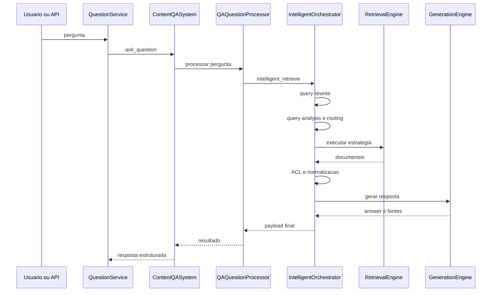

# Manual técnico e operacional: Pipeline RAG completo

## 1. Escopo e fonte de verdade

Este documento descreve o pipeline RAG completo com base no código real lido nesta sessão. A documentação existente do repositório não foi usada como fonte de verdade para comportamento. Onde algum ponto de estado da arte não pôde ser confirmado no código lido, ele é marcado como não confirmado.

O foco técnico aqui é cobrir:

- como o corpus é produzido,
- como a pergunta entra,
- como o retrieval é decidido e executado,
- como a resposta é gerada,
- quais configurações mudam o comportamento,
- como diagnosticar falhas reais.

## 2. Visão geral do fluxo técnico

O diagrama mostra só a metade online da inferência. O retrieval depende de uma metade offline ou assíncrona anterior: a produção do corpus.

## 3. Pipeline de produção do corpus

### 3.1. Entrada da ingestão

O ponto de entrada lido é a classe IngestionService. Ela registra início, monta o IngestionRequest, pode avaliar fanout por documento e delega a execução ao ContentIngestionOrchestrator.

O que essa etapa recebe:

- YAML completo,
- contexto de tenant e sessão,
- parâmetros de paralelismo documental,
- callback opcional de progresso.

O que ela entrega:

- payload final de execução da ingestão com análise de resultado,
- correlation_id,
- snapshot do runtime moderno extraído da configuração.

Valor técnico: separar a fachada operacional do pipeline interno de ingestão.

### 3.2. Resolução de fontes e clientes

O slice lido da IngestionService mostra que a requisição usa resolvers especializados para múltiplas fontes, como local, S3, Azure Blob, Google Drive, fontes dinâmicas, scraping e YouTube. A ContentClientFactory registra clientes builtin por tipo de conteúdo e a ContentProcessorFactory seleciona o processador adequado.

O ponto importante aqui é que o pipeline não trata tudo como arquivo genérico. Ele resolve tipo de conteúdo e só então escolhe cliente e processador.

### 3.3. Contrato de chunk

O contrato comum do ecossistema RAG está em src/shared/rag_contracts/data_models.py e src/shared/rag_contracts/metadata.py.

O que fica explícito:

- ContentChunk exige conteúdo não vazio, document_id, chunk_index válido e source_type.
- Os metadados passam por normalização canônica, reduzindo divergência entre ingestão, retrieval e exibição de fontes.

Na prática, isso evita que cada processador invente seu próprio formato de metadado relevante.

### 3.4. Chunking por tipo de conteúdo

#### Texto simples

O TxtContentProcessor usa chunk_size, chunk_overlap, max_chunks_per_document e separador de parágrafo. Ele tenta primeiro o caminho de paragraph_group. Se não houver separador de parágrafo útil ou se não forem gerados chunks válidos, cai para sentence_group.

O que isso significa na prática:

- o pipeline preserva estrutura quando ela existe,
- mas não bloqueia o processamento quando essa estrutura é fraca.

#### PDF

O PDF não usa um chunking único. O PdfChunkingService registra uma sequência de estratégias ordenadas. Quando page boundaries e preservação de estrutura estão habilitados, a estratégia por página entra primeiro. Depois vêm seção, parágrafo e sentença. Se nenhuma estratégia conseguir produzir chunks úteis, o serviço cria fallback chunks.

O que isso significa na prática:

- PDFs estruturados podem manter mais contexto organizacional,
- PDFs ruins ou heterogêneos ainda passam por fallback controlado,
- o pipeline registra qual estratégia foi usada.

#### Multimodalidade em PDF

O slice lido do PdfContentProcessor confirma:

- reaproveitamento de conteúdo textual quando já existe,
- extração de texto de bytes crus quando necessário,
- OCR básico opcional para páginas vazias ou PDFs sem texto,
- suporte a extração visual antes do chunking final.

Não foi confirmado no código lido um retrieval multimodal de late interaction ou multi-vector no runtime de consulta, mas a ingestão PDF já prepara sinais ricos de conteúdo.

### 3.5. Persistência e geração ativa

O DocumentPersistenceManager é a peça central da metade corpus. O slice lido confirma:

- conceito de prepared generation para sobrescrita controlada,
- resolução de physical_vector_target e physical_bm25_target,
- bootstrap de dataset e manifesto,
- persistência de documentos, páginas, imagens e chunks,
- chamada explícita de prepare_for_ingestion no vector store,
- indexação dos chunks e sincronismo com BM25.

Isso é tecnicamente importante porque o projeto não trata vetorial e lexical como pipelines independentes. Eles aparecem como conjunto operacional coordenado.

## 4. Pipeline de pergunta e resposta

### 4.1. Entry point HTTP e serviço de pergunta

O router de RAG delega a pergunta para o serviço de runtime compatível, que usa QuestionService como fachada reutilizável. Esse serviço:

- inicializa o ContentQASystem,
- aplica timeout guard,
- executa ask_question,
- analisa qualidade da resposta,
- extrai métricas de retrieval,
- enriquece fontes e telemetria.

### 4.2. ContentQASystem e montagem do runtime

O ContentQASystem não assume um runtime implícito. Ele passa pela montagem formal do QARuntimeAssembly e do QASetupManager.

O que o slice lido confirmou:

- validação do layout moderno,
- setup de LLM via resource pool,
- setup de embeddings,
- setup de vector store,
- criação de chain LCEL,
- acoplamento opcional com histórico de mensagens e memória persistente do usuário,
- setup do pipeline inteligente.

### 4.3. QAQuestionProcessor

O QAQuestionProcessor é o boundary técnico da pergunta dentro da camada QA. Ele:

- valida entrada,
- resolve include_sources,
- valida security_keys,
- falha fechado se o runtime moderno obrigatório não estiver disponível,
- encaminha a consulta ao intelligent_orchestrator quando o pipeline inteligente está ativo.

## 5. Execução do pipeline inteligente

### 5.1. Ordem real da execução

O método intelligent_retrieve mostra a ordem principal da inferência online.

1. Validar a pergunta.
2. Resolver top_k a partir do YAML.
3. Registrar início do pipeline e telemetria.
4. Inicializar lazy components na primeira execução.
5. Executar query rewrite.
6. Analisar a pergunta e gerar routing decision.
7. Executar a estratégia escolhida.
8. Aplicar ACL e normalização dos documentos.
9. Montar o resultado final, incluindo geração com LLM.
10. Anexar retrieval_trace e token_usage quando existirem.

Essa ordem importa porque separa claramente preprocessamento da pergunta, retrieval, pós-retrieval e geração.

### 5.2. Query rewrite

O QueryRewriter lê sua configuração de qa_system.query_rewrite. O slice lido confirma estes controles:

- enabled,
- enable_paraphrase,
- enable_correction,
- enable_expansion,
- max_variations,
- min_similarity,
- max_output_chars,
- retry_attempts e janela de backoff.

O comportamento relevante é este:

- se estiver desabilitado, a pergunta passa intacta,
- se não houver LLM, a pergunta passa intacta com motivo explícito,
- se a reescrita gerada ficar abaixo do threshold de similaridade, o sistema rejeita a reescrita e usa a original.

Isso evita uma expansão agressiva que distorça a intenção do usuário.

### 5.3. Query analysis e adaptive routing

O QueryAnalyzer extrai:

- query_type,
- data_type,
- domain,
- entities,
- keywords,
- complexity,
- intent,
- technical_terms,
- hints de contexto.

O AdaptiveQueryRouter usa esses sinais e a configuração de rag_system.retriever.hybrid.adaptive_router.decision_strategy para decidir a RetrievalStrategy. O slice lido confirma thresholds para hybrid, bm25 e semantic, além de default_strategy, log_decisions e include_analysis_in_response.

Observação importante: o AdaptiveQueryRouter ainda aplica um fallback local de vector_store default para conseguir inicializar. Isso existe no código lido e precisa ser entendido como proteção do componente, não como contrato ideal do produto.

### 5.4. RoutingDecision

Depois da análise, o pipeline produz uma RoutingDecision com:

- processor_type,
- retriever_strategy,
- confidence,
- should_expand_query,
- requires_fusion,
- fallback_processor,
- query_features.

Esse objeto governa a execução concreta da etapa seguinte.

## 6. Estratégias de retrieval confirmadas no código

### 6.1. Retrieval tradicional

É o caminho padrão quando não há necessidade de processamento mais especializado. O engine tenta, em ordem, retrievers como vector_search, semantic_search e default.

Quando encontra um retriever disponível:

- executa com run_retriever_with_trace,
- registra telemetria e tentativa,
- pode enriquecer o resultado com FTS.

### 6.2. Hybrid processor

O execute_hybrid_processor confirma um fluxo em camadas.

1. Avalia se hybrid está desligado.
2. Avalia se o vector store suporta hybrid nativo.
3. Enriquece a query com technical_terms quando fizer sentido.
4. Tenta native_hybrid_search se o modo e o backend permitirem.
5. Se falhar ou não for possível, cai para o hybrid retriever manual.
6. Após isso, ainda pode enriquecer com FTS.

O resultado prático é um hybrid que não assume que todo backend sabe fazer a mesma coisa.

### 6.3. Self-query processor

O execute_self_query_processor confirma dois caminhos.

- Primeiro tenta um resolvedor de domínio, se ele estiver habilitado e detectar necessidade de busca estruturada.
- Se isso não produzir documentos úteis, tenta o retriever self_query registrado.
- Se ele não existir, cai para o retrieval tradicional.

Isso mostra que self-query é tratado como capacidade especializada, não como default universal.

### 6.4. Multi-query processor

O execute_multi_query_processor confirma três possibilidades.

- usar o multi_query_retriever já configurado,
- instanciar um retriever temporário com base vetorial + LLM,
- ou cair para retrieval tradicional.

O MultiQueryRetriever configurável usa:

- max_expansions,
- expansion_strategy,
- parallel_execution,
- deduplication_threshold,
- max_concurrent_queries,
- query_timeout_seconds,
- cache de expansões.

### 6.5. JSON specialized processor

O slice lido mostra que o runtime ainda tem um caminho especializado para JSON e Excel estruturado. Esse caminho tenta processadores JSON específicos antes de desistir para o tradicional.

O valor técnico desse slice é separar casos em que texto livre não é a melhor representação da resposta.

### 6.6. FTS enrichment

Embora o slice completo de _maybe_enrich_with_fts não tenha sido aberto integralmente nesta sessão, o retrieval engine e o resolvedor de configuração confirmam que existe FTS configurável e acoplado ao retrieval moderno.

O que está confirmado:

- FTS lê de rag_system.retriever.fts,
- há configuração de pool e modo,
- o engine considera FTS como camada complementar da recuperação.

## 7. BM25, fusão e reranking

### 7.1. BM25 vocabulary snapshot

O RetrievalEngine.merge_bm25_vocabulary_config confirma um guardrail importante.

Se BM25 está habilitado, o runtime exige:

- vector_store.id válido,
- resolução do target físico BM25,
- carregamento do snapshot de vocabulário da geração ativa.

Se isso falhar, o sistema registra o motivo e pode lançar erro explícito. Isso é coerente com a filosofia de evitar corpus lexical invisivelmente quebrado.

### 7.2. Fusion

O HybridFusion confirma suporte a:

- linear,
- RRF,
- Weighted RRF,
- interleaved,
- score_normalized.

O resolvedor de configuração confirma pesos, k do RRF e opções gerais de deduplicação, final_top_k, threshold de similaridade e score mínimo.

### 7.3. Reranking neural

O NeuralReranker usa cross-encoder, pode combinar neural_score com feedback_score e vision_score, e registra o score final no documento.

Isso coloca o projeto acima do retrieval ingênuo, porque existe uma etapa explícita de reordenação antes da geração.

## 8. Cache semântico

O SemanticQueryCache confirma:

- backend configurável entre redisearch, qdrant, azure_search e disabled,
- threshold de distância,
- TTL,
- max_items,
- controle explícito de enable/disable reason,
- métricas de hit e miss.

O orchestrator consulta o cache antes do retrieval em retrievers elegíveis e também tenta persistir o resultado depois.

Na prática, isso significa:

- menos latência para consultas parecidas,
- maior necessidade de observabilidade para não mascarar comportamento.

## 9. Geração da resposta

### 9.1. Montagem do contexto

O GenerationEngine:

- resume presença multimodal,
- monta context_text com histórico, memória persistente e documentos,
- renderiza o prompt final,
- chama o LLM com retry externo,
- registra uso de tokens,
- formata fontes para exibição.

### 9.2. Resultado final

O _assemble_final_result confirma que o payload final pode conter:

- answer,
- sources,
- source_documents,
- routing_decision,
- pipeline_metrics,
- query_analysis,
- metadata,
- sources_formatted,
- token_usage,
- retrieval_trace.

Isso é importante para suporte porque a resposta não sai sozinha; sai acompanhada de contexto operacional.

## 10. Configurações que mais mudam o comportamento

### 10.1. rag_system.enabled

Controla se o runtime moderno de RAG pode ser montado.

Impacto: sem isso, o assembly moderno não segue.

### 10.2. rag_system.retriever.vector_store

Bloco mínimo do retriever moderno.

Impacto: ausência ou estrutura inválida quebra a montagem do runtime moderno.

### 10.3. rag_system.retriever.hybrid

Controla pesos, estratégia de combinação e decisão adaptativa do hybrid.

Impacto: muda completamente a forma como denso e lexical são combinados.

### 10.4. rag_system.retriever.fts

Controla o FTS complementar.

Impacto: muda a capacidade de enriquecimento textual fora do vector store.

### 10.5. rag_system.retriever.caching

Controla cache semântico.

Impacto: muda latência, custo e potencial de reaproveitamento.

### 10.6. qa_system.query_rewrite

Controla reescrita da pergunta.

Impacto: muda recuperabilidade antes do retrieval.

### 10.7. qa_system.reranker

Controla reranking neural.

Impacto: muda a ordem final do contexto entregue ao LLM.

### 10.8. intelligent_pipeline.multi_query

Controla expansão por múltiplas consultas.

Impacto: muda cobertura e custo do retrieval.

## 11. Contratos, entradas e saídas

### 11.1. Entrada online

Entrada principal confirmada: pergunta entregue ao pipeline via router de RAG e QuestionService.

Invariantes observadas:

- pergunta não pode estar vazia,
- runtime moderno precisa estar disponível quando exigido,
- security keys são validadas no boundary de QA,
- top_k é resolvido de forma canônica.

### 11.2. Entrada offline de corpus

Entrada principal confirmada: YAML de ingestão traduzido para IngestionRequest.

Invariantes observadas:

- a requisição carrega tenant, vectorstore_id e contexto de execução,
- o modo single_document reduz paralelismo e muda decisão de fanout,
- clientes e processadores são escolhidos por tipo de conteúdo.

### 11.3. Saída do runtime de resposta

Saída confirmada:

- resposta textual,
- documentos e fontes usadas,
- decisão de roteamento,
- métricas e análise da query,
- metadados adicionais de contexto e token usage.

## 12. O que acontece em caso de sucesso

No caminho feliz:

1. o corpus está consistente,
2. a pergunta é analisada,
3. a estratégia correta é escolhida,
4. a evidência é recuperada,
5. a ACL deixa passar só o que pode ser usado,
6. o LLM recebe contexto relevante,
7. a resposta volta com fontes e metadados.

## 13. O que acontece em caso de erro

### 13.1. Erros de contrato e configuração

Exemplos confirmados no código lido:

- query vazia,
- configuração obrigatória ausente do retriever moderno,
- vectorstore_id vazio quando BM25 exige vocabulário ativo,
- LLM indisponível na geração inteligente.

Resposta do sistema: falha explícita, com log e telemetria do passo afetado.

### 13.2. Falhas localizadas com fallback operacional

Exemplos confirmados:

- hybrid nativo pode falhar e cair para hybrid manual,
- self-query pode falhar e cair para retrieval tradicional,
- multi-query pode falhar e cair para retrieval tradicional,
- processador JSON pode cair para o tradicional quando indisponível.

Resposta do sistema: fallback localizado, nunca usado para esconder contrato estrutural ausente do runtime moderno.

## 14. Observabilidade e diagnóstico

### 14.1. Onde começar a investigar

Para problema de resposta ruim, a ordem mais útil é esta.

1. Verificar routing_decision.
2. Verificar retrieval_trace.
3. Verificar query_analysis.
4. Verificar ACL e quantidade de documentos negados.
5. Verificar sources efetivamente usadas.
6. Verificar pipeline_metrics e llm_generation_time.

### 14.2. Como diferenciar causas

#### Erro de entrada

Sintoma: pergunta rejeitada cedo.

Evidência: validação no início de intelligent_retrieve ou no QAQuestionProcessor.

#### Erro de configuração

Sintoma: falha logo na montagem do runtime ou no carregamento do vocabulário BM25.

Evidência: logs de configuração obrigatória ausente e razões explícitas do BM25.

#### Erro de retrieval

Sintoma: poucos documentos, documentos errados ou queda para fallback localizado.

Evidência: retrieval_trace, logs do retriever e processor_type escolhido.

#### Erro de ACL

Sintoma: retrieval encontra documentos, mas a resposta sai pobre ou vazia.

Evidência: allowed_count e denied_count no passo de access_control.

#### Erro de geração

Sintoma: documentos existem, mas a resposta falha ou sai insuficiente.

Evidência: logs da GenerationEngine, llm_generation_time e exceções de generate_intelligent_answer.

## 15. Troubleshooting

### Sintoma: hybrid parece não usar sparse/lexical

Causa provável: modo híbrido desligado, backend sem suporte nativo ou queda para caminho manual/tradicional.

Como confirmar: verificar rag_hybrid_search_mode, rag_native_hybrid_supported, rag_sparse_query_used e retrieval_trace.

### Sintoma: BM25 habilitado, mas sem efeito real

Causa provável: vectorstore_id inválido, target físico não resolvido ou vocabulário ausente para a geração ativa.

Como confirmar: procurar bm25_vocabulary_loaded e bm25_vocabulary_reason nos logs.

### Sintoma: resposta veio sem documentos relevantes

Causa provável: chunking ruim, corpus desatualizado, roteamento inadequado ou ACL restritiva.

Como confirmar: cruzar retrieval_trace, query_analysis e access_control.

### Sintoma: query rewrite parece piorar a consulta

Causa provável: threshold de similaridade baixo demais ou política excessivamente expansiva.

Como confirmar: comparar original_query, rewritten_query, applied e similarity no resultado da reescrita.

### Sintoma: cache entrega comportamento estranho

Causa provável: reuse de consulta semanticamente próxima com TTL ainda válido.

Como confirmar: verificar semantic_cache_lookup hit ou miss e filtros aplicados.

## 16. Comparação técnica com estado da arte

Com base nas referências externas consultadas e no código lido, o projeto já implementa boa parte do que hoje caracteriza RAG avançado operacional.

### 16.1. Alinhamentos fortes

- query preprocessing antes do retrieval,
- roteamento adaptativo,
- retrieval híbrido com fusão formal,
- reranking neural,
- cache semântico,
- chunking adaptado ao tipo de conteúdo,
- versionamento operacional do corpus.

### 16.2. Alinhamentos parciais

- multimodalidade mais rica de consulta não confirmada no runtime online,
- decomposição explícita de subperguntas não confirmada,
- validação pós-resposta não confirmada.

### 16.3. Lacunas não confirmadas no código lido

- índices hierárquicos summary-to-detail,
- sample questions por chunk para alignment optimization,
- pipeline explícito de golden dataset e avaliação contínua do RAG,
- rescoring coarse-to-fine com representações vetoriais distintas no runtime online.

## 17. Como colocar para funcionar

O caminho de execução confirmado no código lido é o boundary HTTP de RAG acionando o QuestionService e a fachada de ingestão acionando o ContentIngestionOrchestrator.

O que ficou confirmado:

- existe router de RAG,
- existe serviço de pergunta reutilizável,
- existe serviço de ingestão oficial,
- o runtime depende do YAML moderno e de vector_store.id válido.

Caminho operacional completo por comando de terminal não foi confirmado neste documento a partir dos arquivos lidos.

## 18. Explicação 101

Pense no pipeline como duas máquinas que se encaixam.

- A primeira máquina pega documentos, limpa, corta, etiqueta e organiza tudo em catálogos diferentes.
- A segunda máquina recebe a pergunta, decide qual catálogo consultar e em qual ordem, pega só as partes mais úteis e então pede ao modelo para escrever a resposta.

Se qualquer uma das duas máquinas for mal configurada, a resposta final sofre.

## 19. Checklist de entendimento

- Entendi a diferença entre produção de corpus e inferência.
- Entendi como o chunking muda por tipo de conteúdo.
- Entendi por que BM25 e vetor coexistem.
- Entendi como query rewrite e query analysis influenciam o retrieval.
- Entendi quais estratégias de retrieval existem no código.
- Entendi onde entram ACL, cache e reranking.
- Entendi quais configurações mais alteram o comportamento.
- Entendi como investigar falha por etapa.

## 20. Evidências no código

- src/api/routers/rag_router.py
  - Motivo da leitura: boundary HTTP do RAG.
  - Símbolo relevante: ask_question.
  - Comportamento confirmado: delegação ao runtime de pergunta.
- src/services/question_service.py
  - Motivo da leitura: fachada da pergunta.
  - Símbolo relevante: execute.
  - Comportamento confirmado: inicialização do ContentQASystem, timeout, telemetria e enriquecimento de fontes.
- src/qa_layer/content_qa_system.py
  - Motivo da leitura: montagem do sistema QA.
  - Símbolo relevante: ask_question e inicialização.
  - Comportamento confirmado: uso do QARuntimeAssembly e QASetupManager.
- src/qa_layer/qa_question_processor.py
  - Motivo da leitura: boundary técnico da pergunta.
  - Símbolo relevante: ask_question.
  - Comportamento confirmado: validação, include_sources, security_keys e chamada do intelligent_orchestrator.
- src/qa_layer/rag_engine/intelligent_orchestrator.py
  - Motivo da leitura: orquestração ponta a ponta da inferência.
  - Símbolo relevante: intelligent_retrieve e método de montagem do resultado final.
  - Comportamento confirmado: rewrite, routing, retrieval, ACL, geração e payload final.
- src/qa_layer/rag_engine/retrieval_engine.py
  - Motivo da leitura: execução concreta de estratégias.
  - Símbolo relevante: execute_hybrid_processor, execute_self_query_processor, execute_multi_query_processor.
  - Comportamento confirmado: hybrid nativo/manual, self-query, multi-query e trace de retrieval.
- src/qa_layer/rag_engine/generation_engine.py
  - Motivo da leitura: geração final.
  - Símbolo relevante: generate_intelligent_answer.
  - Comportamento confirmado: montagem de contexto, chamada ao LLM e registro de token usage.
- src/ingestion_layer/processors/txt_processor.py
  - Motivo da leitura: chunking de texto simples.
  - Símbolo relevante: _split_into_chunks.
  - Comportamento confirmado: preferência por parágrafo e fallback para sentença.
- src/ingestion_layer/processors/pdf_chunking_service.py
  - Motivo da leitura: chunking avançado de PDF.
  - Símbolo relevante: create_chunks.
  - Comportamento confirmado: strategy loop, fallback e telemetria do chunking PDF.
- src/ingestion_layer/document_persistence_manager.py
  - Motivo da leitura: persistência e indexação do corpus.
  - Símbolo relevante: prepare_for_ingestion e indexação de chunks.
  - Comportamento confirmado: geração ativa, persistência de manifesto e sincronismo vetorial/BM25.
