# README-METODOLOGIA-DESENV-ARTEFATOS-GITHUB

Este documento explica a intenção dos artefatos de governança em `.github`.

O objetivo não é reproduzir o conteúdo de cada arquivo. O objetivo é explicar a
engenharia por trás deles: que decisão cada um governa, como se combinam e como
entram no desenvolvimento assistido por Copilot.

## Visão geral

A pasta `.github` funciona como o sistema operacional do Copilot neste
repositório.

Ela define:

- como o Copilot deve pensar;
- quais papéis especializados existem;
- quais regras valem para Python, HTML, YAML, shell e documentação;
- como registrar erro real;
- como registrar regressão;
- como registrar lição aprendida;
- como registrar tarefa finalizada;
- como auditar instruções ruins.

Em linguagem simples: `.github` é o manual de conduta da IA dentro do projeto.

## Mapa conceitual

## `copilot-instructions.md`

Este é o contrato global.

Ele governa a postura do Copilot em qualquer tarefa: evidência antes de
invenção, arquitetura correta, testes obrigatórios, logs com história completa,
YAML como contrato, tools como catálogo interno, separação entre API, worker,
scheduler e UI, e disciplina de validação.

O valor de engenharia desse arquivo é criar uma “constituição” do repositório.
Quando outro arquivo for específico demais ou ambíguo, ele fornece os princípios
de desempate: não inventar, ler o código, testar, registrar e explicar.

## `instructions/*.md`

Esses arquivos são regras por tipo de artefato.

Eles existem porque uma mudança Python, uma mudança HTML, uma mudança YAML e uma
mudança shell têm riscos diferentes.

### `python.instructions.md`

Governa backend, testes Python e disciplina de suíte.

Seu papel é impedir que código Python seja criado fora dos padrões do projeto:
tipagem, testes, retry, logs, uso de `.venv`, suíte oficial e proibição de
contornos frágeis.

Na metodologia, ele entra sempre que a tarefa tocar código Python ou testes.

### `html.instructions.md`

Governa UI estática, JavaScript, contratos visuais e auditoria real no browser.

Seu papel é impedir que uma tela seja tratada como HTML solto. A UI deve seguir
contratos de usabilidade, acessibilidade, API, correlation_id e validação visual.

Na metodologia, ele entra sempre que uma tarefa tocar `app/ui/**`.

### `yaml.instructions.md`

Governa YAML como contrato operacional.

Seu papel é impedir chave órfã, estrutura divergente, bypass da AST agentic e
parâmetro que existe no arquivo mas não é honrado pelo runtime.

Na metodologia, ele entra sempre que a tarefa tocar YAML, agentes, workflows,
supervisores, DeepAgent ou configuração.

### `docs.instructions.md`

Governa documentação em `docs/`.

Seu papel é manter documentação didática, organizada, sem dispersão de assunto e
voltada para consultor ou desenvolvedor júnior.

Na metodologia, ele entra sempre que o Copilot cria ou altera documentação.

### `sh.instructions.md`

Governa scripts shell.

Seu papel é pequeno, mas importante: manter permissão de execução e validar que
scripts continuam executáveis.

Na metodologia, ele entra quando a tarefa cria ou altera `.sh`.

## `agents/*.agent.md`

Os agents representam papéis de trabalho.

Eles não são só estilos de conversa. Cada agent define escopo, limite, forma de
validação e responsabilidade.

### `investigar`

Papel: arqueólogo e auditor.

Quando usar: quando ainda não está claro onde está o problema, como a feature
funciona ou quais arquivos são responsáveis.

Engenharia: evita implementação precoce. Primeiro lê, mapeia, encontra lacunas e
gera plano executável.

### `planejar`

Papel: planejador de mudança.

Quando usar: antes de uma implementação relevante, refatoração, evolução ou
mudança com risco.

Engenharia: transforma evidência em tarefas pequenas, ordenadas e verificáveis.
Ele não é executor; ele prepara o caminho para o executor.

### `implementar`

Papel: executor técnico governado.

Quando usar: quando já existe objetivo claro e a tarefa precisa ser realizada.

Engenharia: combina leitura, edição, testes, logs, registro de tarefa e relatório
final. É o agente que materializa código, documentação e validação.

### `corrigir-erros-com-log`

Papel: depurador forense.

Quando usar: quando existe erro real, log, stack trace, `correlation_id` ou
comportamento anômalo em runtime.

Engenharia: cruza log e código. Se o log não prova a história, ele instrumenta e
pede nova execução. A correção precisa eliminar a causa raiz.

### `criar-testes`

Papel: engenheiro de qualidade para nova cobertura.

Quando usar: quando falta proteção automatizada para uma área de risco.

Engenharia: cria teste por valor real, não por vaidade de cobertura. Evita mocks
mentirosos e congela contratos relevantes.

### `executar-testes`

Papel: estabilizador de suíte.

Quando usar: quando o problema principal é fazer a suíte ficar verde.

Engenharia: lê artefatos de falha, decide se o problema é no código ou no teste,
faz correção mínima e repete até estabilizar.

### `documentar`

Papel: documentador técnico.

Quando usar: quando a mudança precisa virar manual, guia ou explicação didática.

Engenharia: atualiza documentação com base no comportamento real, evitando
duplicidade e explicações superficiais.

### `tutorial-101`

Papel: professor do repositório.

Quando usar: quando o objetivo é onboarding didático sobre um tema técnico.

Engenharia: transforma leitura do código em aula guiada, com glossário,
diagramas, fluxo real, status de maturidade e exercícios.

### `sincronizar-documentacao`

Papel: sincronizador entre docs e runtime.

Quando usar: quando há risco de documentação desatualizada ou assunto espalhado.

Engenharia: força comparação entre docs e código, consolidando documento dono e
registrando lacunas.

### `inventario-yaml`

Papel: auditor YAML contra código.

Quando usar: quando o risco está em chaves YAML órfãs, ausentes, duplicadas ou
desalinhadas com AST.

Engenharia: trata YAML como contrato rastreável, não como texto livre.

### `validar-instructions`

Papel: auditor da própria governança Copilot.

Quando usar: quando as instruções parecem contraditórias, vagas ou inúteis.

Engenharia: impede que o sistema de governança apodreça. Problemas vão para
`bad-instructions`.

## `skills/*.md`

Skills são guias operacionais complementares.

Eles entram quando o Copilot precisa de um modo de trabalho mais específico.

- `planejar`: reforça planejamento sem execução.
- `refatorar`: reforça mudança segura, leitura prévia, teste e causa raiz.
- `testar`: define classificação da tarefa e amplitude de validação.
- `testes-criar` e `testes-executar`: existem como artefatos, mas estão vazios;
  essa lacuna já está registrada em `bad-instructions`.

Na prática, skills são camadas de procedimento. Agents definem o papel; skills
detalham como executar aquele tipo de trabalho.

## Registros de governança

### `lessons-instructions.md`

Guarda aprendizados recorrentes.

Ele existe para que uma correção explícita do usuário, um erro de interpretação
ou uma descoberta importante não se perca na conversa.

### `bad-instructions.md`

Guarda problemas nas próprias instruções.

Ele existe porque a governança também pode ter bug: conflito, ambiguidade,
instrução vazia, regra ampla demais ou regra contraditória.

### `error-backlog-instructions.md`

Guarda erros reais de produto.

Ele existe para transformar incidente em memória operacional. Um erro real não
deve sumir depois da correção local.

### `regression-logs-instructions.md`

Guarda erros recorrentes.

Ele existe para impedir repetição de correções fracas. Se o erro voltou, a
abordagem anterior precisa ser questionada.

### `error-log-instruction.md`

É um registro histórico mais antigo de erros.

Ele ajuda a entender a evolução do processo, mas o fluxo atual mais forte está
no backlog de erros e nos logs de regressão.

### `tarefas-executadas.md`

É o diário de fechamento.

Ele registra tipo da tarefa, alterações, impacto, testes, resultado e status.
Na metodologia, ele é a prova documental de que a tarefa não terminou apenas no
chat.

### `README-badges.md`

É um apoio para comunicação de status do projeto.

Na metodologia, ele tem papel secundário: ajuda a exibir sinais de qualidade,
mas não substitui leitura dos artefatos reais da suíte.

## Como escolher o artefato certo

Use esta regra simples:

- não sei o que acontece: `investigar`;
- sei o que quero, mas não sei o plano: `planejar`;
- quero executar mudança: `implementar`;
- tenho erro e log: `corrigir-erros-com-log`;
- falta teste: `criar-testes`;
- a suíte falhou: `executar-testes`;
- preciso manual técnico: `documentar`;
- preciso aula 101: `tutorial-101`;
- docs e código podem estar divergentes: `sincronizar-documentacao`;
- YAML pode estar inconsistente: `inventario-yaml`;
- instrução parece ruim: `validar-instructions`.
