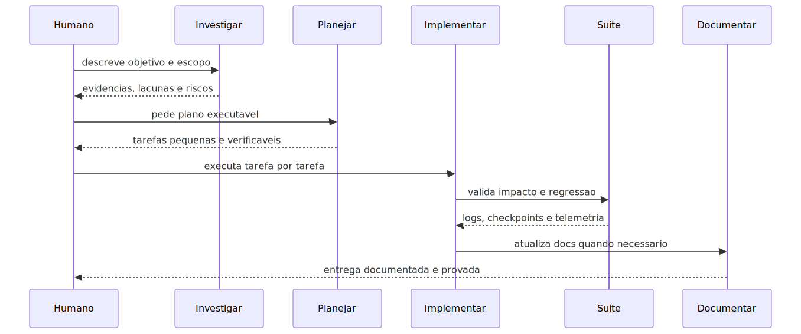

# README-METODOLOGIA-DESENV-FLUXOS-TRABALHO

Este documento mostra como usar a metodologia em processos reais de
desenvolvimento.

Ele parte da ideia de que o desenvolvedor pode conduzir o trabalho por Copilot
sem escrever código manualmente. Para isso funcionar, ele precisa acionar o
papel certo na hora certa.

## Fluxo 1: nova implementação

Use quando existe uma feature nova ou uma evolução clara.

### Processo da implementação

1. Comece com `investigar`.

   Peça para localizar onde a nova capacidade deveria entrar, quais contratos
   existem, quais módulos são donos do assunto e quais testes protegem o fluxo.

2. Passe para `planejar`.

   O plano deve quebrar a implementação em tarefas pequenas, com dependências,
   critérios de aceite, riscos, rollback e validação.

3. Execute com `implementar`.

   O executor lê os arquivos, cria ou ajusta testes, implementa em fatias,
   valida com a suíte e registra o resultado.

4. Use `documentar` ou `tutorial-101`.

   Se a feature muda uso, operação ou onboarding, a documentação entra no mesmo
   ciclo. Feature sem documentação suficiente fica difícil de manter.

### Diagrama

## Fluxo 2: correção de erro com log

Use quando há erro real de execução, warning relevante, fallback inesperado,
default suspeito ou comportamento anômalo.

### Processo da correção

1. Reproduza ou observe a falha.

   O ideal é obter `correlation_id`, log do processo, stack trace ou saída da
   suíte.

2. Acione `corrigir-erros-com-log`.

   Esse agente não deve chutar causa. Ele lê o log, extrai erros, warnings,
   fallbacks, estatísticas e eventos relevantes.

3. Faça cara a crachá com o código.

   O log mostra o que aconteceu. O código mostra por que aconteceu. A correção
   só é válida quando os dois contam a mesma história.

4. Se o log não provar a causa, instrumente.

   A metodologia prefere adicionar observabilidade e pedir nova execução a
   corrigir por hipótese.

5. Corrija a causa raiz.

   Não crie fallback escondido, stub ou contorno para esconder o erro.

6. Registre o erro se for produto.

   Erro real vai para `error-backlog`. Se for recorrente, também vai para
   `regression-logs`.

### Diagrama da correção

## Fluxo 3: refatoração segura

Use quando a mudança reorganiza código existente, elimina duplicação, remove
legado ou melhora arquitetura.

### Processo da refatoração

1. Comece por `investigar` se o escopo não estiver totalmente claro.

   Refatoração sem mapa de chamadores vira risco.

2. Use `planejar` para dividir a mudança.

   O plano deve dizer o que não pode mudar, quais contratos serão preservados e
   quais testes provam isso.

3. Se faltar cobertura, use `criar-testes` antes.

   A metodologia aceita teste de caracterização quando o objetivo é preservar
   comportamento atual antes de melhorar estrutura.

4. Execute com `implementar`.

   A refatoração deve ser incremental, com validações proporcionais ao impacto.

5. Se encontrar código morto ou fluxo paralelo, prove antes de remover.

   Busca, leitura e testes precisam mostrar que a remoção é segura.

## Fluxo 4: estabilização de suíte

Use quando a tarefa é fazer a suíte voltar a ficar verde.

### Processo de estabilização

1. Acione `executar-testes`.

2. Leia a telemetria da última rodada.

3. Identifique etapa, teste, arquivo e assinatura do erro.

4. Reproduza no menor escopo confiável.

5. Decida se a falha é bug no código ou teste obsoleto.

6. Corrija com a menor mudança correta.

7. Volte para a suíte oficial.

Esse fluxo é importante porque o objetivo não é “passar localmente”. O objetivo
é estabilizar o contrato do repositório.

## Fluxo 5: documentação e tutorial 101

Use quando uma capacidade precisa ser ensinada.

### Documento técnico

Acione `documentar` quando o objetivo for manual técnico, guia de uso, contrato
operacional ou atualização de uma documentação existente.

O agente deve evitar duplicidade, procurar documento dono e escrever para
consultor ou desenvolvedor júnior.

### Tutorial 101

Acione `tutorial-101` quando o objetivo for onboarding didático.

O tutorial deve explicar conceito, analogia, mapa do repo, fluxo real,
diagramas, status de maturidade, erros comuns e exercícios.

## Fluxo 6: sincronização de documentação

Use quando você suspeita que docs e runtime divergiram.

O agente `sincronizar-documentacao` faz uma auditoria maior: localiza docs,
compara com código e atualiza documento dono. Ele também deve registrar lacunas
quando algo não foi encontrado no código.

Esse fluxo evita que a documentação vire memória histórica falsa.

## Fluxo 7: alteração YAML ou agentic

Use quando o trabalho toca YAML, Supervisor, DeepAgent, Workflow, tools ou AST
agentic.

### Processo para YAML e agentic

1. Acione `investigar` para localizar onde o YAML é lido, validado e executado.

2. Se a dúvida for inventário ou divergência, acione `inventario-yaml`.

3. Se houver alteração de contrato, use `planejar` antes de implementar.

4. Execute com `implementar`, atualizando código, AST, parser, validador,
   documentação e testes quando aplicável.

5. Valide com suíte e checagens documentais específicas quando o escopo exigir.

Em linguagem simples: YAML não é exemplo. YAML é contrato.

## Fluxo 8: alteração de UI

Use quando a tarefa toca `app/ui/**`.

### Processo para UI

1. Leia `html.instructions.md`.

2. Investigue o contrato real do endpoint pelo Swagger ou pelo código de API.

3. Não duplique comunicação com backend; use os helpers compartilhados.

4. Implemente estados de loading, erro, vazio, sucesso e sucesso parcial quando
   fizer sentido.

5. Rode testes frontend compatíveis e a suíte oficial aplicável.

6. Faça auditoria visual real no browser quando a mudança for visual.

UI neste projeto não é enfeite. Ela é parte do contrato operacional.

## Fluxo 9: validação das próprias instruções

Use quando o Copilot parecer preso entre regras contraditórias ou quando uma
instrução atrapalhar o trabalho.

Acione `validar-instructions`.

Esse agente audita `.github/agents`, `.github/instructions`, `.github/skills`,
`lessons` e `copilot-instructions`. Problemas entram em `bad-instructions`.

Esse fluxo é essencial: uma metodologia governada por instruções precisa manter
as próprias instruções saudáveis.

## Tabela de decisão rápida

| Situação | Primeiro agente | Depois |
| --- | --- | --- |
| Não sei onde mexer | `investigar` | `planejar` |
| Sei a feature, mas não o caminho | `planejar` | `implementar` |
| Tenho log de erro | `corrigir-erros-com-log` | `implementar` se necessário |
| Preciso só de testes novos | `criar-testes` | `executar-testes` |
| A suíte quebrou | `executar-testes` | `implementar` se o bug for real |
| Quero manual técnico | `documentar` | `sincronizar-documentacao` se houver drift |
| Quero aula para júnior | `tutorial-101` | `documentar` para links centrais |
| YAML parece inconsistente | `inventario-yaml` | `planejar` |
| Instrução parece ruim | `validar-instructions` | ajustar governança |

## Regra final de uso

Não pule etapas por pressa.

Se a tarefa é simples, o Copilot pode investigar, implementar e validar na mesma
iteração. Se a tarefa tem risco, divida em agentes. A metodologia foi feita para
que a IA trabalhe mais, não para que a governança trabalhe menos.
