# README-METODOLOGIA-DESENV-GOVERNANCA-COPILOT

Este documento explica a engenharia da metodologia de desenvolvimento assistido
por Copilot neste repositório.

Ele não explica uma feature do produto. Ele explica como o trabalho de
desenvolvimento foi desenhado para ser conduzido por agentes, instruções,
evidências, logs, testes e registros de aprendizado.

## Ideia central

A metodologia transforma o Copilot em uma equipe de engenharia governada.

O desenvolvedor humano deixa de ser a pessoa que digita cada linha de código e
passa a ser a pessoa que define objetivo, contexto, prioridade e aceite. O
Copilot passa a executar a investigação, o plano, a implementação, a validação e
a documentação, sempre amarrado às regras do repositório.

Isso não é uma promessa de mágica. O sistema não depende de confiança cega na
IA. Ele depende de um ciclo rígido:

- ler antes de alterar;
- provar antes de concluir;
- registrar erro real;
- registrar regressão recorrente;
- atualizar documentação quando o contrato muda;
- melhorar as instruções quando elas falham.

Em linguagem simples: a IA pode escrever todo o código, mas ela não pode pular o
processo.

## O papel do humano

O humano continua essencial, mas em outro nível.

Ele deve:

- descrever o objetivo do negócio ou da correção;
- informar logs, sintomas e `correlation_id` quando houver erro real;
- escolher ou aceitar o agente adequado;
- exigir que o Copilot leia o código e prove o comportamento;
- acompanhar os testes e os registros finais;
- revisar se o resultado atende ao problema certo.

O humano não deve precisar escrever manualmente código de produção para uma
tarefa comum. A metodologia existe para que ele governe por intenção e evidência.

## O papel do Copilot

O Copilot atua como executor técnico governado.

Ele deve:

- pesquisar o escopo;
- ler os arquivos relevantes;
- identificar contratos reais;
- montar plano quando a tarefa exigir;
- implementar ou refatorar usando padrões do projeto;
- criar ou ajustar testes quando houver mudança relevante;
- rodar validações compatíveis com o impacto;
- ler logs e artefatos da suíte;
- registrar tarefa concluída ou bloqueada;
- registrar erro de produto quando a investigação encontrar um erro real.

O Copilot não deve agir por intuição. Ele só deve afirmar comportamento quando
leu o código, o log ou o contrato real aplicável.

## Os quatro pilares

### 1. Evidência antes de opinião

O repositório trata o código executável como fonte da verdade para
comportamento. Documentação e comentários ajudam a localizar intenção, mas não
provam runtime.

Na prática, isso obriga o Copilot a seguir a cadeia real: entrada, serviço,
orquestração, adapter, persistência, log e teste.

### 2. Agentes como papéis de engenharia

Cada agente representa uma função de trabalho.

`investigar` não implementa. Ele mapeia evidências e lacunas.

`planejar` não executa. Ele transforma o diagnóstico em tarefas pequenas,
ordenadas e verificáveis.

`implementar` executa, mas só depois de ler, entender impacto e validar.

`corrigir-erros-com-log` atua quando existe erro real, log e necessidade de
cara a crachá entre log e código.

Esse desenho evita que uma única interação tente fazer tudo sem rigor.

### 3. Testes como prova, não ritual

A suíte oficial é parte da metodologia. Ela não existe apenas para dizer
“passou” ou “falhou”. Ela gera evidência operacional: logs por rodada, logs por
etapa, checkpoints, histórico de erro e telemetria estruturada.

O Copilot deve usar esses artefatos para corrigir, retomar e provar ausência de
erro. O teste não é um fim burocrático; é o mecanismo que impede a IA de
encerrar uma tarefa só porque o texto parece convincente.

### 4. Aprendizado persistente

Quando um erro se repete, a metodologia não aceita tentar a mesma correção mais
uma vez. Ela exige registro em backlog, regressão e lição aprendida quando
aplicável.

Quando uma instrução é ambígua, contraditória ou vazia, ela deve ser registrada
em `bad-instructions`. Assim, a própria governança também vira objeto de
manutenção.

## Arquitetura conceitual

## Como isso permite desenvolvimento sem escrita manual de código

O ponto não é dispensar engenharia. É deslocar a engenharia para o comando do
processo.

O desenvolvedor pode pedir:

- investigue este módulo;
- planeje a correção;
- implemente a tarefa T1;
- corrija a falha da suíte;
- atualize a documentação;
- rode o gate oficial;
- registre a tarefa.

O Copilot então faz as edições necessárias. O humano não precisa abrir o arquivo
e digitar a função manualmente. Ele precisa acompanhar se a execução respeitou
as regras: leitura, evidência, testes, logs, documentação e registro.

## O que mantém a qualidade

A qualidade é mantida por redundância intencional.

- `copilot-instructions.md` define os princípios globais.
- `instructions/*.md` aplica regras específicas por tipo de arquivo.
- `agents/*.md` transforma funções de engenharia em papéis invocáveis.
- `skills/*.md` complementa o modo de trabalho em áreas como planejar,
  refatorar e testar.
- a suíte oficial prova regressão e guarda logs.
- `lessons` e `bad-instructions` impedem repetição de falhas de processo.
- backlogs de erro e regressão impedem esquecimento de incidentes.

Essa redundância é proposital: se uma camada falhar, outra deve capturar.

## Limite importante

Nenhum arquivo de instrução garante, sozinho, que toda saída da IA será correta.
O que a metodologia garante é um caminho operacional para exigir correção:
evidência, teste, log, revisão e aprendizado.

Portanto, a frase correta para onboarding é:

O desenvolvedor pode operar sem escrever código manualmente, desde que conduza o
Copilot pelo processo governado e não aceite conclusão sem prova.

## Primeiro hábito de um novo desenvolvedor

Antes de pedir código, formule o pedido como tarefa de engenharia:

- qual é o objetivo;
- qual é o sintoma ou necessidade;
- quais arquivos, logs ou telas estão envolvidos;
- qual resultado esperado comprova sucesso;
- qual risco não pode acontecer.

Depois disso, acione o agente adequado. O método começa com clareza, não com
edição.
