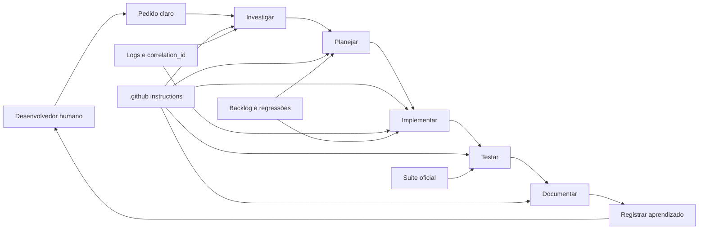

# README-METODOLOGIA-DESENV-INDICE

Este grupo de documentos explica a metodologia de desenvolvimento assistido por
Copilot usada neste repositório.

O foco aqui não é explicar as features da plataforma. O foco é explicar como um
novo desenvolvedor deve trabalhar no projeto usando Copilot, agentes, arquivos de
instrução, registros de erro, registros de lições e a suíte oficial de testes.

A ideia central é simples: o desenvolvedor humano não precisa escrever código
manualmente. Ele precisa formular bem o objetivo, escolher o agente correto,
fornecer evidência, acompanhar os gates e exigir prova. O Copilot executa a
parte mecânica de investigação, planejamento, implementação, refatoração,
documentação e testes. A qualidade vem da governança, não da confiança cega.

## Para quem é

Este material é para:

- desenvolvedores novos entrando no projeto;
- consultores técnicos que precisam pedir mudanças sem codificar manualmente;
- mantenedores que querem corrigir erro com log e evidência;
- revisores que precisam entender por que existem tantos arquivos em `.github`;
- líderes técnicos que querem padronizar o uso de IA no desenvolvimento.

## O que você deve entender ao final

Ao terminar este grupo de leitura, você deve conseguir:

- pedir uma implementação nova usando Copilot sem escrever código manualmente;
- pedir uma correção baseada em log sem cair em chute;
- pedir uma refatoração com segurança, testes e rollback claro;
- saber quando usar `investigar`, `planejar`, `implementar`, `corrigir-erros-com-log`,
  `criar-testes`, `executar-testes`, `documentar`, `tutorial-101`,
  `sincronizar-documentacao`, `inventario-yaml` e `validar-instructions`;
- entender por que a suíte shell é o gate de prova e não apenas um executor de testes;
- entender como `lessons`, `bad-instructions`, backlog de erro e logs de regressão
  fecham o ciclo de melhoria contínua.

## Documentos deste grupo

Leia nesta ordem:

1. [README-METODOLOGIA-DESENV-ONBOARDING.md](./README-METODOLOGIA-DESENV-ONBOARDING.md)
   apresenta a jornada inicial para um novo desenvolvedor operar o repositório
   por Copilot, sem começar por edição manual de código.

2. [README-METODOLOGIA-DESENV-GOVERNANCA-COPILOT.md](./README-METODOLOGIA-DESENV-GOVERNANCA-COPILOT.md)
   explica a engenharia da metodologia e o papel do humano como operador de
   intenção, evidência e aceite.

3. [README-METODOLOGIA-DESENV-ARTEFATOS-GITHUB.md](./README-METODOLOGIA-DESENV-ARTEFATOS-GITHUB.md)
   explica a intenção dos arquivos em `.github`, sem transformar o documento em
   cópia do conteúdo interno desses arquivos.

4. [README-METODOLOGIA-DESENV-FLUXOS-TRABALHO.md](./README-METODOLOGIA-DESENV-FLUXOS-TRABALHO.md)
   mostra os playbooks conceituais para implementação, correção, refatoração,
   documentação, YAML, UI e testes.

5. [README-METODOLOGIA-DESENV-SUITE-TESTES.md](./README-METODOLOGIA-DESENV-SUITE-TESTES.md)
   explica a engenharia da suíte oficial: retomada, checkpoints, logs,
   telemetria e papel no processo assistido por IA.

6. [README-METODOLOGIA-DESENV-MELHORIA-CONTINUA.md](./README-METODOLOGIA-DESENV-MELHORIA-CONTINUA.md)
   explica o loop de aperfeiçoamento: lições aprendidas, instruções ruins,
   backlog de erros, regressões e registro de tarefas.

## Mapa visual da metodologia

## A promessa operacional da metodologia

A metodologia foi desenhada para permitir que o desenvolvedor conduza uma
mudança inteira por linguagem natural, sem escrever manualmente uma linha de
código. Isso não significa abrir mão de engenharia. Significa trocar o trabalho
manual de digitar código por um trabalho mais importante: definir intenção,
exigir evidência, acionar o agente certo, validar logs, validar testes e manter
o ciclo de aprendizado do repositório vivo.

Em termos simples: o Copilot escreve e altera os arquivos; o humano governa o
processo.

## O que esta metodologia evita

Ela evita:

- implementação por chute;
- correção de erro sem log;
- fallback escondido para mascarar problema;
- teste pulado para parecer que passou;
- documentação inventada;
- YAML sem rastreabilidade no código;
- refatoração cosmética sem ganho real;
- regressão recorrente sem mudança de abordagem;
- instruções ruins se acumulando sem auditoria.

## Como usar este onboarding no dia a dia

Para uma mudança nova, comece no documento de fluxos de trabalho.

Para entender por que o Copilot se comporta de um jeito rigoroso, leia o
documento de governança.

Para saber qual agente acionar, leia o documento de artefatos `.github`.

Para entender uma falha de teste ou fechamento de tarefa, leia o documento da
suíte.

Para saber onde registrar aprendizados, problemas e regressões, leia o documento
de melhoria contínua.

## O que não está neste grupo

Este grupo não substitui os manuais técnicos do produto. Ele não ensina RAG,
ingestão, DeepAgent, Workflow, AG-UI ou HIL como feature de runtime. Esses temas
continuam nos documentos específicos de `docs/`.

Aqui o assunto é outro: como trabalhar neste projeto usando Copilot com
governança total.
