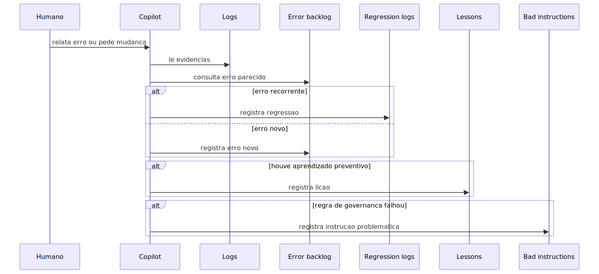

# README-METODOLOGIA-DESENV-MELHORIA-CONTINUA

Este documento explica como a metodologia aprende com erros, regressões,
correções do usuário e falhas nas próprias instruções.

O objetivo é impedir que o projeto repita os mesmos problemas.

## Ideia central

Desenvolvimento assistido por IA só é seguro quando a própria IA aprende com o
histórico do repositório.

Neste projeto, esse aprendizado não fica perdido na conversa. Ele é registrado
em arquivos versionados.

Esses arquivos funcionam como memória operacional:

- o que deu errado;
- por que deu errado;
- como reconhecer a reincidência;
- como evitar repetir a correção ruim;
- quando a própria instrução do Copilot precisa ser corrigida.

## O ciclo de melhoria

## `lessons-instructions.md`

Este arquivo guarda lições aprendidas.

Ele deve ser usado quando há uma correção explícita do usuário, uma descoberta
importante sobre contrato, uma falha de interpretação ou um padrão recorrente
que pode voltar.

### Engenharia do arquivo lessons

Cada lição precisa ter:

- contexto;
- aprendizado;
- regra preventiva clara.

Isso transforma erro passado em regra de trabalho futura.

Em linguagem simples: é a memória de “não caia de novo nesse buraco”.

## `bad-instructions.md`

Este arquivo guarda problemas nas instruções.

Ele existe porque instruções também podem ter bug. Uma regra pode ser
contraditória, ambígua, ampla demais, vazia ou desatualizada.

### Engenharia do arquivo bad-instructions

Quando o Copilot lê instruções em `.github` e encontra problema já comprovado,
ele deve registrar:

- arquivo de origem;
- descrição do problema;
- impacto prático.

Isso impede que a equipe trate falha do agente como “erro da IA” quando, na
verdade, o problema é uma regra ruim.

## `error-backlog-instructions.md`

Este arquivo registra erros reais de produto.

Ele não é para falha comum de teste automatizado. Ele é para erro real de
runtime, comportamento operacional, falha em execução ou sintoma funcional do
produto.

### Engenharia do arquivo error-backlog

O backlog de erro exige descrição, cenário, contexto, arquivos, módulo, data e
observações.

O objetivo é criar histórico com evidência. Assim, quando o problema aparecer de
novo, o Copilot não começa do zero.

## `regression-logs-instructions.md`

Este arquivo registra reincidência.

Um erro vai para regressão quando já existe histórico e voltou a acontecer.

### Engenharia do arquivo regression-logs

O registro de regressão força uma pergunta mais dura:

Por que a correção anterior não resolveu de vez?

Isso muda a postura da equipe. Em vez de repetir remendo local, a metodologia
exige avaliar causa estrutural, contrato inadequado, duplicação de fluxo,
observabilidade insuficiente ou arquitetura frágil.

## `tarefas-executadas.md`

Este arquivo é o diário de fechamento das tarefas.

Ele conecta pedido, alteração, impacto, testes e status final.

### Engenharia do arquivo tarefas-executadas

Cada tarefa registra:

- tipo da tarefa;
- alterações realizadas;
- raio de impacto;
- justificativa;
- testes executados;
- resultado objetivo;
- status final;
- bloqueios pendentes.

Isso cria rastreabilidade. Uma entrega não fica só no chat; ela vira evidência
versionada.

## `error-log-instruction.md`

Este é um registro histórico anterior de erros de execução.

Ele ajuda a entender a maturação do processo. Hoje, o fluxo mais completo é
representado pelo backlog de erros e pelos logs de regressão.

## Como os arquivos interagem

## Quando registrar uma lição

Registre lição quando:

- o usuário corrigiu uma interpretação importante;
- um contrato real foi descoberto;
- um bug revelou padrão de erro provável no futuro;
- uma abordagem anterior se mostrou frágil;
- um warning aceito precisou de justificativa operacional.

Não registre lição para ajuste trivial sem impacto sistêmico.

## Quando registrar erro de produto

Registre quando:

- houve falha real de runtime;
- log mostra erro em fluxo de produto;
- fallback inesperado mascarou problema;
- warning relevante indicou perda de observabilidade ou comportamento anômalo;
- sintoma operacional afetou API, worker, scheduler, UI, ingestão, RAG, agentes,
  filas ou persistência.

Não registre como erro de produto uma falha que vem exclusivamente de execução
de teste automatizado, a menos que o teste tenha revelado bug real de runtime.

## Quando registrar regressão

Registre quando:

- a mesma mensagem de erro voltou;
- o mesmo sintoma funcional voltou;
- o mesmo componente voltou a falhar;
- uma família de erro reapareceu em outro ponto do mesmo fluxo.

Regressão é sinal de que a correção anterior pode ter sido estreita demais.

## Quando registrar instrução problemática

Registre quando:

- uma instrução manda e outra proíbe a mesma coisa;
- uma skill aplicável está vazia;
- uma regra é tão ampla que atrapalha tarefas legítimas;
- a regra não diz como validar;
- a instrução induz comportamento contrário ao contrato real do projeto.

## Como isso melhora o trabalho com Copilot

O Copilot passa a ter memória de processo.

Quando uma nova tarefa começa, ele pode ler lições, backlogs e regressões para
evitar repetir decisões ruins. Quando a suíte falha, ele pode relacionar a falha
com histórico. Quando uma regra conflita, ele pode registrar a própria regra
como débito.

Isso transforma a IA em ferramenta acumulativa, não em conversa isolada.

## Anti-exemplos

- Errado: corrigir erro real e não registrar backlog.
- Correto: registrar erro, correção, evidência e validação.

- Errado: tratar erro recorrente como caso novo.
- Correto: registrar regressão e questionar a abordagem anterior.

- Errado: ignorar instrução contraditória.
- Correto: registrar em `bad-instructions` para revisão.

- Errado: terminar tarefa sem status claro.
- Correto: registrar em `tarefas-executadas` com impacto e testes.

## Resultado esperado

Com esse loop, o projeto fica menos dependente de memória humana informal.

Cada falha importante vira insumo para a próxima execução. Cada instrução ruim
vira débito visível. Cada tarefa concluída deixa rastro. Esse é o mecanismo que
permite desenvolvimento assistido por IA com governança real.
