# README-METODOLOGIA-DESENV-ONBOARDING

Este é o onboarding para novos desenvolvedores que vão trabalhar neste
repositório usando Copilot como executor principal.

O objetivo é ensinar a operar a metodologia, não decorar arquivos.

## Primeiro princípio

Neste projeto, o desenvolvedor não deve começar abrindo um arquivo para editar.

Ele deve começar formulando uma tarefa clara para o Copilot:

- qual problema precisa ser resolvido;
- qual comportamento esperado precisa ser alcançado;
- quais evidências existem;
- qual risco precisa ser evitado;
- qual critério prova que a tarefa terminou.

A partir daí, o Copilot investiga, planeja, implementa, testa, documenta e
registra.

## Como pensar o trabalho

O novo desenvolvedor deve trocar a pergunta “em que arquivo eu mexo?” por
“qual agente deve conduzir esta etapa?”.

Essa troca é importante porque o método separa papéis:

- investigação antes de ação;
- plano antes de mudança arriscada;
- implementação com validação;
- correção de erro com log;
- documentação conectada ao código;
- teste como prova;
- aprendizado registrado.

Em linguagem simples: você coordena uma pequena equipe de agentes, em vez de
trabalhar como editor manual de código.

## Jornada recomendada nos primeiros dias

### Dia 1: entender a governança

Leia:

- [README-METODOLOGIA-DESENV-GOVERNANCA-COPILOT.md](./README-METODOLOGIA-DESENV-GOVERNANCA-COPILOT.md)
- [README-METODOLOGIA-DESENV-ARTEFATOS-GITHUB.md](./README-METODOLOGIA-DESENV-ARTEFATOS-GITHUB.md)

Objetivo do dia: entender por que o Copilot não deve inventar, por que precisa
ler antes de editar e por que todo fechamento precisa de evidência.

### Dia 2: entender os fluxos

Leia:

- [README-METODOLOGIA-DESENV-FLUXOS-TRABALHO.md](./README-METODOLOGIA-DESENV-FLUXOS-TRABALHO.md)

Objetivo do dia: saber qual agente usar para implementação, correção, refatoração,
YAML, UI, documentação e validação.

### Dia 3: entender a suíte

Leia:

- [README-METODOLOGIA-DESENV-SUITE-TESTES.md](./README-METODOLOGIA-DESENV-SUITE-TESTES.md)

Objetivo do dia: entender que a suíte oficial produz evidência, não apenas
resultado verde ou vermelho.

### Dia 4: entender melhoria contínua

Leia:

- [README-METODOLOGIA-DESENV-MELHORIA-CONTINUA.md](./README-METODOLOGIA-DESENV-MELHORIA-CONTINUA.md)

Objetivo do dia: saber quando registrar lição, erro real, regressão, instrução
problemática e tarefa executada.

### Dia 5: executar uma tarefa pequena

Escolha uma mudança pequena de documentação ou uma correção simples já conhecida.

Peça ao Copilot para:

1. investigar o escopo;
2. propor plano curto;
3. implementar;
4. validar;
5. registrar o fechamento.

O objetivo não é velocidade. O objetivo é sentir o ciclo inteiro.

## Mapa mental do novo desenvolvedor

## Como formular bons pedidos ao Copilot

Um bom pedido tem cinco partes.

### 1. Objetivo

Diga o resultado desejado de forma concreta.

Exemplo conceitual: “criar um guia de onboarding para novos desenvolvedores
sobre a metodologia Copilot do repositório”.

### 2. Escopo

Diga onde a tarefa deve acontecer.

Exemplo conceitual: “criar documentos em `docs/metodologia-desenv` e atualizar o
índice principal”.

### 3. Restrições

Diga o que não pode acontecer.

Exemplo conceitual: “não explicar feature do produto; explicar metodologia de
trabalho”.

### 4. Evidência disponível

Informe logs, arquivos, sintomas, telas, decisões anteriores ou referências.

Se não houver evidência, peça investigação antes de implementação.

### 5. Critério de aceite

Diga como saber que terminou.

Exemplo conceitual: “documentos criados, links atualizados, diagramas validados e
registro de tarefa preenchido”.

## Como acompanhar uma execução

Durante a execução, o novo desenvolvedor deve observar:

- se o Copilot leu os arquivos antes de editar;
- se criou uma lista de tarefas quando a mudança tem mais de uma etapa;
- se explicou as edições antes de fazê-las;
- se validou o resultado;
- se leu a saída dos testes;
- se registrou bloqueios em vez de esconder falhas;
- se atualizou documentação e registros quando necessário.

Não aceite uma conclusão baseada apenas em “feito”. Peça evidência.

## Como corrigir o Copilot

Se o Copilot interpretar algo errado, seja direto:

- diga qual premissa está errada;
- diga qual evidência contradiz a premissa;
- peça para registrar uma lição se o erro puder se repetir;
- peça para registrar `bad-instructions` se a causa for instrução ambígua ou
  contraditória.

Essa correção não é atrito. Ela é parte do método.

## Quando não implementar ainda

Pare e peça investigação quando:

- o comportamento real não foi lido no código;
- o log não mostra a causa do erro;
- a alteração depende de campo YAML não confirmado;
- há dúvida sobre contrato público;
- a mudança afeta banco, filas, workers, scheduler, agentes ou runtime crítico;
- a documentação e o código parecem divergir.

Implementar sem evidência pode gerar trabalho a mais depois.

## O que significa “100% Copilot” neste repositório

Significa que o Copilot pode executar a mudança material: editar arquivos,
criar testes, rodar comandos, ler logs, atualizar documentação e registrar
resultados.

Não significa que o humano abandona responsabilidade técnica.

O humano continua responsável por:

- dar direção;
- decidir prioridade;
- fornecer contexto;
- validar se o resultado atende ao objetivo;
- exigir provas;
- interromper quando o processo sair do trilho.

A melhor forma de usar Copilot aqui é tratar a IA como executor disciplinado, não
como atalho sem controle.

## Checklist pessoal antes de encerrar uma tarefa

Antes de aceitar uma entrega, confira:

- objetivo original foi atendido;
- arquivos alterados fazem sentido para o escopo;
- não houve alteração fora do pedido;
- validações foram executadas ou bloqueio foi explicado;
- diagramas, links e documentação foram verificados quando aplicável;
- registros obrigatórios foram atualizados;
- riscos residuais foram declarados.

## Resultado esperado do onboarding

Depois deste onboarding, o novo desenvolvedor deve conseguir conduzir uma tarefa
fim a fim por linguagem natural, usando Copilot como executor e os artefatos do
repositório como sistema de governança.

O ganho prático é reduzir trabalho manual repetitivo sem reduzir rigor técnico.
