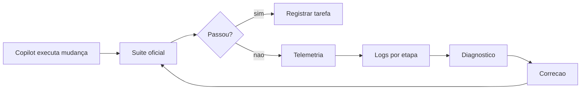

# README-METODOLOGIA-DESENV-SUITE-TESTES

Este documento explica a engenharia conceitual da suíte oficial de testes.

Ele não é um help de parâmetros. O objetivo é entender por que a suíte existe,
como ela colabora com o trabalho assistido por Copilot e por que seus artefatos
são tratados como evidência.

## Ideia central

A suíte oficial é o juiz técnico do repositório.

Ela não serve apenas para executar testes. Ela coordena validação, registra
progresso, guarda logs, permite retomada por checkpoints, produz telemetria e
mantém histórico de erros.

Em linguagem simples: a suíte é a caixa-preta do voo. Se algo falha, ela guarda
o suficiente para o Copilot entender onde, quando e por quê.

## Por que existe uma suíte shell oficial

Projetos grandes não podem depender de comandos soltos.

Sem uma suíte oficial, cada pessoa ou agente poderia rodar um subconjunto
diferente de testes, esconder erro em redirecionamento, esquecer `.venv`, pular
frontend, ignorar logs ou concluir sucesso só porque um comando local passou.

A suíte cria um contrato único:

- todos sabem qual é o ponto de entrada de validação;
- todo resultado importante deixa artefato;
- toda falha pode ser investigada depois;
- a execução pode retomar do ponto certo;
- o Copilot tem arquivos objetivos para ler.

## A engenharia dos artefatos

A suíte grava artefatos em `.sandbox/tmp`.

Conceitualmente, esses artefatos têm cinco funções.

### 1. Log completo da rodada

O `run.log` mostra a história inteira da execução.

Ele é útil quando a pergunta é: “o que aconteceu nesta rodada?”.

### 2. Logs por etapa

A pasta de etapas separa a execução em blocos.

Isso evita investigar milhares de linhas quando só uma etapa falhou.

### 3. Checkpoint de progresso

O checkpoint permite retomada.

Se uma suíte longa falha na metade, o processo não precisa recomeçar do zero
sempre. Isso reduz custo e incentiva correção incremental.

### 4. Telemetria estruturada

A telemetria responde de forma objetiva:

- status final;
- etapa atual;
- total de falhas;
- arquivos de log relacionados;
- histórico de erro;
- rodada mais recente.

Esse arquivo é a primeira leitura que o Copilot deve fazer após uma falha.

### 5. Histórico acumulado de erros

O histórico mostra recorrência.

Se o mesmo erro aparece repetidas vezes, a metodologia deve mudar de abordagem.
Isso conecta a suíte ao processo de regressão e aprendizado.

## Como a suíte colabora com Copilot

A colaboração acontece em ciclo:

1. Copilot altera o repositório.
2. A suíte valida o impacto.
3. Se falha, a suíte aponta onde investigar.
4. Copilot lê telemetria e logs.
5. Copilot corrige.
6. A suíte confirma ou nega a correção.

Esse ciclo reduz o risco de conversa convincente sem prova real.

## Retomada por checkpoint

Retomada é o mecanismo que permite continuar depois de uma falha já conhecida.

Conceitualmente, a suíte sabe qual foi a última etapa concluída com sucesso. Em
uma nova rodada, ela pode continuar a partir dali quando isso é seguro.

Isso é importante para desenvolvimento assistido por IA porque:

- economiza tempo em suítes longas;
- permite corrigir uma falha por vez;
- mantém rastreabilidade do ponto de quebra;
- ajuda o Copilot a trabalhar em laço fechado.

Retomada não deve ser usada para esconder regressão. Ela é ferramenta de
diagnóstico e produtividade, não atalho para ignorar etapa.

## Logs como contrato de investigação

Depois de cada execução, a metodologia exige leitura dos artefatos quando houver
falha, warning relevante ou saída suspeita.

Isso evita um erro comum: olhar só o exit code e ignorar mensagens importantes
no terminal.

O terminal pode mostrar `FAILED`, `ERROR`, traceback ou warning. A suíte espelha
essa saída nos arquivos persistidos. Portanto, o Copilot deve reconciliar o que
foi visto no terminal com os arquivos da rodada.

## Testes focados e regressão ampla

A metodologia separa dois momentos.

### Ciclo local focado

Serve para validar o impacto imediato da mudança.

Ele deve ser proporcional ao risco. Uma alteração pequena pode começar com um
escopo pequeno. Uma alteração compartilhada precisa de escopo maior.

### Fechamento amplo

Serve para provar integração e ausência de regressão relevante no repositório.

Ele é mais caro, mas é o que impede que uma mudança passe localmente e quebre em
outro módulo.

Em linguagem simples: foco ajuda a corrigir rápido; regressão ampla ajuda a
concluir com segurança.

## O papel do `status-repo`

O status operacional compacto dá uma leitura rápida do estado do repositório.

Ele não substitui uma regressão ampla quando ela é obrigatória. O papel dele é
confirmar, depois de uma rodada ampla ou em momentos de diagnóstico, se o
repositório está coerente do ponto de vista operacional.

## O que o Copilot deve fazer quando a suíte falha

O processo correto é:

1. Ler a telemetria mais recente.
2. Identificar etapa falha ou abortada.
3. Abrir histórico de erro da rodada.
4. Ler log completo se necessário.
5. Ler logs limpos e brutos da etapa falha.
6. Reproduzir no menor escopo confiável.
7. Corrigir causa raiz.
8. Rodar novamente a suíte compatível.

O processo incorreto é:

- pular teste;
- mascarar warning;
- alterar teste sem provar que ele está obsoleto;
- instalar dependência para “fazer passar”;
- tratar falha de ambiente como bug de produto sem evidência;
- encerrar dizendo que “parece ok”.

## Como a suíte se conecta aos agentes

| Agente | Relação com a suíte |
| --- | --- |
| `planejar` | define escopo de validação e fechamento |
| `implementar` | roda validações proporcionais e registra resultado |
| `corrigir-erros-com-log` | usa logs da suíte como evidência quando o erro vem de teste |
| `criar-testes` | cria cobertura e valida pelo runner oficial |
| `executar-testes` | especializa o ciclo de falha, reprodução e estabilização |
| `documentar` | registra como validar quando a doc muda operação |

## Por que não usar só pytest direto

`pytest` direto pode ser útil como reprodução localizada.

Mas ele não substitui a suíte porque não entrega sozinho o mesmo contrato de
execução: checkpoints, telemetria, histórico, convenções, integração com
frontend, leitura operacional e fechamento amplo.

Em termos simples: pytest direto é lupa. A suíte oficial é auditoria.

## Conceito de bloqueio

Uma tarefa pode terminar bloqueada quando a validação necessária não pode ser
concluída por uma causa real e documentada.

Bloqueio não é fracasso escondido. Bloqueio precisa ter:

- evidência;
- impacto;
- o que foi tentado;
- o que falta para desbloquear.

Isso permite que outra pessoa ou outro agente retome o trabalho sem recomeçar do
zero.

## Conclusão prática

A suíte é a ponte entre IA e engenharia confiável.

Sem ela, o Copilot poderia gerar mudanças plausíveis. Com ela, o Copilot precisa
provar que a mudança funciona no contrato real do repositório.
