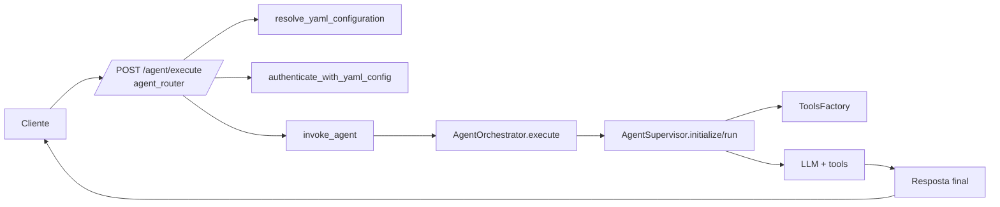
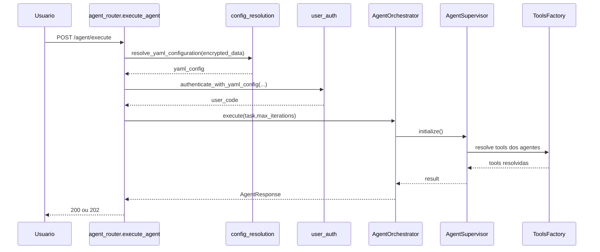
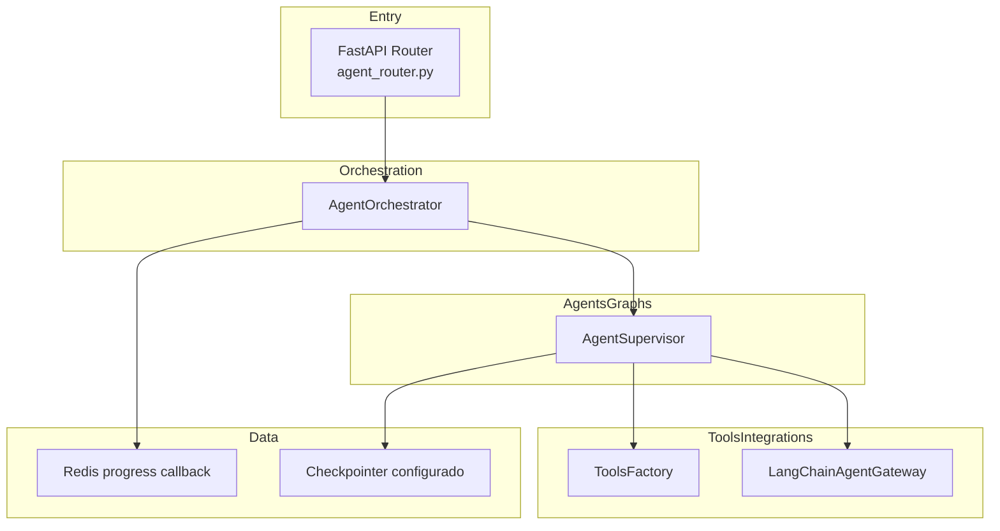
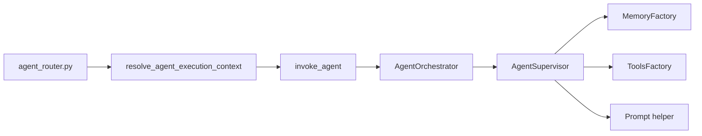

# Tutorial 101: Criação e Configuração de Agentes (Supervisor Clássico)

Bem-vindo. Este guia é para quem acabou de entrar no projeto e precisa entender, de forma prática, como um agente configurado em YAML vira execução real no runtime da Plataforma de Agentes de IA.

## 1) Para quem é este tutorial

- Iniciante em Python/FastAPI/LangGraph.
- Consultor júnior que precisa configurar agentes por YAML.
- Dev de negócio que precisa alterar prompts/tools sem quebrar o runtime.

Ao final você vai conseguir:

- Entender o caminho `HTTP -> router -> orchestrator -> supervisor`.
- Configurar `multi_agents` com segurança.
- Saber onde ligar/desligar execução síncrona/assíncrona.
- Validar se o agente está pronto para uso local.

## Leitura relacionada

- Aprofundamento técnico completo: [README-AGENTE-SUPERVISOR.md](./README-AGENTE-SUPERVISOR.md)
- Contrato comum do YAML agentic: [README-AGENTIC-CONTRATO-COMUM.md](./README-AGENTIC-CONTRATO-COMUM.md)

## 2) Dicionário rápido

- `Supervisor`: componente que coordena especialistas.
- `multi_agents`: lista YAML dos supervisores possíveis.
- `execution.type=agent`: modo clássico de supervisor.
- `ToolsFactory`: resolve as tools permitidas por agente.
- `AgentOrchestrator`: camada de serviço que chama o runtime.
- `correlation_id`: identificador único de rastreio da execução.
- `direct_sync`: responde na mesma chamada HTTP.
- `direct_async`: agenda execução em background e devolve `task_id`.

## 3) Conceito em linguagem simples

Pense no supervisor como um gerente de loja. O cliente (HTTP) faz um pedido. O gerente verifica regras da loja (auth + YAML), escolhe os atendentes certos (agentes especialistas) e só libera as ferramentas que cada atendente pode usar. Depois disso, o gerente devolve a resposta final ou abre um ticket para responder depois.

Na prática, o YAML define o "time" (`multi_agents[].agents[]`) e o que cada pessoa pode fazer (`tools`). O código do router e do orchestrator garante que isso execute de forma padronizada e auditável.

## 4) Mapa de navegação do repo

- `src/api/routers/agent_router.py`: entrada HTTP de execução de agente.
- `src/orchestrators/agent_orchestrator.py`: lógica de orquestração de execução.
- `src/agentic_layer/supervisor/agent_supervisor.py`: runtime principal do supervisor clássico.
- `src/agentic_layer/supervisor/tools_factory.py`: resolução de ferramentas permitidas.
- `src/agentic_layer/supervisor/config_resolver.py`: seleção do supervisor ativo.
- `src/api/routers/config_resolution.py`: resolve `encrypted_data` em YAML efetivo.
- `src/api/security/user_auth.py`: valida `X-API-Key` e permissões.
- `app/yaml/system/rag-config-modelo.yaml`: modelo de configuração base.
- `src/api/service_api.py`: montagem do app FastAPI e inclusão de routers.
- Guarda-corpo: não mudar fluxo de auth direto no router sem manter `endpoint_permission`.

## 5) Mapa visual 1: fluxo macro

## 6) Mapa visual 2: quem chama quem

## 7) Mapa visual 3: camadas

## 8) Mapa visual 4: componentes

## 9) Onde isso aparece neste projeto

- Endpoint de execução: `src/api/routers/agent_router.py` (`execute_agent`, `invoke_agent`).
- Seleção de modo supervisor: `src/api/routers/agent_router.py` (`_resolve_supervisor_mode`).
- Execução sync/async: `src/api/routers/agent_router.py` (`DIRECT_SYNC`, `DIRECT_ASYNC`).
- Orquestração: `src/orchestrators/agent_orchestrator.py` (`execute`).
- Runtime supervisor: `src/agentic_layer/supervisor/agent_supervisor.py` (`initialize`, `run`).
- Resolução de tools por contexto: `src/agentic_layer/supervisor/agent_supervisor.py` (`_resolve_agent_tools`).
- Auth/permissão: `src/api/security/user_auth.py` (`authenticate_with_yaml_config`).

## 10) Caminho real no código

- `src/api/routers/agent_router.py`: recebe request, resolve YAML, autentica e chama `invoke_agent`.
- `src/api/routers/config_resolution.py`: transforma `encrypted_data` em `yaml_config`.
- `src/orchestrators/agent_orchestrator.py`: inicializa supervisor e executa `run` com timeout.
- `src/agentic_layer/supervisor/agent_supervisor.py`: monta factories, supervisor e sessão.
- `src/agentic_layer/supervisor/tools_factory.py`: valida e instancia tools permitidas.

## 11) Fluxo passo a passo (o que acontece de verdade)

1. `POST /agent/execute` entra em `execute_agent`.
2. `resolve_agent_execution_context` chama `resolve_yaml_configuration`.
3. Router autentica com `authenticate_with_yaml_config`.
4. `invoke_agent` escolhe modo (`direct_sync`, `direct_async` ou fallback de `subprocess`).
5. Em sync: cria `AgentOrchestrator` e chama `execute`.
6. `AgentOrchestrator` cria `AgentSupervisor`, chama `initialize` e `run`.
7. `AgentSupervisor` resolve prompt, memória e tools por agente.
8. Resultado retorna como `AgentResponse`.

Com config ativa:

- Se `execution_mode=auto`, selector pode escolher assíncrono.

No estado atual:

- `subprocess` está degradado para `direct_async` no router.

## 12) Status: está pronto? quanto está pronto?

| Área | Evidência | Status | Impacto prático | Próximo passo mínimo |
|---|---|---|---|---|
| Endpoint agente | `src/api/routers/agent_router.py` | pronto | Execução HTTP funcional | manter testes de contrato |
| Resolução YAML | `src/api/routers/config_resolution.py` | pronto | Carrega payload cifrado | ampliar validação de schema |
| Runtime supervisor | `src/agentic_layer/supervisor/agent_supervisor.py` | pronto | Agentes executam com tools | revisar métricas por agente |
| Execução async | `src/api/routers/agent_router.py` | pronto | Escala tarefas longas | monitorar filas em produção |
| Testes específicos | Não encontrado no escopo analisado | parcial | risco de regressão por fluxo | mapear suíte dedicada agent router |

## 13) Como colocar para funcionar (hands-on)

Passo 0. Pré-requisito de ambiente:

- Python 3.11 (`pyproject.toml`).

Passo 1. Instalar dependências:

- `python -m venv .venv && source .venv/bin/activate`
- `pip install -r requirements.txt`

Passo 2. Subir API:

- `source .venv/bin/activate && python app/main.py`

Passo 3. Validar API:

- Abrir `/docs` e testar `POST /agent/execute`.

Passo 4. Payload mínimo:

- Enviar `encrypted_data`, `task`, `user_email`.

Passo 5. Verificar que funcionou:

- `X-Correlation-Id` no retorno.
- Se async, presença de `task_id`, `polling_url`, `stream_url`.

## 14) ELI5: onde coloco cada parte da feature

| Pergunta | Resposta | Camada | Onde no repo |
|---|---|---|---|
| Quero novo endpoint de agente | Router + contrato request/response | Entry | `src/api/routers/agent_router.py` |
| Quero mudar regra de execução | Orchestrator | Orchestration | `src/orchestrators/agent_orchestrator.py` |
| Quero ajustar seleção de tools | Supervisor/ToolsFactory | Agents/Tools | `src/agentic_layer/supervisor/agent_supervisor.py` |
| Quero alterar estado de memória | Memory factory/checkpointer | Data | `src/agentic_layer/supervisor/memory_factory.py` |

## 15) Template de mudança

1) entrada: qual endpoint dispara?

- paths: `src/api/routers/agent_router.py`
- contrato de entrada: `AgentRequest`

1) config: qual YAML/env controla?

- keys: `multi_agents`, `execution.type`, `memory.*`
- onde é lido: `config_resolver` + `agent_supervisor`

1) execução: qual runtime entra?

- builder/factory: `AgentOrchestrator -> AgentSupervisor`
- state: sessão/thread + progress callback

1) ferramentas: quais tools são usadas?

- registro: `tools_library` + `ToolsFactory`
- chamadas: `resolve_agent_tools_with_context`

1) dados: onde persiste/cache/indexa?

- Redis: progresso async
- checkpointer: backend configurado em `memory.checkpointer`

1) observabilidade: onde loga?

- logs: `create_logger_with_correlation`

1) testes: onde validar?

- unit: `tests/unit` (não encontrado arquivo único específico no escopo)

## 16) CUIDADO: o que NÃO fazer

- Não montar YAML dentro do endpoint. Quebra separação de responsabilidades.
- Não instanciar tool manualmente no router. Use `ToolsFactory`.
- Não ignorar `authenticate_with_yaml_config`. Quebra segurança.
- Não remover `correlation_id` da resposta. Perde rastreabilidade.

## 17) Anti-exemplos

- Erro: escolher agente no endpoint com if fixo.
- Por que é ruim: acopla regra de negócio ao HTTP.
- Correção: usar `SupervisorConfigResolver`.

- Erro: chamar LLM direto no router.
- Por que é ruim: ignora guardrails do supervisor.
- Correção: usar `AgentOrchestrator`.

- Erro: tool lendo banco direto sem catálogo.
- Por que é ruim: bypass de governança.
- Correção: registrar em `tools_library` + `ToolsFactory`.

- Erro: usar `execution_mode` sem fallback.
- Por que é ruim: quebra em cenários longos.
- Correção: manter degradação para async.

## 18) Exemplos guiados

Exemplo 1: execução síncrona

- Fio do código: `src/api/routers/agent_router.py` -> `src/orchestrators/agent_orchestrator.py`.

Exemplo 2: execução assíncrona

- Fio do código: `src/api/routers/agent_router.py` (`DIRECT_ASYNC`) -> progress callback.

Exemplo 3: seleção de supervisor por YAML

- Fio do código: `src/api/routers/agent_router.py` (`_resolve_supervisor_mode`) -> `SupervisorConfigResolver`.

## 19) Erros comuns e como reconhecer

- Sintoma: 401/403 no endpoint.
- Hipótese: falha de permissão/chave.
- Como confirmar: `src/api/security/user_auth.py`.
- Correção segura: validar `X-API-Key` e permissão `AGENT_EXECUTE`.

- Sintoma: execução vai para async sem esperar.
- Hipótese: seleção automática escolheu `direct_async`.
- Como confirmar: `ExecutionModeSelector` em `agent_router`.
- Correção segura: forçar `execution_mode=direct_sync`.

- Sintoma: tool não encontrada.
- Hipótese: `tool_id` ausente em catálogo.
- Como confirmar: `agent_supervisor._resolve_agent_tools`.
- Correção segura: registrar tool em `tools_library`.

- Sintoma: erro na inicialização do supervisor.
- Hipótese: YAML inválido em `multi_agents`.
- Como confirmar: `agent_supervisor._load_config`.
- Correção segura: corrigir schema do supervisor ativo.

## 20) Exercícios guiados

Exercício 1 (10 min)

- Objetivo: localizar o caminho do `POST /agent/execute`.
- Passos: abrir router, seguir chamada para `invoke_agent`.
- Verificação: identificar os 3 passos `resolve`, `auth`, `execute`.
- Gabarito: `src/api/routers/agent_router.py`.

Exercício 2 (10 min)

- Objetivo: entender sync vs async.
- Passos: mapear ramo `DIRECT_SYNC` e `DIRECT_ASYNC`.
- Verificação: achar onde retorna `task_id`.
- Gabarito: `invoke_agent` no mesmo arquivo.

Exercício 3 (15 min)

- Objetivo: mapear seleção de tools.
- Passos: seguir `AgentOrchestrator` até `AgentSupervisor`.
- Verificação: achar método `_resolve_agent_tools`.
- Gabarito: `src/agentic_layer/supervisor/agent_supervisor.py`.

## 21) Checklist final

- Endpoint identificado.
- Fluxo de auth entendido.
- Fluxo de resolução YAML entendido.
- Diferença sync/async clara.
- Supervisor e orchestrator localizados.
- ToolsFactory localizada.
- Correlation_id acompanhado ponta a ponta.
- Comando de subida local validado.

## 22) Checklist de PR

- Não quebrou contrato do `AgentRequest`.
- Mantém `endpoint_permission`.
- Mantém `authenticate_with_yaml_config`.
- Mantém `correlation_id` e logs.
- Não adicionou bypass de tools.
- Preservou fallback async.
- Atualizou documentação quando alterou fluxo.
- Incluiu teste de regressão do caminho alterado.

## 23) Referências

Internas:

- `src/api/routers/agent_router.py`
- `src/orchestrators/agent_orchestrator.py`
- `src/agentic_layer/supervisor/agent_supervisor.py`
- `src/agentic_layer/supervisor/tools_factory.py`
- `app/yaml/system/rag-config-modelo.yaml`

Externas (normativas):

- FastAPI Documentation, seção Overview e APIRouter.
- LangChain Documentation, seção Agents Overview.
- LangGraph Documentation, seção StateGraph Overview.

## 24) Como criar supervisor clássico por linguagem natural

### 24.1 Visão geral

No fluxo agentic, a criação por linguagem natural de supervisor clássico serve para sair de um objetivo de coordenação e chegar a um YAML de `agent_supervisor` consistente.
Esse caminho é apropriado quando o problema parece escolha, coordenação ou delegação entre especialistas, e não um fluxo rígido com várias etapas encadeadas.
O assembly usa o texto do objetivo, o YAML base e o catálogo efetivo de tools para montar um supervisor mínimo, validável e publicável.
Na prática, isso permite criar a espinha dorsal do supervisor sem escrever o YAML inteiro manualmente.

### 24.2 Como o sistema entende que você quer supervisor clássico

Quando o target está em `auto`, o parser procura sinais como `supervisor`, `coordene`, `coordenar`, `delegar`, `delegue`, `especialista`, `especialistas`, `multi agentes`, `multiagente` e `orquestrar`.
Esses sinais disputam com os sinais de workflow e deepagent.
Se o texto apontar claramente para coordenação de especialistas, o target é resolvido como `agent_supervisor`.
Se a disputa ficar ambígua, o assembly devolve pergunta de clarificação em vez de escolher no chute.

### 24.3 O que o assembly gera de verdade para supervisor

No estado atual do código, a geração por linguagem natural de supervisor clássico cria um `SupervisorDraftIR` e depois o converte em um supervisor mínimo funcional.
Esse supervisor nasce com `execution.type=agent`, um prompt de coordenação para o supervisor e, por padrão, pelo menos um agente especialista derivado do objetivo.
O especialista recebe a descrição do objetivo, um prompt base de atuação e as tools resolvidas para aquele contexto.
Na prática, a primeira versão gerada costuma ser enxuta: ela organiza a estrutura central do supervisor e deixa o refinamento fino para validação e revisão posterior.

### 24.4 Explicação for dummies

Pense nesse fluxo como pedir para o sistema montar um gerente com um primeiro especialista já sentado na mesa.
Você diz algo como "quero um supervisor para coordenar atendimento comercial e técnico".
O sistema entende que o problema não é uma sequência de etapas, e sim uma coordenação.
Então ele monta um gerente central, coloca um especialista inicial e conecta as tools que combinam com o cenário.
Se estiver faltando alguma definição importante, ele não inventa um time inteiro em silêncio.
Ele para e pede clareza antes de seguir.

### 24.5 Passo a passo prático

1. Prepare o YAML base com o bloco `llm` válido e o contexto do tenant.
2. Rode `preflight` para garantir provider estruturado, catálogo e identidade do operador.
3. Se necessário, use `recommend-tools` para descobrir quais tools combinam com os especialistas que você quer coordenar.
4. Gere o rascunho com `objective-to-yaml` ou `draft`, usando `target=agent_supervisor` ou `target=auto` quando o texto estiver claro.
5. Revise `diagnostics` e `questions` para entender se o sistema conseguiu fechar a estrutura.
6. Valide o AST para confirmar que o supervisor e seus agentes respeitam o contrato semântico.
7. Consolide o preview com `confirm` e só publique depois da revisão final.

### 24.6 O que melhora a qualidade do prompt

Prompts melhores para supervisor clássico costumam deixar claro que existe coordenação entre especialistas.
Falar em termos como "coordene", "delegue", "especialistas", "time comercial", "time técnico" e "decidir qual agente atende" ajuda bastante.
Também ajuda explicitar o domínio, por exemplo cobrança, suporte, pré-venda ou triagem comercial.
Na prática, um bom prompt reduz a chance de o sistema interpretar o caso como workflow ou produzir um supervisor mínimo demais para o uso pretendido.

### 24.7 Limites e pegadinhas

1. A primeira versão gerada tende a ser minimalista, não uma malha completa de muitos especialistas.
2. Se o texto falar mais de processo do que de coordenação, o target pode pender para workflow.
3. Se o catálogo efetivo não trouxer tools adequadas, o especialista pode nascer com menos ferramentas do que o desejado.
4. Perguntas de clarificação continuam possíveis quando o objetivo estiver amplo ou ambíguo demais.

### 24.8 Onde aprofundar

1. [tutorial-101-nl2yaml.md](tutorial-101-nl2yaml.md) para o fluxo completo da feature NL no produto.
2. [tutorial-101-tecnica-nl-para-yaml-e-dsl.md](tutorial-101-tecnica-nl-para-yaml-e-dsl.md) para a técnica genérica de NL -> YAML e NL -> DSL.
