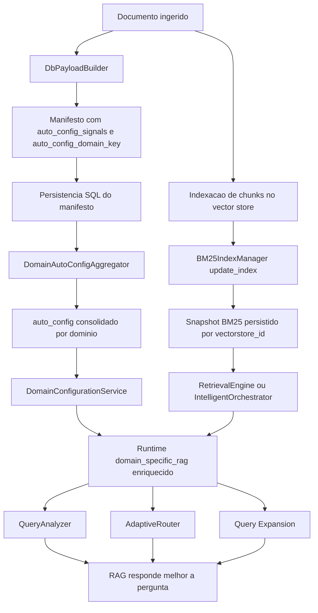
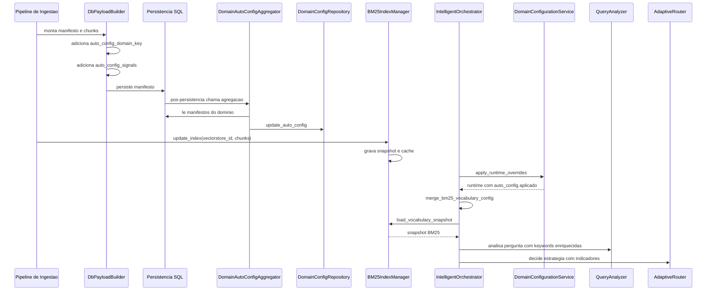
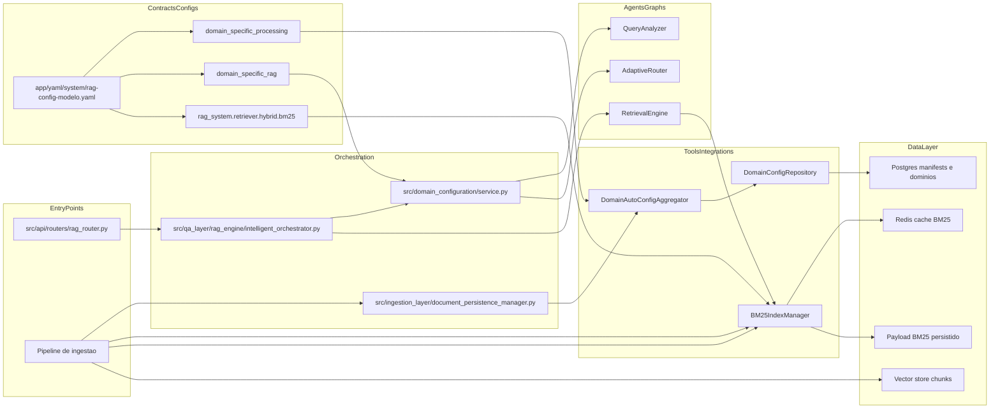
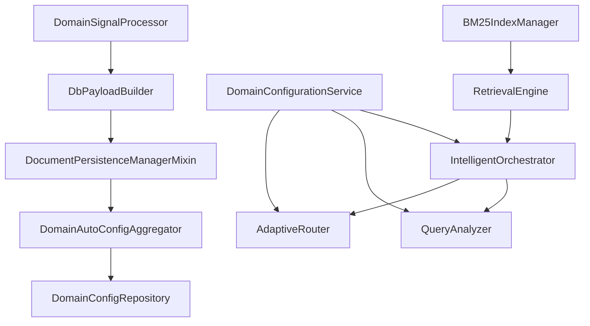

# Tutorial 101: auto_config e BM25 no pipeline de ingestão e no pipeline RAG

Se você acabou de entrar neste projeto e está vendo os nomes auto_config e BM25 aparecendo em YAML, logs, persistência e RAG, a primeira sensação costuma ser confusão. Este tutorial existe para resolver isso de forma prática. A ideia aqui é mostrar o que cada um é de verdade no código, como essas informações nascem na ingestão, onde ficam gravadas, como voltam no runtime do RAG e o que muda na resposta final.

## 2) Para quem é este tutorial

- Iniciante que precisa entender por que o pipeline grava mais do que chunks e embeddings.
- Desenvolvedor de negócio que vai mexer em ingestão, domínio, detecção ou query expansion.
- Pessoa de operação que quer saber quando auto_config e BM25 realmente entram em cena.
- Quem precisa diferenciar configuração manual em YAML de configuração aprendida automaticamente.

Ao final, você vai conseguir:

- explicar a diferença entre auto_config e BM25 sem misturar os papéis dos dois;
- localizar onde cada um nasce, é persistido e é lido no runtime;
- entender como auto_config afeta detecção de domínio, query expansion e adaptive router;
- entender como o snapshot BM25 é mesclado ao YAML do RAG sem quebrar o fallback para vector search;
- seguir um exemplo real, do manifesto ingerido até a análise de pergunta no RAG.

## 3) Dicionário rápido

- auto_config: configuração aprendida automaticamente a partir dos sinais dos documentos já ingeridos de um domínio.
- auto_config_signals: sinais brutos calculados durante a ingestão e gravados no metadata do manifesto para posterior agregação.
- domínio: agrupamento lógico do conhecimento, como dnit ou product_catalog.
- BM25: mecanismo de busca textual por correspondência lexical, útil para termos exatos, códigos, siglas e frases técnicas.
- snapshot BM25: payload persistido do índice BM25 de um vectorstore, incluindo vocabulário auxiliar para runtime.
- detection.keywords: lista de palavras que ajudam a detectar o domínio certo para a pergunta.
- query_expansion.vocabulary: vocabulário usado para enriquecer ou expandir a consulta antes do retrieval.
- adaptive_router_indicators: indicadores derivados do auto_config para ajudar o roteador a escolher a estratégia de busca.
- vectorstore_id: identificador lógico do conjunto de chunks indexados; o BM25 é persistido por vectorstore.
- merge de runtime: processo que pega YAML manual, auto_config persistido e snapshot BM25 e combina isso na configuração ativa do RAG.

## 4) Conceito em linguagem simples

Pense em dois cadernos diferentes.

O primeiro caderno é o auto_config. Ele é um caderno de aprendizagem do domínio. A cada ingestão, o sistema anota sinais como termos frequentes, códigos técnicos, headings, siglas e rótulos de tabela. Depois ele junta essas anotações de vários manifestos e escreve uma versão consolidada do que parece importante para reconhecer e expandir perguntas daquele domínio.

O segundo caderno é o BM25. Ele é um caderno de busca textual por vectorstore. Em vez de aprender o domínio inteiro, ele organiza os chunks indexados para achar palavras e expressões exatas com mais precisão. Além disso, ele também guarda um snapshot de vocabulário derivado dessa base textual, para o runtime do RAG aproveitar.

Na prática, auto_config responde mais à pergunta “o que este domínio parece conter e como eu reconheço isso?”. BM25 responde mais à pergunta “como eu encontro melhor termos exatos e como aproveito o vocabulário textual já persistido?”.

A analogia do mundo real é esta: auto_config é o resumo editorial de uma coleção inteira; BM25 é o índice remissivo detalhado do acervo. Um ajuda você a entender o assunto. O outro ajuda você a achar a página certa.

## 5) Mapa de navegação do repo

- src/ingestion_layer/telemetry/: onde sinais de ingestão são preparados, agregados e transformados em auto_config.
- src/ingestion_layer/document_persistence_manager.py: ponto onde a persistência do documento termina e o auto_config pode ser agregado logo depois.
- src/ingestion_layer/telemetry/db_payload_builder.py: onde o manifesto recebe marcador de domínio e auto_config_signals.
- src/ingestion_layer/vector_stores/base.py: ponto em que a indexação de chunks dispara a atualização do índice BM25.
- src/qa_layer/rag_engine/bm25_index_manager.py: fonte autoritativa do armazenamento e carregamento do snapshot BM25.
- src/domain_configuration/service.py: onde auto_config persistido é mesclado ao runtime do domínio.
- src/qa_layer/rag_engine/query_analyzer.py: onde keywords vindas de auto_config passam a influenciar a análise da pergunta.
- src/qa_layer/rag_engine/adaptive_router.py: onde indicadores derivados de auto_config influenciam o roteamento.
- src/qa_layer/rag_engine/retrieval_engine.py: onde o snapshot BM25 é carregado e injetado na configuração ativa do RAG.
- src/qa_layer/rag_engine/intelligent_orchestrator.py: ponto de bootstrap do RAG que aplica overrides de domínio e mescla BM25.
- src/api/routers/rag_router.py: expõe endpoint para rebuild manual do auto_config.
- app/yaml/system/rag-config-modelo.yaml: contrato base das flags de auto_config_mining, domain_specific_processing e BM25 híbrido.

## 6) Mapa visual 1: fluxo macro

## 7) Mapa visual 2: quem chama quem

## 8) Mapa visual 3: camadas

## 9) Mapa visual 4: componentes

## 10) Onde isso aparece neste projeto

- src/ingestion_layer/telemetry/db_payload_builder.py adiciona o marcador canônico auto_config_domain_key no manifesto.
- src/ingestion_layer/telemetry/db_payload_builder.py calcula auto_config_signals a partir de pages_info e conteúdo.
- src/ingestion_layer/document_persistence_manager.py dispara _maybe_aggregate_auto_config logo após a persistência do documento.
- src/ingestion_layer/telemetry/domain_signal_processor.py consolida sinais dos manifestos em um auto_config por domínio.
- src/ingestion_layer/processors/domain_plugins/domain_config_repository.py grava o auto_config na persistência configurada para domínio.
- src/qa_layer/rag_engine/bm25_index_manager.py atualiza o índice BM25 sempre que chunks são indexados.
- src/qa_layer/rag_engine/bm25_index_manager.py também materializa detection_keywords, query_expansion_vocabulary e vocabulary_stats no snapshot BM25.
- src/domain_configuration/service.py pega auto_config persistido e injeta hints de detecção, expansão e roteamento no runtime.
- src/qa_layer/rag_engine/query_analyzer.py consome auto_detection_keywords e scored keywords já filtradas por confiança.
- src/qa_layer/rag_engine/adaptive_router.py usa adaptive_router_indicators derivados de auto_config.
- src/qa_layer/rag_engine/retrieval_engine.py carrega o snapshot BM25 e o mescla no domain_specific_rag em memória.
- src/api/routers/rag_router.py expõe /rag/auto-config/rebuild para recalcular o auto_config usando manifestos já existentes.

## 11) Caminho real no código

- src/ingestion_layer/telemetry/db_payload_builder.py -> _ensure_auto_config_domain_marker(): decide qual domínio o manifesto representa.
- src/ingestion_layer/telemetry/db_payload_builder.py -> _enrich_with_signals(): grava auto_config_signals no metadata do manifesto.
- src/ingestion_layer/document_persistence_manager.py -> _persist_document(): persiste manifesto e depois tenta agregar auto_config.
- src/ingestion_layer/document_persistence_manager.py -> _maybe_aggregate_auto_config(): chama o agregador com preferred_mode incremental.
- src/ingestion_layer/telemetry/domain_signal_processor.py -> aggregate_and_persist(): escolhe incremental ou full scan.
- src/ingestion_layer/telemetry/domain_signal_processor.py -> _collect_manifest_signals(): lê sinais salvos nos manifestos do domínio.
- src/ingestion_layer/telemetry/domain_signal_processor.py -> _build_auto_config(): transforma contadores em detection e vocabulary.
- src/ingestion_layer/processors/domain_plugins/domain_config_repository.py -> update_auto_config(): persiste o snapshot no backend de domínio, com versionamento e hash.
- src/ingestion_layer/vector_stores/base.py -> manager.update_index(vectorstore_id, chunks): dispara atualização BM25 após indexação.
- src/qa_layer/rag_engine/bm25_index_manager.py -> update_index(): atualiza entries, documents e o bloco de vocabulário do BM25.
- src/qa_layer/rag_engine/bm25_index_manager.py -> load_vocabulary_snapshot(): carrega snapshot BM25 e exige cache Redis materializado.
- src/domain_configuration/service.py -> _apply_auto_config_runtime_hints(): injeta auto_config em auto_detection_keywords, query_expansion e adaptive_router_indicators.
- src/qa_layer/rag_engine/query_analyzer.py -> _load_auto_detection_keywords(): lê keywords já enriquecidas no runtime.
- src/qa_layer/rag_engine/retrieval_engine.py -> merge_bm25_vocabulary_config(): carrega o snapshot BM25 e injeta na configuração ativa do RAG.
- src/qa_layer/rag_engine/intelligent_orchestrator.py -> __init__(): primeiro aplica runtime overrides de domínio, depois mescla o snapshot BM25.

## 12) Fluxo passo a passo

1. Um documento é processado e vira manifesto mais chunks.
2. O DbPayloadBuilder tenta resolver o domínio canônico do manifesto usando auto_config_domain_key, domain_processor ou detected_domains.
3. Se conseguir resolver um domínio único, ele grava esse marcador no metadata do manifesto.
4. O mesmo builder calcula auto_config_signals a partir de pages_info e conteúdo e grava esses sinais no metadata.
5. O documento e seus chunks são persistidos no banco.
6. Logo depois da persistência, o DocumentPersistenceManagerMixin chama _maybe_aggregate_auto_config.
7. O DomainAutoConfigAggregator lê os manifestos do domínio no banco, filtra apenas aqueles com auto_config_signals e o marcador de domínio correto e monta contadores de termos, códigos, headings, frases, siglas e rótulos de tabela.
8. A partir desses contadores, ele constrói um auto_config consolidado com dois blocos principais: detection e vocabulary.
9. O bloco detection contém keywords filtradas por qualidade, incluindo scored_keywords e min_confidence.
10. O bloco vocabulary contém listas como terms, codes, headings, phrases, acronyms e tabelas, quando existirem.
11. Esse auto_config recebe metadata operacional, como manifest_count, scan_duration_ms, aggregation_mode, snapshot_version e snapshot_hash.
12. O DomainConfigRepository persiste esse snapshot no backend de domínio. No backend postgres, ele controla escopo, versionamento e hash do snapshot.
13. Em paralelo, a indexação de chunks aciona o BM25IndexManager.update_index para o vectorstore_id.
14. O BM25IndexManager reconstrói o payload lexical do índice, atualiza entries e documents e calcula um snapshot de vocabulário BM25.
15. Esse snapshot BM25 é salvo no backend configurado e também no cache Redis, quando disponível.
16. Quando o pipeline RAG sobe, o IntelligentOrchestrator chama DomainConfigurationService.apply_runtime_overrides para aplicar o auto_config persistido ao runtime.
17. Depois disso, o próprio orquestrador chama a mescla de vocabulário BM25 para enriquecer ainda mais o domain_specific_rag em memória.
18. O QueryAnalyzer passa a enxergar mais keywords de detecção.
19. O AdaptiveRouter passa a enxergar indicadores técnicos e padrões exatos derivados de auto_config.
20. A query expansion passa a enxergar vocabulário enriquecido, vindo do auto_config e, quando disponível, também do snapshot BM25.

### com config ativa

- Se domain_specific_processing.auto_config_mining.enabled estiver true, a ingestão pode produzir e agregar auto_config.
- Se aggregate_on_persist estiver true, a agregação roda automaticamente após a persistência de cada documento.
- Se rag_system.retriever.hybrid.bm25.enabled estiver true, o BM25IndexManager é inicializado para manter o índice lexical.
- Se o cache Redis BM25 estiver operacional, o runtime do RAG consegue materializar o snapshot BM25 e injetá-lo no YAML em memória.

### no estado atual observado no modelo-base

- app/yaml/system/rag-config-modelo.yaml deixa auto_config_mining.enabled como true.
- app/yaml/system/rag-config-modelo.yaml deixa aggregate_on_persist como true.
- app/yaml/system/rag-config-modelo.yaml deixa incremental_enabled como true.
- app/yaml/system/rag-config-modelo.yaml deixa BM25 híbrido habilitado, com cache Redis e backend Postgres no bloco de caching.
- O RAG foi desenhado para continuar funcionando com vector search mesmo quando o snapshot BM25 não estiver disponível.

## 13) Status: está pronto? quanto está pronto?

| Área | Evidência | Status | Impacto prático | Próximo passo mínimo |
|---|---|---|---|---|
| Geração de auto_config_signals na ingestão | src/ingestion_layer/telemetry/db_payload_builder.py | pronto | manifesto já sai com sinais úteis para consolidação posterior | manter cobertura por tipo documental relevante |
| Marcação canônica do domínio no manifesto | src/ingestion_layer/telemetry/db_payload_builder.py | pronto | o agregador consegue separar manifestos por domínio | garantir domínio único quando chunks são heterogêneos |
| Agregação automática após persistência | src/ingestion_layer/document_persistence_manager.py | pronto | o auto_config pode se atualizar sem endpoint manual | monitorar custo em cargas muito grandes |
| Agregação incremental por watermark | src/ingestion_layer/telemetry/domain_signal_processor.py | pronto | reduz full scans desnecessários | observar casos de fallback para full quando manifesto antigo muda |
| Filtragem de qualidade para detection.keywords | src/ingestion_layer/telemetry/domain_signal_processor.py e testes/characterization/test_auto_config_detection_quality_characterization.py | pronto | keywords genéricas e ruidosas tendem a ser descartadas | expandir buckets só com caso real |
| Persistência versionada de auto_config em Postgres | src/ingestion_layer/processors/domain_plugins/domain_config_repository.py | pronto | cada snapshot tem versionamento e hash | manter consistência de escopo tenant/vectorstore |
| Endpoint manual de rebuild de auto_config | src/api/routers/rag_router.py | pronto | operador pode recalcular a partir de manifestos já gravados | expor procedimento operacional em docs permanentes se necessário |
| Atualização automática do índice BM25 na ingestão | src/ingestion_layer/vector_stores/base.py e src/qa_layer/rag_engine/bm25_index_manager.py | pronto | chunks novos entram no índice lexical | garantir backend BM25 saudável no ambiente alvo |
| Persistência de snapshot BM25 | src/qa_layer/rag_engine/bm25_index_manager.py | pronto | runtime pode reaproveitar vocabulário persistido | validar retenção e tamanho do payload |
| Materialização do snapshot BM25 no runtime | src/qa_layer/rag_engine/retrieval_engine.py | parcial | exige cache Redis BM25 materializado; sem isso cai para vector search | manter Redis BM25 disponível em produção |
| Merge de auto_config no runtime do domínio | src/domain_configuration/service.py | pronto | detecção e query expansion ficam mais inteligentes | acompanhar se manual_config continua com precedência desejada |
| Uso no QueryAnalyzer | src/qa_layer/rag_engine/query_analyzer.py | pronto | domínio técnico pode ser detectado por sinais aprendidos | revisar falsos positivos por domínio |
| Uso no AdaptiveRouter | src/qa_layer/rag_engine/adaptive_router.py | pronto | roteamento pode usar indicadores derivados de auto_config | medir ganho real por tenant |
| Uso do vocabulário BM25 no runtime | src/qa_layer/rag_engine/retrieval_engine.py e testes/unit/test_bm25_vocabulary_flow.py | pronto | query_expansion e auto_detection_keywords podem ser enriquecidos pelo snapshot | validar completude do snapshot em cenários reais |

## 14) Como colocar para funcionar

### Passo 0: entender o que você quer validar

- Se você quer validar auto_config, precisa de manifestos persistidos com auto_config_signals e com marcador de domínio.
- Se você quer validar BM25, precisa de chunks indexados e de um vectorstore_id estável.
- Se você quer validar o uso no RAG, precisa do runtime do orquestrador carregando domain_specific_rag e conseguindo ler o snapshot BM25.

### Passo 1: preparar o ambiente

- O projeto sobe por main.py e app/main.py usando a .venv.
- Para o caminho completo de auto_config em Postgres, a telemetria de ingestão precisa estar habilitada.
- Para o caminho completo de merge do snapshot BM25 no runtime, o cache Redis do BM25 precisa estar disponível.
- Não encontrei um script único dedicado só a auto_config e BM25. O caminho prático observado é ativar a .venv e subir a API principal.

### Passo 2: subir a API

- Comando observado no projeto: source .venv/bin/activate && .venv/bin/python main.py
- O app real sobe src.api.service_api:app via Uvicorn.
- Resultado esperado: a API fica disponível e os endpoints do RAG podem ser chamados.

### Passo 3: ingerir conteúdo com domínio bem definido

- O manifesto precisa terminar com auto_config_domain_key resolvido para o domínio certo.
- Se esse marcador não existir, o agregador ignora o manifesto para auto_config.
- Resultado esperado: após a ingestão, o banco contém o manifesto e o metadata contém auto_config_signals.

### Passo 4: deixar a agregação automática rodar

- Com aggregate_on_persist ligado, a própria persistência do documento já tenta agregar auto_config.
- Se incremental_enabled estiver ligado, o agregador tenta modo incremental primeiro.
- Resultado esperado: um snapshot de auto_config é persistido na configuração de domínio do backend postgres.

### Passo 5: forçar rebuild manual quando precisar

- Endpoint observado: /rag/auto-config/rebuild
- Uso prático: quando você já tem manifestos persistidos e quer recalcular o snapshot de auto_config sem reinjetar documentos.
- Resultado esperado: a resposta informa updated, total_terms, manifests_scanned, aggregation_mode, snapshot_version e snapshot_hash.

### Passo 6: validar BM25 na ingestão

- O BM25IndexManager é acionado durante a indexação dos chunks.
- Resultado esperado: o payload BM25 passa a ter entries, documents, detection, query_expansion e stats.
- Se o backend e o cache estiverem saudáveis, o snapshot fica persistido e disponível para warm-up de runtime.

### Passo 7: validar o consumo no RAG

- Ao inicializar o IntelligentOrchestrator, o runtime aplica primeiro o auto_config persistido.
- Em seguida, tenta carregar o snapshot BM25 e mesclar isso em domain_specific_rag.
- Resultado esperado: QueryAnalyzer e AdaptiveRouter passam a trabalhar com mais sinais do que o YAML manual original tinha.

### Passo 8: como saber que funcionou

- Se auto_config funcionou, você verá keywords e vocabulário enriquecidos no runtime do domínio.
- Se BM25 funcionou, você verá snapshot carregado e mergeado; se não funcionar, o pipeline continua em vector search, sem quebrar.
- Se QueryAnalyzer passou a detectar termos do domínio aprendidos automaticamente, o ciclo de valor está fechado.

## 15) ELI5: onde coloco cada parte da feature neste projeto?

Se você precisar mexer nesse assunto, pense em quatro gavetas diferentes.

A primeira gaveta é a captura de sinais na ingestão. A segunda é a consolidação por domínio. A terceira é o índice lexical BM25 por vectorstore. A quarta é a aplicação desses aprendizados no runtime do RAG.

| Pergunta | Resposta | Camada | Onde no repo |
|---|---|---|---|
| Onde nascem os sinais que depois viram auto_config? | No metadata do manifesto durante a construção do payload de persistência | ingestão | src/ingestion_layer/telemetry/db_payload_builder.py |
| Onde o auto_config consolidado é calculado? | No agregador que lê vários manifestos do mesmo domínio | consolidação | src/ingestion_layer/telemetry/domain_signal_processor.py |
| Onde o auto_config é gravado? | No repositório de domínio, normalmente em Postgres | persistência | src/ingestion_layer/processors/domain_plugins/domain_config_repository.py |
| Onde o BM25 é atualizado? | No momento da indexação dos chunks | índice lexical | src/ingestion_layer/vector_stores/base.py e src/qa_layer/rag_engine/bm25_index_manager.py |
| Onde o snapshot BM25 é reaproveitado? | No retrieval runtime | RAG | src/qa_layer/rag_engine/retrieval_engine.py |
| Onde o auto_config passa a influenciar a pergunta? | No QueryAnalyzer e no AdaptiveRouter | análise de query | src/qa_layer/rag_engine/query_analyzer.py e src/qa_layer/rag_engine/adaptive_router.py |
| Onde a query expansion recebe vocabulário aprendido? | No merge de runtime do domínio e na integração do snapshot BM25 | expansão | src/domain_configuration/service.py e src/qa_layer/rag_engine/retrieval_engine.py |

## 16) Template de mudança

1. entrada: qual fluxo dispara?
   - paths: src/ingestion_layer/document_persistence_manager.py, src/ingestion_layer/vector_stores/base.py
   - contrato: manifesto persistido e chunks indexados

2. config: qual YAML controla?
   - keys: domain_specific_processing.auto_config_mining, domain_specific_processing.storage.backend, rag_system.retriever.hybrid.bm25
   - onde é lido: src/ingestion_layer/telemetry/domain_signal_processor.py, src/qa_layer/rag_engine/bm25_index_manager.py

3. execução: qual componente entra?
   - auto_config: DomainAutoConfigAggregator
   - bm25: BM25IndexManager

4. dados: onde persiste?
   - auto_config: tabela de domínio via DomainConfigRepository
   - bm25: backend do BM25 e cache Redis

5. runtime: quem consome?
   - auto_config: DomainConfigurationService, QueryAnalyzer, AdaptiveRouter
   - bm25: RetrievalEngine e IntelligentOrchestrator

6. observabilidade: onde loga?
   - auto_config: logs do agregador, repositório e document persistence manager
   - bm25: logs do BM25IndexManager e do merge do retrieval engine

7. testes: onde validar?
   - auto_config: tests/unit/test_domain_configuration_service.py, tests/unit/test_rag_auto_config_rebuild_api.py, tests/characterization/test_auto_config_detection_quality_characterization.py
   - bm25: tests/unit/test_bm25_vocabulary_flow.py, tests/unit/test_bm25_index_manager_helpers.py, tests/unit/test_bm25_rehydrator.py

## 17) CUIDADO: o que NÃO fazer

- Não trate auto_config como se fosse apenas uma cópia do YAML manual. Ele é um snapshot consolidado com metadados de execução, qualidade, versão e hash.
- Não trate BM25 como se fosse sinônimo de query expansion. O BM25 persiste índice lexical e snapshot de vocabulário, mas query expansion é só um dos consumidores possíveis.
- Não invente fallback silencioso quando o snapshot BM25 falhar. O código atual registra a falha e continua com vector search de forma explícita.
- Não grave auto_config sem domínio canônico resolvido. Sem o marcador, o agregador não sabe em que domínio consolidar o manifesto.
- Não mudar manual_config, auto_config e config base sem respeitar a precedência atual. O runtime dá precedência a manual_config sobre auto_config e base.

## 18) Anti-exemplos

- Erro comum: achar que auto_config é gerado diretamente do chunk no momento da pergunta.
  - Por que é ruim: ignora o passo de consolidação por domínio e faz você procurar no lugar errado.
  - Correção: seguir o caminho manifesto -> sinais -> agregador -> persistência de domínio.

- Erro comum: achar que BM25 é só um retriever em memória.
  - Por que é ruim: o código mantém payload persistido, cache Redis e snapshot de vocabulário por vectorstore.
  - Correção: olhar BM25IndexManager como componente de persistência e reidratação, não só de retrieval.

- Erro comum: editar o YAML manual esperando que isso apague o valor do auto_config persistido.
  - Por que é ruim: o runtime faz merge e ainda respeita precedência entre base, auto_config e manual_config.
  - Correção: revisar DomainConfigurationService e a precedência real do merge.

- Erro comum: presumir que ausência do snapshot BM25 derruba o RAG.
  - Por que é ruim: o comportamento real é seguir com vector search e manter o sistema operacional.
  - Correção: tratar isso como degradação observável, não como quebra total.

## 19) Exemplos guiados

### Exemplo 1: um manifesto com sinais vira auto_config do domínio

- Imagine um conjunto de manifestos do domínio dnit com termos como rodovia e pavimento e código como DNIT-123/2024.
- O DbPayloadBuilder grava esses sinais como auto_config_signals no manifesto.
- O DomainAutoConfigAggregator lê vários manifestos do mesmo domínio, soma frequências, filtra ruído e produz detection.keywords e vocabulary.
- O resultado prático é que o domínio passa a aprender sozinho que rodovia e DNIT-123/2024 são pistas fortes de detecção.

### Exemplo 2: keyword genérica não deve enviesar o domínio

- Os testes de caracterização mostram um caso com manual e rodovia.
- Mesmo que manual apareça bastante, ele pode ser descartado por blacklist ou baixa confiança.
- O resultado prático é evitar que uma palavra genérica faça o QueryAnalyzer classificar a pergunta como técnica sem motivo real.

### Exemplo 3: snapshot BM25 enriquece o runtime sem apagar o YAML manual

- O teste tests/unit/test_bm25_vocabulary_flow.py mostra um YAML com Termo Inicial e um snapshot BM25 com Termo Novo e Adicional.
- Quando o snapshot está disponível, o runtime termina com a união dos termos, em vez de jogar fora o que o YAML já tinha.
- O resultado prático é ganho de vocabulário sem perder a configuração curada manualmente.

### Exemplo 4: rebuild manual do auto_config

- Quando os manifestos já existem, o endpoint /rag/auto-config/rebuild chama o agregador sem exigir nova ingestão.
- O retorno traz métricas como manifests_scanned, aggregation_mode, snapshot_version e snapshot_hash.
- O resultado prático é permitir manutenção operacional e diagnóstico do aprendizado do domínio.

## 20) Erros comuns e como reconhecer

- Sintoma observável: o auto_config nunca muda, mesmo com documentos novos.
  - Hipótese: aggregate_on_persist está desligado ou o manifesto não recebeu auto_config_domain_key.
  - Como confirmar: olhar src/ingestion_layer/document_persistence_manager.py e src/ingestion_layer/telemetry/db_payload_builder.py.
  - Correção segura: verificar a flag de YAML e a resolução canônica do domínio no manifesto.

- Sintoma observável: o agregador ignora manifestos do domínio.
  - Hipótese: faltou o marcador auto_config_domain_key no metadata do manifesto.
  - Como confirmar: olhar _resolve_manifest_domain_key em src/ingestion_layer/telemetry/domain_signal_processor.py.
  - Correção segura: garantir que o builder resolva um domínio único antes da persistência.

- Sintoma observável: a pergunta não passa a usar termos aprendidos.
  - Hipótese: o runtime não carregou o auto_config persistido ou o merge não foi aplicado.
  - Como confirmar: olhar src/domain_configuration/service.py e src/qa_layer/rag_engine/intelligent_orchestrator.py.
  - Correção segura: confirmar backend postgres, snapshot disponível e apply_runtime_overrides sendo chamado.

- Sintoma observável: BM25 parece desligado no runtime, apesar da ingestão ter ocorrido.
  - Hipótese: o snapshot não foi materializado no cache Redis do BM25.
  - Como confirmar: olhar src/qa_layer/rag_engine/bm25_index_manager.py -> load_vocabulary_snapshot().
  - Correção segura: restaurar o cache Redis BM25 ou aceitar o fallback explícito para vector search.

- Sintoma observável: termos manuais somem depois do merge de snapshot.
  - Hipótese: merge de runtime foi entendido errado ou houve adaptação por domínio diferente do esperado.
  - Como confirmar: olhar tests/unit/test_bm25_vocabulary_flow.py e src/qa_layer/rag_engine/retrieval_engine.py.
  - Correção segura: revisar a política de merge do adapter de vocabulário daquele domínio.

- Sintoma observável: keywords genéricas passam a enviesar domínio técnico.
  - Hipótese: min_confidence ou blacklist estão mal calibrados.
  - Como confirmar: olhar app/yaml/system/rag-config-modelo.yaml e os testes de caracterização de detection quality.
  - Correção segura: ajustar apenas os buckets e limites previstos no YAML, sem inventar campos novos.

## 21) Exercícios guiados

### Exercício 1

- Objetivo: descobrir onde auto_config realmente nasce.
- Passos: siga o fluxo a partir de src/ingestion_layer/telemetry/db_payload_builder.py até src/ingestion_layer/telemetry/domain_signal_processor.py.
- Como verificar no código: procure por auto_config_signals e depois por _build_auto_config().
- Gabarito: auto_config não nasce no QueryAnalyzer nem no RAG; ele nasce da agregação posterior dos sinais gravados no manifesto.

### Exercício 2

- Objetivo: entender por que BM25 não é só retriever.
- Passos: leia src/qa_layer/rag_engine/bm25_index_manager.py em update_index() e load_vocabulary_snapshot().
- Como verificar no código: identifique entries, documents, detection, query_expansion e stats no payload persistido.
- Gabarito: BM25 mantém um payload persistido por vectorstore e um snapshot de vocabulário reutilizável no runtime.

### Exercício 3

- Objetivo: descobrir como auto_config muda a detecção da pergunta.
- Passos: leia tests/unit/test_query_analyzer_features.py e depois src/qa_layer/rag_engine/query_analyzer.py.
- Como verificar no código: observe que keywords vindas de auto_config entram em auto_detection_keywords.
- Gabarito: o QueryAnalyzer passa a considerar sinais aprendidos automaticamente na classificação de domínio e extração de keywords.

## 22) Checklist final

- Sei diferenciar auto_config de BM25 por função e por escopo.
- Sei onde o manifesto ganha auto_config_signals.
- Sei onde o domínio canônico é decidido para agregação.
- Sei que o auto_config é consolidado por domínio, não por pergunta.
- Sei que o BM25 é persistido por vectorstore_id.
- Sei que o runtime aplica auto_config antes de mesclar o snapshot BM25.
- Sei que QueryAnalyzer consome auto_detection_keywords.
- Sei que AdaptiveRouter consome adaptive_router_indicators.
- Sei que query expansion pode ser enriquecida por auto_config e por BM25.
- Sei que o snapshot BM25 indisponível não derruba o pipeline inteiro.
- Sei que o rebuild manual do auto_config existe como endpoint.
- Sei onde conferir versionamento e hash do snapshot persistido.

## 23) Checklist de PR quando mexer nisso

- Confirmar se a mudança altera o formato de auto_config_signals no manifesto.
- Confirmar se a mudança preserva a resolução correta de auto_config_domain_key.
- Confirmar se a mudança afeta incremental_state, watermark ou snapshot_version do auto_config.
- Confirmar se a precedência base -> auto_config -> manual_config continua correta.
- Confirmar se QueryAnalyzer ainda carrega keywords scoreadas com filtro de confiança.
- Confirmar se AdaptiveRouter ainda consegue operar sem regras YAML explícitas quando houver indicadores.
- Confirmar se BM25 update_index continua rodando após indexação de chunks.
- Confirmar se o payload BM25 continua contendo blocos detection, query_expansion e stats.
- Confirmar se load_vocabulary_snapshot continua fazendo warm-up de cache quando necessário.
- Confirmar que a falha do snapshot BM25 continua degradando para vector search sem mascarar o motivo.
- Confirmar testes de rebuild de auto_config, merge de runtime e fluxo de vocabulário BM25.

## 24) Referências

### Referências internas

- src/ingestion_layer/telemetry/db_payload_builder.py
- src/ingestion_layer/document_persistence_manager.py
- src/ingestion_layer/telemetry/domain_signal_processor.py
- src/ingestion_layer/processors/domain_plugins/domain_config_repository.py
- src/ingestion_layer/vector_stores/base.py
- src/qa_layer/rag_engine/bm25_index_manager.py
- src/domain_configuration/service.py
- src/qa_layer/rag_engine/query_analyzer.py
- src/qa_layer/rag_engine/adaptive_router.py
- src/qa_layer/rag_engine/retrieval_engine.py
- src/qa_layer/rag_engine/intelligent_orchestrator.py
- src/api/routers/rag_router.py
- app/yaml/system/rag-config-modelo.yaml
- tests/unit/test_domain_configuration_service.py
- tests/unit/test_query_analyzer_features.py
- tests/unit/test_bm25_vocabulary_flow.py
- tests/unit/test_rag_auto_config_rebuild_api.py
- tests/unit/test_document_persistence_manager_auto_config_logging.py
- tests/characterization/test_auto_config_detection_quality_characterization.py

### Referências externas

- Não foi necessário consultar documentação externa para afirmar o comportamento deste fluxo. As conclusões deste tutorial foram ancoradas diretamente no código e nos testes do repositório.
