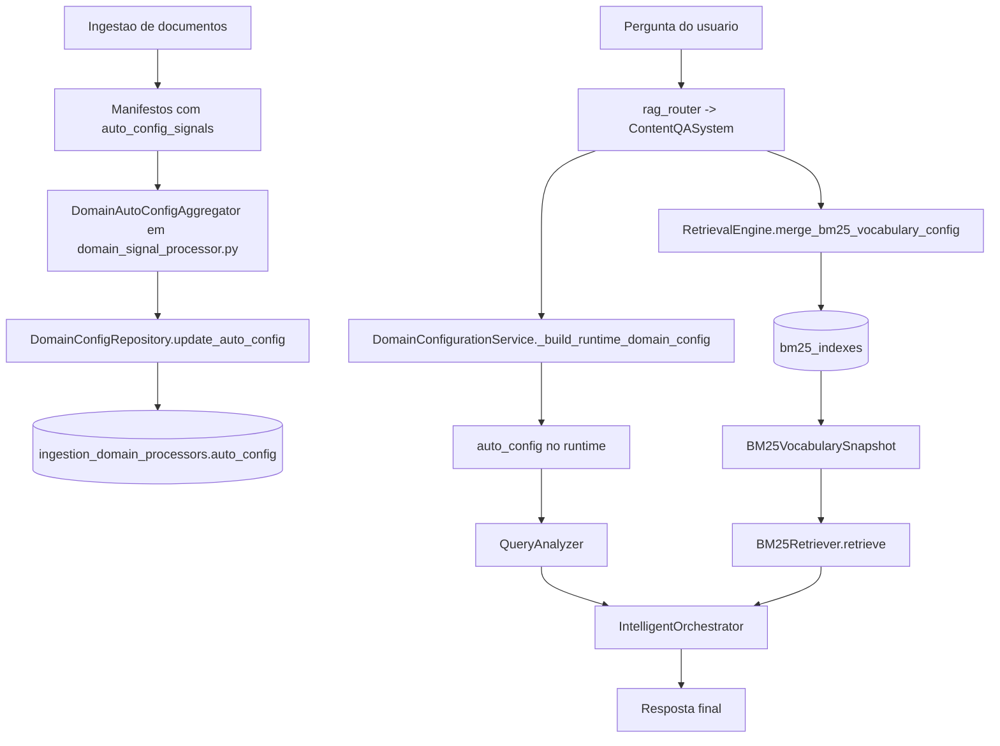
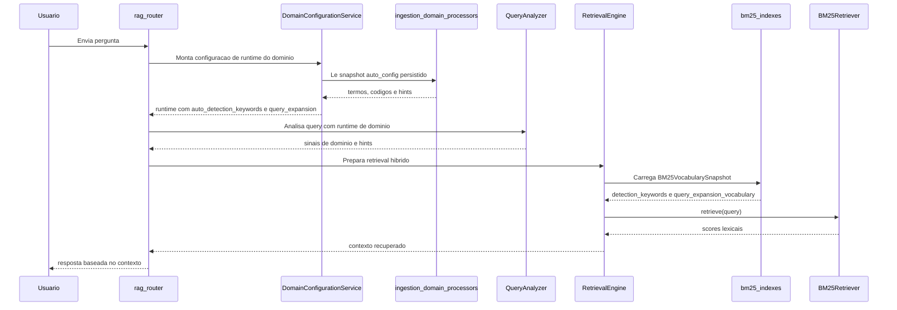
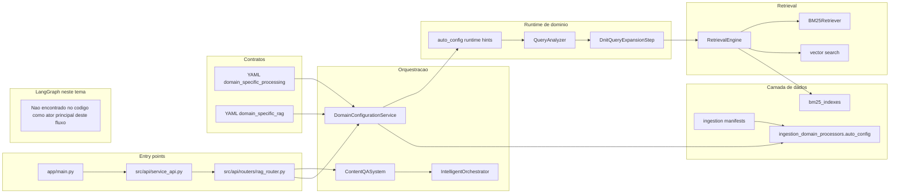
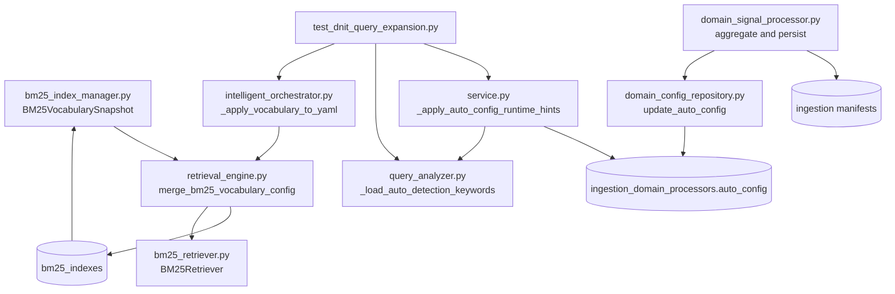

# 1) Tutorial 101: BM25 vs auto_config no pipeline DNIT

Se voce acabou de entrar no projeto, este tutorial existe para tirar a confusao mais comum do pipeline RAG: BM25 e auto_config ajudam a resposta, mas ajudam de jeitos diferentes. Aqui eu vou mostrar o fluxo real observado no codigo, onde cada peca entra, o que ja funciona, o que ainda depende de configuracao e qual e o menor caminho para validar isso no tema DNIT.

## 2) Para quem e este tutorial

Publico principal: desenvolvedor junior.

Ao final voce deve conseguir:

- explicar por que BM25 e auto_config nao competem entre si;
- localizar no repositorio onde o vocabulario BM25 entra no runtime;
- localizar onde o auto_config persistido vira dica de runtime para a query;
- entender por que os testes DNIT focam em expansao de consulta e hints;
- montar um plano seguro para evoluir esse fluxo sem quebrar o RAG.

## 3) Dicionario rapido

- BM25: algoritmo de busca lexical que pontua termos exatos e raros. Evidencia: src/qa_layer/rag_engine/bm25_retriever.py, classe BM25Retriever.
- auto_config: snapshot derivado da ingestao com sinais de dominio, termos, codigos e pistas de expansao. Evidencia: src/ingestion_layer/processors/domain_plugins/domain_config_repository.py, metodo update_auto_config.
- snapshot: fotografia persistida de vocabulario e metadados em um momento da ingestao. Evidencia: src/qa_layer/rag_engine/bm25_index_manager.py, dataclass BM25VocabularySnapshot.
- query expansion: enriquecimento da pergunta com termos relacionados para melhorar cobertura. Evidencia: tests/unit/qa_layer/rag_engine/test_dnit_query_expansion.py.
- detection keywords: palavras usadas para ajudar a identificar o dominio da pergunta. Evidencia: src/qa_layer/rag_engine/query_analyzer.py, metodo _load_auto_detection_keywords.
- runtime domain config: configuracao de dominio montada na hora da pergunta. Evidencia: src/domain_configuration/service.py, metodo _build_runtime_domain_config.
- retrieval hibrido: recuperacao que junta sinais lexicais e sinais semanticos. Evidencia: src/qa_layer/rag_engine/retrieval_engine.py e src/qa_layer/rag_engine/bm25_retriever.py.
- manifest de ingestao: registro persistido do que foi processado e dos sinais extraidos. Evidencia: src/ingestion_layer/telemetry/domain_signal_processor.py.
- rag_router: camada HTTP que recebe ingestao, pergunta e reindexacao. Evidencia: src/api/routers/rag_router.py.

## 4) Conceito em linguagem simples

Pense no sistema como um bibliotecario especializado em normas DNIT.

BM25 e a parte do bibliotecario que olha o texto impresso do documento e pensa: “essa pergunta citou o codigo certo, a sigla certa ou a expressao exata?”. Ele e forte quando a pergunta traz termos literais como DNIT 031, concreto asfaltico ou uma sigla muito especifica. Isso aparece no codigo quando o runtime carrega vocabulario persistido do BM25 e usa o BM25Retriever para pontuar ocorrencias lexicais. Evidencia: src/qa_layer/rag_engine/retrieval_engine.py, metodo merge_bm25_vocabulary_config; src/qa_layer/rag_engine/bm25_retriever.py, metodo retrieve.

auto_config e a parte do bibliotecario que aprendeu o assunto da estante com a ingestao. Em vez de procurar so a palavra exata, ele pensa: “quem pergunta sobre fresagem tambem pode estar falando de pavimento, camada, remendo, norma e tabela tecnica relacionada”. Isso aparece quando a ingestao agrega sinais de dominio e grava um snapshot na coluna ingestion_domain_processors.auto_config, depois carregado no runtime pelo DomainConfigurationService e lido pelo QueryAnalyzer. Evidencia: src/ingestion_layer/processors/domain_plugins/domain_config_repository.py, metodo update_auto_config; src/domain_configuration/service.py, metodo _apply_auto_config_runtime_hints; src/qa_layer/rag_engine/query_analyzer.py, metodo _load_auto_detection_keywords.

Resumo de bolso:

- auto_config melhora a pergunta e a leitura do dominio;
- BM25 melhora a recuperacao literal;
- os dois juntos ajudam o RAG a achar melhor e mais cedo o contexto certo.

## 5) Mapa de navegacao do repo

- src/api/routers: entradas HTTP; mexa aqui quando o fluxo comecar em endpoint como /rag/ingest ou /rag/reindex.
- src/api/service_api.py: composicao do app FastAPI e include_router do rag_router; mexa aqui se o router nao estiver plugado.
- src/domain_configuration: montagem da configuracao de dominio em runtime; mexa aqui quando a pergunta precisar de dicas adicionais vindas da ingestao.
- src/qa_layer/rag_engine: coracao do retrieval; mexa aqui quando o assunto for BM25, query analyzer, orchestrator ou recuperacao hibrida.
- src/ingestion_layer/telemetry: sinais e snapshots derivados da ingestao; mexa aqui quando quiser entender de onde vem o auto_config.
- src/ingestion_layer/processors/domain_plugins: persistencia do auto_config por dominio; mexa aqui quando o snapshot nao estiver sendo salvo.
- tests/unit/qa_layer/rag_engine: testes de comportamento do RAG; mexa aqui para proteger query expansion, deteccao e hints.
- docs: documentacao consolidada; nao espalhe novo manual se o assunto ja existir em README-RAG ou README-INGESTAO.
- app/main.py: entrypoint principal para subir o FastAPI; use para validar o caminho minimo local.
- service_api.py: wrapper de entrada que delega para src.api.service_api:app; mexa aqui so se o bootstrap do servico mudar.

## 6) Mapa visual 1: fluxo macro

Observacao: a validacao automatica de Mermaid nao estava disponivel no ambiente durante esta geracao.

## 7) Mapa visual 2: quem chama quem

## 8) Mapa visual 3: camadas

## 9) Mapa visual 4: componentes

## 10) Onde isso aparece neste projeto

- O endpoint principal de ingestao e POST /rag/ingest. Evidencia: src/api/routers/rag_router.py, funcao ingest_content_endpoint.
- O endpoint principal de ETL e POST /rag/etl. Evidencia: src/api/routers/rag_router.py, funcao extract_transform_load_endpoint.
- O endpoint de reindexacao BM25 e POST /rag/reindex. Evidencia: src/api/routers/rag_router.py, funcao reindex_bm25_endpoint.
- O rag_router entra no app FastAPI pelo include_router do service_api. Evidencia: src/api/service_api.py, linhas de include_router do rag_router.
- O runtime de dominio e montado no DomainConfigurationService. Evidencia: src/domain_configuration/service.py, metodo _build_runtime_domain_config.
- O auto_config manual e o auto_config derivado sao mesclados antes de virar hints de runtime. Evidencia: src/domain_configuration/service.py, metodos _merge_manual_auto_config e _apply_auto_config_runtime_hints.
- O QueryAnalyzer carrega keywords vindas do auto_config. Evidencia: src/qa_layer/rag_engine/query_analyzer.py, atribuicao auto_detection_keywords e metodo _load_auto_detection_keywords.
- O RetrievalEngine injeta vocabulario BM25 persistido no runtime. Evidencia: src/qa_layer/rag_engine/retrieval_engine.py, metodo merge_bm25_vocabulary_config.
- O BM25Retriever executa a busca lexical. Evidencia: src/qa_layer/rag_engine/bm25_retriever.py, metodo retrieve.
- O BM25VocabularySnapshot representa o que foi persistido para retrieval lexical. Evidencia: src/qa_layer/rag_engine/bm25_index_manager.py, dataclass BM25VocabularySnapshot.
- O snapshot auto_config e salvo por dominio durante a ingestao. Evidencia: src/ingestion_layer/processors/domain_plugins/domain_config_repository.py, metodo update_auto_config.
- O DNIT ja tem testes focados em expansao e hints. Evidencia: tests/unit/qa_layer/rag_engine/test_dnit_query_expansion.py.

## 11) Caminho real no codigo

- src/api/service_api.py: registra o rag_router no FastAPI.
- src/api/routers/rag_router.py: recebe ingestao, ETL e reindexacao BM25; e a fronteira HTTP do fluxo.
- app/main.py: sobe o servidor uvicorn usando src.api.service_api:app.
- src/domain_configuration/service.py: transforma configuracao estatica e auto_config persistido em configuracao de runtime.
- src/qa_layer/rag_engine/query_analyzer.py: usa sinais de auto_config para identificar dominio e enriquecer a analise da pergunta.
- src/qa_layer/rag_engine/intelligent_orchestrator.py: junta sinais de dominio, vocabulos e etapas de expansao antes da recuperacao final.
- src/qa_layer/rag_engine/retrieval_engine.py: integra o snapshot BM25 ao runtime de retrieval.
- src/qa_layer/rag_engine/bm25_index_manager.py: define o snapshot BM25 e a leitura/escrita do indice persistido.
- src/qa_layer/rag_engine/bm25_retriever.py: executa a pontuacao lexical BM25.
- src/ingestion_layer/telemetry/domain_signal_processor.py: agrega sinais da ingestao para formar auto_config.
- src/ingestion_layer/processors/domain_plugins/domain_config_repository.py: persiste o auto_config final em ingestion_domain_processors.
- tests/unit/qa_layer/rag_engine/test_dnit_query_expansion.py: prova o comportamento DNIT mais importante para este tema.

## 12) Fluxo passo a passo

1. A ingestao entra por POST /rag/ingest em src/api/routers/rag_router.py, funcao ingest_content_endpoint.
2. Durante o processamento, a camada de telemetria agrega sinais de dominio. Evidencia: src/ingestion_layer/telemetry/domain_signal_processor.py.
3. Esses sinais sao consolidados e enviados ao repositorio de dominio, que decide se grava ou nao o auto_config. Evidencia: src/ingestion_layer/processors/domain_plugins/domain_config_repository.py, metodo update_auto_config.
4. O snapshot persistido vai para ingestion_domain_processors.auto_config. Evidencia: mesmo arquivo acima.
5. Quando uma pergunta chega, o DomainConfigurationService monta a configuracao de runtime do dominio. Evidencia: src/domain_configuration/service.py, metodo _build_runtime_domain_config.
6. Nessa montagem, o auto_config e transformado em hints de deteccao, expansao e vocabulario auxiliar. Evidencia: src/domain_configuration/service.py, metodo _apply_auto_config_runtime_hints.
7. O QueryAnalyzer carrega as auto_detection_keywords e usa isso para ajudar a reconhecer o dominio da pergunta. Evidencia: src/qa_layer/rag_engine/query_analyzer.py, metodo _load_auto_detection_keywords.
8. Em paralelo, o RetrievalEngine consulta o snapshot BM25 persistido e injeta detection_keywords e query_expansion_vocabulary no runtime. Evidencia: src/qa_layer/rag_engine/retrieval_engine.py, metodo merge_bm25_vocabulary_config.
9. O BM25Retriever pontua o texto literal com base nesse vocabulário e no corpus indexado. Evidencia: src/qa_layer/rag_engine/bm25_retriever.py, metodo retrieve.
10. O IntelligentOrchestrator combina esses sinais para decidir o melhor contexto antes da resposta. Evidencia: src/qa_layer/rag_engine/intelligent_orchestrator.py, metodos _apply_vocabulary_to_yaml e _merge_bm25_vocabulary_config.

### Com config ativa

Quando domain_specific_processing e domain_specific_rag estao habilitados no YAML, o runtime consegue carregar hints vindos da ingestao e usa-los na analise da pergunta e na expansao. Evidencia: src/domain_configuration/service.py e src/qa_layer/rag_engine/intelligent_orchestrator.py.

### No estado atual do codigo

O fluxo existe e esta implementado. O que varia de ambiente para ambiente e a disponibilidade dos snapshots persistidos e das variaveis de ambiente do PostgreSQL. Sem isso, o pipeline segue existindo, mas perde parte da inteligencia de dominio ou a persistencia do BM25. Evidencia: src/qa_layer/rag_engine/bm25_index_manager.py, validacao de BM25_INDEX_DATABASE_DSN; src/ingestion_layer/processors/domain_plugins/domain_config_repository.py, leitura de INGESTION_TELEMETRY_STORAGE e INGESTION_TELEMETRY_DSN.

## 13) Status: esta pronto? quanto esta pronto?

| Area | Evidencia | Status | Impacto pratico | Proximo passo minimo |
| --- | --- | --- | --- | --- |
| Entry HTTP de ingestao | src/api/routers/rag_router.py, ingest_content_endpoint | pronto | Ha ponto de entrada claro para gerar sinais de dominio | Validar payload real do tenant |
| Persistencia de auto_config | src/ingestion_layer/processors/domain_plugins/domain_config_repository.py, update_auto_config | pronto | O snapshot pode ser gravado por dominio | Melhorar logs decisorios de gravacao |
| Runtime de auto_config | src/domain_configuration/service.py, _apply_auto_config_runtime_hints | pronto | A pergunta recebe hints, keywords e expansao | Aumentar observabilidade de quais hints entraram |
| Consumo no QueryAnalyzer | src/qa_layer/rag_engine/query_analyzer.py, _load_auto_detection_keywords | pronto | Ajuda a detectar dominio com base no historico de ingestao | Medir precisao por dominio |
| Persistencia BM25 | src/qa_layer/rag_engine/bm25_index_manager.py | pronto | O vocabulario lexical pode ser salvo e recarregado | Confirmar cobertura em todos os tenants |
| Integracao BM25 no runtime | src/qa_layer/rag_engine/retrieval_engine.py, merge_bm25_vocabulary_config | pronto | A busca lexical recebe vocabulario persistido | Adicionar metricas comparativas por consulta |
| Retrieval lexical | src/qa_layer/rag_engine/bm25_retriever.py, retrieve | pronto | Termos exatos e codigos literais ganham peso | Afinar relevancia em dominios ruidosos |
| Casos DNIT de expansao | tests/unit/qa_layer/rag_engine/test_dnit_query_expansion.py | pronto | Ha prova automatizada de enriquecimento DNIT | Adicionar benchmarks agressivos com corpus real |
| Execucao local minima | app/main.py e docs/README-TESTS.MD | parcial | Subir API e facil, mas depende de env correta e bancos | Montar arquivo de ambiente minimo por cenario |
| Execucao em container/cloud | Dockerfile e ausencia de compose dedicado no escopo analisado | parcial | Existe imagem, mas nao foi encontrado no escopo um roteiro completo para BM25 + telemetria + Redis | Criar compose/tutorial operacional especifico |
| Benchmark formal BM25 vs auto_config | Nao encontrado no codigo analisado | ausente | Nao ha numero comparativo reproduzivel por tenant | Criar suite de benchmark DNIT |

## 14) Como colocar para funcionar

Passo 0. Prepare o ambiente Python 3.11 e a .venv. Evidencia: pyproject.toml e docs/README-TESTS.MD.

Passo 1. Defina FASTAPI_PORT, porque ele e obrigatorio. Evidencia: src/config/config_api/system_config_manager.py, metodo _get_required_fastapi_port.

Passo 2. Se quiser validar BM25 persistido, defina BM25_INDEX_DATABASE_DSN. Sem isso o BM25IndexManager falha ao tentar usar persistencia PostgreSQL. Evidencia: src/qa_layer/rag_engine/bm25_index_manager.py, validacao do DSN; src/config/config_api/system_config_manager.py, leitura de BM25_INDEX_DATABASE_DSN, BM25_INDEX_SCHEMA e BM25_INDEX_TABLE.

Passo 3. Se quiser validar auto_config persistido pela ingestao, defina o backend de telemetria com INGESTION_TELEMETRY_STORAGE e o acesso com INGESTION_TELEMETRY_DSN. Evidencia: src/ingestion_layer/processors/domain_plugins/domain_config_repository.py.

Passo 4. Suba a API pelo caminho oficial. Comando minimo observado no repo: `source .venv/bin/activate && python app/main.py`. Evidencia: docstring de app/main.py.

Passo 5. Verifique se o rag_router esta carregado. O app inclui esse router em src/api/service_api.py. Evidencia: include_router do rag_router.

Passo 6. Execute uma ingestao com POST /rag/ingest para gerar ou atualizar sinais de dominio. Evidencia: src/api/routers/rag_router.py, ingest_content_endpoint.

Passo 7. Se o foco for lexical, use POST /rag/reindex para descartar e reconstruir o indice BM25. Evidencia: src/api/routers/rag_router.py, reindex_bm25_endpoint.

Passo 8. Valide o comportamento DNIT pelo teste de menor custo operacional. Comando focado: `source .venv/bin/activate && PROMETEU_RUNNING_TESTS=1 pytest tests/unit/qa_layer/rag_engine/test_dnit_query_expansion.py -q`. Evidencia: docs/README-TESTS.MD e tests/unit/qa_layer/rag_engine/test_dnit_query_expansion.py.

Passo 9. O que eu espero ver:

- a API sobe com uvicorn apontando para src.api.service_api:app. Evidencia: app/main.py;
- o runtime carrega o router /rag. Evidencia: src/api/service_api.py e src/api/routers/rag_router.py;
- o teste DNIT fica verde quando query expansion e hints continuam coerentes. Evidencia: tests/unit/qa_layer/rag_engine/test_dnit_query_expansion.py.

O que nao foi encontrado no codigo/config analisado:

- um compose dedicado que suba automaticamente todos os recursos minimos para BM25 persistido, telemetria de ingestao e Redis neste cenario especifico;
- um roteiro cloud completo apenas para este fluxo.

## 15) ELI5: onde coloco cada parte da feature neste projeto?

Se voce quer mexer neste assunto, pense assim: entrada na API, montagem de runtime, retrieval e persistencia sao lugares diferentes e cada um resolve um problema diferente.

| Pergunta | Resposta | Camada | Onde no repo |
| --- | --- | --- | --- |
| Onde eu recebo a requisicao? | No rag_router | Entry | src/api/routers/rag_router.py |
| Onde a pergunta ganha contexto de dominio? | No DomainConfigurationService | Orquestracao/runtime | src/domain_configuration/service.py |
| Onde a pergunta ganha keywords automaticas? | No QueryAnalyzer | Runtime de dominio | src/qa_layer/rag_engine/query_analyzer.py |
| Onde o BM25 entra de verdade? | No RetrievalEngine e no BM25Retriever | Retrieval | src/qa_layer/rag_engine/retrieval_engine.py e src/qa_layer/rag_engine/bm25_retriever.py |
| Onde o auto_config nasce? | Na telemetria da ingestao | Ingestao/telemetria | src/ingestion_layer/telemetry/domain_signal_processor.py |
| Onde o auto_config e salvo? | No DomainConfigRepository | Persistencia | src/ingestion_layer/processors/domain_plugins/domain_config_repository.py |
| Onde eu vejo prova automatizada do DNIT? | No teste de query expansion | Teste unitario | tests/unit/qa_layer/rag_engine/test_dnit_query_expansion.py |

## 16) Template de mudanca

1. Entrada: qual endpoint dispara?

Paths: src/api/routers/rag_router.py.

Contrato de entrada: ingestao em /rag/ingest; reindexacao em /rag/reindex.

2. Config: qual YAML ou env controla?

Keys: domain_specific_processing, domain_specific_rag, FASTAPI_PORT, BM25_INDEX_DATABASE_DSN, BM25_INDEX_SCHEMA, BM25_INDEX_TABLE, INGESTION_TELEMETRY_STORAGE, INGESTION_TELEMETRY_DSN.

Onde e lido: src/config/config_api/system_config_manager.py e src/ingestion_layer/processors/domain_plugins/domain_config_repository.py.

3. Execucao: qual componente entra?

Builder ou factory principal: DomainConfigurationService para hints de dominio e RetrievalEngine para integracao BM25.

State relevante: runtime domain config, auto_detection_keywords, detection_keywords, query_expansion_vocabulary.

4. Ferramentas: quais tools sao usadas?

Para este fluxo especifico, nao foi encontrado no codigo analisado um Tool LangChain como ator principal. O fluxo e dominado por servicos e componentes de retrieval.

5. Dados: onde persiste, cacheia ou indexa?

MySQL: nao encontrado no codigo analisado como armazenamento principal deste tema.

Redis: aparece como suporte operacional do router para jobs e progresso, nao como armazenamento principal do BM25 ou auto_config. Evidencia: src/api/routers/rag_router.py.

PostgreSQL: bm25_indexes e ingestion_domain_processors.auto_config. Evidencia: src/qa_layer/rag_engine/bm25_index_manager.py e src/ingestion_layer/processors/domain_plugins/domain_config_repository.py.

Qdrant ou outros: a busca vetorial existe no projeto, mas nao foi o foco principal do trecho de codigo analisado neste tutorial.

6. Observabilidade: onde loga?

Logs de bootstrap: app/main.py e service_api.py.

Logs de runtime BM25 e auto_config: src/qa_layer/rag_engine/retrieval_engine.py, src/domain_configuration/service.py e src/qa_layer/rag_engine/query_analyzer.py.

7. Testes: onde validar?

Unit: tests/unit/qa_layer/rag_engine/test_dnit_query_expansion.py.

Integration: nao foi localizado no escopo analisado um teste de integracao dedicado apenas a BM25 vs auto_config DNIT.

## 17) CUIDADO: o que NAO fazer

- Nao coloque parsing de YAML dentro do endpoint so para “ficar rapido”; isso mistura fronteira HTTP com regra de montagem de runtime e dificulta depuracao. Alternativa segura: manter a montagem centralizada em servicos como DomainConfigurationService.
- Nao trate BM25 como substituto de auto_config; isso empobrece perguntas implicitas de dominio e piora consultas sem termo literal forte.
- Nao trate auto_config como substituto de retrieval lexical; isso perde vantagem em consultas com codigos, siglas e expressoes exatas.
- Nao grave snapshot de dominio fora do repositorio central; isso espalha regra de persistencia e aumenta risco de inconsistencias. Alternativa segura: usar DomainConfigRepository.
- Nao mexa primeiro em docs para “deduzir” o comportamento; neste tema a fonte de verdade e o codigo em src/qa_layer e src/domain_configuration.

## 18) Anti-exemplos

Anti-exemplo 1.

Erro comum: adicionar palavras de expansao DNIT diretamente no endpoint.

Por que e ruim: acopla regra de dominio ao HTTP e cria duplicacao.

Correcao: mover para runtime de dominio em src/domain_configuration/service.py ou para a etapa apropriada no orchestrator.

Anti-exemplo 2.

Erro comum: fazer o BM25Retriever consultar configuracao de tenant sozinho.

Por que e ruim: retrieval lexical deixa de ser componente focado e passa a misturar leitura de configuracao com pontuacao.

Correcao: manter a composicao no RetrievalEngine.

Anti-exemplo 3.

Erro comum: persistir auto_config direto da API.

Por que e ruim: o endpoint nao conhece todos os filtros de escopo e regras de merge.

Correcao: deixar a decisao no DomainConfigRepository.update_auto_config.

Anti-exemplo 4.

Erro comum: fazer teste DNIT depender de corpus externo real do banco.

Por que e ruim: perde determinismo e quebra rapido em ambiente local.

Correcao: manter comportamento protegido por testes unitarios focados como tests/unit/qa_layer/rag_engine/test_dnit_query_expansion.py.

## 19) Exemplos guiados

Exemplo 1. Pergunta com codigo literal DNIT.

Siga o fio assim: src/qa_layer/rag_engine/retrieval_engine.py injeta vocabulario BM25 persistido; depois src/qa_layer/rag_engine/bm25_retriever.py prioriza a coincidencia lexical. Uso pratico: quando o usuario digita um codigo de norma ou sigla exata, BM25 tende a ser a primeira alavanca forte.

Exemplo 2. Pergunta vaga, mas com contexto tecnico implicito.

Siga o fio assim: src/domain_configuration/service.py transforma auto_config persistido em hints; depois src/qa_layer/rag_engine/query_analyzer.py carrega auto_detection_keywords. Uso pratico: o usuario nao cita o codigo, mas a pergunta fala de pavimento, camada, granulometria ou fresagem, e o sistema ganha pistas para entender o dominio certo.

Exemplo 3. Caso DNIT com hints especiais.

Siga o fio assim: tests/unit/qa_layer/rag_engine/test_dnit_query_expansion.py prova que sinais como auto_config_slow_scan, auto_config_limit_hit e prioritize_domain_tables entram no fluxo; depois src/qa_layer/rag_engine/intelligent_orchestrator.py aplica o vocabulario ao runtime final. Uso pratico: mesmo quando o scan automatico e limitado ou truncado, o sistema ainda preserva pistas operacionais para nao perder completamente o dominio.

## 20) Erros comuns e como reconhecer

1. Sintoma observavel: a pergunta DNIT volta generica demais.

Hipotese: o auto_config nao entrou no runtime.

Como confirmar: verifique src/domain_configuration/service.py e procure a execucao de _apply_auto_config_runtime_hints; depois confira se o QueryAnalyzer carrega auto_detection_keywords em src/qa_layer/rag_engine/query_analyzer.py.

Correcao segura: corrigir a montagem do runtime antes de alterar retrieval.

2. Sintoma observavel: consulta com codigo exato nao melhora.

Hipotese: o vocabulario BM25 persistido nao foi carregado.

Como confirmar: verifique src/qa_layer/rag_engine/retrieval_engine.py e src/qa_layer/rag_engine/bm25_index_manager.py; procure a leitura do BM25VocabularySnapshot e o DSN BM25_INDEX_DATABASE_DSN.

Correcao segura: restaurar a persistencia ou reindexacao BM25 antes de mexer no orchestrator.

3. Sintoma observavel: a ingestao termina, mas nao aparece novo snapshot de dominio.

Hipotese: o repositorio de dominio recusou a gravacao por escopo ou falta de backend.

Como confirmar: verifique src/ingestion_layer/processors/domain_plugins/domain_config_repository.py, especialmente update_auto_config e _resolve_scope_filters.

Correcao segura: corrigir configuracao de telemetria e filtros de escopo.

4. Sintoma observavel: o teste DNIT de expansao falha apos uma mudanca aparentemente pequena.

Hipotese: alguma etapa removeu hints ou alterou merge de vocabulario.

Como confirmar: leia tests/unit/qa_layer/rag_engine/test_dnit_query_expansion.py e depois compare com src/domain_configuration/service.py e src/qa_layer/rag_engine/intelligent_orchestrator.py.

Correcao segura: restaurar o merge de hints ou ajustar a mudanca de forma compativel com o contrato do teste.

5. Sintoma observavel: a API nao sobe.

Hipotese: FASTAPI_PORT ausente ou invalido.

Como confirmar: verifique src/config/config_api/system_config_manager.py, metodo _get_required_fastapi_port.

Correcao segura: definir FASTAPI_PORT com valor valido entre 1 e 65535.

6. Sintoma observavel: reindexacao BM25 falha cedo.

Hipotese: BM25_INDEX_DATABASE_DSN nao foi definido.

Como confirmar: verifique a validacao em src/qa_layer/rag_engine/bm25_index_manager.py.

Correcao segura: fornecer DSN PostgreSQL correto para o indice BM25.

## 21) Exercicios guiados

Exercicio 1.

Objetivo: provar para voce mesmo onde o auto_config entra no runtime.

Passos: abra src/domain_configuration/service.py; localize _apply_auto_config_runtime_hints; depois abra src/qa_layer/rag_engine/query_analyzer.py e localize _load_auto_detection_keywords.

Como verificar no codigo: confirme que a saida do service alimenta a analise da query.

Gabarito: o auto_config nao faz retrieval sozinho; ele prepara hints e keywords para analise e expansao.

Exercicio 2.

Objetivo: achar o ponto exato onde o BM25 entra no runtime.

Passos: abra src/qa_layer/rag_engine/retrieval_engine.py; localize merge_bm25_vocabulary_config; depois abra src/qa_layer/rag_engine/bm25_retriever.py.

Como verificar no codigo: confirme que o RetrievalEngine prepara os dados e o BM25Retriever executa a busca lexical.

Gabarito: BM25 nao nasce no endpoint nem no QueryAnalyzer; ele entra na camada de retrieval.

Exercicio 3.

Objetivo: entender por que o caso DNIT e um bom teste de regressao.

Passos: abra tests/unit/qa_layer/rag_engine/test_dnit_query_expansion.py; identifique os cenarios de vocabulario automatico, slow scan e vocabulario inline.

Como verificar no codigo: procure os hints esperados e depois rastreie onde eles sao produzidos nos arquivos do runtime.

Gabarito: DNIT cobre bem o valor pratico do auto_config porque usa termos tecnicos, tabelas, hints de escaneamento e enriquecimento semantico.

## 22) Checklist final

- Eu sei apontar a diferenca entre auto_config e BM25.
- Eu sei onde a ingestao grava o auto_config.
- Eu sei onde o runtime le o auto_config.
- Eu sei onde o BM25 persistido e carregado.
- Eu sei qual endpoint dispara ingestao.
- Eu sei qual endpoint dispara reindexacao BM25.
- Eu sei quais envs minimas preciso para subir a API.
- Eu sei quais envs minimas preciso para persistencia BM25.
- Eu sei quais envs minimas preciso para persistencia do auto_config.
- Eu sei qual teste DNIT protege query expansion.
- Eu sei que BM25 e melhor para termo literal.
- Eu sei que auto_config e melhor para contexto e enriquecimento da pergunta.
- Eu sei que os dois podem atuar juntos.

## 23) Checklist de PR quando mexer nisso

- Confirmar se a mudanca comeca em endpoint, runtime ou retrieval.
- Validar se o comportamento continua coerente em src/domain_configuration/service.py.
- Validar se o QueryAnalyzer continua carregando auto_detection_keywords.
- Validar se o RetrievalEngine continua mesclando o snapshot BM25.
- Validar se o BM25Retriever continua focado em retrieval lexical, sem acoplamento indevido.
- Validar se a persistencia do auto_config continua centralizada no DomainConfigRepository.
- Rodar o teste tests/unit/qa_layer/rag_engine/test_dnit_query_expansion.py.
- Se a mudanca for ampla, rodar a suite oficial descrita em docs/README-TESTS.MD.
- Verificar se alguma mudanca exige atualizar docs/README-RAG.md ou docs/README-INGESTAO.md.
- Nao introduzir fallback silencioso para env ou YAML obrigatorio.

## 24) Referencias

Referencias internas:

- README.md
- docs/README-RAG.md
- docs/README-INGESTAO.md
- docs/README-TESTS.MD
- app/main.py
- service_api.py
- src/api/service_api.py
- src/api/routers/rag_router.py
- src/domain_configuration/service.py
- src/qa_layer/rag_engine/query_analyzer.py
- src/qa_layer/rag_engine/intelligent_orchestrator.py
- src/qa_layer/rag_engine/retrieval_engine.py
- src/qa_layer/rag_engine/bm25_retriever.py
- src/qa_layer/rag_engine/bm25_index_manager.py
- src/ingestion_layer/telemetry/domain_signal_processor.py
- src/ingestion_layer/processors/domain_plugins/domain_config_repository.py
- tests/unit/qa_layer/rag_engine/test_dnit_query_expansion.py

Referencias externas consultadas:

- Documentacao oficial do LangChain, pagina overview, usada apenas como referencia normativa do ecossistema.
- Pagina do pacote rank-bm25 no PyPI, usada apenas como referencia normativa do algoritmo BM25 utilizado pelo projeto.
