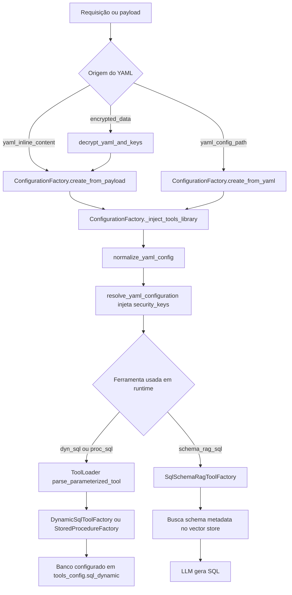
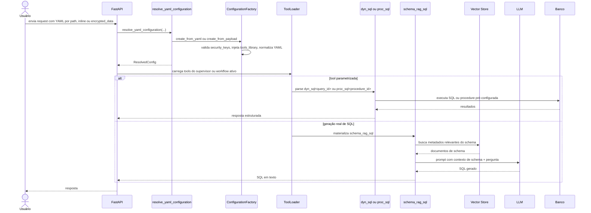
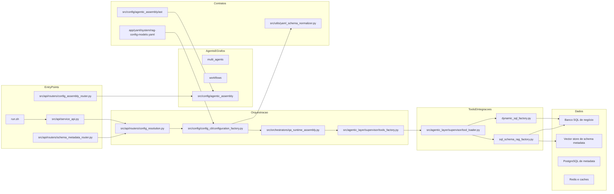
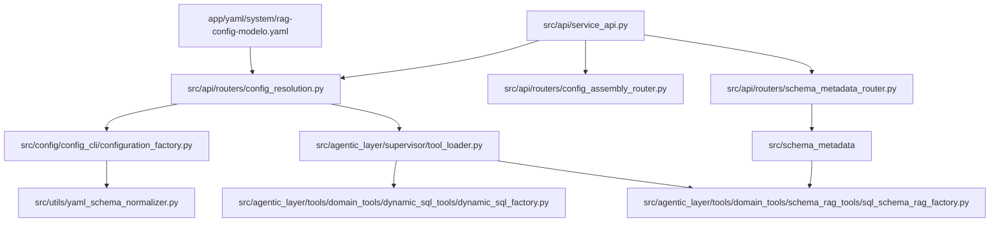
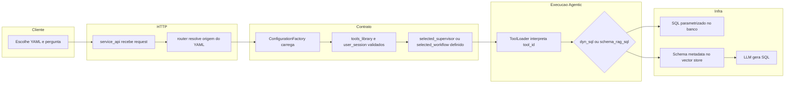

# Tutorial 101: Configuração de YAML, Execução Local e NL para SQL

Se você acabou de entrar neste repositório, este tutorial é o caminho mais curto para entender três coisas que sempre se misturam aqui: como o YAML é aceito e validado, o que realmente precisa ser rodado para subir a aplicação localmente, e o que o projeto chama de NL para SQL. A regra mais importante é simples: neste código, nem todo uso de SQL por linguagem natural gera SQL novo. Existe um caminho mais seguro, baseado em queries pré-aprovadas, e existe um caminho de geração real de SQL a partir de metadados de schema.

## Para quem é este tutorial

- Iniciante que precisa subir a API e entender de onde o YAML entra.
- Desenvolvedor de negócio que vai mexer em tools, supervisor ou workflow.
- Desenvolvedor de dados que quer entender a diferença entre dyn_sql e schema_rag_sql.
- Pessoa de sustentação que precisa diagnosticar por que um YAML não sobe ou por que o NL para SQL não responde.

Ao final, você vai conseguir:

- Identificar o contrato mínimo que um YAML precisa respeitar.
- Subir a API localmente pelo entry point real do projeto.
- Entender quando usar o run.sh em vez de subir um processo solto.
- Entender a diferença prática entre dyn_sql, proc_sql e schema_rag_sql.
- Reconhecer o que já está pronto e o que ainda está parcial no fluxo de NL para SQL.
- Saber onde mexer para evoluir uma feature sem quebrar o contrato agentic.

## Dicionário rápido

- YAML: arquivo de configuração que descreve comportamento da plataforma, agentes, workflows, tools e integrações.
- user_session: bloco obrigatório na raiz do YAML com correlation_id e contexto do usuário para isolamento multi-tenant.
- tools_library: catálogo raiz de tools; se existir e estiver vazio, o sistema tenta injetar o catálogo central.
- selected_supervisor: seletor do supervisor ativo quando o YAML usa multi_agents.
- selected_workflow: seletor do workflow ativo quando o YAML usa workflows.
- dyn_sql: tool parametrizada que escolhe uma query SQL já cadastrada no YAML ou publicada por tenant em `integrations.sql_query_registry`, usando a sintaxe dyn_sql<query_id>.
- proc_sql: tool parametrizada que chama uma procedure aprovada, usando a sintaxe proc_sql<procedure_id>.
- schema_rag_sql: tool de NL para SQL real; ela busca metadados de schema em vector store e depois pede ao LLM para gerar SQL.
- schema metadata: conjunto de metadados sobre tabelas, colunas e relacionamentos usado como contexto para schema_rag_sql.
- AST agentic: representação tipada do YAML agentic usada pelo fluxo oficial de draft, validate e confirm.

## Conceito em linguagem simples

Pense no YAML como a planta de uma casa. Ele não é a casa rodando, mas ele diz onde cada cômodo fica, quais portas existem e quais ferramentas cada agente pode usar. O runtime lê essa planta, valida se ela faz sentido e então monta a execução.

Agora pense no SQL em dois níveis. No primeiro nível, você já tem algumas consultas prontas guardadas numa gaveta. O agente só escolhe qual gaveta abrir e quais parâmetros preencher. Isso é dyn_sql. No segundo nível, você entrega para o sistema um “mapa do banco” e pede para ele escrever uma consulta nova com base nesse mapa. Isso é schema_rag_sql.

Na prática, isso muda tudo. dyn_sql é mais controlado e previsível. schema_rag_sql é mais flexível, mas depende de mais peças: metadados indexados, vector store configurado e LLM respondendo bem.

O erro mais comum de quem entra agora é achar que qualquer pergunta em linguagem natural vira SQL gerado na hora. Não. Pelo código atual, o caminho mais maduro é o de queries pré-cadastradas. O caminho de geração real existe, mas ainda está mais perto de “base pronta para uso controlado” do que de “fluxo amplamente exemplificado no repositório”.

## Mapa de navegação do repo

- app/yaml: onde ficam os YAMLs reais de clientes e o rag-config-modelo.yaml; mexa aqui quando precisar configurar runtime, tools ou seleção de supervisor/workflow.
- src/api/service_api.py: app FastAPI real e registro das famílias de rotas; mexa aqui só quando precisar publicar nova superfície HTTP.
- src/api/routers/config_resolution.py: resolve de onde o YAML veio e injeta security_keys do diretório multi-tenant; mexa aqui se o problema for carga de configuração.
- src/config/config_cli/configuration_factory.py: carrega YAML, valida security_keys, injeta tools_library e normaliza contrato; mexa aqui se o YAML quebra antes do runtime.
- src/utils/yaml_schema_normalizer.py: validador estrutural do contrato YAML; mexa aqui se uma nova chave estrutural precisar virar contrato.
- src/config/agentic_assembly: fluxo AST oficial para draft, objective-to-yaml, validate, confirm e recommend-tools; mexa aqui para evolução assistida do YAML agentic.
- src/agentic_layer/supervisor: carga dinâmica de tools, inclusive dyn_sql e proc_sql; mexa aqui quando o problema for materialização de tools em runtime.
- src/agentic_layer/tools/domain_tools/dynamic_sql_tools: implementação do dyn_sql e proc_sql; mexa aqui quando a query parametrizada ou a procedure estiver com comportamento errado.
- src/agentic_layer/tools/domain_tools/schema_rag_tools: implementação do schema_rag_sql; mexa aqui para o fluxo de geração real de SQL.
- src/schema_metadata: ingestão, leitura e escrita de metadados de schema; mexa aqui quando precisar alimentar o contexto usado por schema_rag_sql.
- run.sh: launcher operacional da API, worker e scheduler; não invente outro entry point local antes de conferir este arquivo.
- scripts/suite_de_testes_padrao.sh: suíte oficial de validação; não troque a suíte por pytest solto como fluxo principal de fechamento.

## Mapa visual 1: fluxo macro

## Mapa visual 2: quem chama quem

## Mapa visual 3: camadas

## Mapa visual 4: componentes

## Mapa visual 5: swimlane funcional

## Onde isso aparece neste projeto

- O app HTTP real está em src/api/service_api.py e inclui schema_metadata_router e config_assembly_router.
- O entry point operacional local é run.sh, que sobe api, worker e scheduler conforme flags +a, +w e +s.
- A porta HTTP é resolvida por get_fastapi_config em src/config/config_api/system_config_manager.py.
- No workspace atual, .env define FEATURE_AGENTIC_AST_ENABLED=True e FASTAPI_PORT=5555.
- A resolução de YAML aceita três origens: encrypted_data, yaml_inline_content e yaml_config_path em src/api/routers/config_resolution.py -> resolve_yaml_configuration.
- O carregamento base do YAML é feito por src/config/config_cli/configuration_factory.py -> ConfigurationFactory.
- O contrato estrutural exige user_session na raiz e rejeita authentication.user_session em src/utils/yaml_schema_normalizer.py.
- tools_library é obrigatória na raiz; se existir vazia, pode ser auto-injetada do catálogo central em ConfigurationFactory._inject_tools_library.
- dyn_sql e proc_sql são tools parametrizadas interpretadas por src/agentic_layer/supervisor/tool_loader.py -> parse_parameterized_tool.
- O catálogo documenta a sintaxe dyn_sql<query_id> e proc_sql<procedure_id> em src/agentic_layer/tools/tools_library_builder.py.
- A implementação do dyn_sql está em src/agentic_layer/tools/domain_tools/dynamic_sql_tools/dynamic_sql_factory.py.
- A implementação do NL para SQL real está em src/agentic_layer/tools/domain_tools/schema_rag_tools/sql_schema_rag_factory.py.
- O validator agentic cobra schema_metadata.enabled=true e schema_metadata.vectorstore_id quando schema_rag_sql aparece em multi_agents, em src/config/agentic_assembly/validators/supervisor_semantic_validator.py.
- A ingestão dos metadados de schema é exposta via /schema-metadata em src/api/routers/schema_metadata_router.py.

## Caminho real no código

- src/api/routers/config_resolution.py -> resolve_yaml_configuration: escolhe entre YAML criptografado, inline ou por caminho.
- src/config/config_cli/configuration_factory.py -> create_from_yaml e create_from_payload: parseiam, validam e enriquecem o YAML.
- src/config/config_cli/configuration_factory.py -> _inject_tools_library: exige tools_library na raiz e injeta catálogo central se ela estiver vazia.
- src/utils/yaml_schema_normalizer.py -> YamlSchemaNormalizer.normalize: aplica as regras estruturais mais rígidas do contrato.
- src/config/config_api/system_config_manager.py -> get_fastapi_config: define host, port e parâmetros globais da API a partir do .env.
- app/runners/api_runner.py -> run_api_server: sobe uvicorn apontando para src.api.service_api:app.
- src/api/service_api.py: registra as rotas e monta o app FastAPI.
- src/api/routers/config_assembly_router.py: expõe /config/assembly/draft, /objective-to-yaml, /validate, /confirm, /schema, /catalog, /preflight e /recommend-tools.
- src/agentic_layer/supervisor/tool_loader.py -> parse_parameterized_tool: quebra `dyn_sql<id>` e `proc_sql<id>` em base_id e parâmetro.
- src/agentic_layer/tools/domain_tools/dynamic_sql_tools/dynamic_sql_factory.py -> create_dynamic_sql_tool: materializa uma query cadastrada em tools_config.sql_dynamic ou publicada como `query_code` em `integrations.sql_query_registry`.
- src/agentic_layer/tools/domain_tools/schema_rag_tools/sql_schema_rag_factory.py -> create_sql_schema_rag_tool: monta a tool que busca metadados e gera SQL.
- src/api/routers/schema_metadata_router.py -> ingest_schema: inicia ingestão de metadados do schema.
- app/yaml/system/rag-config-modelo.yaml: mostra o contrato esperado para schema_metadata e para tools_config.sql_dynamic.

## Fluxo passo a passo

1. A requisição chega na API com uma das três formas de configuração: encrypted_data, yaml_inline_content ou yaml_config_path.
2. O resolver HTTP chama resolve_yaml_configuration para unificar esse ponto de entrada.
3. ConfigurationFactory carrega o YAML, valida security_keys, injeta tools_library quando necessário e aplica normalize_yaml_config.
4. O normalizador rejeita layouts legados e exige user_session na raiz.
5. O runtime escolhe o alvo principal do documento, como selected_supervisor ou selected_workflow, conforme a estrutura agentic presente.
6. Quando um agente ou workflow pede uma tool, o ToolLoader verifica se ela é parametrizada, como dyn_sql<buscar_cliente>.
7. Se a tool for dyn_sql, a factory procura primeiro a query correspondente em tools_config.sql_dynamic.queries. Se não encontrar, busca o `query_code` em `integrations.sql_query_registry` usando `user_session.tenant_id`, resolve a conexão e cria uma tool específica para aquela query.
8. Se a tool for proc_sql, o processo é equivalente, mas para procedures aprovadas.
9. Se a tool for schema_rag_sql, a factory exige schema_metadata.vectorstore_id, cria um vector store configurado, busca documentos de schema por similaridade e monta um prompt para o LLM gerar SQL.
10. O resultado final volta para o agente, workflow ou endpoint que disparou a execução.

### Com config ativa

- Se tools_config.sql_dynamic estiver preenchido e um agente listar dyn_sql<query_id>, o sistema consegue executar a query parametrizada. Se a query não estiver no YAML, o mesmo ID pode ser resolvido como `query_code` publicado na tabela de integrações do tenant.
- Se FEATURE_AGENTIC_AST_ENABLED=true, o fluxo /config/assembly fica publicado e pode gerar, validar e confirmar YAML agentic.
- Se schema_metadata.enabled=true, schema_metadata.vectorstore_id estiver preenchido e a tool schema_rag_sql estiver disponível em runtime, o sistema consegue buscar contexto de schema e pedir ao LLM para gerar SQL.

### No estado atual deste repositório

- O caminho mais evidenciado e mais exemplificado é dyn_sql/proc_sql, porque existem muitos YAMLs reais usando essa sintaxe.
- O caminho schema_rag_sql existe no código, tem factory, validação semântica e contrato de configuração, mas não foi encontrado nenhum YAML real versionado habilitando essa tool.
- Isso significa que o recurso de NL para SQL real está implementado na base, porém ainda não aparece como trilha operacional exemplificada de ponta a ponta nos YAMLs do repositório.

## Status: está pronto? quanto está pronto?

| Área | Evidência | Status | Impacto prático | Próximo passo mínimo |
| --- | --- | --- | --- | --- |
| Carga de YAML por path, inline e encrypted_data | src/api/routers/config_resolution.py -> resolve_yaml_configuration | pronto | A API já aceita múltiplas origens de configuração | nenhum |
| Validação estrutural de user_session na raiz | src/utils/yaml_schema_normalizer.py | pronto | Falhas de contrato aparecem cedo, antes do runtime quebrar depois | nenhum |
| Exigência de tools_library na raiz | src/config/config_cli/configuration_factory.py -> _inject_tools_library | pronto | Sem a chave, o carregamento falha de forma explícita | manter o contrato |
| Auto-injeção de catálogo de tools | src/config/config_cli/configuration_factory.py -> _inject_tools_library | pronto | YAML pode declarar tools_library vazia e receber catálogo central | nenhum |
| Seleção de supervisor/workflow | src/config/agentic_assembly e contratos em docs/README-AGENTE-SUPERVISOR.md e docs/README-AGENTE-WORKFLOW.md | pronto | O runtime agentic sabe escolher o alvo ativo | nenhum |
| Fluxo AST assistido | src/api/routers/config_assembly_router.py | pronto | Já existe API para draft, validate, confirm e recommend-tools | usar quando a mudança for agentic |
| dyn_sql | dynamic_sql_factory.py e múltiplos YAMLs em app/yaml | pronto | Consultas parametrizadas já estão no caminho operacional normal | nenhum |
| proc_sql | tool_loader.py, tools_library_builder.py e YAMLs com proc_sql<...> | pronto | Procedures aprovadas podem ser disparadas de forma controlada | nenhum |
| schema_rag_sql factory | sql_schema_rag_factory.py | pronto | A tool sabe buscar schema metadata e pedir SQL ao LLM | nenhum |
| Validação de pré-requisitos do schema_rag_sql | supervisor_semantic_validator.py | pronto | Falta de schema_metadata.enabled ou vectorstore_id vira erro claro | nenhum |
| Exemplo real versionado de schema_rag_sql em YAML | busca em app/yaml/**/*.yaml | ausente | O time não tem um caso versionado de referência para copiar | criar um YAML de exemplo validado |
| Ingestão de schema metadata via API | src/api/routers/schema_metadata_router.py | parcial | Existe endpoint, mas não foi encontrado fluxo único versionado que já publique o cenário completo local + indexação no vector store | documentar ou automatizar pipeline fim a fim |
| Execução local da API | run.sh e app/runners/api_runner.py | pronto | Subir HTTP local é simples e explícito | nenhum |
| Infra local one-click para cenário NL para SQL fim a fim | código/config versionado analisado | ausente | Não há um caminho único versionado para subir todas as dependências do cenário completo | criar automação dedicada |

## Como colocar para funcionar

### Passo 0: escolha o caminho certo

- Se você precisa de algo que já está mais maduro hoje, comece com dyn_sql.
- Se você precisa de geração real de SQL a partir de linguagem natural, o alvo é schema_rag_sql, mas você vai precisar preparar schema metadata antes.

### Passo 1: prepare o ambiente Python do projeto

- Evidência: run.sh exige .venv/bin/python executável.
- Caminho mínimo: use a .venv do repositório.
- Comando operacional mínimo: source .venv/bin/activate

### Passo 2: suba a API local

- Evidência: run.sh e app/runners/api_runner.py.
- Comando mínimo: ./run.sh +a
- Comando para subir os três processos do projeto: ./run.sh +a +w +s
- O que eu espero ver: o runner imprime host, porta, quantidade de workers e app src.api.service_api:app.
- Porta atual do workspace: FASTAPI_PORT=5555 no .env.

### Passo 2.1: entenda o que o run.sh realmente faz

- O run.sh é o launcher operacional local do repositório. Ele não cria um processo híbrido. Ele apenas sobe os papéis escolhidos.
- A flag +a sobe a API.
- A flag +w sobe o worker oficial.
- A flag +s sobe o scheduler.
- Sem flag válida, o script falha cedo e não inicia nada. Isso é proposital para evitar bootstrap acidental.
- O script exige o Python da .venv. Se a .venv não estiver pronta, ele para antes de tentar subir qualquer processo.
- Cada papel é executado com entry point próprio. Na prática, isso preserva a separação real entre HTTP, consumo assíncrono e agendamento.
- Se um processo sair com erro, o run.sh registra qual papel caiu e mantém os demais vivos até o operador decidir interromper. Isso ajuda diagnóstico local porque evita derrubar tudo no primeiro erro.
- Quando você usa Ctrl+C, o launcher executa shutdown coordenado dos processos filhos.

### Quando usar cada combinação

| Cenário | Flags mais adequadas | Por quê |
| --- | --- | --- |
| Validar só Swagger, autenticação ou rota curta | +a | Só o processo HTTP é necessário. |
| Validar ingestão ou ETL assíncronos | +a +w | A API aceita o job e o worker consome RabbitMQ + Dramatiq. |
| Validar jobs por tempo e restauração de agendamentos | +a +w +s | A API expõe status, o worker executa consumo e o scheduler dispara jobs temporais. |
| Validar só liderança ou restauração do scheduler | +s | Isola o papel do agendador sem misturar com HTTP. |

### Passo 3: valide que o HTTP subiu

- Evidência: src/api/service_api.py publica a aplicação FastAPI.
- Verificação prática: abra /docs na porta configurada.
- O que eu espero ver: Swagger do app, sujeito às regras de autenticação e permissão do ambiente.
- Se a validação envolver ingestão ou ETL assíncronos, não pare na API. Confirme também que o worker foi iniciado pelo run.sh com a flag +w.

### Passo 4: entenda quais variáveis são realmente mínimas

- FASTAPI_PORT: consumida por get_fastapi_config em src/config/config_api/system_config_manager.py.
- FEATURE_AGENTIC_AST_ENABLED: consultada em src/api/routers/config_assembly_router.py para publicar ou bloquear /config/assembly.
- Credenciais LLM em security_keys: validadas por ConfigurationFactory._validate_security_keys.
- Variáveis específicas de banco, vector store e Redis: dependem do YAML escolhido e dos placeholders usados nele.

### Passo 5: comece pelo YAML-modelo

- Evidência: app/yaml/system/rag-config-modelo.yaml.
- Chaves importantes para este tema:
  - user_session na raiz.
  - schema_metadata.enabled.
  - schema_metadata.vectorstore_id.
  - tools_library na raiz.
  - tools_config.sql_dynamic.connections.
  - tools_config.sql_dynamic.queries.

### Passo 6: se o objetivo for dyn_sql, configure primeiro a query aprovada

- Evidência: app/yaml/system/rag-config-modelo.yaml mostra sql_dynamic com connections e queries.
- Você precisa cadastrar:
  - uma conexão em tools_config.sql_dynamic.connections.
  - uma query em tools_config.sql_dynamic.queries.
  - um agente ou workflow que liste dyn_sql<query_id> na lista de tools.
- O que eu espero ver: o ToolLoader resolve dyn_sql<query_id> e a factory cria uma tool específica para aquela query.

### Passo 7: se o objetivo for schema_rag_sql, prepare o contexto do banco

- Evidência: sql_schema_rag_factory.py e schema_metadata_router.py.
- Você precisa de:
  - schema_metadata.enabled=true.
  - schema_metadata.vectorstore_id preenchido.
  - metadados de schema já ingeridos.
  - credenciais LLM válidas.
- O que eu espero ver: a tool busca documentos de schema no vector store e devolve SQL gerado pelo LLM.

### Passo 8: use a API de schema metadata quando precisar alimentar o NL para SQL real

- Evidência: src/api/routers/schema_metadata_router.py.
- Endpoint central: /schema-metadata/ingest.
- O que entra: source_dsn, schema_name, database_code, database_name e filtros opcionais.
- Limite atual da evidência: o código mostra ingestão e persistência de metadados, mas não foi encontrado um roteiro único versionado no repositório que demonstre a indexação fim a fim já pronta para schema_rag_sql em ambiente local.

### Passo 9: valide pela suíte oficial, não por atalho

- Evidência: cabeçalho de scripts/suite_de_testes_padrao.sh.
- Ciclo focado para mudança localizada: source .venv/bin/activate && ./scripts/suite_de_testes_padrao.sh --focus-paths <tests_relacionados>
- Leitura operacional compacta do repositório: source .venv/bin/activate && ./scripts/suite_de_testes_padrao.sh --status-repo
- Gate backend hermético intermediário: source .venv/bin/activate && ./scripts/suite_de_testes_padrao.sh --final-gate
- Fechamento oficial e regressão ampla: source .venv/bin/activate && ./scripts/suite_de_testes_padrao.sh --all-tests
- Regra prática: leia o cabeçalho do script antes de escolher o modo; ele explica retomada, logs e checkpoints.

## ELI5: onde coloco cada parte da feature neste projeto?

Quando você quer adicionar ou mudar uma feature aqui, não coloque tudo no endpoint. O endpoint deve ser a porta de entrada. A resolução do YAML fica numa camada própria. A lógica de montar tool fica em fábrica. A lógica de falar com banco, vector store ou LLM fica nas integrações específicas.

Se você mistura essas camadas, o primeiro problema não é só “ficou feio”. O problema real é que você torna impossível validar contrato, testar isoladamente e reutilizar a mesma capacidade em supervisor, workflow e rotas diferentes.

| Pergunta | Resposta | Camada | Onde no repo |
| --- | --- | --- | --- |
| Onde entra a requisição HTTP? | No app FastAPI e nos routers | entrada | src/api/service_api.py e src/api/routers |
| Onde o YAML é resolvido? | Em um resolver compartilhado | orquestração HTTP | src/api/routers/config_resolution.py |
| Onde o YAML vira contrato válido? | Na factory e no normalizador | contrato/configuração | src/config/config_cli/configuration_factory.py e src/utils/yaml_schema_normalizer.py |
| Onde a tool parametrizada é interpretada? | No carregador de tools | agentic/tool loading | src/agentic_layer/supervisor/tool_loader.py |
| Onde dyn_sql nasce de verdade? | Na factory de SQL dinâmico | tools | src/agentic_layer/tools/domain_tools/dynamic_sql_tools/dynamic_sql_factory.py |
| Onde schema_rag_sql nasce de verdade? | Na factory de schema RAG | tools | src/agentic_layer/tools/domain_tools/schema_rag_tools/sql_schema_rag_factory.py |
| Onde os metadados do schema são ingeridos? | No router e no módulo schema_metadata | integração de dados | src/api/routers/schema_metadata_router.py e src/schema_metadata |
| Onde config agentic assistida é gerada/validada? | Na API AST | contrato agentic | src/api/routers/config_assembly_router.py |

## Template de mudança

1. entrada: qual endpoint ou job dispara?
   - paths: src/api/service_api.py e o router da família correspondente.
   - contrato de entrada: modelos Pydantic do router ou payload resolvido por resolve_yaml_configuration.

2. config: qual YAML ou env controla?
   - keys: user_session, tools_library, selected_supervisor, selected_workflow, tools_config.sql_dynamic, schema_metadata.enabled, schema_metadata.vectorstore_id.
   - onde é lido: src/api/routers/config_resolution.py, src/config/config_cli/configuration_factory.py e src/config/config_api/system_config_manager.py.

3. execução: qual grafo ou nó entra?
   - builder/factory: fluxo agentic carregado a partir de multi_agents ou workflows.
   - state: o runtime moderno de QA exige user_session e correlation_id.

4. ferramentas: quais tools são usadas?
   - registro: tools_library na raiz e catálogo central.
   - chamadas: src/agentic_layer/supervisor/tool_loader.py e src/agentic_layer/supervisor/tools_factory.py.

5. dados: onde persiste, cacheia ou indexa?
   - MySQL ou outro SQL de negócio: via sql_dynamic/procedures configuradas no YAML.
   - Redis: usado em várias camadas do sistema, conforme o YAML ativo.
   - Vector store: schema_rag_sql depende dele para recuperar metadados do schema.

6. observabilidade: onde loga?
   - logs: loggers com correlation_id ao longo da stack.
   - correlation: user_session.correlation_id aparece como requisito recorrente em várias camadas.

7. testes: onde validar?
   - unit: factories, validators e resolvers.
   - integration: routers, fluxo AST e execuções reais da suíte oficial.

## CUIDADO: o que NÃO fazer

- Não coloque user_session dentro de authentication. Isso quebra o contrato estrutural e o normalizador rejeita.
- Não remova tools_library da raiz achando que o sistema descobre tudo sozinho. Ele só auto-injeta se a chave existir e estiver vazia.
- Não trate dyn_sql como se fosse geração livre de SQL. Ele executa uma query pré-cadastrada e parametrizada.
- Não habilite schema_rag_sql sem preencher schema_metadata.vectorstore_id. O validator e a factory cobram isso explicitamente.
- Não coloque parsing de YAML dentro de endpoint novo. O projeto já tem um resolver central e uma factory central para isso.
- Não pule direto para pytest solto como fechamento. O contrato operacional do repositório aponta a suíte oficial como entrada principal.

## Anti-exemplos

- Erro comum: fazer yaml.safe_load dentro de um endpoint novo.
  - Por que é ruim: você perde validação central, expansão de placeholders e injeção de security_keys.
  - Correção: delegue para src/api/routers/config_resolution.py e src/config/config_cli/configuration_factory.py.

- Erro comum: cadastrar uma tool SQL nova chamando banco direto no router.
  - Por que é ruim: mistura entrada HTTP com integração e quebra reutilização no runtime agentic.
  - Correção: coloque a lógica em factory ou tool dentro de src/agentic_layer/tools/domain_tools.

- Erro comum: dizer que dyn_sql é “NL para SQL”.
  - Por que é ruim: você documenta um comportamento mais flexível do que o sistema realmente entrega.
  - Correção: trate dyn_sql como NL para seleção de query aprovada e schema_rag_sql como NL para geração real de SQL.

- Erro comum: habilitar schema_rag_sql sem pipeline de metadados.
  - Por que é ruim: o LLM recebe pouco ou nenhum contexto estrutural e a geração de SQL perde base factual.
  - Correção: alimente schema metadata antes e valide vectorstore_id.

## Exemplos guiados

### Exemplo 1: carregar um YAML por arquivo

- Siga o fio em src/api/routers/config_resolution.py -> resolve_yaml_configuration.
- Depois vá para src/config/config_cli/configuration_factory.py -> create_from_yaml.
- O que observar: primeiro o sistema decide a origem do YAML; depois ele injeta tools_library, normaliza contrato e expande placeholders.

### Exemplo 2: entender por que dyn_sql<buscar_cliente> funciona

- Siga o fio em app/yaml/system/rag-config-modelo.yaml, na área tools_config.sql_dynamic.queries.buscar_cliente.
- Depois vá para src/agentic_layer/supervisor/tool_loader.py -> parse_parameterized_tool.
- Feche em src/agentic_layer/tools/domain_tools/dynamic_sql_tools/dynamic_sql_factory.py -> create_dynamic_sql_tool.
- O que observar: o tool_id traz o query_id dentro da sintaxe dyn_sql<...>, e a factory usa isso para carregar exatamente uma query configurada.

### Exemplo 3: entender o NL para SQL real

- Siga o fio em src/config/agentic_assembly/validators/supervisor_semantic_validator.py, na validação de schema_rag_sql.
- Depois vá para src/agentic_layer/tools/domain_tools/schema_rag_tools/sql_schema_rag_factory.py.
- O que observar: primeiro o sistema exige schema_metadata.enabled e vectorstore_id; depois a tool busca metadados e só então pede ao LLM para escrever SQL.

### Exemplo 4: entender a ingestão do contexto de schema

- Siga o fio em src/api/routers/schema_metadata_router.py -> ingest_schema.
- Depois explore src/schema_metadata.
- O que observar: o projeto tem uma superfície HTTP dedicada para iniciar ingestão de metadados de schema, que é a base necessária para schema_rag_sql ter contexto útil.

## Erros comuns e como reconhecer

- Sintoma observável: erro dizendo que user_session deve existir na raiz.
  - Hipótese: o YAML foi montado com user_session faltando ou no lugar errado.
  - Como confirmar: ver src/utils/yaml_schema_normalizer.py e procurar a validação de _validate_user_session.
  - Correção segura: mover user_session para a raiz do YAML.

- Sintoma observável: erro crítico informando que tools_library não foi encontrada.
  - Hipótese: o YAML removeu a chave tools_library em vez de deixá-la vazia.
  - Como confirmar: ver ConfigurationFactory._inject_tools_library em src/config/config_cli/configuration_factory.py.
  - Correção segura: adicionar tools_library: [] na raiz.

- Sintoma observável: dyn_sql<alguma_coisa> não carrega.
  - Hipótese: o query_id não existe em tools_config.sql_dynamic.queries e também não existe como query_code publicado para o tenant.
  - Como confirmar: ver create_dynamic_sql_tool em dynamic_sql_factory.py, conferir se a key está no YAML e, se for busca por tabela, confirmar `user_session.tenant_id` e o registro em integrations.sql_query_registry.
  - Correção segura: alinhar o query_id no tool_id com a chave real da query no YAML ou com o query_code publicado para agentes.

- Sintoma observável: schema_rag_sql acusa vectorstore_id ausente.
  - Hipótese: schema_metadata.vectorstore_id está vazio.
  - Como confirmar: ver supervisor_semantic_validator.py e sql_schema_rag_factory.py.
  - Correção segura: preencher schema_metadata.vectorstore_id com um vector store existente.

- Sintoma observável: schema_rag_sql responde com aviso de que nenhum metadado relevante foi encontrado.
  - Hipótese: os metadados de schema não foram ingeridos ou não foram indexados no vector store consultado.
  - Como confirmar: ver sql_schema_rag_factory.py, no trecho que chama similarity_search e formata o contexto.
  - Correção segura: revisar pipeline de schema metadata e o vectorstore_id configurado.

- Sintoma observável: /config/assembly retorna feature desabilitada.
  - Hipótese: FEATURE_AGENTIC_AST_ENABLED está false no ambiente.
  - Como confirmar: ver _ensure_feature_enabled em src/api/routers/config_assembly_router.py.
  - Correção segura: ativar a flag no ambiente correto.

- Sintoma observável: a API não sobe pelo run.sh.
  - Hipótese: .venv/bin/python não existe ou não está executável.
  - Como confirmar: ver ensure_environment em run.sh.
  - Correção segura: preparar a .venv do projeto e executar novamente.

- Sintoma observável: a API aceitou 202, mas ingestão ou ETL não começam.
  - Hipótese: o run.sh foi iniciado só com +a e sem +w.
  - Como confirmar: ver parse_args e start_role em run.sh, além do log de processos ativos.
  - Correção segura: subir novamente com +a +w, ou +a +w +s quando o cenário também depender de jobs temporais.

- Sintoma observável: o scheduler não dispara nada no ambiente local.
  - Hipótese: o run.sh foi iniciado sem +s ou o scheduler subiu sem liderança ativa.
  - Como confirmar: ver os logs do papel scheduler e o bootstrap compartilhado do runtime.
  - Correção segura: subir com +s e validar os markers de prontidão e liderança.

- Sintoma observável: a API sobe, mas na porta errada.
  - Hipótese: FASTAPI_PORT do .env ou do runtime está diferente do esperado.
  - Como confirmar: ver get_fastapi_config em src/config/config_api/system_config_manager.py.
  - Correção segura: ajustar FASTAPI_PORT no ambiente e reiniciar o processo.

## Exercícios guiados

### Exercício 1

- Objetivo: descobrir se um YAML qualquer está apto a rodar no contrato mínimo.
- Passos:
  - Abra app/yaml/system/rag-config-modelo.yaml.
  - Procure user_session, tools_library e schema_metadata.
  - Compare com as regras de src/utils/yaml_schema_normalizer.py.
- Como verificar no código: confira se o YAML respeita user_session na raiz e não usa authentication.user_session.
- Gabarito: um YAML mínimo válido precisa ter user_session na raiz; tools_library deve existir; schema_metadata só é obrigatório quando schema_rag_sql for usado.

### Exercício 2

- Objetivo: seguir o caminho de dyn_sql<buscar_cliente> até a execução.
- Passos:
  - Procure dyn_sql<buscar_cliente> em um YAML real dentro de app/yaml.
  - Abra a definição da query buscar_cliente em tools_config.sql_dynamic.queries.
  - Leia parse_parameterized_tool e create_dynamic_sql_tool.
- Como verificar no código: encontre onde o query_id vira tool_config.query_id.
- Gabarito: o tool_id dyn_sql<buscar_cliente> é quebrado em base dyn_sql e parâmetro buscar_cliente; a factory usa esse valor para carregar a query correspondente.

### Exercício 3

- Objetivo: provar se o repositório já tem um YAML real usando schema_rag_sql.
- Passos:
  - Busque por schema_rag_sql em app/yaml.
  - Compare o resultado com a validação de supervisor_semantic_validator.py.
- Como verificar no código: veja se existe alguma ocorrência da tool fora do comentário do YAML-modelo.
- Gabarito: no escopo analisado, não foi encontrado YAML real versionado usando schema_rag_sql; só aparece a observação de que schema_metadata.vectorstore_id é obrigatório quando essa tool for usada.

## Checklist final

- O YAML tem user_session na raiz.
- O YAML não usa authentication.user_session.
- tools_library existe na raiz.
- selected_supervisor ou selected_workflow está coerente com o alvo agentic.
- O entry point local escolhido foi run.sh, não um script inventado.
- As flags escolhidas no run.sh batem com o cenário validado.
- FASTAPI_PORT foi conferida no ambiente.
- FEATURE_AGENTIC_AST_ENABLED foi conferida se o fluxo AST será usado.
- Se o objetivo for dyn_sql via YAML, a conexão existe em tools_config.sql_dynamic.connections.
- Se o objetivo for dyn_sql via YAML, a query existe em tools_config.sql_dynamic.queries.
- Se o objetivo for dyn_sql via tabela, `user_session.tenant_id` existe e o `query_code` está ativo e publicado em integrations.sql_query_registry.
- Se o objetivo for proc_sql, a procedure foi cadastrada na configuração correta.
- Se o objetivo for schema_rag_sql, schema_metadata.enabled está true.
- Se o objetivo for schema_rag_sql, schema_metadata.vectorstore_id está preenchido.
- Se o objetivo for schema_rag_sql, existe alguma estratégia concreta para ingerir metadados do schema.
- O fluxo local mínimo da API foi validado em /docs.
- A suíte oficial foi escolhida para a validação final.

## Checklist de PR quando mexer nisso

- O PR não moveu user_session para fora da raiz do YAML.
- O PR não removeu tools_library da raiz do contrato.
- O PR não documenta dyn_sql como se fosse geração livre de SQL.
- O PR deixa explícito se a mudança afeta dyn_sql, proc_sql, schema_rag_sql ou mais de um caminho.
- O PR mostra onde a nova chave YAML é lida no código.
- O PR mostra onde a nova validação estrutural foi aplicada, se houver mudança de contrato.
- O PR confirma se a feature depende de FEATURE_AGENTIC_AST_ENABLED.
- O PR indica se a mudança exige schema metadata prévia.
- O PR evita lógica de banco direto em router.
- O PR evita parsing de YAML fora do resolver/factory central.
- O PR cita o menor caminho operacional para reproduzir localmente.
- O PR registra claramente se o fluxo está pronto, parcial ou ausente.

## Referências

### Referências internas

- app/yaml/system/rag-config-modelo.yaml
- run.sh
- scripts/suite_de_testes_padrao.sh
- app/runners/api_runner.py
- src/api/service_api.py
- src/api/routers/config_resolution.py
- src/api/routers/config_assembly_router.py
- src/api/routers/schema_metadata_router.py
- src/config/config_cli/configuration_factory.py
- src/config/config_api/system_config_manager.py
- src/utils/yaml_schema_normalizer.py
- src/orchestrators/qa_runtime_assembly.py
- src/agentic_layer/supervisor/tool_loader.py
- src/agentic_layer/tools/domain_tools/dynamic_sql_tools/dynamic_sql_factory.py
- src/agentic_layer/tools/domain_tools/schema_rag_tools/sql_schema_rag_factory.py
- src/config/agentic_assembly/validators/supervisor_semantic_validator.py

### Referências externas consultadas

- FastAPI Documentation, página inicial e seções sobre app HTTP, docs automáticas e deployment manual.
- LangGraph Documentation, seção Overview, especialmente o conceito de StateGraph e orquestração stateful.
- LangChain Documentation, seção Overview, para posicionamento entre LangChain e LangGraph.
- LangChain Documentation, seção Tools, para conceito normativo de tool, ToolNode e runtime context.
