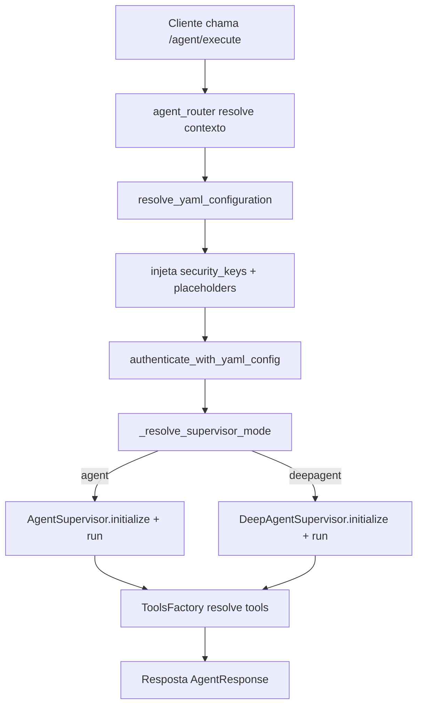
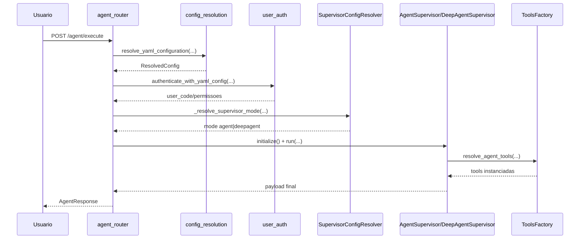
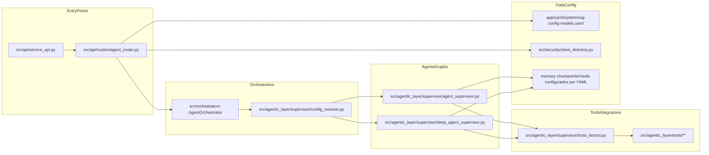
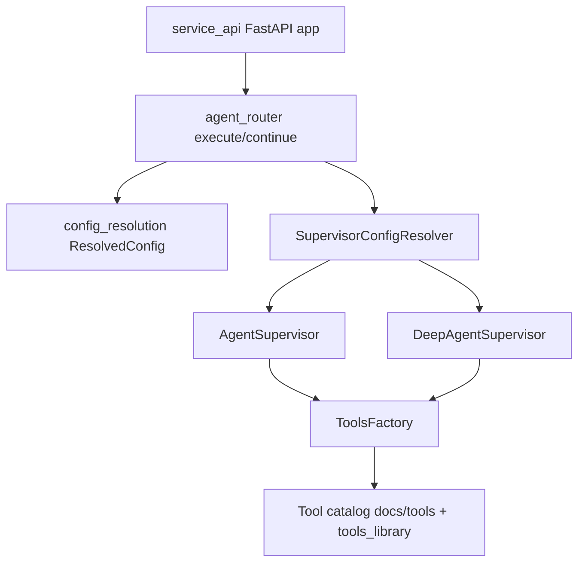

# Tutorial 101: Criação de Agentes via YAML

Bem-vindo. Este guia foi feito para quem acabou de entrar no projeto e precisa entender, de forma prática, como um YAML vira execução real de agente na plataforma.

## 1) Para quem é este tutorial

Público:
- Iniciante
- Desenvolvedor de negócio
- Desenvolvedor de plataforma

Ao final, você vai conseguir:
- Entender o caminho real `request -> YAML -> supervisor -> resposta`.
- Saber onde criar ou alterar um agente no YAML sem quebrar o runtime.
- Identificar como as tools são resolvidas e aplicadas por precedência.
- Distinguir modo `agent` e `deepagent` com base no código.
- Rodar o fluxo mínimo local e validar que está funcionando.

## 2) Dicionário rápido (glossário obrigatório)

- `YAML`: arquivo declarativo que diz para a plataforma quais agentes, tools e políticas usar.
- `multi_agents`: espinha dorsal de configuração do supervisor de agentes.
- `SupervisorConfigResolver`: classe que seleciona supervisor ativo e consolida contexto de execução.
- `AgentSupervisor`: runtime clássico de agente (`execution.type=agent`).
- `DeepAgentSupervisor`: runtime avançado (`execution.type=deepagent`).
- `ResolvedConfig`: objeto retornado pela resolução de YAML no router da API.
- `ToolsFactory`: fábrica que carrega/instancia tools e aplica overrides por escopo.
- `thread_id`: identificador da conversa/execução para continuidade e checkpoint.
- `interrupt`: pausa oficial do LangGraph para human-in-the-loop.
- `Command(resume=...)`: mecanismo oficial para retomar execução pausada.

## 3) Conceito em linguagem simples (regra da analogia)

Pense no YAML como uma ficha de montagem de uma máquina industrial.

- A API recebe a ficha (YAML).
- O resolvedor confere se a ficha está legível e completa para o cliente correto.
- O supervisor lê essa ficha e decide qual "linha de produção" usar.
- A ToolsFactory separa as ferramentas corretas para cada agente.
- O runtime executa e devolve o resultado.

Analogia do mundo real: você entra em uma oficina e entrega uma ordem de serviço. O atendente não sai consertando na hora. Primeiro ele valida seus dados, identifica o tipo de serviço, chama o especialista certo, separa ferramentas e só então executa. Aqui é igual: o YAML é a ordem de serviço da IA.

## 4) Mapa de navegação do repo

- `src/api/service_api.py` -> monta o app FastAPI e inclui routers; mexa aqui ao registrar novos endpoints.
- `src/api/routers/agent_router.py` -> entrada HTTP para `execute` e `continue` de agentes; mexa para contratos de requisição/resposta.
- `src/api/routers/config_resolution.py` -> resolve fonte de YAML (criptografado/inline/arquivo), injeta `security_keys`, expande placeholders.
- `src/agentic_layer/supervisor/config_resolver.py` -> seleciona supervisor ativo e consolida `multi_agents`.
- `src/agentic_layer/supervisor/agent_supervisor.py` -> runtime clássico de supervisor.
- `src/agentic_layer/supervisor/deep_agent_supervisor.py` -> runtime deepagent.
- `src/agentic_layer/supervisor/tools_factory.py` -> resolução e instanciamento de tools com precedência de override.
- `app/yaml/system/rag-config-modelo.yaml` -> exemplo canônico de YAML de produto (inclui `multi_agents`, `memory`, `security_keys`).
- `docs/README-AGENTE-SUPERVISOR.md` -> contrato funcional de supervisor clássico.
- `docs/README-DEEPAGENTS-SUPERVISOR.md` -> contrato funcional de deepagent.
- `docs/tools/alfabetica.md` -> catálogo por ordem alfabética de tools.
- `docs/tools/por_finalidade.md` -> catálogo de tools por objetivo de negócio.

Guarda-corpos:
- Não misture sintaxe de `workflow` com sintaxe de `multi_agents` no mesmo fluxo de agente.
- Não invente chaves YAML fora do contrato real já consumido no código.

## 5) Mapa visual 1: fluxo macro (Flowchart)

## 6) Mapa visual 2: quem chama quem (Sequence)

## 7) Mapa visual 3: camadas (Layer Diagram)

## 8) Mapa visual 4: componentes (Component Diagram)

## 9) Onde isso aparece neste projeto (visão rápida)

- API inclui router de agente em `src/api/service_api.py:1542`.
- Entrada principal de agente está em `src/api/routers/agent_router.py` (`@router.post("/execute")`).
- Continuação com feedback humano está em `src/api/routers/agent_router.py` (`@router.post("/continue")`).
- Resolução central de YAML está em `src/api/routers/config_resolution.py:656` (`resolve_yaml_configuration`).
- Seleção de modo do supervisor está em `src/api/routers/agent_router.py:427` (`_resolve_supervisor_mode`).
- Seleção/merge de supervisor ativo está em `src/agentic_layer/supervisor/config_resolver.py` (`SupervisorConfigResolver`).
- Runtime clássico de agente em `src/agentic_layer/supervisor/agent_supervisor.py:1010` (`run`).
- Runtime deepagent em `src/agentic_layer/supervisor/deep_agent_supervisor.py:269` (`run`).
- Resolução de tools por agente em `src/agentic_layer/supervisor/tools_factory.py` (`resolve_agent_tools`).
- YAML de referência do produto em `app/yaml/system/rag-config-modelo.yaml`.

## 10) Caminho real no código (onde olhar)

- `src/api/service_api.py`: registra routers e define ponto de entrada HTTP.
- `src/api/routers/agent_router.py`: modelos `AgentRequest`, `AgentResponse`, contexto de execução, endpoints `execute` e `continue`.
- `src/api/routers/config_resolution.py`: decide se o YAML vem criptografado, inline ou por path e devolve `ResolvedConfig`.
- `src/agentic_layer/supervisor/config_resolver.py`: normaliza `multi_agents`, seleciona supervisor ativo e consolida contexto.
- `src/agentic_layer/supervisor/agent_supervisor.py`: inicializa factories, cria supervisor, executa `run`.
- `src/agentic_layer/supervisor/deep_agent_supervisor.py`: inicializa cadeia deepagent, executa `run`.
- `src/agentic_layer/supervisor/tools_factory.py`: instancia tools e aplica precedência global->supervisor->agente.
- `docs/README-AGENTE-SUPERVISOR.md`: contrato funcional canônico do modo `agent`.
- `docs/README-DEEPAGENTS-SUPERVISOR.md`: contrato funcional canônico do modo `deepagent`.

## 11) Fluxo passo a passo (o que acontece de verdade)

1. Cliente chama `POST /agent/execute`.
2. O dependency `resolve_agent_execution_context` resolve `correlation_id`, chama `resolve_yaml_configuration` e autentica permissão (`agent.execute`) em `src/api/routers/agent_router.py:625`.
3. `resolve_yaml_configuration` em `src/api/routers/config_resolution.py:656` carrega YAML por prioridade:
   1. `encrypted_data`.
   2. `yaml_inline_content`.
   3. `yaml_config_path`.
4. O mesmo módulo injeta `security_keys` via diretório multi-tenant e expande placeholders.
5. `invoke_agent` escolhe supervisor em `src/api/routers/agent_router.py:427`.
6. Se modo resolver para `deepagent`, chama `_execute_agent_deepagent`.
7. Se modo resolver para `agent`, segue com `AgentOrchestrator` e `AgentSupervisor`.
8. O supervisor inicializa config/factories/tools e executa `run`.
9. `ToolsFactory` resolve ferramentas por agente com merge de configurações.
10. A API normaliza saída e retorna `AgentResponse`.

Com config ativa:
- `execution.type: deepagent` no supervisor ativo direciona para `DeepAgentSupervisor`.
- `local_tools_configuration` e `global_tools_configuration` alteram configuração efetiva das tools.

No estado atual:
- `subprocess` está degradado para `direct_async` em `src/api/routers/agent_router.py` (bloco de fallback explícito).

## 12) Status: está pronto? quanto está pronto?

| Área | Evidência | Status | Impacto prático | Próximo passo mínimo |
|---|---|---|---|---|
| Entrada API de agente | `src/api/service_api.py:1542`, `src/api/routers/agent_router.py` | pronto | Fluxo HTTP operacional para executar/continuar agentes | manter contratos sincronizados com Swagger |
| Resolução YAML | `src/api/routers/config_resolution.py:656` | pronto | Fonte única de carregamento (criptografado/inline/arquivo) | ampliar testes de erro por tipo de payload |
| Seleção de supervisor ativo | `src/agentic_layer/supervisor/config_resolver.py` | pronto | Evita ambiguidade de supervisor no `multi_agents` | reforçar cenários de validação semântica |
| Runtime `agent` | `src/agentic_layer/supervisor/agent_supervisor.py:1010` | pronto | Execução clássica estável | ampliar testes de timeout/checkpointer |
| Runtime `deepagent` | `src/agentic_layer/supervisor/deep_agent_supervisor.py:269` | pronto | Execução avançada disponível por YAML | ampliar cenários de stress de middleware |
| Registry/resolução de tools | `src/agentic_layer/supervisor/tools_factory.py` | pronto | Permite composição de tools por agente/supervisor | revisar periodicidade de catálogo/documentação |
| Contrato YAML didático | `app/yaml/system/rag-config-modelo.yaml` | parcial | Modelo existe, mas é amplo para iniciantes absolutos | criar template reduzido focado só em agente |
| Observabilidade de fluxo | logs e marcadores nos módulos citados | parcial | Boa rastreabilidade, mas depende de disciplina de uso | padronizar dashboard de métricas por modo |
| Testes de regressão do fluxo agente | `tests/unit/test_workflow_runtime_agent.py`, `tests/unit/test_workflow_runtime_executor.py` | parcial | Cobre partes críticas, não cobre todo onboarding YAML | adicionar suíte dedicada YAML->agent end-to-end |

## 13) Como colocar para funcionar (hands-on end-to-end)

Passo 0: pré-requisitos
- Python 3.11 confirmado em `pyproject.toml` (`requires-python = ">=3.11,<3.12"`).
- Dependências de runtime listadas em `requirements.txt` (inclui FastAPI/LangChain/LangGraph).

Passo 1: preparar ambiente
- Comando: `source .venv/bin/activate`.
- Evidência: política de testes e execução em `.venv` no repositório e em `scripts/suite_de_testes_padrao.sh`.

Passo 2: instalar dependências
- Comando: `pip install -r requirements.txt`.
- Observação: arquivo contém versões de `langchain` e `langgraph`.

Passo 3: escolher ponto de entrada
- Comando: `python main.py`.
- Evidência: `main.py` encaminha para `app/main.py`.

Passo 4: subir API
- Em `app/main.py`, app roda em `src.api.service_api:app` com host/porta vindos de configuração.

Passo 5: chamar endpoint de agente
- Endpoint: `POST /agent/execute` em `src/api/routers/agent_router.py`.
- Entrada mínima no contrato atual: `task`, `user_email`, `encrypted_data`.

Passo 6: validar que funcionou
- Esperado prático:
  - API responde `200` (sync) ou `202` (async) no fluxo de execução.
  - resposta possui `correlation_id` e campos de sucesso/erro.
  - logs mostram marcadores de início/fim de orquestração.

Passo 7: validar continuação
- Endpoint: `POST /agent/continue`.
- Requisito essencial: manter `correlation_id` e preferencialmente `thread_id` para retomar execução.

Variáveis de ambiente/configs
- `FASTAPI_HOST`, `FASTAPI_PORT`, `FASTAPI_WORKERS`, `FASTAPI_DEBUG` consumidas em `app/main.py`.
- Chaves de integração são resolvidas por `security_keys` no YAML e diretório multi-tenant em `src/api/routers/config_resolution.py`.

Se faltar automação
- Não encontrado no código: comando único "one-click" para boot completo de dependências externas do agente.
- Trabalho mínimo a criar: script de bootstrap de serviços externos + validação de health antes do primeiro `/agent/execute`.

## 14) ELI5: onde coloco cada parte da feature neste projeto?

- Entrada HTTP nova: em `src/api/routers/agent_router.py`.
- Regra de seleção de modo: em `_resolve_supervisor_mode` no mesmo router.
- Transformação/segurança de YAML: em `src/api/routers/config_resolution.py`.
- Regra de supervisor ativo e merge de contexto: em `src/agentic_layer/supervisor/config_resolver.py`.
- Comportamento de execução de agente: em `src/agentic_layer/supervisor/agent_supervisor.py` ou `deep_agent_supervisor.py`.
- Integração de tools e overrides: em `src/agentic_layer/supervisor/tools_factory.py`.

| Pergunta | Resposta | Camada | Onde no repo |
|---|---|---|---|
| Onde adiciono um novo agente especialista? | Na seção `multi_agents[].agents[]` do YAML | Configuração | `app/yaml/system/rag-config-modelo.yaml` |
| Onde escolho `agent` ou `deepagent`? | Em `multi_agents[].execution.type` | Configuração/Orquestração | `src/agentic_layer/supervisor/config_resolver.py` |
| Onde valido entrada da API? | Modelos Pydantic e dependencies do router | Entry point | `src/api/routers/agent_router.py` |
| Onde as tools são realmente instanciadas? | Na fábrica de tools | Integração | `src/agentic_layer/supervisor/tools_factory.py` |
| Onde o YAML é enriquecido com chaves? | No resolvedor de configuração | Configuração/Segurança | `src/api/routers/config_resolution.py` |
| Onde a execução final acontece? | No supervisor selecionado | Runtime | `src/agentic_layer/supervisor/agent_supervisor.py` e `src/agentic_layer/supervisor/deep_agent_supervisor.py` |

## 15) Template de mudança (preenchido com padrões do repo)

1) Entrada: qual endpoint/job dispara?
- paths: `src/api/routers/agent_router.py`.
- contrato de entrada: `AgentRequest` e `AgentContinueRequest`.

2) Config: qual YAML/env controla?
- keys: `multi_agents`, `execution.type`, `tools_library`, `global_tools_configuration`, `local_tools_configuration`, `memory`.
- onde é lido: `src/api/routers/config_resolution.py`, `src/agentic_layer/supervisor/config_resolver.py`.

3) Execução: qual grafo ou nó entra?
- builder/factory: inicialização dos supervisores em `agent_supervisor.py` e `deep_agent_supervisor.py`.
- state: continuidade por `thread_id` e mecanismos de checkpoint configurados.

4) Ferramentas: quais tools são usadas?
- registro: catálogo + definição no YAML.
- chamadas: resolução por `ToolsFactory.resolve_agent_tools(...)`.

5) Dados: onde persiste/cache/indexa?
- MySQL: Não encontrado no código deste fluxo específico de criação de agente via YAML.
- Redis: configurável no bloco `memory` do YAML (histórico/checkpoints, conforme backend).
- Qdrant/outros: fora do núcleo de criação de agente; usado em camadas de RAG.

6) Observabilidade: onde loga/traça?
- logs: `create_logger_with_correlation(...)` em routers e supervisores.
- correlation/trace: `correlation_id` propagado no fluxo API -> supervisor.

7) Testes: onde validar?
- unit: testes de runtime agent/workflow na suíte unitária.
- integration: Não foi encontrado no escopo analisado um teste único e dedicado ao onboarding YAML->agent completo.

## 16) CUIDADO: o que NÃO fazer (guarda-corpos)

- Não parsear YAML direto dentro do endpoint sem passar por `resolve_yaml_configuration`.
- Não criar chave YAML nova sem uso real em código.
- Não bypassar `authenticate_with_yaml_config` para acelerar desenvolvimento local.
- Não instanciar tools manualmente dentro do supervisor ignorando `ToolsFactory`.
- Não misturar configuração de `workflow` quando o fluxo é supervisor `multi_agents`.

## 17) Anti-exemplos (obrigatório)

Erro comum: parse de YAML no endpoint.
- Por que é ruim: quebra padronização de segurança, placeholders e injeção de `security_keys`.
- Correção: usar sempre `resolve_yaml_configuration`.

Erro comum: decidir modo de supervisor com `if` hardcoded.
- Por que é ruim: ignora regra central de `SupervisorConfigResolver`.
- Correção: usar `_resolve_supervisor_mode` + contexto ativo.

Erro comum: tool acessando configuração sem precedência.
- Por que é ruim: perde override por escopo e cria comportamento divergente.
- Correção: resolver via `ToolsFactory.resolve_agent_tools`.

Erro comum: continuar execução sem `thread_id` consistente.
- Por que é ruim: continuidade pode cair em nova thread e perder contexto.
- Correção: reaproveitar `thread_id` e `correlation_id` no `/agent/continue`.

## 18) Exemplos guiados (2 a 4)

Exemplo 1: descobrir por que caiu em `deepagent`
- Siga o fio em `src/api/routers/agent_router.py:427` e `src/agentic_layer/supervisor/config_resolver.py`.
- Veja `execution.type` no YAML ativo para confirmar o modo.

Exemplo 2: ajustar tool só para um agente específico
- Defina override em `multi_agents[].agents[].local_tools_configuration` no YAML.
- Verifique merge em `src/agentic_layer/supervisor/tools_factory.py`.

Exemplo 3: investigar falha de segredo não encontrado
- Validação ocorre em `src/api/routers/config_resolution.py` durante injeção de `security_keys`.
- Procure exceções relacionadas a `TenantSecretNotFoundError` e mensagens de detalhe HTTP.

Exemplo 4: continuar execução humana
- Entrada em `/agent/continue` em `src/api/routers/agent_router.py`.
- Retomada usa `Command(resume=...)` no mesmo fluxo de supervisor.

## 19) Erros comuns e como reconhecer (debugging)

Sintoma observável: `400` com erro de descriptografia.
- hipótese: `encrypted_data` inválido.
- como confirmar: logs e trecho de erro em `resolve_yaml_configuration`.
- correção segura: regenerar payload criptografado no formato esperado.

Sintoma observável: `404` para YAML por caminho.
- hipótese: `yaml_config_path` inválido sem fallback físico.
- como confirmar: ramificação de path em `config_resolution.py`.
- correção segura: usar path existente ou payload criptografado.

Sintoma observável: modo inesperado (`agent` em vez de `deepagent`).
- hipótese: `execution.type` ausente/invalidado no supervisor ativo.
- como confirmar: `SupervisorConfigResolver` e `_resolve_supervisor_mode`.
- correção segura: corrigir `multi_agents[].execution.type` no YAML ativo.

Sintoma observável: ferramenta não encontrada.
- hipótese: `tool_id` fora do catálogo efetivo.
- como confirmar: validação/resolução em `ToolsFactory`.
- correção segura: incluir tool no catálogo e referenciar o `id` correto no agente.

Sintoma observável: continuação não retoma contexto esperado.
- hipótese: `thread_id` não reaproveitado.
- como confirmar: request de `/agent/continue` e logs do supervisor.
- correção segura: usar mesmo `thread_id` e `correlation_id` da execução pausada.

Sintoma observável: erro de permissão no endpoint.
- hipótese: `X-API-Key` sem permissão para `agent.execute` ou `agent.continue`.
- como confirmar: autenticação em `authenticate_with_yaml_config` no router.
- correção segura: ajustar permissão da chave e reenviar requisição.

## 20) Exercícios guiados (obrigatório)

Exercício 1
- objetivo: identificar de onde sai o modo `agent`/`deepagent`.
- passos: localizar `_resolve_supervisor_mode`; seguir chamada de `SupervisorConfigResolver`.
- como verificar no código: `src/api/routers/agent_router.py:427` e `src/agentic_layer/supervisor/config_resolver.py`.
- gabarito: o modo final vem do request quando válido, senão do supervisor ativo no YAML.

Exercício 2
- objetivo: mapear precedência de configuração de tool.
- passos: ler `resolve_agent_tools` e `build_agent_tools_overrides`.
- como verificar no código: `src/agentic_layer/supervisor/tools_factory.py` e `src/agentic_layer/supervisor/config_resolver.py`.
- gabarito: precedência é global -> supervisor -> agente.

Exercício 3
- objetivo: entender ciclo de vida do YAML criptografado.
- passos: seguir `resolve_yaml_configuration` desde decrypt até retorno `ResolvedConfig`.
- como verificar no código: `src/api/routers/config_resolution.py:656`.
- gabarito: decrypt -> parse -> inject security_keys -> expand placeholders -> retorna config resolvida.

## 21) Checklist final

- Entendi qual arquivo registra o router de agente.
- Sei onde o request de agente é validado.
- Sei onde o YAML é resolvido por fonte.
- Sei onde `security_keys` é injetado.
- Sei onde placeholders são expandidos.
- Sei onde o modo de supervisor é escolhido.
- Sei a diferença prática entre `agent` e `deepagent`.
- Sei onde as tools são resolvidas e instanciadas.
- Sei como funciona a continuação com `thread_id`.
- Sei quais erros HTTP apontam falha de payload YAML.
- Sei o caminho mínimo para rodar local.
- Sei quais arquivos consultar para evoluir o contrato YAML.

## 22) Checklist de PR quando mexer nisso (obrigatório)

- Confirmou que não criou chave YAML órfã.
- Confirmou que não bypassou `resolve_yaml_configuration`.
- Confirmou que manteve autenticação por `authenticate_with_yaml_config`.
- Validou impacto em `AgentRequest` e `AgentResponse`.
- Validou impacto em `AgentContinueRequest` e `AgentContinueResponse`.
- Revisou precedência de config de tools.
- Revisou modo de supervisor para evitar regressão de `deepagent`.
- Garantiu logs com `correlation_id` no fluxo alterado.
- Atualizou documentação de supervisor/deepagent quando necessário.
- Executou testes focados do runtime alterado.

## 23) Referências

Referências internas (código e docs do repo):
- `src/api/service_api.py`
- `src/api/routers/agent_router.py`
- `src/api/routers/config_resolution.py`
- `src/agentic_layer/supervisor/config_resolver.py`
- `src/agentic_layer/supervisor/agent_supervisor.py`
- `src/agentic_layer/supervisor/deep_agent_supervisor.py`
- `src/agentic_layer/supervisor/tools_factory.py`
- `app/yaml/system/rag-config-modelo.yaml`
- `docs/README-AGENTE-SUPERVISOR.md`
- `docs/README-DEEPAGENTS-SUPERVISOR.md`
- `docs/README-ARQUITETURA.md`
- `docs/tools/alfabetica.md`
- `docs/tools/por_finalidade.md`

Referências externas consultadas (normativas):
- Documentação oficial LangGraph, seção Interrupts (pause/resume, regras de thread_id, payload serializável).
- Documentação oficial FastAPI, Tutorial/User Guide (execução e estrutura básica de app).

## 24) Avaliação objetiva: pronto ou não pronto para iniciantes?

Status funcional:
- Está pronto para criar e executar agentes via YAML com caminho real de produção.

Status de qualidade:
- Está parcialmente pronto para onboarding de iniciante porque o contrato é poderoso, mas amplo; falta trilha mínima simplificada dedicada ao primeiro agente.

Status de produção:
- A base de runtime é madura, com segurança e resolução de configuração centralizadas.

O que falta para facilitar muito o primeiro uso:
- Um template YAML mínimo oficial, focado apenas em `multi_agents` + 1 agente + 2 tools.
- Um teste end-to-end dedicado ao onboarding `YAML mínimo -> /agent/execute -> resposta`.

Primeiro passo recomendado:
- Criar esse template mínimo e validar no endpoint `/agent/execute` antes de expandir para deepagent ou catálogo completo.
