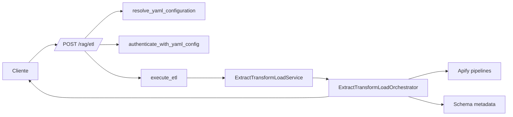
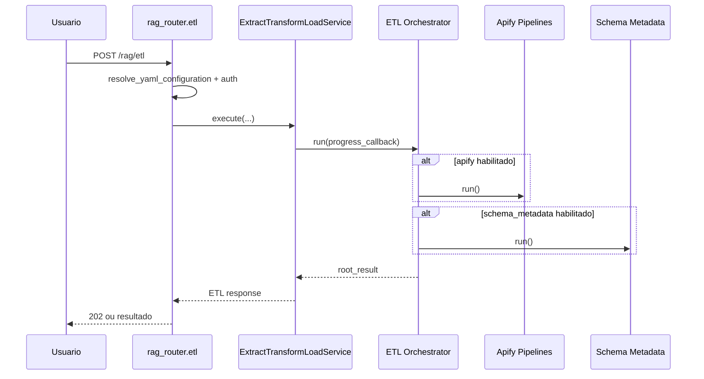
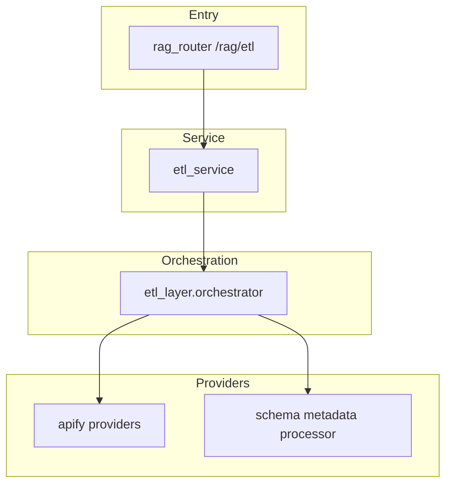
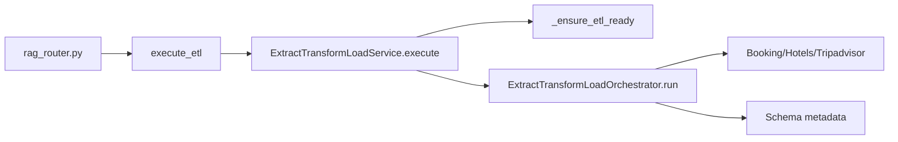

# Tutorial 101: Criação e Configuração de ETL

Este tutorial mostra como o ETL dedicado (`extract_transform_load`) funciona no projeto.

## 1) Para quem é este tutorial

- Consultor júnior que opera pipelines ETL.
- Dev iniciante que vai ajustar providers ETL.
- Time de operação que monitora execução/cancelamento.

Você vai conseguir:

- Entender endpoint `/rag/etl`.
- Entender `ExtractTransformLoadService` e `ExtractTransformLoadOrchestrator`.
- Saber quais subsistemas ETL são obrigatórios.
- Validar execução ponta a ponta.

## Leitura relacionada

- Aprofundamento técnico completo: [README-ETL.md](./README-ETL.md)
- Visão macro da plataforma: [README-ARQUITETURA.md](./README-ARQUITETURA.md)

## 2) Dicionário rápido

- `ETL`: extrair, transformar e carregar dados.
- `ExtractTransformLoadService`: serviço de entrada do ETL.
- `ExtractTransformLoadOrchestrator`: coordenador dos pipelines ETL.
- `extract_transform_load.enabled`: chave que liga ETL no YAML.
- `schema_metadata`: pipeline de metadados de banco.
- `apify`: pipelines de coleta web configuráveis.

## 3) Conceito em linguagem simples

Pense no ETL como uma esteira de fábrica de dados. A matéria-prima entra (extração), passa por tratamento (transformação) e sai pronta para uso (carga). No código, o serviço prepara e valida; o orquestrador executa os pipelines ligados no YAML.

## 4) Mapa de navegação do repo

- `src/api/routers/rag_router.py`: endpoint `/rag/etl`.
- `src/services/etl_service.py`: serviço ETL dedicado.
- `src/etl_layer/orchestrator.py`: orquestrador ETL.
- `src/etl_layer/providers/apify/*`: pipelines Apify.
- `src/etl_layer/providers/data/table_schema_metadata_processor.py`: schema metadata.
- Guarda-corpo: não executar ETL com `extract_transform_load.enabled=false`.

## 5) Mapa visual 1: fluxo macro

## 6) Mapa visual 2: sequência

## 7) Mapa visual 3: camadas

## 8) Mapa visual 4: componentes

## 9) Onde isso aparece no projeto

- Endpoint ETL: `rag_router.extract_transform_load_endpoint`.
- Async ETL helper: `_execute_etl_async` no `rag_router.py`.
- Serviço ETL: `ExtractTransformLoadService.execute`.
- Orquestrador ETL: `ExtractTransformLoadOrchestrator.run`.

## 10) Caminho real no código

- `src/api/routers/rag_router.py`
- `src/services/etl_service.py`
- `src/etl_layer/orchestrator.py`

## 11) Fluxo passo a passo

1. `/rag/etl` recebe payload e correlation_id.
2. Router resolve YAML e autentica permissão ETL.
3. Router chama `execute_etl`.
4. Serviço ETL valida seção `extract_transform_load`.
5. Serviço cria orquestrador e executa.
6. Orquestrador roda pipelines habilitados.
7. Consolida resultados e retorna status.

Com config ativa:

- Requer `extract_transform_load.enabled=true` e ao menos um subsistema habilitado.

No estado atual:

- Se nada estiver habilitado, retorna erro de validação no serviço.

## 12) Status: está pronto? quanto está pronto?

| Área | Evidência | Status | Impacto prático | Próximo passo mínimo |
|---|---|---|---|---|
| Endpoint ETL | `rag_router.py` | pronto | entrada HTTP disponível | manter contrato |
| Serviço ETL | `etl_service.py` | pronto | validação e resposta padronizada | ampliar cobertura de erro |
| Orquestrador ETL | `etl_layer/orchestrator.py` | pronto | pipelines executáveis | revisão de retries por provider |
| Cancelamento cooperativo | `TaskCancelledError` no orquestrador | parcial | evita travamento | ampliar métricas de cancelamento |

## 13) Como colocar para funcionar

Passo 0:

- `python -m venv .venv && source .venv/bin/activate`

Passo 1:

- `pip install -r requirements.txt`

Passo 2:

- `source .venv/bin/activate && python app/main.py`

Passo 3:

- Chamar `POST /rag/etl` com `encrypted_data` e `user_email`.

Passo 4:

- Validar `status`, `session_id`, `analysis` e `correlation_id`.

## 14) ELI5: onde colocar cada parte da feature

| Pergunta | Resposta | Camada | Onde |
|---|---|---|---|
| Quero novo provider ETL | Implementar no etl_layer/providers | Provider | `src/etl_layer/providers` |
| Quero regra de readiness ETL | Ajustar validação do serviço | Service | `src/services/etl_service.py` |
| Quero mudar endpoint ETL | Ajustar router | Entry | `src/api/routers/rag_router.py` |
| Quero métricas ETL | Orquestrador | Orchestration | `src/etl_layer/orchestrator.py` |

## 15) Template de mudança

1) entrada

- path: `rag_router.py`
- contrato: `ExtractTransformLoadRequest`

1) config

- keys: `extract_transform_load.enabled`, `apify.*`, `schema_metadata.*`
- leitura: `etl_service` e `etl_orchestrator`

1) execução

- `ExtractTransformLoadService.execute`
- `ExtractTransformLoadOrchestrator.run`

1) ferramentas

- Não encontrado no escopo analisado para tool-calling direto.

1) dados

- depende dos providers habilitados.

1) observabilidade

- logs no serviço e no orquestrador com `correlation_id`.

1) testes

- `tests/` (mapear arquivos específicos por provider)

## 16) CUIDADO: o que NÃO fazer

- Não ligar ETL sem seção `extract_transform_load` válida.
- Não acoplar provider novo direto no router.
- Não remover validação de subsistemas habilitados.
- Não suprimir erros de pipeline sem registrar no root_result.

## 17) Anti-exemplos

- Erro: executar ETL sem `enabled=true`.
- Ruim: comportamento inconsistente.
- Correção: falhar cedo com mensagem clara.

- Erro: provider sem tratamento de exceção.
- Ruim: aborta todo lote.
- Correção: registrar erro por pipeline e seguir.

- Erro: sem progress callback em pipeline longo.
- Ruim: cliente sem visibilidade.
- Correção: manter updates de progresso.

- Erro: mudança de contrato sem atualizar endpoint.
- Ruim: quebra cliente.
- Correção: alinhar schema do request/response.

## 18) Exemplos guiados

- Exemplo 1: ETL somente schema_metadata.
- Exemplo 2: ETL somente Apify.
- Exemplo 3: ETL com múltiplos pipelines habilitados.

## 19) Erros comuns e como reconhecer

- Sintoma: "Seção 'extract_transform_load' não encontrada".
- Hipótese: YAML sem bloco ETL.
- Confirmar: `_ensure_etl_ready`.
- Correção: adicionar bloco ETL.

- Sintoma: "Nenhum subsistema habilitado".
- Hipótese: todos providers desativados.
- Confirmar: `_has_enabled_subsystems`.
- Correção: ativar `apify` ou `schema_metadata`.

- Sintoma: task cancelada.
- Hipótese: cancelamento cooperativo acionado.
- Confirmar: tratamento `TaskCancelledError`.
- Correção: reexecutar com contexto válido.

## 20) Exercícios guiados

Exercício 1: seguir endpoint ETL até o serviço.
Exercício 2: identificar validações de readiness.
Exercício 3: mapear quais pipelines são chamados no orquestrador.

## 21) Checklist final

- Endpoint ETL mapeado.
- Serviço ETL entendido.
- Orquestrador ETL entendido.
- Regras de habilitação claras.
- Comando de execução local definido.

## 22) Checklist de PR

- Preserva contrato do endpoint.
- Não remove validações de readiness.
- Mantém logs e `correlation_id`.
- Mantém tratamento de cancelamento.
- Inclui teste de regressão do provider alterado.

## 23) Referências

Internas:

- `src/api/routers/rag_router.py`
- `src/services/etl_service.py`
- `src/etl_layer/orchestrator.py`

Externas:

- FastAPI docs (Background Tasks).
- LangGraph docs (quando provider usa fluxo stateful).
