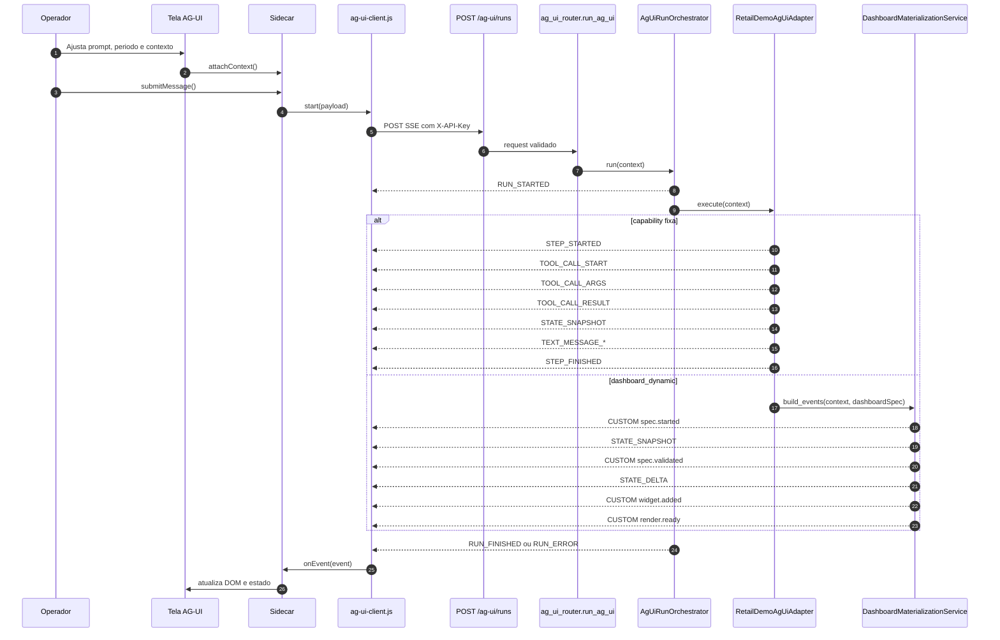
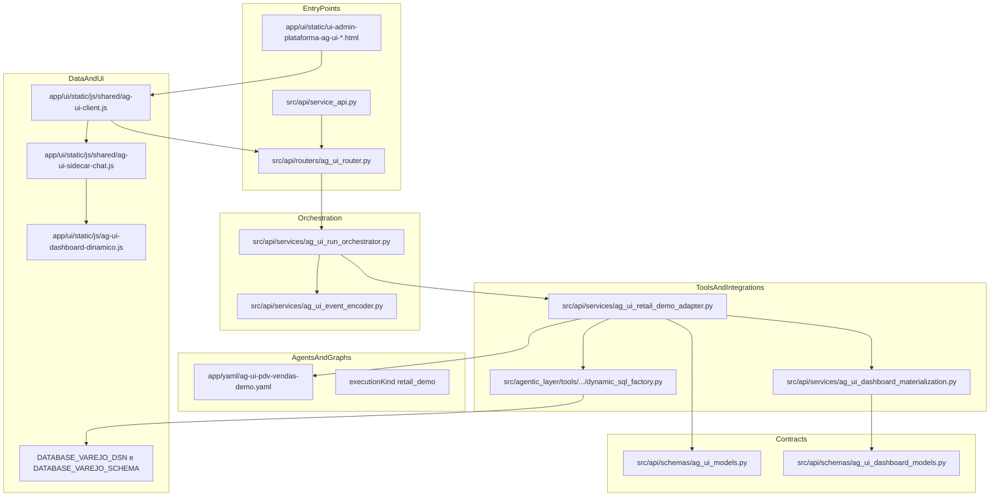
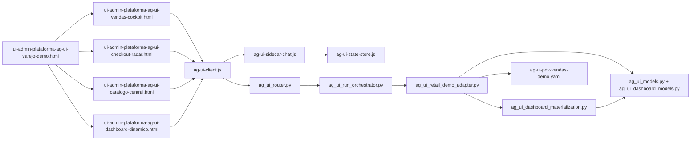
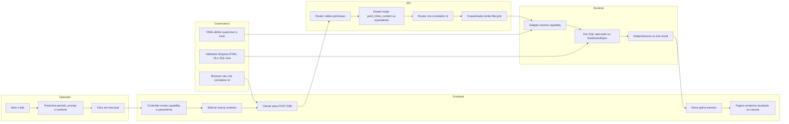

<!-- markdownlint-disable MD013 -->

# Tutorial 101: AG-UI

Se voce entrou agora no projeto e ouviu alguem falar em AG-UI ou em Generative UI, a primeira coisa importante e esta: neste repositorio, a implementacao concreta e o slice AG-UI. Em vez de uma pagina inventar interface livremente a partir de HTML vindo do modelo, o produto usa um contrato orientado a eventos, com backend mandando snapshots, deltas, mensagens, tools e interrupcoes de forma governada. O centro dessa implementacao esta em [docs/README-AG-UI.md](./README-AG-UI.md), [src/api/routers/ag_ui_router.py](../src/api/routers/ag_ui_router.py), [src/api/services/ag_ui_run_orchestrator.py](../src/api/services/ag_ui_run_orchestrator.py) e nas telas de varejo em [app/ui/static/ui-admin-plataforma-ag-ui-varejo-demo.html](../app/ui/static/ui-admin-plataforma-ag-ui-varejo-demo.html).

## 2) Para quem e este tutorial

Este tutorial serve para desenvolvedor junior e consultor tecnico junior que precisam entender como a UI generativa do produto funciona de verdade hoje.

- Entender por que AG-UI e a implementacao real desta superficie agentica, e nao WebChat.
- Seguir o fluxo real do clique na tela ate o stream SSE vindo do backend.
- Descobrir onde ficam contrato, orquestracao, adapter PDV, paginas, renderer e testes.
- Saber o que ja esta pronto, o que esta parcial e o que ainda nao existe no slice atual.
- Colocar a demo local para abrir e saber como validar se ela respondeu.

## 3) Dicionario rapido

- AG-UI: protocolo interno desta plataforma para interfaces agentic orientadas a eventos; o contrato esta em [src/api/schemas/ag_ui_models.py](../src/api/schemas/ag_ui_models.py).
- SSE: resposta HTTP longa em que o servidor vai enviando eventos em sequencia; a rota AG-UI devolve `text/event-stream` em [src/api/routers/ag_ui_router.py](../src/api/routers/ag_ui_router.py).
- Sidecar: painel lateral reutilizavel onde aparecem mensagens, tools, correlation id e aprovacoes; fica em [app/ui/static/js/shared/ag-ui-sidecar-chat.js](../app/ui/static/js/shared/ag-ui-sidecar-chat.js).
- Snapshot: fotografia completa de estado em um momento; aparece como `STATE_SNAPSHOT` em [src/api/schemas/ag_ui_models.py](../src/api/schemas/ag_ui_models.py).
- Delta: mudanca incremental sobre um estado que ja existe; aparece como `STATE_DELTA` com JSON Patch em [src/api/schemas/ag_ui_models.py](../src/api/schemas/ag_ui_models.py).
- DashboardSpec: contrato seguro do canvas dinamico; fica em [src/api/schemas/ag_ui_dashboard_models.py](../src/api/schemas/ag_ui_dashboard_models.py).
- DeepAgent: modo agentic usado na demo PDV; a configuracao fica em [app/yaml/ag-ui-pdv-vendas-demo.yaml](../app/yaml/ag-ui-pdv-vendas-demo.yaml).
- dyn_sql<query_id>: forma governada de chamar SQL dinamico aprovado; aparece no YAML demo e no adapter em [app/yaml/ag-ui-pdv-vendas-demo.yaml](../app/yaml/ag-ui-pdv-vendas-demo.yaml) e [src/api/services/ag_ui_retail_demo_adapter.py](../src/api/services/ag_ui_retail_demo_adapter.py).
- HIL: Human in the Loop; no AG-UI atual ele aparece como interrupcao no `RUN_FINISHED` e renderer compartilhado no sidecar, conforme [tests/unit/test_ag_ui_protocol_contract.py](../tests/unit/test_ag_ui_protocol_contract.py) e [tests/js/ag_ui_sidecar_chat.test.js](../tests/js/ag_ui_sidecar_chat.test.js).
- Correlation ID: identificador unico gerado no backend para rastrear a execucao ponta a ponta; a geracao acontece no router em [src/api/routers/ag_ui_router.py](../src/api/routers/ag_ui_router.py) e o cliente so consome o valor em [app/ui/static/js/shared/ag-ui-client.js](../app/ui/static/js/shared/ag-ui-client.js).

## 4) Conceito em linguagem simples

Imagine que a interface nao e uma folha em branco onde o modelo pode desenhar qualquer coisa. Aqui ela funciona mais como um painel de torre de controle. A torre decide o que pode ser exibido, em qual ordem e com quais dados. A tela so reflete o que foi autorizado.

No projeto, essa torre de controle e o backend AG-UI. A pagina pede uma execucao com contexto, a API valida a chamada, escolhe o adapter certo e vai soltando eventos. A tela recebe esses eventos e vai atualizando status, mensagens, ferramentas acionadas, painel principal e, quando necessario, aprovacoes humanas.

A analogia do mundo real e um painel de aeroporto. O passageiro nao recebe apenas a frase final dizendo que o voo pousou. Ele ve check-in, embarque, atraso, mudanca de portao e pouso. AG-UI faz a mesma coisa para a experiencia agentic: transforma o processo em algo visivel e governado.

O detalhe mais importante para nao se confundir: isso nao e o WebChat. O WebChat continua existindo em outra superficie. AG-UI foi montado em rota, cliente, sidecar e paginas proprias, com fluxo dedicado em [src/api/routers/ag_ui_router.py](../src/api/routers/ag_ui_router.py), [src/api/service_api.py](../src/api/service_api.py) e [app/ui/static/ui-admin-plataforma-ag-ui-varejo-demo.html](../app/ui/static/ui-admin-plataforma-ag-ui-varejo-demo.html).

## 5) Mapa de navegacao do repo

- [docs/README-AG-UI.md](./README-AG-UI.md) -> manual tecnico base do assunto -> leia antes de mexer no runtime ou na demo.
- [docs/tutorial-101-generative-ui.md](./tutorial-101-generative-ui.md) -> este onboarding pratico -> use quando precisar se localizar rapido.
- [src/api/routers](../src/api/routers) -> boundaries HTTP -> mexa aqui quando o contrato externo mudar.
- [src/api/schemas](../src/api/schemas) -> contratos Pydantic de request, evento e dashboard -> mexa aqui quando a fronteira tipada mudar.
- [src/api/services](../src/api/services) -> orquestrador, adapter PDV, encoder SSE e materializacao -> mexa aqui quando a regra de execucao mudar.
- [app/ui/static](../app/ui/static) -> paginas HTML servidas pela propria API -> mexa aqui quando a experiencia visual mudar.
- [app/ui/static/js/shared](../app/ui/static/js/shared) -> runtime compartilhado da UI AG-UI -> prefira reutilizar em vez de criar outra implementacao paralela.
- [app/yaml](../app/yaml) -> YAMLs da plataforma -> mexa no demo PDV quando precisar alterar supervisor, subagentes ou tools governadas.
- [tests/unit](../tests/unit) -> contrato e comportamento do backend -> mexa aqui sempre que alterar router, adapter, schemas ou materializacao.
- [tests/js](../tests/js) e [tests/frontend](../tests/frontend) -> runtime e contrato das paginas -> mexa aqui quando alterar cliente SSE, renderer, sidecar ou HTML.
- [tests/playwright](../tests/playwright) -> prova de comportamento visual de ponta a ponta em browser -> use para validar layout e fluxo basico.
- [src/api/service_api.py](../src/api/service_api.py) -> wiring principal da API -> nao duplique roteamento fora daqui.

## 5.1) Stack real usada hoje

- Backend HTTP: FastAPI com router dedicado AG-UI e `StreamingResponse` em [src/api/routers/ag_ui_router.py](../src/api/routers/ag_ui_router.py).
- Publicacao das paginas: `StaticFiles` montado em `/ui/static` em [src/api/service_api.py](../src/api/service_api.py).
- Frontend do slice: HTML estatico, JavaScript modular, SSE por `fetch` POST e componentes compartilhados em [app/ui/static/js/shared](../app/ui/static/js/shared).
- Shell visual: paginas HTML do admin usam Alpine no layout, mas o runtime AG-UI em si nao usa React nem CopilotKit, conforme [package.json](../package.json), [app/ui/static/js/shared/ag-ui-client.js](../app/ui/static/js/shared/ag-ui-client.js) e [tests/js/ag_ui_runtime.test.js](../tests/js/ag_ui_runtime.test.js).

## 6) Mapa visual 1: fluxo macro

```mermaid
flowchart LR
    A[Operador abre tela AG-UI] --> B[Pagina monta contexto visual e operacional]
    B --> C[Sidecar ou botao rapido monta payload]
    C --> D[POST /ag-ui/runs]
    D --> E[Router valida permissao e fonte de configuracao]
    E --> F[AgUiRunOrchestrator emite RUN_STARTED]
    F --> G[RetailDemoAgUiAdapter decide o caminho]
    G --> H1[Capability fixa com dyn_sql aprovado]
    G --> H2[dashboard_dynamic com DashboardSpec]
    H1 --> I1[Eventos de tool, snapshot e mensagem]
    H2 --> I2[Eventos de materializacao, deltas e render ready]
    I1 --> J[Cliente SSE aplica eventos no store]
    I2 --> J
    J --> K[Sidecar atualiza timeline e correlacao]
    J --> L[Pagina atualiza resultado ou canvas]
```

## 7) Mapa visual 2: quem chama quem

## 8) Mapa visual 3: camadas

## 9) Mapa visual 4: componentes

### Mapa visual 5: fluxo funcional cruzado por responsabilidade

## 10) Onde isso aparece neste projeto

- O router dedicado AG-UI fica em [src/api/routers/ag_ui_router.py](../src/api/routers/ag_ui_router.py) e publica `POST /ag-ui/runs` com `StreamingResponse`.
- A API principal monta esse router em [src/api/service_api.py](../src/api/service_api.py), onde tambem serve as paginas estaticas em `/ui/static`.
- O contrato de eventos e requests fica em [src/api/schemas/ag_ui_models.py](../src/api/schemas/ag_ui_models.py), com `extra="forbid"` e aliases camelCase.
- O contrato do canvas dinamico fica em [src/api/schemas/ag_ui_dashboard_models.py](../src/api/schemas/ag_ui_dashboard_models.py).
- O orquestrador que emite `RUN_STARTED`, repassa eventos do adapter e fecha com `RUN_FINISHED` ou `RUN_ERROR` esta em [src/api/services/ag_ui_run_orchestrator.py](../src/api/services/ag_ui_run_orchestrator.py).
- O adapter efetivamente registrado por padrao hoje e `retail_demo`, em [src/api/routers/ag_ui_router.py](../src/api/routers/ag_ui_router.py) e [src/api/services/ag_ui_retail_demo_adapter.py](../src/api/services/ag_ui_retail_demo_adapter.py).
- O caminho governado das capabilities fixas usa `dyn_sql<query_id>` pela factory canonica em [src/api/services/ag_ui_retail_demo_adapter.py](../src/api/services/ag_ui_retail_demo_adapter.py).
- O caminho do dashboard dinamico passa por `DashboardMaterializationService` em [src/api/services/ag_ui_dashboard_materialization.py](../src/api/services/ag_ui_dashboard_materialization.py).
- O cliente SSE do browser usa `fetch` com POST, nao `EventSource`, em [app/ui/static/js/shared/ag-ui-client.js](../app/ui/static/js/shared/ag-ui-client.js).
- O sidecar compartilhado, que mostra messages, tools, correlation id e HIL, esta em [app/ui/static/js/shared/ag-ui-sidecar-chat.js](../app/ui/static/js/shared/ag-ui-sidecar-chat.js).
- O hub e as paginas demo ficam em [app/ui/static/ui-admin-plataforma-ag-ui-varejo-demo.html](../app/ui/static/ui-admin-plataforma-ag-ui-varejo-demo.html), [app/ui/static/ui-admin-plataforma-ag-ui-vendas-cockpit.html](../app/ui/static/ui-admin-plataforma-ag-ui-vendas-cockpit.html), [app/ui/static/ui-admin-plataforma-ag-ui-checkout-radar.html](../app/ui/static/ui-admin-plataforma-ag-ui-checkout-radar.html), [app/ui/static/ui-admin-plataforma-ag-ui-catalogo-central.html](../app/ui/static/ui-admin-plataforma-ag-ui-catalogo-central.html) e [app/ui/static/ui-admin-plataforma-ag-ui-dashboard-dinamico.html](../app/ui/static/ui-admin-plataforma-ag-ui-dashboard-dinamico.html).
- O YAML demo do DeepAgent PDV esta em [app/yaml/ag-ui-pdv-vendas-demo.yaml](../app/yaml/ag-ui-pdv-vendas-demo.yaml).
- O comportamento esta protegido por testes de backend, frontend e browser em [tests/unit/test_ag_ui_router.py](../tests/unit/test_ag_ui_router.py), [tests/unit/test_ag_ui_dashboard_materialization.py](../tests/unit/test_ag_ui_dashboard_materialization.py), [tests/unit/test_ag_ui_pdv_yaml_contract.py](../tests/unit/test_ag_ui_pdv_yaml_contract.py), [tests/js/ag_ui_runtime.test.js](../tests/js/ag_ui_runtime.test.js), [tests/js/ag_ui_sidecar_chat.test.js](../tests/js/ag_ui_sidecar_chat.test.js) e [tests/playwright/test_ag_ui_varejo_demo_pages.py](../tests/playwright/test_ag_ui_varejo_demo_pages.py).

## 11) Caminho real no codigo

- [src/api/service_api.py](../src/api/service_api.py) -> monta `ag_ui_router` e publica `/ui/static`.
- [src/api/routers/ag_ui_router.py](../src/api/routers/ag_ui_router.py) -> `run_ag_ui`, `get_ag_ui_orchestrator`, `_build_context`.
- [src/api/schemas/ag_ui_models.py](../src/api/schemas/ag_ui_models.py) -> `AgUiRunRequest`, `AgUiRunStartedEvent`, `AgUiRunFinishedEvent`, `AgUiStateSnapshotEvent`, `AgUiStateDeltaEvent` e demais eventos.
- [src/api/services/ag_ui_event_encoder.py](../src/api/services/ag_ui_event_encoder.py) -> transforma `AgUiBaseEvent` em bloco SSE `event:` + `data:`.
- [src/api/services/ag_ui_run_orchestrator.py](../src/api/services/ag_ui_run_orchestrator.py) -> lifecycle do run e tratamento uniforme de falha.
- [src/api/services/ag_ui_retail_demo_adapter.py](../src/api/services/ag_ui_retail_demo_adapter.py) -> decide entre capability fixa e `dashboard_dynamic`, valida configuracao PDV e bloqueia SQL livre.
- [src/api/schemas/ag_ui_dashboard_models.py](../src/api/schemas/ag_ui_dashboard_models.py) -> `DashboardSpec`, tipos de widget, safety e validador.
- [src/api/services/ag_ui_dashboard_materialization.py](../src/api/services/ag_ui_dashboard_materialization.py) -> gera snapshot inicial, deltas e eventos customizados do dashboard.
- [app/ui/static/js/shared/ag-ui-client.js](../app/ui/static/js/shared/ag-ui-client.js) -> cliente SSE por POST com callbacks de evento e correlation id.
- [app/ui/static/js/shared/ag-ui-sidecar-chat.js](../app/ui/static/js/shared/ag-ui-sidecar-chat.js) -> painel lateral com mensagens, tool timeline e review panel HIL.
- [app/ui/static/js/shared/ag-ui-retail-demo-page.js](../app/ui/static/js/shared/ag-ui-retail-demo-page.js) -> controller base reutilizado pelas telas fixas.
- [app/ui/static/js/ag-ui-dashboard-dinamico.js](../app/ui/static/js/ag-ui-dashboard-dinamico.js) -> controller fino do canvas dinamico e validacao local da spec.
- [app/yaml/ag-ui-pdv-vendas-demo.yaml](../app/yaml/ag-ui-pdv-vendas-demo.yaml) -> supervisor DeepAgent e tools `dyn_sql<query_id>`.

## 12) Fluxo passo a passo: o que acontece de verdade

1. A API principal sobe o app FastAPI e inclui o router AG-UI em [src/api/service_api.py](../src/api/service_api.py). O mesmo arquivo tambem monta o diretoriao de paginas estaticas em `/ui/static`.
2. O operador abre uma pagina AG-UI. O hub fica em [app/ui/static/ui-admin-plataforma-ag-ui-varejo-demo.html](../app/ui/static/ui-admin-plataforma-ag-ui-varejo-demo.html), e cada tela fixa ou dinamica aponta para `data-ag-ui-endpoint="/ag-ui/runs"`.
3. O controller da pagina monta contexto visual, prompt, capability e parametros. Nas telas fixas isso passa por [app/ui/static/js/shared/ag-ui-retail-demo-page.js](../app/ui/static/js/shared/ag-ui-retail-demo-page.js). Na tela dinamica, passa por [app/ui/static/js/ag-ui-dashboard-dinamico.js](../app/ui/static/js/ag-ui-dashboard-dinamico.js).
4. O sidecar compartilha o mesmo runtime e chama o cliente SSE. O payload inclui `threadId`, `runId`, `executionKind`, `user_email`, `input`, `metadata` e uma fonte explicita de configuracao.
5. O browser nao gera correlation id. O cliente apenas envia o POST e captura `X-Correlation-Id` devolvido pelo backend, conforme [app/ui/static/js/shared/ag-ui-client.js](../app/ui/static/js/shared/ag-ui-client.js) e [tests/js/ag_ui_runtime.test.js](../tests/js/ag_ui_runtime.test.js).
6. O router `run_ag_ui` valida permissao de execucao de agente e falha fechado se nao houver `yaml_config`, `yaml_inline_content` ou `encrypted_data`, conforme [src/api/routers/ag_ui_router.py](../src/api/routers/ag_ui_router.py) e [tests/unit/test_ag_ui_router.py](../tests/unit/test_ag_ui_router.py).
7. O router constroi `AgUiRunContext`, cria o encoder SSE e entrega o fluxo para `AgUiRunOrchestrator`.
8. O orquestrador sempre emite `RUN_STARTED`, resolve o adapter pelo `execution_kind` e encerra com `RUN_FINISHED` ou `RUN_ERROR`, em [src/api/services/ag_ui_run_orchestrator.py](../src/api/services/ag_ui_run_orchestrator.py).
9. No runtime default, o adapter registrado e `retail_demo`. Hoje nao foi encontrado no slice analisado um segundo adapter produtivo padrao alem dele.
10. Se o input trouxer capability fixa, o adapter resolve a query aprovada, valida parametros, chama a factory canonica `dyn_sql`, emite tool events, gera `STATE_SNAPSHOT` com `retailDemo` e fecha com uma mensagem curta do assistente, conforme [src/api/services/ag_ui_retail_demo_adapter.py](../src/api/services/ag_ui_retail_demo_adapter.py).
11. Se o input trouxer `dashboard_dynamic` com `dashboardSpec`, o adapter nao segue para SQL fixo. Ele delega para `DashboardMaterializationService`, que valida a spec, produz snapshot inicial em `materializing`, vai adicionando fontes e widgets por delta e encerra com `status=ready`, conforme [src/api/services/ag_ui_dashboard_materialization.py](../src/api/services/ag_ui_dashboard_materialization.py).
12. O cliente SSE quebra cada bloco `event:` e `data:` e repassa o evento JSON para o sidecar. O store aplica os eventos e a pagina principal renderiza o estado reconstituido.
13. Se o `RUN_FINISHED` vier com outcome `interrupt`, o sidecar adapta esse shape para o painel HIL compartilhado e mostra aprovar ou rejeitar, conforme [src/api/schemas/ag_ui_models.py](../src/api/schemas/ag_ui_models.py) e [app/ui/static/js/shared/ag-ui-sidecar-chat.js](../app/ui/static/js/shared/ag-ui-sidecar-chat.js).
14. A retomada HTTP oficial dessa pausa humana continua fora do endpoint AG-UI dedicado. No slice analisado, a continuidade formal permanece no boundary de agentes em [src/api/routers/agent_router.py](../src/api/routers/agent_router.py), via `/agent/continue`; o sidecar AG-UI apenas renderiza a interrupcao e coleta a decisao local.

### Com config ativa

- Com `yaml_inline_content`, `yaml_config` ou `encrypted_data` presente, a rota executa.
- Com `DATABASE_VAREJO_DSN` e `DATABASE_VAREJO_SCHEMA` definidos, o caminho PDV fixo consegue materializar as tools aprovadas.
- Com DashboardSpec valido, o canvas dinamico materializa widgets progressivamente.

### No estado atual do repositorio

- O router AG-UI esta ligado no app principal.
- O adapter default registrado por DI simples no router e apenas `retail_demo`.
- Ha demo visual de varejo para vendas, checkout, catalogo e dashboard dinamico.
- O protocolo AG-UI e HIL ja conversa no sidecar, mas nao foi encontrado no slice analisado um fluxo mais amplo de retomada dedicado da demo varejo alem da exibicao das interrupcoes.
- O historico do dashboard dinamico fica em memoria da sessao atual da tela, em `specHistory`, sem persistencia backend especifica encontrada nesse slice em [app/ui/static/js/ag-ui-dashboard-dinamico.js](../app/ui/static/js/ag-ui-dashboard-dinamico.js).

## 13) Status: esta pronto? quanto esta pronto?

| Area | Evidencia | Status | Impacto pratico | Proximo passo minimo |
| --- | --- | --- | --- | --- |
| Router AG-UI dedicado | [src/api/routers/ag_ui_router.py](../src/api/routers/ag_ui_router.py), [tests/unit/test_ag_ui_router.py](../tests/unit/test_ag_ui_router.py) | pronto | A API ja aceita `POST /ag-ui/runs` e devolve SSE | Documentar o endpoint no material publico se quiser expor fora da demo |
| Wiring no app principal | [src/api/service_api.py](../src/api/service_api.py), [tests/unit/test_ag_ui_router.py](../tests/unit/test_ag_ui_router.py) | pronto | Nao depende de feature flag escondida para existir | Manter o registro no mesmo ponto e evitar rotas paralelas |
| Contrato AG-UI tipado | [src/api/schemas/ag_ui_models.py](../src/api/schemas/ag_ui_models.py), [tests/unit/test_ag_ui_protocol_contract.py](../tests/unit/test_ag_ui_protocol_contract.py) | pronto | O boundary falha fechado e o frontend recebe nomes canonicos | Expandir contrato so quando houver caso real novo |
| Cliente SSE compartilhado | [app/ui/static/js/shared/ag-ui-client.js](../app/ui/static/js/shared/ag-ui-client.js), [tests/js/ag_ui_runtime.test.js](../tests/js/ag_ui_runtime.test.js) | pronto | O browser ja consome stream por POST sem inventar correlation id | Se precisar reconexao, desenhar sem replay implicito de POST |
| Sidecar compartilhado | [app/ui/static/js/shared/ag-ui-sidecar-chat.js](../app/ui/static/js/shared/ag-ui-sidecar-chat.js), [tests/js/ag_ui_sidecar_chat.test.js](../tests/js/ag_ui_sidecar_chat.test.js) | pronto | Mensagens, tools, correlation id e HIL ja aparecem em um painel unico | Adicionar acoes de retomada servidor quando o fluxo HIL da demo exigir |
| Adapter PDV governado | [src/api/services/ag_ui_retail_demo_adapter.py](../src/api/services/ag_ui_retail_demo_adapter.py), [tests/unit/test_ag_ui_retail_demo_adapter.py](../tests/unit/test_ag_ui_retail_demo_adapter.py) | pronto | Capabilities fixas e SQL aprovado ja funcionam em trilha fechada | Registrar novos adapters se surgirem outros dominios |
| Dashboard dinamico | [src/api/services/ag_ui_dashboard_materialization.py](../src/api/services/ag_ui_dashboard_materialization.py), [src/api/schemas/ag_ui_dashboard_models.py](../src/api/schemas/ag_ui_dashboard_models.py), [tests/unit/test_ag_ui_dashboard_materialization.py](../tests/unit/test_ag_ui_dashboard_materialization.py) | pronto | A UI dinamica ja nasce por eventos, nao por HTML livre | Conectar persistencia/versionamento se quiser historico alem da sessao |
| YAML demo DeepAgent | [app/yaml/ag-ui-pdv-vendas-demo.yaml](../app/yaml/ag-ui-pdv-vendas-demo.yaml), [tests/unit/test_ag_ui_pdv_yaml_contract.py](../tests/unit/test_ag_ui_pdv_yaml_contract.py) | pronto | O demo PDV tem supervisor, subagentes e tools governadas | Evoluir o catalogo aprovado de queries quando o negocio pedir |
| HIL no AG-UI | [src/api/schemas/ag_ui_models.py](../src/api/schemas/ag_ui_models.py), [app/ui/static/js/shared/ag-ui-sidecar-chat.js](../app/ui/static/js/shared/ag-ui-sidecar-chat.js), [src/api/routers/agent_router.py](../src/api/routers/agent_router.py), [tests/unit/test_ag_ui_existing_contract_protection.py](../tests/unit/test_ag_ui_existing_contract_protection.py) | parcial | A exibicao e o contrato de interrupcao existem, mas a retomada HTTP oficial continua fora de `/ag-ui/runs` | Manter a fronteira explicita e ligar resume AG-UI so se houver requisito real |
| Multi-adapter / multi-dominio | [src/api/routers/ag_ui_router.py](../src/api/routers/ag_ui_router.py), [src/api/services/ag_ui_run_orchestrator.py](../src/api/services/ag_ui_run_orchestrator.py) | parcial | O desenho suporta mais adapters, mas o default concreto atual e `retail_demo` | Registrar novos adapters com mesma disciplina de contrato e testes |
| Persistencia de historico UI dinamica | [app/ui/static/js/ag-ui-dashboard-dinamico.js](../app/ui/static/js/ag-ui-dashboard-dinamico.js) | parcial | O historico visual sobrevive so enquanto a aba atual estiver aberta | Criar persistencia backend se o produto precisar auditoria da propria tela |
| Cobertura automatizada | [tests/unit/test_ag_ui_router.py](../tests/unit/test_ag_ui_router.py), [tests/js/ag_ui_runtime.test.js](../tests/js/ag_ui_runtime.test.js), [tests/playwright/test_ag_ui_varejo_demo_pages.py](../tests/playwright/test_ag_ui_varejo_demo_pages.py) | pronto | O slice tem protecao real em backend, frontend e browser | Manter os testes junto com qualquer evolucao do contrato |
| React ou biblioteca de UI agentic externa | [tests/js/ag_ui_runtime.test.js](../tests/js/ag_ui_runtime.test.js), [tests/frontend/ag_ui_dashboard_dinamico_contract.test.js](../tests/frontend/ag_ui_dashboard_dinamico_contract.test.js) | ausente | Nao dependa de React ou CopilotKit neste slice | Continuar respeitando o runtime compartilhado atual |

## 14) Como colocar para funcionar: hands-on end-to-end

### Passo 0: entenda o ponto de entrada

O launcher versionado do repositorio para subir a API e [run.sh](../run.sh). Ele declara a flag `+a` para API. O `main.py` de raiz existe como wrapper para [app/main.py](../app/main.py), e o runner HTTP efetivo fica em [app/runners/api_runner.py](../app/runners/api_runner.py).

### Passo 1: confirme porta e ambiente

- O `.env` atual do repositorio define `FASTAPI_PORT=5555`.
- O runner HTTP resolve host e porta por `get_fastapi_config()` em [app/runners/api_runner.py](../app/runners/api_runner.py).
- O uso oficial do projeto e sempre dentro da `.venv`.

### Passo 2: suba a API local

Use um dos caminhos versionados abaixo:

| Acao | Comando | O que eu espero ver |
| --- | --- | --- |
| Subir apenas a API | `source .venv/bin/activate && ./run.sh +a` | Logs do processo `api` e Uvicorn ouvindo em `0.0.0.0:5555` |
| Subir pela fachada Python | `source .venv/bin/activate && python main.py` | Bootstrap da API e processo HTTP iniciando |

Se a porta ficar presa depois de varias subidas e quedas, o procedimento operacional e este:

| Acao | Comando | O que eu espero ver |
| --- | --- | --- |
| Matar processo preso | `sudo fuser -k 5555/tcp` | Porta liberada para nova subida |
| Confirmar liberacao | `sudo lsof -i :5555` | Nenhum listener antigo na 5555 |

### Passo 3: abra a superficie visual correta

Com a API no ar, as paginas AG-UI sao servidas pela propria FastAPI em `/ui/static`, conforme [src/api/service_api.py](../src/api/service_api.py). O caminho minimo para navegar e este:

- Hub AG-UI: `/ui/static/ui-admin-plataforma-ag-ui-varejo-demo.html`
- Cockpit vendas: `/ui/static/ui-admin-plataforma-ag-ui-vendas-cockpit.html`
- Radar checkout: `/ui/static/ui-admin-plataforma-ag-ui-checkout-radar.html`
- Catalogo: `/ui/static/ui-admin-plataforma-ag-ui-catalogo-central.html`
- Dashboard dinamico: `/ui/static/ui-admin-plataforma-ag-ui-dashboard-dinamico.html`

Na pratica local, isso significa abrir URLs como `http://localhost:5555/ui/static/ui-admin-plataforma-ag-ui-varejo-demo.html`.

### Passo 4: forneca contexto operacional obrigatorio

As paginas AG-UI nao executam sem contexto valido. O controller base em [app/ui/static/js/shared/ag-ui-retail-demo-page.js](../app/ui/static/js/shared/ag-ui-retail-demo-page.js) exige:

- `userEmail` no contexto padrao.
- `apiKey` para a chamada autenticada.
- Uma fonte de configuracao, que hoje pode ser `yaml_inline_content` ou `encrypted_data` a partir do contexto da pagina.

Se voce nao carregar YAML ou payload, a propria UI bloqueia a tentativa antes do backend. Se o request chegar sem isso, a API responde `400` em [src/api/routers/ag_ui_router.py](../src/api/routers/ag_ui_router.py).

### Passo 5: habilite a trilha PDV governada

Para capabilities fixas de varejo, o adapter exige estas variaveis de ambiente em [src/api/services/ag_ui_retail_demo_adapter.py](../src/api/services/ag_ui_retail_demo_adapter.py):

- `DATABASE_VAREJO_DSN`
- `DATABASE_VAREJO_SCHEMA`

Sem essas variaveis, a execucao falha fechada com erro de configuracao incompleta.

### Passo 6: execute uma tela fixa

O caminho mais simples e abrir uma tela fixa, como o cockpit de vendas. O controller base envia capability, periodo e contexto. O esperado e:

- O sidecar abrir.
- O correlation id aparecer no topo do sidecar.
- A timeline mostrar `dyn_sql<...>` aprovado.
- A area principal trocar o placeholder por um resultado governado.

Isso esta coberto visualmente em [tests/playwright/test_ag_ui_varejo_demo_pages.py](../tests/playwright/test_ag_ui_varejo_demo_pages.py).

### Passo 7: execute o dashboard dinamico

Na pagina [app/ui/static/ui-admin-plataforma-ag-ui-dashboard-dinamico.html](../app/ui/static/ui-admin-plataforma-ag-ui-dashboard-dinamico.html), a tela monta uma `DashboardSpec` local e valida antes de enviar, em [app/ui/static/js/ag-ui-dashboard-dinamico.js](../app/ui/static/js/ag-ui-dashboard-dinamico.js). O esperado e:

- `status=materializing` no estado inicial.
- Entrada gradual de data sources e widgets.
- Evento `retail.dashboard.render.ready` ao final.
- Historico da sessao atualizado na lateral direita.

### Passo 8: valide com a suite oficial quando mexer nesse slice

Antes de rodar qualquer coisa, leia o cabecalho de [scripts/suite_de_testes_padrao.sh](../scripts/suite_de_testes_padrao.sh). Ele e o help oficial da suite.

Se houver `Permission denied` ou `Access denied`, rode imediatamente `chmod +x ./scripts/suite_de_testes_padrao.sh` e repita o mesmo comando.

O uso oficial para este tema fica assim:

| Objetivo | Comando | O que valida |
| --- | --- | --- |
| Ciclo focado no slice AG-UI | `source .venv/bin/activate && ./scripts/suite_de_testes_padrao.sh --focus-paths tests/unit/test_ag_ui_router.py,tests/unit/test_ag_ui_dashboard_materialization.py,tests/unit/test_ag_ui_pdv_yaml_contract.py,tests/js/ag_ui_runtime.test.js,tests/js/ag_ui_sidecar_chat.test.js,tests/playwright/test_ag_ui_varejo_demo_pages.py` | Contratos e fluxo diretamente afetados |
| Leitura operacional compacta | `source .venv/bin/activate && ./scripts/suite_de_testes_padrao.sh --status-repo` | Estado geral oficial do repositorio |
| Gate backend hermetico intermediario | `source .venv/bin/activate && ./scripts/suite_de_testes_padrao.sh --final-gate` | Backend hermetico sem depender de infra real |
| Fechamento oficial | `source .venv/bin/activate && ./scripts/suite_de_testes_padrao.sh --all-tests` | Regressao ampla oficial |
| Pos-fechamento obrigatorio | `source .venv/bin/activate && ./scripts/suite_de_testes_padrao.sh --status-repo` | Confirmacao final do estado apos `--all-tests` |

Depois de cada execucao da suite, e obrigatorio ler a saida e os artefatos que o proprio runner indica. Nao marque como pronto sem checar se o log realmente ficou sem erro.

## 15) ELI5: onde coloco cada parte da feature neste projeto?

Pense assim: entrada nao e o mesmo lugar de regra, regra nao e o mesmo lugar de tela, e tela nao e o mesmo lugar de governanca. Cada camada tem um papel.

Se a sua mudanca mexe no jeito como a API recebe um run, voce mexe no router e no schema. Se mexe na decisao interna, voce mexe no orquestrador ou no adapter. Se mexe no que a tela mostra, voce mexe no controller compartilhado, renderer ou HTML. Se mexe em quais dados sao permitidos, voce mexe no YAML, no DashboardSpec ou no catalogo de queries aprovadas.

| Pergunta | Resposta | Camada | Onde no repo |
| --- | --- | --- | --- |
| Quero mudar o payload aceito pelo endpoint | Ajuste request model e validacao | Boundary HTTP | [src/api/schemas/ag_ui_models.py](../src/api/schemas/ag_ui_models.py), [src/api/routers/ag_ui_router.py](../src/api/routers/ag_ui_router.py) |
| Quero adicionar outro tipo de execucao alem de `retail_demo` | Registre novo adapter | Orquestracao | [src/api/services/ag_ui_run_orchestrator.py](../src/api/services/ag_ui_run_orchestrator.py), [src/api/routers/ag_ui_router.py](../src/api/routers/ag_ui_router.py) |
| Quero permitir um novo widget do dashboard | Ajuste contrato e materializacao | Contrato + runtime | [src/api/schemas/ag_ui_dashboard_models.py](../src/api/schemas/ag_ui_dashboard_models.py), [src/api/services/ag_ui_dashboard_materialization.py](../src/api/services/ag_ui_dashboard_materialization.py) |
| Quero mostrar outro bloco visual no browser | Reuse controller e renderer compartilhados | UI | [app/ui/static/js/shared](../app/ui/static/js/shared) |
| Quero aprovar nova consulta para a demo | Atualize YAML e catalogo governado | Governanca de dados | [app/yaml/ag-ui-pdv-vendas-demo.yaml](../app/yaml/ag-ui-pdv-vendas-demo.yaml), [src/api/services/ag_ui_retail_demo_adapter.py](../src/api/services/ag_ui_retail_demo_adapter.py) |
| Quero mudar o comportamento do HIL no sidecar | Ajuste renderer e adaptador de interrupcao | UI compartilhada | [app/ui/static/js/shared/ag-ui-sidecar-chat.js](../app/ui/static/js/shared/ag-ui-sidecar-chat.js) |
| Quero mudar a retomada HTTP da pausa humana | Isso nao nasce no sidecar | boundary de agentes | [src/api/routers/agent_router.py](../src/api/routers/agent_router.py), [tests/unit/test_ag_ui_existing_contract_protection.py](../tests/unit/test_ag_ui_existing_contract_protection.py) |

## 16) Template de mudanca preenchido com os padroes do repo

### 1. Entrada: qual endpoint ou job dispara?

- Endpoint atual: `POST /ag-ui/runs`.
- Paths: [src/api/routers/ag_ui_router.py](../src/api/routers/ag_ui_router.py), [src/api/service_api.py](../src/api/service_api.py).
- Contrato de entrada: `AgUiRunRequest` em [src/api/schemas/ag_ui_models.py](../src/api/schemas/ag_ui_models.py).
- Continuacao HIL fora do slice AG-UI dedicado: `/agent/continue` em [src/api/routers/agent_router.py](../src/api/routers/agent_router.py).

### 2. Config: qual YAML ou env controla?

- YAML principal da demo: [app/yaml/ag-ui-pdv-vendas-demo.yaml](../app/yaml/ag-ui-pdv-vendas-demo.yaml).
- Keys importantes: `selected_supervisor`, `multi_agents`, `tools_library`, `local_tools_configuration.sql_dynamic`, `deepagent_memory`.
- Ambiente importante: `FASTAPI_PORT`, `DATABASE_VAREJO_DSN`, `DATABASE_VAREJO_SCHEMA`.

### 3. Execucao: qual grafo ou no entra?

- Builder ou factory visivel no slice: `get_ag_ui_orchestrator()` em [src/api/routers/ag_ui_router.py](../src/api/routers/ag_ui_router.py).
- State do protocolo: mensagens, tools, interrupts e `state` no runtime do store em [tests/js/ag_ui_runtime.test.js](../tests/js/ag_ui_runtime.test.js).
- Runtime concreto: `RetailDemoAgUiAdapter` e `DashboardMaterializationService`.

### 4. Ferramentas: quais tools sao usadas?

- Registro governado: `dyn_sql<query_id>` no YAML em [app/yaml/ag-ui-pdv-vendas-demo.yaml](../app/yaml/ag-ui-pdv-vendas-demo.yaml).
- Chamada concreta: `create_dynamic_sql_tool` no adapter em [src/api/services/ag_ui_retail_demo_adapter.py](../src/api/services/ag_ui_retail_demo_adapter.py).

### 5. Dados: onde persiste, cacheia ou indexa?

- MySQL ou SQL demo PDV: via `DATABASE_VAREJO_DSN` e schema validado pelo adapter.
- Redis: memoria DeepAgent declarada no YAML demo.
- Qdrant ou outro vector store: nao foi encontrado como dependencia direta do slice AG-UI varejo analisado.

### 6. Observabilidade: onde loga?

- Logs do router e do orquestrador usam logger canonico com correlation id em [src/api/routers/ag_ui_router.py](../src/api/routers/ag_ui_router.py) e [src/api/services/ag_ui_run_orchestrator.py](../src/api/services/ag_ui_run_orchestrator.py).
- Materializacao do dashboard tambem loga inicio, falha e pronto em [src/api/services/ag_ui_dashboard_materialization.py](../src/api/services/ag_ui_dashboard_materialization.py).

### 7. Testes: onde validar?

- Unit backend: [tests/unit/test_ag_ui_router.py](../tests/unit/test_ag_ui_router.py), [tests/unit/test_ag_ui_dashboard_materialization.py](../tests/unit/test_ag_ui_dashboard_materialization.py), [tests/unit/test_ag_ui_protocol_contract.py](../tests/unit/test_ag_ui_protocol_contract.py), [tests/unit/test_ag_ui_pdv_yaml_contract.py](../tests/unit/test_ag_ui_pdv_yaml_contract.py).
- JS runtime: [tests/js/ag_ui_runtime.test.js](../tests/js/ag_ui_runtime.test.js), [tests/js/ag_ui_sidecar_chat.test.js](../tests/js/ag_ui_sidecar_chat.test.js), [tests/js/ag_ui_dashboard_renderer.test.js](../tests/js/ag_ui_dashboard_renderer.test.js).
- Browser: [tests/playwright/test_ag_ui_varejo_demo_pages.py](../tests/playwright/test_ag_ui_varejo_demo_pages.py), [tests/playwright/test_ag_ui_dashboard_dinamico.py](../tests/playwright/test_ag_ui_dashboard_dinamico.py).

## 17) CUIDADO: o que NAO fazer

- Nao trate AG-UI como se fosse o WebChat. Isso quebra a separacao explicita entre superficies e mistura contratos que o projeto fez questao de isolar.
- Nao gere correlation id no browser. O cliente compartilha e exibe o valor vindo do backend; criar outro na UI destrói rastreabilidade.
- Nao permita SQL livre em payload, DashboardSpec ou renderer. O adapter e o validador foram desenhados exatamente para bloquear isso.
- Nao construa outra pilha paralela de sidecar ou SSE por pagina. O repositorio ja tem `ag-ui-client.js`, `ag-ui-sidecar-chat.js` e controller compartilhado.
- Nao deixe a tela executar HTML, JavaScript, CSS, SVG ou `innerHTML` vindo de evento. O contrato atual existe para impedir isso.

## 18) Anti-exemplos

- Erro comum: parsear YAML dentro da pagina HTML.
  Por que e ruim: move governanca para o browser e duplica a fronteira de configuracao.
  Correcao: deixe a pagina so carregar contexto e envie a fonte explicita para [src/api/routers/ag_ui_router.py](../src/api/routers/ag_ui_router.py).

- Erro comum: criar um novo fetch ad hoc para cada pagina AG-UI.
  Por que e ruim: cada tela passa a ter reconexao, parse SSE e correlation id diferentes.
  Correcao: reutilize [app/ui/static/js/shared/ag-ui-client.js](../app/ui/static/js/shared/ag-ui-client.js).

- Erro comum: deixar o modelo devolver HTML ou SQL cru para o dashboard.
  Por que e ruim: quebra a governanca de dados e abre superficie de injecao.
  Correcao: mantenha `DashboardSpec` em [src/api/schemas/ag_ui_dashboard_models.py](../src/api/schemas/ag_ui_dashboard_models.py) e as tools `dyn_sql<query_id>` aprovadas no YAML.

- Erro comum: acoplar a tela ao banco direto.
  Por que e ruim: a UI deixa de ser cliente de eventos e vira executora de regra de negocio.
  Correcao: mantenha o acesso a dados apenas no adapter em [src/api/services/ag_ui_retail_demo_adapter.py](../src/api/services/ag_ui_retail_demo_adapter.py).

## 19) Exemplos guiados

### Exemplo 1: como seguir o fio de uma capability fixa de vendas

Comece pela pagina [app/ui/static/ui-admin-plataforma-ag-ui-vendas-cockpit.html](../app/ui/static/ui-admin-plataforma-ag-ui-vendas-cockpit.html). Ela usa o controller base de [app/ui/static/js/shared/ag-ui-retail-demo-page.js](../app/ui/static/js/shared/ag-ui-retail-demo-page.js), que monta capability `sales_summary` e os parametros do periodo. Do lado do backend, siga para [src/api/services/ag_ui_retail_demo_adapter.py](../src/api/services/ag_ui_retail_demo_adapter.py), onde `sales_summary` vira a query `pdv_vendas_kpis_periodo`. O resultado volta como `STATE_SNAPSHOT`, e a area principal da tela faz o preview JSON seguro.

### Exemplo 2: como seguir o fio do dashboard dinamico

Comece em [app/ui/static/js/ag-ui-dashboard-dinamico.js](../app/ui/static/js/ag-ui-dashboard-dinamico.js). Ele monta a `DashboardSpec`, valida localmente e envia capability `dashboard_dynamic`. No backend, o mesmo adapter em [src/api/services/ag_ui_retail_demo_adapter.py](../src/api/services/ag_ui_retail_demo_adapter.py) detecta esse caso e delega para [src/api/services/ag_ui_dashboard_materialization.py](../src/api/services/ag_ui_dashboard_materialization.py). A partir dali, o browser recebe `CUSTOM`, `STATE_SNAPSHOT` e `STATE_DELTA` ate montar o canvas.

### Exemplo 3: como seguir o fio de uma interrupcao HIL

Olhe primeiro o contrato em [src/api/schemas/ag_ui_models.py](../src/api/schemas/ag_ui_models.py), onde `RUN_FINISHED` aceita outcome `interrupt`. Depois veja como o sidecar adapta isso em [app/ui/static/js/shared/ag-ui-sidecar-chat.js](../app/ui/static/js/shared/ag-ui-sidecar-chat.js). Por fim, confirme a fronteira HTTP oficial de retomada em [src/api/routers/agent_router.py](../src/api/routers/agent_router.py) e o comportamento protegido em [tests/unit/test_ag_ui_existing_contract_protection.py](../tests/unit/test_ag_ui_existing_contract_protection.py). Isso evita confundir renderizacao da pausa com o endpoint que efetivamente continua o fluxo.

## 20) Erros comuns e como reconhecer

- Sintoma observavel: `400` dizendo que falta YAML ou configuracao.
  Hipotese: o payload foi enviado sem `yaml_config`, `yaml_inline_content` ou `encrypted_data`.
  Como confirmar: veja `has_config_source()` em [src/api/schemas/ag_ui_models.py](../src/api/schemas/ag_ui_models.py) e a validacao em [src/api/routers/ag_ui_router.py](../src/api/routers/ag_ui_router.py).
  Correcao segura: carregue YAML ou payload no contexto padrao da pagina antes de executar.

- Sintoma observavel: sidecar abre, mas a execucao cai com erro de configuracao PDV.
  Hipotese: faltam `DATABASE_VAREJO_DSN` ou `DATABASE_VAREJO_SCHEMA`.
  Como confirmar: leia `EnvironmentRetailDemoSettingsProvider.resolve()` em [src/api/services/ag_ui_retail_demo_adapter.py](../src/api/services/ag_ui_retail_demo_adapter.py).
  Correcao segura: configure as variaveis obrigatorias e reinicie a API.

- Sintoma observavel: tentativa de usar query ou campo livre no dashboard falha antes de renderizar.
  Hipotese: a spec violou o contrato seguro.
  Como confirmar: procure `DASHBOARD_SPEC_UNSAFE_CONTENT` ou `DASHBOARD_SPEC_PARAMETER_FORBIDDEN` em [src/api/schemas/ag_ui_dashboard_models.py](../src/api/schemas/ag_ui_dashboard_models.py) e [tests/unit/test_ag_ui_dashboard_materialization.py](../tests/unit/test_ag_ui_dashboard_materialization.py).
  Correcao segura: use apenas query ids, parametros e widgets permitidos pelo contrato.

- Sintoma observavel: a tela nao mostra correlation id.
  Hipotese: a chamada nao abriu direito ou o backend nao devolveu o header.
  Como confirmar: veja `extractCorrelationId()` em [app/ui/static/js/shared/ag-ui-client.js](../app/ui/static/js/shared/ag-ui-client.js) e o header configurado no router em [src/api/routers/ag_ui_router.py](../src/api/routers/ag_ui_router.py).
  Correcao segura: valide autenticacao, resposta HTTP e se o stream SSE realmente abriu.

- Sintoma observavel: o dashboard regride para HTML ou injecao visual insegura.
  Hipotese: alguem tentou contornar o renderer seguro.
  Como confirmar: veja os testes que proíbem `innerHTML` em [tests/frontend/ag_ui_dashboard_dinamico_contract.test.js](../tests/frontend/ag_ui_dashboard_dinamico_contract.test.js).
  Correcao segura: mantenha renderizacao por elementos seguros e contratos tipados.

- Sintoma observavel: a UI parece chat generico e nao superficie AG-UI.
  Hipotese: a pagina usou assets do WebChat legado.
  Como confirmar: cheque se a pagina referencia `/ag-ui/runs` e os assets `ag-ui-*` em vez de `ui-webchat-v3.js`, conforme [tests/frontend/ag_ui_dashboard_dinamico_contract.test.js](../tests/frontend/ag_ui_dashboard_dinamico_contract.test.js).
  Correcao segura: volte para as paginas e JS compartilhados de AG-UI.

- Sintoma observavel: a pausa HIL aparece na UI, mas a retomada nao acontece pelo mesmo endpoint.
  Hipotese: o sidecar so renderiza a interrupcao; a continuidade HTTP oficial continua no boundary de agentes.
  Como confirmar: leia [src/api/routers/agent_router.py](../src/api/routers/agent_router.py) e [tests/unit/test_ag_ui_existing_contract_protection.py](../tests/unit/test_ag_ui_existing_contract_protection.py).
  Correcao segura: trate AG-UI como transporte visual da pausa e use o contrato oficial de continue quando houver retomada real.

- Sintoma observavel: a execucao repete POST sem querer em erro de rede.
  Hipotese: alguem forçou estrategia de reconexao inadequada.
  Como confirmar: veja o comportamento default em [app/ui/static/js/shared/ag-ui-client.js](../app/ui/static/js/shared/ag-ui-client.js) e [tests/js/ag_ui_runtime.test.js](../tests/js/ag_ui_runtime.test.js).
  Correcao segura: so implemente reconexao quando houver desenho explicito contra replay implicito.

## 21) Exercicios guiados

### Exercicio 1

Objetivo: descobrir onde nasce o correlation id.

Passos:

- Abra [src/api/routers/ag_ui_router.py](../src/api/routers/ag_ui_router.py).
- Localize `_resolve_correlation_id()`.
- Depois abra [app/ui/static/js/shared/ag-ui-client.js](../app/ui/static/js/shared/ag-ui-client.js) e procure `extractCorrelationId()`.

Como verificar no codigo:

- Confirme que o backend gera ou resolve o valor.
- Confirme que o cliente so le o header e nao cria outro.

Gabarito:

- O correlation id nasce na API e o browser apenas propaga o valor recebido.

### Exercicio 2

Objetivo: descobrir como uma capability fixa vira `dyn_sql<query_id>`.

Passos:

- Abra [app/ui/static/js/shared/ag-ui-retail-demo-page.js](../app/ui/static/js/shared/ag-ui-retail-demo-page.js) e veja qual capability a tela fixa envia.
- Abra [src/api/services/ag_ui_retail_demo_adapter.py](../src/api/services/ag_ui_retail_demo_adapter.py) e localize `RetailDemoQueryCatalog`.
- Ache a capability correspondente e o `query_id` aprovado.

Como verificar no codigo:

- Confirme que a capability nao pula direto para SQL livre.
- Confirme que existe uma query aprovada fechada para ela.

Gabarito:

- O adapter traduz capability em query aprovada e executa a tool `dyn_sql<query_id>` pela factory canonica.

### Exercicio 3

Objetivo: descobrir por que o dashboard dinamico nao aceita HTML livre.

Passos:

- Abra [src/api/schemas/ag_ui_dashboard_models.py](../src/api/schemas/ag_ui_dashboard_models.py).
- Procure `_FORBIDDEN_KEYS` e `_HTML_OR_SCRIPT_MARKERS`.
- Abra [tests/unit/test_ag_ui_dashboard_materialization.py](../tests/unit/test_ag_ui_dashboard_materialization.py).

Como verificar no codigo:

- Veja quais codigos de erro aparecem para conteudo inseguro.
- Observe que `render.ready` nao e emitido quando a spec falha.

Gabarito:

- O validador barra HTML, script, SQL livre e correlacao embutida; por isso a tela so materializa specs seguras.

## 22) Checklist final

- Confirmei que AG-UI e a implementacao concreta desta UI agentica no projeto.
- Sei qual rota HTTP recebe a execucao.
- Sei onde a API principal monta o router AG-UI.
- Sei onde o contrato de request e eventos esta definido.
- Sei que o browser nao cria correlation id.
- Sei que o cliente SSE usa POST com `fetch`.
- Sei onde o adapter PDV decide capability fixa versus dashboard dinamico.
- Sei quais variaveis de ambiente o caminho PDV exige.
- Sei onde o YAML demo governa supervisor, subagentes e tools.
- Sei que `tools_library` vem vazia no YAML para injecao runtime.
- Sei que o dashboard dinamico usa `DashboardSpec` e nao HTML livre.
- Sei que o sidecar compartilha HIL.
- Sei onde estao os testes unitarios do slice.
- Sei onde estao os testes JS do runtime.
- Sei onde estao os testes Playwright da experiencia visual.
- Sei qual e o caminho minimo para subir a API local e abrir o hub AG-UI.

## 23) Checklist de PR quando mexer nisso

- Atualizou o contrato em [src/api/schemas/ag_ui_models.py](../src/api/schemas/ag_ui_models.py) se o payload ou evento mudou.
- Ajustou o router em [src/api/routers/ag_ui_router.py](../src/api/routers/ag_ui_router.py) apenas se a fronteira HTTP mudou.
- Manteve o correlation id nascendo no backend.
- Nao introduziu SQL livre nem query interpolada no browser.
- Se adicionou widget ou campo novo de dashboard, atualizou [src/api/schemas/ag_ui_dashboard_models.py](../src/api/schemas/ag_ui_dashboard_models.py) e os testes correspondentes.
- Se mudou a materializacao, atualizou [tests/unit/test_ag_ui_dashboard_materialization.py](../tests/unit/test_ag_ui_dashboard_materialization.py).
- Se mudou o cliente SSE, atualizou [tests/js/ag_ui_runtime.test.js](../tests/js/ag_ui_runtime.test.js).
- Se mudou o sidecar, atualizou [tests/js/ag_ui_sidecar_chat.test.js](../tests/js/ag_ui_sidecar_chat.test.js).
- Se mudou HTML ou contrato visual, atualizou [tests/frontend/ag_ui_dashboard_dinamico_contract.test.js](../tests/frontend/ag_ui_dashboard_dinamico_contract.test.js) e equivalentes das telas fixas.
- Se mudou a navegacao visual, revalidou [tests/playwright/test_ag_ui_varejo_demo_pages.py](../tests/playwright/test_ag_ui_varejo_demo_pages.py).
- Se mexeu no YAML demo, revalidou [tests/unit/test_ag_ui_pdv_yaml_contract.py](../tests/unit/test_ag_ui_pdv_yaml_contract.py).
- Rodou a suite oficial com foco no slice antes do fechamento amplo.

## 24) Referencias

### Referencias internas

- [docs/README-AG-UI.md](./README-AG-UI.md)
- [src/api/service_api.py](../src/api/service_api.py)
- [src/api/routers/ag_ui_router.py](../src/api/routers/ag_ui_router.py)
- [src/api/schemas/ag_ui_models.py](../src/api/schemas/ag_ui_models.py)
- [src/api/schemas/ag_ui_dashboard_models.py](../src/api/schemas/ag_ui_dashboard_models.py)
- [src/api/services/ag_ui_run_orchestrator.py](../src/api/services/ag_ui_run_orchestrator.py)
- [src/api/services/ag_ui_retail_demo_adapter.py](../src/api/services/ag_ui_retail_demo_adapter.py)
- [src/api/services/ag_ui_dashboard_materialization.py](../src/api/services/ag_ui_dashboard_materialization.py)
- [app/ui/static/js/shared/ag-ui-client.js](../app/ui/static/js/shared/ag-ui-client.js)
- [app/ui/static/js/shared/ag-ui-sidecar-chat.js](../app/ui/static/js/shared/ag-ui-sidecar-chat.js)
- [app/ui/static/js/shared/ag-ui-retail-demo-page.js](../app/ui/static/js/shared/ag-ui-retail-demo-page.js)
- [app/ui/static/js/ag-ui-dashboard-dinamico.js](../app/ui/static/js/ag-ui-dashboard-dinamico.js)
- [app/yaml/ag-ui-pdv-vendas-demo.yaml](../app/yaml/ag-ui-pdv-vendas-demo.yaml)
- [tests/unit/test_ag_ui_router.py](../tests/unit/test_ag_ui_router.py)
- [tests/unit/test_ag_ui_protocol_contract.py](../tests/unit/test_ag_ui_protocol_contract.py)
- [tests/unit/test_ag_ui_dashboard_materialization.py](../tests/unit/test_ag_ui_dashboard_materialization.py)
- [tests/unit/test_ag_ui_pdv_yaml_contract.py](../tests/unit/test_ag_ui_pdv_yaml_contract.py)
- [tests/js/ag_ui_runtime.test.js](../tests/js/ag_ui_runtime.test.js)
- [tests/js/ag_ui_sidecar_chat.test.js](../tests/js/ag_ui_sidecar_chat.test.js)
- [tests/playwright/test_ag_ui_varejo_demo_pages.py](../tests/playwright/test_ag_ui_varejo_demo_pages.py)

### Referencias externas consultadas como norma

- FastAPI documentation, secao `StreamingResponse` e `Custom Response - HTML, Stream, File, others`.
- MDN Web Docs, secao `Using server-sent events` e `Event stream format`.
- Pydantic documentation, secao `Models`, `Extra data` e `Validation`.
