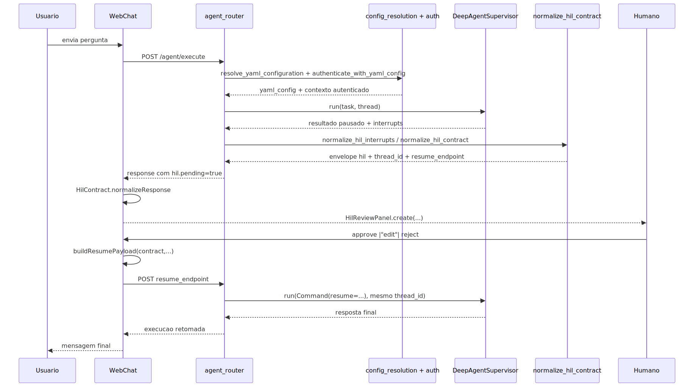

# Tutorial 101: Human-in-the-Loop (HIL)

<!-- markdownlint-disable MD013 -->

Se voce acabou de chegar no projeto e quer entender onde o humano entra em uma execucao agentic, este e o mapa mais curto e mais honesto do repositório atual. A ideia aqui nao e inventar um produto idealizado. A ideia e mostrar como o HIL realmente funciona hoje, onde ele ja esta pronto, onde ele ainda tem limites e qual e o menor caminho para testar sem se perder.

## 1) Para quem e este tutorial

- Desenvolvedor junior que precisa ligar HIL em DeepAgent ou workflow sem quebrar o contrato atual.
- Consultor junior que precisa entender o que o sistema realmente pede para aprovacao humana.
- Pessoa de operacao que quer saber onde a execucao pausa, como retoma e o que precisa existir para o fluxo funcionar.

Ao final, voce vai conseguir:

- Entender a diferenca entre HIL de DeepAgent e HIL de workflow.
- Entender onde AG-UI entra no fluxo de HIL deste projeto e onde ele nao entra.
- Saber quais chaves YAML realmente ativam pausa humana no DeepAgent atual.
- Entender o papel de `thread_id`, `correlation_id`, checkpointer e envelope `hil`.
- Retomar uma execucao pausada pelo caminho HTTP correto.
- Saber como terceiros podem criar uma nova interface sobre AG-UI e generative UI sem quebrar o contrato oficial.
- Distinguir o que ja e suportado do que ainda nao existe no contrato atual.

## 2) Dicionario rapido

- HIL: Human-in-the-Loop. Em termos simples, e a pausa controlada para uma pessoa aprovar, editar ou bloquear uma acao.
- interrupt: ponto do LangGraph em que o runtime pausa e espera uma resposta externa.
- checkpointer: mecanismo que salva o estado da execucao para permitir retomada posterior.
- thread_id: identificador logico da thread pausada. Reusar o mesmo valor retoma a mesma execucao.
- correlation_id: identificador de rastreio ponta a ponta da operacao inteira.
- interrupt_on: mapa YAML que diz quais tools do DeepAgent devem pausar antes de executar.
- human_gate: tool de workflow que chama `interrupt()` explicitamente para coletar decisao humana.
- allowed_decisions: lista oficial de decisoes aceitas pela pausa atual. No DeepAgent atual: `approve`, `edit`, `reject`.
- async_approval: modo em que a aprovacao pode ser enviada por canal assíncrono, como WhatsApp ou email.
- envelope `hil`: bloco estruturado que o backend devolve para a UI saber que a execucao esta pausada e como retoma-la.
- `HilContract`: modulo compartilhado do frontend que normaliza a resposta pausada e monta o payload de retomada do DeepAgent.
- `HilReviewPanel`: componente visual compartilhado que renderiza a revisao HIL sem fazer rede por conta propria.
- AG-UI: rota e protocolo de eventos dedicados para interfaces agentic orientadas por SSE; neste projeto ele entra por `POST /ag-ui/runs`.
- Generative UI: neste repositório, significa a materializacao governada de telas e dashboards a partir de eventos, snapshots e deltas, nao HTML livre vindo do modelo.
- interrupt outcome: quando o run AG-UI termina com `outcome.type="interrupt"`, a UI recebe a pendencia humana no stream em vez de um sucesso final simples.

## 3) Conceito em linguagem simples

Pense no sistema como uma fabrica com esteiras automaticas. Na maior parte do tempo, a esteira anda sozinha. Mas algumas caixas sao sensiveis: podem disparar um email, registrar uma operacao, publicar algo externo ou aprovar uma mudanca importante. Nessas caixas, o sistema para a esteira e chama um revisor.

Esse revisor nao entra para conversar genericamente com o agente. Ele entra para decidir sobre um ponto concreto da execucao. No DeepAgent atual, isso normalmente significa revisar uma chamada de tool antes da execucao real. No workflow, isso pode aparecer como uma aprovacao humana de node ou como uma coleta explicita via `human_gate`.

Em linguagem de estagiario: HIL e o freio de mao da automacao. O sistema trava num ponto governado, salva onde estava, mostra para o humano o que precisa ser decidido e so continua depois que alguem responde do jeito que o contrato aceita.

Quando AG-UI entra no jogo, ele nao substitui esse contrato de HIL. Ele muda a forma de transporte e de visualizacao. Em vez de uma tela esperar o fim da execucao, ela acompanha eventos, estado e interrupcoes em tempo real. O ponto importante e este: AG-UI transporta a interrupcao e ajuda a renderizar a interface, mas a retomada formal do DeepAgent continua sendo feita pelo endpoint HTTP de HIL do agente.

## 4) Mapa de navegacao do repo

- [README-HUMAN-IN-THE-LOOP.md](./README-HUMAN-IN-THE-LOOP.md) -> manual tecnico principal do assunto -> mexa primeiro quando a duvida for contrato, limites ou comportamento real.
- `src/api/routers/agent_router.py` -> boundary HTTP de DeepAgent HIL -> mexa quando o problema for `/agent/execute`, `/agent/continue` ou envelope `hil`.
- `src/api/routers/workflow_router.py` -> boundary HTTP de workflow -> mexa quando a retomada vier de `/workflow/continue`.
- `src/agentic_layer/supervisor/deep_agent_supervisor.py` -> runtime DeepAgent e normalizacao de `interrupt_on` -> mexa quando a pausa for de tool-call no supervisor.
- `src/agentic_layer/tools/system_tools/human_input.py` -> tool `human_gate` baseada em `interrupt()` -> mexa quando o HIL for explicitamente modelado dentro de workflow ou tool.
- `src/config/agentic_assembly/ast/deepagent.py` -> AST tipada do DeepAgent -> mexa quando o contrato YAML precisar evoluir de verdade.
- `src/config/agentic_assembly/validators/deepagent_semantic_validator.py` -> valida regra semantica do YAML -> mexa quando uma chave nova precisar ser aceita ou recusada.
- `src/api/routers/ag_ui_router.py` -> boundary HTTP AG-UI -> mexa quando o stream SSE, `POST /ag-ui/runs` ou o request AG-UI mudarem.
- `src/api/services/ag_ui_run_orchestrator.py` -> lifecycle AG-UI -> mexa quando o run precisar emitir `RUN_STARTED`, `RUN_FINISHED`, `RUN_ERROR` ou preservar `interrupt` no stream.
- `src/api/schemas/ag_ui_models.py` -> contrato tipado de eventos, interrupt e request AG-UI -> mexa quando uma nova interface third-party precisar de campo novo no protocolo.
- `app/ui/static/js/shared/ui-webchat-hil-contract.js` -> normaliza o envelope `hil` e monta `resume.decisions` -> mexa quando um novo WebChat precisar falar o contrato oficial do DeepAgent.
- `app/ui/static/js/shared/hil-review-panel.js` -> renderizador OO desacoplado da API -> mexa quando a apresentacao visual da revisao humana precisar evoluir.
- `app/ui/static/js/shared/ag-ui-client.js` -> cliente SSE via `fetch` POST -> mexa quando a interface AG-UI third-party precisar consumir o stream oficial.
- `app/ui/static/js/shared/ag-ui-sidecar-chat.js` -> sidecar AG-UI que renderiza interrupts com `HilReviewPanel` -> mexa quando uma nova interface precisar reutilizar o lado visual do HIL em AG-UI.
- `app/ui/static/js/shared/ag-ui-retail-demo-page.js` -> controller base das telas AG-UI demo -> mexa quando quiser ver como montar payload de `POST /ag-ui/runs` para generative UI.
- `app/ui/static/js/admin-webchat/app.js` -> WebChat administrativo que integra os modulos compartilhados ao `fetch` real -> mexa quando quiser entender a implementacao de referencia para terceiros.
- `app/ui/static/js/ui-webchat-v3.js` -> WebChat v3 que usa o mesmo contrato cliente-neutro -> mexa quando precisar de um segundo exemplo real da mesma arquitetura.
- `tests/unit/test_ag_ui_run_orchestrator.py` -> prova que `interrupt` sai no `RUN_FINISHED` sem terminal duplicado -> mexa quando o transporte HIL no stream AG-UI mudar.
- `tests/js/ag_ui_sidecar_chat.test.js` -> prova que o sidecar AG-UI renderiza a aprovacao pendente e propaga a decisao por callback -> mexa quando o contrato visual de AG-UI HIL mudar.
- `tests/integration/hil/test_hil_deepagent_flow.py` e `tests/frontend/*.test.js` -> protegem contrato HTTP e contrato de frontend -> mexa quando a regressao estiver no resume, no painel ou no parsing do envelope.

## 5) Mapa visual 1: fluxo macro

## 6) Mapa visual 2: quem chama quem

## 7) Mapa visual 3: camadas

## 8) Mapa visual 4: componentes

### Mapa visual 5: swimlane funcional

## 9) Onde isso aparece neste projeto

- HIL de DeepAgent por middleware e `interrupt_on` aparece em `src/agentic_layer/supervisor/deep_agent_supervisor.py` e no contrato tipado de `src/config/agentic_assembly/ast/deepagent.py`.
- O validator exige `middlewares.human_in_the_loop.enabled=true` junto com `interrupt_on` e `memory.checkpointer.enabled=true` em `src/config/agentic_assembly/validators/deepagent_semantic_validator.py`.
- O boundary HTTP de pausa e retomada do DeepAgent mora em `src/api/routers/agent_router.py`.
- O envelope `hil` usado pela UI e normalizado no boundary tambem nasce em `src/api/routers/agent_router.py` com apoio de `src/agentic_layer/supervisor/hil_interrupts.py`.
- O caminho alternativo de HIL explicito em workflow aparece na tool `human_gate` em `src/agentic_layer/tools/system_tools/human_input.py`.
- A resposta padrao de bloqueio humano em workflow aparece em `src/agentic_layer/workflow/nodes/base.py`.
- A retomada HTTP de workflow por resposta humana fica em `src/api/routers/workflow_router.py`.
- A aprovacao assincrona por canais tem servicos dedicados em `src/api/services/hil_background_approval_service.py` e `src/api/services/hil_approval_notification_service.py`.
- O armazenamento duravel do pedido de aprovacao por canal aparece em `src/api/repositories/agent_hil_approval_requests_repository.py`.
- O contrato compartilhado de WebChat para HIL mora em `app/ui/static/js/shared/ui-webchat-hil-contract.js` e expoe `window.HilContract`.
- O painel visual compartilhado mora em `app/ui/static/js/shared/hil-review-panel.js` e expoe `window.HilReviewPanel`.
- O WebChat administrativo usa esse contrato em `app/ui/static/js/admin-webchat/app.js`, onde a resposta pausada e normalizada e a retomada faz `fetch` para `contract.resumeEndpoint`.
- O WebChat v3 usa a mesma arquitetura em `app/ui/static/js/ui-webchat-v3.js`, mantendo `hilPendente`, bloqueando novas perguntas e retomando com `thread_id` e `correlation_id` do backend.
- O boundary AG-UI dedicado fica em `src/api/routers/ag_ui_router.py` e publica `POST /ag-ui/runs` com `StreamingResponse` SSE.
- O orquestrador AG-UI preserva HIL como `RUN_FINISHED` com `outcome.type="interrupt"` em `src/api/services/ag_ui_run_orchestrator.py`, conforme protegido por `tests/unit/test_ag_ui_run_orchestrator.py`.
- O contrato desse interrupt transportado no stream fica em `src/api/schemas/ag_ui_models.py`, especialmente `AgUiInterrupt` e `AgUiRunInterruptOutcome`.
- O store AG-UI transforma `RUN_FINISHED` com `interrupt` em `run.status="interrupted"` e preenche `state.interrupts` em `app/ui/static/js/shared/ag-ui-state-store.js`.
- O sidecar AG-UI renderiza essa lista de `interrupts` usando `HilReviewPanel`, mas a decisao humana sai apenas por callback `onInterruptDecision` em `app/ui/static/js/shared/ag-ui-sidecar-chat.js`.
- O controller base das demos AG-UI em `app/ui/static/js/shared/ag-ui-retail-demo-page.js` ja monta o payload oficial de `POST /ag-ui/runs`, mas hoje nao fecha sozinho a ponte de continue HIL.
- Os testes `tests/unit/test_ag_ui_existing_contract_protection.py` deixam explicito que AG-UI entra por rota nova sem alterar o contrato HIL HTTP que continua apontando para `/agent/continue`.
- As paginas `app/ui/static/ui-admin-plataforma-webchat.html` e `app/ui/static/ui-webchat-v3.html` carregam explicitamente `ui-webchat-hil-contract.js`, `hil-review-panel.js` e `hil-review-panel.css`.
- Os testes `tests/frontend/ui_webchat_hil_contract.test.js`, `tests/frontend/hil_review_panel_contract.test.js`, `tests/frontend/webchat_context_contract.test.js` e `tests/frontend/ui_webchat_v3_contract.test.js` protegem esse contrato de frontend.
- A prova unitaria do contrato `hil` esta em `tests/unit/test_deepagent_hil_interrupts.py`.
- A prova integrada do fluxo execute -> pause -> continue esta em `tests/integration/hil/test_hil_deepagent_flow.py`.

## 10) Caminho real no codigo

- `src/api/routers/agent_router.py` -> publica `POST /agent/execute`, `POST /agent/continue`, detecta pausa e monta o envelope `hil`.
- `src/agentic_layer/supervisor/deep_agent_supervisor.py` -> `DeepAgentSupervisor.run()` executa o agente e `_normalize_interrupt_on_config()` valida o mapa real de revisao humana.
- `src/config/agentic_assembly/ast/deepagent.py` -> `DeepAgentHumanInTheLoopMiddlewareAST`, `DeepAgentAsyncApprovalAST` e `DeepAgentSupervisorAST.interrupt_on` definem o contrato tipado.
- `src/config/agentic_assembly/validators/deepagent_semantic_validator.py` -> `_validate_hil_checkpointer()`, `_validate_hil_async_approval()` e `_validate_interrupt_on_mapping()` recusam YAML invalido.
- `src/agentic_layer/tools/system_tools/human_input.py` -> `create_human_gate_tool()` cria a tool `human_gate` que chama `interrupt()`.
- `src/api/routers/workflow_router.py` -> `continue_workflow()` retoma workflow pausado com `thread_id` e `human_response`.
- `src/agentic_layer/workflow/nodes/base.py` -> `_build_human_gate_response()` monta status `paused` ou `failed` quando a aprovacao humana trava o node.
- `src/api/repositories/agent_hil_approval_requests_repository.py` -> cria e resolve pedidos duraveis de aprovacao assincrona por token.
- `app/ui/static/js/shared/ui-webchat-hil-contract.js` -> `normalizeResponse()` so aceita pausa formal com `hil.pending=true` e `buildResumePayload()` monta `resume.decisions` na ordem das `action_requests`.
- `app/ui/static/js/shared/hil-review-panel.js` -> `create()` monta um componente OO sem `fetch`, sem hardcode de endpoint e sem dependencia direta do backend.
- `src/api/routers/ag_ui_router.py` -> `run_ag_ui()` exige `yaml_config`, `yaml_inline_content` ou `encrypted_data`, gera `correlation_id` no backend e devolve stream SSE em `POST /ag-ui/runs`.
- `src/api/schemas/ag_ui_models.py` -> `AgUiRunRequest` define o contrato HTTP da interface AG-UI e `AgUiRunFinishedEvent` com `AgUiRunInterruptOutcome` define como HIL aparece no stream.
- `src/api/services/ag_ui_run_orchestrator.py` -> preserva HIL vindo do adapter como `RUN_FINISHED` com `outcome.type="interrupt"`, sem fabricar sucesso extra.
- `app/ui/static/js/shared/ag-ui-client.js` -> consome o stream oficial por `fetch` POST, propaga apenas o `X-Correlation-Id` emitido pelo backend e nao gera `correlation_id` no browser.
- `app/ui/static/js/shared/ag-ui-state-store.js` -> quando recebe `RUN_FINISHED` com `interrupt`, marca o run como `interrupted` e coloca as aprovacoes em `snapshot.interrupts`.
- `app/ui/static/js/shared/ag-ui-sidecar-chat.js` -> adapta `interrupts` do AG-UI ao `HilReviewPanel` e entrega `approve` ou `reject` para `onInterruptDecision`.
- `app/ui/static/js/shared/ag-ui-retail-demo-page.js` -> mostra para terceiros como montar `threadId`, `runId`, `executionKind`, `input`, `metadata` e `yaml_inline_content` para o AG-UI do projeto.
- `app/ui/static/js/admin-webchat/app.js` -> `normalizeHilResponse()`, `executeHilContinue()` e `renderHilPanel()` mostram a referencia real de como um cliente integra os dois modulos compartilhados.
- `app/ui/static/js/ui-webchat-v3.js` -> `_normalizarContratoHil()`, `_executarContinueHil()` e `responderHil()` mostram a mesma arquitetura em Alpine, incluindo bloqueio de novas mensagens enquanto existe `hilPendente`.
- `tests/unit/test_deepagent_hil_interrupts.py` -> prova `action_requests`, `review_configs`, `allowed_decisions` e `interrupt_id`.
- `tests/integration/hil/test_hil_deepagent_flow.py` -> prova execute, pause, approve, reject e edit via API.
- `tests/frontend/ui_webchat_hil_contract.test.js` e `tests/frontend/hil_review_panel_contract.test.js` -> provam que o cliente usa `thread_id` e `correlation_id` do backend e que o painel nao faz rede por conta propria.
- `tests/js/ag_ui_runtime.test.js` e `tests/js/ag_ui_sidecar_chat.test.js` -> provam que AG-UI transporta `interrupts`, atualiza o store e expõe a decisao por callback sem `POST /agent/continue` embutido.

## 11) Fluxo passo a passo (o que acontece de verdade)

### 11.1 Com DeepAgent e HIL padrao

1. O cliente chama `POST /agent/execute`.
2. O router resolve o YAML efetivo e autentica a chamada.
3. O supervisor ativo precisa estar em `execution.type=deepagent`.
4. O YAML precisa ligar `multi_agents[].middlewares.human_in_the_loop.enabled=true`.
5. O mesmo supervisor precisa declarar `multi_agents[].interrupt_on` apontando para as tools sensiveis.
6. A raiz do YAML precisa ter `memory.checkpointer.enabled=true`.
7. Quando o DeepAgent tenta chamar uma tool protegida, o runtime pausa antes da execucao real.
8. O resultado pausado volta para `agent_router`, que normaliza interrupts e monta o bloco `hil`.
9. A resposta HTTP publica `thread_id`, `correlation_id`, `hil.pending`, `allowed_decisions`, `action_requests` e `resume_endpoint`.
10. O frontend ou operador usa esses dados para decidir se aprova, edita ou rejeita.
11. A retomada acontece por `POST /agent/continue`, com o mesmo `thread_id` e `correlation_id`.
12. O runtime executa `Command(resume=...)`, retoma a mesma thread e finaliza ou rejeita a execucao.

### 11.2 Com workflow e pausa humana

1. O cliente chama `POST /workflow/execute`.
2. O workflow roda em `AgentWorkflow` ate um node sensivel ou uma tool `human_gate` pedir intervencao.
3. A pausa usa `interrupt()` do LangGraph e depende de checkpointer para retomada.
4. O node ou tool publica metadata de aprovacao humana no estado.
5. O operador retoma pelo endpoint `POST /workflow/continue`.
6. Nesse caminho, o contrato atual de retomada usa `thread_id`, `correlation_id` e `human_response` em formato simples de texto.
7. O `WorkflowOrchestrator.continue_execution()` reabre a thread pausada e continua o grafo.

### 11.3 Como o WebChat atual implementa HIL de DeepAgent

1. As paginas `app/ui/static/ui-admin-plataforma-webchat.html` e `app/ui/static/ui-webchat-v3.html` carregam `ui-webchat-hil-contract.js`, `hil-review-panel.js` e `hil-review-panel.css`.
2. O cliente envia a chamada inicial para `POST /agent/execute` quando esta em modo agent ou deepagent.
3. Quando a resposta volta, a tela nao faz parsing de texto. Ela chama `HilContract.normalizeResponse(response, ...)`.
4. Se `normalizeResponse()` retornar contrato, a tela guarda esse estado pendente, reaproveita `thread_id`, `correlation_id`, `resume_endpoint` e bloqueia novas perguntas ate a decisao humana terminar.
5. A parte visual e delegada para `HilReviewPanel.create(...)`, que so renderiza botoes e callbacks. Ele nao sabe fazer `fetch` e nao sabe qual endpoint final sera usado.
6. A tela dona do fluxo continua responsavel por coletar edicoes opcionais, chamar `HilContract.buildResumePayload(...)` e fazer `POST` para `contract.resumeEndpoint`.
7. O request de retomada do DeepAgent reaproveita `correlation_id`, `thread_id`, `mode`, `user_email`, `encrypted_data` e envia `resume.decisions` na ordem exata das `action_requests`.
8. No estado atual do repositório, esse contrato compartilhado de WebChat cobre o HIL HTTP do DeepAgent. Workflow continua tendo contrato proprio de retomada por `human_response` textual e exige adaptacao dedicada no cliente.

### 11.4 Com AG-UI e generative UI deste projeto

1. A interface third-party ou a pagina demo chama `POST /ag-ui/runs` com `threadId`, `runId`, `executionKind`, `user_email`, `input` e uma fonte de configuracao valida, como `yaml_inline_content` ou `encrypted_data`.
2. O router AG-UI nao retoma HIL por conta propria. Ele abre um stream SSE dedicado, gera o `X-Correlation-Id` no backend e repassa o run ao `AgUiRunOrchestrator`.
3. Se o adapter terminar com sucesso, o cliente recebe `RUN_FINISHED` com `outcome.type="success"`. Se terminar em HIL, o cliente recebe `RUN_FINISHED` com `outcome.type="interrupt"` e a lista `interrupts`.
4. O store AG-UI transforma isso em `run.status="interrupted"` e preenche `snapshot.interrupts`.
5. O sidecar AG-UI pega esse `snapshot.interrupts`, adapta cada item ao contrato do `HilReviewPanel` e mostra aprovacoes pendentes no mesmo painel lateral.
6. No estado atual do projeto, esse sidecar nao faz a retomada HTTP sozinho. Ele apenas chama `onInterruptDecision({ interrupt, decision })`.
7. Isso significa que a sua interface third-party precisa implementar a ponte: quando receber a decisao do operador, ela mesma deve chamar o boundary formal de HIL, que hoje continua sendo `/agent/continue` para DeepAgent ou `/workflow/continue` para workflow.
8. Em linguagem simples: `POST /ag-ui/runs` cuida da experiencia progressiva e da generative UI; `/agent/continue` e `/workflow/continue` continuam cuidando da retomada formal da execucao pausada.
9. A parte de generative UI que ja existe no projeto fica no mesmo slice AG-UI: `DashboardSpec`, `STATE_SNAPSHOT`, `STATE_DELTA` e eventos `CUSTOM` materializados por `ag_ui_dashboard_materialization.py` e consumidos pelas paginas de dashboard.

### 11.5 Como terceiros podem criar novas interfaces usando AG-UI

1. Reaproveite o contrato AG-UI oficial em vez de inventar um websocket paralelo. A entrada oficial hoje e `POST /ag-ui/runs`.
2. Monte o payload com o shape de `AgUiRunRequest`: `threadId`, `runId`, `executionKind`, `user_email`, `input`, `metadata` e uma fonte de YAML.
3. Consuma o stream por `fetch` POST + SSE. O cliente compartilhado em `ag-ui-client.js` ja faz isso sem gerar `correlation_id` no browser.
4. Se a sua tela for um sidecar ou timeline, voce pode reaproveitar `ag-ui-sidecar-chat.js`, `ag-ui-state-store.js` e o `HilReviewPanel`.
5. Se a sua tela for uma interface generativa de dashboard, siga o mesmo padrao das paginas AG-UI de varejo: receba `STATE_SNAPSHOT`, `STATE_DELTA` e `CUSTOM` e materialize a UI a partir do estado, nao de HTML livre.
6. Para HIL, trate `RUN_FINISHED` com `outcome.type="interrupt"` como pausa formal da execucao. A tela deve mostrar a pendencia e bloquear o proximo passo de negocio ate a decisao humana.
7. Se a execucao interrompida for DeepAgent, a sua interface precisa transformar a decisao humana em request para `/agent/continue`. Se for workflow, a ponte vai para `/workflow/continue`.
8. Hoje o projeto ainda nao expõe um endpoint `POST /ag-ui/continue`. Se voce criar uma nova interface AG-UI, nao documente esse endpoint como fato porque ele nao foi encontrado no codigo analisado.

### 11.6 Com aprovacao assincrona por canal

1. O DeepAgent pausa como no fluxo padrao.
2. Se `async_approval` estiver habilitado no HIL do supervisor, o backend cria um pedido duravel de aprovacao.
3. O sistema registra token, status, canais esperados, aprovadores permitidos e TTL.
4. O servico de notificacao tenta entregar esse pedido nos canais configurados.
5. Uma decisao externa pode ser registrada depois, sem depender de um `/agent/continue` manual pela mesma UI local.

### 11.7 Com config ativa e no estado atual

- Com config ativa no DeepAgent: o contrato atual suporta pausa por nome de tool, decisoes `approve`, `edit`, `reject`, `description_prefix` e `async_approval`.
- Com config ativa no workflow: o projeto suporta pausa via `interrupt()` e retomada por `/workflow/continue`.
- No estado atual do contrato DeepAgent: nao existe sintaxe declarativa para `valor < 100`, mensagem por regra de negocio dentro de `interrupt_on` ou decisoes arbitrarias fora de `approve`, `edit`, `reject`.

## 12) Status: esta pronto? quanto esta pronto?

| Area | Evidencia | Status | Impacto pratico | Proximo passo minimo |
| --- | --- | --- | --- | --- |
| HIL DeepAgent por middleware e `interrupt_on` | `src/agentic_layer/supervisor/deep_agent_supervisor.py`, `src/config/agentic_assembly/ast/deepagent.py` | pronto | Ja pausa tool-call sensivel no runtime governado | Usar este caminho como primeira adocao |
| Validador de YAML HIL DeepAgent | `src/config/agentic_assembly/validators/deepagent_semantic_validator.py` | pronto | Evita YAML ambíguo e falha fechado | Manter novas evolucoes sincronizadas com AST |
| Contrato HTTP de pausa e retomada do DeepAgent | `src/api/routers/agent_router.py`, `tests/integration/hil/test_hil_deepagent_flow.py` | pronto | Ja publica `thread_id` e envelope `hil` e retoma por `/agent/continue` | Reusar o contrato cliente-neutro na UI |
| Contrato `hil` estruturado para UI | `tests/unit/test_deepagent_hil_interrupts.py`, `src/api/schemas/agent_hil_models.py` | pronto | Permite UI generica sem parsing de texto da LLM | Continuar consumindo `hil.pending` |
| HIL em workflow via `human_gate` e pausa de node | `src/agentic_layer/tools/system_tools/human_input.py`, `src/api/routers/workflow_router.py`, `src/agentic_layer/workflow/nodes/base.py` | pronto | Ja existe caminho real fora do DeepAgent | Escolher esse caminho quando o fluxo for grafo deterministico |
| Transporte de HIL via AG-UI | `src/api/routers/ag_ui_router.py`, `src/api/schemas/ag_ui_models.py`, `tests/unit/test_ag_ui_run_orchestrator.py`, `tests/js/ag_ui_runtime.test.js` | pronto | O stream AG-UI ja consegue transportar `interrupts` e materializar a pausa visual no cliente | Reusar `POST /ag-ui/runs` para interfaces progressivas |
| Ponte AG-UI para continue formal | `app/ui/static/js/shared/ag-ui-sidecar-chat.js`, `app/ui/static/js/shared/ag-ui-retail-demo-page.js`, `tests/js/ag_ui_sidecar_chat.test.js` | parcial | A UI ja mostra a pendencia e emite callback, mas o continue HTTP ainda depende do host da interface | Implementar a ponte para `/agent/continue` ou `/workflow/continue` na interface dona do fluxo |
| Aprovacao assincrona por canal | `src/api/services/hil_background_approval_service.py`, `src/api/services/hil_approval_notification_service.py`, `src/api/repositories/agent_hil_approval_requests_repository.py` | parcial | O codigo existe, mas depende de storage, canais e governanca operacional adicionais | Fechar DSN, canais e aprovadores do tenant |
| WebChat compartilhado para HIL DeepAgent | `app/ui/static/js/shared/ui-webchat-hil-contract.js`, `app/ui/static/js/shared/hil-review-panel.js`, `app/ui/static/js/admin-webchat/app.js`, `app/ui/static/js/ui-webchat-v3.js` | parcial | Ja existe referencia real para terceiros, mas ela cobre o HIL HTTP do DeepAgent e nao substitui o contrato proprio de workflow | Reusar o contrato compartilhado no cliente e adaptar workflow separadamente |
| Condicoes por valor em `interrupt_on` | `src/config/agentic_assembly/validators/deepagent_semantic_validator.py` | ausente | Nao da para dizer declarativamente “pause se valor < X” no contrato atual | Criar nova AST, validator, compiler, runtime e testes |
| Decisoes customizadas fora de `approve`, `edit`, `reject` | `src/config/agentic_assembly/validators/deepagent_semantic_validator.py`, `src/agentic_layer/supervisor/deep_agent_supervisor.py` | ausente | A UI nao deve inventar botoes fora dessas tres opcoes | Evoluir contrato de decisao end-to-end |
| Caminho especifico para container e cloud com HIL | Escopo analisado em `run.sh`, `src/api/service_api.py`, docs do assunto | parcial | O caminho local esta claro; um playbook especifico de HIL para deploy nao foi encontrado no codigo analisado | Documentar operacao de infra especifica de HIL em novo guia se necessario |

## 13) Como colocar para funcionar (hands-on end-to-end)

### Matriz oficial de endpoints

- `POST /agent/execute` -> entrada inicial de Agent e DeepAgent. Para WebChat com HIL de revisao humana em tool-call, este e o ponto de partida.
- `POST /agent/continue` -> retomada formal do DeepAgent pausado. O cliente nao deve hardcodear esse path; deve ler `hil.resume_endpoint` e usar o valor devolvido pelo backend.
- `POST /workflow/execute` -> entrada inicial de workflows LangGraph.
- `POST /workflow/continue` -> retomada formal de workflow pausado. O contrato atual usa `thread_id`, `correlation_id` e `human_response`, nao `resume.decisions`.
- `POST /ag-ui/runs` -> entrada oficial das interfaces AG-UI e generative UI deste projeto. Ela transporta o progresso e tambem pode transportar `interrupts` no `RUN_FINISHED`.
- Nao foi encontrado no codigo um endpoint `POST /ag-ui/continue`. No estado atual, AG-UI nao substitui os endpoints formais de continue.
- Em linguagem simples: Agent e DeepAgent retomam por contrato de decisoes; workflow retoma por resposta humana textual.

### Passo 0 - Entender qual sabor de HIL voce quer testar

- Se quer aprovar ou editar chamada de tool no DeepAgent atual, comece por `interrupt_on` no supervisor DeepAgent.
- Se quer uma pausa humana modelada dentro de um workflow, siga pelo caminho de workflow e `human_gate`.

### Passo 1 - Garantir os pre-requisitos minimos

- Para DeepAgent HIL: `memory.checkpointer.enabled=true`, `execution.type=deepagent`, `middlewares.human_in_the_loop.enabled=true` e `interrupt_on` no supervisor.
- Para workflow HIL: workflow com caminho que realmente use aprovacao humana ou `human_gate`, mais estado persistivel da thread.
- Para aprovacao assincrona por canal: configuracao `async_approval`, storage duravel de pedidos HIL e canais operacionais.

### Passo 2 - Subir a API local

- Launcher versionado do repositório: `./run.sh +a`.
- O que eu espero ver: a API principal em pe com `/docs`, `/redoc` e os routers montados.
- Se voce for validar interface manualmente no browser, abra a instancia local da API na rota `/docs`.

### Passo 3 - Fazer o teste minimo de DeepAgent HIL

- Use `POST /agent/execute`.
- Force `mode=deepagent`.
- Para o primeiro teste, prefira `execution_mode=direct_sync`.
- O que eu espero ver: resposta com `thread_id` e `hil.pending=true`.

### Passo 4 - Retomar a mesma thread

- Use `POST /agent/continue`.
- Reenvie exatamente o mesmo `thread_id`.
- Reenvie exatamente o mesmo `correlation_id`.
- Envie uma decisao compativel com `hil.allowed_decisions`.
- O que eu espero ver: execucao finalizada, editada ou rejeitada de forma rastreavel.

### Passo 5 - Fazer o teste minimo de workflow HIL

- Use `POST /workflow/execute` ate provocar a pausa humana do grafo.
- Retome com `POST /workflow/continue`.
- O contrato atual desse continue usa `thread_id`, `correlation_id` e `human_response`.
- O que eu espero ver: `continue_workflow()` reencontra a thread pausada e finaliza o workflow.

### Passo 6 - Reproduzir o contrato em um novo WebChat

- Carregue no HTML do seu cliente os mesmos artefatos compartilhados usados hoje: `ui-webchat-hil-contract.js`, `hil-review-panel.js` e `hil-review-panel.css`.
- Na resposta inicial, use `HilContract.normalizeResponse(...)` para decidir se existe uma pausa formal. Se o retorno for `null`, siga o fluxo normal de chat.
- Se houver contrato HIL, guarde localmente `threadId`, `correlationId`, `resumeEndpoint`, `allowedDecisions` e `actionRequests`.
- Bloqueie novas perguntas enquanto a pendencia estiver aberta. Esse comportamento aparece tanto no admin-webchat quanto no WebChat v3.
- Renderize a revisao com `HilReviewPanel.create(...)`. O painel so cuida de UI; a sua tela continua dona do `fetch`.
- Quando o operador decidir, monte `resume.decisions` com `HilContract.buildResumePayload(...)` e envie para `contract.resumeEndpoint` junto com `thread_id`, `correlation_id`, `user_email`, `mode`, `format=json` e `encrypted_data`.
- Se o seu cliente nao souber editar argumentos com seguranca, nao tente improvisar. Esconda ou desabilite `edit` e respeite apenas as decisoes que voce consegue suportar.
- Se voce quiser suportar workflow HIL no mesmo cliente, trate esse caso como outra adaptacao. O contrato compartilhado atual foi desenhado para o envelope `hil` do DeepAgent.

### Passo 7 - Reproduzir a mesma ideia em uma interface AG-UI ou generative UI

- Use `POST /ag-ui/runs` como fonte oficial de stream. O payload minimo real esta em `AgUiRunRequest` e o controller base em `ag-ui-retail-demo-page.js` mostra como montar esse request.
- Trate `X-Correlation-Id` como valor vindo do backend. O cliente AG-UI compartilhado ja faz isso e nao injeta `correlation_id` no body.
- Alimente um store local com os eventos do stream. O repositório ja tem esse trabalho pronto em `ag-ui-state-store.js`.
- Se o seu objetivo for generative UI de dashboard, consuma `STATE_SNAPSHOT`, `STATE_DELTA` e `CUSTOM` como fazem as telas AG-UI de varejo. A verdade visual nasce do estado, nao de HTML livre.
- Se o objetivo for HIL, observe `RUN_FINISHED` com `outcome.type="interrupt"`, renderize a lista `interrupts` e transforme a decisao do operador em chamada para o continue formal fora do AG-UI.
- Em linguagem pratica: a sua interface AG-UI pode ser linda, incremental e visualmente rica, mas ela continua precisando falar com o endpoint formal de continue quando a execucao parar por HIL.

### Passo 8 - Validar pela suite oficial

- Primeiro leia o cabecalho de `scripts/suite_de_testes_padrao.sh`. Ele e o help oficial da suite.
- Comando focado para este recorte: `source .venv/bin/activate && ./scripts/suite_de_testes_padrao.sh --focus-paths tests/unit/test_deepagent_hil_interrupts.py,tests/integration/hil/test_hil_deepagent_flow.py`.
- Checagem operacional compacta: `source .venv/bin/activate && ./scripts/suite_de_testes_padrao.sh --status-repo`.
- Fechamento amplo oficial: `source .venv/bin/activate && ./scripts/suite_de_testes_padrao.sh --all-tests` e, logo depois, `source .venv/bin/activate && ./scripts/suite_de_testes_padrao.sh --status-repo`.
- O que eu espero ver: telemetria da suite sem falhas no recorte alterado e sem mascarar erros.

### Passo 9 - Caminho minimo para async_approval

- Habilite `async_approval` no HIL do supervisor.
- Garanta que aprovadores e canais estejam resolvidos no tenant.
- Garanta storage de pedidos HIL por DSN e tabela configurados para `agent_hil_approval_requests`.
- O que eu espero ver: criacao do pedido duravel, tentativa de notificacao e possibilidade de decisao posterior.

### O que nao encontrei no codigo/config analisado

- Nao encontrei um tutorial dedicado e versionado so para deploy cloud do HIL ponta a ponta.
- Nao encontrei schema declarativo de janela HIL no YAML.
- Nao encontrei sintaxe canônica para regras do tipo `when`, `condition`, `if_value_below` dentro de `interrupt_on`.

## 14) ELI5: onde coloco cada parte da feature neste projeto?

Se voce precisar mexer em HIL sem baguncar o repositório, pense em camadas.

- Entrada HTTP: onde o pedido entra e a retomada sai.
- Orquestracao: onde o runtime certo e escolhido.
- Runtime agentic: onde a pausa realmente acontece.
- Persistencia: onde o estado pausado e a aprovacao duravel vivem.
- UI: onde o envelope `hil` vira tela, sem reinventar contrato.

| Pergunta | Resposta | Camada | Onde no repo |
| --- | --- | --- | --- |
| Quero pausar tool-call de DeepAgent | Use `middlewares.human_in_the_loop` + `interrupt_on` | runtime e YAML | `src/agentic_layer/supervisor/deep_agent_supervisor.py`, `src/config/agentic_assembly/ast/deepagent.py` |
| Quero retomar DeepAgent pausado | Use `/agent/continue` com o mesmo `thread_id` | boundary HTTP | `src/api/routers/agent_router.py` |
| Quero pausar um workflow de forma explicita | Use `human_gate` ou aprovacao do node | workflow | `src/agentic_layer/tools/system_tools/human_input.py`, `src/agentic_layer/workflow/nodes/base.py` |
| Quero abrir uma interface AG-UI com stream progressivo | Use `POST /ag-ui/runs` e o contrato `AgUiRunRequest` | boundary AG-UI | `src/api/routers/ag_ui_router.py`, `src/api/schemas/ag_ui_models.py` |
| Quero renderizar HIL dentro de uma tela AG-UI | Use `snapshot.interrupts` e `HilReviewPanel` via sidecar AG-UI | frontend AG-UI | `app/ui/static/js/shared/ag-ui-sidecar-chat.js`, `app/ui/static/js/shared/hil-review-panel.js` |
| Quero transformar a decisao AG-UI em resume real | Faça a ponte do callback para o continue formal | host da interface | `app/ui/static/js/shared/ag-ui-sidecar-chat.js`, `src/api/routers/agent_router.py`, `src/api/routers/workflow_router.py` |
| Quero validar YAML HIL novo | Mude AST e validator juntos | contrato | `src/config/agentic_assembly/ast/deepagent.py`, `src/config/agentic_assembly/validators/deepagent_semantic_validator.py` |
| Quero montar um novo WebChat HIL para DeepAgent | Reuse `HilContract` para normalizar e `HilReviewPanel` para renderizar | frontend e contrato | `app/ui/static/js/shared/ui-webchat-hil-contract.js`, `app/ui/static/js/shared/hil-review-panel.js` |
| Quero saber quem faz o `fetch` do continue | A tela dona do chat faz o `fetch`; o painel nao faz rede | frontend host | `app/ui/static/js/admin-webchat/app.js`, `app/ui/static/js/ui-webchat-v3.js` |
| Quero aprovacao por WhatsApp ou email | Use `async_approval` e storage duravel | integracao e persistencia | `src/api/services/hil_background_approval_service.py`, `src/api/repositories/agent_hil_approval_requests_repository.py` |

## 15) Template de mudanca (preenchido com padroes do repo)

1. entrada: qual endpoint dispara?
   caminhos: `src/api/routers/agent_router.py`, `src/api/routers/workflow_router.py`
   contrato de entrada: DeepAgent usa `/agent/execute` e `/agent/continue`; workflow usa `/workflow/execute` e `/workflow/continue`

2. config: qual YAML/env controla?
   keys: `memory.checkpointer.enabled`, `multi_agents[].middlewares.human_in_the_loop.enabled`, `multi_agents[].interrupt_on`, `multi_agents[].middlewares.human_in_the_loop.async_approval`
   onde e lido: `src/config/agentic_assembly/ast/deepagent.py`, `src/config/agentic_assembly/validators/deepagent_semantic_validator.py`, `src/agentic_layer/supervisor/deep_agent_supervisor.py`

3. execucao: qual grafo ou runtime entra?
   builder/factory: `DeepAgentSupervisor.run()` ou `WorkflowOrchestrator.continue_execution()`
   state: DeepAgent depende de checkpointer e `thread_id`; workflow usa `WorkflowState` e metadata de aprovacao humana

4. ferramentas: quais tools sao usadas?
   registro: `interrupt_on` protege tool-call de DeepAgent; `human_gate` cria pause explicito em workflow
   chamadas: `src/agentic_layer/tools/system_tools/human_input.py`

5. dados: onde persiste, cacheia ou indexa?
   checkpointer: requisito explicito para pausa e retomada
   HIL duravel: `src/api/repositories/agent_hil_approval_requests_repository.py`
   Redis/pause registry: `HilPauseRegistry` no boundary de agentes

6. observabilidade: onde loga?
   logs: `agent_router`, `workflow_router`, `DeepAgentSupervisor`, repositorio de pedidos HIL
   correlation: `correlation_id` e obrigatorio e reaproveitado na retomada

7. testes: onde validar?
   unit: `tests/unit/test_deepagent_hil_interrupts.py`
   integration: `tests/integration/hil/test_hil_deepagent_flow.py`

8. cliente webchat: onde ligar a UX?
    contrato compartilhado: `app/ui/static/js/shared/ui-webchat-hil-contract.js`
    painel visual: `app/ui/static/js/shared/hil-review-panel.js`
    hosts de referencia: `app/ui/static/js/admin-webchat/app.js`, `app/ui/static/js/ui-webchat-v3.js`

9. interface AG-UI: onde ligar a UX progressiva?
    entrada SSE: `src/api/routers/ag_ui_router.py`
    store e sidecar: `app/ui/static/js/shared/ag-ui-state-store.js`, `app/ui/static/js/shared/ag-ui-sidecar-chat.js`
    controller base: `app/ui/static/js/shared/ag-ui-retail-demo-page.js`
    ponte de continue: responsabilidade da interface third-party, nao do sidecar compartilhado

## 16) CUIDADO: o que NAO fazer

- Nao tente modelar condicao de negocio por valor diretamente em `interrupt_on`. Isso quebra porque o contrato atual so pausa por tool, nao por expressao de negocio.
- Nao monte a UI procurando texto solto em `response`. O sinal canônico e `hil.pending=true`.
- Nao recompute `thread_id`. O valor e opaco e deve ser reaproveitado exatamente como veio do backend.
- Nao invente decisao fora de `approve`, `edit`, `reject` no DeepAgent atual. O validator e o runtime nao aceitam mais do que isso.
- Nao ligue HIL sem checkpointer. Sem persistencia de estado, voce cria pausa sem retomada confiavel.
- Nao hardcode `/agent/continue` dentro do componente visual. O painel compartilhado foi escrito para nao conhecer endpoint; quem decide o `fetch` e a tela dona do chat.
- Nao trate `POST /ag-ui/runs` como substituto automatico de `/agent/continue`. O stream AG-UI transporta a pausa, mas a retomada formal ainda mora no boundary HIL do agente ou do workflow.
- Nao assuma que o sidecar AG-UI fecha o ciclo sozinho. Hoje ele renderiza a interrupcao e dispara callback; a ponte de continue e trabalho do host da interface.
- Nao documente nem copie arquivo inexistente. Os artefatos reais do frontend hoje sao `ui-webchat-hil-contract.js` e `hil-review-panel.js`.
- Nao tente corrigir HIL apenas em docs se a mudanca for de contrato. Em agentic scope, AST, validator, runtime, schema e testes precisam evoluir juntos.

## 17) Anti-exemplos

### Anti-exemplo 1

Erro comum: colocar algo como “pause se valor < 100” dentro de `interrupt_on`.

Por que e ruim: o validator atual aceita apenas `bool` ou objeto com `allowed_decisions`.

Correcao: mover a regra para outra camada de negocio ou evoluir AST + validator + runtime de forma oficial.

### Anti-exemplo 2

Erro comum: fazer a tela descobrir pausa humana por parsing de texto da LLM.

Por que e ruim: texto muda, contrato quebra e a UI vira adivinhacao.

Correcao: usar `hil.pending`, `allowed_decisions`, `action_requests`, `review_configs`, `thread_id` e `resume_endpoint`.

### Anti-exemplo 3

Erro comum: colocar `fetch('/agent/continue')` dentro do painel visual compartilhado.

Por que e ruim: voce acopla a UI a um endpoint fixo, quebra reutilizacao e ignora `resume_endpoint` publicado pelo backend.

Correcao: deixar o painel apenas emitir callback e fazer o host chamar `contract.resumeEndpoint`.

### Anti-exemplo 4

Erro comum: usar `/workflow/continue` como se fosse `/agent/continue`.

Por que e ruim: os contratos de retomada sao diferentes.

Correcao: DeepAgent usa `resume.decisions`; workflow atual usa `human_response` textual.

### Anti-exemplo 5

Erro comum: criar notificacao por canal sem storage duravel de pedido HIL.

Por que e ruim: voce pode avisar o aprovador sem conseguir reconciliar a decisao depois.

Correcao: usar o repositorio `agent_hil_approval_requests` e a esteira oficial de `hil_background_approval_service`.

### Anti-exemplo 6

Erro comum: criar uma tela third-party AG-UI e anunciar que ela “ja suporta HIL completo” sem implementar a ponte do callback para o continue formal.

Por que e ruim: a interface ate mostra os botoes, mas a execucao nunca retoma de verdade.

Correcao: quando a tela receber `onInterruptDecision`, converter essa decisao em request para `/agent/continue` ou `/workflow/continue`, conforme o runtime pausado.

## 18) Exemplos guiados

### Exemplo 1 - DeepAgent com aprovacao de tool-call

Siga o fio por `src/api/routers/agent_router.py` -> `src/agentic_layer/supervisor/deep_agent_supervisor.py` -> `tests/integration/hil/test_hil_deepagent_flow.py`.

Leitura pratica: o router recebe a task, o supervisor pausa a tool sensivel e o teste integrado prova que a mesma thread pode ser retomada por approve, reject e edit.

### Exemplo 2 - Contrato `hil` para UI generica

Siga o fio por `app/ui/static/js/shared/ui-webchat-hil-contract.js` -> `tests/frontend/ui_webchat_hil_contract.test.js` -> `src/api/routers/agent_router.py`.

Leitura pratica: o projeto ja tem um contrato estruturado de HIL. A UI correta le esse contrato, reaproveita `thread_id` e `correlation_id` do backend e monta `resume.decisions` na mesma ordem das acoes.

### Exemplo 3 - Como o admin-webchat implementa a tela de revisao

Siga o fio por `app/ui/static/ui-admin-plataforma-webchat.html` -> `app/ui/static/js/admin-webchat/app.js` -> `app/ui/static/js/shared/hil-review-panel.js`.

Leitura pratica: a pagina carrega os assets compartilhados, o app normaliza a resposta pausada, guarda o contrato pendente e delega a visualizacao ao painel. O painel nao faz rede; o host e quem chama o continue.

### Exemplo 4 - Workflow com pausa humana explicita

Siga o fio por `src/agentic_layer/tools/system_tools/human_input.py` -> `src/api/routers/workflow_router.py` -> `src/agentic_layer/workflow/nodes/base.py`.

Leitura pratica: aqui o HIL nao nasce de `interrupt_on` do DeepAgent. Ele nasce de `interrupt()` dentro da tool ou do node do workflow e volta pelo continue do workflow.

### Exemplo 5 - AG-UI com generative UI e pause visual

Siga o fio por `src/api/routers/ag_ui_router.py` -> `src/api/schemas/ag_ui_models.py` -> `app/ui/static/js/shared/ag-ui-client.js` -> `app/ui/static/js/shared/ag-ui-state-store.js` -> `app/ui/static/js/shared/ag-ui-sidecar-chat.js`.

Leitura pratica: o stream AG-UI pode terminar com `outcome.type="interrupt"`, o store converte isso em `interrupts` pendentes e o sidecar usa o mesmo `HilReviewPanel` para mostrar a revisao. O que ainda fica faltando para a interface third-party e a chamada do continue formal.

## 19) Erros comuns e como reconhecer (debugging)

1. Sintoma observavel: YAML valida com erro de HIL sem checkpointer. Hipotese: `memory.checkpointer.enabled` esta ausente ou falso. Como confirmar: leia `src/config/agentic_assembly/validators/deepagent_semantic_validator.py` e procure `DEEPAGENT_HITL_CHECKPOINTER_AUSENTE`. Correcao segura: habilitar checkpointer no YAML raiz.
2. Sintoma observavel: `interrupt_on` foi declarado mas o validator recusa. Hipotese: `middlewares.human_in_the_loop.enabled` esta desligado. Como confirmar: leia o mesmo validator e procure `DEEPAGENT_INTERRUPT_ON_SEM_HITL`. Correcao segura: ligar o middleware ou remover `interrupt_on`.
3. Sintoma observavel: a UI nao mostra pausa, embora a execucao tenha parado. Hipotese: o cliente esta lendo `response` e ignorando `hil.pending`. Como confirmar: leia `src/api/routers/agent_router.py` e o tutorial de API HIL. Correcao segura: usar o envelope `hil` como fonte de verdade.
4. Sintoma observavel: `/agent/continue` nao retoma a execucao certa. Hipotese: `thread_id` ou `correlation_id` nao foram reaproveitados corretamente. Como confirmar: compare o response de pausa com o request de continue. Correcao segura: reenviar exatamente os mesmos valores.
5. Sintoma observavel: o workflow nao retoma com payload de DeepAgent. Hipotese: foi enviado `resume.decisions` para `/workflow/continue`. Como confirmar: leia `WorkflowContinueRequest` em `src/api/routers/workflow_router.py`. Correcao segura: enviar `human_response` textual no contrato atual de workflow.
6. Sintoma observavel: async approval falha antes da notificacao. Hipotese: canais ou aprovadores nao geraram principals permitidos. Como confirmar: leia `src/api/services/hil_background_approval_service.py` e procure `async_approval habilitado nao gerou aprovadores permitidos`. Correcao segura: corrigir `channels[]` e `approvers[]` do supervisor.
7. Sintoma observavel: a decisao externa chega, mas o pedido ja expirou. Hipotese: TTL curto ou politica de expiracao inadequada. Como confirmar: leia `src/api/repositories/agent_hil_approval_requests_repository.py` e `src/api/services/hil_approval_maintenance_job.py`. Correcao segura: ajustar `ttl_seconds` e `expiration_policy`.
8. Sintoma observavel: o painel aparece, mas clicar em aprovar nao dispara continue. Hipotese: a tela integrou `HilReviewPanel`, mas nao conectou o callback `onDecision` ao seu `fetch`. Como confirmar: leia `app/ui/static/js/shared/hil-review-panel.js` e confirme que ele nao contem `fetch`. Depois compare com `app/ui/static/js/admin-webchat/app.js` ou `app/ui/static/js/ui-webchat-v3.js`. Correcao segura: fazer o host montar o request e chamar `contract.resumeEndpoint`.
9. Sintoma observavel: o cliente tenta retomar sempre em `/agent/continue`, mesmo quando o backend publicar outro endpoint. Hipotese: o frontend hardcodeou o path e ignorou `resume_endpoint`. Como confirmar: procure `'/agent/continue'` no seu WebChat e compare com `tests/frontend/ui_webchat_v3_contract.test.js`. Correcao segura: usar `contract.resumeEndpoint` como fonte de verdade.
10. Sintoma observavel: editar nao funciona na retomada. Hipotese: a UI enviou `edit` sem `edited_action` valido. Como confirmar: compare o payload enviado com os exemplos de `/agent/continue` em `src/api/routers/agent_router.py`. Correcao segura: montar `edited_action` no formato esperado ou esconder `edit` quando a tela nao souber editar.
11. Sintoma observavel: a tela AG-UI mostra “Aguardando aprovacao”, mas nenhuma retomada acontece no backend. Hipotese: a interface consumiu `POST /ag-ui/runs`, mas nao implementou a ponte do `onInterruptDecision`. Como confirmar: leia `app/ui/static/js/shared/ag-ui-sidecar-chat.js` e veja que o sidecar apenas chama `options.onInterruptDecision(input)`. Correcao segura: no host da interface, converter esse callback em chamada ao endpoint formal de continue.
12. Sintoma observavel: a interface third-party tenta chamar `/ag-ui/continue` e recebe 404 ou nao encontra rota. Hipotese: o time presumiu um endpoint que nao existe no runtime atual. Como confirmar: leia `src/api/routers/ag_ui_router.py` e `tests/unit/test_ag_ui_router.py`. Correcao segura: usar `POST /ag-ui/runs` para abrir o stream e continuar usando `/agent/continue` ou `/workflow/continue` para retomar a execucao pausada.

## 20) Exercicios guiados

### Exercicio 1

Objetivo: identificar no codigo o menor conjunto de chaves para ativar HIL no DeepAgent.

Passos:

1. Abra `src/config/agentic_assembly/ast/deepagent.py`.
2. Localize `DeepAgentHumanInTheLoopMiddlewareAST`.
3. Depois abra `src/config/agentic_assembly/validators/deepagent_semantic_validator.py`.
4. Procure as validacoes de checkpointer e `interrupt_on`.

Como verificar no codigo: confirme que o validator exige `memory.checkpointer.enabled=true`, `middlewares.human_in_the_loop.enabled=true` e `interrupt_on`.

Gabarito: o menor caminho atual para DeepAgent HIL e checkpointer ativo na raiz + middleware HIL ligado + mapa `interrupt_on` no supervisor.

### Exercicio 2

Objetivo: distinguir o continue de DeepAgent do continue de workflow.

Passos:

1. Abra `src/api/routers/agent_router.py`.
2. Ache os exemplos de `AGENT_CONTINUE_REQUEST_EXAMPLES`.
3. Depois abra `src/api/routers/workflow_router.py`.
4. Compare `AgentContinueRequest` com `WorkflowContinueRequest`.

Como verificar no codigo: veja que DeepAgent aceita `resume.decisions`, enquanto workflow aceita `human_response`.

Gabarito: os dois fluxos de HIL existem, mas o contrato HTTP de retomada nao e o mesmo.

### Exercicio 3

Objetivo: descobrir o contrato minimo para um WebChat novo suportar HIL de DeepAgent.

Passos:

1. Leia `app/ui/static/js/shared/ui-webchat-hil-contract.js`.
2. Leia `app/ui/static/js/shared/hil-review-panel.js`.
3. Leia `app/ui/static/js/admin-webchat/app.js` ou `app/ui/static/js/ui-webchat-v3.js`.
4. Anote quem normaliza a resposta, quem renderiza o painel e quem faz o `fetch` do continue.

Como verificar no codigo: confirme que `normalizeResponse()` exige `hil.pending=true`, que o painel nao faz rede e que o host envia `thread_id`, `correlation_id` e `resume: buildResumePayload(...)`.

Gabarito: o gatilho oficial e o bloco `hil`; `HilContract` normaliza e monta o payload; `HilReviewPanel` so renderiza; a tela dona do chat faz o `fetch` para `resumeEndpoint`.

### Exercicio 4

Objetivo: identificar o que uma interface AG-UI third-party precisa implementar para suportar HIL de verdade.

Passos:

1. Leia `src/api/schemas/ag_ui_models.py` e localize `AgUiRunInterruptOutcome`.
2. Leia `app/ui/static/js/shared/ag-ui-state-store.js` e veja como `RUN_FINISHED` com `interrupt` vira `state.interrupts`.
3. Leia `app/ui/static/js/shared/ag-ui-sidecar-chat.js` e procure `onInterruptDecision`.
4. Compare com `app/ui/static/js/admin-webchat/app.js`, que ja mostra um host implementando o continue formal fora do AG-UI.

Como verificar no codigo: confirme que AG-UI entrega a pausa no stream, mas a retomada HTTP ainda precisa ser implementada pela tela dona do fluxo.

Gabarito: a interface third-party precisa consumir `POST /ag-ui/runs`, renderizar `interrupts` e transformar a decisao do operador em chamada para `/agent/continue` ou `/workflow/continue`.

## 21) Checklist final

- Entendi a diferenca entre HIL de DeepAgent e HIL de workflow.
- Sei que o DeepAgent atual pausa por nome de tool, nao por regra de negocio declarativa.
- Sei onde `interrupt_on` e normalizado no runtime.
- Sei onde o validator rejeita HIL sem checkpointer.
- Sei que `approve`, `edit` e `reject` sao as unicas decisoes oficiais do DeepAgent atual.
- Sei que a UI deve usar `hil.pending=true` como gatilho.
- Sei quais endpoints sao oficiais para execute e continue em DeepAgent e workflow.
- Sei o papel de `POST /ag-ui/runs` no slice AG-UI e generative UI.
- Sei que `thread_id` precisa ser reaproveitado exatamente como veio do backend.
- Sei que `resume_endpoint` vindo do backend vale mais do que qualquer path hardcodeado no cliente.
- Sei diferenciar o papel de `HilContract`, `HilReviewPanel` e da tela dona do `fetch`.
- Sei diferenciar o papel do sidecar AG-UI e do endpoint formal de continue.
- Sei que `/agent/continue` e `/workflow/continue` usam contratos diferentes.
- Sei onde o caminho de `human_gate` aparece no codigo.
- Sei que `async_approval` depende de canais, aprovadores e storage duravel.
- Sei que o projeto ja transporta `interrupts` pelo stream AG-UI, mas ainda nao expõe `POST /ag-ui/continue`.
- Sei quais testes focados protegem o contrato atual.
- Sei o menor caminho para testar HIL localmente.

## 22) Checklist de PR quando mexer nisso

- O contrato novo foi confirmado em codigo e nao apenas em docs.
- Se mudou YAML agentic, AST e validator evoluiram juntos.
- Se mudou DeepAgent HIL, `src/agentic_layer/supervisor/deep_agent_supervisor.py` foi revisado junto com o validator.
- Se mudou envelope `hil`, os schemas e testes unitarios foram atualizados.
- Se mudou `/agent/continue`, os exemplos publicos e o teste integrado foram revisados.
- Se mudou HIL de workflow, `workflow_router`, nodes base e caminho de `human_gate` foram revisados juntos.
- Nenhuma UI nova depende de parsing de texto da LLM para detectar pausa.
- Nenhuma UI nova hardcodeia `/agent/continue`; ela consome `resume_endpoint` do backend.
- O painel visual continua sem `fetch` e sem conhecer endpoint final.
- O WebChat novo reaproveita `thread_id` e `correlation_id` do backend sem recomputacao.
- Se a mudança tocar AG-UI, `ag_ui_router`, `ag_ui_models`, `ag_ui_state_store` e o sidecar foram revisados em conjunto.
- Nenhuma interface third-party nova anuncia `POST /ag-ui/continue` sem evidência no código.
- Se a tela AG-UI passou a suportar retomada, existe teste provando a ponte entre `onInterruptDecision` e o continue formal.
- `thread_id` e `correlation_id` continuam sendo propagados sem recomputacao no cliente.
- `async_approval` foi validado com canais e aprovadores reais do tenant quando aplicavel.
- A suite oficial foi rodada pelo menos no foco dos testes HIL tocados.
- Nenhuma decisao nova foi adicionada fora de `approve`, `edit`, `reject` sem evolucao completa de contrato.

## 23) Referencias

### Referencias internas

- [docs/README-HUMAN-IN-THE-LOOP.md](./README-HUMAN-IN-THE-LOOP.md)
- [docs/tutorial-101-exemplos-api-deepagent-hil-execute-continue.md](./tutorial-101-exemplos-api-deepagent-hil-execute-continue.md)
- [docs/README-DEEPAGENTS-SUPERVISOR.md](./README-DEEPAGENTS-SUPERVISOR.md)
- [docs/README-AG-UI.md](./README-AG-UI.md)
- [docs/tutorial-101-generative-ui.md](./tutorial-101-generative-ui.md)
- [docs/README-AGENTE-WORKFLOW.md](./README-AGENTE-WORKFLOW.md)
- `src/api/routers/ag_ui_router.py`
- `src/api/schemas/ag_ui_models.py`
- `src/api/services/ag_ui_run_orchestrator.py`
- `app/ui/static/js/shared/ag-ui-client.js`
- `app/ui/static/js/shared/ag-ui-state-store.js`
- `app/ui/static/js/shared/ag-ui-sidecar-chat.js`
- `app/ui/static/js/shared/ag-ui-retail-demo-page.js`
- `app/ui/static/ui-admin-plataforma-webchat.html`
- `app/ui/static/ui-webchat-v3.html`
- `app/ui/static/js/shared/ui-webchat-hil-contract.js`
- `app/ui/static/js/shared/hil-review-panel.js`
- `app/ui/static/js/admin-webchat/app.js`
- `app/ui/static/js/ui-webchat-v3.js`
- `src/api/routers/agent_router.py`
- `src/api/routers/workflow_router.py`
- `src/agentic_layer/supervisor/deep_agent_supervisor.py`
- `src/agentic_layer/tools/system_tools/human_input.py`
- `src/agentic_layer/workflow/nodes/base.py`
- `src/config/agentic_assembly/ast/deepagent.py`
- `src/config/agentic_assembly/validators/deepagent_semantic_validator.py`
- `tests/unit/test_deepagent_hil_interrupts.py`
- `tests/integration/hil/test_hil_deepagent_flow.py`
- `tests/unit/test_ag_ui_existing_contract_protection.py`
- `tests/unit/test_ag_ui_run_orchestrator.py`
- `tests/js/ag_ui_runtime.test.js`
- `tests/js/ag_ui_sidecar_chat.test.js`
- `tests/frontend/ui_webchat_hil_contract.test.js`
- `tests/frontend/hil_review_panel_contract.test.js`
- `tests/frontend/webchat_context_contract.test.js`
- `tests/frontend/ui_webchat_v3_contract.test.js`

### Referencias externas consultadas

- LangGraph, pagina oficial “Interrupts”.
- FastAPI, documentacao oficial de visao geral e docs interativos.
