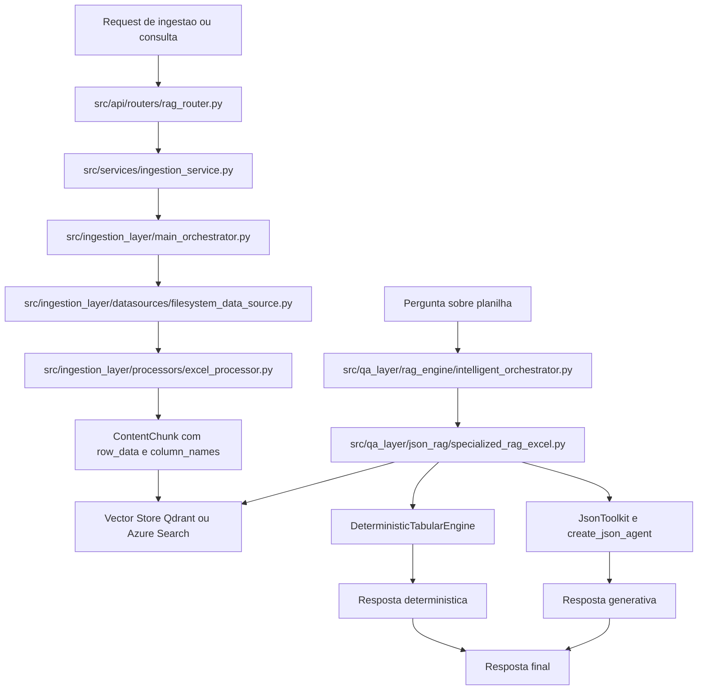
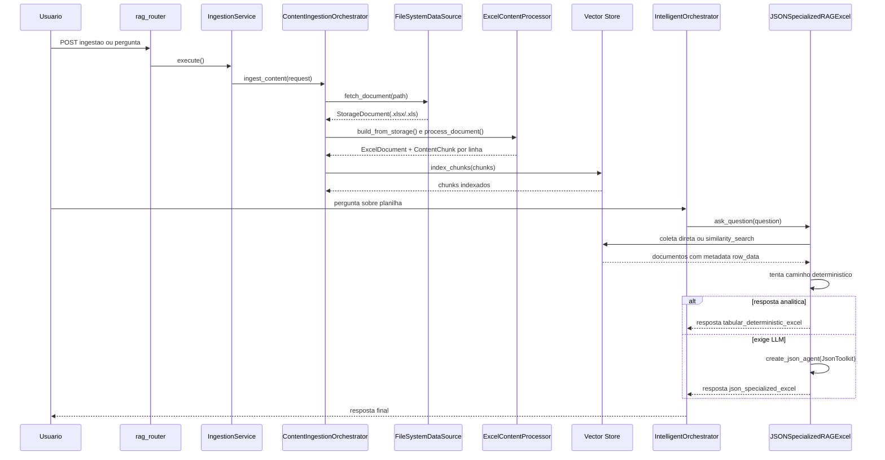
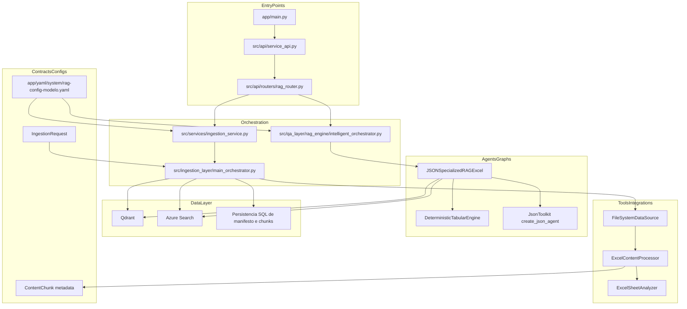
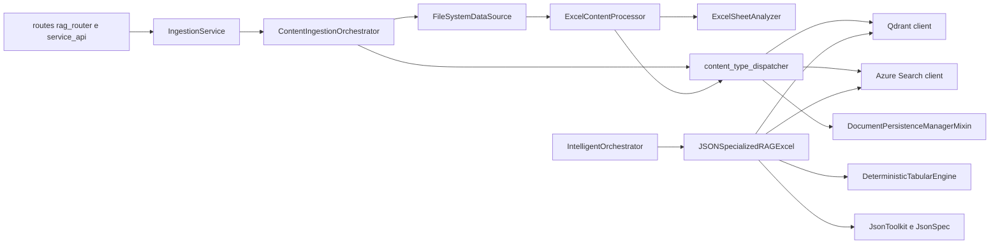

# Tutorial 101: ingestão de Excel e RAG de Excel

> ATUALIZACAO FORCADA EM 2026-03-08: este arquivo foi revisado para detalhar melhor o pipeline de perguntas sofisticadas, o limite do motor determinístico e o momento exato de entrada da LLM.

Se você acabou de chegar no projeto e quer entender como uma planilha Excel vira conhecimento consultável, este tutorial foi feito para você. A ideia aqui não é repetir marketing nem teoria genérica de RAG. A ideia é seguir o fio real do código: onde a planilha entra, como ela vira linhas estruturadas, como isso vai para o vector store e como o fluxo especializado de pergunta sobre planilha tenta responder primeiro de forma determinística e depois, se precisar, com LLM.

## 2) Para quem é este tutorial

- Iniciante que precisa entender o subsistema de planilhas sem se perder no restante da plataforma.
- Desenvolvedor de negócio que vai mexer em ingestão, metadados ou perguntas tabulares.
- Pessoa de infraestrutura que precisa descobrir o menor caminho para rodar o fluxo.
- Quem precisa saber o que já funciona, o que está parcial e o que ainda não fecha ponta a ponta.

Ao final, você vai conseguir:

- localizar os arquivos centrais do fluxo de Excel no repositório;
- entender como o Excel vira `ExcelDocument` e depois `ContentChunk` por linha;
- entender como o RAG especializado de Excel lê os metadados do vector store em vez de reabrir a planilha;
- identificar a lacuna atual entre o YAML de `local_files` e a requisição compartilhada de ingestão;
- saber o menor caminho prático para subir a API e validar o comportamento atual.

## 3) Dicionário rápido

- `StorageDocument`: objeto bruto com bytes, caminho, tipo e metadados básicos antes do parsing.
- `ExcelDocument`: representação já interpretada da planilha, com conteúdo legível, totais, abas e dados estruturados.
- `ExcelSheetAnalyzer`: analisador que detecta tabelas, densidade e tipo estrutural de cada aba.
- `ContentChunk`: pedaço indexável que vai para o vector store. No caso de Excel, ele carrega uma linha completa da planilha.
- `row_data`: dicionário com os valores de uma linha. É o coração do RAG tabular de Excel.
- `excel_schema_summary`: resumo do schema inferido por aba e coluna.
- `excel_numeric_stats`: estatísticas numéricas por coluna, como mínimo, máximo e média.
- `JSONSpecializedRAGExcel`: fluxo especializado de perguntas sobre planilha que lê metadados do vector store e tenta responder consultas tabulares.
- `DeterministicTabularEngine`: motor que responde perguntas analíticas sem depender de geração livre, quando a pergunta cabe nesse modo.
- `JsonToolkit`: toolkit do LangChain usado quando o fluxo especializado precisa fallback generativo sobre um JSON consolidado das abas.

## 4) Conceito em linguagem simples

Pense na ingestão de Excel como um trabalho de almoxarifado. A planilha chega fechada em uma caixa. O `FileSystemDataSource` só recebe a caixa e confere etiqueta, tamanho e conteúdo bruto. O `ExcelContentProcessor` abre a caixa, separa por abas, entende colunas, identifica números e cria fichas linha a linha. Cada ficha vira um `ContentChunk` com metadados bem ricos. Essas fichas são colocadas em um “depósito de busca”, que é o vector store.

Depois, quando alguém faz uma pergunta sobre planilha, o fluxo especializado de Excel não volta no arquivo original. Em vez disso, ele entra no depósito e procura as fichas já indexadas. Se a pergunta for do tipo “qual coluna”, “qual valor”, “quantas linhas”, ele tenta responder de forma determinística. Se a pergunta for mais aberta, ele monta um JSON consolidado com amostras das abas e usa um agente JSON do LangChain.

A analogia do mundo real é esta: a ingestão é o trabalho de catalogar uma biblioteca de planilhas; o RAG de Excel é o bibliotecário que responde usando fichas catalogadas, não folheando o livro inteiro toda vez.

## 5) Mapa de navegação do repo

- `src/api/`: entradas HTTP reais. Mexa aqui quando o fluxo começar ou terminar em endpoint.
- `src/services/`: fachadas compartilhadas entre API e CLI. Mexa aqui quando o problema for montar uma requisição de ingestão a partir do YAML.
- `src/ingestion_layer/datasources/`: leitura bruta de origem. Mexa aqui se o problema for descobrir arquivo, baixar bytes ou inferir tipo.
- `src/ingestion_layer/processors/`: parsing e enriquecimento por tipo. É aqui que Excel realmente ganha semântica.
- `src/ingestion_layer/content_type_dispatcher.py`: ponto onde chunks ganham metadados finais e seguem para indexação e persistência.
- `src/ingestion_layer/document_persistence_manager.py`: persistência de manifesto, páginas, imagens e chunks depois da indexação.
- `src/qa_layer/json_rag/`: implementação do RAG especializado em JSON e Excel. Mexa aqui quando a pergunta tabular estiver errada.
- `src/qa_layer/rag_engine/`: roteamento inteligente e decisão de qual estratégia de retrieval usar.
- `src/ingestion_layer/core/data_models.py`: contratos centrais. Não mexa aqui por conveniência; qualquer mudança espalha para o pipeline todo.
- `app/yaml/system/rag-config-modelo.yaml`: modelo-base do YAML. Mexa aqui para entender flags e parâmetros, não para inventar campo novo.
- `tests/unit/ingestion_layer/processors/`: testes unitários do parser e analisador de Excel.
- `tests/unit/test_intelligent_orchestrator_logic.py`: testes do detector e do fail-first do fluxo especializado de Excel.

## 6) Mapa visual 1: fluxo macro

## 7) Mapa visual 2: quem chama quem

## 8) Mapa visual 3: camadas

## 9) Mapa visual 4: componentes

## 10) Onde isso aparece neste projeto

- `src/ingestion_layer/core/factories.py`: registra `ExcelContentProcessor` para `ContentType.EXCEL_XLSX` e `ContentType.EXCEL_XLS`.
- `src/ingestion_layer/datasources/filesystem_data_source.py`: reconhece `.xlsx` e `.xls` e entrega `StorageDocument` com bytes.
- `src/ingestion_layer/processors/excel_processor.py`: abre workbook, extrai texto, schema, estatísticas e cria chunks por linha.
- `src/ingestion_layer/processors/excel_sheet_analyzer.py`: detecta tabelas nativas e heurísticas por densidade.
- `src/ingestion_layer/content_type_dispatcher.py`: injeta metadados finais nos chunks, indexa no vector store e chama persistência.
- `src/ingestion_layer/document_persistence_manager.py`: persiste manifesto, páginas, imagens e chunks após indexação.
- `src/services/ingestion_service.py`: traduz YAML em `IngestionRequest`, mas hoje não inclui caminho local específico para Excel.
- `src/qa_layer/rag_engine/intelligent_orchestrator.py`: decide se ativa o fluxo especializado de Excel.
- `src/qa_layer/json_rag/specialized_rag_excel.py`: coleta documentos Excel do vector store, materializa datasets tabulares e responde perguntas.
- `app/yaml/system/rag-config-modelo.yaml`: define a seção `json_specialized_rag_excel` e a seção `excel`.
- `tests/unit/ingestion_layer/processors/test_storage_build_processors.py`: prova que o parser de Excel constrói `ExcelDocument` a partir de `StorageDocument`.
- `tests/unit/test_intelligent_orchestrator_logic.py`: prova o detector, a decisão JSON toolkit e o fail-first por completude.

## 11) Caminho real no código

- `app/main.py` -> `main()`: sobe Uvicorn com `src.api.service_api:app`.
- `src/api/service_api.py` -> `app = FastAPI(..., lifespan=lifespan)`: monta o app real, routers, middlewares e startup.
- `src/api/routers/rag_router.py` -> endpoint de ingestão síncrona/assíncrona: instancia `IngestionService`.
- `src/services/ingestion_service.py` -> `execute()` e `_build_ingestion_request()`: faz a ponte entre YAML e orquestrador.
- `src/ingestion_layer/core/data_models.py` -> `IngestionRequest`: contrato que representa as fontes de ingestão.
- `src/ingestion_layer/main_orchestrator.py` -> `ingest_content()`: orquestra o pipeline completo.
- `src/ingestion_layer/datasources/filesystem_data_source.py` -> `_infer_content_type()` e `_transform_to_document()`: transforma arquivo local em `StorageDocument`.
- `src/ingestion_layer/processors/excel_processor.py` -> `build_from_storage()`: converte bytes Excel em `ExcelDocument`.
- `src/ingestion_layer/processors/excel_processor.py` -> `_create_row_aware_chunks()`: transforma cada linha em `ContentChunk` rico em metadados.
- `src/ingestion_layer/processors/excel_sheet_analyzer.py` -> `analyze_sheet_structure()`: detecta estrutura da aba.
- `src/qa_layer/rag_engine/intelligent_orchestrator.py` -> `_should_use_json_specialized_excel_rag()`: detector de uso do fluxo especializado.
- `src/qa_layer/json_rag/specialized_rag_excel.py` -> `ask_question()`: executa resposta determinística ou generativa.

## 12) Fluxo passo a passo

1. A API de ingestão chama `IngestionService.execute()`.
2. O serviço monta um `IngestionRequest` com base no YAML.
3. O `ContentIngestionOrchestrator` recebe a requisição e escolhe as factories e data sources corretas.
4. O `FileSystemDataSource` infere `.xlsx` como `ContentType.EXCEL_XLSX` e `.xls` como `ContentType.EXCEL_XLS`.
5. O `ExcelContentProcessor.build_from_storage()` valida extensão, tamanho e bytes do workbook.
6. O processador abre o arquivo com `openpyxl` para `.xlsx` e tenta caminho `xlrd` best-effort para `.xls`.
7. Cada aba é analisada pelo `ExcelSheetAnalyzer`, que mede densidade e detecta tabelas nativas ou heurísticas.
8. O processador gera `excel_schema_summary`, `excel_numeric_stats`, `tables_data`, `sheet_names`, `total_rows` e `total_columns`.
9. Depois ele cria `ContentChunk` linha a linha, com metadados como `sheet_name`, `row_index`, `column_names`, `row_data`, `column_types`, `column_roles` e `numeric_columns`.
10. O `content_type_dispatcher` adiciona metadados operacionais como `vectorstore_id`, `source_file`, `correlation_id`, `document_hash` e `content_hash`.
11. O vector store indexa os chunks.
12. Depois da indexação, o `DocumentPersistenceManagerMixin` persiste manifesto, páginas, imagens e chunks em banco.
13. Na consulta, o `IntelligentOrchestrator` verifica se `json_specialized_rag_excel.enabled` está ativo, se há tipo de conteúdo compatível e se a pergunta tem palavras-chave suficientes.
14. Se a decisão for positiva, o `JSONSpecializedRAGExcel` tenta coletar documentos Excel do vector store de forma exaustiva.
15. Em Qdrant, ele tenta `client.scroll`. Em Azure Search, ele tenta `search_client.search(search_text="*")` com paginação.
16. Se não houver acesso direto, ele cai para `similarity_search("", k=max_documents)`, mas marca a coleta como não exaustiva.
17. Se `require_exhaustive_ingestion` estiver ativo e a coleta não for exaustiva, ele falha com `ExcelIngestionCompletenessError`.
18. Com os metadados carregados, ele reconstrói datasets tabulares a partir de `row_data`; ele não reabre a planilha original.
19. Ele tenta primeiro o `DeterministicTabularEngine`.
20. Se não der para responder deterministicamente e houver LLM, ele monta um JSON consolidado e cria um agente JSON com `JsonToolkit`, `JsonSpec` e `create_json_agent`.

### que perguntas sofisticadas o motor determinístico já cobre

Aqui está um ponto que merece ser dito de forma explícita: o fluxo especializado de Excel não faz só `count`, `sum` e `avg`. O `DeterministicTabularEngine` tenta primeiro uma interpretação semântica da pergunta e só depois cai para um parser determinístico complementar. Na prática, isso significa que ele já cobre uma faixa considerável de perguntas estruturadas sem depender de geração livre.

- agregações: contagem, soma, média, mínimo, máximo e percentuais, quando a coluna-alvo pode ser resolvida
- agrupamentos: perguntas do tipo “por aba, por categoria, por produto, por loja” com cálculo agregado por grupo
- filtros: perguntas com restrições por valor, texto, intervalo e combinações simples de condições
- lookup: recuperação de linhas ou valores específicos a partir de entidade, chave ou coluna reconhecida
- top N: rankings como “top 5”, “maiores”, “menores”, “mais vendidos”, “piores resultados”
- comparação entre grupos: contraste entre categorias, períodos, produtos ou subconjuntos da planilha
- comparação entre produtos e features: operações como `compare_products`, `top_featured_products`, `match_products_by_features` e `filter_products_by_feature_threshold`
- listagem de atributos de entidade: por exemplo, pedir quais features, colunas ou características estão associadas a um item
- clarificação semântica: quando a pergunta é ambígua, o engine pode devolver pedido de esclarecimento em vez de inventar uma resposta

O significado prático disso é simples: para perguntas analíticas e estruturadas, o caminho principal não é a LLM. O caminho principal é o dataset tabular reconstruído a partir de `row_data`, com nomes de coluna, aliases semânticos e escopo por aba.

### quando e como a llm entra de verdade

A LLM entra tarde no pipeline, não cedo.

1. O `IntelligentOrchestrator` decide se a pergunta deve ir para o fluxo especializado de Excel.
2. O `JSONSpecializedRAGExcel` coleta os documentos/chunks Excel do vector store e reconstrói datasets tabulares.
3. O `DeterministicTabularEngine` tenta interpretar semanticamente a pergunta.
4. Se a interpretação semântica tiver confiança suficiente, ele executa diretamente a operação tabular.
5. Se a interpretação semântica não autorizar execução direta, ele tenta um parser determinístico complementar.
6. Se ainda houver ambiguidade relevante, ele pode responder com clarificação, sem chamar LLM.
7. Só quando ele não consegue produzir resposta determinística executável é que o fluxo parte para fallback generativo.

Esse fallback generativo não trabalha em cima do workbook bruto nem em cima do dataset tabular completo. Ele usa um `consolidated_json` montado pelo `JSONSpecializedRAGExcel` com:

- resumo das abas
- nomes e tipos de colunas
- papéis semânticos de colunas
- estatísticas numéricas
- amostras de linhas por aba, limitadas por `max_rows_sample`

Isso muda bastante a expectativa correta de qualidade:

- perguntas analíticas exaustivas, que dependem de todas as linhas, devem ser respondidas preferencialmente pelo motor determinístico
- perguntas exploratórias, de interpretação, resumo, leitura de schema ou entendimento aproximado podem cair melhor no fallback generativo
- se a pergunta exigir cálculo completo sobre todas as linhas e cair no fallback da LLM, a resposta não tem a mesma garantia de completude, porque a LLM está vendo um JSON consolidado com amostras, não o universo integral de linhas

Também existe um detalhe importante de robustez: se a pergunta não for resolvida deterministicamente e não houver LLM disponível, o fluxo falha com erro claro. Ele não mascara isso com um fallback implícito.

### exemplos concretos de perguntas e para onde cada uma vai

Esta é a parte mais prática para quem está começando: abaixo está o tipo de pergunta que você faria no produto e o caminho que o pipeline tende a seguir com base no código atual.

| Pergunta de exemplo | Operação mais provável | Responde sem LLM? | Como se conecta no pipeline | Observação prática |
|---|---|---|---|---|
| “Quantas linhas existem na aba vendas?” | `aggregate` com contagem | sim | roteamento Excel -> reconstrução tabular -> engine determinístico | caso típico de pergunta analítica direta |
| “Qual é a soma da coluna faturamento na aba janeiro?” | `aggregate` com soma | sim | engine resolve aba, coluna e operação antes de qualquer fallback | depende de coluna numérica reconhecível |
| “Qual é a média de ticket por loja?” | `group_by` com média agregada | sim | engine agrupa por coluna e calcula a métrica | é mais sofisticado que um simples sum/count |
| “Mostre os 5 produtos com maior receita” | `top_n` | sim | engine monta ranking diretamente sobre as linhas materializadas | útil para ranking e ordenação |
| “Quais linhas têm status cancelado e valor acima de 1000?” | `filter` | sim | engine aplica filtros estruturados sobre `row_data` | funciona melhor quando nomes de coluna estão bem preservados |
| “Qual é o valor do produto X?” | `lookup` | sim | engine tenta localizar entidade, coluna e valor correspondente | bom para recuperação de valor pontual |
| “Compare a receita das categorias bebidas e sobremesas” | `compare_groups` | sim | engine separa subconjuntos e calcula contraste entre grupos | comparação estruturada, ainda sem LLM |
| “Compare os produtos A e B nas features de preço e margem” | `compare_products` | sim | engine usa dataset tabular e aliases semânticos para montar a comparação | depende de conseguir resolver os dois produtos |
| “Quais são os produtos com mais features positivas?” | `top_featured_products` | sim | engine executa ranking orientado a features/atributos | é um caso mais especializado do subsistema tabular |
| “Quais produtos são parecidos com o produto X pelas features?” | `match_products_by_features` | sim | engine tenta casar entidades por conjunto de atributos | não é geração livre; é comparação estruturada |
| “Quais produtos têm nota de crocância acima de 8?” | `filter_products_by_feature_threshold` | sim | engine aplica filtro por limiar em atributo numérico | exige coluna/feature identificável |
| “Liste as features do produto X” | `list_entity_features` | sim | engine recupera atributos relacionados à entidade | útil para perguntas descritivas baseadas em colunas |
| “Você quis dizer receita líquida ou receita bruta?” | `clarification` | sim, mas responde pedindo esclarecimento | interpretação semântica detecta ambiguidade e devolve clarificação | aqui a robustez está em não inventar resposta |
| “Explique em linguagem natural o que essa planilha sugere sobre comportamento de compra” | fallback generativo | não, depende de LLM | engine não encontra operação determinística executável -> JSON consolidado -> JSON Agent | aqui a LLM entra por ser pergunta interpretativa, não tabular pura |
| “Faça um resumo executivo das abas e aponte padrões” | fallback generativo | não, depende de LLM | JSONSpecializedRAGExcel monta `consolidated_json` com schema, stats e amostras -> agente JSON | bom para síntese, ruim para prometer exatidão linha a linha |

O significado prático desta tabela é o seguinte: quando a pergunta pode ser reduzida a uma operação tabular objetiva, o sistema tenta resolver tudo sem LLM. Quando a pergunta pede interpretação, resumo, narrativa, síntese ou análise aberta demais, a LLM entra como uma segunda etapa.

### regra mental simples para não se perder

- Se a pergunta parece coisa de planilha: contar, somar, agrupar, filtrar, ranquear, comparar, buscar valor, listar atributos, o caminho esperado é determinístico.
- Se a pergunta parece coisa de analista humano: interpretar tendência, resumir comportamento, escrever narrativa, sugerir leitura do dataset, o caminho provável é o fallback generativo.
- Se a pergunta estiver ambígua, o melhor comportamento não é responder. É pedir clarificação. O código atual já faz isso no caminho semântico do engine.

### com config ativa

- Quando `json_specialized_rag_excel.enabled` está `true`, o detector do orquestrador pode rotear perguntas sobre planilha para o fluxo especializado.
- Quando `require_exhaustive_ingestion` está `true`, o fluxo só responde se conseguir provar coleta exaustiva do dataset Excel.
- Quando `content_type_filter` contém `xlsx` e `xls`, apenas chunks com esses sinais entram no dataset especializado.

### no estado atual

- No `app/yaml/system/rag-config-modelo.yaml`, `json_specialized_rag_excel.enabled` está `false`.
- O YAML modelo já declara padrões locais para `.xls` e `.xlsx` em `ingestion.local_files.discovery_patterns.include`.
- Mas o `IngestionService._collect_local_files()` hoje coleta `txt`, `md`, `pdf`, `json`, `ppt` e `docx`, e não coleta Excel.
- O contrato `IngestionRequest` também não possui `excel_file_paths`.
- Impacto prático: o parser de Excel existe, o datasource local reconhece Excel e o RAG especializado existe, mas o caminho compartilhado “YAML local_files -> ingestão Excel local” ainda não fecha ponta a ponta do jeito que o YAML sugere.

## 13) Status: está pronto? quanto está pronto?

| Área | Evidência | Status | Impacto prático | Próximo passo mínimo |
|---|---|---|---|---|
| Registro do processador Excel | `src/ingestion_layer/core/factories.py` | pronto | `.xlsx` e `.xls` têm processador dedicado | manter cobertura dos tipos suportados |
| Leitura de arquivo local Excel | `src/ingestion_layer/datasources/filesystem_data_source.py` | pronto | o datasource reconhece Excel e entrega bytes corretos | reutilizar esse caminho na requisição compartilhada |
| Parser de workbook e schema | `src/ingestion_layer/processors/excel_processor.py` | pronto | a planilha vira `ExcelDocument` com schema e estatísticas | manter contratos de metadados estáveis |
| Análise estrutural da aba | `src/ingestion_layer/processors/excel_sheet_analyzer.py` | pronto | tabelas e densidade são detectadas de forma configurável | ampliar só se houver evidência de novo caso real |
| Chunks por linha com `row_data` | `src/ingestion_layer/processors/excel_processor.py` | pronto | o RAG especializado consegue operar sobre linhas estruturadas | proteger esse contrato em testes |
| Indexação no vector store | `src/ingestion_layer/content_type_dispatcher.py` | pronto | chunks Excel podem ser indexados e enriquecidos | validar provider escolhido em ambiente alvo |
| Persistência pós-indexação | `src/ingestion_layer/document_persistence_manager.py` | pronto | manifesto e chunks são gravados depois do vector store | manter integridade entre DB e vector store |
| Detector de perguntas de Excel | `src/qa_layer/rag_engine/intelligent_orchestrator.py` | pronto | pergunta sobre planilha pode ser roteada automaticamente | calibrar palavras-chave por domínio |
| RAG determinístico de Excel | `src/qa_layer/json_rag/specialized_rag_excel.py` + `src/qa_layer/json_rag/tabular_deterministic_engine.py` | pronto | cobre uma faixa ampla de perguntas estruturadas, incluindo agregação, agrupamento, filtro, lookup, ranking, comparação e clarificação semântica | proteger com testes de caracterização para novos padrões de pergunta |
| Fallback generativo com JSON Agent | `src/qa_layer/json_rag/specialized_rag_excel.py` | parcial | depende de LLM e opera sobre JSON consolidado com amostras por aba, não sobre o dataset completo linha a linha | validar limites de `max_rows_sample`, custo e expectativas de completude no ambiente real |
| Coleta exaustiva direta Qdrant/Azure | `src/qa_layer/json_rag/specialized_rag_excel.py` | pronto | o fluxo consegue provar completude nesses dois backends | testar volume real e paginação no provider usado |
| Fallback por similarity_search | `src/qa_layer/json_rag/specialized_rag_excel.py` | parcial | funciona, mas pode perder completude | usar só quando a política aceitar resposta aproximada |
| Ativação por YAML do fluxo Excel | `app/yaml/system/rag-config-modelo.yaml` | parcial | a feature existe, mas vem desligada no modelo | ativar conscientemente no YAML do tenant |
| Descoberta local de Excel via `ingestion.local_files` | `app/yaml/system/rag-config-modelo.yaml` + `src/services/ingestion_service.py` + `src/ingestion_layer/core/data_models.py` | ausente | o YAML sugere suporte, mas o serviço compartilhado não monta essa fonte | adicionar coleta de Excel e campo equivalente no contrato |

## 14) Como colocar para funcionar

### Passo 0: entender qual objetivo você quer validar

- Se você quer validar o parser de Excel, o menor caminho comprovado está nos testes unitários do processador.
- Se você quer validar o RAG especializado, você precisa de chunks Excel já indexados em Qdrant ou Azure Search com `row_data`, `column_names` e `sheet_name`.
- Se você quer validar “ingestão local via YAML”, hoje existe uma lacuna real no fluxo compartilhado.

### Passo 1: preparar o ambiente Python

- Evidência de runtime: `main.py` e `app/main.py` assumem uso da `.venv`.
- Evidência de dependências Excel: `requirements.txt` contém `openpyxl==3.1.5`, `xlrd==2.0.2` e `xlwt==1.3.0`.
- Não encontrei um script único de bootstrap do ambiente para esse fluxo específico.
- Menor caminho prático: criar ou ativar `.venv`, instalar `requirements.txt` e, se você for trabalhar com testes, também `requirements-dev.txt`.

### Passo 2: subir a API

- Comando observado no projeto: `source .venv/bin/activate && .venv/bin/python main.py`
- O app real sobe `src.api.service_api:app` via Uvicorn.
- Variáveis de ambiente explicitamente observadas em `app/main.py`:
  - `FASTAPI_HOST`
  - `FASTAPI_PORT`
  - `FASTAPI_WORKERS`
  - `FASTAPI_DEBUG`
- Validação esperada:
  - log com `Iniciando Servidor API RAG`
  - porta padrão `8000`, se não houver override
  - Swagger em `/docs`

### Passo 3: entender a limitação do caminho local por YAML

- O YAML modelo lista `ingestion_data/xls/**/*.xls` e `ingestion_data/xls/**/*.xlsx`.
- Mas `IngestionService._collect_local_files()` não adiciona Excel nas listas da requisição.
- E `IngestionRequest` não possui `excel_file_paths`.
- Resultado prático: só colocar o arquivo em `ingestion_data/xls/` e ativar `local_files.enabled` não basta, no estado atual, para garantir ingestão local compartilhada de Excel.

### Passo 4: validar o parser de Excel isoladamente

- Caminho comprovado em teste: `FileSystemDataSource.fetch_document(...)` seguido de `ExcelContentProcessor.build_from_storage(...)`.
- Evidência: `tests/unit/ingestion_layer/processors/test_storage_build_processors.py`.
- O que você espera ver:
  - `document.content_type` como `EXCEL_XLSX` ou `EXCEL_XLS`
  - `document.metadata.total_sheets`
  - `document.metadata.sheet_names`
  - `excel_schema_summary` e `excel_numeric_stats`

### Passo 5: indexar chunks Excel em um vector store

- O fluxo especializado de RAG não trabalha em cima do arquivo bruto. Ele trabalha em cima dos chunks já indexados.
- Esses chunks precisam conter, no mínimo:
  - `sheet_name`
  - `table_name`
  - `row_index`
  - `column_names`
  - `row_data`
  - `column_types`
- Validação esperada:
  - o vector store aceitar `index_chunks(chunks)`
  - a persistência pós-indexação não falhar

### Passo 6: ativar o fluxo especializado de Excel no YAML do tenant

- No YAML modelo, a chave vem assim:
  - `json_specialized_rag_excel.enabled: false`
- Para testar de verdade, você precisa ativar:
  - `json_specialized_rag_excel.enabled: true`
- Se quiser fail-first por completude, mantenha:
  - `json_specialized_rag_excel.require_exhaustive_ingestion: true`

### Passo 7: fazer uma pergunta sobre planilha

- O detector observa palavras-chave como `planilha`, `excel`, `xlsx`, `xls`, `tabela`, `coluna`, `linha`, `aba`.
- Ele também precisa perceber conteúdo compatível em `available_content_types`, a menos que esse cache esteja ausente.
- Validação esperada:
  - o `IntelligentOrchestrator` decide por `ProcessorType.JSON_TOOLKIT`
  - a estratégia escolhida vira `json_specialized_rag_excel`

### Passo 8: interpretar o resultado

- Se a pergunta for analítica e o dataset couber no motor determinístico, a resposta vem com `rag_type = tabular_deterministic_excel`.
- Se precisar de LLM, a resposta vem com `rag_type = json_specialized_excel` e `fallback_used = true`.
- Se a coleta não for exaustiva e a política exigir completude, o fluxo deve falhar com `ExcelIngestionCompletenessError`.

### Passo 9: caminho mínimo para funcionar hoje

- Parser de Excel: funciona.
- Geração de chunk tabular: funciona.
- RAG especializado sobre chunks já indexados: funciona.
- Descoberta local automática de Excel por `ingestion.local_files`: não fecha ponta a ponta hoje.

## 15) ELI5: onde coloco cada parte da feature neste projeto?

Se você quiser evoluir esse subsistema, pense em cinco gavetas diferentes. A primeira gaveta é “como a informação entra”. A segunda é “como eu transformo bytes em estrutura”. A terceira é “como eu indexo e persisto”. A quarta é “como eu decido responder”. A quinta é “como eu valido sem quebrar o resto”. Se você misturar essas gavetas, o projeto fica difícil de auditar e de manter.

| Pergunta | Resposta | Camada | Onde no repo |
|---|---|---|---|
| Onde entra uma nova origem de arquivo Excel? | No data source ou na montagem da requisição de ingestão | entrada | `src/services/ingestion_service.py`, `src/ingestion_layer/datasources/` |
| Onde ensino o sistema a interpretar a planilha? | No processador de Excel | parsing | `src/ingestion_layer/processors/excel_processor.py` |
| Onde ajusto heurística de tabela e densidade? | No analisador estrutural | análise | `src/ingestion_layer/processors/excel_sheet_analyzer.py` |
| Onde decido indexar mais ou menos metadados? | Na criação do chunk e no dispatcher | indexação | `src/ingestion_layer/processors/excel_processor.py`, `src/ingestion_layer/content_type_dispatcher.py` |
| Onde persisto o que foi ingerido? | No gerenciador de persistência | dados | `src/ingestion_layer/document_persistence_manager.py` |
| Onde ativo ou desativo o RAG especializado? | No YAML do tenant | configuração | `app/yaml/system/rag-config-modelo.yaml` |
| Onde o sistema decide usar o fluxo Excel? | No orquestrador inteligente | roteamento | `src/qa_layer/rag_engine/intelligent_orchestrator.py` |
| Onde o dataset tabular é reconstruído? | No RAG especializado de Excel | QA | `src/qa_layer/json_rag/specialized_rag_excel.py` |
| Onde valido sem quebrar o contrato? | Nos testes de processador, analisador e orquestrador | testes | `tests/unit/ingestion_layer/processors/`, `tests/unit/test_intelligent_orchestrator_logic.py` |

## 16) Template de mudança

1. entrada: qual endpoint ou job dispara?
   - paths: `src/api/routers/rag_router.py`, `src/services/ingestion_service.py`
   - contrato de entrada: `IngestionRequest`

2. config: qual YAML ou env controla?
   - keys: `json_specialized_rag_excel.*`, `excel.*`, `ingestion.local_files.*`
   - onde é lido: `src/qa_layer/rag_engine/intelligent_orchestrator.py`, `src/ingestion_layer/processors/excel_processor.py`, `src/services/ingestion_service.py`

3. execução: qual fluxo entra?
   - builder/factory: `ContentProcessorFactory` registra `ExcelContentProcessor`
   - state: `JSONSpecializedRAGExcel` materializa `ExcelIngestionState` e `tabular_datasets`

4. ferramentas: quais tools são usadas?
   - registro: não há tool interna customizada para Excel nesse caminho
   - chamadas: o fallback generativo usa `JsonToolkit`, `JsonSpec` e `create_json_agent`

5. dados: onde persiste, cacheia ou indexa?
   - MySQL ou PostgreSQL de persistência: manifesto e chunks via `DocumentPersistenceManagerMixin`
   - Redis: não encontrei uso obrigatório específico deste fluxo no escopo analisado
   - Qdrant ou Azure Search: coleta direta exaustiva no RAG especializado

6. observabilidade: onde loga?
   - logs: `create_logger_with_correlation(...)` e `self.logger` nos componentes base
   - correlation: propagado em ingestão, chunking, roteamento e RAG especializado

7. testes: onde validar?
   - unit: `tests/unit/ingestion_layer/processors/test_excel_sheet_analyzer.py`, `tests/unit/ingestion_layer/processors/test_excel_processor_validation.py`, `tests/unit/ingestion_layer/processors/test_storage_build_processors.py`
   - integration: não encontrei no escopo analisado um teste de ponta a ponta exclusivo para Excel local via YAML compartilhado

## 17) CUIDADO: o que NÃO fazer

- Não coloque parsing de Excel dentro do endpoint. Isso quebra separação de responsabilidades e torna o fluxo impossível de reutilizar.
- Não responda pergunta de planilha lendo texto solto quando o chunk já carrega `row_data`. Você perde estrutura e piora precisão.
- Não invente campo novo no YAML sem confirmar leitura real no código. Este projeto é YAML-first de verdade.
- Não esconda falha de completude com fallback tradicional. O fluxo atual foi desenhado para falhar de forma clara quando a política exige dataset completo.
- Não altere `IngestionRequest` por impulso. Esse contrato espalha impacto em todo o pipeline de ingestão.

## 18) Anti-exemplos

- Erro comum: fazer parsing do `.xlsx` dentro de `rag_router.py`.
  - Por que é ruim: mistura transporte HTTP com parsing e quebra o reuso por CLI/serviço.
  - Correção: mover para `ExcelContentProcessor`.

- Erro comum: construir resposta tabular a partir do texto renderizado da aba quando `row_data` existe.
  - Por que é ruim: perde tipos, índices e nomes de coluna estáveis.
  - Correção: usar `row_data`, `column_names`, `column_types` e `sheet_name`.

- Erro comum: criar um “fallback silencioso” para responder com busca tradicional quando a coleta Excel não é exaustiva.
  - Por que é ruim: mascara um erro de completude e pode devolver resposta errada com aparência de sucesso.
  - Correção: manter `ExcelIngestionCompletenessError` quando a política pedir completude.

- Erro comum: confiar que `ingestion.local_files.discovery_patterns` já ativa Excel local fim a fim.
  - Por que é ruim: hoje isso não fecha no `IngestionService` nem no `IngestionRequest`.
  - Correção: ligar o contrato compartilhado de ingestão antes de prometer suporte local por YAML.

## 19) Exemplos guiados

### Exemplo 1: seguir o fio do parser de Excel

- Comece em `tests/unit/ingestion_layer/processors/test_storage_build_processors.py`.
- Depois siga para `src/ingestion_layer/datasources/filesystem_data_source.py` e `src/ingestion_layer/processors/excel_processor.py`.
- O que observar: o datasource só entrega bytes e metadados básicos; quem dá semântica de planilha é o processador.

### Exemplo 2: seguir o fio do schema tabular

- Comece em `src/ingestion_layer/processors/excel_sheet_analyzer.py`.
- Depois veja como o resultado entra em `src/ingestion_layer/processors/excel_processor.py` na construção de `excel_schema_summary` e `excel_numeric_stats`.
- O que observar: o analisador não responde perguntas; ele só descreve a planilha para o resto do pipeline.

### Exemplo 3: seguir o fio do roteamento para Excel RAG

- Comece em `tests/unit/test_intelligent_orchestrator_logic.py` nos testes de Excel.
- Depois leia `src/qa_layer/rag_engine/intelligent_orchestrator.py` e `src/qa_layer/json_rag/specialized_rag_excel.py`.
- O que observar: o detector escolhe o fluxo; quem responde é o `JSONSpecializedRAGExcel`.

### Exemplo 4: seguir o fio da falha de completude

- Comece no teste que prova que a completude não é mascarada.
- Depois vá para `src/qa_layer/json_rag/specialized_rag_excel.py` na checagem de `require_exhaustive_ingestion`.
- O que observar: a falha não é “chatice”. Ela é uma proteção para não responder com dataset parcial quando a política exige cobertura total.

## 20) Erros comuns e como reconhecer

- Sintoma observável: a planilha existe na pasta `ingestion_data/xls`, mas nada é ingerido.
  - Hipótese: o serviço compartilhado não coletou Excel em `local_files`.
  - Como confirmar: olhar `src/services/ingestion_service.py` e verificar que `_collect_local_files()` não monta lista de Excel.
  - Correção segura: adicionar suporte explícito a Excel no serviço e no contrato `IngestionRequest`.

- Sintoma observável: a consulta especializada diz que não há documento Excel disponível no vector store.
  - Hipótese: os chunks indexados não carregam `row_data` e `column_names`.
  - Como confirmar: olhar `src/ingestion_layer/processors/excel_processor.py` e os metadados persistidos no vector store.
  - Correção segura: garantir que a indexação use os chunks row-aware do processador de Excel.

- Sintoma observável: pergunta sobre planilha não roteia para o fluxo especializado.
  - Hipótese: `json_specialized_rag_excel.enabled` está desligado ou faltam palavras-chave.
  - Como confirmar: olhar `app/yaml/system/rag-config-modelo.yaml` e `src/qa_layer/rag_engine/intelligent_orchestrator.py`.
  - Correção segura: ativar a flag e calibrar `keywords` e `min_keyword_matches`.

- Sintoma observável: a pergunta gera erro de completude.
  - Hipótese: a coleta caiu em `similarity_search` e a política exige varredura exaustiva.
  - Como confirmar: olhar logs e `collection_mode` em `JSONSpecializedRAGExcel`.
  - Correção segura: usar Qdrant ou Azure Search com coleta direta, ou desligar a exigência de completude conscientemente.

- Sintoma observável: arquivo `.xls` falha ao carregar.
  - Hipótese: `xlrd` indisponível ou arquivo legado inválido.
  - Como confirmar: olhar `src/ingestion_layer/processors/excel_processor.py` no fallback `.xls` e os testes de validação.
  - Correção segura: instalar `xlrd`, validar o arquivo ou converter para `.xlsx`.

- Sintoma observável: abas vazias ou pouco densas desaparecem do resultado.
  - Hipótese: a densidade ficou abaixo de `excel.content_extraction.min_data_density`.
  - Como confirmar: olhar a decisão de skip por densidade em `ExcelContentProcessor`.
  - Correção segura: revisar a configuração somente se a aba de baixa densidade for relevante de verdade.

- Sintoma observável: resposta tabular vem incompleta em planilhas com mais linhas do que o esperado.
  - Hipótese: `excel.max_rows` ou `content_extraction.max_table_rows` limitou a leitura.
  - Como confirmar: olhar a seção `excel` do YAML e o loop do processador.
  - Correção segura: aumentar o limite no YAML e medir impacto de memória e tempo.

- Sintoma observável: o detector de Excel ativa mesmo sem `available_content_types` claro.
  - Hipótese: `_has_excel_content()` assumiu `True` quando a lista não estava disponível.
  - Como confirmar: olhar `src/qa_layer/rag_engine/intelligent_orchestrator.py`.
  - Correção segura: popular corretamente o cache de tipos disponíveis antes do roteamento, se esse falso positivo estiver doendo.

## 21) Exercícios guiados

### Exercício 1

- Objetivo: descobrir onde nasce o `row_data`.
- Passos:
  - abrir `src/ingestion_layer/processors/excel_processor.py`;
  - localizar `_create_row_aware_chunks()`;
  - localizar `_build_chunk_metadata()`.
- Como verificar no código: confirmar que o metadata do chunk carrega `row_data`, `column_names` e `sheet_name`.
- Gabarito: o `row_data` é construído a partir das linhas extraídas da aba e entra no metadata do `ContentChunk` em `_build_chunk_metadata()`.

### Exercício 2

- Objetivo: provar por que o YAML local de Excel ainda não fecha ponta a ponta.
- Passos:
  - abrir `app/yaml/system/rag-config-modelo.yaml`;
  - achar `ingestion.local_files.discovery_patterns.include` com `.xls` e `.xlsx`;
  - abrir `src/services/ingestion_service.py` e achar `_collect_local_files()`;
  - abrir `src/ingestion_layer/core/data_models.py` e achar `IngestionRequest`.
- Como verificar no código: comparar o que o YAML promete com o que o contrato realmente aceita.
- Gabarito: o YAML lista Excel, mas o serviço não coleta Excel e o contrato não tem `excel_file_paths`.

### Exercício 3

- Objetivo: seguir o fail-first de completude no RAG especializado.
- Passos:
  - abrir `tests/unit/test_intelligent_orchestrator_logic.py`;
  - localizar o teste que verifica completude;
  - abrir `src/qa_layer/json_rag/specialized_rag_excel.py`.
- Como verificar no código: confirmar que a exceção `ExcelIngestionCompletenessError` sobe sem fallback tradicional.
- Gabarito: quando `require_exhaustive_ingestion` exige completude, o fluxo especializado não mascara a falha com retrieval tradicional.

## 22) Checklist final

- Você localizou o entry point real da API.
- Você identificou que o parser de Excel fica no `ExcelContentProcessor`.
- Você entendeu que o `FileSystemDataSource` só lê bytes, não interpreta planilha.
- Você entendeu o papel do `ExcelSheetAnalyzer`.
- Você viu onde nascem `excel_schema_summary` e `excel_numeric_stats`.
- Você entendeu que cada linha da planilha vira um chunk separado.
- Você viu os metadados mínimos usados pelo RAG especializado.
- Você entendeu que o RAG de Excel trabalha sobre metadados indexados, não sobre o arquivo bruto.
- Você viu que o detector do orquestrador usa keywords e content type.
- Você entendeu a diferença entre resposta determinística e fallback generativo.
- Você viu que a política de completude é fail-first.
- Você entendeu que Qdrant e Azure Search têm caminho de coleta direta no RAG especializado.
- Você identificou a lacuna atual do `local_files` para Excel.
- Você sabe quais testes unitários servem como trilha de aprendizado.

## 23) Checklist de PR quando mexer nisso

- Validou se a mudança toca parser, roteamento ou ambos.
- Confirmou se algum novo campo YAML realmente é lido no código.
- Manteve `row_data`, `column_names`, `sheet_name` e `column_types` estáveis nos chunks.
- Não colocou lógica de parsing Excel em endpoint ou router.
- Não criou fallback silencioso para mascarar falha de completude.
- Revisou o impacto em `IngestionRequest` antes de mudar contrato de entrada.
- Protegeu a mudança com teste em `tests/unit/ingestion_layer/processors/` quando alterou parsing.
- Protegeu a mudança com teste em `tests/unit/test_intelligent_orchestrator_logic.py` quando alterou roteamento.
- Validou comportamento para `.xlsx` e `.xls` quando a mudança toca abertura do workbook.
- Verificou se limites YAML como `max_rows`, `max_sheets_total` e `min_data_density` continuam respeitados.
- Confirmou se Qdrant e Azure Search continuam suportando a coleta do fluxo especializado.
- Revisou logs com `correlation_id` em pontos críticos da mudança.

## 24) Referências

### Referências internas

- `app/main.py`
- `src/api/service_api.py`
- `src/api/routers/rag_router.py`
- `src/services/ingestion_service.py`
- `src/ingestion_layer/core/data_models.py`
- `src/ingestion_layer/core/factories.py`
- `src/ingestion_layer/datasources/filesystem_data_source.py`
- `src/ingestion_layer/processors/excel_processor.py`
- `src/ingestion_layer/processors/excel_sheet_analyzer.py`
- `src/ingestion_layer/content_type_dispatcher.py`
- `src/ingestion_layer/document_persistence_manager.py`
- `src/qa_layer/rag_engine/intelligent_orchestrator.py`
- `src/qa_layer/json_rag/specialized_rag_excel.py`
- `app/yaml/system/rag-config-modelo.yaml`
- `tests/unit/ingestion_layer/processors/test_storage_build_processors.py`
- `tests/unit/ingestion_layer/processors/test_excel_processor_validation.py`
- `tests/unit/ingestion_layer/processors/test_excel_sheet_analyzer.py`
- `tests/unit/test_intelligent_orchestrator_logic.py`

### Referências externas consultadas

- FastAPI Docs, seção `Lifespan Events`.
- LangChain Docs, seção `JSON toolkit integration`.
- openpyxl Docs, seção `Introduction` e documentação geral do `Workbook`.
- Documentação oficial do projeto lida apenas como referência de nomenclatura. O comportamento descrito neste tutorial foi concluído a partir do código do repositório.
