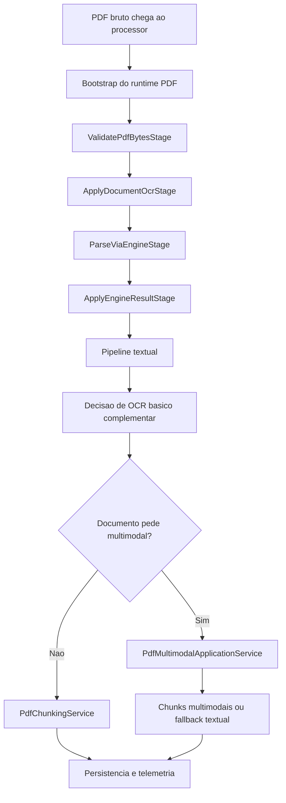
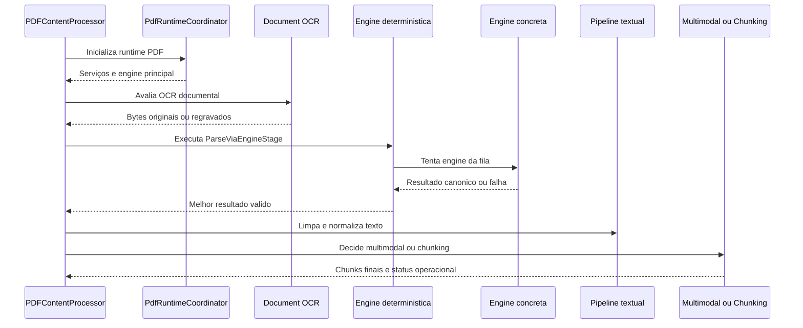
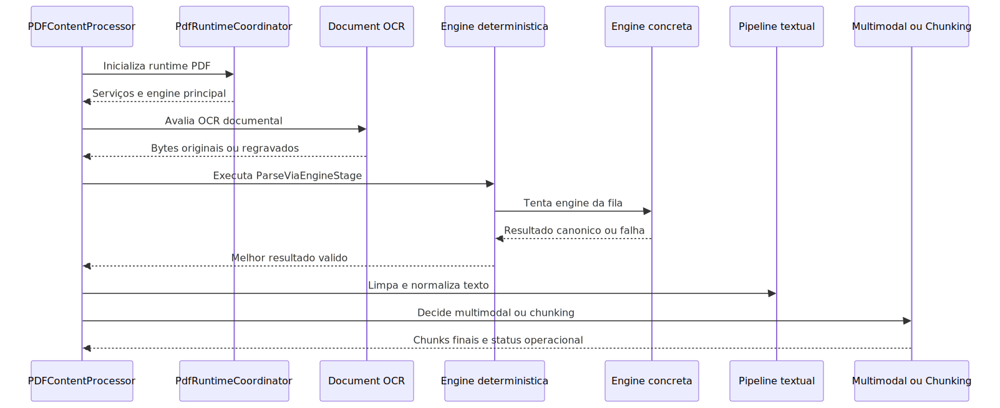

# Manual tecnico, executivo, comercial e estrategico: pipeline de ingestao de PDF

## 1. O que e esta feature

O pipeline de ingestao de PDF e a esteira especializada que transforma um PDF bruto em conteudo utilizavel pelo restante da plataforma. Ele nao existe apenas para tirar texto de um arquivo. Ele existe para decidir se o documento precisa de OCR antes do parsing, escolher a fila correta de engines, consolidar metadados, preservar sinais de estrutura, decidir se o documento precisa de OCR complementar, abrir o ramo multimodal quando fizer sentido e, no fim, produzir chunks e telemetria operacional confiavel.

Em linguagem simples: este modulo e o ponto em que a plataforma deixa de tratar PDF como um anexo opaco e passa a trata-lo como um documento com estrategia propria de leitura.

## 2. Que problema ele resolve

PDF parece um formato unico, mas no runtime real ele esconde problemas muito diferentes.

- Alguns PDFs ja nascem digitais e permitem extracao textual direta.
- Outros sao escaneados e quase nao tem texto nativo.
- Outros tem texto, mas com layout, tabelas e imagens que afetam a qualidade do acervo.
- Outros exigem mais estrutura para RAG do que um parser linear consegue oferecer.

Sem um pipeline especializado, a plataforma cairia em tres erros comuns.

- Trataria OCR como remendo unico para qualquer caso.
- Misturaria engines leves e pesadas sem criterio operacional.
- Perderia a capacidade de explicar por que um PDF foi bem ou mal ingerido.

## 3. Visao executiva

Para lideranca, o pipeline de PDF importa porque muitos projetos corporativos sao julgados pela qualidade com que tratam contratos, laudos, regulamentos, cadernos tecnicos, relatorios e normativos. Se a ingestao de PDF for ruim, o produto transmite baixa confianca mesmo quando outras partes da arquitetura estao corretas.

O valor executivo desta feature esta em reduzir risco de base de conhecimento incompleta, de resposta fraca por parsing inadequado e de suporte caro por falta de observabilidade. O pipeline existe para trocar improviso por governanca.

## 4. Visao comercial

Comercialmente, esta feature sustenta uma promessa muito concreta: a plataforma nao trata PDF como upload generico. Ela aplica tecnicas diferentes para PDF digital, PDF pobre em texto, PDF tabular e PDF visualmente rico.

Isso ajuda em conversas com clientes que perguntam se o sistema le normas, contratos, manuais de engenharia, laudos escaneados e documentos cheios de quadros. A resposta suportada pelo codigo e sim, mas com estrategia configuravel por engine e por etapa. O que nao pode ser prometido e leitura perfeita para qualquer PDF sem configuracao, sem dependencia e sem tuning.

## 5. Visao estrategica

Estrategicamente, o pipeline de PDF fortalece a plataforma em cinco frentes.

- Separa OCR documental, parsing textual, limpeza, multimodal e chunking em responsabilidades diferentes.
- Mantem configuracao YAML como fonte de verdade da fila de parsing.
- Permite trocar e ordenar engines sem reescrever o processor.
- Cria um contrato canonico de resultado para qualquer engine.
- Melhora observabilidade com manifest, metadados, breaker e resultado deterministico.

## 6. Conceitos necessarios para entender

### PDF documental versus PDF visual

PDF documental e o que ja traz texto nativo suficiente para leitura direta. PDF visual e o que depende mais de imagem, layout, tabela ou OCR para produzir valor.

### OCR documental

OCR documental e o pre-processamento do PDF inteiro antes do parsing principal. Ele existe para casos em que o documento parece escaneado ou pobre em texto ja na amostra inicial.

### OCR por pagina

OCR por pagina nao e a mesma coisa que OCR documental. Ele acontece dentro de algumas engines durante o parsing, quando uma pagina especifica nao oferece texto suficiente.

### OCR multimodal

OCR multimodal e o OCR aplicado sobre imagens extraidas do PDF dentro do fluxo multimodal. Ele nao tenta salvar o PDF inteiro; ele tenta enriquecer a leitura de imagens relevantes.

### Parsing engine

Parsing engine e a implementacao especializada que extrai texto, e em alguns casos tabelas, imagens, anexos e metadados. O pipeline nao pressupoe uma unica engine universal.

### Engine deterministica

A engine deterministica nao e um parser especifico. Ela e o orquestrador que le a fila ordenada do YAML, testa uma engine de cada vez e decide se continua ou encerra o parse.

### Failure policy

Failure policy e a politica usada quando nenhuma engine retorna sucesso formal. O codigo confirma duas politicas: `strict_first_success` e `best_effort`.

### Circuit breaker

Circuit breaker e o mecanismo que evita insistir em engine quebrada repetidamente. Ele nao escolhe a melhor engine; ele protege a esteira contra insistencia em runtime defeituoso.

### Materializacao de resultado canonico

Qualquer engine precisa devolver um `PdfParsingEngineResult` com campos padronizados como texto, paginas processadas, paginas vazias, paginas com OCR, `pages_info`, tabelas, imagens, anexos e metadata. Isso permite que o resto do pipeline nao precise conhecer os detalhes internos de cada provider.

## 7. Como o pipeline funciona por dentro

O fluxo real do PDF comeca no `PDFContentProcessor`, mas ele nao monta tudo sozinho. Primeiro o runtime PDF e inicializado por `PdfRuntimeCoordinator`. Esse bootstrap resolve configuracoes, liga OCR, tabelas, metadata, pipelines e suporte multimodal. Depois `PdfParsingRuntimeBuilder` monta os servicos de apoio e resolve a engine principal de parsing.

Com o runtime pronto, o pipeline de extracao executa quatro etapas fixas.

- `ValidatePdfBytesStage`
- `ApplyDocumentOcrStage`
- `ParseViaEngineStage`
- `ApplyEngineResultStage`

Quando a extracao termina, o pipeline textual processa o texto em tres etapas.

- `PreserveStructureStage`
- `RemoveBasicArtifactsStage`
- `FixSimpleOcrArtifactsStage`

Depois disso, o `PdfRichProcessingApplicationService` decide se precisa de OCR basico complementar e se o documento deve entrar no trilho multimodal. Se o multimodal nao entrar, o fluxo fecha no chunking. Se entrar, `PdfMultimodalApplicationService` executa extracao de imagens, OCR multimodal, descricao visual e eventual embedding visual, sempre com status operacional explicito.

## 8. Divisao em etapas ou submodulos

### 8.1. Bootstrap do runtime PDF

O que e: a fase que prepara configuracao, servicos auxiliares e pipelines internos.

Por que existe: para impedir que o processor principal vire uma god class cheia de wiring.

Tecnica usada: `PdfRuntimeCoordinator` e `PdfParsingRuntimeBuilder`.

O que recebe: configuracao YAML ja resolvida do profile PDF.

O que entrega: OCR service, document OCR service, table service, metadata builder, pages info builder e a engine efetiva de parsing.

O que pode dar errado: configuracao invalida, engine nao suportada, dependencia ausente ou wiring de Docling inconsistente.

### 8.2. Validacao do arquivo PDF

O que e: a etapa `ValidatePdfBytesStage`.

Por que existe: o pipeline falha cedo se o arquivo nao tem bytes ou nao comeca com assinatura `%PDF`.

Tatica: abortar antes de OCR ou parse quando o documento ja esta invalidado na entrada.

Valor tecnico: evita diagnostico enganoso em etapas posteriores.

### 8.3. OCR documental condicional

O que e: a etapa `ApplyDocumentOcrStage`, apoiada por `PdfDocumentOcrService`.

Por que existe: alguns PDFs precisam ser regravados com OCR antes do parsing principal.

Tatica: analisar uma amostra do documento, medir texto, densidade e sinais suspeitos e decidir se o OCR document-level deve entrar.

Tecnica: `PdfDocumentOcrAnalyzer` calcula razoes de paginas vazias, baixo texto, media de caracteres e texto suspeito. A decisao consolidada pode ser forcada por configuracao ou disparada por sinais objetivos.

Valor tecnico: separa o problema de "o PDF inteiro esta ruim" do problema de "algumas paginas estao ruins".

### 8.4. Parsing via engine

O que e: a etapa `ParseViaEngineStage`.

Por que existe: o sistema precisa de uma fila ordenada de engines, nao de um parser unico fixo.

Tatica: usar uma engine deterministica que chama engines concretas na ordem do YAML e decide a continuidade com base em excecao, `None` ou `is_successful=False`.

Tecnica: `PdfParsingEngineResolver` monta `DeterministicLegoPdfParsingEngine` a partir de `processing.parsing.base.options` e aplica `failure_policy`.

Valor tecnico: permite trocar estrategia sem mexer no restante do pipeline.

### 8.5. Aplicacao do resultado da engine

O que e: a etapa `ApplyEngineResultStage`.

Por que existe: o pipeline precisa transformar o retorno da engine em texto extraido e payload de persistencia controlada.

Tatica: consolidar texto, tabelas, imagens, anexos e resumo de OCR num contrato unico.

Valor tecnico: reduz acoplamento entre engine concreta e processor.

### 8.6. Limpeza e normalizacao do texto

O que e: o pipeline `pdf_text_processing`.

Por que existe: o parse bruto ainda pode conter marcas de pagina, `form feed`, espacos excessivos e artefatos simples de OCR.

Etapas confirmadas:

- `PreserveStructureStage` preserva estrutura e normaliza marcadores de pagina.
- `RemoveBasicArtifactsStage` remove `form feed` e artefatos basicos de whitespace.
- `FixSimpleOcrArtifactsStage` tenta corrigir palavras cujas letras ficaram separadas por espacos.

### 8.7. Fluxo rico: OCR basico complementar e decisao multimodal

O que e: a orquestracao de `PdfRichProcessingApplicationService`.

Por que existe: depois do parse principal, o sistema ainda pode precisar complementar OCR ou abrir o trilho multimodal.

Tatica: primeiro preserva a extracao existente; so depois avalia OCR basico complementar. Em seguida decide se o documento e visual o suficiente para multimodal.

Valor tecnico: evita jogar OCR em cima de texto que ja esta bom e evita abrir multimodal em qualquer PDF sem criterio.

### 8.8. Trilha multimodal

O que e: o fluxo `PdfMultimodalApplicationService`.

Por que existe: alguns PDFs carregam valor em imagens, nao apenas em texto corrido.

Tatica: extrair imagens, aplicar OCR multimodal, descricao visual e possivel embedding visual, mantendo status por etapa.

Valor tecnico: separa enriquecimento visual do parsing textual comum.

### 8.9. Chunking final

O que e: a etapa que transforma o texto final em chunks indexaveis.

Por que existe: RAG nao consome PDF inteiro como bloco unico.

Tatica: `PdfChunkingService` usa Strategy Pattern, analisa tipo de conteudo, paginas detectadas e estrategia disponivel. Se nenhuma estrategia servir, cai em fallback explicito.

Valor tecnico: torna o chunking observavel e ajustavel, em vez de uma quebra cega por tamanho fixo.

## 9. Pipeline principal de ponta a ponta

O fluxo importa porque mostra a regra principal do desenho: o parse textual nao e o final do pipeline, mas tambem nao pode ser atropelado por OCR e multimodal sem criterio.

## 10. Mecanismo de engines

O mecanismo de engines e o coracao tecnico deste modulo.

### 10.1. Contrato canonico

Toda engine implementa o protocolo `PdfParsingEngine`, que define:

- `engine_id`
- `parse(raw_pdf_bytes, source_path)`
- `is_successful(result)`
- `log_progress(...)`

O resultado canonico e `PdfParsingEngineResult`, com campos como texto, paginas totais, paginas processadas, paginas vazias, paginas falhas, paginas com OCR, `pages_info`, tabelas, `tables_summary`, `images_summary`, `attachments_summary`, `quality_summary`, `classification_overview`, `pdf_metadata`, `encrypted` e `text_extraction_method`.

Na pratica, isso significa que qualquer engine precisa devolver um objeto que o resto do pipeline consiga entender sem conhecer o provider interno.

### 10.2. Heuristica de sucesso

A heuristica padrao de sucesso e simples: o parse e considerado util quando ha texto nao vazio ou pelo menos uma tabela. Isso evita declarar fracasso quando o documento e majoritariamente tabular.

### 10.3. Fila ordenada pelo YAML

O resolver monta a fila a partir de `processing.parsing.base.options`. A ordem declarada nessa lista e a ordem executada pela engine deterministica.

Regra pratica confirmada no codigo:

- a engine atual roda;
- se der excecao, `None` ou retorno sem sucesso formal, a proxima pode entrar;
- se houver sucesso formal, o pipeline para ali;
- nao existe fallback implicito fora da fila declarada.

### 10.4. Failure policy

O codigo confirma duas politicas.

- `strict_first_success`: se nenhuma engine tiver sucesso formal, o parse aborta.
- `best_effort`: se nenhuma engine tiver sucesso formal, o melhor resultado parcial pode ser devolvido, com isso registrado em logs e metadados.

### 10.5. Disponibilidade e fail closed

Antes de montar algumas engines opcionais, o resolver testa dependencias. Quando a engine esta indisponivel:

- se o modo configurado for `default` ou `always`, o wiring falha fechado;
- se o modo tolerar indisponibilidade, a fila pode receber uma `DisabledPdfParsingEngine`, que marca explicitamente o salto para a proxima opcao.

### 10.6. Circuit breaker

Quase todas as engines efetivas entram embrulhadas por `BreakerAwarePdfParsingEngine`. Esse wrapper consulta um registro de circuit breaker antes de parsear. Se o circuito estiver aberto, a engine e substituida por uma `DisabledPdfParsingEngine` com motivo `circuit_breaker_open`. Se a engine falhar em runtime, o breaker registra a falha e o cooldown.

Em linguagem simples: o sistema nao fica batendo repetidamente na mesma engine quebrada durante um periodo ruim.

## 11. Catalogo das engines de parsing

### 11.1. Engines de orquestracao e protecao

#### DeterministicLegoPdfParsingEngine

Conceito: nao extrai PDF por conta propria. Ela roteia entre engines concretas.

Tatica: respeitar a ordem do YAML e a `failure_policy`.

Tecnica: normaliza contrato, escolhe a melhor tentativa valida e registra diagnostico de handoff.

Visao conceitual: e a fila de despacho do parsing.

Visao tecnica: remove logica de fallback do processor e centraliza no roteador deterministico.

Visao executiva: aumenta governanca porque a ordem de decisao deixa de ser hardcoded.

Visao comercial: permite falar em "estrategia configuravel de leitura" sem vender magia; a fila e explicita.

#### BreakerAwarePdfParsingEngine

Conceito: wrapper de resiliencia.

Tatica: impedir repeticao cega de falhas.

Tecnica: consulta `PdfEngineCircuitBreakerRegistry`, registra falhas e pode devolver uma engine desabilitada temporaria.

Visao executiva: reduz instabilidade operacional quando uma dependencia externa ou local degrada.

Visao comercial: ajuda a manter previsibilidade da plataforma mesmo quando uma engine especifica entra em problema.

#### DisabledPdfParsingEngine

Conceito: engine sentinela de indisponibilidade.

Tatica: nao quebrar a fila de decisao sem explicitar o motivo.

Tecnica: sempre devolve resultado vazio e `is_successful=False`, com razao registrada em `quality_summary`.

Visao executiva: transforma indisponibilidade em sinal auditavel.

Visao comercial: evita a falsa impressao de que o sistema simplesmente ignorou o PDF sem motivo.

### 11.2. Engines concretas de parsing

#### PyMuPDF

Conceito: engine local principal para parsing completo pagina a pagina.

Tatica: aproveitar bem texto nativo e enriquecer o resultado com paginas, tabelas, imagens, anexos, metadata e OCR por pagina quando necessario.

Tecnica: usa `fitz`, `PdfPagesInfoBuilder`, `PdfMetadataBuilder`, `PdfOcrService` e `PdfTableService`. No contrato de capacidade, aparece como `full_fidelity`.

Quando tende a subir na fila: quando o PDF nasce digital, quando a equipe quer velocidade e quando o documento precisa de boa observabilidade por pagina.

Visao executiva: e a engine que melhor equilibra custo, completude e previsibilidade operacional.

Visao comercial: sustenta bem demos e casos reais em que o cliente quer resposta confiavel sem um stack pesado logo de saida.

#### PyMuPDF4LLM

Conceito: engine local focada em saida mais amigavel para LLM.

Tatica: produzir markdown por pagina, preservando estrutura melhor do que um parse puramente linear.

Tecnica: usa `pymupdf4llm.to_markdown` dentro de execucao serializada de runtime nativo. Entrega saida predominantemente textual, nao um pacote rico de tabelas/imagens como o PyMuPDF principal.

Quando tende a subir na fila: quando a prioridade e estrutura textual melhor para chunking e RAG.

Visao executiva: melhora qualidade de leitura para perguntas baseadas em secoes e hierarquia textual.

Visao comercial: ajuda em cenarios de manuais, relatorios e documentos narrativos em que a forma do texto importa para a resposta.

#### pypdf

Conceito: engine textual simples e conservadora.

Tatica: extrair texto basico com o menor numero de componentes possivel.

Tecnica: usa `PdfReader`, percorre paginas e monta texto sem metadados ricos nem OCR.

Quando tende a subir na fila: como opcao minimalista, previsivel e de manutencao facil.

Visao executiva: serve como caminho simples e estavel para documentos menos exigentes.

Visao comercial: e util quando o cliente quer robustez basica antes de sofisticacao estrutural.

#### pdfplumber

Conceito: engine local alternativa para leitura linear de layout simples.

Tatica: percorrer pagina a pagina e extrair texto com boa previsibilidade em PDFs digitais sem forte dependencia de OCR.

Tecnica: usa `pdfplumber.open`, extracao pagina a pagina e resultado textual simples.

Quando tende a subir na fila: como alternativa conservadora ao PyMuPDF quando o dominio lida bem com leitura linear.

Visao executiva: oferece redundancia operacional sem introduzir stack muito pesada.

Visao comercial: fortalece o argumento de que o produto nao depende de uma unica biblioteca para ler PDF.

#### Docling

Conceito: engine estrutural com foco em texto e tabelas.

Tatica: priorizar leitura mais organizada de layout, com opcao de isolamento em subprocesso para reduzir risco operacional do vendor.

Tecnica: pode rodar `in_process` ou em subprocesso, tem configuracoes explicitas para OCR, estrutura de tabela, imagens e paginas parseadas. No contrato de capacidade, aparece como `text_plus_tables`.

Quando tende a subir na fila: quando o PDF exige estrutura documental mais rica ou tabelas melhores do que as opcoes leves entregam.

Visao executiva: oferece um caminho mais sofisticado para documentos complexos, com mais controle de seguranca operacional por subprocesso.

Visao comercial: e relevante em contas que lidam com documentos tecnicos ou regulatorios em que a hierarquia do layout tem valor.

#### Unstructured

Conceito: engine mais pesada para layout complexo.

Tatica: usar estrategias como `fast`, `hi_res` ou `ocr_only` conforme o perfil do documento.

Tecnica: usa `partition_pdf`, pode exigir stack extra para `hi_res` e trabalha melhor quando a extracao local simples nao foi suficiente.

Quando tende a subir na fila: depois das opcoes locais mais leves, quando o documento pede interpretacao estrutural mais agressiva.

Visao executiva: aumenta cobertura de casos dificeis, mas com custo maior de CPU e dependencias.

Visao comercial: ajuda em provas de conceito com PDFs baguncados, mas nao deve ser vendido como caminho barato para todo documento.

#### Marker

Conceito: engine orientada a markdown.

Tatica: transformar o PDF em uma saida mais proxima de markdown estruturado para leitura por LLM.

Tecnica: usa `marker-pdf`, pagina a saida com separador explicito e devolve texto formatado por pagina.

Quando tende a subir na fila: quando a equipe valoriza seccoes e markdown para consumo por RAG.

Visao executiva: pode melhorar a legibilidade do acervo em documentos mais narrativos.

Visao comercial: e util em cenarios onde o cliente percebe valor em estrutura textual mais amigavel para IA generativa.

#### GMFT

Conceito: engine hibrida para casos em que tabela importa muito.

Tatica: usar PyMuPDF para texto e GMFT para detectar e formatar tabelas a partir da imagem da pagina.

Tecnica: renderiza a pagina, extrai tabelas por imagem e consolida `tables_summary` com foco tabular.

Quando tende a subir na fila: quando o dominio depende fortemente de quadros, grades e dados tabulares tecnicos.

Visao executiva: aumenta acerto em documentos tabulares sem forcar o pipeline inteiro a operar como OCR pesado.

Visao comercial: e importante em engenharia, financeiro, compliance e qualquer area onde tabela nao pode virar ruido textual.

## 12. Etapas detalhadas do pipeline PDF

### Etapa 1. ValidatePdfBytesStage

Entrada: `StorageDocument` e bytes brutos.

O que verifica: existencia de bytes e assinatura `%PDF`.

Decisao principal: falhar imediatamente se o documento nao e um PDF valido no nivel mais basico.

Risco mitigado: gastar OCR, parse e chunking em documento corrompido ou tipo errado.

### Etapa 2. ApplyDocumentOcrStage

Entrada: bytes brutos do PDF.

O que verifica: se a amostra do documento sugere pouco texto, densidade baixa, paginas vazias ou texto suspeito.

Decisao principal: aplicar ou nao OCR documental antes do parse.

Risco mitigado: tentar extrair texto limpo de um documento que praticamente so tem imagem.

### Etapa 3. ParseViaEngineStage

Entrada: bytes possivelmente regravados apos OCR documental.

O que verifica: qual engine concreta da fila deterministica vai executar, como ela se comporta e se o retorno atende a heuristica de sucesso.

Decisao principal: seguir para a proxima engine ou encerrar com sucesso.

Risco mitigado: acoplamento a uma unica biblioteca e fallback escondido no processor.

### Etapa 4. ApplyEngineResultStage

Entrada: `PdfParsingEngineResult`.

O que faz: separa texto, tabelas, imagens, anexos e resumo de OCR em um payload de persistencia final.

Decisao principal: preparar os artefatos finais para o restante do pipeline sem perder metadados.

### Etapa 5. PreserveStructureStage

Entrada: texto extraido.

O que faz: preserva estrutura logica e normaliza marcadores de pagina.

Risco mitigado: perder fronteiras uteis antes do chunking.

### Etapa 6. RemoveBasicArtifactsStage

Entrada: texto ainda bruto.

O que faz: remove `form feed` e whitespace basico em excesso.

Risco mitigado: propagar ruido operacional para o indexador.

### Etapa 7. FixSimpleOcrArtifactsStage

Entrada: texto ja limpo.

O que faz: corrige artefatos simples como letras separadas por espacos.

Risco mitigado: degradacao de recuperacao por tokens quebrados.

### Etapa 8. Decisao de OCR basico complementar

Entrada: texto processado apos parse e limpeza.

O que faz: decidir se ainda vale rodar OCR basico para complementar o texto existente.

Risco mitigado: deixar lacunas obvias de texto quando a extracao principal veio fraca.

### Etapa 9. Decisao multimodal

Entrada: documento, metadata e origem visual.

O que faz: decidir se o PDF realmente deve abrir o fluxo multimodal.

Risco mitigado: acionar pipeline caro em documento sem ganho visual real.

### Etapa 10. Chunking ou multimodal

Entrada: texto final ou artefatos multimodais.

O que faz: criar chunks textuais ou enriquecidos.

Risco mitigado: transformar PDF inteiro em bloco unico e opaco para o RAG.

## 13. O que acontece em caso de sucesso

No caminho feliz, o PDF e validado, o OCR documental entra apenas quando os sinais justificam, a fila de engines encontra uma opcao util, o resultado e consolidado num contrato canonico, o texto e limpo, o OCR complementar so entra se ainda fizer sentido, o multimodal so abre quando o documento e visual e, por fim, os chunks sao produzidos com metadados e telemetria suficientes para rastrear a historia do processamento.

Para o usuario, sucesso significa que o documento entrou no acervo. Para a operacao, sucesso significa tambem saber qual engine venceu, quantas paginas falharam, se houve OCR, se houve multimodal e como o chunking foi resolvido.

## 14. O que acontece em caso de erro

### Erro de assinatura ou bytes

Sintoma: falha antes de OCR e parse.

Causa provavel: arquivo nao e um PDF valido.

Onde o codigo detecta: `ValidatePdfBytesStage`.

### Erro de OCR documental

Sintoma: o documento nao consegue ser pre-processado quando a heuristica manda aplicar OCR.

Causa provavel: dependencia ausente, falha operacional do OCR ou PDF muito problemático.

Onde o codigo detecta: `PdfDocumentOcrService` e `ApplyDocumentOcrStage`.

### Erro de wiring de engine

Sintoma: runtime falha antes do parse real.

Causa provavel: engine configurada com dependencia ausente em modo que falha fechado.

Onde o codigo detecta: `PdfParsingEngineResolver`.

### Erro de runtime da engine

Sintoma: a engine atual quebra durante o parse.

Causa provavel: bug interno, dependencia quebrada ou documento incompatível com aquela engine.

Onde o codigo detecta: engine concreta e `BreakerAwarePdfParsingEngine`.

### Erro multimodal

Sintoma: o documento entra no fluxo multimodal mas termina com fallback textual ou erro parcial.

Causa provavel: falta de imagens uteis, falha em OCR multimodal, descricao visual ou embedding visual.

Onde o codigo detecta: `PdfMultimodalApplicationService`.

## 15. Observabilidade e diagnostico

O melhor jeito de investigar PDF e seguir esta ordem.

1. Confirmar se o arquivo era um PDF valido.
2. Confirmar se o OCR documental foi pulado, aplicado ou forcado.
3. Confirmar a fila de `processing.parsing.base.options` e a `failure_policy` ativa.
4. Confirmar qual engine rodou, qual falhou e se o breaker abriu.
5. Confirmar se o texto final entrou no pipeline textual.
6. Confirmar se o fluxo rico rodou OCR basico complementar.
7. Confirmar se o multimodal entrou e com qual status.
8. Confirmar como o chunking fechou a historia.

Sinais importantes do codigo lido:

- eventos de extração e chunking PDF registram `stages_executed`;
- o resultado guarda `text_extraction_method`;
- o contrato canonico carrega `failed_pages`, `empty_pages` e `pages_with_ocr`;
- o status multimodal explicita `reason`, `fallback_to_text` e contagem de imagens;
- o circuit breaker registra falhas consecutivas e cooldown.

## 16. Impacto tecnico

O impacto tecnico desta feature e alto porque ela encapsula o trecho mais heterogeneo da ingestao. O pipeline reduz acoplamento entre parser e processor, separa heuristica de OCR de decisao de multimodal, evita fallback escondido e melhora testabilidade por etapa. Tambem torna a plataforma mais preparada para evoluir engines sem reescrever todo o dominio PDF.

## 17. Impacto executivo

Executivamente, este pipeline reduz risco de base de conhecimento mal formada em um dos formatos mais sensiveis do mercado corporativo. Isso melhora previsibilidade operacional, reduz retrabalho de suporte e aumenta confianca em pilotos, homologacoes e operacoes reguladas.

## 18. Impacto comercial

Comercialmente, o pipeline de PDF ajuda a diferenciar a plataforma de solucoes que so fazem upload e OCR generico. O diferencial suportado pelo codigo e a existencia de uma esteira configuravel por engines, com OCR em niveis diferentes, leitura tabular quando necessario e fluxo multimodal explicito.

## 19. Impacto estrategico

Estrategicamente, este modulo cria uma arquitetura reutilizavel para qualquer futuro formato complexo. O desenho com contrato canonico, engine deterministica, breaker, services especializados e telemetria ja e uma base pronta para evolucoes futuras sem reintroduzir god class ou fallback oculto.

## 20. Exemplos praticos guiados

### Exemplo 1. PDF digital de norma tecnica

Cenario: documento longo, texto nativo razoavel e necessidade de rastreabilidade por pagina.

Fluxo esperado: validacao, OCR documental pulado, `pymupdf` ou `pymupdf4llm` resolvendo o parse, pipeline textual e chunking.

Valor pratico: boa velocidade e observabilidade sem custo multimodal desnecessario.

### Exemplo 2. PDF escaneado com pouco texto nativo

Cenario: laudo ou contrato digitalizado.

Fluxo esperado: OCR documental entra cedo, depois a fila de engines tenta produzir o melhor retorno textual possivel.

Valor pratico: o sistema tenta recuperar o documento inteiro antes de culpar a engine de parsing.

### Exemplo 3. PDF com muitas tabelas

Cenario: caderno de engenharia ou relatorio tecnico tabular.

Fluxo esperado: `gmft` sobe na fila quando o dominio valoriza tabela, enquanto o texto continua vindo de parse local.

Valor pratico: o documento nao perde valor tabular ao virar so texto corrido.

### Exemplo 4. PDF visualmente rico

Cenario: material com diagramas, figuras e capturas importantes.

Fluxo esperado: o parse textual entra, depois o documento e considerado visual e o multimodal abre.

Valor pratico: o sistema nao depende apenas de texto para formar os chunks finais.

## 21. Explicacao 101

Pense neste pipeline como uma oficina especializada em restaurar e organizar livros antigos. Primeiro a equipe verifica se o livro realmente existe e esta inteiro. Depois decide se precisa restaurar todas as paginas antes de ler. Em seguida escolhe o melhor especialista para leitura. Depois limpa o texto lido, corrige pequenos erros, chama especialistas de imagem quando o livro e muito visual e, no final, separa o conteudo em partes menores para o resto da plataforma conseguir usar.

## 22. Limites e pegadinhas

- OCR documental nao substitui OCR por pagina.
- OCR por pagina nao substitui multimodal.
- Ter varias engines nao significa que todas vao rodar; a fila para na primeira com sucesso formal.
- `best_effort` nao significa qualidade garantida; significa retorno parcial controlado.
- `DisabledPdfParsingEngine` nao e sucesso silencioso; ela e um marcador de indisponibilidade.
- `pymupdf` e `pymupdf4llm` compartilham ecossistema, mas nao entregam o mesmo tipo de saida.
- `gmft` melhora tabelas, nao o documento inteiro de forma geral.
- PDFs visuais nem sempre devem abrir multimodal; o pipeline ainda exige criterio de elegibilidade.

## 23. Troubleshooting

### Sintoma: o PDF falha antes de qualquer parse

Causa provavel: bytes ausentes ou assinatura invalida.

Como confirmar: olhar a etapa `validate_pdf_bytes`.

Acao recomendada: validar a origem do arquivo antes de mexer em OCR ou engine.

### Sintoma: o parse percorre a fila inteira e termina ruim

Causa provavel: fila mal ordenada, `failure_policy` inadequada ou documento muito ruim para as engines ativas.

Como confirmar: revisar `processing.parsing.base.options`, `failure_policy`, `text_extraction_method` e `quality_summary`.

Acao recomendada: ajustar a fila, nao inventar fallback fora do YAML.

### Sintoma: a engine configurada nao sobe

Causa provavel: dependencia ausente, modo que falha fechado ou engine desabilitada pelo breaker.

Como confirmar: revisar logs de wiring, `engine_disabled` e `circuit_breaker_open`.

Acao recomendada: corrigir ambiente ou configuracao; nao esconder o problema no processor.

### Sintoma: o multimodal nao entra

Causa provavel: documento nao foi considerado visual, multimodal desligado ou fonte visual nao resolvida.

Como confirmar: revisar `should_run_multimodal` e `multimodal_status_details`.

Acao recomendada: ajustar elegibilidade e configuracao visual, nao forcar multimodal por atalho.

### Sintoma: o PDF gera texto, mas com muito ruido

Causa provavel: parse ruim, OCR mal aplicado ou pipeline textual insuficiente para o caso.

Como confirmar: comparar o resultado bruto da engine, o texto apos limpeza e a decisao de OCR basico complementar.

Acao recomendada: ajustar a etapa certa em vez de culpar o chunking por um problema anterior.

## 24. Diagramas

O diagrama mostra que o parser concreto e apenas uma etapa do fluxo. O runtime real envolve coordenacao, OCR, normalizacao, decisao e fechamento operacional.

## 25. Como colocar para funcionar

Pelo codigo lido, o pipeline depende destes pre-requisitos reais.

- Profile PDF habilitado em `ingestion.content_profiles.type_specific.pdf`.
- Fila de engines declarada em `processing.parsing.base.options`.
- Configuracao coerente de OCR documental, OCR por pagina e multimodal quando esses recursos forem usados.
- Dependencias das engines realmente instaladas no ambiente.

O sinal operacional minimo de que tudo esta funcionando e ver o runtime PDF montado, a fila de engines resolvida, `stages_executed` preenchido e o documento final com `text_extraction_method` e status multimodal coerente.

## 26. Exercicios guiados

### Exercicio 1. Entender quem escolhe a engine

Objetivo: localizar o ponto exato da fila deterministica.

Passos: ler `PdfParsingEngineResolver`, depois `DeterministicLegoPdfParsingEngine`.

O que observar: a engine nao e escolhida no processor principal, mas no resolvedor de runtime.

### Exercicio 2. Diferenciar os tres OCRs

Objetivo: nao confundir OCR documental, OCR por pagina e OCR multimodal.

Passos: ler `PdfDocumentOcrService`, depois `PymupdfPdfParsingEngine`, depois `PdfMultimodalApplicationService`.

O que observar: os tres mecanismos atuam em momentos e problemas diferentes.

### Exercicio 3. Identificar onde um PDF ruim pode ser salvo

Objetivo: entender em que etapa o pipeline ainda pode recuperar um documento fraco.

Passos: seguir a ordem `ValidatePdfBytesStage`, `ApplyDocumentOcrStage`, `ParseViaEngineStage`, fluxo rico e chunking.

O que observar: o sistema tenta salvar o documento em mais de um ponto, mas sempre com responsabilidade separada.

## 27. Checklist de entendimento

- Entendi por que PDF tem pipeline proprio.
- Entendi a diferenca entre OCR documental, OCR por pagina e multimodal.
- Entendi como a fila de engines e montada.
- Entendi o papel da `failure_policy`.
- Entendi a diferenca entre engines concretas, breaker e engine desabilitada.
- Entendi o que cada etapa do pipeline faz.
- Entendi quando cada engine faz mais sentido.
- Entendi o valor executivo e comercial do modulo.
- Entendi como diagnosticar falhas do parse.

## 28. Evidencias no codigo

### `src/ingestion_layer/processors/pdf_runtime_coordinator.py`

Motivo da leitura: confirmar a ordem real dos pipelines de extracao e texto.

Simbolos relevantes: `build_extraction_pipeline`, `build_text_processing_pipeline`.

Comportamento confirmado: o parse PDF tem quatro etapas fixas e o texto tem tres etapas fixas.

### `src/ingestion_layer/processors/pdf_extraction_application_service.py`

Motivo da leitura: confirmar como o resultado do pipeline de extracao vira `PDFDocument`.

Simbolos relevantes: `build_from_storage`, `extract_pdf_text`.

Comportamento confirmado: o PDF so vira documento final depois de consolidar o pipeline de extracao.

### `src/ingestion_layer/processors/pdf_pipeline/pdf_extraction_stages.py`

Motivo da leitura: confirmar o comportamento de cada etapa de extracao.

Simbolos relevantes: `ValidatePdfBytesStage`, `ApplyDocumentOcrStage`, `ParseViaEngineStage`, `ApplyEngineResultStage`.

Comportamento confirmado: validacao, OCR documental, parse via engine e consolidacao final sao etapas separadas.

### `src/ingestion_layer/processors/pdf_pipeline/pdf_text_processing_stages.py`

Motivo da leitura: confirmar as etapas de limpeza de texto.

Simbolos relevantes: `PreserveStructureStage`, `RemoveBasicArtifactsStage`, `FixSimpleOcrArtifactsStage`.

Comportamento confirmado: ha um pipeline textual explicito apos a extracao.

### `src/ingestion_layer/processors/pdf_document_ocr_service.py`

Motivo da leitura: confirmar heuristica e decisao do OCR documental.

Simbolos relevantes: `PdfDocumentOcrAnalyzer`, `PdfDocumentOcrDecision`, `PdfDocumentOcrResult`.

Comportamento confirmado: OCR document-level e heuristico e nao um passo cego sempre ligado.

### `src/ingestion_layer/processors/pdf_parsing_runtime_builder.py`

Motivo da leitura: confirmar como o runtime de parsing e montado.

Simbolos relevantes: `PdfParsingRuntimeBuilder.build`, `_resolve_pdf_parsing_engine`.

Comportamento confirmado: os servicos de apoio e a engine final nascem de um builder coeso.

### `src/ingestion_layer/processors/pdf_parsing_engine_resolver.py`

Motivo da leitura: confirmar a montagem da fila deterministica e o tratamento de indisponibilidade.

Simbolos relevantes: `PdfParsingEngineResolver.resolve`, `_build_engine`, `resolve_pdf_engine_availability_policy`.

Comportamento confirmado: a fila respeita o YAML e trata indisponibilidade de forma explicita.

### `src/ingestion_layer/pdf_tools/pdf_parsing_engine_contract.py`

Motivo da leitura: confirmar o contrato comum das engines e os perfis de capacidade.

Simbolos relevantes: `PdfParsingEngine`, `PdfParsingEngineResult`, `PdfEngineCapabilityProfile`.

Comportamento confirmado: ha contrato canonico unico e perfis declarativos de capacidade.

### `src/ingestion_layer/pdf_tools/deterministic_lego_pdf_parsing_engine.py`

Motivo da leitura: confirmar o roteamento deterministico entre engines.

Simbolos relevantes: `DeterministicLegoPdfParsingEngine`, `LegoEngineOption`.

Comportamento confirmado: a fila e ordenada, reativa e controlada por `failure_policy`.

### `src/ingestion_layer/pdf_tools/breaker_aware_pdf_parsing_engine.py`

Motivo da leitura: confirmar o papel do circuit breaker.

Simbolo relevante: `BreakerAwarePdfParsingEngine`.

Comportamento confirmado: engines concretas sao protegidas contra repeticao cega de falhas.

### `src/ingestion_layer/pdf_tools/disabled_pdf_parsing_engine.py`

Motivo da leitura: confirmar como o pipeline representa uma engine indisponivel sem esconder o problema.

Simbolo relevante: `DisabledPdfParsingEngine`.

Comportamento confirmado: indisponibilidade vira resultado auditavel, nao silencio.

### `src/ingestion_layer/pdf_tools/pymupdf_pdf_parsing_engine.py`

Motivo da leitura: confirmar a engine local principal e suas capacidades ricas.

Simbolo relevante: `PymupdfPdfParsingEngine`.

Comportamento confirmado: esta engine concentra parse por pagina, OCR por pagina, tabelas, imagens, anexos e metadata.

### `src/ingestion_layer/pdf_tools/pymupdf4llm_pdf_parsing_engine.py`

Motivo da leitura: confirmar a engine orientada a markdown para LLM.

Simbolo relevante: `PyMuPDF4LLMPdfParsingEngine`.

Comportamento confirmado: a saida e textual e mais amigavel para chunking e RAG.

### `src/ingestion_layer/pdf_tools/pypdf_pdf_parsing_engine.py`

Motivo da leitura: confirmar a engine textual simples.

Simbolo relevante: `PypdfPdfParsingEngine`.

Comportamento confirmado: o foco desta engine e texto simples e conservador.

### `src/ingestion_layer/pdf_tools/pdfplumber_pdf_parsing_engine.py`

Motivo da leitura: confirmar a alternativa local linear.

Simbolo relevante: `PdfplumberPdfParsingEngine`.

Comportamento confirmado: o foco desta engine e leitura linear de layout simples.

### `src/ingestion_layer/pdf_tools/docling_pdf_parsing_engine.py`

Motivo da leitura: confirmar a engine estrutural e seu wiring em subprocesso.

Simbolo relevante: `DoclingPdfParsingEngine`.

Comportamento confirmado: Docling pode operar em subprocesso e foca texto mais estrutura de tabela.

### `src/ingestion_layer/pdf_tools/unstructured_pdf_parsing_engine.py`

Motivo da leitura: confirmar as estrategias `fast`, `hi_res` e `ocr_only`.

Simbolo relevante: `UnstructuredPdfParsingEngine`.

Comportamento confirmado: a engine e mais pesada e voltada a layout complexo.

### `src/ingestion_layer/pdf_tools/marker_pdf_parsing_engine.py`

Motivo da leitura: confirmar a engine orientada a markdown.

Simbolo relevante: `MarkerPdfParsingEngine`.

Comportamento confirmado: Marker devolve texto paginado em formato mais proximo de markdown.

### `src/ingestion_layer/pdf_tools/gmft_pdf_parsing_engine.py`

Motivo da leitura: confirmar a engine hibrida voltada a tabelas.

Simbolo relevante: `GmftPdfParsingEngine`.

Comportamento confirmado: GMFT reforca a extracao tabular em cima da imagem da pagina.# Tutorial 101: pipeline de ingestao de PDF

Se voce acabou de chegar no projeto e abriu este arquivo pensando "onde o PDF entra, quem decide OCR, quando o texto vira chunk e onde o multimodal se mete nisso?", este tutorial foi escrito exatamente para isso. A ideia aqui nao e repetir teoria generica de PDF ou de OCR. A ideia e contar a historia real do runtime deste repositorio, usando o que esta implementado hoje.

## 2) Para quem e este tutorial

- Desenvolvedor Junior que precisa mexer no pipeline de PDF sem quebrar ingestao, OCR ou chunking.
- Pessoa de produto tecnico que quer entender por que PDF digital, PDF escaneado e PDF visualmente rico nao seguem o mesmo trilho.
- Pessoa de operacao que precisa saber onde olhar quando uma ingestao PDF falha.
- Quem leu o YAML e viu varios blocos com a palavra OCR, mas ainda nao entendeu quem faz o que.

Ao final, voce deve conseguir:

- explicar qual e a borda HTTP real do slice PDF;
- localizar onde o YAML vira contrato operacional interno;
- diferenciar OCR documental, OCR por pagina e OCR multimodal;
- seguir o fluxo real do PDF ate chunking ou multimodal;
- validar o slice com os comandos oficiais do repositorio.

## 3) Dicionario rapido

- Ingestao RAG: caminho que transforma fontes como PDF, Markdown e JSON em material indexavel para busca e resposta.
- OCR documental: reprocessamento do PDF inteiro antes do parsing principal para adicionar ou melhorar camada textual.
- OCR por pagina: OCR acionado durante o parsing quando uma pagina especifica vem pobre em texto.
- Parsing engine: leitor especializado que tenta extrair texto, sinais estruturais e, em alguns casos, tabelas do PDF.
- Chunking: quebra do texto final em pedaços menores para indexacao e recuperacao.
- Multimodal: trilho lateral que trata imagens extraidas do PDF para OCR de imagem, descricao visual e embedding visual.
- Execution manifest: resumo operacional das etapas executadas, status e artefatos do pipeline.
- Runtime snapshot PDF: consolidacao final das configs validas do bloco ingestion.content_profiles.type_specific.pdf.
- encrypted_data: payload criptografado que leva YAML e chaves para a borda HTTP.
- correlation_id: identificador logico unico da execucao usado em logs e telemetria.

## 4) Conceito em linguagem simples

Pense no pipeline de PDF como uma central de triagem de encomendas delicadas. O PDF chega na doca. Antes de qualquer coisa, alguem confirma se a caixa realmente e uma caixa valida. Depois a triagem decide se aquela encomenda inteira precisa passar por restauracao antes de abrir. So entao um especialista abre e le o conteudo principal. Se uma pagina vier ruim, um tecnico olha so aquela pagina. Se houver tabela, entra uma equipe que entende de tabela. Se houver imagem relevante, outra equipe cuida das imagens.

Traduzindo para o projeto: o sistema nao trata PDF como um unico metodo gigante. Ele encadeia decisoes pequenas e especializadas. Primeiro valida bytes. Depois pode rodar OCR documental. Depois escolhe a fila ordenada de parsing. Durante esse parsing, pode acionar OCR por pagina. Depois limpa o texto, decide se precisa de OCR basico complementar e, se o documento for visual e o multimodal estiver habilitado, abre um segundo trilho para imagens. No fim, tudo vira chunks textuais ou chunks enriquecidos.

O ponto 101 mais importante e este: a palavra OCR aparece tres vezes porque o projeto resolveu tres problemas diferentes. Um OCR melhora o documento inteiro. Outro socorre paginas ruins durante a leitura. Outro le texto dentro de imagens extraidas do PDF. Misturar esses tres papeis gera diagnostico errado e configuracao ruim.

## 5) Mapa de navegacao do repo

- [../src/api/routers](../src/api/routers) -> bordas HTTP, modelos de request/response e endpoints publicos -> mexa aqui quando a mudanca for de contrato externo.
- [../src/api/services](../src/api/services) -> preparacao de runtime, disparo assincrono e servicos HTTP -> mexa aqui quando o problema estiver entre a API e o orquestrador.
- [../src/services](../src/services) -> montagem do IngestionRequest e resolucao de fontes -> mexa aqui quando o YAML nao estiver virando lista real de PDFs.
- [../src/ingestion_layer](../src/ingestion_layer) -> orquestracao interna da ingestao -> mexa aqui quando o fluxo ja entrou no dominio de ingestao.
- [../src/ingestion_layer/processors](../src/ingestion_layer/processors) -> processador PDF, OCR documental, fluxo rico, chunking e multimodal -> este e o coracao do slice.
- [../src/ingestion_layer/pdf_tools](../src/ingestion_layer/pdf_tools) -> engines de parsing PDF e selecao ordenada -> mexa aqui quando o problema for leitura do PDF em si.
- [../src/utils/pdf_config_resolver.py](../src/utils/pdf_config_resolver.py) -> resolvedor canonico do contrato PDF no YAML -> nao espalhe leitura de chave PDF fora deste resolvedor.
- [../app/yaml](../app/yaml) -> exemplos reais de configuracao YAML -> use para aprender configuracao valida antes de criar chave nova.
- [../tests/unit/ingestion_layer](../tests/unit/ingestion_layer) -> testes unitarios do slice PDF -> mexa aqui para proteger comportamento.
- [../tests/validation](../tests/validation) -> validacoes dedicadas com PDF real -> use quando quiser prova pratica com fixture versionada.
- [../scripts/suite_de_testes_padrao.sh](../scripts/suite_de_testes_padrao.sh) -> runner oficial de validacao -> nao invente atalho proprio para declarar que o slice esta validado.
- [../app/ui/static](../app/ui/static) -> console administrativa PDF e cliente web de disparo -> mexa aqui quando a necessidade for operacional na UI, nao no core.

## 6) Mapa visual 1: fluxo macro

## 7) Mapa visual 2: quem chama quem

## 8) Mapa visual 3: camadas

## 9) Mapa visual 4: componentes

### 9.1) Mapa visual 5: swimlane funcional

## 10) Onde isso aparece neste projeto

- A rota publica do slice e montada em [../src/api/routers/rag_ingestion_router.py](../src/api/routers/rag_ingestion_router.py).
- O contrato HTTP da ingestao vive em `RagIngestionRequest` e `RagIngestionResponse` dentro de [../src/api/routers/rag_router.py](../src/api/routers/rag_router.py).
- A preparacao assincrona que resolve YAML antes da ingestao real esta em [../src/api/services/ingestion_job_executor.py](../src/api/services/ingestion_job_executor.py).
- A traducao de YAML para `IngestionRequest` esta em [../src/services/ingestion_request_builder.py](../src/services/ingestion_request_builder.py).
- A descoberta de PDFs locais a partir do YAML passa por [../src/services/ingestion_request_source_resolvers.py](../src/services/ingestion_request_source_resolvers.py).
- O processador principal do slice e `PDFContentProcessor` em [../src/ingestion_layer/processors/pdf_processor.py](../src/ingestion_layer/processors/pdf_processor.py).
- A ordem canonica do pipeline de extracao esta em [../src/ingestion_layer/processors/pdf_runtime_coordinator.py](../src/ingestion_layer/processors/pdf_runtime_coordinator.py).
- O OCR documental mora em [../src/ingestion_layer/processors/pdf_document_ocr_service.py](../src/ingestion_layer/processors/pdf_document_ocr_service.py).
- A leitura por engine vive em [../src/ingestion_layer/pdf_tools](../src/ingestion_layer/pdf_tools), com destaque para `DeterministicLegoPdfParsingEngine` e `PymupdfPdfParsingEngine`.
- O fluxo rico que decide OCR complementar, multimodal e chunking vive em [../src/ingestion_layer/processors/pdf_rich_processing_application_service.py](../src/ingestion_layer/processors/pdf_rich_processing_application_service.py).
- O multimodal oficial do PDF vive em [../src/ingestion_layer/processors/pdf_multimodal_application_service.py](../src/ingestion_layer/processors/pdf_multimodal_application_service.py).
- O contrato YAML canonico do PDF e consolidado por [../src/utils/pdf_config_resolver.py](../src/utils/pdf_config_resolver.py).
- O exemplo YAML mais rico do slice esta em [../app/yaml/rag-config-mrctito-dnit-ingest.yaml](../app/yaml/rag-config-mrctito-dnit-ingest.yaml).
- A console administrativa PDF que dispara o endpoint existe em [../app/ui/static/ui-admin-plataforma-ingestao-pdf.html](../app/ui/static/ui-admin-plataforma-ingestao-pdf.html) e [../app/ui/static/js/admin-ingestao-pdf.js](../app/ui/static/js/admin-ingestao-pdf.js).

## 11) Caminho real no codigo

- [../src/api/routers/rag_ingestion_router.py](../src/api/routers/rag_ingestion_router.py) -> registra `POST /rag/ingest`.
- [../src/api/routers/rag_router.py](../src/api/routers/rag_router.py) -> define `RagIngestionRequest`, `ingest_content_endpoint` e a borda HTTP real do fluxo.
- [../src/api/services/ingestion_job_executor.py](../src/api/services/ingestion_job_executor.py) -> resolve YAML e agenda a execucao assincrona.
- [../src/services/ingestion_request_builder.py](../src/services/ingestion_request_builder.py) -> monta `IngestionRequest` com `pdf_file_paths`.
- [../src/ingestion_layer/local_content_family.py](../src/ingestion_layer/local_content_family.py) -> encaminha PDF local para o processador certo.
- [../src/ingestion_layer/processors/pdf_processor.py](../src/ingestion_layer/processors/pdf_processor.py) -> expone `process_document`, `process_content` e `create_chunks`.
- [../src/ingestion_layer/processors/pdf_document_processing_application_service.py](../src/ingestion_layer/processors/pdf_document_processing_application_service.py) -> fronteira de servico para processamento do documento.
- [../src/ingestion_layer/processors/pdf_runtime_coordinator.py](../src/ingestion_layer/processors/pdf_runtime_coordinator.py) -> define a ordem do pipeline de extracao e do pipeline textual.
- [../src/ingestion_layer/processors/pdf_document_ocr_service.py](../src/ingestion_layer/processors/pdf_document_ocr_service.py) -> decide e aplica OCR documental.
- [../src/ingestion_layer/processors/pdf_extraction_application_service.py](../src/ingestion_layer/processors/pdf_extraction_application_service.py) -> coordena extracao textual e consolidacao de metadados.
- [../src/ingestion_layer/pdf_tools/deterministic_lego_pdf_parsing_engine.py](../src/ingestion_layer/pdf_tools/deterministic_lego_pdf_parsing_engine.py) -> respeita a ordem da fila de engines definida no YAML.
- [../src/ingestion_layer/pdf_tools/pymupdf_pdf_parsing_engine.py](../src/ingestion_layer/pdf_tools/pymupdf_pdf_parsing_engine.py) -> exemplo claro de OCR por pagina durante parsing e extracao de tabelas.
- [../src/ingestion_layer/processors/pdf_rich_processing_application_service.py](../src/ingestion_layer/processors/pdf_rich_processing_application_service.py) -> decide OCR basico complementar, multimodal e chunking.
- [../src/ingestion_layer/processors/pdf_multimodal_application_service.py](../src/ingestion_layer/processors/pdf_multimodal_application_service.py) -> executa o ramo multimodal e persiste status.
- [../src/utils/pdf_config_resolver.py](../src/utils/pdf_config_resolver.py) -> valida e resolve `ingestion.content_profiles.type_specific.pdf`.

## 12) Fluxo passo a passo: o que acontece de verdade

1. A entrada publica do slice nao e um upload PDF dedicado. O contrato real entra por `POST /rag/ingest`, registrado em [../src/api/routers/rag_ingestion_router.py](../src/api/routers/rag_ingestion_router.py) e modelado em [../src/api/routers/rag_router.py](../src/api/routers/rag_router.py).
2. A request HTTP leva `encrypted_data`, `user_email`, `execution_mode` e `document_parallelism`. Em termos praticos, a API nao recebe "meu arquivo PDF" como campo principal. Ela recebe um payload criptografado com YAML e chaves.
3. O servico de preparacao assincrona resolve o YAML antes de chamar o pipeline interno, em [../src/api/services/ingestion_job_executor.py](../src/api/services/ingestion_job_executor.py).
4. `IngestionRequestBuilder.build()` traduz a secao `ingestion` do YAML em um `IngestionRequest` com listas reais de fontes, inclusive `pdf_file_paths`, em [../src/services/ingestion_request_builder.py](../src/services/ingestion_request_builder.py).
5. Os PDFs locais nascem do YAML, especialmente de `ingestion.local_files.discovery_patterns.include` e de `ingestion.sources` quando a origem e local, em [../src/services/ingestion_request_source_resolvers.py](../src/services/ingestion_request_source_resolvers.py) e no exemplo [../app/yaml/rag-config-mrctito-dnit-ingest.yaml](../app/yaml/rag-config-mrctito-dnit-ingest.yaml).
6. O orquestrador interno encaminha o documento PDF local para o processador correto, com `source_system=pdf_local`, no fluxo de [../src/ingestion_layer/local_content_family.py](../src/ingestion_layer/local_content_family.py).
7. O nucleo do slice e `PDFContentProcessor`, em [../src/ingestion_layer/processors/pdf_processor.py](../src/ingestion_layer/processors/pdf_processor.py). E aqui que o documento entra no processamento PDF oficial.
8. A ordem real do pipeline de extracao esta explicita em `build_extraction_pipeline()` dentro de [../src/ingestion_layer/processors/pdf_runtime_coordinator.py](../src/ingestion_layer/processors/pdf_runtime_coordinator.py): `ValidatePdfBytesStage`, `ApplyDocumentOcrStage`, `ParseViaEngineStage` e `ApplyEngineResultStage`.
9. O OCR documental do arquivo inteiro roda em `PdfDocumentOcrService.maybe_preprocess_pdf()` em [../src/ingestion_layer/processors/pdf_document_ocr_service.py](../src/ingestion_layer/processors/pdf_document_ocr_service.py). Ele tenta responder: "vale a pena regravar o PDF todo antes de parsear?"
10. O parsing textual principal roda por engine em [../src/ingestion_layer/processors/pdf_extraction_application_service.py](../src/ingestion_layer/processors/pdf_extraction_application_service.py) e nas engines de [../src/ingestion_layer/pdf_tools](../src/ingestion_layer/pdf_tools). A selecao respeita a ordem declarada no YAML.
11. OCR por pagina nao e uma etapa global separada apos o parsing. No desenho mais claro do projeto, ele vive dentro da engine de parsing, por exemplo em [../src/ingestion_layer/pdf_tools/pymupdf_pdf_parsing_engine.py](../src/ingestion_layer/pdf_tools/pymupdf_pdf_parsing_engine.py).
12. O pipeline textual pos-extracao roda em `build_text_processing_pipeline()` de [../src/ingestion_layer/processors/pdf_runtime_coordinator.py](../src/ingestion_layer/processors/pdf_runtime_coordinator.py), com preservacao de estrutura, limpeza de artefatos basicos e reparo simples de OCR.
13. O fluxo rico em [../src/ingestion_layer/processors/pdf_rich_processing_application_service.py](../src/ingestion_layer/processors/pdf_rich_processing_application_service.py) resolve o texto-base, processa o conteudo, decide OCR basico complementar, reprocessa se necessario e depois decide se abre ou nao o ramo multimodal.
14. Se o multimodal estiver desligado ou o documento nao for visual, o fluxo fecha em `create_chunks()` do processador PDF, apoiado por [../src/ingestion_layer/processors/pdf_chunking_service.py](../src/ingestion_layer/processors/pdf_chunking_service.py).
15. Se o multimodal estiver habilitado e houver fonte visual valida, o fluxo lateral entra em [../src/ingestion_layer/processors/pdf_multimodal_application_service.py](../src/ingestion_layer/processors/pdf_multimodal_application_service.py), passando por extracao de imagens, OCR multimodal, descricao visual e embedding visual conforme o manifesto operacional.

### Com a config ativa

- Se `ingestion.content_profiles.type_specific.pdf.enabled` estiver true, o profile PDF participa da ingestao.
- Se `processing.ocr.document_preprocessing.enabled` estiver true, o runtime pode regravar o PDF inteiro com OCR documental.
- Se `processing.ocr.enabled` estiver true, as engines podem acionar OCR por pagina.
- Se `multimodal.enabled` e `image_extraction.enabled` estiverem true, o ramo multimodal pode entrar.

### No estado atual do YAML exemplo DNIT

- O profile PDF esta ligado em [../app/yaml/rag-config-mrctito-dnit-ingest.yaml](../app/yaml/rag-config-mrctito-dnit-ingest.yaml).
- O OCR documental esta configurado, mas desabilitado no exemplo DNIT.
- O OCR por pagina esta ligado.
- A esteira de tabelas esta ligada.
- O multimodal esta ligado, com `image_extraction`, `ocr` e `image_description` ativos, e `vision_embedding` desligado.

## 13) Status: esta pronto? quanto esta pronto?

| Area | Evidencia | Status | Impacto pratico | Proximo passo minimo |
| --- | --- | --- | --- | --- |
| Borda HTTP de ingestao | [../src/api/routers/rag_ingestion_router.py](../src/api/routers/rag_ingestion_router.py), [../src/api/routers/rag_router.py](../src/api/routers/rag_router.py) | pronto | Existe ponto de entrada canonico e assincrono | Manter contrato protegido por testes de API |
| Montagem do request interno | [../src/services/ingestion_request_builder.py](../src/services/ingestion_request_builder.py) | pronto | O YAML vira `pdf_file_paths` de forma explicita | Preservar contrato ao adicionar novas fontes |
| Contrato YAML do PDF | [../src/utils/pdf_config_resolver.py](../src/utils/pdf_config_resolver.py), [../app/yaml/rag-config-mrctito-dnit-ingest.yaml](../app/yaml/rag-config-mrctito-dnit-ingest.yaml) | pronto | Ha caminho canonico unico para config PDF | Evitar chaves paralelas fora do resolvedor |
| Pipeline de extracao | [../src/ingestion_layer/processors/pdf_runtime_coordinator.py](../src/ingestion_layer/processors/pdf_runtime_coordinator.py) | pronto | A ordem das etapas principais esta explicita | Proteger qualquer mudanca de ordem com teste |
| OCR documental | [../src/ingestion_layer/processors/pdf_document_ocr_service.py](../src/ingestion_layer/processors/pdf_document_ocr_service.py), [../tests/unit/ingestion_layer/test_pdf_document_ocr_service.py](../tests/unit/ingestion_layer/test_pdf_document_ocr_service.py) | pronto | O projeto distingue bem quando reprocessar o PDF inteiro | Validar sempre com fixture real ao mexer |
| OCR por pagina durante parsing | [../src/ingestion_layer/pdf_tools/pymupdf_pdf_parsing_engine.py](../src/ingestion_layer/pdf_tools/pymupdf_pdf_parsing_engine.py) | pronto | O sistema socorre paginas ruins sem regravar o documento todo | Garantir que novas engines respeitem o mesmo contrato |
| Chunking textual final | [../src/ingestion_layer/processors/pdf_chunking_service.py](../src/ingestion_layer/processors/pdf_chunking_service.py) | pronto | O texto final ja sai quebrado para indexacao | Revalidar estrategia ao mexer em limpeza textual |
| Multimodal PDF | [../src/ingestion_layer/processors/pdf_multimodal_application_service.py](../src/ingestion_layer/processors/pdf_multimodal_application_service.py), [../tests/unit/ingestion_layer/processors/test_pdf_multimodal_application_service.py](../tests/unit/ingestion_layer/processors/test_pdf_multimodal_application_service.py) | parcial | O ramo existe e tem fallback textual, mas depende fortemente de flags e engines externas | Rodar validacao dedicada com PDF real para cada mudanca |
| Validacao com PDF real | [../tests/validation/test_pdf_real_engine_matrix.py](../tests/validation/test_pdf_real_engine_matrix.py), [../scripts/suite_de_testes_padrao.sh](../scripts/suite_de_testes_padrao.sh) | pronto | Ha prova real dedicada fora dos gates comuns | Incluir essa rodada no fechamento de mudancas PDF |
| Upload PDF direto no body HTTP | Nao encontrado no codigo como caminho canonico | ausente | Quem assumir upload simples vai documentar o sistema errado | Se isso for requisito, criar contrato novo explicitamente |
| Cliente CLI versionado para montar `encrypted_data` e chamar `/rag/ingest` | Helpers em [../src/security/payload_crypto.py](../src/security/payload_crypto.py) e UI em [../app/ui/static/js/admin-ingestao-pdf.js](../app/ui/static/js/admin-ingestao-pdf.js) | parcial | Existe como montar o payload, mas nao encontrei um CLI pronto e versionado so para esse fluxo | Criar cliente exemplo oficial se o time quiser disparo fora da UI |

## 14) Como colocar para funcionar: hands-on end-to-end

### Passo 0: leia o contrato oficial de testes antes de qualquer validacao

Antes de rodar qualquer teste, leia o cabecalho de [../scripts/suite_de_testes_padrao.sh](../scripts/suite_de_testes_padrao.sh). E ali que o repositorio define retomada, telemetria, modos de execucao e onde ler erros. Se der `Permission denied` ou `Access denied`, o proprio contrato do projeto manda executar `chmod +x ./scripts/suite_de_testes_padrao.sh` e repetir a chamada.

### Passo 1: confirme o ambiente minimo

- A validacao oficial deve sempre usar `.venv`.
- A porta da API vem de `FASTAPI_PORT`, exigida em [../src/config/config_api/system_config_manager.py](../src/config/config_api/system_config_manager.py).
- O healthcheck publico esta em [../src/api/service_api.py](../src/api/service_api.py).

### Passo 2: suba a API local

- Comando versionado: `source .venv/bin/activate && ./run.sh +a`
- Evidencia do launcher: [../run.sh](../run.sh)
- O que eu espero ver: uvicorn/API subindo sem erro e a rota `/health` respondendo.

### Passo 3: valide que a API realmente subiu

- Comando: `curl http://127.0.0.1:$FASTAPI_PORT/health`
- Evidencia do endpoint: [../src/api/service_api.py](../src/api/service_api.py)
- O que eu espero ver: status healthy, timestamp e versao.

Se a porta ficar presa depois de varias subidas e descidas, o procedimento operacional do projeto e: `sudo fuser -k <porta>/tcp`, depois `sudo lsof -i :<porta>`, e so depois subir a API de novo.

### Passo 4: escolha o caminho mais curto para provar o slice PDF

Para ciclo rapido local, use o runner oficial em modo focado:

- Comando: `source .venv/bin/activate && ./scripts/suite_de_testes_padrao.sh --focus-paths tests/unit/ingestion_layer/processors/test_pdf_content_processor.py,tests/unit/ingestion_layer/processors/test_pdf_extraction_application_service.py,tests/unit/ingestion_layer/processors/test_pdf_rich_processing_application_service.py,tests/unit/ingestion_layer/processors/test_pdf_chunking_service.py,tests/unit/ingestion_layer/processors/test_pdf_multimodal_application_service.py,tests/unit/ingestion_layer/test_pdf_document_ocr_service.py,tests/unit/ingestion_layer/test_pdf_parsing_engine_wiring.py`
- Evidencia do modo: [../scripts/suite_de_testes_padrao.sh](../scripts/suite_de_testes_padrao.sh)
- O que eu espero ver: rodada focada terminando sem falhas para o slice.

### Passo 5: rode a validacao dedicada de PDF real

- Fixture real versionada do repositorio: [../app/ingestion_data/pdf/CADERNO_BIM_DER2025_2EDICAO.pdf](../app/ingestion_data/pdf/CADERNO_BIM_DER2025_2EDICAO.pdf)
- Comando para testes dedicados com PDF real versionado: `source .venv/bin/activate && ./scripts/suite_de_testes_padrao.sh --with-pdf-real-fixture`
- Comando para matriz dedicada de engines PDF: `source .venv/bin/activate && ./scripts/suite_de_testes_padrao.sh --with-pdf-engine-matrix app/ingestion_data/pdf/CADERNO_BIM_DER2025_2EDICAO.pdf`
- Alias legado suportado pelo script: `--with-local-pdf-ocr`

### Passo 6: use os gates certos no momento certo

- Gate backend hermetico intermediario: `source .venv/bin/activate && ./scripts/suite_de_testes_padrao.sh --final-gate`
- Leitura operacional compacta: `source .venv/bin/activate && ./scripts/suite_de_testes_padrao.sh --status-repo`
- Fechamento amplo oficial: `source .venv/bin/activate && ./scripts/suite_de_testes_padrao.sh --all-tests`
- Depois do fechamento amplo, o proprio contrato do projeto pede mais uma chamada de leitura operacional: `source .venv/bin/activate && ./scripts/suite_de_testes_padrao.sh --status-repo`

Depois de cada rodada, leia a telemetria e os logs persistidos. O repositorio explicitamente proibe declarar sucesso olhando so para o retorno curto do terminal.

### Passo 7: se voce quiser disparar a ingestao HTTP real

O caminho comprovado no codigo e este:

1. Solicitar uma sessao de criptografia em `/crypto/session-key`, definida em [../src/api/routers/crypto_router.py](../src/api/routers/crypto_router.py).
2. Montar o payload `encrypted_data` com os helpers de [../src/security/payload_crypto.py](../src/security/payload_crypto.py).
3. Chamar `POST /rag/ingest` com `encrypted_data`, `user_email`, `execution_mode` e `document_parallelism`.

Cliente versionado encontrado no repositorio:

- Console administrativa PDF em [../app/ui/static/ui-admin-plataforma-ingestao-pdf.html](../app/ui/static/ui-admin-plataforma-ingestao-pdf.html)
- Cliente JS em [../app/ui/static/js/admin-ingestao-pdf.js](../app/ui/static/js/admin-ingestao-pdf.js)

Nao encontrei, no escopo analisado, um CLI de linha de comando dedicado e pronto so para este fluxo PDF. Entao, hoje, o menor caminho comprovado para rodar de ponta a ponta sem escrever cliente novo e usar a UI administrativa ou reaproveitar os helpers de criptografia.

## 15) ELI5: onde coloco cada parte da feature neste projeto?

| Pergunta | Resposta | Camada | Onde no repo |
| --- | --- | --- | --- |
| Quero mudar o corpo do endpoint de ingestao PDF | Isso e borda HTTP, nao e core PDF | entrada | [../src/api/routers/rag_router.py](../src/api/routers/rag_router.py) |
| Quero que o YAML descubra mais PDFs locais | Isso e resolucao de fontes | contratos e preparacao | [../src/services/ingestion_request_source_resolvers.py](../src/services/ingestion_request_source_resolvers.py) |
| Quero trocar a ordem das parsing engines | Isso e configuracao PDF + selecao ordenada | contratos e engines | [../src/utils/pdf_config_resolver.py](../src/utils/pdf_config_resolver.py), [../src/ingestion_layer/pdf_tools](../src/ingestion_layer/pdf_tools) |
| Quero mudar a heuristica de OCR documental | Isso e regra do preprocessamento do documento inteiro | dominio PDF | [../src/ingestion_layer/processors/pdf_document_ocr_service.py](../src/ingestion_layer/processors/pdf_document_ocr_service.py) |
| Quero mudar chunk_size ou overlap | Isso nasce no YAML e e consumido pelo runtime snapshot | contratos e chunking | [../app/yaml](../app/yaml), [../src/utils/pdf_config_resolver.py](../src/utils/pdf_config_resolver.py), [../src/ingestion_layer/processors/pdf_chunking_service.py](../src/ingestion_layer/processors/pdf_chunking_service.py) |
| Quero mudar o fallback multimodal para texto | Isso e comportamento do servico multimodal | dominio PDF | [../src/ingestion_layer/processors/pdf_multimodal_application_service.py](../src/ingestion_layer/processors/pdf_multimodal_application_service.py) |
| Quero ajustar o cliente web que dispara a ingestao | Isso e UI administrativa, nao e core | frontend | [../app/ui/static/js/admin-ingestao-pdf.js](../app/ui/static/js/admin-ingestao-pdf.js) |
| Quero proteger uma mudanca com teste | Os testes do slice ja estao separados por responsabilidade | testes | [../tests/unit/ingestion_layer](../tests/unit/ingestion_layer), [../tests/validation](../tests/validation) |

## 16) Template de mudanca

### 1) Entrada: qual endpoint ou job dispara?

- Endpoint principal: `POST /rag/ingest`
- Paths: [../src/api/routers/rag_ingestion_router.py](../src/api/routers/rag_ingestion_router.py), [../src/api/routers/rag_router.py](../src/api/routers/rag_router.py)
- Contrato de entrada: `RagIngestionRequest`

### 2) Config: qual YAML ou env controla?

- Chave principal: `ingestion.content_profiles.type_specific.pdf`
- Origem real: [../app/yaml/rag-config-mrctito-dnit-ingest.yaml](../app/yaml/rag-config-mrctito-dnit-ingest.yaml)
- Onde e lido: [../src/utils/pdf_config_resolver.py](../src/utils/pdf_config_resolver.py)

### 3) Execucao: qual fluxo entra?

- Builder de runtime: [../src/ingestion_layer/processors/pdf_runtime_coordinator.py](../src/ingestion_layer/processors/pdf_runtime_coordinator.py)
- Processador principal: [../src/ingestion_layer/processors/pdf_processor.py](../src/ingestion_layer/processors/pdf_processor.py)
- Estado operacional: metadados do documento + execution manifest

### 4) Ferramentas: quais engines e servicos entram?

- OCR documental: [../src/ingestion_layer/processors/pdf_document_ocr_service.py](../src/ingestion_layer/processors/pdf_document_ocr_service.py)
- Parsing engines: [../src/ingestion_layer/pdf_tools](../src/ingestion_layer/pdf_tools)
- Multimodal: [../src/ingestion_layer/processors/pdf_multimodal_application_service.py](../src/ingestion_layer/processors/pdf_multimodal_application_service.py)

### 5) Dados: onde persiste, cacheia ou indexa?

- MySQL: nao foi o foco deste tutorial; nao mapeado em detalhe neste escopo.
- Redis: nao foi o foco deste tutorial; nao mapeado em detalhe neste escopo.
- Artefatos PDF de runtime: manifest e metadados do documento sao atualizados no proprio fluxo de processamento.

### 6) Observabilidade: onde loga?

- Preparacao HTTP: [../src/api/services/ingestion_job_executor.py](../src/api/services/ingestion_job_executor.py)
- OCR documental, extracao e multimodal: arquivos em [../src/ingestion_layer/processors](../src/ingestion_layer/processors)
- correlation_id: propagado como identificador logico unico

### 7) Testes: onde validar?

- Unitarios: [../tests/unit/ingestion_layer](../tests/unit/ingestion_layer)
- Validacao com PDF real: [../tests/validation/test_pdf_real_engine_matrix.py](../tests/validation/test_pdf_real_engine_matrix.py)

## 17) CUIDADO: o que NAO fazer

- Nao coloque regra de OCR documental no orquestrador geral. Isso quebra o isolamento do slice e recria acoplamento por nome de engine.
- Nao trate todo OCR como se fosse a mesma etapa. Voce vai alterar a fila errada e diagnosticar o problema errado.
- Nao leia `ingestion.content_profiles.type_specific.pdf` espalhando acesso direto pelo codigo. O resolvedor canonico ja existe em [../src/utils/pdf_config_resolver.py](../src/utils/pdf_config_resolver.py).
- Nao documente o sistema como se houvesse upload direto de PDF no body HTTP. O caminho canonico analisado e `encrypted_data` em `/rag/ingest`.
- Nao pule a validacao dedicada com PDF real quando mexer em parsing, OCR ou multimodal. O gate comum nao substitui essa prova.

## 18) Anti-exemplos

1. Erro comum: fazer parsing do YAML dentro do endpoint.
Por que e ruim: mistura borda HTTP com regra de preparacao e torna o contrato menos testavel.
Correcao: deixe a preparacao com [../src/api/services/ingestion_job_executor.py](../src/api/services/ingestion_job_executor.py) e [../src/services/ingestion_request_builder.py](../src/services/ingestion_request_builder.py).

2. Erro comum: tratar OCR por pagina como etapa global depois do parsing.
Por que e ruim: o desenho real do projeto o acopla a engines especificas, como PyMuPDF.
Correcao: ajuste a engine e a configuracao de OCR por pagina em [../src/ingestion_layer/pdf_tools](../src/ingestion_layer/pdf_tools).

3. Erro comum: acessar config PDF direto do YAML bruto em qualquer classe.
Por que e ruim: cria contrato paralelo e aumenta a chance de chave morta.
Correcao: use [../src/utils/pdf_config_resolver.py](../src/utils/pdf_config_resolver.py).

4. Erro comum: colocar fallback textual do multimodal dentro do processador de chunking.
Por que e ruim: o fallback multimodal pertence ao servico multimodal e ao seu status operacional.
Correcao: mantenha essa decisao em [../src/ingestion_layer/processors/pdf_multimodal_application_service.py](../src/ingestion_layer/processors/pdf_multimodal_application_service.py).

## 19) Exemplos guiados

### Exemplo 1: quero entender por que o OCR documental nao rodou

- Comece pelo YAML em [../app/yaml/rag-config-mrctito-dnit-ingest.yaml](../app/yaml/rag-config-mrctito-dnit-ingest.yaml) e confirme se `document_preprocessing.enabled` esta ligado.
- Depois leia [../src/ingestion_layer/processors/pdf_document_ocr_service.py](../src/ingestion_layer/processors/pdf_document_ocr_service.py) para ver a decisao `maybe_preprocess_pdf()`.
- Feche com os testes em [../tests/unit/ingestion_layer/test_pdf_document_ocr_service.py](../tests/unit/ingestion_layer/test_pdf_document_ocr_service.py) para ver os cenarios `disabled`, `sufficient_native_text` e `applied`.

### Exemplo 2: quero trocar a ordem das parsing engines

- Veja a fila real no bloco `processing.parsing.base.options` em [../app/yaml/rag-config-mrctito-dnit-ingest.yaml](../app/yaml/rag-config-mrctito-dnit-ingest.yaml).
- Veja o resolvedor canonico em [../src/utils/pdf_config_resolver.py](../src/utils/pdf_config_resolver.py).
- Veja quem respeita a ordem em [../src/ingestion_layer/pdf_tools/deterministic_lego_pdf_parsing_engine.py](../src/ingestion_layer/pdf_tools/deterministic_lego_pdf_parsing_engine.py).
- Proteja a mudanca com [../tests/unit/ingestion_layer/test_pdf_parsing_engine_wiring.py](../tests/unit/ingestion_layer/test_pdf_parsing_engine_wiring.py).

### Exemplo 3: quero entender por que o multimodal caiu para texto

- Leia a decisao `should_run_multimodal()` e o fluxo `process_multimodal_document()` em [../src/ingestion_layer/processors/pdf_multimodal_application_service.py](../src/ingestion_layer/processors/pdf_multimodal_application_service.py).
- Compare com o chamador de alto nivel em [../src/ingestion_layer/processors/pdf_rich_processing_application_service.py](../src/ingestion_layer/processors/pdf_rich_processing_application_service.py).
- Veja os testes de fallback textual em [../tests/unit/ingestion_layer/processors/test_pdf_multimodal_application_service.py](../tests/unit/ingestion_layer/processors/test_pdf_multimodal_application_service.py).

## 20) Erros comuns e como reconhecer

1. Sintoma observavel: a API aceita a chamada, mas nenhum PDF entra no slice.
Hipotese: o YAML nao gerou `pdf_file_paths` reais.
Como confirmar: leia [../src/services/ingestion_request_builder.py](../src/services/ingestion_request_builder.py) e [../src/services/ingestion_request_source_resolvers.py](../src/services/ingestion_request_source_resolvers.py), procurando `pdf_file_paths` e `resolve_local_files`.
Correcao segura: ajuste a fonte no YAML ou no resolvedor de fontes, nao no processador PDF.

2. Sintoma observavel: o documento passa pelo parser, mas continua sem texto util.
Hipotese: OCR documental desligado ou heuristica decidiu `skipped_not_needed`.
Como confirmar: veja a regra em [../src/ingestion_layer/processors/pdf_document_ocr_service.py](../src/ingestion_layer/processors/pdf_document_ocr_service.py) e reproduza com [../tests/unit/ingestion_layer/test_pdf_document_ocr_service.py](../tests/unit/ingestion_layer/test_pdf_document_ocr_service.py).
Correcao segura: ajuste config ou heuristica do OCR documental; nao injete OCR forcado no orquestrador.

3. Sintoma observavel: uma pagina ruim continua ruim mesmo com OCR habilitado.
Hipotese: a engine escolhida nao esta acionando OCR por pagina naquele caminho.
Como confirmar: leia [../src/ingestion_layer/pdf_tools/pymupdf_pdf_parsing_engine.py](../src/ingestion_layer/pdf_tools/pymupdf_pdf_parsing_engine.py) e confira a fila ativa no YAML.
Correcao segura: ajuste a ordem de engines ou a config de OCR por pagina, e cubra com teste de wiring.

4. Sintoma observavel: o multimodal nao roda e o resultado volta como texto simples.
Hipotese: `multimodal.enabled` esta desligado, o documento nao foi considerado visual ou nao houve fonte visual resolvida.
Como confirmar: leia [../src/ingestion_layer/processors/pdf_multimodal_application_service.py](../src/ingestion_layer/processors/pdf_multimodal_application_service.py) e os testes em [../tests/unit/ingestion_layer/processors/test_pdf_multimodal_application_service.py](../tests/unit/ingestion_layer/processors/test_pdf_multimodal_application_service.py).
Correcao segura: habilite as flags certas ou corrija a resolucao da fonte visual; nao force chunks multimodais sem artefato visual.

5. Sintoma observavel: a documentacao interna fala em upload direto de PDF, mas a chamada real falha.
Hipotese: a narrativa esta errada; o contrato real usa `encrypted_data`.
Como confirmar: releia [../src/api/routers/rag_router.py](../src/api/routers/rag_router.py) e [../src/security/payload_crypto.py](../src/security/payload_crypto.py).
Correcao segura: alinhe cliente e documentacao ao contrato real.

6. Sintoma observavel: os testes comuns passam, mas a mudanca quebra PDF real.
Hipotese: a mudanca tocou parsing, OCR ou multimodal e ficou sem validacao dedicada.
Como confirmar: rode [../scripts/suite_de_testes_padrao.sh](../scripts/suite_de_testes_padrao.sh) com `--with-pdf-real-fixture` e `--with-pdf-engine-matrix`.
Correcao segura: trate o runner dedicado como obrigatorio para mudancas de PDF.

## 21) Exercicios guiados

### Exercicio 1

Objetivo: localizar onde a ordem do pipeline de extracao PDF e definida.
Passos: abra [../src/ingestion_layer/processors/pdf_runtime_coordinator.py](../src/ingestion_layer/processors/pdf_runtime_coordinator.py) e encontre `build_extraction_pipeline()`.
Como verificar no codigo: confirme que existem exatamente quatro etapas em sequencia.
Gabarito: `ValidatePdfBytesStage -> ApplyDocumentOcrStage -> ParseViaEngineStage -> ApplyEngineResultStage`.

### Exercicio 2

Objetivo: descobrir onde o OCR documental esta desligado no exemplo DNIT.
Passos: abra [../app/yaml/rag-config-mrctito-dnit-ingest.yaml](../app/yaml/rag-config-mrctito-dnit-ingest.yaml) e procure `document_preprocessing`.
Como verificar no codigo: confirme que `enabled` esta false nesse bloco.
Gabarito: o YAML DNIT mostra o OCR documental configurado, mas desabilitado por padrao nesse profile.

### Exercicio 3

Objetivo: entender quando o multimodal faz fallback para texto.
Passos: abra [../src/ingestion_layer/processors/pdf_multimodal_application_service.py](../src/ingestion_layer/processors/pdf_multimodal_application_service.py) e depois [../tests/unit/ingestion_layer/processors/test_pdf_multimodal_application_service.py](../tests/unit/ingestion_layer/processors/test_pdf_multimodal_application_service.py).
Como verificar no codigo: procure o teste que persiste `multimodal_status=disabled` e `fallback_to_text=True`.
Gabarito: quando o servico multimodal esta desligado, o pipeline persiste status e retorna chunk textual de fallback.

## 22) Checklist final

- Confirmei que a borda real do slice e `POST /rag/ingest`.
- Confirmei que o contrato HTTP usa `encrypted_data`, nao upload PDF simples.
- Confirmei onde `pdf_file_paths` e montado.
- Confirmei o caminho canonico do YAML PDF em `ingestion.content_profiles.type_specific.pdf`.
- Sei diferenciar OCR documental, OCR por pagina e OCR multimodal.
- Sei em que arquivo a ordem do pipeline de extracao e definida.
- Sei em que arquivo a ordem das parsing engines e respeitada.
- Sei onde o chunking final acontece.
- Sei onde o fallback multimodal para texto e decidido.
- Sei qual YAML exemplo usar para estudar o slice.
- Sei quais testes unitarios cobrem o slice.
- Sei quais validacoes com PDF real existem no runner oficial.
- Sei que `--all-tests` nao substitui a rodada dedicada de PDF real.
- Sei como subir a API e validar `/health`.

## 23) Checklist de PR quando mexer nisso

- A mudanca manteve `POST /rag/ingest` alinhado com `RagIngestionRequest` em [../src/api/routers/rag_router.py](../src/api/routers/rag_router.py).
- Nenhuma chave PDF foi lida por atalho fora de [../src/utils/pdf_config_resolver.py](../src/utils/pdf_config_resolver.py).
- Mudancas de OCR documental vieram com teste em [../tests/unit/ingestion_layer/test_pdf_document_ocr_service.py](../tests/unit/ingestion_layer/test_pdf_document_ocr_service.py).
- Mudancas de parsing vieram com teste de wiring em [../tests/unit/ingestion_layer/test_pdf_parsing_engine_wiring.py](../tests/unit/ingestion_layer/test_pdf_parsing_engine_wiring.py).
- Mudancas no fluxo rico vieram com teste em [../tests/unit/ingestion_layer/processors/test_pdf_rich_processing_application_service.py](../tests/unit/ingestion_layer/processors/test_pdf_rich_processing_application_service.py).
- Mudancas no multimodal vieram com teste em [../tests/unit/ingestion_layer/processors/test_pdf_multimodal_application_service.py](../tests/unit/ingestion_layer/processors/test_pdf_multimodal_application_service.py).
- O runner oficial foi usado com `--focus-paths` no ciclo rapido.
- O runner oficial foi usado com `--with-pdf-real-fixture` ou `--with-pdf-engine-matrix` quando a mudanca tocou PDF real, OCR ou multimodal.
- O fechamento usou `--all-tests` seguido de `--status-repo` quando aplicavel.
- Os logs e a telemetria da suite foram lidos antes de declarar sucesso.

## 24) Referencias

### Referencias internas

- [../src/api/routers/rag_ingestion_router.py](../src/api/routers/rag_ingestion_router.py)
- [../src/api/routers/rag_router.py](../src/api/routers/rag_router.py)
- [../src/api/services/ingestion_job_executor.py](../src/api/services/ingestion_job_executor.py)
- [../src/services/ingestion_request_builder.py](../src/services/ingestion_request_builder.py)
- [../src/ingestion_layer/processors/pdf_processor.py](../src/ingestion_layer/processors/pdf_processor.py)
- [../src/ingestion_layer/processors/pdf_runtime_coordinator.py](../src/ingestion_layer/processors/pdf_runtime_coordinator.py)
- [../src/ingestion_layer/processors/pdf_document_ocr_service.py](../src/ingestion_layer/processors/pdf_document_ocr_service.py)
- [../src/ingestion_layer/processors/pdf_extraction_application_service.py](../src/ingestion_layer/processors/pdf_extraction_application_service.py)
- [../src/ingestion_layer/processors/pdf_rich_processing_application_service.py](../src/ingestion_layer/processors/pdf_rich_processing_application_service.py)
- [../src/ingestion_layer/processors/pdf_multimodal_application_service.py](../src/ingestion_layer/processors/pdf_multimodal_application_service.py)
- [../src/ingestion_layer/pdf_tools](../src/ingestion_layer/pdf_tools)
- [../src/utils/pdf_config_resolver.py](../src/utils/pdf_config_resolver.py)
- [../app/yaml/rag-config-mrctito-dnit-ingest.yaml](../app/yaml/rag-config-mrctito-dnit-ingest.yaml)
- [../scripts/suite_de_testes_padrao.sh](../scripts/suite_de_testes_padrao.sh)
- [../docs/README-TESTS.MD](../docs/README-TESTS.MD)
- [../tests/unit/ingestion_layer](../tests/unit/ingestion_layer)
- [../tests/validation/test_pdf_real_engine_matrix.py](../tests/validation/test_pdf_real_engine_matrix.py)

### Referencias externas consultadas

- [OCRmyPDF documentation - Introduction](https://ocrmypdf.readthedocs.io/en/latest/introduction.html) -> referencia normativa para o papel de OCR documental sobre PDFs escaneados e camada textual pesquisavel.
- [PyMuPDF documentation - Text recipes](https://pymupdf.readthedocs.io/en/latest/recipes-text.html) -> referencia normativa para extracao de texto, ordem de leitura e tabelas no ecossistema PyMuPDF.
- [FastAPI documentation - Custom Response and StreamingResponse](https://fastapi.tiangolo.com/advanced/custom-response/) -> referencia normativa para respostas e streaming na borda HTTP.
