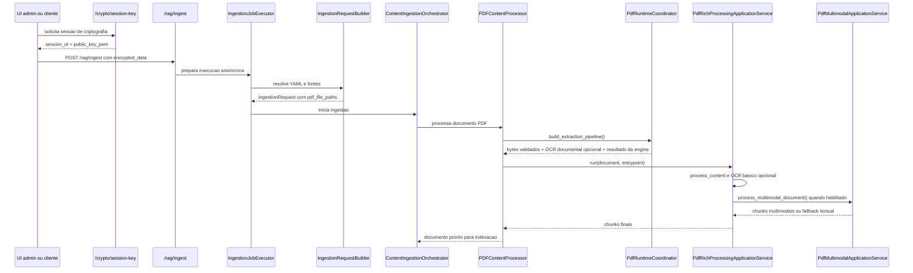
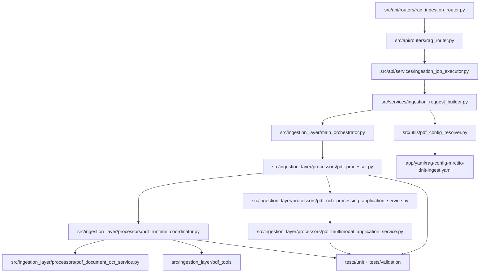

# Tutorial 101: pipeline de ingestao de PDF

Se voce acabou de chegar no projeto e abriu este arquivo pensando "onde o PDF entra, quem decide OCR, quando o texto vira chunk e onde o multimodal se mete nisso?", este tutorial foi escrito exatamente para isso. A ideia aqui nao e repetir teoria generica de PDF ou de OCR. A ideia e contar a historia real do runtime deste repositorio, usando o que esta implementado hoje.

## 2) Para quem e este tutorial

- Desenvolvedor Junior que precisa mexer no pipeline de PDF sem quebrar ingestao, OCR ou chunking.
- Pessoa de produto tecnico que quer entender por que PDF digital, PDF escaneado e PDF visualmente rico nao seguem o mesmo trilho.
- Pessoa de operacao que precisa saber onde olhar quando uma ingestao PDF falha.
- Quem leu o YAML e viu varios blocos com a palavra OCR, mas ainda nao entendeu quem faz o que.

Ao final, voce deve conseguir:

- explicar qual e a borda HTTP real do slice PDF;
- localizar onde o YAML vira contrato operacional interno;
- diferenciar OCR documental, OCR por pagina e OCR multimodal;
- seguir o fluxo real do PDF ate chunking ou multimodal;
- validar o slice com os comandos oficiais do repositorio.

## 3) Dicionario rapido

- Ingestao RAG: caminho que transforma fontes como PDF, Markdown e JSON em material indexavel para busca e resposta.
- OCR documental: reprocessamento do PDF inteiro antes do parsing principal para adicionar ou melhorar camada textual.
- OCR por pagina: OCR acionado durante o parsing quando uma pagina especifica vem pobre em texto.
- Parsing engine: leitor especializado que tenta extrair texto, sinais estruturais e, em alguns casos, tabelas do PDF.
- Chunking: quebra do texto final em pedaços menores para indexacao e recuperacao.
- Multimodal: trilho lateral que trata imagens extraidas do PDF para OCR de imagem, descricao visual e embedding visual.
- Execution manifest: resumo operacional das etapas executadas, status e artefatos do pipeline.
- Runtime snapshot PDF: consolidacao final das configs validas do bloco ingestion.content_profiles.type_specific.pdf.
- encrypted_data: payload criptografado que leva YAML e chaves para a borda HTTP.
- correlation_id: identificador logico unico da execucao usado em logs e telemetria.

## 4) Conceito em linguagem simples

Pense no pipeline de PDF como uma central de triagem de encomendas delicadas. O PDF chega na doca. Antes de qualquer coisa, alguem confirma se a caixa realmente e uma caixa valida. Depois a triagem decide se aquela encomenda inteira precisa passar por restauracao antes de abrir. So entao um especialista abre e le o conteudo principal. Se uma pagina vier ruim, um tecnico olha so aquela pagina. Se houver tabela, entra uma equipe que entende de tabela. Se houver imagem relevante, outra equipe cuida das imagens.

Traduzindo para o projeto: o sistema nao trata PDF como um unico metodo gigante. Ele encadeia decisoes pequenas e especializadas. Primeiro valida bytes. Depois pode rodar OCR documental. Depois escolhe a fila ordenada de parsing. Durante esse parsing, pode acionar OCR por pagina. Depois limpa o texto, decide se precisa de OCR basico complementar e, se o documento for visual e o multimodal estiver habilitado, abre um segundo trilho para imagens. No fim, tudo vira chunks textuais ou chunks enriquecidos.

O ponto 101 mais importante e este: a palavra OCR aparece tres vezes porque o projeto resolveu tres problemas diferentes. Um OCR melhora o documento inteiro. Outro socorre paginas ruins durante a leitura. Outro le texto dentro de imagens extraidas do PDF. Misturar esses tres papeis gera diagnostico errado e configuracao ruim.

## 5) Mapa de navegacao do repo

- [../src/api/routers](../src/api/routers) -> bordas HTTP, modelos de request/response e endpoints publicos -> mexa aqui quando a mudanca for de contrato externo.
- [../src/api/services](../src/api/services) -> preparacao de runtime, disparo assincrono e servicos HTTP -> mexa aqui quando o problema estiver entre a API e o orquestrador.
- [../src/services](../src/services) -> montagem do IngestionRequest e resolucao de fontes -> mexa aqui quando o YAML nao estiver virando lista real de PDFs.
- [../src/ingestion_layer](../src/ingestion_layer) -> orquestracao interna da ingestao -> mexa aqui quando o fluxo ja entrou no dominio de ingestao.
- [../src/ingestion_layer/processors](../src/ingestion_layer/processors) -> processador PDF, OCR documental, fluxo rico, chunking e multimodal -> este e o coracao do slice.
- [../src/ingestion_layer/pdf_tools](../src/ingestion_layer/pdf_tools) -> engines de parsing PDF e selecao ordenada -> mexa aqui quando o problema for leitura do PDF em si.
- [../src/utils/pdf_config_resolver.py](../src/utils/pdf_config_resolver.py) -> resolvedor canonico do contrato PDF no YAML -> nao espalhe leitura de chave PDF fora deste resolvedor.
- [../app/yaml](../app/yaml) -> exemplos reais de configuracao YAML -> use para aprender configuracao valida antes de criar chave nova.
- [../tests/unit/ingestion_layer](../tests/unit/ingestion_layer) -> testes unitarios do slice PDF -> mexa aqui para proteger comportamento.
- [../tests/validation](../tests/validation) -> validacoes dedicadas com PDF real -> use quando quiser prova pratica com fixture versionada.
- [../scripts/suite_de_testes_padrao.sh](../scripts/suite_de_testes_padrao.sh) -> runner oficial de validacao -> nao invente atalho proprio para declarar que o slice esta validado.
- [../app/ui/static](../app/ui/static) -> console administrativa PDF e cliente web de disparo -> mexa aqui quando a necessidade for operacional na UI, nao no core.

## 6) Mapa visual 1: fluxo macro

```mermaid
flowchart TD
    A[Cliente HTTP ou console admin PDF] --> B[/rag/ingest]
    B --> C[Preparacao async e resolucao do YAML]
    C --> D[IngestionRequestBuilder]
    D --> E[ContentIngestionOrchestrator]
    E --> F[PDFContentProcessor]
    F --> G[Pipeline de extracao]
    G --> G1[ValidatePdfBytesStage]
    G1 --> G2[ApplyDocumentOcrStage]
    G2 --> G3[ParseViaEngineStage]
    G3 --> G4[ApplyEngineResultStage]
    G4 --> H[Pipeline textual]
    H --> H1[PreserveStructureStage]
    H1 --> H2[RemoveBasicArtifactsStage]
    H2 --> H3[FixSimpleOcrArtifactsStage]
    H3 --> I{Documento pede multimodal?}
    I -- nao --> J[Chunking textual final]
    I -- sim --> K[Extracao de imagens e etapas multimodais]
    K --> L[Chunks enriquecidos e manifest]
    J --> M[Indexacao e telemetria]
    L --> M[Indexacao e telemetria]
```

## 7) Mapa visual 2: quem chama quem



## 8) Mapa visual 3: camadas

```mermaid
flowchart LR
    subgraph EntryPoints
        EP1[/rag/ingest]
        EP2[/crypto/session-key]
        EP3[Console admin PDF]
    end

    subgraph Contracts
        C1[RagIngestionRequest]
        C2[encrypted_data]
        C3[ingestion.content_profiles.type_specific.pdf]
    end

    subgraph Orchestration
        O1[IngestionJobExecutor]
        O2[IngestionRequestBuilder]
        O3[ContentIngestionOrchestrator]
    end

    subgraph GraphsAndProcessors
        G1[PDFContentProcessor]
        G2[PdfRuntimeCoordinator]
        G3[PdfRichProcessingApplicationService]
        G4[PdfMultimodalApplicationService]
    end

    subgraph ToolsAndEngines
        T1[PdfDocumentOcrService]
        T2[DeterministicLegoPdfParsingEngine]
        T3[PymupdfPdfParsingEngine]
        T4[PdfChunkingService]
    end

    subgraph DataAndTelemetry
        D1[PDF local]
        D2[Execution manifest]
        D3[Logs por correlation_id]
    end

    EP1 --> C1
    EP2 --> C2
    EP3 --> C2
    C1 --> O1
    C2 --> O1
    C3 --> O2
    O1 --> O2
    O2 --> O3
    O3 --> G1
    G1 --> G2
    G1 --> G3
    G3 --> G4
    G2 --> T1
    G2 --> T2
    T2 --> T3
    G3 --> T4
    D1 --> G1
    G4 --> D2
    O1 --> D3
    G1 --> D3
```

## 9) Mapa visual 4: componentes



### 9.1) Mapa visual 5: swimlane funcional

```mermaid
flowchart LR
    subgraph Cliente
        C1[Carrega YAML ou payload]
        C2[Solicita criptografia]
        C3[Dispara /rag/ingest]
    end

    subgraph BordaHTTP
        H1[Valida request RagIngestionRequest]
        H2[Prepara execucao assincrona]
    end

    subgraph Preparacao
        P1[Resolve YAML e chaves]
        P2[Monta IngestionRequest]
        P3[Descobre pdf_file_paths]
    end

    subgraph PipelinePDF
        PDF1[Valida bytes]
        PDF2[OCR documental opcional]
        PDF3[Parsing por engine]
        PDF4[Limpeza textual]
        PDF5[OCR basico opcional]
        PDF6[Multimodal opcional]
        PDF7[Chunking final]
    end

    subgraph Saidas
        S1[Chunks]
        S2[Execution manifest]
        S3[Logs e telemetria]
    end

    C1 --> C2 --> C3 --> H1 --> H2 --> P1 --> P2 --> P3 --> PDF1 --> PDF2 --> PDF3 --> PDF4 --> PDF5 --> PDF6 --> PDF7 --> S1
    PDF6 --> S2
    H2 --> S3
    PDF3 --> S3
    PDF6 --> S3
```



## 10) Onde isso aparece neste projeto

- A rota publica do slice e montada em [../src/api/routers/rag_ingestion_router.py](../src/api/routers/rag_ingestion_router.py).
- O contrato HTTP da ingestao vive em `RagIngestionRequest` e `RagIngestionResponse` dentro de [../src/api/routers/rag_router.py](../src/api/routers/rag_router.py).
- A preparacao assincrona que resolve YAML antes da ingestao real esta em [../src/api/services/ingestion_job_executor.py](../src/api/services/ingestion_job_executor.py).
- A traducao de YAML para `IngestionRequest` esta em [../src/services/ingestion_request_builder.py](../src/services/ingestion_request_builder.py).
- A descoberta de PDFs locais a partir do YAML passa por [../src/services/ingestion_request_source_resolvers.py](../src/services/ingestion_request_source_resolvers.py).
- O processador principal do slice e `PDFContentProcessor` em [../src/ingestion_layer/processors/pdf_processor.py](../src/ingestion_layer/processors/pdf_processor.py).
- A ordem canonica do pipeline de extracao esta em [../src/ingestion_layer/processors/pdf_runtime_coordinator.py](../src/ingestion_layer/processors/pdf_runtime_coordinator.py).
- O OCR documental mora em [../src/ingestion_layer/processors/pdf_document_ocr_service.py](../src/ingestion_layer/processors/pdf_document_ocr_service.py).
- A leitura por engine vive em [../src/ingestion_layer/pdf_tools](../src/ingestion_layer/pdf_tools), com destaque para `DeterministicLegoPdfParsingEngine` e `PymupdfPdfParsingEngine`.
- O fluxo rico que decide OCR complementar, multimodal e chunking vive em [../src/ingestion_layer/processors/pdf_rich_processing_application_service.py](../src/ingestion_layer/processors/pdf_rich_processing_application_service.py).
- O multimodal oficial do PDF vive em [../src/ingestion_layer/processors/pdf_multimodal_application_service.py](../src/ingestion_layer/processors/pdf_multimodal_application_service.py).
- O contrato YAML canonico do PDF e consolidado por [../src/utils/pdf_config_resolver.py](../src/utils/pdf_config_resolver.py).
- O exemplo YAML mais rico do slice esta em [../app/yaml/rag-config-mrctito-dnit-ingest.yaml](../app/yaml/rag-config-mrctito-dnit-ingest.yaml).
- A console administrativa PDF que dispara o endpoint existe em [../app/ui/static/ui-admin-plataforma-ingestao-pdf.html](../app/ui/static/ui-admin-plataforma-ingestao-pdf.html) e [../app/ui/static/js/admin-ingestao-pdf.js](../app/ui/static/js/admin-ingestao-pdf.js).

## 11) Caminho real no codigo

- [../src/api/routers/rag_ingestion_router.py](../src/api/routers/rag_ingestion_router.py) -> registra `POST /rag/ingest`.
- [../src/api/routers/rag_router.py](../src/api/routers/rag_router.py) -> define `RagIngestionRequest`, `ingest_content_endpoint` e a borda HTTP real do fluxo.
- [../src/api/services/ingestion_job_executor.py](../src/api/services/ingestion_job_executor.py) -> resolve YAML e agenda a execucao assincrona.
- [../src/services/ingestion_request_builder.py](../src/services/ingestion_request_builder.py) -> monta `IngestionRequest` com `pdf_file_paths`.
- [../src/ingestion_layer/local_content_family.py](../src/ingestion_layer/local_content_family.py) -> encaminha PDF local para o processador certo.
- [../src/ingestion_layer/processors/pdf_processor.py](../src/ingestion_layer/processors/pdf_processor.py) -> expone `process_document`, `process_content` e `create_chunks`.
- [../src/ingestion_layer/processors/pdf_document_processing_application_service.py](../src/ingestion_layer/processors/pdf_document_processing_application_service.py) -> fronteira de servico para processamento do documento.
- [../src/ingestion_layer/processors/pdf_runtime_coordinator.py](../src/ingestion_layer/processors/pdf_runtime_coordinator.py) -> define a ordem do pipeline de extracao e do pipeline textual.
- [../src/ingestion_layer/processors/pdf_document_ocr_service.py](../src/ingestion_layer/processors/pdf_document_ocr_service.py) -> decide e aplica OCR documental.
- [../src/ingestion_layer/processors/pdf_extraction_application_service.py](../src/ingestion_layer/processors/pdf_extraction_application_service.py) -> coordena extracao textual e consolidacao de metadados.
- [../src/ingestion_layer/pdf_tools/deterministic_lego_pdf_parsing_engine.py](../src/ingestion_layer/pdf_tools/deterministic_lego_pdf_parsing_engine.py) -> respeita a ordem da fila de engines definida no YAML.
- [../src/ingestion_layer/pdf_tools/pymupdf_pdf_parsing_engine.py](../src/ingestion_layer/pdf_tools/pymupdf_pdf_parsing_engine.py) -> exemplo claro de OCR por pagina durante parsing e extracao de tabelas.
- [../src/ingestion_layer/processors/pdf_rich_processing_application_service.py](../src/ingestion_layer/processors/pdf_rich_processing_application_service.py) -> decide OCR basico complementar, multimodal e chunking.
- [../src/ingestion_layer/processors/pdf_multimodal_application_service.py](../src/ingestion_layer/processors/pdf_multimodal_application_service.py) -> executa o ramo multimodal e persiste status.
- [../src/utils/pdf_config_resolver.py](../src/utils/pdf_config_resolver.py) -> valida e resolve `ingestion.content_profiles.type_specific.pdf`.

## 12) Fluxo passo a passo: o que acontece de verdade

1. A entrada publica do slice nao e um upload PDF dedicado. O contrato real entra por `POST /rag/ingest`, registrado em [../src/api/routers/rag_ingestion_router.py](../src/api/routers/rag_ingestion_router.py) e modelado em [../src/api/routers/rag_router.py](../src/api/routers/rag_router.py).
2. A request HTTP leva `encrypted_data`, `user_email`, `execution_mode` e `document_parallelism`. Em termos praticos, a API nao recebe "meu arquivo PDF" como campo principal. Ela recebe um payload criptografado com YAML e chaves.
3. O servico de preparacao assincrona resolve o YAML antes de chamar o pipeline interno, em [../src/api/services/ingestion_job_executor.py](../src/api/services/ingestion_job_executor.py).
4. `IngestionRequestBuilder.build()` traduz a secao `ingestion` do YAML em um `IngestionRequest` com listas reais de fontes, inclusive `pdf_file_paths`, em [../src/services/ingestion_request_builder.py](../src/services/ingestion_request_builder.py).
5. Os PDFs locais nascem do YAML, especialmente de `ingestion.local_files.discovery_patterns.include` e de `ingestion.sources` quando a origem e local, em [../src/services/ingestion_request_source_resolvers.py](../src/services/ingestion_request_source_resolvers.py) e no exemplo [../app/yaml/rag-config-mrctito-dnit-ingest.yaml](../app/yaml/rag-config-mrctito-dnit-ingest.yaml).
6. O orquestrador interno encaminha o documento PDF local para o processador correto, com `source_system=pdf_local`, no fluxo de [../src/ingestion_layer/local_content_family.py](../src/ingestion_layer/local_content_family.py).
7. O nucleo do slice e `PDFContentProcessor`, em [../src/ingestion_layer/processors/pdf_processor.py](../src/ingestion_layer/processors/pdf_processor.py). E aqui que o documento entra no processamento PDF oficial.
8. A ordem real do pipeline de extracao esta explicita em `build_extraction_pipeline()` dentro de [../src/ingestion_layer/processors/pdf_runtime_coordinator.py](../src/ingestion_layer/processors/pdf_runtime_coordinator.py): `ValidatePdfBytesStage`, `ApplyDocumentOcrStage`, `ParseViaEngineStage` e `ApplyEngineResultStage`.
9. O OCR documental do arquivo inteiro roda em `PdfDocumentOcrService.maybe_preprocess_pdf()` em [../src/ingestion_layer/processors/pdf_document_ocr_service.py](../src/ingestion_layer/processors/pdf_document_ocr_service.py). Ele tenta responder: "vale a pena regravar o PDF todo antes de parsear?"
10. O parsing textual principal roda por engine em [../src/ingestion_layer/processors/pdf_extraction_application_service.py](../src/ingestion_layer/processors/pdf_extraction_application_service.py) e nas engines de [../src/ingestion_layer/pdf_tools](../src/ingestion_layer/pdf_tools). A selecao respeita a ordem declarada no YAML.
11. OCR por pagina nao e uma etapa global separada apos o parsing. No desenho mais claro do projeto, ele vive dentro da engine de parsing, por exemplo em [../src/ingestion_layer/pdf_tools/pymupdf_pdf_parsing_engine.py](../src/ingestion_layer/pdf_tools/pymupdf_pdf_parsing_engine.py).
12. O pipeline textual pos-extracao roda em `build_text_processing_pipeline()` de [../src/ingestion_layer/processors/pdf_runtime_coordinator.py](../src/ingestion_layer/processors/pdf_runtime_coordinator.py), com preservacao de estrutura, limpeza de artefatos basicos e reparo simples de OCR.
13. O fluxo rico em [../src/ingestion_layer/processors/pdf_rich_processing_application_service.py](../src/ingestion_layer/processors/pdf_rich_processing_application_service.py) resolve o texto-base, processa o conteudo, decide OCR basico complementar, reprocessa se necessario e depois decide se abre ou nao o ramo multimodal.
14. Se o multimodal estiver desligado ou o documento nao for visual, o fluxo fecha em `create_chunks()` do processador PDF, apoiado por [../src/ingestion_layer/processors/pdf_chunking_service.py](../src/ingestion_layer/processors/pdf_chunking_service.py).
15. Se o multimodal estiver habilitado e houver fonte visual valida, o fluxo lateral entra em [../src/ingestion_layer/processors/pdf_multimodal_application_service.py](../src/ingestion_layer/processors/pdf_multimodal_application_service.py), passando por extracao de imagens, OCR multimodal, descricao visual e embedding visual conforme o manifesto operacional.

### Com a config ativa

- Se `ingestion.content_profiles.type_specific.pdf.enabled` estiver true, o profile PDF participa da ingestao.
- Se `processing.ocr.document_preprocessing.enabled` estiver true, o runtime pode regravar o PDF inteiro com OCR documental.
- Se `processing.ocr.enabled` estiver true, as engines podem acionar OCR por pagina.
- Se `multimodal.enabled` e `image_extraction.enabled` estiverem true, o ramo multimodal pode entrar.

### No estado atual do YAML exemplo DNIT

- O profile PDF esta ligado em [../app/yaml/rag-config-mrctito-dnit-ingest.yaml](../app/yaml/rag-config-mrctito-dnit-ingest.yaml).
- O OCR documental esta configurado, mas desabilitado no exemplo DNIT.
- O OCR por pagina esta ligado.
- A esteira de tabelas esta ligada.
- O multimodal esta ligado, com `image_extraction`, `ocr` e `image_description` ativos, e `vision_embedding` desligado.

## 13) Status: esta pronto? quanto esta pronto?

| Area | Evidencia | Status | Impacto pratico | Proximo passo minimo |
| --- | --- | --- | --- | --- |
| Borda HTTP de ingestao | [../src/api/routers/rag_ingestion_router.py](../src/api/routers/rag_ingestion_router.py), [../src/api/routers/rag_router.py](../src/api/routers/rag_router.py) | pronto | Existe ponto de entrada canonico e assincrono | Manter contrato protegido por testes de API |
| Montagem do request interno | [../src/services/ingestion_request_builder.py](../src/services/ingestion_request_builder.py) | pronto | O YAML vira `pdf_file_paths` de forma explicita | Preservar contrato ao adicionar novas fontes |
| Contrato YAML do PDF | [../src/utils/pdf_config_resolver.py](../src/utils/pdf_config_resolver.py), [../app/yaml/rag-config-mrctito-dnit-ingest.yaml](../app/yaml/rag-config-mrctito-dnit-ingest.yaml) | pronto | Ha caminho canonico unico para config PDF | Evitar chaves paralelas fora do resolvedor |
| Pipeline de extracao | [../src/ingestion_layer/processors/pdf_runtime_coordinator.py](../src/ingestion_layer/processors/pdf_runtime_coordinator.py) | pronto | A ordem das etapas principais esta explicita | Proteger qualquer mudanca de ordem com teste |
| OCR documental | [../src/ingestion_layer/processors/pdf_document_ocr_service.py](../src/ingestion_layer/processors/pdf_document_ocr_service.py), [../tests/unit/ingestion_layer/test_pdf_document_ocr_service.py](../tests/unit/ingestion_layer/test_pdf_document_ocr_service.py) | pronto | O projeto distingue bem quando reprocessar o PDF inteiro | Validar sempre com fixture real ao mexer |
| OCR por pagina durante parsing | [../src/ingestion_layer/pdf_tools/pymupdf_pdf_parsing_engine.py](../src/ingestion_layer/pdf_tools/pymupdf_pdf_parsing_engine.py) | pronto | O sistema socorre paginas ruins sem regravar o documento todo | Garantir que novas engines respeitem o mesmo contrato |
| Chunking textual final | [../src/ingestion_layer/processors/pdf_chunking_service.py](../src/ingestion_layer/processors/pdf_chunking_service.py) | pronto | O texto final ja sai quebrado para indexacao | Revalidar estrategia ao mexer em limpeza textual |
| Multimodal PDF | [../src/ingestion_layer/processors/pdf_multimodal_application_service.py](../src/ingestion_layer/processors/pdf_multimodal_application_service.py), [../tests/unit/ingestion_layer/processors/test_pdf_multimodal_application_service.py](../tests/unit/ingestion_layer/processors/test_pdf_multimodal_application_service.py) | parcial | O ramo existe e tem fallback textual, mas depende fortemente de flags e engines externas | Rodar validacao dedicada com PDF real para cada mudanca |
| Validacao com PDF real | [../tests/validation/test_pdf_real_engine_matrix.py](../tests/validation/test_pdf_real_engine_matrix.py), [../scripts/suite_de_testes_padrao.sh](../scripts/suite_de_testes_padrao.sh) | pronto | Ha prova real dedicada fora dos gates comuns | Incluir essa rodada no fechamento de mudancas PDF |
| Upload PDF direto no body HTTP | Nao encontrado no codigo como caminho canonico | ausente | Quem assumir upload simples vai documentar o sistema errado | Se isso for requisito, criar contrato novo explicitamente |
| Cliente CLI versionado para montar `encrypted_data` e chamar `/rag/ingest` | Helpers em [../src/security/payload_crypto.py](../src/security/payload_crypto.py) e UI em [../app/ui/static/js/admin-ingestao-pdf.js](../app/ui/static/js/admin-ingestao-pdf.js) | parcial | Existe como montar o payload, mas nao encontrei um CLI pronto e versionado so para esse fluxo | Criar cliente exemplo oficial se o time quiser disparo fora da UI |

## 14) Como colocar para funcionar: hands-on end-to-end

### Passo 0: leia o contrato oficial de testes antes de qualquer validacao

Antes de rodar qualquer teste, leia o cabecalho de [../scripts/suite_de_testes_padrao.sh](../scripts/suite_de_testes_padrao.sh). E ali que o repositorio define retomada, telemetria, modos de execucao e onde ler erros. Se der `Permission denied` ou `Access denied`, o proprio contrato do projeto manda executar `chmod +x ./scripts/suite_de_testes_padrao.sh` e repetir a chamada.

### Passo 1: confirme o ambiente minimo

- A validacao oficial deve sempre usar `.venv`.
- A porta da API vem de `FASTAPI_PORT`, exigida em [../src/config/config_api/system_config_manager.py](../src/config/config_api/system_config_manager.py).
- O healthcheck publico esta em [../src/api/service_api.py](../src/api/service_api.py).

### Passo 2: suba a API local

- Comando versionado: `source .venv/bin/activate && ./run.sh +a`
- Evidencia do launcher: [../run.sh](../run.sh)
- O que eu espero ver: uvicorn/API subindo sem erro e a rota `/health` respondendo.

### Passo 3: valide que a API realmente subiu

- Comando: `curl http://127.0.0.1:$FASTAPI_PORT/health`
- Evidencia do endpoint: [../src/api/service_api.py](../src/api/service_api.py)
- O que eu espero ver: status healthy, timestamp e versao.

Se a porta ficar presa depois de varias subidas e descidas, o procedimento operacional do projeto e: `sudo fuser -k <porta>/tcp`, depois `sudo lsof -i :<porta>`, e so depois subir a API de novo.

### Passo 4: escolha o caminho mais curto para provar o slice PDF

Para ciclo rapido local, use o runner oficial em modo focado:

- Comando: `source .venv/bin/activate && ./scripts/suite_de_testes_padrao.sh --focus-paths tests/unit/ingestion_layer/processors/test_pdf_content_processor.py,tests/unit/ingestion_layer/processors/test_pdf_extraction_application_service.py,tests/unit/ingestion_layer/processors/test_pdf_rich_processing_application_service.py,tests/unit/ingestion_layer/processors/test_pdf_chunking_service.py,tests/unit/ingestion_layer/processors/test_pdf_multimodal_application_service.py,tests/unit/ingestion_layer/test_pdf_document_ocr_service.py,tests/unit/ingestion_layer/test_pdf_parsing_engine_wiring.py`
- Evidencia do modo: [../scripts/suite_de_testes_padrao.sh](../scripts/suite_de_testes_padrao.sh)
- O que eu espero ver: rodada focada terminando sem falhas para o slice.

### Passo 5: rode a validacao dedicada de PDF real

- Fixture real versionada do repositorio: [../app/ingestion_data/pdf/CADERNO_BIM_DER2025_2EDICAO.pdf](../app/ingestion_data/pdf/CADERNO_BIM_DER2025_2EDICAO.pdf)
- Comando para testes dedicados com PDF real versionado: `source .venv/bin/activate && ./scripts/suite_de_testes_padrao.sh --with-pdf-real-fixture`
- Comando para matriz dedicada de engines PDF: `source .venv/bin/activate && ./scripts/suite_de_testes_padrao.sh --with-pdf-engine-matrix app/ingestion_data/pdf/CADERNO_BIM_DER2025_2EDICAO.pdf`
- Alias legado suportado pelo script: `--with-local-pdf-ocr`

### Passo 6: use os gates certos no momento certo

- Gate backend hermetico intermediario: `source .venv/bin/activate && ./scripts/suite_de_testes_padrao.sh --final-gate`
- Leitura operacional compacta: `source .venv/bin/activate && ./scripts/suite_de_testes_padrao.sh --status-repo`
- Fechamento amplo oficial: `source .venv/bin/activate && ./scripts/suite_de_testes_padrao.sh --all-tests`
- Depois do fechamento amplo, o proprio contrato do projeto pede mais uma chamada de leitura operacional: `source .venv/bin/activate && ./scripts/suite_de_testes_padrao.sh --status-repo`

Depois de cada rodada, leia a telemetria e os logs persistidos. O repositorio explicitamente proibe declarar sucesso olhando so para o retorno curto do terminal.

### Passo 7: se voce quiser disparar a ingestao HTTP real

O caminho comprovado no codigo e este:

1. Solicitar uma sessao de criptografia em `/crypto/session-key`, definida em [../src/api/routers/crypto_router.py](../src/api/routers/crypto_router.py).
2. Montar o payload `encrypted_data` com os helpers de [../src/security/payload_crypto.py](../src/security/payload_crypto.py).
3. Chamar `POST /rag/ingest` com `encrypted_data`, `user_email`, `execution_mode` e `document_parallelism`.

Cliente versionado encontrado no repositorio:

- Console administrativa PDF em [../app/ui/static/ui-admin-plataforma-ingestao-pdf.html](../app/ui/static/ui-admin-plataforma-ingestao-pdf.html)
- Cliente JS em [../app/ui/static/js/admin-ingestao-pdf.js](../app/ui/static/js/admin-ingestao-pdf.js)

Nao encontrei, no escopo analisado, um CLI de linha de comando dedicado e pronto so para este fluxo PDF. Entao, hoje, o menor caminho comprovado para rodar de ponta a ponta sem escrever cliente novo e usar a UI administrativa ou reaproveitar os helpers de criptografia.

## 15) ELI5: onde coloco cada parte da feature neste projeto?

| Pergunta | Resposta | Camada | Onde no repo |
| --- | --- | --- | --- |
| Quero mudar o corpo do endpoint de ingestao PDF | Isso e borda HTTP, nao e core PDF | entrada | [../src/api/routers/rag_router.py](../src/api/routers/rag_router.py) |
| Quero que o YAML descubra mais PDFs locais | Isso e resolucao de fontes | contratos e preparacao | [../src/services/ingestion_request_source_resolvers.py](../src/services/ingestion_request_source_resolvers.py) |
| Quero trocar a ordem das parsing engines | Isso e configuracao PDF + selecao ordenada | contratos e engines | [../src/utils/pdf_config_resolver.py](../src/utils/pdf_config_resolver.py), [../src/ingestion_layer/pdf_tools](../src/ingestion_layer/pdf_tools) |
| Quero mudar a heuristica de OCR documental | Isso e regra do preprocessamento do documento inteiro | dominio PDF | [../src/ingestion_layer/processors/pdf_document_ocr_service.py](../src/ingestion_layer/processors/pdf_document_ocr_service.py) |
| Quero mudar chunk_size ou overlap | Isso nasce no YAML e e consumido pelo runtime snapshot | contratos e chunking | [../app/yaml](../app/yaml), [../src/utils/pdf_config_resolver.py](../src/utils/pdf_config_resolver.py), [../src/ingestion_layer/processors/pdf_chunking_service.py](../src/ingestion_layer/processors/pdf_chunking_service.py) |
| Quero mudar o fallback multimodal para texto | Isso e comportamento do servico multimodal | dominio PDF | [../src/ingestion_layer/processors/pdf_multimodal_application_service.py](../src/ingestion_layer/processors/pdf_multimodal_application_service.py) |
| Quero ajustar o cliente web que dispara a ingestao | Isso e UI administrativa, nao e core | frontend | [../app/ui/static/js/admin-ingestao-pdf.js](../app/ui/static/js/admin-ingestao-pdf.js) |
| Quero proteger uma mudanca com teste | Os testes do slice ja estao separados por responsabilidade | testes | [../tests/unit/ingestion_layer](../tests/unit/ingestion_layer), [../tests/validation](../tests/validation) |

## 16) Template de mudanca

### 1) Entrada: qual endpoint ou job dispara?

- Endpoint principal: `POST /rag/ingest`
- Paths: [../src/api/routers/rag_ingestion_router.py](../src/api/routers/rag_ingestion_router.py), [../src/api/routers/rag_router.py](../src/api/routers/rag_router.py)
- Contrato de entrada: `RagIngestionRequest`

### 2) Config: qual YAML ou env controla?

- Chave principal: `ingestion.content_profiles.type_specific.pdf`
- Origem real: [../app/yaml/rag-config-mrctito-dnit-ingest.yaml](../app/yaml/rag-config-mrctito-dnit-ingest.yaml)
- Onde e lido: [../src/utils/pdf_config_resolver.py](../src/utils/pdf_config_resolver.py)

### 3) Execucao: qual fluxo entra?

- Builder de runtime: [../src/ingestion_layer/processors/pdf_runtime_coordinator.py](../src/ingestion_layer/processors/pdf_runtime_coordinator.py)
- Processador principal: [../src/ingestion_layer/processors/pdf_processor.py](../src/ingestion_layer/processors/pdf_processor.py)
- Estado operacional: metadados do documento + execution manifest

### 4) Ferramentas: quais engines e servicos entram?

- OCR documental: [../src/ingestion_layer/processors/pdf_document_ocr_service.py](../src/ingestion_layer/processors/pdf_document_ocr_service.py)
- Parsing engines: [../src/ingestion_layer/pdf_tools](../src/ingestion_layer/pdf_tools)
- Multimodal: [../src/ingestion_layer/processors/pdf_multimodal_application_service.py](../src/ingestion_layer/processors/pdf_multimodal_application_service.py)

### 5) Dados: onde persiste, cacheia ou indexa?

- MySQL: nao foi o foco deste tutorial; nao mapeado em detalhe neste escopo.
- Redis: nao foi o foco deste tutorial; nao mapeado em detalhe neste escopo.
- Artefatos PDF de runtime: manifest e metadados do documento sao atualizados no proprio fluxo de processamento.

### 6) Observabilidade: onde loga?

- Preparacao HTTP: [../src/api/services/ingestion_job_executor.py](../src/api/services/ingestion_job_executor.py)
- OCR documental, extracao e multimodal: arquivos em [../src/ingestion_layer/processors](../src/ingestion_layer/processors)
- correlation_id: propagado como identificador logico unico

### 7) Testes: onde validar?

- Unitarios: [../tests/unit/ingestion_layer](../tests/unit/ingestion_layer)
- Validacao com PDF real: [../tests/validation/test_pdf_real_engine_matrix.py](../tests/validation/test_pdf_real_engine_matrix.py)

## 17) CUIDADO: o que NAO fazer

- Nao coloque regra de OCR documental no orquestrador geral. Isso quebra o isolamento do slice e recria acoplamento por nome de engine.
- Nao trate todo OCR como se fosse a mesma etapa. Voce vai alterar a fila errada e diagnosticar o problema errado.
- Nao leia `ingestion.content_profiles.type_specific.pdf` espalhando acesso direto pelo codigo. O resolvedor canonico ja existe em [../src/utils/pdf_config_resolver.py](../src/utils/pdf_config_resolver.py).
- Nao documente o sistema como se houvesse upload direto de PDF no body HTTP. O caminho canonico analisado e `encrypted_data` em `/rag/ingest`.
- Nao pule a validacao dedicada com PDF real quando mexer em parsing, OCR ou multimodal. O gate comum nao substitui essa prova.

## 18) Anti-exemplos

1. Erro comum: fazer parsing do YAML dentro do endpoint.
Por que e ruim: mistura borda HTTP com regra de preparacao e torna o contrato menos testavel.
Correcao: deixe a preparacao com [../src/api/services/ingestion_job_executor.py](../src/api/services/ingestion_job_executor.py) e [../src/services/ingestion_request_builder.py](../src/services/ingestion_request_builder.py).

2. Erro comum: tratar OCR por pagina como etapa global depois do parsing.
Por que e ruim: o desenho real do projeto o acopla a engines especificas, como PyMuPDF.
Correcao: ajuste a engine e a configuracao de OCR por pagina em [../src/ingestion_layer/pdf_tools](../src/ingestion_layer/pdf_tools).

3. Erro comum: acessar config PDF direto do YAML bruto em qualquer classe.
Por que e ruim: cria contrato paralelo e aumenta a chance de chave morta.
Correcao: use [../src/utils/pdf_config_resolver.py](../src/utils/pdf_config_resolver.py).

4. Erro comum: colocar fallback textual do multimodal dentro do processador de chunking.
Por que e ruim: o fallback multimodal pertence ao servico multimodal e ao seu status operacional.
Correcao: mantenha essa decisao em [../src/ingestion_layer/processors/pdf_multimodal_application_service.py](../src/ingestion_layer/processors/pdf_multimodal_application_service.py).

## 19) Exemplos guiados

### Exemplo 1: quero entender por que o OCR documental nao rodou

- Comece pelo YAML em [../app/yaml/rag-config-mrctito-dnit-ingest.yaml](../app/yaml/rag-config-mrctito-dnit-ingest.yaml) e confirme se `document_preprocessing.enabled` esta ligado.
- Depois leia [../src/ingestion_layer/processors/pdf_document_ocr_service.py](../src/ingestion_layer/processors/pdf_document_ocr_service.py) para ver a decisao `maybe_preprocess_pdf()`.
- Feche com os testes em [../tests/unit/ingestion_layer/test_pdf_document_ocr_service.py](../tests/unit/ingestion_layer/test_pdf_document_ocr_service.py) para ver os cenarios `disabled`, `sufficient_native_text` e `applied`.

### Exemplo 2: quero trocar a ordem das parsing engines

- Veja a fila real no bloco `processing.parsing.base.options` em [../app/yaml/rag-config-mrctito-dnit-ingest.yaml](../app/yaml/rag-config-mrctito-dnit-ingest.yaml).
- Veja o resolvedor canonico em [../src/utils/pdf_config_resolver.py](../src/utils/pdf_config_resolver.py).
- Veja quem respeita a ordem em [../src/ingestion_layer/pdf_tools/deterministic_lego_pdf_parsing_engine.py](../src/ingestion_layer/pdf_tools/deterministic_lego_pdf_parsing_engine.py).
- Proteja a mudanca com [../tests/unit/ingestion_layer/test_pdf_parsing_engine_wiring.py](../tests/unit/ingestion_layer/test_pdf_parsing_engine_wiring.py).

### Exemplo 3: quero entender por que o multimodal caiu para texto

- Leia a decisao `should_run_multimodal()` e o fluxo `process_multimodal_document()` em [../src/ingestion_layer/processors/pdf_multimodal_application_service.py](../src/ingestion_layer/processors/pdf_multimodal_application_service.py).
- Compare com o chamador de alto nivel em [../src/ingestion_layer/processors/pdf_rich_processing_application_service.py](../src/ingestion_layer/processors/pdf_rich_processing_application_service.py).
- Veja os testes de fallback textual em [../tests/unit/ingestion_layer/processors/test_pdf_multimodal_application_service.py](../tests/unit/ingestion_layer/processors/test_pdf_multimodal_application_service.py).

## 20) Erros comuns e como reconhecer

1. Sintoma observavel: a API aceita a chamada, mas nenhum PDF entra no slice.
Hipotese: o YAML nao gerou `pdf_file_paths` reais.
Como confirmar: leia [../src/services/ingestion_request_builder.py](../src/services/ingestion_request_builder.py) e [../src/services/ingestion_request_source_resolvers.py](../src/services/ingestion_request_source_resolvers.py), procurando `pdf_file_paths` e `resolve_local_files`.
Correcao segura: ajuste a fonte no YAML ou no resolvedor de fontes, nao no processador PDF.

2. Sintoma observavel: o documento passa pelo parser, mas continua sem texto util.
Hipotese: OCR documental desligado ou heuristica decidiu `skipped_not_needed`.
Como confirmar: veja a regra em [../src/ingestion_layer/processors/pdf_document_ocr_service.py](../src/ingestion_layer/processors/pdf_document_ocr_service.py) e reproduza com [../tests/unit/ingestion_layer/test_pdf_document_ocr_service.py](../tests/unit/ingestion_layer/test_pdf_document_ocr_service.py).
Correcao segura: ajuste config ou heuristica do OCR documental; nao injete OCR forcado no orquestrador.

3. Sintoma observavel: uma pagina ruim continua ruim mesmo com OCR habilitado.
Hipotese: a engine escolhida nao esta acionando OCR por pagina naquele caminho.
Como confirmar: leia [../src/ingestion_layer/pdf_tools/pymupdf_pdf_parsing_engine.py](../src/ingestion_layer/pdf_tools/pymupdf_pdf_parsing_engine.py) e confira a fila ativa no YAML.
Correcao segura: ajuste a ordem de engines ou a config de OCR por pagina, e cubra com teste de wiring.

4. Sintoma observavel: o multimodal nao roda e o resultado volta como texto simples.
Hipotese: `multimodal.enabled` esta desligado, o documento nao foi considerado visual ou nao houve fonte visual resolvida.
Como confirmar: leia [../src/ingestion_layer/processors/pdf_multimodal_application_service.py](../src/ingestion_layer/processors/pdf_multimodal_application_service.py) e os testes em [../tests/unit/ingestion_layer/processors/test_pdf_multimodal_application_service.py](../tests/unit/ingestion_layer/processors/test_pdf_multimodal_application_service.py).
Correcao segura: habilite as flags certas ou corrija a resolucao da fonte visual; nao force chunks multimodais sem artefato visual.

5. Sintoma observavel: a documentacao interna fala em upload direto de PDF, mas a chamada real falha.
Hipotese: a narrativa esta errada; o contrato real usa `encrypted_data`.
Como confirmar: releia [../src/api/routers/rag_router.py](../src/api/routers/rag_router.py) e [../src/security/payload_crypto.py](../src/security/payload_crypto.py).
Correcao segura: alinhe cliente e documentacao ao contrato real.

6. Sintoma observavel: os testes comuns passam, mas a mudanca quebra PDF real.
Hipotese: a mudanca tocou parsing, OCR ou multimodal e ficou sem validacao dedicada.
Como confirmar: rode [../scripts/suite_de_testes_padrao.sh](../scripts/suite_de_testes_padrao.sh) com `--with-pdf-real-fixture` e `--with-pdf-engine-matrix`.
Correcao segura: trate o runner dedicado como obrigatorio para mudancas de PDF.

## 21) Exercicios guiados

### Exercicio 1

Objetivo: localizar onde a ordem do pipeline de extracao PDF e definida.
Passos: abra [../src/ingestion_layer/processors/pdf_runtime_coordinator.py](../src/ingestion_layer/processors/pdf_runtime_coordinator.py) e encontre `build_extraction_pipeline()`.
Como verificar no codigo: confirme que existem exatamente quatro etapas em sequencia.
Gabarito: `ValidatePdfBytesStage -> ApplyDocumentOcrStage -> ParseViaEngineStage -> ApplyEngineResultStage`.

### Exercicio 2

Objetivo: descobrir onde o OCR documental esta desligado no exemplo DNIT.
Passos: abra [../app/yaml/rag-config-mrctito-dnit-ingest.yaml](../app/yaml/rag-config-mrctito-dnit-ingest.yaml) e procure `document_preprocessing`.
Como verificar no codigo: confirme que `enabled` esta false nesse bloco.
Gabarito: o YAML DNIT mostra o OCR documental configurado, mas desabilitado por padrao nesse profile.

### Exercicio 3

Objetivo: entender quando o multimodal faz fallback para texto.
Passos: abra [../src/ingestion_layer/processors/pdf_multimodal_application_service.py](../src/ingestion_layer/processors/pdf_multimodal_application_service.py) e depois [../tests/unit/ingestion_layer/processors/test_pdf_multimodal_application_service.py](../tests/unit/ingestion_layer/processors/test_pdf_multimodal_application_service.py).
Como verificar no codigo: procure o teste que persiste `multimodal_status=disabled` e `fallback_to_text=True`.
Gabarito: quando o servico multimodal esta desligado, o pipeline persiste status e retorna chunk textual de fallback.

## 22) Checklist final

- Confirmei que a borda real do slice e `POST /rag/ingest`.
- Confirmei que o contrato HTTP usa `encrypted_data`, nao upload PDF simples.
- Confirmei onde `pdf_file_paths` e montado.
- Confirmei o caminho canonico do YAML PDF em `ingestion.content_profiles.type_specific.pdf`.
- Sei diferenciar OCR documental, OCR por pagina e OCR multimodal.
- Sei em que arquivo a ordem do pipeline de extracao e definida.
- Sei em que arquivo a ordem das parsing engines e respeitada.
- Sei onde o chunking final acontece.
- Sei onde o fallback multimodal para texto e decidido.
- Sei qual YAML exemplo usar para estudar o slice.
- Sei quais testes unitarios cobrem o slice.
- Sei quais validacoes com PDF real existem no runner oficial.
- Sei que `--all-tests` nao substitui a rodada dedicada de PDF real.
- Sei como subir a API e validar `/health`.

## 23) Checklist de PR quando mexer nisso

- A mudanca manteve `POST /rag/ingest` alinhado com `RagIngestionRequest` em [../src/api/routers/rag_router.py](../src/api/routers/rag_router.py).
- Nenhuma chave PDF foi lida por atalho fora de [../src/utils/pdf_config_resolver.py](../src/utils/pdf_config_resolver.py).
- Mudancas de OCR documental vieram com teste em [../tests/unit/ingestion_layer/test_pdf_document_ocr_service.py](../tests/unit/ingestion_layer/test_pdf_document_ocr_service.py).
- Mudancas de parsing vieram com teste de wiring em [../tests/unit/ingestion_layer/test_pdf_parsing_engine_wiring.py](../tests/unit/ingestion_layer/test_pdf_parsing_engine_wiring.py).
- Mudancas no fluxo rico vieram com teste em [../tests/unit/ingestion_layer/processors/test_pdf_rich_processing_application_service.py](../tests/unit/ingestion_layer/processors/test_pdf_rich_processing_application_service.py).
- Mudancas no multimodal vieram com teste em [../tests/unit/ingestion_layer/processors/test_pdf_multimodal_application_service.py](../tests/unit/ingestion_layer/processors/test_pdf_multimodal_application_service.py).
- O runner oficial foi usado com `--focus-paths` no ciclo rapido.
- O runner oficial foi usado com `--with-pdf-real-fixture` ou `--with-pdf-engine-matrix` quando a mudanca tocou PDF real, OCR ou multimodal.
- O fechamento usou `--all-tests` seguido de `--status-repo` quando aplicavel.
- Os logs e a telemetria da suite foram lidos antes de declarar sucesso.

## 24) Referencias

### Referencias internas

- [../src/api/routers/rag_ingestion_router.py](../src/api/routers/rag_ingestion_router.py)
- [../src/api/routers/rag_router.py](../src/api/routers/rag_router.py)
- [../src/api/services/ingestion_job_executor.py](../src/api/services/ingestion_job_executor.py)
- [../src/services/ingestion_request_builder.py](../src/services/ingestion_request_builder.py)
- [../src/ingestion_layer/processors/pdf_processor.py](../src/ingestion_layer/processors/pdf_processor.py)
- [../src/ingestion_layer/processors/pdf_runtime_coordinator.py](../src/ingestion_layer/processors/pdf_runtime_coordinator.py)
- [../src/ingestion_layer/processors/pdf_document_ocr_service.py](../src/ingestion_layer/processors/pdf_document_ocr_service.py)
- [../src/ingestion_layer/processors/pdf_extraction_application_service.py](../src/ingestion_layer/processors/pdf_extraction_application_service.py)
- [../src/ingestion_layer/processors/pdf_rich_processing_application_service.py](../src/ingestion_layer/processors/pdf_rich_processing_application_service.py)
- [../src/ingestion_layer/processors/pdf_multimodal_application_service.py](../src/ingestion_layer/processors/pdf_multimodal_application_service.py)
- [../src/ingestion_layer/pdf_tools](../src/ingestion_layer/pdf_tools)
- [../src/utils/pdf_config_resolver.py](../src/utils/pdf_config_resolver.py)
- [../app/yaml/rag-config-mrctito-dnit-ingest.yaml](../app/yaml/rag-config-mrctito-dnit-ingest.yaml)
- [../scripts/suite_de_testes_padrao.sh](../scripts/suite_de_testes_padrao.sh)
- [../docs/README-TESTS.MD](../docs/README-TESTS.MD)
- [../tests/unit/ingestion_layer](../tests/unit/ingestion_layer)
- [../tests/validation/test_pdf_real_engine_matrix.py](../tests/validation/test_pdf_real_engine_matrix.py)

### Referencias externas consultadas

- [OCRmyPDF documentation - Introduction](https://ocrmypdf.readthedocs.io/en/latest/introduction.html) -> referencia normativa para o papel de OCR documental sobre PDFs escaneados e camada textual pesquisavel.
- [PyMuPDF documentation - Text recipes](https://pymupdf.readthedocs.io/en/latest/recipes-text.html) -> referencia normativa para extracao de texto, ordem de leitura e tabelas no ecossistema PyMuPDF.
- [FastAPI documentation - Custom Response and StreamingResponse](https://fastapi.tiangolo.com/advanced/custom-response/) -> referencia normativa para respostas e streaming na borda HTTP.
