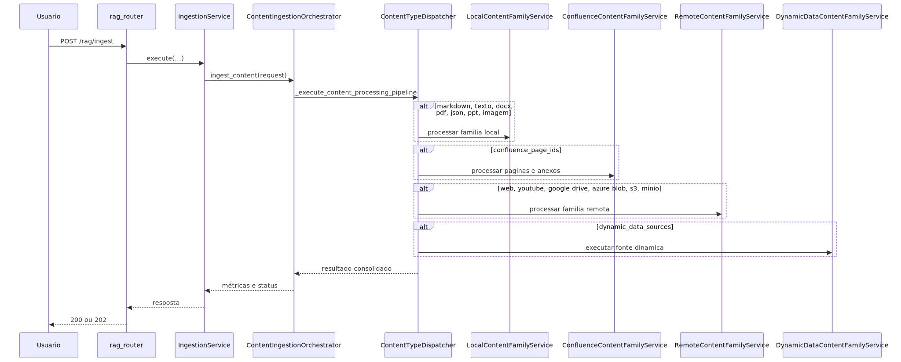

# Tutorial 101: Criação e Configuração de Ingestão por tipo real

Se você acabou de chegar no projeto e quer entender ingestão como um curso prático, este é o ponto de entrada certo. A proposta aqui não é falar de “ingestão” como uma caixa-preta. A proposta é mostrar quais tipos entram de verdade no runtime principal, por qual esteira eles passam, o que cada uma faz internamente e onde existe lacuna real, como no caso de Excel no fluxo genérico compartilhado.

## 1) Para quem é este tutorial

- Consultor júnior que precisa entender quais fontes a plataforma aceita hoje.
- Desenvolvedor júnior que precisa descobrir onde mexer sem espalhar lógica pelo sistema.
- Operação que precisa diferenciar ingestão local, remota, Confluence e dados dinâmicos.

Você vai conseguir:

- entender `/rag/ingest` e o caminho real até o `ContentIngestionOrchestrator`;
- localizar as quatro famílias principais do runtime de ingestão;
- saber o que acontece por dentro em PDF, JSON, DOCX, PowerPoint, imagem, web scraping, YouTube, Google Drive, Azure Blob, S3, MinIO, Confluence e dados dinâmicos;
- entender por que Excel merece um tratamento especial e por que ainda não deve ser vendido como fluxo genérico pronto fim a fim.

## Leitura relacionada

- Aprofundamento técnico completo: [README-INGESTAO.md](./README-INGESTAO.md)
- Tutorial 101 específico de PDF: [tutorial-101-ingestao-pdf.md](./tutorial-101-ingestao-pdf.md)
- Tutorial 101 específico de Excel: [tutorial-101-ingestao-excel-e-rag-de-excel.md](./tutorial-101-ingestao-excel-e-rag-de-excel.md)
- Fluxo completo até consulta RAG: [tutorial-101-processo-completo-de-ingestao-e-rag.md](./tutorial-101-processo-completo-de-ingestao-e-rag.md)

## 2) Dicionário rápido

- `IngestionService`: monta o `IngestionRequest` a partir do YAML e decide o caminho de execução.
- `ContentIngestionOrchestrator`: maestro do pipeline de ingestão.
- `ContentTypeDispatcherMixin`: sequência principal que chama o processamento por tipo.
- `LocalContentFamilyService`: família dos arquivos locais, como markdown, texto, DOCX, PDF, JSON, imagem e PowerPoint.
- `ConfluenceContentFamilyService`: família dedicada ao Confluence, com resolução de páginas e anexos.
- `RemoteContentFamilyService`: família de web scraping, YouTube, Google Drive, Azure Blob, S3 e MinIO.
- `DynamicDataContentFamilyService`: família das fontes dinâmicas que geram documentos ou arquivos no runtime.
- `vector_store`: destino final dos chunks indexáveis.

## 3) Conceito em linguagem simples

Pense na ingestão como um centro logístico com várias docas de recebimento.

- Arquivo local chega por uma doca.
- Fonte remota chega por outra.
- Confluence chega por uma terceira, porque traz páginas, contexto e anexos.
- Dados dinâmicos chegam por uma quarta, porque primeiro precisam gerar o próprio material.

Depois que o material entra, o sistema identifica o tipo real do conteúdo e entrega para um especialista. JSON vai para um especialista em estrutura. PDF vai para um especialista em parsing e OCR. Imagem vai para o pipeline multimodal. E só depois disso os chunks vão para o vector store.

A analogia do mundo real é esta: ingestão não é um funcionário só fazendo tudo. É uma triagem com equipes diferentes. Isso evita que PDF, imagem, JSON e Confluence sejam tratados como se fossem a mesma coisa.

## 4) Mapa de navegação do repo

- `src/api/routers/rag_router.py`: boundary HTTP da ingestão.
- `src/services/ingestion_service.py`: monta a requisição canônica e aciona o runtime.
- `src/ingestion_layer/main_orchestrator.py`: orquestra o pipeline de ingestão.
- `src/ingestion_layer/content_type_dispatcher.py`: decide e executa a ordem dos tipos.
- `src/ingestion_layer/local_content_family.py`: família local.
- `src/ingestion_layer/confluence_content_family.py`: família Confluence.
- `src/ingestion_layer/remote_content_family.py`: família remota.
- `src/ingestion_layer/dynamic_data_content_family.py`: família dynamic_data.
- `src/ingestion_layer/processors/`: processadores por tipo de conteúdo.
- `src/ingestion_layer/datasources/`: fontes brutas como filesystem, web, Confluence e YouTube.
- `src/ingestion_layer/core/data_models.py`: contrato canônico de entrada da ingestão.
- `app/yaml/system/rag-config-modelo.yaml`: modelo-base de configuração.

## 5) Mapa visual 1: fluxo macro

## 6) Mapa visual 2: sequência

## 7) Mapa visual 3: camadas

## 8) Mapa visual 4: componentes

## 9) Onde isso aparece no projeto

- Endpoint de ingestão: `rag_router.py`.
- Serviço de ingestão: `ingestion_service.py`.
- Orquestrador: `main_orchestrator.py`.
- Sequência por tipo: `content_type_dispatcher.py`.
- Arquivos locais: `local_content_family.py`.
- Confluence: `confluence_content_family.py`.
- Web, storage remoto e YouTube: `remote_content_family.py`.
- Dados dinâmicos: `dynamic_data_content_family.py`.
- Excel: `excel_processor.py` existe, mas o contrato principal de entrada ainda não expõe `excel_file_paths`.

## 10) Caminho real no código

- `src/api/routers/rag_router.py`
- `src/services/ingestion_service.py`
- `src/ingestion_layer/main_orchestrator.py`
- `src/ingestion_layer/content_type_dispatcher.py`
- `src/ingestion_layer/local_content_family.py`
- `src/ingestion_layer/confluence_content_family.py`
- `src/ingestion_layer/remote_content_family.py`
- `src/ingestion_layer/dynamic_data_content_family.py`
- `src/ingestion_layer/core/data_models.py`
- `src/ingestion_layer/core/factories.py`

## 11) Fluxo passo a passo

1. O endpoint recebe a requisição e entrega ao `IngestionService`.
2. O serviço monta o `IngestionRequest` com base nas fontes configuradas.
3. O `ContentIngestionOrchestrator` prepara vector store, telemetria e contexto.
4. O `ContentTypeDispatcherMixin` percorre a ordem real do contrato.
5. Se houver `confluence_page_ids`, entra a família Confluence.
6. Se houver `markdown_file_paths`, `docx_file_paths`, `pdf_file_paths`, `text_file_paths`, `json_file_paths`, `ppt_file_paths` ou `image_file_paths`, entra a família local.
7. Se houver `youtube_video_ids`, `youtube_sources`, `google_drive_sources`, `azure_blob_sources`, `s3_sources`, `minio_sources` ou `web_scraping_urls`, entra a família remota.
8. Se houver `dynamic_data_sources`, entra a família de dados dinâmicos.
9. Cada família prepara a origem e entrega o documento canônico ao processador correto.
10. O processador produz chunks.
11. O vector store indexa os chunks.
12. A persistência e a telemetria consolidam o run.

Com configuração ativa:

- Confluence pode coletar anexos se a configuração de `attachments` estiver habilitada.
- Web scraping materializa anexos e documentos ricos antes da indexação.
- JSON aplica perfil e metadados próprios de estrutura.
- Imagem usa pipeline multimodal em vez de chunking textual simples.

No estado atual:

- o fluxo principal aceita local, remoto, Confluence e dynamic_data;
- Excel tem processador e caminho especializado documentados, mas ainda não fecha o caminho genérico compartilhado de `local_files` até o `IngestionRequest` principal.

### Curso rápido por tipo de ingestão

<!-- markdownlint-disable MD013 -->
| Tipo real | Evidência de entrada | Caminho interno real | O que acontece por dentro, em linguagem simples | Status no fluxo genérico |
| --- | --- | --- | --- | --- |
| Markdown | `markdown_file_paths` | `LocalContentFamilyService.process_markdown` | arquivo local entra na esteira comum e vira chunks textuais orientados por markdown | pronto |
| Texto/TXT | `text_file_paths` | `LocalContentFamilyService.process_text` | segue o caminho local mais simples, com chunking textual padronizado | pronto |
| DOCX | `docx_file_paths` | `LocalContentFamilyService.process_docx` + `DocxContentProcessor` | valida bytes ZIP do Word, extrai parágrafos e só depois chunka | pronto |
| PDF | `pdf_file_paths` | `LocalContentFamilyService.process_pdf` + `PDFContentProcessor` | usa a esteira mais avançada, com parsing, OCR e componentes visuais | pronto |
| JSON | `json_file_paths` | `LocalContentFamilyService.process_json` + `JsonContentProcessor` | preserva texto JSON, entende estrutura, aplica perfis e metadados próprios | pronto |
| PowerPoint | `ppt_file_paths` | `LocalContentFamilyService.process_ppt` + `PPTContentProcessor` | extrai texto dos slides com `python-pptx` antes do chunking | pronto |
| Imagem | `image_file_paths` | `LocalContentFamilyService.process_image` + `ImageContentProcessor` | delega para pipeline multimodal com OCR, descrição e chunk especializado | pronto |
| Confluence | `confluence_page_ids` | `ConfluenceContentFamilyService.process` | resolve páginas elegíveis, coletando anexos opcionais antes da materialização canônica | pronto |
| Web scraping | `web_scraping_urls` | `RemoteContentFamilyService.process_web_scraping` | pré-baixa páginas e anexos, materializa documentos ricos e exige consistência antes de indexar | pronto |
| YouTube | `youtube_video_ids` e `youtube_sources` | `RemoteContentFamilyService.process_youtube` | expande playlists, resolve URLs e reaproveita pipeline remoto com transcrição | pronto |
| Google Drive | `google_drive_sources` | `RemoteContentFamilyService.process_google_drive` | lista e deduplica documentos elegíveis antes da esteira de processamento | pronto |
| Azure Blob | `azure_blob_sources` | `RemoteContentFamilyService.process_azure_blob` | coleta blobs, aplica política incremental e converte documentos diretamente em chunks | pronto |
| S3 | `s3_sources` | `RemoteContentFamilyService.process_s3` | lista chaves, filtra por padrões e reaproveita o pipeline remoto | pronto |
| MinIO | `minio_sources` | `RemoteContentFamilyService.process_minio` | repete a lógica de storage remoto com client e credenciais de MinIO | pronto |
| Dados dinâmicos | `dynamic_data_sources` | `DynamicDataContentFamilyService.process` | executa scripts/fontes dinâmicas e indexa documentos ou arquivos gerados no runtime | pronto |
| Excel `.xlsx` e `.xls` | parser e factory existem, mas `IngestionRequest` não expõe `excel_file_paths` | `ExcelContentProcessor` existe fora do fluxo compartilhado principal | o parser está pronto, mas a entrada genérica ainda não fecha ponta a ponta | parcial |
<!-- markdownlint-enable MD013 -->

### Excel: o caso especial que você não deve simplificar demais

Excel precisa ser explicado com honestidade.

- `ContentProcessorFactory` registra `ExcelContentProcessor` para `.xlsx` e `.xls`.
- `FileSystemDataSource` reconhece essas extensões.
- Existe tutorial específico de Excel e existe fluxo especializado de RAG tabular.
- Mas o contrato `IngestionRequest` principal não tem `excel_file_paths`.
- E `IngestionService` não coleta Excel dentro de `local_files`
  no caminho compartilhado atual.

Impacto prático: Excel existe no projeto, mas ainda não deve ser
documentado aqui como “suporte genérico pronto fim a fim”.

### Arquitetura atual da ingestão, sem jargão

O desenho real do código separa bem as responsabilidades.

- `IngestionService` monta a request final com as fontes realmente ativas.
- `ContentIngestionOrchestrator` coordena o ciclo de vida da ingestão.
- `ContentTypeDispatcherMixin` executa a ordem dos tipos.
- cada família resolve a natureza da fonte;
- cada processador resolve o conteúdo do documento;
- o vector store indexa; a persistência e a telemetria ficam do lado da orquestração.

Em termos práticos, isso significa que o lugar certo para corrigir
depende da responsabilidade real do problema.

### Arquitetura atual do Confluence

Confluence tem serviço próprio porque o problema não é só “baixar HTML”.

- `_resolve_confluence_page_ids` decide quais páginas entram.
- `ConfluenceDataSource` cuida de transporte, autenticação, retry,
  visibilidade, recursão, autorização e anexos.
- `ConfluenceContentProcessorBase.build_from_storage` converte HTML
  bruto em `ConfluencePage` canônica.
- `create_chunks` só entra depois que a página canônica já existe.

Impacto prático:

- se faltar visibilidade ou recursão, o ponto dono é o DataSource;
- se faltar qualidade semântica da página, o ponto dono é o processor;
- se o problema for persistência ou telemetria, o ponto dono é a orquestração.

## 12) Status: está pronto? quanto está pronto?

<!-- markdownlint-disable MD013 -->
| Área | Evidência | Status | Impacto prático | Próximo passo mínimo |
| --- | --- | --- | --- | --- |
| Endpoint ingestão | `rag_router.py` | pronto | entrada HTTP funcional | manter contrato |
| Serviço ingestão | `ingestion_service.py` | pronto | request consolidado | ampliar validação de fontes |
| Orquestrador principal | `main_orchestrator.py` | pronto | coordenação central robusta | manter cobertura regressiva |
| Família local | `local_content_family.py` | pronto | markdown, texto, docx, pdf, json, ppt e imagem entram por esteira única previsível | proteger contratos por tipo |
| Família Confluence | `confluence_content_family.py` | pronto | páginas e anexos têm esteira própria | manter testes de anexos e recursão |
| Família remota | `remote_content_family.py` | pronto | web, YouTube, Google Drive, Azure Blob, S3 e MinIO têm entrada dedicada | manter credenciais e retry por origem |
| Família dynamic_data | `dynamic_data_content_family.py` | pronto | scripts e arquivos gerados em runtime podem ser indexados | proteger isolamento e limpeza |
| Pipeline PDF | `content_type_dispatcher.py` + `pdf_processor.py` | pronto | ingestão PDF operacional com parsing, OCR e componentes visuais | consultar [tutorial-101-ingestao-pdf.md](tutorial-101-ingestao-pdf.md) |
| Pipeline JSON | `local_content_family.py` + `json_processor.py` | pronto | JSON entra de forma canônica no fluxo genérico local | manter metadados de estrutura estáveis |
| Excel no fluxo genérico | `core/data_models.py` + `ingestion_service.py` + `excel_processor.py` | parcial | o parser existe, mas a entrada compartilhada ainda não fecha ponta a ponta | adicionar campo explícito e coleta no serviço |
<!-- markdownlint-enable MD013 -->

## 13) Como colocar para funcionar

<!-- markdownlint-disable MD013 -->
Passo 0:

- usar a `.venv` do projeto; neste escopo eu não encontrei um bootstrap único e versionado para instalar dependências do zero.

Passo 1:

- ler primeiro o cabeçalho de `scripts/suite_de_testes_padrao.sh`, porque ele é a referência oficial de validação.

Passo 2:

- subir a API com `source .venv/bin/activate && python app/main.py`.

Passo 3:

- chamar `POST /rag/ingest` com o payload aceito pelo endpoint e a configuração YAML do caso que você quer validar.

Passo 4:

- acompanhar `task_id`, `/status` e, quando fizer sentido, `/ingestion-runs`.

Passo 5:

- validar no resultado pelo menos `documents_processed`, `chunks_created` e `chunks_stored`.

Passo 6:

- para ciclo rápido, usar `source .venv/bin/activate && ./scripts/suite_de_testes_padrao.sh --focus-paths <tests_relacionados>`.
- se houver `Permission denied` ou `Access denied`, executar `chmod +x ./scripts/suite_de_testes_padrao.sh` e repetir o mesmo comando.
- para leitura operacional compacta, usar `source .venv/bin/activate && ./scripts/suite_de_testes_padrao.sh --status-repo`.
- para fechamento oficial, usar `source .venv/bin/activate && ./scripts/suite_de_testes_padrao.sh --all-tests` e depois repetir `--status-repo`.
<!-- markdownlint-enable MD013 -->

## 14) ELI5: onde colocar cada parte da feature

<!-- markdownlint-disable MD013 -->
| Pergunta | Resposta | Camada | Onde |
| --- | --- | --- | --- |
| Quero nova fonte de ingestão | adicionar no contrato, na coleta e no dispatcher | Orchestration | `ingestion_service.py` + `content_type_dispatcher.py` |
| Quero mudar PDF | mexer no processador PDF | Processor | `pdf_processor.py` |
| Quero mudar JSON | mexer no processador JSON e nos metadados estruturais | Processor | `json_processor.py` |
| Quero mudar Confluence | mexer na família Confluence e no DataSource | Confluence | `confluence_content_family.py` + `confluence_data_source.py` |
| Quero mudar web scraping ou storage remoto | mexer na família remota e na origem concreta | Remote | `remote_content_family.py` + `datasources/` |
| Quero alterar endpoint | mexer no router | Entry | `rag_router.py` |
<!-- markdownlint-enable MD013 -->

## 15) Template de mudança

<!-- markdownlint-disable MD013 -->
1) entrada

- path: `rag_router.py`
- contrato: request de ingestão aceito pelo boundary HTTP

1) config

- keys: `ingestion.*`, `vector_store.*` e blocos específicos por fonte
- leitura: `IngestionService`, famílias e factories

1) execução

- `IngestionService.execute`
- `ContentIngestionOrchestrator.ingest_content`
- família local, remota, Confluence ou dynamic_data conforme a origem

1) ferramentas

- não há tool-calling agentic específico nesse fluxo; o pipeline usa datasources, clients e processors

1) dados

- vector store + telemetria + persistência operacional

1) observabilidade

- logs por `correlation_id`, progresso e visão operacional dos runs

1) testes

- suites de ingestão e da área tocada em `tests/`
<!-- markdownlint-enable MD013 -->

## 16) CUIDADO: o que NÃO fazer

- Não processar arquivo direto no router.
- Não pular `IngestionService` para “ganhar tempo”.
- Não misturar lógica de DataSource dentro do processor.
- Não documentar Excel como pronto fim a fim
  se o contrato executável ainda não fecha.

## 17) Anti-exemplos

- Erro: parser PDF direto no endpoint.
- Ruim: acoplamento, baixa testabilidade e perda de observabilidade.
- Correção: manter no `PDFContentProcessor`.

- Erro: Confluence sem retry explícito.
- Ruim: falhas transitórias derrubam lote inteiro.
- Correção: manter a responsabilidade no DataSource e na família Confluence.

- Erro: JSON tratado como texto puro sem preservar estrutura.
- Ruim: perda de semântica e chunks piores para busca.
- Correção: manter `JsonContentProcessor` e seus metadados específicos.

- Erro: assumir que `local_files` já fecha Excel ponta a ponta.
- Ruim: cria documentação enganosa e diagnóstico errado para quem está operando.
- Correção: tratar como lacuna de contrato até a entrada explícita existir no `IngestionRequest`.

## 18) Exemplos guiados

- Exemplo 1: ingestão local de PDF.
- Exemplo 2: ingestão local de JSON.
- Exemplo 3: ingestão de páginas Confluence.
- Exemplo 4: ingestão remota com web scraping ou storage.

## 19) Erros comuns e como reconhecer

- Sintoma: “Nenhuma fonte ativa localizada”.
- Hipótese: bloco `ingestion` sem fonte ligada.
- Confirmar: `IngestionService` e o `IngestionRequest` montado.
- Correção: habilitar ao menos uma fonte real.

- Sintoma: erro Confluence 4xx ou 5xx.
- Hipótese: credencial, permissão ou rede.
- Confirmar: `ConfluenceDataSource`, retry e logs da família Confluence.
- Correção: revisar credenciais e política de retry.

- Sintoma: PDF sem chunks.
- Hipótese: extração falhou ou arquivo está vazio/incompatível.
- Confirmar: logs do `PDFContentProcessor`.
- Correção: revisar engine e parâmetros PDF.

- Sintoma: JSON indexado, mas com estrutura pobre ou chunks ruins.
- Hipótese: perfil JSON inadequado ou metadata estrutural insuficiente.
- Confirmar: `JsonContentProcessor` e `JsonMetadataBuilder`.
- Correção: revisar perfil, profundidade e estratégia de chunking.

- Sintoma: Excel está documentado em vários lugares,
  mas não entra pelo fluxo local genérico.
- Hipótese: lacuna real entre `local_files` e o contrato `IngestionRequest`.
- Confirmar: ausência de `excel_file_paths` no contrato principal.
- Correção: tratar como evolução de contrato e não como bug de configuração do usuário.

## 20) Exercícios guiados

Exercício 1: seguir o endpoint de ingestão até o orquestrador.
Exercício 2: localizar onde JSON entra no fluxo local.
Exercício 3: localizar o método de processamento Confluence.
Exercício 4: localizar por que Excel ainda não fecha no fluxo genérico.

## 21) Checklist final

- endpoint de ingestão mapeado;
- serviço e orquestrador mapeados;
- famílias local, remota, Confluence e dynamic_data entendidas;
- diferenças entre JSON, PDF, imagem e web scraping entendidas;
- lacuna de Excel entendida sem mascarar o contrato atual.

## 22) Checklist de PR

- preserva o contrato da API;
- não move lógica de processor para router;
- mantém retry em integrações externas;
- mantém logs e `correlation_id`;
- inclui teste compatível com a área alterada;
- não promete suporte genérico para um tipo cujo contrato ainda não fecha.

## 23) Referências

Internas:

- `src/api/routers/rag_router.py`
- `src/services/ingestion_service.py`
- `src/ingestion_layer/main_orchestrator.py`
- `src/ingestion_layer/content_type_dispatcher.py`
- `src/ingestion_layer/local_content_family.py`
- `src/ingestion_layer/confluence_content_family.py`
- `src/ingestion_layer/remote_content_family.py`
- `src/ingestion_layer/dynamic_data_content_family.py`
- `src/ingestion_layer/processors/pdf_processor.py`
- `src/ingestion_layer/processors/json_processor.py`
- `src/ingestion_layer/processors/excel_processor.py`

Externas:

- FastAPI docs.
- Qdrant docs.
- Azure AI Search docs.
