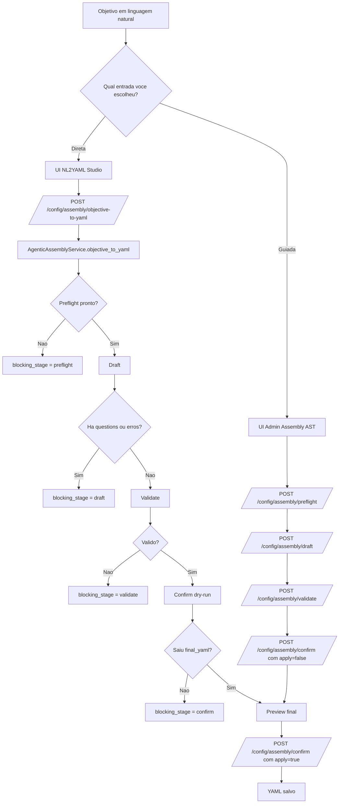
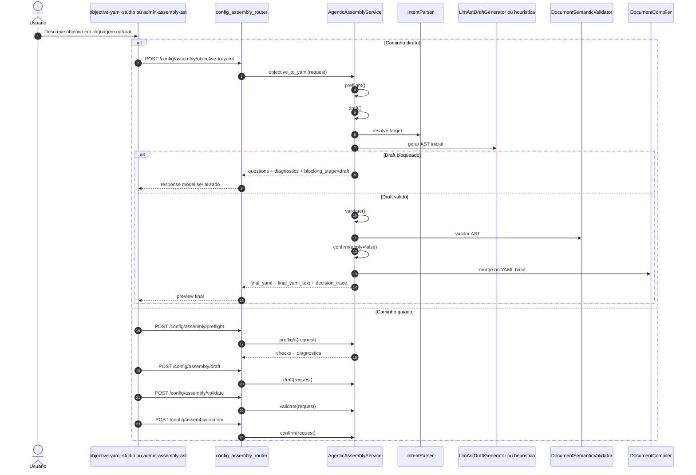
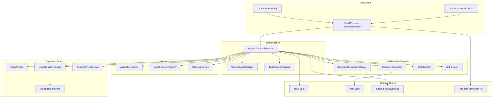
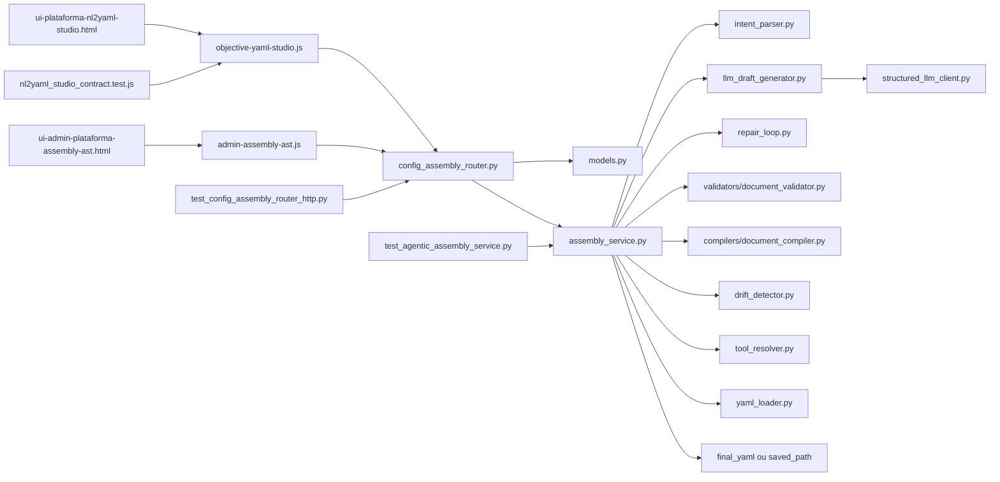
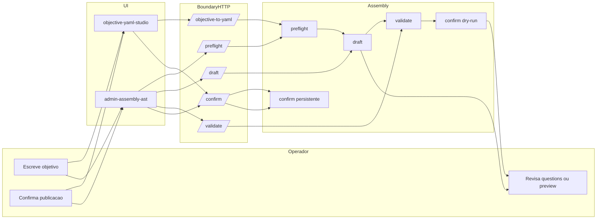

<!-- markdownlint-disable MD013 -->

# Tutorial 101: NL2YAML

Se voce acabou de entrar no projeto e ouviu alguem dizer "vamos usar NL2YAML", o significado correto aqui nao e "pedir qualquer YAML para a IA". O significado real, comprovado no codigo, e usar a trilha governada do assembly agentic para transformar um objetivo em linguagem natural em AST validada e, so no fim, em YAML final ou em perguntas bloqueantes. Este tutorial mostra esse fluxo como ele existe hoje, o que ja esta pronto, o que ainda depende de contexto do tenant e qual e o menor caminho para colocar isso para funcionar sem inventar contrato.

## 1) Para quem e este tutorial

- Desenvolvedor junior que precisa entender onde o texto em linguagem natural vira AST e depois YAML.
- Consultor junior que precisa operar a tela NL2YAML sem confundir preview com publicacao.
- Pessoa de sustentacao que precisa diagnosticar por que saiu `questions`, `blocking_stage` ou `ready=false`.
- Pessoa de produto que quer distinguir o caminho direto `objective-to-yaml` do caminho guiado `preflight -> draft -> validate -> confirm`.

Ao final, voce vai conseguir:

- Entender o que NL2YAML realmente significa neste repositorio.
- Saber quais endpoints e UIs participam do fluxo oficial.
- Ler `questions`, `diagnostics`, `decision_trace` e `blocking_stage` sem chute.
- Saber quando usar `llm_schema`, `heuristic` ou `auto`.
- Publicar um YAML governado pelo caminho correto e com o `output_path` certo.

## 2) Dicionario rapido

- NL2YAML: no projeto atual, e o fluxo governado de objetivo em linguagem natural para YAML agentic via AST, descrito em [README-AST-AGENTIC-DESIGNER.md](README-AST-AGENTIC-DESIGNER.md).
- AST: representacao tipada do contrato agentic antes do merge no YAML final.
- Assembly: esteira oficial que faz `preflight`, `draft`, `validate` e `confirm` em [src/config/agentic_assembly/assembly_service.py](../src/config/agentic_assembly/assembly_service.py).
- `objective-to-yaml`: endpoint direto que tenta devolver o YAML final ou pendencias, exposto em [src/api/routers/config_assembly_router.py](../src/api/routers/config_assembly_router.py).
- `draft`: etapa que gera o rascunho AST e o preview inicial.
- `validate`: etapa que roda validacao semantica forte antes da confirmacao.
- `confirm`: etapa que compila, mescla e, se `apply=true`, persiste o YAML final.
- `questions`: perguntas bloqueantes quando falta decisao que o backend nao pode inventar.
- `diagnostics`: mensagens estruturadas de erro, aviso ou informacao.
- `blocking_stage`: marcador do ponto em que o fluxo direto travou. O contrato atual aceita `preflight`, `draft`, `validate` e `confirm` em [src/config/agentic_assembly/models.py](../src/config/agentic_assembly/models.py).
- `generation_mode`: estrategia de geracao do draft. Hoje o contrato oficial aceita `llm_schema`, `heuristic` e `auto`.
- `decision_trace`: rastro simples das decisoes criticas tomadas durante o fluxo direto.

## 3) Conceito em linguagem simples

Pense no NL2YAML como um escritorio de projetos, nao como um gerador magico de arquivo. Voce entra com um pedido em portugues, como "quero um workflow de triagem comercial". O escritorio primeiro confere se ele tem material minimo para trabalhar, depois monta uma planta tecnica, revisa se a planta faz sentido e so depois entrega a versao final que pode ser arquivada.

A analogia pratica e a de um arquiteto serio. Ele nao recebe "quero uma casa" e devolve a chave pronta. Ele olha o terreno, confere regras do condominio, faz a planta, aponta lacunas e so entao fecha o projeto executivo. O assembly faz exatamente isso para agentes e workflows.

Em termos simples:

- O texto do usuario entra como intencao, nao como YAML executavel.
- O sistema tenta descobrir se o alvo e `workflow`, `agent_supervisor` ou `deepagent_supervisor`.
- O backend gera uma AST, nao o arquivo final direto.
- A AST passa por validacao e merge governado.
- Se faltar contexto, o sistema pergunta.
- Se tudo fechar, o YAML final aparece em memoria e a publicacao ainda e uma etapa separada.

## 4) Mapa de navegacao do repo

- [docs/README-AST-AGENTIC-DESIGNER.md](README-AST-AGENTIC-DESIGNER.md) -> manual tecnico principal do assembly -> abra primeiro quando a duvida for contrato oficial de AST, endpoints ou limites.
- [docs/README-AGENTIC-INICIANTES.md](README-AGENTIC-INICIANTES.md) -> introducao do modulo agentic -> use quando a pessoa ainda nao entende AST e assembly.
- [src/api/routers/config_assembly_router.py](../src/api/routers/config_assembly_router.py) -> boundary HTTP de `draft`, `objective-to-yaml`, `validate`, `confirm`, `preflight` e `recommend-tools` -> mexa aqui quando o problema for contrato de API.
- [src/config/agentic_assembly/assembly_service.py](../src/config/agentic_assembly/assembly_service.py) -> orquestracao real do fluxo -> mexa aqui quando a duvida for ordem das etapas ou bloqueio do fluxo direto.
- [src/config/agentic_assembly/models.py](../src/config/agentic_assembly/models.py) -> modelos de request e response -> mexa aqui quando um campo do contrato HTTP mudar de verdade.
- [src/config/agentic_assembly/nl/intent_parser.py](../src/config/agentic_assembly/nl/intent_parser.py) -> classificacao do alvo e perguntas heuristicas -> mexa aqui quando `auto` estiver escolhendo mal ou perguntando pouco.
- [src/config/agentic_assembly/nl/llm_draft_generator.py](../src/config/agentic_assembly/nl/llm_draft_generator.py) -> geracao estruturada via LLM -> mexa aqui quando o ramo `llm_schema` quebrar.
- [src/config/agentic_assembly/nl/structured_llm_client.py](../src/config/agentic_assembly/nl/structured_llm_client.py) -> validacao de schema JSON e preflight do provider -> mexa aqui quando o ambiente acusar `AST_DRAFT_LLM_INDISPONIVEL`.
- [app/ui/static/js/objective-yaml-studio.js](../app/ui/static/js/objective-yaml-studio.js) -> UI standalone do caminho direto -> mexa aqui quando o fluxo de objetivo, preview e publicacao estiver incorreto.
- [app/ui/static/ui-plataforma-nl2yaml-studio.html](../app/ui/static/ui-plataforma-nl2yaml-studio.html) -> pagina da UI standalone -> mexa quando a navegacao visual ou o carregamento da tela estiver errado.
- [app/ui/static/js/admin-assembly-ast.js](../app/ui/static/js/admin-assembly-ast.js) -> UI administrativa completa -> mexa quando o problema estiver no caminho guiado ou em `recommend-tools`.
- [tests/unit/test_agentic_assembly_service.py](../tests/unit/test_agentic_assembly_service.py) e [tests/unit/test_config_assembly_router_http.py](../tests/unit/test_config_assembly_router_http.py) -> provas do contrato real -> mexa antes de supor comportamento.

## 5) Mapa visual 1: fluxo macro

## 6) Mapa visual 2: quem chama quem

## 7) Mapa visual 3: camadas

## 8) Mapa visual 4: componentes

## 9) Onde isso aparece neste projeto

- O significado oficial de NL2YAML no escopo agentic esta explicado em [README-AST-AGENTIC-DESIGNER.md](README-AST-AGENTIC-DESIGNER.md).
- O endpoint direto do produto e `POST /config/assembly/objective-to-yaml` em [src/api/routers/config_assembly_router.py](../src/api/routers/config_assembly_router.py).
- A ordem real do fluxo direto esta em [src/config/agentic_assembly/assembly_service.py](../src/config/agentic_assembly/assembly_service.py): `preflight -> draft -> validate -> confirm`.
- O teste que trava essa ordem e [tests/unit/test_agentic_assembly_service.py](../tests/unit/test_agentic_assembly_service.py).
- O contrato HTTP de entrada e saida esta em [src/config/agentic_assembly/models.py](../src/config/agentic_assembly/models.py).
- A classificacao do alvo `auto` mora em [src/config/agentic_assembly/nl/intent_parser.py](../src/config/agentic_assembly/nl/intent_parser.py).
- O ramo `llm_schema` usa [src/config/agentic_assembly/nl/llm_draft_generator.py](../src/config/agentic_assembly/nl/llm_draft_generator.py).
- O cliente que valida JSON estruturado contra schema mora em [src/config/agentic_assembly/nl/structured_llm_client.py](../src/config/agentic_assembly/nl/structured_llm_client.py).
- A UI standalone do produto fica em [app/ui/static/ui-plataforma-nl2yaml-studio.html](../app/ui/static/ui-plataforma-nl2yaml-studio.html) e [app/ui/static/js/objective-yaml-studio.js](../app/ui/static/js/objective-yaml-studio.js).
- A UI administrativa completa fica em [app/ui/static/js/admin-assembly-ast.js](../app/ui/static/js/admin-assembly-ast.js).
- O teste HTTP que prova `final_yaml_text`, `preflight_checks` e `correlation_id` fica em [tests/unit/test_config_assembly_router_http.py](../tests/unit/test_config_assembly_router_http.py).
- O teste frontend da tela standalone fica em [tests/frontend/nl2yaml_studio_contract.test.js](../tests/frontend/nl2yaml_studio_contract.test.js).

## 10) Caminho real no codigo

- [src/api/service_api.py](../src/api/service_api.py) -> monta a aplicacao FastAPI e inclui o router de assembly.
- [main.py](../main.py) -> wrapper de compatibilidade para subir a API pela entrada principal.
- [run.sh](../run.sh) -> launcher versionado para subir API, worker e scheduler com flags.
- [src/api/routers/config_assembly_router.py](../src/api/routers/config_assembly_router.py) -> normaliza `correlation_id`, exige permissao `config.generate` e chama o service.
- [src/config/agentic_assembly/models.py](../src/config/agentic_assembly/models.py) -> define `AssemblyTarget`, `AssemblyDraftGenerationMode`, requests e responses.
- [src/config/agentic_assembly/assembly_service.py](../src/config/agentic_assembly/assembly_service.py) -> orquestra o fluxo real do NL2YAML.
- [src/config/agentic_assembly/nl/intent_parser.py](../src/config/agentic_assembly/nl/intent_parser.py) -> resolve `workflow`, `agent_supervisor` ou `deepagent_supervisor` e monta perguntas heuristicas.
- [src/config/agentic_assembly/nl/llm_draft_generator.py](../src/config/agentic_assembly/nl/llm_draft_generator.py) -> pede um envelope JSON estruturado para o modelo.
- [src/config/agentic_assembly/validators/document_validator.py](../src/config/agentic_assembly/validators/document_validator.py) -> impede YAML bonito mas semanticamente invalido.
- [src/config/agentic_assembly/compilers/document_compiler.py](../src/config/agentic_assembly/compilers/document_compiler.py) -> compila o fragmento governado e faz merge no `base_yaml`.
- [app/ui/static/js/objective-yaml-studio.js](../app/ui/static/js/objective-yaml-studio.js) -> envia `generation_mode`, monta `constraints` no modo `auto`, exibe preview e publica com `output_path`.
- [tests/unit/test_agentic_assembly_service.py](../tests/unit/test_agentic_assembly_service.py) -> comprova a ordem do fluxo, o comportamento com `questions` e o fallback heuristico.

## 11) Fluxo passo a passo (o que acontece de verdade)

1. O usuario escreve um objetivo em linguagem natural na UI standalone ou na UI admin.
2. A UI envia o payload para o router de assembly em [src/api/routers/config_assembly_router.py](../src/api/routers/config_assembly_router.py).
3. O router exige autenticacao administrativa, permissao `config.generate` e, para `draft`, `objective-to-yaml`, `validate` e `confirm`, exige a feature flag `FEATURE_AGENTIC_AST_ENABLED`.
4. O router resolve ou injeta `correlation_id` antes de chamar o service.
5. No fluxo direto, `objective_to_yaml()` em [src/config/agentic_assembly/assembly_service.py](../src/config/agentic_assembly/assembly_service.py) roda `preflight`, depois `draft`, depois `validate` e por fim `confirm(apply=false)`.
6. O teste [tests/unit/test_agentic_assembly_service.py](../tests/unit/test_agentic_assembly_service.py) confirma essa ordem exata: `preflight`, `draft`, `validate`, `confirm`.
7. O target e resolvido com base no pedido do usuario, no `base_yaml` e, quando o payload vem com `target=auto`, com ajuda do [src/config/agentic_assembly/nl/intent_parser.py](../src/config/agentic_assembly/nl/intent_parser.py).
8. Se o modo de geracao for `llm_schema` ou `auto`, o service tenta gerar um envelope JSON estruturado via [src/config/agentic_assembly/nl/llm_draft_generator.py](../src/config/agentic_assembly/nl/llm_draft_generator.py).
9. Se o draft sair com `questions` obrigatorias ou erros de validacao, o fluxo direto para em `blocking_stage=draft` e nao chama `validate` nem `confirm`. Isso tambem esta provado em [tests/unit/test_agentic_assembly_service.py](../tests/unit/test_agentic_assembly_service.py).
10. Se o draft passar, o service chama `validate()` para rodar a validacao semantica e o detector de drift.
11. Se a validacao falhar, o fluxo responde com `blocking_stage=validate`.
12. Se a validacao passar, o service chama `confirm(apply=false)` para gerar o preview final em memoria.
13. Se o `confirm` em dry-run nao devolver `final_yaml`, o fluxo responde com `blocking_stage=confirm`.
14. Se tudo der certo, a resposta inclui `final_yaml`, `final_yaml_text`, `chosen_tools`, `decision_trace`, `preflight_checks` e `validation_report`.
15. Publicar de verdade e outra etapa: a UI chama `POST /config/assembly/confirm` com `apply=true` e `output_path`.

### Com config ativa

- `FEATURE_AGENTIC_AST_ENABLED=true` libera `draft`, `objective-to-yaml`, `validate`, `confirm`, `schema`, `catalog` e `recommend-tools` no router.
- `generation_mode=heuristic` libera o caminho sem depender de LLM estruturado.
- `generation_mode=auto` so pode cair para heuristica quando o opt-in explicito `constraints.auto_heuristic_fallback_enabled=true` estiver presente.
- A UI standalone ja envia esse opt-in no modo `auto` em [app/ui/static/js/objective-yaml-studio.js](../app/ui/static/js/objective-yaml-studio.js).

### No estado atual quando a flag esta desligada

- `draft`, `objective-to-yaml`, `validate` e `confirm` respondem como feature desabilitada no boundary.
- `preflight` continua respondendo, mas com `ready=false` e checks acionaveis, em vez de esconder tudo atras de `404`.

### Swimlane do fluxo real

## 12) Status: esta pronto? quanto esta pronto?

| Area | Evidencia | Status | Impacto pratico | Proximo passo minimo |
| --- | --- | --- | --- | --- |
| Endpoint direto `objective-to-yaml` | [src/api/routers/config_assembly_router.py](../src/api/routers/config_assembly_router.py), [src/config/agentic_assembly/assembly_service.py](../src/config/agentic_assembly/assembly_service.py) | pronto | Ja consegue sair de objetivo para preview final ou perguntas bloqueantes | Usar em tenant com `FEATURE_AGENTIC_AST_ENABLED=true` |
| Ordem oficial `preflight -> draft -> validate -> confirm` | [tests/unit/test_agentic_assembly_service.py](../tests/unit/test_agentic_assembly_service.py) | pronto | A ordem do pipeline esta protegida por teste | Manter esse contrato ao evoluir o fluxo |
| Contrato HTTP de response | [src/config/agentic_assembly/models.py](../src/config/agentic_assembly/models.py), [tests/unit/test_config_assembly_router_http.py](../tests/unit/test_config_assembly_router_http.py) | pronto | A UI pode ler `final_yaml_text`, `blocking_stage`, `preflight_checks` e `decision_trace` sem parsing improvisado | Nao quebrar nomes de campo sem atualizar UI e testes |
| Classificacao `auto` de target | [src/config/agentic_assembly/nl/intent_parser.py](../src/config/agentic_assembly/nl/intent_parser.py) | parcial | Funciona, mas depende da clareza do prompt e do contexto do `base_yaml` | Melhorar os sinais quando surgir ambiguidades recorrentes |
| Ramo `llm_schema` | [src/config/agentic_assembly/nl/llm_draft_generator.py](../src/config/agentic_assembly/nl/llm_draft_generator.py), [src/config/agentic_assembly/nl/structured_llm_client.py](../src/config/agentic_assembly/nl/structured_llm_client.py) | parcial | Produz drafts melhores quando o provider estruturado esta pronto | Garantir provider, schema output e segredos do tenant |
| Ramo `heuristic` | [src/config/agentic_assembly/assembly_service.py](../src/config/agentic_assembly/assembly_service.py), [tests/unit/test_agentic_assembly_service.py](../tests/unit/test_agentic_assembly_service.py) | pronto | Permite fluxo util mesmo sem LLM estruturado | Usar quando o objetivo for mais padrao e deterministico |
| Modo `auto` com fallback explicito | [app/ui/static/js/objective-yaml-studio.js](../app/ui/static/js/objective-yaml-studio.js), [tests/unit/test_agentic_assembly_service.py](../tests/unit/test_agentic_assembly_service.py) | pronto | Evita bloqueio por falta de LLM quando o operador opta pelo fallback | Preservar o opt-in explicito no frontend |
| Publicacao persistente | [src/api/routers/config_assembly_router.py](../src/api/routers/config_assembly_router.py), [app/ui/static/js/objective-yaml-studio.js](../app/ui/static/js/objective-yaml-studio.js) | pronto | Ja grava arquivo quando `apply=true` e `output_path` valido | Continuar respeitando o root governado `app/yaml` |
| UI standalone NL2YAML | [app/ui/static/ui-plataforma-nl2yaml-studio.html](../app/ui/static/ui-plataforma-nl2yaml-studio.html), [app/ui/static/js/objective-yaml-studio.js](../app/ui/static/js/objective-yaml-studio.js) | pronto | Entrega jornada curta de objetivo, preview, pendencias e publicacao | Validar contratos de tela quando mudar o backend |
| UI admin completa | [app/ui/static/js/admin-assembly-ast.js](../app/ui/static/js/admin-assembly-ast.js) | pronto | Exibe `preflight`, `draft`, `validate`, `confirm`, `schema` e `catalog` | Usar quando o operador precisar de inspeção detalhada |
| Recomendacao de tools | [src/api/routers/config_assembly_router.py](../src/api/routers/config_assembly_router.py), [src/config/agentic_assembly/assembly_service.py](../src/config/agentic_assembly/assembly_service.py) | pronto | Ajuda a escolher tool antes do draft, mas nao gera YAML final | Usar como apoio, nao como substituto do draft |
| Observabilidade por `correlation_id` | [src/api/routers/config_assembly_router.py](../src/api/routers/config_assembly_router.py), [tests/unit/test_config_assembly_router_http.py](../tests/unit/test_config_assembly_router_http.py) | pronto | Facilita rastrear o que travou e em qual etapa | Sempre propagar o `correlation_id` nas integrações |
| CLI dedicada para NL2YAML | Nao encontrado no codigo | ausente | O caminho oficial hoje e HTTP/UI, nao um comando dedicado de linha | Se surgir demanda real, criar uma entrada oficial em vez de script solto |

## 13) Como colocar para funcionar (hands-on end-to-end)

### Passo 0. Entenda o minimo obrigatorio

- O ponto de entrada da API e [main.py](../main.py), que delega para [app/main.py](../app/main.py) e sobe o FastAPI montado em [src/api/service_api.py](../src/api/service_api.py).
- O launcher versionado para subir a API e [run.sh](../run.sh), com a flag `+a`.
- O workspace atual tem `.env` com `FASTAPI_PORT=5555`.
- A feature NL2YAML depende da flag `FEATURE_AGENTIC_AST_ENABLED` e de permissao administrativa `config.generate` no router.

### Passo 1. Suba a API local

1. Ative a virtualenv com `source .venv/bin/activate`.
2. Suba a API com `./run.sh +a`.
3. O que voce espera ver: o processo da API iniciando pelo launcher e a aplicacao servindo as paginas `ui/static`.
4. Se a porta 5555 ficar presa depois de alguns ciclos, limpe com `sudo fuser -k 5555/tcp`, confirme com `sudo lsof -i :5555` e suba de novo.

### Passo 2. Escolha o caminho de uso

1. Para a jornada curta, abra a tela [app/ui/static/ui-plataforma-nl2yaml-studio.html](../app/ui/static/ui-plataforma-nl2yaml-studio.html).
2. Para a jornada detalhada, use a tela administrativa de assembly apontada pelo link interno dessa UI.
3. Se preferir integração programatica, use os endpoints em [src/api/routers/config_assembly_router.py](../src/api/routers/config_assembly_router.py).

### Passo 3. Monte o contexto minimo

1. Informe um `prompt` com objetivo claro.
2. Informe `user_email`, porque ele faz parte do contrato de request.
3. Informe `target` quando voce ja souber a espinha dorsal certa. Use `auto` apenas quando aceitar classificacao assistida.
4. Informe `base_yaml` real do tenant. Sem esse contexto, o backend pode devolver `questions` em vez de YAML final.

### Passo 4. Escolha `generation_mode` conscientemente

1. `llm_schema`: use quando houver provider estruturado disponivel e voce quiser um draft mais rico.
2. `heuristic`: use quando quiser determinismo e quando o tenant nao estiver pronto para LLM estruturado.
3. `auto`: use quando quiser tentar LLM, mas permitir fallback heuristico so com opt-in explicito.
4. A UI standalone ja envia `constraints.auto_heuristic_fallback_enabled=true` quando voce escolhe `auto` em [app/ui/static/js/objective-yaml-studio.js](../app/ui/static/js/objective-yaml-studio.js).

### Passo 5. Rode o fluxo direto

1. A UI standalone chama `POST /config/assembly/objective-to-yaml`.
2. O que voce espera ver se der certo: `success=true`, `final_yaml`, `final_yaml_text`, `chosen_tools`, `decision_trace` e `preflight_ready=true`.
3. O que voce espera ver se faltar contexto: `success=false`, `questions`, `diagnostics` e `blocking_stage=draft`.
4. O teste [tests/unit/test_config_assembly_router_http.py](../tests/unit/test_config_assembly_router_http.py) prova que o HTTP devolve `final_yaml_text` serializado quando o fluxo fecha.

### Passo 6. Resolva pendencias, se houver

1. Se voltar `questions`, responda essas perguntas em vez de tentar publicar um preview incompleto.
2. Se voltar `blocking_stage=preflight`, corrija o ambiente primeiro.
3. Se voltar `blocking_stage=validate` ou `confirm`, trate isso como problema tecnico do draft ou do merge final.

### Passo 7. Publique o YAML de verdade

1. Depois do preview final, a UI chama `POST /config/assembly/confirm` com `apply=true`.
2. O contrato de [src/config/agentic_assembly/models.py](../src/config/agentic_assembly/models.py) exige `output_path` quando a intencao e persistir.
3. A UI standalone monta esse `output_path` e mostra `saved_path` quando a publicacao da certo em [app/ui/static/js/objective-yaml-studio.js](../app/ui/static/js/objective-yaml-studio.js).
4. O que voce espera ver: `success=true`, `saved_path` preenchido e mensagem de sucesso na UI.

### Passo 8. Valide com testes oficiais

1. Antes de qualquer rodada, leia o cabecalho de [scripts/suite_de_testes_padrao.sh](../scripts/suite_de_testes_padrao.sh).
2. Se houver `Permission denied`, rode `chmod +x ./scripts/suite_de_testes_padrao.sh` e repita.
3. Ciclo rapido do backend tocado por NL2YAML: `source .venv/bin/activate && ./scripts/suite_de_testes_padrao.sh --focus-paths tests/unit/test_agentic_assembly_service.py,tests/unit/test_config_assembly_router_http.py,tests/frontend/nl2yaml_studio_contract.test.js`.
4. Gate intermediario hermetico: `source .venv/bin/activate && ./scripts/suite_de_testes_padrao.sh --final-gate`.
5. Fechamento oficial: `source .venv/bin/activate && ./scripts/suite_de_testes_padrao.sh --all-tests` e, imediatamente depois, `source .venv/bin/activate && ./scripts/suite_de_testes_padrao.sh --status-repo`.
6. Depois de cada execucao, confira a telemetria e o log da suite. Nao declare sucesso sem ler o resultado.

## 14) ELI5: onde coloco cada parte da feature neste projeto?

Se voce pensar em NL2YAML como uma linha de montagem, cada pecinha tem lugar fixo:

- Entrada HTTP e autenticacao ficam no router.
- Regras de ordem do fluxo ficam no service.
- Interpretacao do pedido em linguagem natural fica na pasta `nl/`.
- Contrato tipado fica nos modelos e AST.
- Validacao forte fica nos validators.
- Merge e persistencia ficam no compiler e no `confirm`.
- Interacao humana e publicacao visual ficam nas UIs.

| Pergunta | Resposta curta | Camada | Onde no repo |
| --- | --- | --- | --- |
| Onde o endpoint direto mora? | No router de assembly | boundary HTTP | [src/api/routers/config_assembly_router.py](../src/api/routers/config_assembly_router.py) |
| Onde a ordem do fluxo e decidida? | No service | orquestracao | [src/config/agentic_assembly/assembly_service.py](../src/config/agentic_assembly/assembly_service.py) |
| Onde `auto` escolhe workflow ou supervisor? | No parser de intencao | interpretacao NL | [src/config/agentic_assembly/nl/intent_parser.py](../src/config/agentic_assembly/nl/intent_parser.py) |
| Onde o ramo LLM schema e montado? | No gerador de draft LLM | geracao estruturada | [src/config/agentic_assembly/nl/llm_draft_generator.py](../src/config/agentic_assembly/nl/llm_draft_generator.py) |
| Onde o schema JSON do LLM e validado? | No cliente estruturado | integracao LLM | [src/config/agentic_assembly/nl/structured_llm_client.py](../src/config/agentic_assembly/nl/structured_llm_client.py) |
| Onde os erros semanticos aparecem? | Nos validators | validacao | [src/config/agentic_assembly/validators/document_validator.py](../src/config/agentic_assembly/validators/document_validator.py) |
| Onde o YAML final nasce? | No confirm e no compiler | compilacao/merge | [src/config/agentic_assembly/compilers/document_compiler.py](../src/config/agentic_assembly/compilers/document_compiler.py) |
| Onde a tela curta publica? | Na UI standalone | frontend | [app/ui/static/js/objective-yaml-studio.js](../app/ui/static/js/objective-yaml-studio.js) |

## 15) Template de mudanca (preenchido com padroes do repo)

1. Entrada: qual endpoint dispara?
   Paths: [src/api/routers/config_assembly_router.py](../src/api/routers/config_assembly_router.py).
   Contrato de entrada: `AssemblyObjectiveToYamlRequest`, `AssemblyDraftRequest`, `AssemblyValidateRequest`, `AssemblyConfirmRequest` em [src/config/agentic_assembly/models.py](../src/config/agentic_assembly/models.py).
2. Config: qual flag ou payload controla?
   Keys: `FEATURE_AGENTIC_AST_ENABLED`, `target`, `generation_mode`, `constraints.auto_heuristic_fallback_enabled`, `base_yaml`, `output_path`.
   Onde e lido: router, service e UIs em [src/api/routers/config_assembly_router.py](../src/api/routers/config_assembly_router.py), [src/config/agentic_assembly/assembly_service.py](../src/config/agentic_assembly/assembly_service.py) e [app/ui/static/js/objective-yaml-studio.js](../app/ui/static/js/objective-yaml-studio.js).
3. Execucao: qual trilha entra?
   Builder/factory: [src/config/agentic_assembly/assembly_service.py](../src/config/agentic_assembly/assembly_service.py).
   State: `ast_payload`, `validation_report`, `questions`, `decision_trace`, `preflight_checks`.
4. Ferramentas: como o sistema decide quais tools entram?
   Registro: `ToolCatalogResolver` usado pelo service.
   Chamadas: escolha do catalogo efetivo em [src/config/agentic_assembly/assembly_service.py](../src/config/agentic_assembly/assembly_service.py).
5. Dados: onde persiste?
   YAML base e final: merge em memoria e persistencia governada no `confirm`.
   Saved path: retorno `saved_path` no response de confirmacao.
6. Observabilidade: onde loga?
   Logs: markers e logs do router e do service.
   Correlation: `correlation_id` propagado no router e serializado no response.
7. Testes: onde validar?
   Unit: [tests/unit/test_agentic_assembly_service.py](../tests/unit/test_agentic_assembly_service.py), [tests/unit/test_config_assembly_router_http.py](../tests/unit/test_config_assembly_router_http.py).
   Frontend: [tests/frontend/nl2yaml_studio_contract.test.js](../tests/frontend/nl2yaml_studio_contract.test.js).

## 16) CUIDADO: o que NAO fazer

- Nao trate NL2YAML como "gerar texto YAML livre". Isso quebra a governanca porque o contrato real passa por AST, validacao e merge.
- Nao coloque logica de negocio do fluxo direto dentro da UI. A ordem oficial mora no service, nao no JavaScript.
- Nao invente fallback heuristico silencioso no backend. O contrato atual exige opt-in explicito no modo `auto`.
- Nao publique com `apply=true` sem `output_path`. A publicacao persistente do contrato atual depende disso.
- Nao ignore `questions`. Se elas apareceram, o backend esta dizendo que falta decisao humana obrigatoria.
- Nao mexa primeiro em docs e UI se o comportamento do service ainda nao foi confirmado em teste.

## 17) Anti-exemplos

1. Erro comum: construir YAML final direto no router.
   Por que e ruim: mistura boundary HTTP com regra de orquestracao e mata a testabilidade.
   Correcao: deixar o router apenas normalizar request e delegar para [src/config/agentic_assembly/assembly_service.py](../src/config/agentic_assembly/assembly_service.py).
2. Erro comum: tratar `questions` como texto decorativo.
   Por que e ruim: a UI pode liberar publicacao de um draft incompleto.
   Correcao: tratar `questions` como bloqueio real e responder antes do `confirm` persistente.
3. Erro comum: cair para heuristica automaticamente quando o LLM falha.
   Por que e ruim: mascara o comportamento real e gera saida diferente do que o operador imagina.
   Correcao: respeitar `constraints.auto_heuristic_fallback_enabled` e manter esse opt-in visivel na UI.
4. Erro comum: salvar arquivo fora da raiz governada.
   Por que e ruim: quebra previsibilidade operacional e o contrato de publicacao da feature.
   Correcao: montar `output_path` pela trilha oficial da UI e do `confirm`.

## 18) Exemplos guiados

1. Exemplo: workflow comercial simples.
   Siga o fio em [app/ui/static/js/objective-yaml-studio.js](../app/ui/static/js/objective-yaml-studio.js) e [src/config/agentic_assembly/assembly_service.py](../src/config/agentic_assembly/assembly_service.py).
   O que observar: a UI chama `objective-to-yaml`; o service roda as quatro etapas e devolve `final_yaml_text` quando tudo fecha.
2. Exemplo: draft bloqueado por tool ambigua.
   Siga o fio em [tests/unit/test_agentic_assembly_service.py](../tests/unit/test_agentic_assembly_service.py) e [src/config/agentic_assembly/nl/intent_parser.py](../src/config/agentic_assembly/nl/intent_parser.py).
   O que observar: o teste prova que o fluxo para em `draft` e devolve `questions` sem chamar `validate` nem `confirm`.
3. Exemplo: modo heuristico sem LLM estruturado.
   Siga o fio em [tests/unit/test_agentic_assembly_service.py](../tests/unit/test_agentic_assembly_service.py) e [src/config/agentic_assembly/models.py](../src/config/agentic_assembly/models.py).
   O que observar: `generation_mode=heuristic` segue sem bloquear por falta de provider estruturado.
4. Exemplo: modo `auto` com opt-in de fallback.
   Siga o fio em [app/ui/static/js/objective-yaml-studio.js](../app/ui/static/js/objective-yaml-studio.js) e [tests/unit/test_agentic_assembly_service.py](../tests/unit/test_agentic_assembly_service.py).
   O que observar: a UI envia `constraints.auto_heuristic_fallback_enabled=true` e o service responde com checks de preflight coerentes.

## 19) Erros comuns e como reconhecer (debugging)

- Sintoma observavel: `404` ao chamar `draft`, `objective-to-yaml`, `validate` ou `confirm`.
  Hipotese: `FEATURE_AGENTIC_AST_ENABLED` esta desligada.
  Como confirmar: verifique o guard no router em [src/api/routers/config_assembly_router.py](../src/api/routers/config_assembly_router.py).
  Correcao segura: habilitar a flag no ambiente certo antes de insistir na chamada.
- Sintoma observavel: `ready=false` no preflight.
  Hipotese: o ambiente nao esta pronto para LLM estruturado ou o catalogo efetivo esta ruim.
  Como confirmar: inspecione `checks` e `diagnostics` do response em [src/config/agentic_assembly/models.py](../src/config/agentic_assembly/models.py).
  Correcao segura: corrigir o ambiente ou trocar `generation_mode` antes de seguir.
- Sintoma observavel: `blocking_stage=draft`.
  Hipotese: o draft gerou `questions` ou erros bloqueantes.
  Como confirmar: veja o ramo de bloqueio em [src/config/agentic_assembly/assembly_service.py](../src/config/agentic_assembly/assembly_service.py).
  Correcao segura: responder `questions` ou enriquecer o `base_yaml`.
- Sintoma observavel: `AST_DRAFT_LLM_INDISPONIVEL`.
  Hipotese: o provider estruturado nao esta disponivel para `llm_schema`.
  Como confirmar: verifique [src/config/agentic_assembly/nl/structured_llm_client.py](../src/config/agentic_assembly/nl/structured_llm_client.py).
  Correcao segura: configurar provider ou usar `heuristic`.
- Sintoma observavel: `blocking_stage=validate`.
  Hipotese: a AST ate foi gerada, mas nao passou na validacao semantica.
  Como confirmar: leia `validation_report.diagnostics` e o validator em [src/config/agentic_assembly/validators/document_validator.py](../src/config/agentic_assembly/validators/document_validator.py).
  Correcao segura: corrigir o draft ou o contexto de entrada.
- Sintoma observavel: `success=true` no preview, mas nada foi salvo.
  Hipotese: voce so rodou `confirm(apply=false)`.
  Como confirmar: veja `saved_path` vazio e o contrato de [src/config/agentic_assembly/models.py](../src/config/agentic_assembly/models.py).
  Correcao segura: chamar `confirm` com `apply=true` e `output_path` valido.
- Sintoma observavel: a UI em `auto` ainda bloqueia por falta de LLM.
  Hipotese: o frontend nao enviou o opt-in de fallback.
  Como confirmar: confira [app/ui/static/js/objective-yaml-studio.js](../app/ui/static/js/objective-yaml-studio.js).
  Correcao segura: garantir `constraints.auto_heuristic_fallback_enabled=true`.
- Sintoma observavel: o arquivo foi salvo no lugar errado.
  Hipotese: `output_path` foi montado fora da trilha governada.
  Como confirmar: siga a montagem do payload em [app/ui/static/js/objective-yaml-studio.js](../app/ui/static/js/objective-yaml-studio.js).
  Correcao segura: deixar a UI oficial montar o caminho ou espelhar a mesma regra no backend oficial.

## 20) Exercicios guiados

1. Objetivo: provar que o fluxo direto chama quatro etapas em sequencia.
   Passos: abra [tests/unit/test_agentic_assembly_service.py](../tests/unit/test_agentic_assembly_service.py), localize o teste do `objective_to_yaml`, e identifique a lista `chamadas`.
   Como verificar no codigo: confirme que a assercao final e `preflight`, `draft`, `validate`, `confirm`.
   Gabarito: o fluxo direto nao pula direto do prompt para o YAML; ele encadeia as quatro etapas.
2. Objetivo: encontrar onde o modo `auto` ganha opt-in de fallback heuristico.
   Passos: abra [app/ui/static/js/objective-yaml-studio.js](../app/ui/static/js/objective-yaml-studio.js) e procure `auto_heuristic_fallback_enabled`.
   Como verificar no codigo: veja a funcao que monta `constraints` quando `generationMode` e `auto`.
   Gabarito: a UI standalone envia `constraints.auto_heuristic_fallback_enabled=true` explicitamente.
3. Objetivo: descobrir por que `questions` travam a publicacao.
   Passos: leia o teste de draft bloqueado em [tests/unit/test_agentic_assembly_service.py](../tests/unit/test_agentic_assembly_service.py) e depois confira o ramo correspondente no service.
   Como verificar no codigo: confirme que `validate` e `confirm` nao sao chamados quando o draft retorna `questions` obrigatorias.
   Gabarito: `questions` sao bloqueio de contrato, nao detalhe cosmético.

## 21) Checklist final

- Entendi que NL2YAML aqui significa assembly governado, nao YAML livre.
- Sei onde fica o endpoint `objective-to-yaml`.
- Sei onde mora a ordem `preflight -> draft -> validate -> confirm`.
- Sei diferenciar `llm_schema`, `heuristic` e `auto`.
- Sei que `auto` so pode usar fallback heuristico com opt-in explicito.
- Sei que `questions` bloqueiam o fluxo.
- Sei ler `blocking_stage`.
- Sei que `final_yaml` em memoria nao significa arquivo salvo.
- Sei que `confirm(apply=true)` precisa de `output_path`.
- Sei que o router exige permissao `config.generate`.
- Sei que `preflight` continua util mesmo com a feature desligada.
- Sei onde olhar quando o provider estruturado falha.
- Sei quais testes cobrem backend e frontend do fluxo.
- Sei qual comando versionado sobe a API.
- Sei qual suite oficial usar para validar a mudanca.

## 22) Checklist de PR quando mexer nisso

- Atualizou [src/config/agentic_assembly/models.py](../src/config/agentic_assembly/models.py) se o contrato HTTP mudou.
- Atualizou [src/api/routers/config_assembly_router.py](../src/api/routers/config_assembly_router.py) se a mudanca e de boundary, permissao ou serializacao.
- Atualizou [src/config/agentic_assembly/assembly_service.py](../src/config/agentic_assembly/assembly_service.py) se a ordem ou as regras do fluxo mudaram.
- Revalidou [src/config/agentic_assembly/nl/intent_parser.py](../src/config/agentic_assembly/nl/intent_parser.py) se `auto` mudou de comportamento.
- Revalidou [src/config/agentic_assembly/nl/structured_llm_client.py](../src/config/agentic_assembly/nl/structured_llm_client.py) se o preflight do provider mudou.
- Atualizou [app/ui/static/js/objective-yaml-studio.js](../app/ui/static/js/objective-yaml-studio.js) se o payload do frontend mudou.
- Atualizou [app/ui/static/js/admin-assembly-ast.js](../app/ui/static/js/admin-assembly-ast.js) se a mudanca toca o caminho guiado.
- Atualizou [tests/unit/test_agentic_assembly_service.py](../tests/unit/test_agentic_assembly_service.py).
- Atualizou [tests/unit/test_config_assembly_router_http.py](../tests/unit/test_config_assembly_router_http.py).
- Atualizou [tests/frontend/nl2yaml_studio_contract.test.js](../tests/frontend/nl2yaml_studio_contract.test.js) se o contrato da tela standalone mudou.
- Rodou a suite oficial com foco no slice tocado.
- Conferiu logs e telemetria da suite antes de declarar sucesso.

## 23) Referencias

### Internas

- [docs/README-AST-AGENTIC-DESIGNER.md](README-AST-AGENTIC-DESIGNER.md)
- [docs/README-AGENTIC-INICIANTES.md](README-AGENTIC-INICIANTES.md)
- [src/api/routers/config_assembly_router.py](../src/api/routers/config_assembly_router.py)
- [src/config/agentic_assembly/assembly_service.py](../src/config/agentic_assembly/assembly_service.py)
- [src/config/agentic_assembly/models.py](../src/config/agentic_assembly/models.py)
- [src/config/agentic_assembly/nl/intent_parser.py](../src/config/agentic_assembly/nl/intent_parser.py)
- [src/config/agentic_assembly/nl/llm_draft_generator.py](../src/config/agentic_assembly/nl/llm_draft_generator.py)
- [src/config/agentic_assembly/nl/structured_llm_client.py](../src/config/agentic_assembly/nl/structured_llm_client.py)
- [app/ui/static/ui-plataforma-nl2yaml-studio.html](../app/ui/static/ui-plataforma-nl2yaml-studio.html)
- [app/ui/static/js/objective-yaml-studio.js](../app/ui/static/js/objective-yaml-studio.js)
- [tests/unit/test_agentic_assembly_service.py](../tests/unit/test_agentic_assembly_service.py)
- [tests/unit/test_config_assembly_router_http.py](../tests/unit/test_config_assembly_router_http.py)
- [tests/frontend/nl2yaml_studio_contract.test.js](../tests/frontend/nl2yaml_studio_contract.test.js)
- [scripts/suite_de_testes_padrao.sh](../scripts/suite_de_testes_padrao.sh)

### Externas

- Documentacao oficial do FastAPI sobre routers e response models.
- Documentacao oficial do Pydantic sobre modelos e validacao.
- Documentacao oficial do JSON Schema Draft 2020-12 para o envelope estruturado do ramo LLM.
- Documentacao oficial do LangChain e LangGraph apenas como referencia normativa para conceitos de orquestracao, nao como fonte do comportamento deste repositorio.
