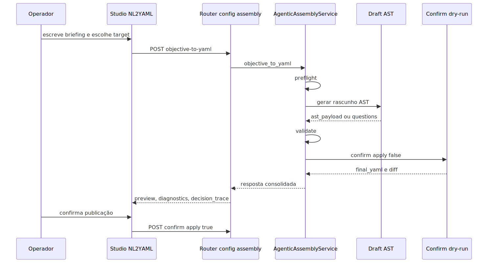

# Tutorial 101 e manual técnico, executivo, comercial e estratégico: NL2YAML

## 1. O que é esta feature

NL2YAML, nesta plataforma, é a capacidade de transformar um objetivo escrito em linguagem natural em um YAML governado do ecossistema agentic, sem pular a esteira oficial de validação, confirmação e publicação.

O ponto central é este: o sistema não recebe um texto e cospe um arquivo arbitrário. Ele converte o objetivo em uma estrutura intermediária validável, passa por checagens de prontidão, produz um rascunho AST, valida esse rascunho contra o contrato oficial e só depois monta o YAML final.

Em linguagem simples, NL2YAML aqui é um tradutor assistido com freios de engenharia. Ele ajuda a sair do briefing para a configuração, mas não autoriza atalhos frágeis.

## 2. Que problema ela resolve

Sem essa feature, a criação de workflows e supervisores agentic tende a cair em um dos dois extremos ruins.

O primeiro extremo é a edição manual, que exige conhecimento alto da sintaxe e torna a criação lenta, frágil e dependente de telas técnicas.

O segundo extremo é a geração automática solta, em que um modelo produz YAML sem governança semântica, sem diff confiável, sem perguntas de clarificação e sem caminho controlado de publicação.

NL2YAML existe para resolver exatamente essa tensão: acelerar a criação sem abrir mão de contrato, validação e controle operacional.

## 3. Visão conceitual

Conceitualmente, NL2YAML é um pipeline AST-first com interface de negócio na frente e contrato técnico forte atrás.

Isso significa que o texto do usuário não vira YAML direto. Primeiro ele vira uma representação estruturada do documento agentic. Depois essa representação é validada e compilada até chegar a um YAML final governado.

Essa decisão importa porque evita tratar YAML e AST como duas verdades independentes. O fluxo real do produto assume que o documento tipado é a base da consistência e que o YAML final é um artefato controlado desse processo.

## 4. Visão tática

Taticamente, NL2YAML serve melhor em cenários como estes.

- quando um consultor ou operador sabe descrever o resultado desejado, mas não domina a sintaxe interna do YAML;
- quando um time precisa produzir um primeiro draft rápido para revisão técnica posterior;
- quando o objetivo envolve ambiguidade natural e a plataforma precisa devolver perguntas concretas em vez de inventar resposta;
- quando é importante separar preview de publicação;
- quando o arquivo final precisa ser salvo apenas dentro da área governada de configuração.

Ele serve menos para casos em que o time já tem um AST totalmente definido e deseja apenas aplicar uma alteração técnica direta, porque aí o modo administrativo especializado tende a ser mais eficiente.

## 5. Visão técnica

Tecnicamente, o núcleo do NL2YAML está no método `objective_to_yaml` do serviço de assembly agentic. Esse método encadeia um fluxo fixo e comprovado por testes.

1. `preflight`
2. `draft`
3. `validate`
4. `confirm` em dry-run

O endpoint público desse fluxo é `POST /config/assembly/objective-to-yaml`, exposto pelo router de config assembly.

A experiência de usuário final fica em um Studio próprio, com briefing, respostas para perguntas pendentes, preview do YAML, diff, AST retornado, rastro de decisão e publicação assistida.

## 6. Visão executiva

Para liderança, NL2YAML reduz o atrito entre intenção de negócio e configuração operacional. Ele diminui a dependência da edição técnica manual para montar a primeira versão de um fluxo, sem abrir mão de governança.

Na prática, isso reduz tempo de preparação, melhora a previsibilidade de revisão e torna mais simples criar um processo assistido entre áreas funcionais e áreas técnicas.

## 7. Visão comercial

Comercialmente, essa feature ajuda a mostrar que a plataforma não depende exclusivamente de especialistas em YAML para sair do zero. Um briefing bem escrito já permite iniciar a configuração com perguntas guiadas, preview de saída e publicação controlada.

O benefício vendável não é “qualquer pessoa cria qualquer automação sozinha”. O benefício real é: a plataforma aproxima a linguagem do negócio da configuração técnica, com guardrails suficientes para reduzir erro e retrabalho.

## 8. Visão estratégica

Estratégicamente, NL2YAML fortalece a proposta da plataforma como sistema YAML-first governado por assembly, e não como simples editor de arquivos.

Ele cria uma camada de tradução entre intenção humana e contrato técnico. Isso aumenta reutilização, reduz dependência de interface técnica para o primeiro passo e prepara o produto para experiências assistidas mais avançadas sem abandonar a disciplina de validação.

## 9. Conceitos necessários para entender

### 9.1. AST-first

Significa que a plataforma não trata o YAML final como único contrato interno. O texto do usuário vira primeiro uma estrutura intermediária tipada e validável. Isso é o que permite detectar ambiguidade, bloquear publicação e gerar diff governado antes do arquivo final.

### 9.2. Preflight

É a checagem de prontidão antes da geração. O sistema verifica se o ambiente, o target e o modo escolhido estão prontos para continuar com segurança.

### 9.3. Draft

É a etapa que monta o rascunho AST a partir do briefing. Esse rascunho ainda pode conter lacunas. Quando isso acontece, o sistema devolve perguntas em vez de avançar automaticamente.

### 9.4. Validate

É a validação semântica forte do payload AST. Aqui o sistema confere se a estrutura montada realmente respeita o contrato canônico do target escolhido.

### 9.5. Confirm

É a etapa que compila o documento, faz merge com o `base_yaml`, gera o YAML final e, opcionalmente, persiste o arquivo.

### 9.6. `blocking_stage`

É o indicador oficial do estágio onde o fluxo travou. Os valores confirmados no contrato são `preflight`, `draft`, `validate` e `confirm`.

### 9.7. `questions`

São perguntas estruturadas que a API devolve quando ainda faltam decisões humanas obrigatórias para fechar a configuração.

### 9.8. `decision_trace`

É o rastro simples das decisões críticas do fluxo, como alvo resolvido, estratégia aplicada e tools efetivamente inferidas ou confirmadas.

### 9.9. `chosen_tools`

É a lista de ferramentas que o fluxo identificou no resultado gerado, com origem e caminhos lógicos. Isso ajuda revisão e suporte.

### 9.10. `base_yaml`

É o YAML de partida usado como contexto e como base de merge. Ele não é enfeite. Ele altera o que o sistema considera disponível, permitido e já existente.

## 10. Como a feature funciona por dentro

O fluxo começa quando o cliente chama `POST /config/assembly/objective-to-yaml` com um briefing, um e-mail operacional, um target e, opcionalmente, um `base_yaml`, um template e constraints de geração.

O router resolve ou injeta `correlation_id`, checa feature flag, valida permissão `config.generate` e delega o processamento para o serviço principal.

No serviço, o primeiro passo é resolver o YAML base e o target efetivo. Se o target vier como `auto`, o sistema tenta classificá-lo com base em sinais do briefing. Se a classificação continuar ambígua, o fluxo não inventa. Ele produz pergunta de clarificação.

Depois disso vem o preflight. Se o preflight disser que o ambiente não está pronto, o fluxo retorna bloqueio ainda antes do draft.

Se o preflight liberar, o draft tenta montar o documento AST. Esse draft pode vir por heurística, por LLM estruturado ou por modo automático com fallback heurístico explicitamente autorizado.

Se o draft produzir perguntas obrigatórias ou se a própria validação preliminar do draft falhar, o fluxo para nesse ponto e devolve `questions`, `diagnostics` e `blocking_stage=draft`.

Se o draft ficar consistente, o sistema chama `validate` para a validação semântica forte. Só se essa etapa passar é que a confirmação em dry-run acontece.

Na confirmação em dry-run, o serviço compila o fragmento governado, faz merge com o `base_yaml`, aplica carimbo de hash governado e produz `final_yaml`, `final_yaml_text` e `diff_preview`.

## 11. Divisão em etapas ou submódulos

### 11.1. Boundary HTTP oficial

Esse submódulo expõe o endpoint público, injeta correlação e traduz falhas de validação para respostas HTTP utilizáveis.

Valor entregue: a feature fica disponível como operação formal da API, não como chamada interna solta.

### 11.2. Resolução de target

Esse submódulo decide se o objetivo representa melhor um workflow, um supervisor clássico ou um deepagent supervisor.

Valor entregue: o produto não exige que todo usuário já saiba a espinha dorsal correta antes de começar.

### 11.3. Geração de draft

Esse submódulo tenta montar a AST inicial com base no briefing, no contexto do YAML base e no catálogo de tools.

Valor entregue: aceleração inicial da criação com preservação de contexto.

### 11.4. Perguntas pendentes

Esse submódulo transforma ambiguidade em perguntas estruturadas, com opções quando aplicável.

Valor entregue: evita que o backend complete lacunas com suposições perigosas.

### 11.5. Validação semântica

Esse submódulo verifica se a AST respeita o contrato real do target e do assembly.

Valor entregue: o preview só chega à frente quando a configuração faz sentido no sistema real.

### 11.6. Confirmação e merge

Esse submódulo compila o fragmento, faz merge com a base, gera diff e produz o YAML final.

Valor entregue: o usuário deixa de revisar fragmentos abstratos e passa a revisar o documento final que realmente seria salvo.

### 11.7. Publicação assistida

Esse submódulo só entra quando o usuário decide persistir o YAML. Ele exige `output_path`, normaliza o caminho, limita a publicação à raiz governada e respeita o modo `force`.

Valor entregue: separar preview de gravação real e impedir gravação fora da área permitida.

### 11.8. Studio NL2YAML

Esse submódulo é a experiência de usuário final. Ele organiza briefing, perguntas, preview, diagnóstico, correlação e publicação guiada sem obrigar o usuário a abrir a tela técnica completa.

Valor entregue: tornar o pipeline operacionalmente acessível para quem pensa primeiro no resultado de negócio.

## 12. Fluxo principal ponta a ponta

O ponto mais importante desse diagrama é que a publicação é uma etapa separada da geração. O fluxo oficial não trata preview e persistência como a mesma coisa.

## 13. Targets suportados e por que isso importa

O contrato atual trabalha com quatro opções de target.

- `workflow`
- `agent_supervisor`
- `deepagent_supervisor`
- `auto`

O modo `auto` existe para reduzir atrito, mas não para mascarar ambiguidade. Quando o briefing ainda não diferencia bem um workflow de um supervisor ou deepagent, o parser retorna pergunta de clarificação em vez de seguir por adivinhação.

Isso importa porque a plataforma tem três espinhas dorsais com sintaxe própria. Resolver o target errado cedo demais contaminaria todo o documento final.

## 14. Modos de geração e suas diferenças

O draft aceita três modos oficiais.

### 14.1. `heuristic`

É o caminho mais determinístico. Ele é útil quando o sistema não deve depender de LLM estruturado para continuar o trabalho.

Os testes confirmam que esse modo não bloqueia o preflight apenas porque um provider estruturado específico não está disponível.

### 14.2. `llm_schema`

É o modo que usa geração estruturada por LLM com envelope JSON obrigatório. O LLM não devolve texto livre para ser interpretado depois. Ele precisa respeitar um envelope com `ast_payload` e `questions`.

Esse ponto é importante porque evita respostas vagas ou markup ambíguo do modelo.

### 14.3. `auto`

É o modo que tenta escolher a melhor estratégia. No contrato atual, o fallback heurístico não pode entrar silenciosamente por conveniência. Ele depende de opt-in explícito via constraint.

O Studio já envia essa autorização quando o operador escolhe o modo auto apropriado.

## 15. Como o LLM é usado sem perder governança

O gerador estruturado de draft não pede “qualquer YAML”. Ele monta um prompt com:

- envelope JSON esperado;
- target obrigatório;
- snapshot resumido do YAML base;
- constraints;
- catálogo compacto de tools;
- schema do target;
- schema comum;
- regras explícitas de não inventar campos e de devolver perguntas quando faltar informação.

Na prática, isso muda completamente o papel do LLM. Ele deixa de ser um gerador livre de arquivo e passa a ser um produtor supervisionado de rascunho AST dentro de um contrato fechado.

## 16. Como o Studio NL2YAML funciona

O Studio foi desenhado como uma experiência em quatro passos.

### 16.1. Passo 1: briefing e estratégia

O usuário informa o objetivo, escolhe o tipo de configuração, define o modo de geração e, se quiser, sincroniza ou cola um YAML base.

### 16.2. Passo 2: perguntas pendentes

Se a API devolver perguntas, o Studio mostra apenas as decisões que faltam para consolidar o preview. Isso evita mandar o usuário para uma tela técnica completa só para fechar uma ambiguidade pontual.

### 16.3. Passo 3: revisão do YAML final

O Studio mostra o `final_yaml_text`, os diagnósticos, o diff, o AST retornado, o target resolvido, as tools escolhidas e o `correlation_id` da execução.

### 16.4. Passo 4: publicação assistida

O Studio monta o `output_path` a partir de um destino controlado e de um slug. Ele também exige confirmação visual antes de liberar a gravação real.

Isso é relevante porque a UI não dá um campo livre irrestrito para gravar em qualquer lugar. Ela já orienta a publicação para o espaço governado.

## 17. Publicação segura e `output_path`

No backend, `apply=true` só é aceito se houver `output_path`. Esse caminho passa por normalização obrigatória.

As regras confirmadas no serviço são estas.

- o arquivo precisa ser `.yaml` ou `.yml`;
- o caminho precisa permanecer dentro de `app/yaml`;
- o backend rejeita saída fora da raiz governada;
- o `saved_path` retornado ao cliente é formatado de volta relativo ao repositório quando possível.

No frontend, a publicação assistida oferece dois destinos controlados.

- configurações do tenant em `app/yaml`
- catálogo do sistema em `app/yaml/system`

O valor prático dessa combinação é simples: a experiência de negócio facilita a publicação, mas a camada de serviço continua sendo a guardiã final do caminho de gravação.

## 18. Contratos, entradas e saídas

As entradas principais do fluxo são:

- `prompt`
- `user_email`
- `target`
- `base_yaml`
- `template_path`
- `constraints`
- `generation_mode`
- `correlation_id`

As saídas mais importantes do fluxo único são:

- `success`
- `requested_target`
- `resolved_target`
- `blocking_stage`
- `final_yaml`
- `final_yaml_text`
- `ast_payload`
- `diff_preview`
- `chosen_tools`
- `decision_trace`
- `questions`
- `diagnostics`
- `preflight_ready`
- `preflight_summary`
- `preflight_checks`
- `validation_report`
- `correlation_id`

Isso mostra que o endpoint não entrega só um arquivo final. Ele entrega também contexto operacional para entender por que o fluxo avançou, travou ou precisa de decisão adicional.

## 19. O que acontece em caso de sucesso

Quando tudo corre bem, a ordem comprovada pelos testes é esta.

1. o preflight libera o caminho;
2. o draft monta AST utilizável;
3. a validação semântica passa;
4. o confirm em dry-run gera o YAML final;
5. o cliente recebe `final_yaml_text`, diff, target resolvido, `chosen_tools` e `decision_trace`;
6. se o operador desejar, a publicação real acontece depois via confirm com `apply=true`.

O ponto importante é que preview e persistência continuam separados mesmo no caminho feliz.

## 20. O que acontece em caso de erro ou bloqueio

Os cenários principais confirmados no código são estes.

### 20.1. Bloqueio no preflight

Se o ambiente não estiver pronto, o fluxo para cedo e devolve `blocking_stage=preflight`.

### 20.2. Bloqueio no draft por perguntas pendentes

Se o rascunho depender de decisão obrigatória, o fluxo não continua para validate e confirm. Os testes confirmam esse comportamento explicitamente.

### 20.3. Bloqueio no validate

Se a AST parecer promissora, mas quebrar o contrato semântico real do target, o fluxo retorna `blocking_stage=validate`.

### 20.4. Bloqueio no confirm

Se a confirmação em dry-run não conseguir produzir um YAML final utilizável, o fluxo retorna `blocking_stage=confirm`.

### 20.5. Falha por permissão

O endpoint é protegido por permissão `config.generate`. Sem essa permissão, o fluxo não fica disponível.

### 20.6. Falha por feature flag

O boundary do assembly protege a feature por flag. Se o assembly agentic estiver desligado no ambiente, a API não deve simular disponibilidade.

### 20.7. Falha de publicação

Se `apply=true` vier sem `output_path`, se o caminho sair de `app/yaml` ou se houver conflito de escrita sem `force`, a gravação real é bloqueada.

## 21. Observabilidade e diagnóstico

NL2YAML foi desenhado para ser observável em vez de “mágico”.

Os elementos de diagnóstico mais úteis são:

- `correlation_id`
- `blocking_stage`
- `preflight_checks`
- `diagnostics`
- `validation_report`
- `decision_trace`
- `chosen_tools`
- `diff_preview`

Na UI, o operador já consegue baixar o log correlacionado e também o `system.log`, o que mostra que a experiência foi pensada para operação real e não só para uso feliz.

## 22. Vantagens práticas

As vantagens reais confirmadas pelo desenho do produto são estas.

- reduz dependência de edição manual para montar a primeira versão do YAML;
- separa geração, clarificação, revisão e publicação;
- transforma ambiguidade em perguntas estruturadas;
- mantém a validação no contrato oficial do assembly;
- preserva rastro de decisão e correlação operacional;
- limita a gravação à raiz governada de YAML;
- permite começar pelo modo de negócio e migrar para o modo técnico quando necessário;
- oferece um caminho de preview antes de qualquer persistência.

## 23. Limites e pegadinhas

Também existem limites importantes.

- NL2YAML não elimina a necessidade de revisão técnica quando o caso é sensível ou complexo.
- Um briefing ruim continua produzindo ambiguidade, perguntas ou bloqueios.
- `auto` não é licença para fallback escondido; o opt-in precisa existir.
- O Studio facilita a publicação, mas o backend continua sendo a autoridade final do caminho salvo.
- O fato de existir `final_yaml_text` não significa que o arquivo já foi salvo.
- O produto aproxima linguagem de negócio da configuração, mas não substitui o contrato canônico do sistema.

## 24. Exemplos práticos guiados

### 24.1. Caso feliz para workflow

Cenário: um usuário descreve um fluxo de vendas consultivas e escolhe `workflow`.

O que acontece: a API gera AST válida, confirma em dry-run, devolve `selected_workflow`, o YAML final textual, o diff, a tool escolhida e o rastro de decisão.

Valor para o negócio: uma primeira configuração aparece rapidamente sem a pessoa precisar abrir a tela técnica completa.

### 24.2. Caso com ambiguidade de tool

Cenário: o briefing exige uma tool obrigatória, mas o sistema não consegue escolher com segurança qual delas usar.

O que acontece: o fluxo para no draft, devolve pergunta obrigatória e não chama validate nem confirm.

Valor para operação: a plataforma prefere pedir decisão ao operador a publicar um YAML incorreto.

### 24.3. Caso com fallback heurístico explícito

Cenário: o operador escolhe modo `auto` com fallback heurístico autorizado.

O que acontece: a UI envia a constraint apropriada e o preflight deixa claro que esse fallback foi autorizado conscientemente.

Valor técnico: o comportamento não fica escondido nem “mágico” para suporte e auditoria.

### 24.4. Caso de publicação assistida

Cenário: o preview já está pronto e o operador quer salvar o resultado no catálogo do sistema.

O que acontece: a UI calcula o caminho em `app/yaml/system`, exige confirmação visual e só então chama confirm com `apply=true`.

Valor operacional: reduz risco de gravação em local incorreto.

## 25. Explicação 101

Imagine que o usuário escreveu um pedido como se estivesse explicando para um consultor: “quero um fluxo que faça triagem, consulte o CRM e finalize com um resumo”.

Em um sistema ingênuo, isso viraria um YAML direto, com risco alto de erro. Nesta plataforma, o pedido passa por uma equipe invisível de verificação.

Primeiro alguém checa se o pedido está pronto. Depois alguém monta uma planta técnica inicial. Depois outro passo revisa se essa planta respeita as regras da casa. Só no fim essa planta vira o arquivo final. E salvar o arquivo é uma decisão separada.

Essa é a lógica do NL2YAML aqui.

## 26. Troubleshooting

### 26.1. O endpoint não gera nada útil

Sintoma: o fluxo responde com bloqueio cedo demais.

Causa provável: o briefing está vazio, a feature flag não está ativa, falta permissão ou o target ainda está ambíguo.

### 26.2. O fluxo sempre devolve perguntas

Sintoma: o preview final nunca aparece.

Causa provável: faltam decisões obrigatórias no briefing, especialmente sobre tools, estrutura do fluxo ou contexto do target.

### 26.3. O preview aparece, mas a publicação falha

Sintoma: a UI mostra YAML final, porém o arquivo não é salvo.

Causa provável: `output_path` ausente, caminho fora de `app/yaml`, conflito de escrita ou confirmação visual não marcada.

### 26.4. O resultado do modo auto surpreende a equipe

Sintoma: o comportamento parece ter mudado entre tentativas.

Causa provável: diferença entre `llm_schema`, `heuristic` e `auto` com fallback explícito, além da qualidade do `base_yaml` e do próprio briefing.

### 26.5. O diagnóstico técnico parece complexo demais

Sintoma: a área usuária não entende o retorno.

Causa provável: a equipe está olhando o AST bruto em vez de começar por `blocking_stage`, `questions`, `preflight_summary`, `decision_trace` e `validation_report`.

## 27. Impacto técnico

Tecnicamente, NL2YAML reduz o salto bruto entre briefing e configuração persistida. Ele encapsula complexidade em um pipeline com estágios explícitos, melhora auditabilidade com correlação e bloqueios formais e reduz a chance de YAML manual inconsistente entrar no repositório sem revisão adequada.

## 28. Impacto executivo

Executivamente, ele encurta o caminho entre intenção de negócio e prototipação operacional. Isso melhora velocidade de preparação, reduz gargalo nas etapas iniciais de modelagem e torna a colaboração entre times técnicos e funcionais menos dependente de tradução manual.

## 29. Impacto comercial

Comercialmente, NL2YAML ajuda a demonstrar maturidade de produto. Em vez de vender uma promessa genérica de “IA que escreve configuração”, o sistema mostra uma esteira assistida com perguntas guiadas, preview revisável, diff e publicação controlada.

Isso responde melhor a clientes que querem produtividade, mas não aceitam improviso técnico.

## 30. Impacto estratégico

Estratégicamente, a feature prepara a plataforma para experiências assistidas de alto nível sem abandonar o núcleo YAML-first e AST-governado. Ela reforça a ideia de que a plataforma pode receber intenção em linguagem natural, mas continua respondendo dentro de contratos fortes e auditáveis.

## 31. Como colocar para funcionar

O caminho confirmado no código para usar NL2YAML exige:

- API ativa com o router de config assembly disponível;
- feature flag do assembly habilitada no ambiente;
- usuário com permissão `config.generate`;
- briefing não vazio;
- target explícito ou passível de classificação;
- quando aplicável, `base_yaml` coerente com o contexto do tenant;
- se houver gravação real, `output_path` governado dentro de `app/yaml`.

Na UI, o uso prático é:

1. abrir o Studio NL2YAML;
2. informar briefing, target e modo de geração;
3. revisar perguntas pendentes, se houver;
4. revisar preview, diff, diagnóstico e correlação;
5. publicar apenas depois da confirmação visual.

## 32. Checklist de entendimento

- Entendi que NL2YAML aqui é AST-first e governado.
- Entendi que o fluxo único roda `preflight -> draft -> validate -> confirm`.
- Entendi que preview e publicação são etapas separadas.
- Entendi que `questions` existem para evitar adivinhação do backend.
- Entendi o papel de `blocking_stage`.
- Entendi a diferença entre `heuristic`, `llm_schema` e `auto`.
- Entendi que `auto` só pode usar fallback heurístico com opt-in explícito.
- Entendi que o `output_path` real precisa ficar dentro de `app/yaml`.
- Entendi que o Studio foi feito para operação guiada, não para edição irrestrita.

## 33. Diagramas

### 33.1. Sequência macro do fluxo único

Esse diagrama mostra a separação entre gerar e persistir. A publicação só acontece depois de o preview já existir.

## 34. Evidências no código

- `src/api/routers/config_assembly_router.py`
  - Motivo da leitura: endpoint oficial de objective-to-yaml.
  - Comportamento confirmado: permissão `config.generate`, injeção de `correlation_id`, logs de início e fim, resposta consolidada e tradução de erros HTTP.

- `src/config/agentic_assembly/assembly_service.py`
  - Motivo da leitura: pipeline canônico do NL2YAML.
  - Comportamento confirmado: ordem `preflight -> draft -> validate -> confirm`, bloqueios por estágio, merge governado, diff preview e publicação com `apply=true`.

- `src/config/agentic_assembly/models.py`
  - Motivo da leitura: contrato tipado do fluxo.
  - Comportamento confirmado: request, response, `blocking_stage`, `questions`, `chosen_tools`, `decision_trace`, `validation_report` e contratos de preflight/confirm.

- `src/config/agentic_assembly/nl/intent_parser.py`
  - Motivo da leitura: resolução do target e geração de perguntas de clarificação.
  - Comportamento confirmado: classificação de `workflow`, `agent_supervisor` e `deepagent_supervisor`, com retorno explícito de ambiguidade.

- `src/config/agentic_assembly/nl/llm_draft_generator.py`
  - Motivo da leitura: uso governado de LLM no draft.
  - Comportamento confirmado: envelope JSON obrigatório, schemas do target, regras de não inventar campos e obrigação de devolver perguntas quando faltar contexto.

- `app/ui/static/ui-plataforma-nl2yaml-studio.html`
  - Motivo da leitura: experiência funcional do usuário final.
  - Comportamento confirmado: briefing, seleção de target, perguntas pendentes, preview, correlação, publicação assistida e diagnóstico técnico.

- `app/ui/static/js/objective-yaml-studio.js`
  - Motivo da leitura: lógica operacional do Studio.
  - Comportamento confirmado: chamada a `/config/assembly/objective-to-yaml`, consolidação de perguntas via confirm, cálculo de `output_path`, confirmação visual e publicação final.

- `tests/unit/test_agentic_assembly_service.py`
  - Motivo da leitura: provas do comportamento do pipeline.
  - Comportamento confirmado: ordem de etapas, bloqueio em draft com perguntas, sucesso em modo heurístico e autorização explícita de fallback no modo auto.

- `tests/frontend/nl2yaml_studio_contract.test.js`
  - Motivo da leitura: contrato funcional da UI.
  - Comportamento confirmado: preenchimento do preview, liberação de publicação apenas com AST utilizável, reaproveitamento de autenticação do YAML e opt-in explícito do fallback heurístico.

- `tests/unit/test_config_assembly_router_http.py`
  - Motivo da leitura: boundary HTTP do endpoint.
  - Comportamento confirmado: serialização de `final_yaml_text`, propagação de `correlation_id` e resposta com rastro de decisão e tools escolhidas.

- `tests/unit/test_agentic_assembly_runtime_guardrails.py`
  - Motivo da leitura: prova do fluxo HTTP real.
  - Comportamento confirmado: retorno válido para workflow, `blocking_stage` nulo e presença de `decision_trace` no caminho feliz.
