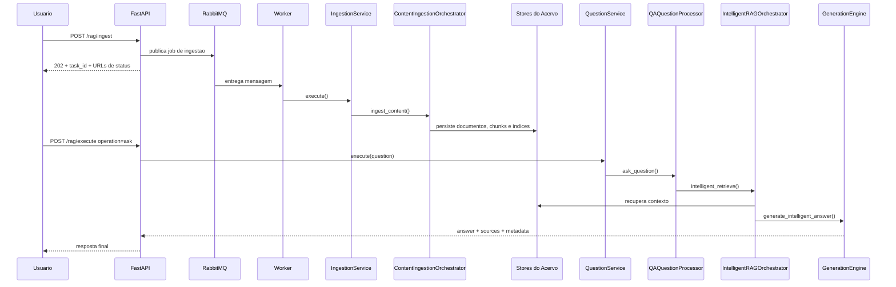
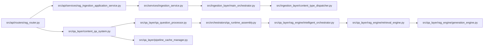
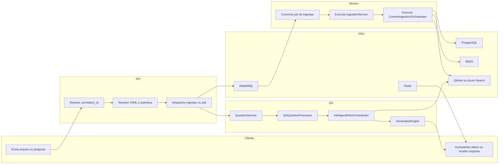

# Tutorial 101: Processo Completo de Ingestão e RAG

Se você acabou de entrar neste projeto, este é o mapa mais direto para
entender como o acervo nasce e como ele depois vira resposta para uma
pergunta. A ideia aqui não é resumir os manuais donos, e sim costurar o
fluxo inteiro de ponta a ponta, do jeito que o runtime faz hoje no
código.

## 1) Para quem é este tutorial

Este tutorial foi escrito para:

- desenvolvedor júnior que precisa seguir o fio do request até o efeito
  final;
- consultor júnior que precisa entender o que realmente acontece antes
  de prometer comportamento para usuário final;
- time de operação que quer saber onde observar, cancelar, validar e
  depurar.

Ao final, você vai conseguir:

- localizar o entry point real da ingestão e o entry point real do RAG;
- entender como o YAML vira execução nos dois fluxos;
- diferenciar API, worker, orquestradores, engines, stores e cache;
- saber quais peças definem a ordem das etapas;
- identificar o menor caminho para rodar local e validar com segurança.

## 2) Dicionário rápido

- Ingestão: pipeline que transforma fontes e arquivos em acervo
  pesquisável.
- RAG: pipeline que recupera contexto e gera resposta com base nesse
  acervo.
- Boundary HTTP: ponto de entrada da API, onde entram request,
  autenticação, rate limit e correlation_id.
- Worker: processo separado que executa trabalho pesado fora do request
  HTTP.
- Orquestrador: componente que coordena etapas e delega trabalho para
  partes menores.
- Dispatcher: peça que decide qual caminho seguir a partir do tipo de
  conteúdo ou do tipo de operação.
- Vector store: banco de busca vetorial usado para recuperar chunks por
  similaridade.
- BM25: índice lexical usado para busca textual e híbrida.
- Pipeline cache: cache global de pipelines de QA por hash do YAML.
- Correlation ID: identificador único que costura logs, status e
  execução ponta a ponta.

## 3) Conceito em linguagem simples

Pense na plataforma como uma biblioteca com duas metades.

Na primeira metade, alguém traz caixas com livros, planilhas, páginas,
PDFs e outros materiais. A ingestão faz o trabalho de abrir essas
caixas, separar o conteúdo, catalogar, resumir em pedaços pesquisáveis e
guardar tudo nas estantes certas.

Na segunda metade, chega uma pergunta.
O RAG não responde de cabeça. Ele primeiro consulta o catálogo, escolhe
as estantes mais relevantes, pega os trechos certos, avalia se eles são
suficientes e só então monta a resposta final.

Em linguagem prática:

- ingestão é o processo de preparar o acervo;
- RAG é o processo de consultar o acervo preparado;
- se a ingestão falha, o RAG não tem base boa para responder;
- se o RAG falha, o problema pode estar na pergunta, no retrieval, no
  LLM, no cache ou no acervo preparado antes.

## 4) Mapa de navegação do repo

- src/api/routers: fronteiras HTTP reais de ingestão, execução RAG,
  cancelamento e status; mexa aqui quando a mudança for contrato web.
- src/api/services: serviços de aplicação do boundary HTTP; mexa aqui
  quando o request precisar ser convertido em comando executável.
- src/services: serviços de domínio/aplicação compartilhados, como
  IngestionService e QuestionService; mexa aqui quando o fluxo de negócio
  mudar.
- src/ingestion_layer: núcleo da ingestão documental; mexa aqui quando a
  mudança for pipeline, dispatcher, processor, engine ou persistência do
  acervo.
- src/qa_layer: núcleo do RAG moderno; mexa aqui quando a mudança for
  query, retrieval, geração, cache semântico ou montagem da resposta.
- src/orchestrators: montagens neutras e assemblies, como
  QARuntimeAssembly; mexa aqui quando a seleção de runtime ou composição
  mudar.
- app/runners: processos reais da API, worker e scheduler; mexa aqui
  quando o bootstrap de processo mudar.
- app/yaml e arquivos YAML resolvidos pelo runtime: contrato de
  configuração; não mova chaves por conveniência.
- tests/unit, tests/integration e tests/smoke: proteção contra
  regressão; mexa aqui junto com qualquer mudança de comportamento.
- docs: documentos donos e tutoriais; atualize aqui quando o runtime
  mudar de verdade.

Guarda-corpos importantes:

- não coloque regra de negócio da ingestão direto no router;
- não coloque geração de resposta direto no router do RAG;
- não trate worker como se fosse extensão síncrona da API;
- não crie caminho paralelo fora de IngestionService,
  ContentIngestionOrchestrator, QuestionService e QAQuestionProcessor se
  o fluxo oficial já existe.

## 5) Mapa visual 1: fluxo macro

```mermaid
flowchart LR
    U[Usuario ou UI] --> API[FastAPI]

    subgraph Ingestao
        API --> ING_ROUTE[/POST /rag/ingest]
        ING_ROUTE --> ING_APP[Ingestion HTTP Application Service]
        ING_APP --> QUEUE[RabbitMQ]
        QUEUE --> WORKER[Worker + Dramatiq]
        WORKER --> ING_SVC[IngestionService]
        ING_SVC --> ING_ORCH[ContentIngestionOrchestrator]
        ING_ORCH --> PROC[Processors e Engines]
        PROC --> ACERVO[PostgreSQL + BM25 + Vector Store]
    end

    subgraph RAG
        API --> RAG_ROUTE[/POST /rag/execute operation=ask]
        RAG_ROUTE --> Q_SVC[QuestionService]
        Q_SVC --> QA_SYS[ContentQASystem]
        QA_SYS --> QA_PROC[QAQuestionProcessor]
        QA_PROC --> INTEL[IntelligentRAGOrchestrator]
        INTEL --> RET[RetrievalEngine]
        RET --> ACERVO
        INTEL --> GEN[GenerationEngine]
        GEN --> RESP[Resposta]
    end

    RESP --> U
```

## 6) Mapa visual 2: quem chama quem



## 7) Mapa visual 3: camadas

```mermaid
flowchart TB
    subgraph Entry points
        E1[POST /rag/ingest]
        E2[POST /rag/execute]
        E3[/status e /ingestion-runs]
    end

    subgraph Orquestracao
        O1[IngestionHttpApplicationService]
        O2[IngestionService]
        O3[ContentIngestionOrchestrator]
        O4[QuestionService]
        O5[ContentQASystem]
        O6[QAQuestionProcessor]
        O7[QARuntimeAssembly]
        O8[IntelligentRAGOrchestrator]
    end

    subgraph Tecnicas e engines
        T1[ContentTypeDispatcher]
        T2[PDFContentProcessor]
        T3[PdfExtractionState]
        T4[QueryRewriter]
        T5[QueryAnalyzer]
        T6[AdaptiveQueryRouter]
        T7[RetrievalEngine]
        T8[GenerationEngine]
    end

    subgraph Dados e observabilidade
        D1[PostgreSQL]
        D2[BM25]
        D3[Qdrant ou Azure Search]
        D4[Redis]
        D5[PipelineCacheManager]
        D6[Logs com correlation_id]
    end

    E1 --> O1 --> O2 --> O3 --> T1 --> D1
    T1 --> D2
    T1 --> D3
    E2 --> O4 --> O5 --> O6 --> O7 --> O8 --> T7 --> D3
    O8 --> T8 --> D6
    O2 --> D6
    O4 --> D5
    E3 --> D4
```

## 8) Mapa visual 4: componentes



## 9) Mapa visual 5: swimlane funcional cruzado



## 10) Onde isso aparece neste projeto

- src/api/routers/rag_ingestion_router.py expõe a rota dedicada
  POST /rag/ingest.
- src/api/routers/rag_operations_router.py expõe o dispatcher unificado
  POST /rag/execute para ask, ingest, delete e ETL.
- src/api/routers/rag_router.py reúne helpers, composição e delegação
  para os subrouters.
- src/api/services/rag_ingestion_application_service.py orquestra o lado
  HTTP da ingestão antes do job ir para o worker.
- src/services/ingestion_service.py decide entre execução normal e
  fan-out por documento.
- src/ingestion_layer/main_orchestrator.py é o centro do pipeline
  documental.
- src/ingestion_layer/processors/pdf_processor.py e a família
  pdf_pipeline tratam o caso mais complexo da ingestão.
- src/services/question_service.py é a porta de aplicação da pergunta.
- src/qa_layer/content_qa_system.py é a fachada de QA usada pelos
  chamadores.
- src/qa_layer/qa_question_processor.py executa o pipeline de pergunta e
  resposta.
- src/orchestrators/qa_runtime_assembly.py valida e seleciona o runtime
  moderno.
- src/qa_layer/rag_engine/intelligent_orchestrator.py concentra o
  pipeline RAG avançado.
- src/qa_layer/rag_engine/retrieval_engine.py concentra a recuperação de
  contexto.
- src/qa_layer/rag_engine/generation_engine.py centraliza a geração da
  resposta final.

## 11) Caminho real no código

- src/api/routers/rag_ingestion_router.py: define a rota dedicada de
  ingestão.
- src/api/routers/rag_operations_router.py: define o dispatcher unificado
  do domínio RAG.
- src/api/routers/rag_router.py: reúne decorators, compose routers e
  helpers compartilhados.
- src/api/routers/rag_runtime_ingestion_compat.py: define o caminho real
  que transforma um request de ingestão em job agendado.
- src/api/routers/rag_runtime_operations_compat.py: define o caminho real
  da operação ask e de outras operações do dispatcher.
- src/services/ingestion_service.py: traduz YAML em IngestionRequest,
  decide fan-out e aciona o orquestrador.
- src/ingestion_layer/main_orchestrator.py: executa a ingestão modular e
  coordena mixins, factories e persistência.
- src/ingestion_layer/content_type_dispatcher.py: decide qual pipeline de
  conteúdo rodar.
- src/services/question_service.py: inicializa o sistema de QA, aplica
  timeout, telemetria e formata o payload.
- src/qa_layer/content_qa_system.py: fachada principal do runtime de QA.
- src/qa_layer/qa_question_processor.py: valida a pergunta, escolhe o
  pipeline e trata fontes, diagnósticos e memória.
- src/orchestrators/qa_runtime_assembly.py: falha cedo quando o runtime
  moderno não está pronto.
- src/qa_layer/rag_engine/intelligent_orchestrator.py: ordena rewrite,
  routing, retrieval, ACL e assembly final.
- src/qa_layer/rag_engine/retrieval_engine.py: concentra retrievers,
  hybrid mode, FTS, BM25 e query expansion.
- src/qa_layer/rag_engine/generation_engine.py: transforma contexto em
  prompt e chama o LLM com retry externo.

## 12) Fluxo passo a passo

### 12.1 Ingestão, do básico ao avançado

1. O cliente chama POST /rag/ingest.
2. O boundary HTTP resolve o correlation_id, autentica e resolve o YAML.
3. O lado HTTP da ingestão monta um task_id e escolhe o modo suportado.
4. O request é normalizado, inclusive com document_parallelism.
5. O job é publicado no fluxo assíncrono do worker.
6. O worker consome a mensagem e reaproveita o mesmo correlation_id.
7. IngestionService transforma o YAML em IngestionRequest.
8. IngestionService decide se fica no caminho normal ou se monta plano de
   fan-out por documento.
9. ContentIngestionOrchestrator coordena a ingestão real.
10. ContentTypeDispatcher escolhe pipelines por tipo de conteúdo.
11. No caso PDF, o pipeline monta stages explícitos de validação,
    OCR/preprocessamento, parsing e consolidação.
12. Os documentos processados seguem para persistência,
    telemetria e atualização da visão operacional.
13. O status terminal é refletido em /status e na leitura operacional de
    /ingestion-runs.

### 12.2 RAG, do básico ao avançado

1. O cliente chama POST /rag/execute com operation=ask.
2. O boundary resolve correlation_id, autenticação e YAML.
3. QuestionService cria ou reutiliza um ContentQASystem via
   PipelineCacheManager.
4. QuestionService aplica timeout de invocação e telemetria de alto
   nível.
5. ContentQASystem delega para QAQuestionProcessor.
6. QAQuestionProcessor valida pergunta, filtros, imagem opcional,
   access_control e modo moderno.
7. QARuntimeAssembly confirma a seleção do runtime moderno e sua
   estratégia.
8. IntelligentRAGOrchestrator executa rewrite da pergunta.
9. O orquestrador analisa a query e decide a estratégia de retrieval.
10. RetrievalEngine executa a busca com retriever, fusão e filtros.
11. Os documentos passam por AccessControlEvaluator.
12. GenerationEngine monta o contexto, renderiza o prompt e chama o LLM
    com retry externo.
13. QAQuestionProcessor normaliza fontes, diagnósticos, memória e
    evidências.
14. QuestionService devolve answer, sources, analysis, metadata e
    pipeline_diagnostics.

### 12.3 Com config ativa

Na ingestão:

- user_session.correlation_id e user_session.user_email precisam existir
  para o caminho canônico.
- ingestion e content_profiles governam o pipeline documental.
- vector_store.id é obrigatório para indexação.
- content_profiles.type_specific.pdf.processing.parsing.base.options
  governa a ordem de engines PDF.
- INGESTION_DOCUMENT_FANOUT_ENABLED governa se fan-out por documento pode
  acontecer.

No RAG:

- user_session precisa existir e conter correlation_id.
- rag_system.enabled precisa permitir o runtime moderno.
- intelligent_pipeline.enabled governa o pipeline inteligente.
- qa_system governa template, comportamento e timeout derivados.
- vector_store.id e o provider de LLM precisam estar resolvidos no YAML.

### 12.4 No estado atual do código

- a rota dedicada de ingestão existe em POST /rag/ingest.
- a rota principal observada para pergunta é o dispatcher
  POST /rag/execute com operation=ask.
- uma rota pública dedicada POST /rag/ask não foi encontrada no código
  analisado.
- ingestão e ETL rodam no worker oficial com RabbitMQ e Dramatiq.
- o RAG principal roda no processo HTTP, sem depender do worker para o
  caso normal de pergunta.
- o pipeline moderno de QA falha fechado se não puder ser ativado.

## 13) Status: está pronto? quanto está pronto?

<!-- markdownlint-disable MD013 -->

| Área | Evidência | Status | Impacto prático | Próximo passo mínimo |
| --- | --- | --- | --- | --- |
| Boundary de ingestão | src/api/routers/rag_ingestion_router.py e src/api/routers/rag_router.py | pronto | a entrada HTTP dedicada está clara e estável | manter contrato OpenAPI alinhado |
| Agendamento assíncrono de ingestão | src/api/routers/rag_runtime_ingestion_compat.py e app/runners/worker_runner.py | pronto | a API devolve rápido e o worker assume o processamento | reforçar testes e2e com infraestrutura real quando necessário |
| Serviço de ingestão | src/services/ingestion_service.py | pronto | decide request interna, fan-out e análise final | seguir protegendo mudanças com testes focados |
| Orquestração documental | src/ingestion_layer/main_orchestrator.py | pronto | coordena pipeline modular real | evitar bypasss locais em novos tipos |
| Pipeline PDF modular | src/ingestion_layer/processors/pdf_processor.py e família pdf_pipeline | pronto | PDF é o caso avançado e já tem esteira própria | manter matriz de engines e observabilidade |
| Persistência do acervo | src/ingestion_layer/document_persistence_manager.py | pronto | acervo vive de forma sincronizada entre PostgreSQL, BM25 e vector store | não quebrar governança de vector_store.if_exists |
| Boundary de pergunta | src/api/routers/rag_operations_router.py e src/api/routers/rag_runtime_operations_compat.py | pronto | rota principal de ask é o dispatcher unificado | evitar documentar rota dedicada inexistente |
| QuestionService | src/services/question_service.py | pronto | padroniza timeout, cache e payload final | manter enriquecimento de fontes e telemetria |
| Runtime moderno de QA | src/orchestrators/qa_runtime_assembly.py e src/qa_layer/content_qa_system.py | pronto | o sistema falha cedo quando o runtime moderno não está disponível | manter fail-closed |
| Pipeline inteligente de retrieval | src/qa_layer/rag_engine/intelligent_orchestrator.py e src/qa_layer/rag_engine/retrieval_engine.py | pronto | há análise, roteamento, retrievers e ACL antes da resposta | manter cobertura de lógica de decisão |
| Geração da resposta | src/qa_layer/rag_engine/generation_engine.py | pronto | prompt e chamada ao LLM já têm retry externo e formatação de fontes | proteger mudanças de prompt e citações |
| Cache de pipeline QA | src/qa_layer/pipeline_cache_manager.py | pronto | reduz custo de inicialização por hash de YAML | monitorar invalidação global |
| Rota pública dedicada de ask | Não encontrado no código analisado | ausente | documentação ou integração que assuma /rag/ask pode ficar errada | usar /rag/execute com operation=ask |
| Testes e2e ponta a ponta reais | tests/smoke/test_rag_ingestion_real_e2e.py e matriz de infraestrutura | parcial | existe trilha real, mas nem tudo é coberto por um único teste fim a fim | manter suites dedicadas por domínio |

<!-- markdownlint-enable MD013 -->

## 14) Como colocar para funcionar

### Passo 0: pré-requisitos reais

Com base no código e no bootstrap observado, você precisa de:

- Python na .venv;
- FASTAPI_PORT definido no ambiente; no .env atual ele está em 5555;
- infraestrutura obrigatória validável pelo preflight da API e do
  worker;
- RabbitMQ para ingestão assíncrona;
- Redis para status, coordenação e sinais operacionais;
- PostgreSQL e store do acervo;
- um vector store configurado, como Qdrant ou Azure Search;
- credenciais válidas para o provider LLM usado pelo runtime de QA.

### Passo 1: preparar o ambiente local

- Use a .venv do repositório.
- O launcher versionado do projeto é ./run.sh.
- Ele falha se a .venv não estiver pronta.

### Passo 2: subir os processos corretos

Para trabalhar com ingestão e RAG no caminho mais próximo do real:

- `./run.sh +a +w` sobe API e worker.
- `./run.sh +a +w +s` sobe API, worker e scheduler.

O que eu espero ver:

- a API sobe com app path src.api.service_api:app;
- o worker emite markers de prontidão, incluindo WORKER_READY;
- o bootstrap valida infraestrutura obrigatória antes de declarar o
  processo pronto.

### Passo 3: validar a API local

- A porta vem de FASTAPI_PORT.
- No .env atual, a evidência aponta FASTAPI_PORT=5555.
- Abra /docs da aplicação e confirme que o boundary HTTP subiu.

Se a porta ficar presa após várias rodadas:

- mate o processo na porta configurada com sudo fuser -k 5555/tcp;
- confirme com sudo lsof -i :5555;
- só depois suba a API de novo.

### Passo 4: executar ingestão do jeito oficial

- Use POST /rag/ingest quando o foco for ingestão dedicada.
- A resposta esperada é 202 com task_id, correlation_id, polling_url,
  stream_url e cancel_url.
- O trabalho pesado deve seguir para o worker, não ficar preso no
  request HTTP.

O que validar:

- task_id retornado;
- correlation_id consistente;
- progresso visível em /api/v1/status/{task_id} ou stream de status;
- estado final refletido também nos read models operacionais.

### Passo 5: executar pergunta RAG do jeito oficial

- Use POST /rag/execute com operation=ask.
- A rota dedicada pública /rag/ask não foi encontrada no código
  analisado.

O que validar:

- answer preenchido;
- sources coerentes com a pergunta;
- analysis e pipeline_diagnostics presentes quando o pipeline fornecer;
- tempo de resposta compatível com timeout do qa_system.

### Passo 6: validar leitura operacional da ingestão

- Use /status para progresso de task;
- use /ingestion-runs para leitura mais rica do run, do pai e dos
  filhos;
- use a rota de cancelamento cooperativo quando a execução ainda estiver
  ativa.

### Passo 7: validar com a suíte oficial

Antes de qualquer execução da suíte, leia primeiro o header de
scripts/suite_de_testes_padrao.sh. Esse header é o help oficial da
suíte.

Se aparecer Permission denied ou Access denied:

- rode chmod +x ./scripts/suite_de_testes_padrao.sh;
- repita o mesmo comando.

No ciclo rápido:

- `source .venv/bin/activate &&`
  `./scripts/suite_de_testes_padrao.sh --focus-paths <tests_relacionados>`

Para leitura operacional compacta:

- `source .venv/bin/activate && ./scripts/suite_de_testes_padrao.sh --status-repo`

Para um gate backend hermético intermediário:

- `source .venv/bin/activate && ./scripts/suite_de_testes_padrao.sh --final-gate`

Para fechamento oficial:

- `source .venv/bin/activate && ./scripts/suite_de_testes_padrao.sh --all-tests`
- imediatamente depois, rode também
  `source .venv/bin/activate && ./scripts/suite_de_testes_padrao.sh --status-repo`

Obrigação operacional após cada rodada da suíte:

- abrir ./.sandbox/tmp/full_suite_latest_telemetry.json;
- conferir run.status, run.snapshotStatus, progress.totalFailures e
  steps[].status;
- se houver falha, ler o histórico de erros, o run.log e os logs dos
  steps falhos antes de concluir qualquer coisa.

### Passo 8: validar manualmente no browser

Quando a validação envolver páginas HTML reais ou auditoria visual:

- primeiro suba a API local na FASTAPI_PORT configurada;
- depois abra a interface no browser interno;
- não trate UI quebrada como defeito do fluxo antes de confirmar que a
  API está realmente escutando.

## 15) ELI5: onde coloco cada parte da feature neste projeto?

<!-- markdownlint-disable MD013 -->

| Pergunta | Resposta | Camada | Onde no repo |
| --- | --- | --- | --- |
| Quero mudar contrato HTTP da ingestão | mexa no router e no service HTTP, não no processor PDF | entrypoint | src/api/routers/rag_router.py e src/api/services/rag_ingestion_application_service.py |
| Quero mudar como a ingestão decide fan-out | mexa no IngestionService | aplicação | src/services/ingestion_service.py |
| Quero adicionar ou ajustar um tipo de conteúdo | mexa no dispatcher, datasource ou processor adequado | orquestração especializada | src/ingestion_layer/content_type_dispatcher.py e src/ingestion_layer/processors |
| Quero alterar a ordem das engines PDF | mexa na configuração e no seletor, não no router | engines e contrato | content_profiles no YAML e OrderedEngineSelector |
| Quero mudar a forma como a pergunta vira retrieval | mexa em QAQuestionProcessor e IntelligentRAGOrchestrator | QA core | src/qa_layer/qa_question_processor.py e src/qa_layer/rag_engine/intelligent_orchestrator.py |
| Quero mudar qual estratégia de retrieval é escolhida | mexa em QueryAnalyzer, AdaptiveQueryRouter ou RetrievalEngine | retrieval | src/qa_layer/rag_engine |
| Quero mudar a resposta final do LLM | mexa em GenerationEngine | geração | src/qa_layer/rag_engine/generation_engine.py |
| Quero alterar cache do runtime QA | mexa em PipelineCacheManager | infraestrutura de QA | src/qa_layer/pipeline_cache_manager.py |
| Quero mexer em ACL de documentos retornados | mexa no ponto onde AccessControlEvaluator filtra documentos | segurança de consulta | src/qa_layer/rag_engine/intelligent_orchestrator.py |
| Quero mudar o bootstrap de API ou worker | mexa em run.sh ou app/runners | processo | run.sh e app/runners |

<!-- markdownlint-enable MD013 -->

## 16) Template de mudança

### 1. Entrada: qual endpoint ou job dispara?

- Ingestão:
  - endpoint: POST /rag/ingest
  - dispatcher alternativo: POST /rag/execute com operation=ingest
  - arquivos: src/api/routers/rag_ingestion_router.py e
    src/api/routers/rag_runtime_ingestion_compat.py
- RAG:
  - endpoint principal: POST /rag/execute com operation=ask
  - arquivos: src/api/routers/rag_operations_router.py e
    src/api/routers/rag_runtime_operations_compat.py

### 2. Config: qual YAML ou env controla?

- Ingestão:
  - keys: user_session, ingestion, content_profiles, vector_store
  - env: INGESTION_DOCUMENT_FANOUT_ENABLED,
    DOCUMENT_PARALLELISM_SERVER_LIMIT
- RAG:
  - keys: user_session, rag_system, intelligent_pipeline, qa_system,
    vector_store
  - env: FASTAPI_PORT e variáveis do provider LLM

### 3. Execução: qual grafo, assembly ou orquestrador entra?

- Ingestão:
  - service: IngestionService
  - orchestrator: ContentIngestionOrchestrator
  - state relevante: IngestionRequest, progress_callback,
    correlation_id
- RAG:
  - service: QuestionService
  - assembly: QARuntimeAssembly
  - pipeline: QAQuestionProcessor -> IntelligentRAGOrchestrator

### 4. Ferramentas e técnicas: o que faz o trabalho pesado?

- Ingestão:
  - dispatcher por tipo
  - processors e datasources
  - fila ordenada de engines PDF
- RAG:
  - query rewrite
  - query analysis
  - adaptive routing
  - retrieval engine
  - generation engine

### 5. Dados: onde persiste, busca ou cacheia?

- Ingestão:
  - PostgreSQL
  - BM25
  - Qdrant ou Azure Search
  - Redis para progresso e sinais operacionais
- RAG:
  - vector store para retrieval
  - cache de pipeline em PipelineCacheManager
  - cache semântico e métricas no pipeline inteligente

### 6. Observabilidade: onde loga e como correlaciona?

- sempre via correlation_id propagado do boundary;
- ingestão usa logs, status, telemetry manager e read models
  operacionais;
- RAG usa logs, analysis, metadata, pipeline_diagnostics e telemetria da
  pergunta.

### 7. Testes: onde validar?

- ingestão:
  - tests/unit/test_ingestion_service.py
  - tests/unit/test_main_orchestrator.py
  - tests/unit/ingestion_layer/processors/test_pdf_content_processor.py
  - tests/unit/test_ingestion_job_executor.py
  - tests/smoke/test_rag_ingestion_real_e2e.py
- RAG:
  - tests/unit/test_content_qa_system.py
  - tests/unit/test_intelligent_orchestrator_logic.py
  - tests/unit/qa_layer/rag_engine/test_generation_engine.py
  - tests/unit/qa_layer/rag_engine/test_retrieval_engine_helpers.py
  - tests/integration/test_qa_system_integration.py

## 17) CUIDADO: o que NÃO fazer

- Não responda pergunta direto no router. Isso quebra separação de
  boundary e faz o contrato HTTP conhecer demais o core do QA.
- Não injete fallback implícito de engine PDF no orquestrador por nome.
  A fila é governada por configuração e contrato comum, não por if
  hardcoded.
- Não trate o worker como detalhe do request HTTP. Ingestão real depende
  de fila, status durável e cancelamento cooperativo.
- Não grave só vector store e esqueça BM25 e PostgreSQL. O acervo vivo é
  tratado como conjunto operacional sincronizado.
- Não documente ou integre uma rota pública /rag/ask sem antes provar que
  ela existe. No escopo analisado, o caminho principal de pergunta é
  /rag/execute com operation=ask.
- Não bypass o PipelineCacheManager nem o QARuntimeAssembly por
  conveniência. Você perde segurança, padronização e observabilidade.

## 18) Anti-exemplos

1. Erro comum: fazer parsing de PDF direto no router.

Por que é ruim:
mistura boundary HTTP com engine documental e destrói cancelamento,
status e reuso.

Correção segura:
deixar o router só despachar para IngestionService e o restante seguir
no ContentIngestionOrchestrator.

1. Erro comum: colocar if engine_name == X no core para pular ou chamar a
próxima engine.

Por que é ruim:
isso acopla o core a nomes concretos e quebra o contrato YAML-first da
fila ordenada.

Correção segura:
manter a ordem e a política no contrato de seleção de engines e no
contexto estruturado entre tentativas.

1. Erro comum: chamar o LLM antes do retrieval porque a pergunta parece
simples.

Por que é ruim:
troca resposta ancorada em evidência por resposta de memória do modelo.

Correção segura:
deixar QAQuestionProcessor e IntelligentRAGOrchestrator conduzirem o
pipeline retrieval-first.

1. Erro comum: construir resposta final ignorando AccessControlEvaluator.

Por que é ruim:
você pode devolver fonte ou documento que deveria ter sido negado.

Correção segura:
deixar a filtragem de ACL acontecer antes do assembly final e da geração
da resposta.

## 19) Exemplos guiados

### Exemplo 1: seguir um pedido de ingestão até o worker

Comece em src/api/routers/rag_ingestion_router.py para ver que a rota
dedicada é POST /rag/ingest.
Depois siga para src/api/routers/rag_runtime_ingestion_compat.py, onde o
request vira task_id, correlation_id e job assíncrono.
De lá, o próximo ponto relevante é src/services/ingestion_service.py,
que decide se entra no caminho normal ou no fan-out.
Por fim, entre em src/ingestion_layer/main_orchestrator.py para ver o
pipeline documental real.

### Exemplo 2: seguir uma pergunta até a resposta final

Comece em src/api/routers/rag_operations_router.py para ver que o
dispatcher principal é POST /rag/execute.
Depois leia src/api/routers/rag_runtime_operations_compat.py para ver
como operation=ask entra no QuestionService.
Siga para src/services/question_service.py e depois para
src/qa_layer/qa_question_processor.py.
Ali você vai ver o salto do boundary para o runtime de QA, incluindo
timeout, telemetry e decisão de pipeline.

### Exemplo 3: seguir a parte avançada do RAG

Abra src/qa_layer/rag_engine/intelligent_orchestrator.py no método
intelligent_retrieve.
É ali que a ordem avançada aparece de forma explícita: rewrite,
routing, retrieval, ACL e assembly final.
Depois abra src/qa_layer/rag_engine/retrieval_engine.py para ver os
retrievers e a parte híbrida.
Feche em src/qa_layer/rag_engine/generation_engine.py para ver como o
LLM é chamado com retry externo e contexto formatado.

### Exemplo 4: seguir cache e invalidação do runtime QA

Comece em src/services/question_service.py na inicialização do QA.
Depois vá para src/qa_layer/pipeline_cache_manager.py.
Ali você encontra hash de YAML, hits, misses, stores, invalidação global
e métricas do cache de pipeline.
Esse fluxo mostra por que nem toda pergunta precisa reconstruir todo o
runtime.

## 20) Erros comuns e como reconhecer

1. Sintoma observável: o request de ingestão devolve 202, mas nada
   anda.
   Hipótese: a API publicou o job, mas o worker não está pronto.
   Como confirmar: app/runners/worker_runner.py e logs WORKER_READY;
   confirme também /status e o fluxo do worker.
   Correção segura: subir API e worker, não só a API.

2. Sintoma observável: a ingestão falha antes de processar qualquer
   documento.
   Hipótese: user_session, vector_store.id ou fontes obrigatórias estão
   ausentes.
   Como confirmar: src/services/ingestion_service.py e validações do
   IngestionRequest.
   Correção segura: corrigir o YAML, não adicionar fallback silencioso.

3. Sintoma observável: PDF passa pelo fluxo, mas o resultado fica pobre
   ou vazio.
   Hipótese: a fila de parsing/OCR está mal configurada ou a engine não
   está disponível.
   Como confirmar: família pdf_pipeline, OrderedEngineSelector e logs de
   step do pipeline.
   Correção segura: ajustar a configuração da fila e a disponibilidade da
   engine, sem mover regra para o router.

4. Sintoma observável: a pergunta falha com erro de pipeline moderno
   indisponível.
   Hipótese: rag_system.enabled, user_session ou correlation_id estão
   inválidos.
   Como confirmar: src/orchestrators/qa_runtime_assembly.py.
   Correção segura: corrigir o YAML e o bootstrap do runtime moderno.

5. Sintoma observável: a resposta vem sem fontes ou com fontes vazias.
   Hipótese: include_sources foi resolvido como falso ou o retrieval não
   trouxe documentos úteis.
   Como confirmar: src/services/question_service.py e
   src/qa_layer/qa_question_processor.py.
   Correção segura: revisar preferência de fontes e o caminho de
   retrieval, não inventar fontes no pós-processamento.

6. Sintoma observável: a resposta demora demais e cai em timeout.
   Hipótese: o timeout do qa_system é menor que o custo do retrieval +
   geração.
   Como confirmar: src/services/question_service.py e InvokeTimeoutGuard.
   Correção segura: revisar configuração e custo do pipeline, mantendo o
   timeout explícito.

7. Sintoma observável: a pergunta retorna documentos que não deveriam ser
   visíveis.
   Hipótese: access_control não foi propagado corretamente.
   Como confirmar: src/qa_layer/qa_question_processor.py e
   src/qa_layer/rag_engine/intelligent_orchestrator.py.
   Correção segura: garantir AccessControlContext até o filtro final.

8. Sintoma observável: o runtime QA reconstrói pipeline toda hora.
   Hipótese: hash do YAML muda ou o cache é invalidado a cada rodada.
   Como confirmar: src/qa_layer/pipeline_cache_manager.py.
   Correção segura: estabilizar o YAML e investigar invalidação global.

9. Sintoma observável: a UI ou integração tenta chamar /rag/ask e falha.
   Hipótese: a rota pública principal é outra.
   Como confirmar: src/api/routers/rag_operations_router.py e ausência de
   rota dedicada equivalente.
   Correção segura: usar /rag/execute com operation=ask.

10. Sintoma observável: a suíte mostra falha, mas alguém diz que está
    tudo verde.
    Hipótese: ninguém reconciliou o terminal com a telemetria da suíte.
    Como confirmar: scripts/suite_de_testes_padrao.sh e
    ./.sandbox/tmp/full_suite_latest_telemetry.json.
    Correção segura: ler telemetria, run.log e steps falhos antes de
    concluir.

## 21) Exercícios guiados

### Exercício 1: seguir a saída da ingestão da API

Objetivo:
entender onde o request deixa de ser trabalho HTTP e vira job assíncrono.

Passos:

1. abra src/api/routers/rag_ingestion_router.py;
2. localize a rota /rag/ingest;
3. siga para src/api/routers/rag_router.py;
4. depois leia src/api/routers/rag_runtime_ingestion_compat.py.

Como verificar no código:

- procure task_id, correlation_id e schedule_prepared_ingestion_worker_job.

Gabarito:

- a API não processa o documento inteiro no request;
- ela agenda o trabalho e devolve 202 com URLs de acompanhamento.

### Exercício 2: descobrir onde o RAG decide a estratégia de retrieval

Objetivo:
ver onde a pergunta deixa de ser texto solto e vira decisão de pipeline.

Passos:

1. abra src/qa_layer/qa_question_processor.py;
2. siga a chamada para intelligent_retrieve;
3. abra src/qa_layer/rag_engine/intelligent_orchestrator.py;
4. leia o trecho que faz rewrite, routing e retrieval.

Como verificar no código:

- procure _analyze_and_route_query e _execute_routing_decision.

Gabarito:

- a decisão não acontece no router HTTP nem no QuestionService;
- ela acontece no pipeline inteligente do QA.

### Exercício 3: confirmar como o runtime de QA evita reconstrução inútil

Objetivo:
entender onde o cache global de pipeline entra.

Passos:

1. abra src/services/question_service.py;
2. localize _initialize_qa_system;
3. siga para src/qa_layer/pipeline_cache_manager.py.

Como verificar no código:

- procure get_cached_system, store_pipeline, hits e misses.

Gabarito:

- o runtime tenta reutilizar ContentQASystem por hash do YAML;
- isso reduz custo de bootstrap e mantém invalidação centralizada.

## 22) Checklist final

- Sei que a rota dedicada de ingestão é POST /rag/ingest.
- Sei que o caminho principal de pergunta é POST /rag/execute com
  operation=ask.
- Sei que a ingestão real depende de API + worker.
- Sei que o RAG principal roda no processo HTTP.
- Sei onde o YAML é resolvido antes de cada fluxo.
- Sei onde o correlation_id nasce e é propagado.
- Sei onde o IngestionService decide fan-out.
- Sei onde o ContentIngestionOrchestrator entra.
- Sei onde a ordem das engines PDF é definida.
- Sei que o acervo vivo inclui PostgreSQL, BM25 e vector store.
- Sei onde QuestionService aplica timeout e cache.
- Sei onde QAQuestionProcessor decide o pipeline.
- Sei onde QARuntimeAssembly valida o runtime moderno.
- Sei onde IntelligentRAGOrchestrator define a ordem avançada.
- Sei onde RetrievalEngine concentra a busca.
- Sei onde GenerationEngine chama o LLM.
- Sei onde olhar status, cancelamento e leitura operacional.
- Sei qual é a suíte oficial e como ler seus artefatos.

## 23) Checklist de PR quando mexer nisso

- A mudança respeitou o entrypoint oficial em vez de criar rota ou
  executor paralelo?
- O correlation_id continua único e propagado ponta a ponta?
- O request HTTP continua leve, delegando trabalho pesado ao service ou
  worker correto?
- O YAML-first foi mantido, sem chave nova inventada sem leitura real?
- Em ingestão, a mudança preservou sincronismo operacional entre
  PostgreSQL, BM25 e vector store?
- Em PDF, a fila de engines continua governada por configuração e não por
  if hardcoded?
- Em RAG, o pipeline continua retrieval-first, sem pular para geração?
- Access control foi preservado até a montagem final das fontes?
- PipelineCacheManager e invalidação global continuam coerentes?
- Logs, métricas e diagnósticos seguem contando a história completa do
  fluxo?
- Os testes focados do domínio alterado foram executados?
- O fechamento oficial com a suíte foi planejado ou executado conforme o
  tamanho da mudança?

## 24) Referências

### Internas

- docs/README-ARQUITETURA.md
- docs/README-INGESTAO.md
- docs/README-RAG.md
- src/api/routers/rag_ingestion_router.py
- src/api/routers/rag_operations_router.py
- src/api/routers/rag_router.py
- src/api/routers/rag_runtime_ingestion_compat.py
- src/api/routers/rag_runtime_operations_compat.py
- src/services/ingestion_service.py
- src/ingestion_layer/main_orchestrator.py
- src/services/question_service.py
- src/qa_layer/content_qa_system.py
- src/qa_layer/qa_question_processor.py
- src/orchestrators/qa_runtime_assembly.py
- src/qa_layer/rag_engine/intelligent_orchestrator.py
- src/qa_layer/rag_engine/retrieval_engine.py
- src/qa_layer/rag_engine/generation_engine.py
- src/qa_layer/pipeline_cache_manager.py
- app/runners/api_runner.py
- app/runners/worker_runner.py
- run.sh
- scripts/suite_de_testes_padrao.sh

### Externas consultadas como referência normativa

- FastAPI documentation, página “FastAPI” e seção “Tutorial - User
  Guide”.
- LangChain documentation, página “LangChain overview”.
- LangGraph documentation, página “LangGraph overview”.
- Dramatiq documentation, página “User Guide”, seções “Actors”,
  “Workers” e “Message Retries”.
- Qdrant documentation, página “Qdrant Documentation”, seções “User
  Manual”, “Search” e “Inference”.
