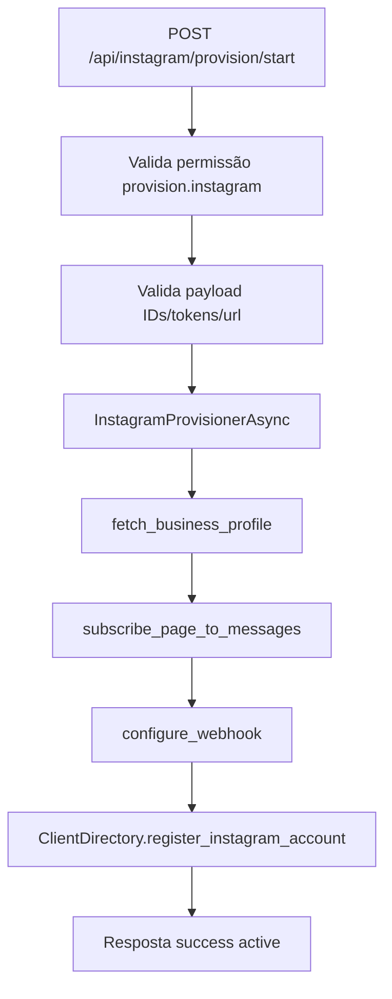
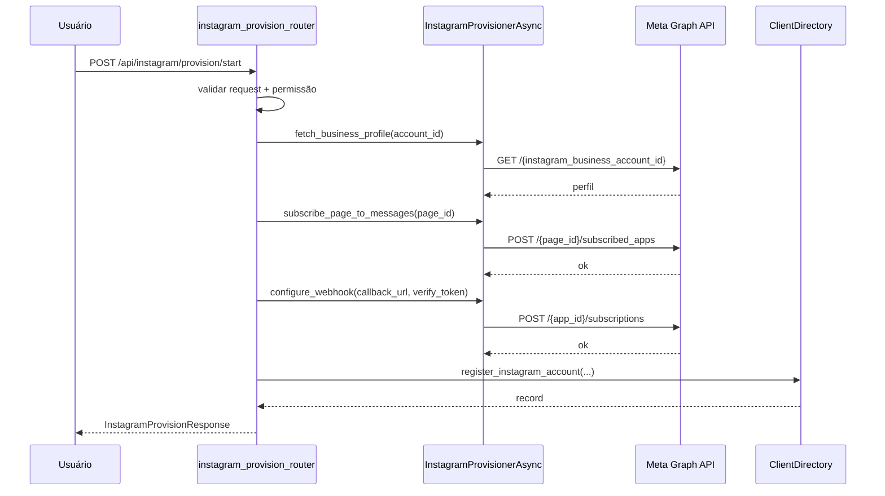
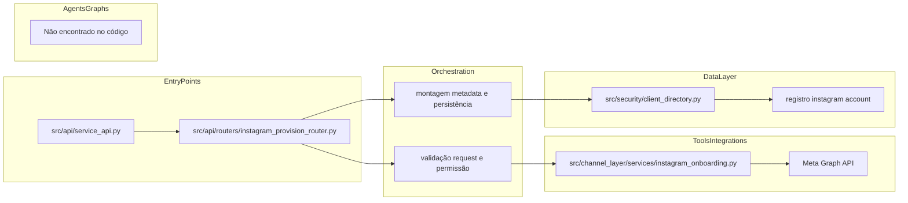
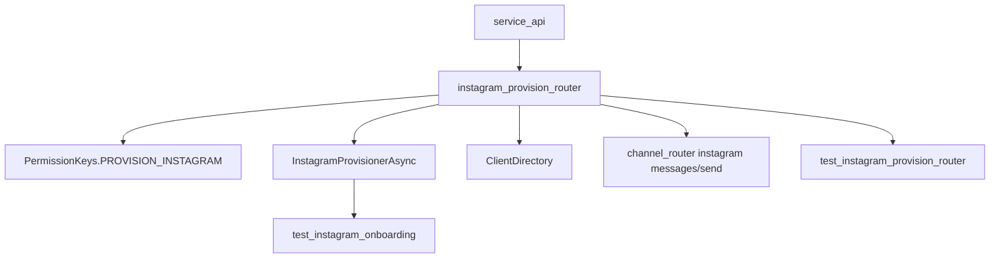

# Tutorial 101: Provisionamento Instagram

Este guia ensina, do zero, como provisionar Instagram no projeto de forma prática e segura, com base no que está implementado hoje.

## 1) Para quem é este tutorial

Público:
- Iniciante
- Desenvolvedor de negócio
- Desenvolvedor de plataforma

Ao final você vai conseguir:
- Entender o fluxo real de provisionamento Instagram no backend.
- Saber onde ficam validações, permissões e integração com Meta Graph API.
- Saber como o registro fica persistido no diretório multi-tenant.
- Validar webhook e envio operacional do canal Instagram.
- Identificar o que já está pronto e o que ainda falta para robustez de produção.

## 2) Dicionário rápido (glossário obrigatório)

- `Provisionamento`: ligar uma conta Instagram Business ao sistema.
- `instagram_business_account_id`: ID da conta de negócio no Meta.
- `page_id`: ID da página Facebook associada.
- `callback_url`: URL pública para receber webhook.
- `verify_token`: segredo de validação do webhook.
- `ClientDirectory`: fachada de dados de tenant, canais, credenciais e registros.
- `InstagramProvisionerAsync`: serviço assíncrono que chama a Graph API.
- `provision.instagram`: permissão necessária para executar o provisionamento.
- `channel_id`: identificador lógico do canal no sistema.
- `correlation_id`: identificador de rastreio de ponta a ponta.

## 3) Conceito em linguagem simples (regra da analogia)

Pense no provisionamento Instagram como cadastrar uma nova loja no shopping e ligar o interfone dela à central.

- Você informa documentos da loja (IDs e tokens).
- O sistema valida se isso é coerente.
- Ele registra a loja na central e configura o interfone (webhook).
- Depois disso, mensagens começam a chegar para atendimento.

Em termos práticos: sem provisionamento, o Instagram existe, mas não conversa com a plataforma. Com provisionamento, o canal passa a receber e responder eventos corretamente.

## 4) Mapa de navegação do repo

- `src/api/service_api.py` -> inclui o router de provisionamento Instagram.
- `src/api/routers/instagram_provision_router.py` -> endpoint de provisionamento (`/start`) e validações de entrada.
- `src/channel_layer/services/instagram_onboarding.py` -> cliente assíncrono para Graph API e operações de onboarding.
- `src/security/client_directory.py` -> registro e consulta da conta Instagram provisionada.
- `src/api/security/permissions.py` -> permissão `PROVISION_INSTAGRAM` (`provision.instagram`).
- `src/api/routers/channel_router.py` -> operação de mensagens do canal (`messages`, `send`, `history`, `webhook/test`).
- `tests/unit/test_instagram_provision_router.py` -> cobertura do endpoint de provisionamento.
- `tests/unit/test_instagram_onboarding.py` -> cobertura do serviço de onboarding.
- `docs/README-INSTAGRAM-PROVISIONING.md` -> manual funcional consolidado.

Guarda-corpos:
- Não remover validações de URL/token/email no request de provisionamento.
- Não persistir token em claro no metadata do registro local.

## 5) Mapa visual 1: fluxo macro (Flowchart)

## 6) Mapa visual 2: quem chama quem (Sequence)

## 7) Mapa visual 3: camadas (Layer Diagram)

## 8) Mapa visual 4: componentes (Component Diagram)

## 9) Onde isso aparece neste projeto (visão rápida)

- Include do router Instagram em `src/api/service_api.py:1557`.
- Permissão de provisionamento em `src/api/security/permissions.py:89`.
- Endpoint `POST /start` em `src/api/routers/instagram_provision_router.py:207`.
- Serviço de onboarding em `src/channel_layer/services/instagram_onboarding.py`.
- Registro da conta provisionada em `src/security/client_directory.py:492`.
- Consulta de conta registrada em `src/security/client_directory.py:513`.
- Operação de mensagens do canal em `src/api/routers/channel_router.py:1713`.
- Envio manual no canal em `src/api/routers/channel_router.py:1757`.
- Histórico do canal em `src/api/routers/channel_router.py:1931`.

## 10) Caminho real no código (onde olhar)

- `src/api/routers/instagram_provision_router.py`: valida request, chama provisioner e persiste registro.
- `src/channel_layer/services/instagram_onboarding.py`: operações Graph API (`fetch`, `subscribe`, `webhook`).
- `src/security/client_directory.py`: grava e consulta `instagram_business_account_id` local.
- `src/api/routers/channel_router.py`: endpoints para consumo/envio operacional após provisionamento.
- `tests/unit/test_instagram_provision_router.py`: valida fluxo de sucesso e erros HTTP.
- `tests/unit/test_instagram_onboarding.py`: valida token/page/app token e resposta da API.

## 11) Fluxo passo a passo (o que acontece de verdade)

1. Cliente chama `POST /api/instagram/provision/start`.
2. O endpoint exige permissão `provision.instagram`.
3. O payload é validado para IDs, URL, email, token e versão de API.
4. `client_code` é extraído do `user_data` autenticado.
5. O router cria `InstagramProvisionerAsync` e executa:
6. `fetch_business_profile(instagram_business_account_id)`.
7. `subscribe_page_to_messages(page_id)`.
8. `configure_webhook(callback_url, verify_token)`.
9. O router monta metadata com hashes dos segredos e registra conta em `ClientDirectory`.
10. Retorna `success=true`, `status=active`, `ig_username`, `page_id`.

Com config ativa:
- `graph_api_version` pode ser informado no request; se ausente, usa `v20.0`.

No estado atual:
- Não existe endpoint separado de `verify` para Instagram no router de provisionamento.
- Não existe endpoint de `takeover` Instagram no router de provisionamento.

## 12) Status: está pronto? quanto está pronto?

| Área | Evidência | Status | Impacto prático | Próximo passo mínimo |
|---|---|---|---|---|
| Endpoint de provisionamento Instagram | `instagram_provision_router.py:207` | pronto | Provisiona com validação e persistência | manter contrato OpenAPI atualizado |
| Permissão dedicada | `permissions.py:89` | pronto | restringe uso a perfis autorizados | revisar papéis por tenant |
| Integração Graph API | `instagram_onboarding.py` | pronto | executa onboarding essencial | adicionar métricas por chamada externa |
| Persistência local da conta | `client_directory.py:492` | pronto | mantém vínculo tenant x conta Instagram | validar campos obrigatórios em migração |
| Hash de segredos no metadata | `instagram_provision_router.py` | pronto | reduz exposição de segredo em storage | manter política sem token em claro |
| Rotina de retry explícito | não encontrado no serviço | parcial | risco maior em intermitência de rede | aplicar retry/backoff central do projeto |
| Fluxo de verify/takeover dedicado | não encontrado no router | ausente | reduz flexibilidade de migração incremental | criar endpoints separados quando necessário |
| Testes unitários de provisionamento | `test_instagram_provision_router.py`, `test_instagram_onboarding.py` | pronto | reduz regressão de contrato | incluir integração com stub HTTP realista |

## 13) Como colocar para funcionar (hands-on end-to-end)

Passo 0: pré-requisitos
- Python 3.11 (`pyproject.toml`).
- Dependências do projeto instaladas.

Passo 1: ambiente
- `source .venv/bin/activate`.

Passo 2: subir API
- `python main.py`.

Passo 3: credencial com permissão
- Use `X-API-Key` que tenha `provision.instagram`.

Passo 4: chamar provisionamento
- Endpoint: `POST /api/instagram/provision/start`.
- Campos obrigatórios: `instagram_business_account_id`, `page_id`, `display_name`, `email`, `access_token`, `app_id`, `app_secret`, `callback_url`, `verify_token`.

Passo 5: validar persistência
- Confirme registro no diretório via métodos de consulta de conta Instagram.

Passo 6: validar operação do canal
- Teste endpoint de mensagem do canal em `channel_router` (`/instagram/{channel_id}/messages` e `/send`).

Passo 7: validar testes
- `source .venv/bin/activate && PROMETEU_RUNNING_TESTS=1 pytest tests/unit/test_instagram_provision_router.py tests/unit/test_instagram_onboarding.py -q`.

O que espero ver
- Resposta `200` com `success=true` no `/start`.
- `status=active` no retorno do provisionamento.
- Logs com correlação do fluxo de provisionamento e, depois, do canal.

## 14) ELI5: onde coloco cada parte da feature neste projeto?

- Entrada HTTP de provisionamento: `instagram_provision_router.py`.
- Regras de validação de dados de entrada: no próprio request model do router.
- Integração com Meta: `instagram_onboarding.py`.
- Registro local de estado: `client_directory.py`.
- Operação de mensagens pós-provisionamento: `channel_router.py`.
- Testes de segurança e contrato: `tests/unit/test_instagram_provision_router.py`.

| Pergunta | Resposta | Camada | Onde no repo |
|---|---|---|---|
| Onde criar campo novo de request de provisionamento? | No model de request do router | Contrato HTTP | `src/api/routers/instagram_provision_router.py` |
| Onde chamar endpoint novo da Meta? | No serviço assíncrono de onboarding | Integração | `src/channel_layer/services/instagram_onboarding.py` |
| Onde persistir dado derivado do provisionamento? | No registro de conta Instagram do diretório | Dados | `src/security/client_directory.py` |
| Onde validar permissão da chave? | No endpoint via dependency/decorator | Segurança | `src/api/routers/instagram_provision_router.py` |
| Onde testar webhook sem produção? | Endpoint de teste no channel router | Operação | `src/api/routers/channel_router.py` |

## 15) Template de mudança (preenchido com padrões do repo)

1) entrada: qual endpoint/job dispara?
- paths: `src/api/routers/instagram_provision_router.py`
- contrato de entrada: `InstagramProvisionStartRequest`

2) config: qual YAML/env controla?
- keys: `graph_api_version` no request; credenciais de canal no diretório/tenant
- onde é lido: router + `InstagramProvisionerAsync`

3) execução: qual grafo ou nó entra?
- builder/factory: não aplicável neste fluxo
- state: não usa stategraph neste ponto

4) ferramentas: quais tools são usadas?
- registro: não aplicável no provisionamento
- chamadas: integração direta por serviço Python (`InstagramProvisionerAsync`)

5) dados: onde persiste/cache/indexa?
- MySQL: indireto via repositórios do diretório multi-tenant
- Redis: não encontrado no escopo de provisionamento Instagram
- Qdrant/outros: não encontrado no escopo de provisionamento Instagram

6) observabilidade: onde loga/traça?
- logs: `create_logger_with_correlation(...)` no serviço
- correlation/trace: token de correlação normalizado no serviço

7) testes: onde validar?
- unit: `test_instagram_provision_router.py` e `test_instagram_onboarding.py`
- integration: não encontrado no escopo analisado

## 16) CUIDADO: o que NÃO fazer (guarda-corpos)

- Não aceitar `callback_url` sem esquema/host válido.
- Não persistir `access_token` e `app_secret` em claro.
- Não provisionar sem `client_code` vindo da autenticação.
- Não remover validação de `graph_api_version`.
- Não pular testes do router ao alterar o contrato do request.

## 17) Anti-exemplos (obrigatório)

Erro comum: colocar chamada HTTP da Meta direto no endpoint.
- por que é ruim: acopla contrato HTTP com integração externa.
- correção: manter chamada encapsulada em `InstagramProvisionerAsync`.

Erro comum: salvar token puro no metadata.
- por que é ruim: risco de segurança grave.
- correção: persistir apenas hash e dados não sensíveis.

Erro comum: usar `client_code` vindo do corpo da requisição.
- por que é ruim: pode abrir brecha de tenant crossing.
- correção: usar `client_code` do `user_data` autenticado.

Erro comum: ignorar erro HTTP da Graph API.
- por que é ruim: cliente recebe falso sucesso.
- correção: mapear erro para status apropriado no endpoint.

## 18) Exemplos guiados (2 a 4)

Exemplo 1: falha por token curto
- siga os validadores do request no router.
- confirme teste que valida token/URL/email inválidos.

Exemplo 2: erro HTTP da Graph API
- siga o `except httpx.HTTPStatusError` no endpoint.
- confirme teste com provisioner que simula falha HTTP.

Exemplo 3: persistência segura
- siga bloco que calcula hashes (`access_token`, `app|secret`, `verify_token`).
- confirme no teste que metadata não contém token em claro.

Exemplo 4: pós-provisionamento operacional
- siga rotas Instagram no `channel_router` (`messages`, `send`, `history`).
- confirme como o canal já provisionado passa a operar mensagens.

## 19) Erros comuns e como reconhecer (debugging)

sintoma observável: `400` no `/start` com validação.
- hipótese: campo de entrada inválido (url/email/token/id).
- como confirmar: validadores do model no router.
- correção segura: corrigir payload conforme contrato.

sintoma observável: `400` dizendo client_code ausente.
- hipótese: chave autenticada sem `client_code` associado.
- como confirmar: extração de `client_code` do `user_data` no endpoint.
- correção segura: ajustar cadastro da credencial no diretório.

sintoma observável: `502` após chamada externa.
- hipótese: Meta Graph API retornou erro HTTP.
- como confirmar: bloco de tratamento `httpx.HTTPStatusError`.
- correção segura: validar IDs/tokens/permissões no app Meta.

sintoma observável: `503` no provisionamento.
- hipótese: falha de rede para Graph API.
- como confirmar: bloco de tratamento `httpx.RequestError`.
- correção segura: repetir com conectividade estável e, idealmente, retry.

sintoma observável: canal provisionado não recebe eventos.
- hipótese: webhook/canal não configurado corretamente no fluxo operacional.
- como confirmar: revisar callbacks e rotas do `channel_router`.
- correção segura: revisar callback_url, verify_token e vínculo de channel_id.

sintoma observável: regressão após alteração no request model.
- hipótese: contrato mudou sem atualizar testes.
- como confirmar: falhas em `test_instagram_provision_router.py`.
- correção segura: alinhar contrato e testes no mesmo PR.

## 20) Exercícios guiados (obrigatório)

Exercício 1
- objetivo: mapear o caminho de erro 502.
- passos: simular exceção HTTP no provisioner e observar resposta do endpoint.
- como verificar no código: `instagram_provision_router.py` + testes unitários.
- gabarito: endpoint converte erro Graph API para `HTTP 502`.

Exercício 2
- objetivo: validar persistência de hash de segredo.
- passos: executar teste de sucesso e inspecionar metadata salvo.
- como verificar no código: `test_instagram_provision_router.py`.
- gabarito: existem hashes, não existe token em claro.

Exercício 3
- objetivo: confirmar uso de app token em webhook config.
- passos: seguir `configure_webhook` até `_request(... use_app_token=True)`.
- como verificar no código: `instagram_onboarding.py` + testes.
- gabarito: token usado é `app_id|app_secret` nessa chamada.

## 21) Checklist final

- Sei qual endpoint provisiona Instagram.
- Sei qual permissão é necessária.
- Sei onde ficam as validações de payload.
- Sei onde são feitas as chamadas para Graph API.
- Sei onde a conta provisionada é persistida.
- Sei que segredos são salvos como hash no metadata.
- Sei como identificar erros de rede e de HTTP externo.
- Sei onde estão os testes unitários principais.
- Sei as rotas de operação do canal depois do provisionamento.
- Sei o que ainda falta para robustez máxima.

## 22) Checklist de PR quando mexer nisso (obrigatório)

- Manteve `@endpoint_permission(PermissionKeys.PROVISION_INSTAGRAM)`.
- Não quebrou contrato de `InstagramProvisionStartRequest`.
- Manteve validação de URL, email e tokens.
- Não introduziu persistência de segredo em claro.
- Manteve mapeamento de erro HTTP externo para status apropriado.
- Atualizou testes unitários impactados.
- Revisou fluxo operacional no `channel_router` quando aplicável.
- Atualizou documentação funcional se houver mudança de comportamento.

## 23) Referências

Referências internas:
- `src/api/service_api.py`
- `src/api/security/permissions.py`
- `src/api/routers/instagram_provision_router.py`
- `src/channel_layer/services/instagram_onboarding.py`
- `src/security/client_directory.py`
- `src/api/routers/channel_router.py`
- `tests/unit/test_instagram_provision_router.py`
- `tests/unit/test_instagram_onboarding.py`
- `docs/README-INSTAGRAM-PROVISIONING.md`

Referências externas consultadas:
- FastAPI Documentation, Tutorial/User Guide.
- Meta Developers, Instagram/Graph API e configuração de webhook (referência normativa).

## 24) Avaliação objetiva: está pronto?

Status funcional:
- Pronto para provisionar conta Instagram via endpoint único `/start` com persistência local.

Status de qualidade:
- Parcialmente pronto para ambientes com alta intermitência externa, pois não há evidência de retry explícito no serviço de onboarding.

Status de produção:
- Pronto para uso com controle de permissão e validações essenciais, desde que credenciais Meta e callback estejam corretos.

Recomendação pragmática:
- Próximo ganho técnico de maior impacto é adicionar retry/backoff explícito no `InstagramProvisionerAsync` e teste de integração para falhas transitórias.
