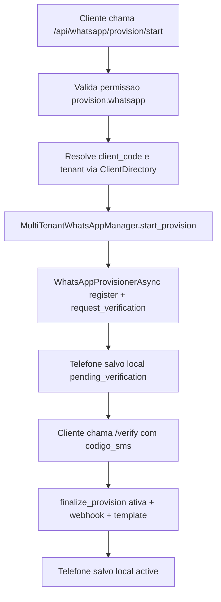
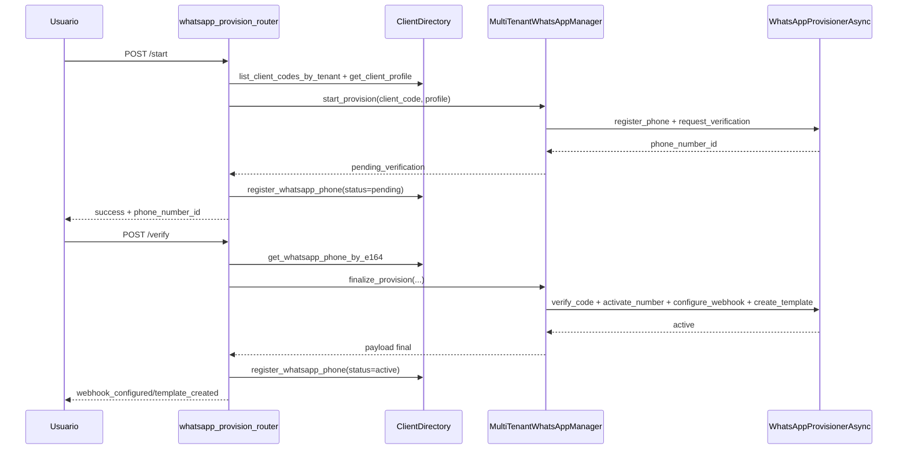
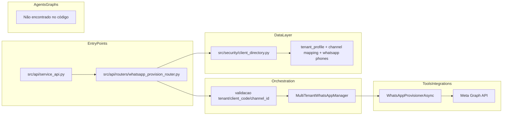
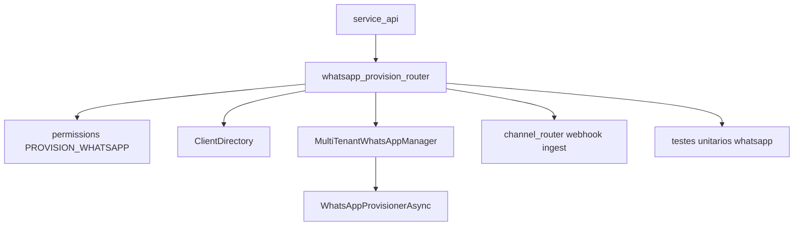

# Tutorial 101: Provisionamento WhatsApp

Se você acabou de entrar no projeto, este guia vai te mostrar, passo a passo e sem enrolação, como o provisionamento WhatsApp funciona de verdade no código.

## 1) Para quem é este tutorial

Este tutorial é para:
- Iniciante
- Desenvolvedor de negócio
- Desenvolvedor de plataforma

Ao final você vai conseguir:
- Entender o fluxo completo de provisionamento WhatsApp (`start`, `verify`, `import-existing`, `takeover`).
- Saber onde o tenant, `client_code`, canal e credenciais são validados.
- Identificar onde o webhook é assumido e onde o teste de callback é executado.
- Avaliar o que já está pronto e o que ainda é lacuna para produção mais robusta.
- Colocar o fluxo para funcionar localmente e validar com testes.

## 2) Dicionário rápido (glossário obrigatório)

- `Provisionamento`: processo de registrar/ativar um número WhatsApp na Meta e conectar ao sistema.
- `client_code`: identificador do cliente (tenant lógico).
- `tenant_id`: identificador do tenant autenticado.
- `phone_number_id`: identificador do número no provedor Meta.
- `E.164`: formato internacional do telefone, como `+5511988887777`.
- `takeover`: assumir o webhook de um número já existente.
- `idempotency_key`: chave para repetir chamada sem efeito duplicado.
- `ClientDirectory`: fachada central de dados multi-tenant (tenant, canais, credenciais e segurança).
- `MultiTenantWhatsAppManager`: orquestra operações WhatsApp por tenant.
- `WhatsAppProvisionerAsync`: cliente assíncrono que conversa com a Meta Graph API.

## 3) Conceito em linguagem simples (regra da analogia)

Pense no provisionamento como cadastrar uma nova linha telefônica em uma central de atendimento.

- Primeiro você registra a linha (`/start`).
- Depois confirma com um código recebido por SMS (`/verify`).
- Se a linha já existia, você só importa para o seu sistema (`/import-existing`).
- E, se necessário, manda os eventos dessa linha para o seu novo sistema (`/takeover`).

Analogia: é como fazer portabilidade de um número para uma nova operadora. O número continua o mesmo, mas você escolhe quem vai receber os eventos e controlar o atendimento.

## 4) Mapa de navegação do repo

- `src/api/service_api.py` -> registra o router de provisionamento; mexa aqui só para wiring da API.
- `src/api/routers/whatsapp_provision_router.py` -> endpoints de provisionamento; mexa para contrato HTTP e regras de fluxo.
- `src/channel_layer/services/whatsapp_meta_onboarding.py` -> implementação das chamadas Meta e orquestração multi-tenant.
- `src/security/client_directory.py` -> leitura/escrita de perfis, canais e telefones registrados.
- `src/api/security/permissions.py` -> chave de permissão `provision.whatsapp`.
- `src/api/routers/channel_router.py` -> validação/consumo de webhook por canal após provisionamento.
- `tests/unit/test_whatsapp_provision_router.py` -> cobertura unitária do router.
- `tests/unit/test_whatsapp_meta_onboarding.py` -> cobertura do manager/provisioner.
- `docs/README-WHATSAPP-PROVISIONING.md` -> visão funcional consolidada.

Guarda-corpos:
- Não bypassar `require_permission(PermissionKeys.PROVISION_WHATSAPP)`.
- Não gravar telefone sem passar por validação E.164.

## 5) Mapa visual 1: fluxo macro (Flowchart)

## 6) Mapa visual 2: quem chama quem (Sequence)

## 7) Mapa visual 3: camadas (Layer Diagram)

## 8) Mapa visual 4: componentes (Component Diagram)

## 9) Onde isso aparece neste projeto (visão rápida)

- Router incluso na API em `src/api/service_api.py:1556`.
- Prefixo do módulo de provisionamento em `src/api/routers/whatsapp_provision_router.py:267`.
- Endpoint de listagem de client codes em `src/api/routers/whatsapp_provision_router.py:898`.
- Endpoint `start` em `src/api/routers/whatsapp_provision_router.py:1029`.
- Endpoint `verify` em `src/api/routers/whatsapp_provision_router.py:1187`.
- Endpoint `import-existing` em `src/api/routers/whatsapp_provision_router.py:1414`.
- Endpoint `remove-webhook` em `src/api/routers/whatsapp_provision_router.py:1527`.
- Endpoint `takeover` em `src/api/routers/whatsapp_provision_router.py:1681`.
- Endpoint `test-callback` em `src/api/routers/whatsapp_provision_router.py:1861`.
- Manager multi-tenant em `src/channel_layer/services/whatsapp_meta_onboarding.py:480`.

## 10) Caminho real no código (onde olhar)

- `src/api/routers/whatsapp_provision_router.py`: camada HTTP com validações e respostas.
- `src/channel_layer/services/whatsapp_meta_onboarding.py`: integração assíncrona com Meta e fluxo de negócio.
- `src/security/client_directory.py`: persistência e lookup multi-tenant.
- `src/api/security/permissions.py`: permissão canônica `provision.whatsapp`.
- `src/api/routers/channel_router.py`: validação de webhook e processamento de mensagens por canal.
- `tests/unit/test_whatsapp_provision_router.py`: cenários felizes, conflitos e idempotência.
- `tests/unit/test_whatsapp_meta_onboarding.py`: credenciais, webhook e token de app.

## 11) Fluxo passo a passo (o que acontece de verdade)

1. API recebe chamada do cliente em `/api/whatsapp/provision/*`.
2. Permissão `PROVISION_WHATSAPP` é exigida via dependency e decorator.
3. O router obtém `tenant_id` do `user_data` autenticado.
4. O router resolve `client_code` autorizado para o tenant.
5. Em `/start`, valida telefone E.164 e evita re-onboarding quando telefone já existe localmente.
6. O manager chama a Meta para registrar número e solicitar código SMS/VOICE.
7. O telefone é salvo localmente com status `pending_verification`.
8. Em `/verify`, o router exige consistência entre `phone_number_id` armazenado e recebido.
9. O manager finaliza provisionamento: verifica código, ativa número, configura webhook e cria template.
10. O telefone é salvo como `active`, com metadados de webhook/template.
11. Em `/import-existing`, o número é apenas importado localmente sem re-onboarding.
12. Em `/takeover`, o webhook (e opcional template) é assumido para número já conhecido.
13. Em `/test-callback`, o sistema simula webhook assinado para validar o pipeline de entrada.

Com config ativa:
- `meta_access_token`, `meta_app_id`, `meta_whatsapp_business_account_id`, `meta_webhook_callback_url` e `meta_webhook_verify_token` precisam estar no perfil do cliente no diretório.

No estado atual:
- Não foi encontrado no código um endpoint público dedicado só à configuração de credenciais Meta; o fluxo depende de dados já presentes no diretório.

## 12) Status: está pronto? quanto está pronto?

| Área | Evidência | Status | Impacto prático | Próximo passo mínimo |
|---|---|---|---|---|
| Endpoints de provisionamento | `src/api/routers/whatsapp_provision_router.py` | pronto | Fluxo HTTP completo para start/verify/import/takeover | manter contratos sincronizados com OpenAPI |
| Integração Meta assíncrona | `src/channel_layer/services/whatsapp_meta_onboarding.py` | pronto | Operações de registro/verificação/ativação/webhook/template implementadas | reforçar monitoramento de latência e erro por operação |
| Controle de permissão | `src/api/security/permissions.py:88` | pronto | Evita acesso não autorizado ao provisionamento | auditoria periódica de permissões por tenant |
| Persistência local do número | `src/security/client_directory.py` | pronto | Estado local (`pending`/`active`) fica consistente | ampliar validações de integridade cruzada |
| Idempotência (`verify`/`takeover`) | `whatsapp_provision_router.py` | parcial | já há suporte por header, mas sem contrato global unificado | padronizar idempotência em todos endpoints sensíveis |
| Teste de callback | `whatsapp_provision_router.py:1861` | pronto | valida canal e assinatura sem depender da Meta em runtime | adicionar cenário E2E com fila externa |
| UI dedicada de provisionamento | Não encontrado no escopo analisado em `app/ui/**` | ausente | operação tende a depender de API/cliente customizado | criar tela operacional para start/verify/takeover |
| Retry explícito por operação externa | Não encontrado no serviço específico | parcial | risco maior em instabilidade de rede/Meta | adicionar política de retry central no provisioner |

## 13) Como colocar para funcionar (hands-on end-to-end)

Passo 0: pré-requisitos
- Python 3.11 (`pyproject.toml`).
- Dependências instaladas (incluindo `httpx` e `phonenumbers`).

Passo 1: ambiente
- Comando: `source .venv/bin/activate`.

Passo 2: subir API
- Comando: `python main.py`.
- Ponto de entrada efetivo: `app/main.py` carregando `src.api.service_api:app`.

Passo 3: garantir tenant + credenciais
- O tenant precisa possuir perfil com:
- `meta_access_token`
- `meta_app_id`
- `meta_whatsapp_business_account_id`
- `meta_webhook_callback_url`
- `meta_webhook_verify_token`
- Evidência: leitura em `MultiTenantWhatsAppManager.get_credentials` e `get_webhook_config`.

Passo 4: validar acesso
- Chame `GET /api/whatsapp/provision/client-codes` com chave que tenha `provision.whatsapp`.

Passo 5: iniciar onboarding
- Chame `POST /api/whatsapp/provision/start` com `phone_e164` e `client_code`.

Passo 6: finalizar onboarding
- Chame `POST /api/whatsapp/provision/verify` com `phone_number_id`, `phone_e164`, `client_code` e `codigo_sms`.

Passo 7: validar migração sem re-onboarding (opcional)
- `POST /import-existing` seguido de `POST /takeover`.

Passo 8: validar callback
- `POST /test-callback` para simular entrega de webhook no pipeline.

Passo 9: validar testes automatizados
- Comando focado: `source .venv/bin/activate && PROMETEU_RUNNING_TESTS=1 pytest tests/unit/test_whatsapp_provision_router.py tests/unit/test_whatsapp_meta_onboarding.py -q`.

Portas/healthchecks
- A API usa host/porta definidos em configuração FastAPI (`app/main.py`).

Se não existir automação
- Não encontrado no código/config: script único de bootstrap para provisionamento WhatsApp com dados de exemplo de tenant em ambiente local.
- Trabalho mínimo sugerido: script de seed de tenant e smoke de endpoints de provisionamento.

## 14) ELI5: onde coloco cada parte da feature neste projeto?

- Nova regra de entrada HTTP: `whatsapp_provision_router.py`.
- Nova validação de autorização: `permissions.py` + `require_permission`.
- Nova regra de negócio Meta: `whatsapp_meta_onboarding.py`.
- Persistência de estado do número: `client_directory.py`.
- Consumo de webhook: `channel_router.py`.
- Testes: `tests/unit/test_whatsapp_provision_router.py` e `tests/unit/test_whatsapp_meta_onboarding.py`.

| Pergunta | Resposta | Camada | Onde no repo |
|---|---|---|---|
| Onde adiciono um endpoint novo de provisionamento? | No router de WhatsApp | Entry point | `src/api/routers/whatsapp_provision_router.py` |
| Onde valido tenant e client_code? | Helper de contexto do router | Orquestração | `src/api/routers/whatsapp_provision_router.py` |
| Onde faço chamada para Meta API? | Provisioner assíncrono | Integração | `src/channel_layer/services/whatsapp_meta_onboarding.py` |
| Onde salvo telefone provisionado? | ClientDirectory -> ChannelRepository | Dados | `src/security/client_directory.py` |
| Onde configuro autorização? | Constantes de permissão | Contrato de segurança | `src/api/security/permissions.py` |
| Onde testo callback sem Meta real? | Endpoint de teste de callback | Operação/QA | `src/api/routers/whatsapp_provision_router.py` |

## 15) Template de mudança (preenchido com padrões do repo)

1) entrada: qual endpoint/job dispara?
- paths: `src/api/routers/whatsapp_provision_router.py`
- contrato de entrada: `ProvisionStartRequest`, `ProvisionVerifyRequest`, `ImportExistingRequest`, `TakeoverRequest`

2) config: qual YAML/env controla?
- keys: não é chave YAML do fluxo de provisionamento; o principal vem de perfil multi-tenant no diretório
- onde é lido: `MultiTenantWhatsAppManager.get_credentials` e `get_webhook_config`

3) execução: qual grafo ou nó entra?
- builder/factory: Não encontrado no código para LangGraph neste fluxo
- state: estado operacional de provisão fica persistido em registro de telefone (`pending`/`active`)

4) ferramentas: quais tools são usadas?
- registro: Não encontrado no código como tool LangChain para este fluxo
- chamadas: integração direta via `WhatsAppProvisionerAsync`

5) dados: onde persiste/cache/indexa?
- MySQL: indireto via repositórios do diretório multi-tenant
- Redis: Não encontrado no escopo deste fluxo
- Qdrant/outros: Não encontrado no escopo deste fluxo

6) observabilidade: onde loga/traça?
- logs: `create_logger_with_correlation(...)`
- correlation/trace: extraído de `user_data` e propagado nos endpoints

7) testes: onde validar?
- unit: `tests/unit/test_whatsapp_provision_router.py`, `tests/unit/test_whatsapp_meta_onboarding.py`
- integration: Não foi encontrado no escopo analisado

## 16) CUIDADO: o que NÃO fazer (guarda-corpos)

- Não aceitar `client_code` fora da lista permitida para o `tenant_id` autenticado.
- Não permitir `/start` para número já registrado localmente sem tratar conflito.
- Não pular comparação de `phone_number_id` entre início e confirmação (`/verify`).
- Não assumir webhook (`/takeover`) de número que ainda não existe no diretório.
- Não registrar fluxo sem `correlation_id` nos logs operacionais.

## 17) Anti-exemplos (obrigatório)

Erro comum: validar permissão só no frontend.
- por que é ruim: qualquer cliente HTTP pode burlar.
- correção: validar sempre com `require_permission` no endpoint.

Erro comum: salvar número ativo antes do `verify`.
- por que é ruim: estado inconsistente e onboarding falso.
- correção: manter `pending_verification` até `finalize_provision` concluir.

Erro comum: executar takeover sem importação prévia.
- por que é ruim: sistema local não conhece `phone_number_id`.
- correção: usar `/import-existing` antes de `/takeover`.

Erro comum: usar telefone fora de E.164.
- por que é ruim: falha em integração e matching local.
- correção: normalizar e validar via `PhoneNormalizer`.

## 18) Exemplos guiados (2 a 4)

Exemplo 1: onboarding de número novo
- Siga `POST /start` em `whatsapp_provision_router.py`.
- Continue em `start_provision` no manager para ver registro + request de código.

Exemplo 2: confirmação com idempotência
- Siga `POST /verify` no router e localize `x_idempotency_key`.
- Veja no teste `test_quando_verificar_com_idempotencia_entao_reutiliza_resposta`.

Exemplo 3: migração de número existente
- Leia `/import-existing` e depois `/takeover` no router.
- Observe chamadas `ensure_webhook_subscription` e `ensure_template_exists`.

Exemplo 4: validação operacional de webhook
- Leia endpoint `/test-callback` no router.
- Siga resolução de YAML do canal e assinatura simulada antes do processamento.

## 19) Erros comuns e como reconhecer (debugging)

sintoma observável: `403` ao chamar `/start`.
- hipótese: tenant sem permissão `provision.whatsapp`.
- como confirmar: verificar `PermissionKeys.PROVISION_WHATSAPP` e auth da chave.
- correção segura: ajustar permissão da credencial no diretório.

sintoma observável: `409` no `/start`.
- hipótese: telefone já registrado localmente.
- como confirmar: `get_whatsapp_phone_by_e164` retorna registro com `phone_number_id`.
- correção segura: seguir por `/takeover` quando aplicável.

sintoma observável: `409` no `/verify` com mismatch.
- hipótese: `phone_number_id` enviado diferente do armazenado.
- como confirmar: comparar payload e registro local do número.
- correção segura: reiniciar do `/start`.

sintoma observável: `502` no `/start`.
- hipótese: Meta não retornou `phone_number_id` ou falha de integração.
- como confirmar: logs de erro do manager/provisioner e resposta HTTP externa.
- correção segura: revisar credenciais Meta do tenant.

sintoma observável: `404` no `/takeover`.
- hipótese: número não importado no diretório.
- como confirmar: consulta local por `phone_e164` sem resultado.
- correção segura: executar `/import-existing` primeiro.

sintoma observável: falha em remover webhook.
- hipótese: ausência de `app_access_token`/`app_secret` no security keys.
- como confirmar: exceção `SecurityKeysNotFoundError` no manager.
- correção segura: cadastrar segredo no diretório e tentar novamente.

## 20) Exercícios guiados (obrigatório)

Exercício 1
- objetivo: mapear autorização ponta a ponta.
- passos: localizar decorators/dependencies de `PROVISION_WHATSAPP` nos endpoints.
- como verificar no código: `whatsapp_provision_router.py` e `permissions.py`.
- gabarito: todos os endpoints de provisão exigem a mesma permissão.

Exercício 2
- objetivo: entender persistência de estado do número.
- passos: seguir `register_whatsapp_phone` no `/start` e no `/verify`.
- como verificar no código: `whatsapp_provision_router.py` e `client_directory.py`.
- gabarito: estado muda de `pending_verification` para `active` após finalize.

Exercício 3
- objetivo: validar sequência de migração sem re-onboarding.
- passos: ler `/import-existing` e `/takeover`, depois os testes relacionados.
- como verificar no código: `whatsapp_provision_router.py` e `test_whatsapp_provision_router.py`.
- gabarito: importa primeiro, assume webhook depois.

## 21) Checklist final

- Sei quais endpoints compõem o fluxo de provisionamento.
- Sei qual permissão é obrigatória.
- Sei como o tenant/client_code é validado.
- Sei onde o telefone é validado em E.164.
- Sei onde o número é persistido localmente.
- Sei diferença entre `start/verify` e `import-existing/takeover`.
- Sei onde a integração Meta acontece.
- Sei como funciona idempotência no verify/takeover.
- Sei como testar callback sem Meta real.
- Sei como rodar testes unitários desse módulo.

## 22) Checklist de PR quando mexer nisso (obrigatório)

- Confirmou que todos endpoints continuam protegidos por `PROVISION_WHATSAPP`.
- Confirmou validação de `client_code` por tenant.
- Confirmou validação E.164 sem regressão.
- Confirmou manutenção de status `pending`/`active` consistente.
- Confirmou compatibilidade de `phone_number_id` no `/verify`.
- Confirmou semântica de idempotência em chamadas sensíveis.
- Confirmou logs com `correlation_id` no começo/fim/erro.
- Confirmou que testes unitários do router e manager passam.
- Confirmou atualização de documentação funcional quando contrato mudar.

## 23) Referências

Referências internas:
- `src/api/service_api.py`
- `src/api/routers/whatsapp_provision_router.py`
- `src/channel_layer/services/whatsapp_meta_onboarding.py`
- `src/security/client_directory.py`
- `src/api/security/permissions.py`
- `src/api/routers/channel_router.py`
- `tests/unit/test_whatsapp_provision_router.py`
- `tests/unit/test_whatsapp_meta_onboarding.py`
- `docs/README-WHATSAPP-PROVISIONING.md`

Referências externas consultadas:
- FastAPI Documentation, Tutorial/User Guide.
- Meta Developers, WhatsApp Cloud API (phone numbers e webhooks).

## 24) Pronto ou não pronto para produção?

Status funcional:
- Está pronto para provisionamento operacional (novo número, verificação, importação e takeover).

Status de qualidade:
- Está parcialmente pronto para resiliência máxima porque faltam evidências de retry explícito no serviço de integração externa desse fluxo.

Status de produção:
- Está pronto com controle de permissão, validações críticas e testes unitários relevantes.

O que falta para elevar maturidade:
- Padronizar retry/backoff explícito no provisioner com classificação de erro transitório.
- Incluir teste de integração end-to-end (router -> manager -> client_directory com cenários de falha de rede).
- Disponibilizar UI operacional dedicada (não encontrada no escopo analisado).

Recomendação objetiva:
- Primeiro estabilize retry + teste de integração; depois evolua UI. Isso reduz risco de incidentes reais antes de ampliar uso por times não técnicos.
