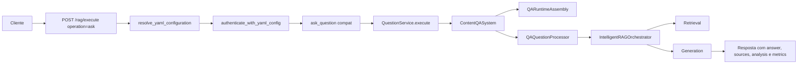
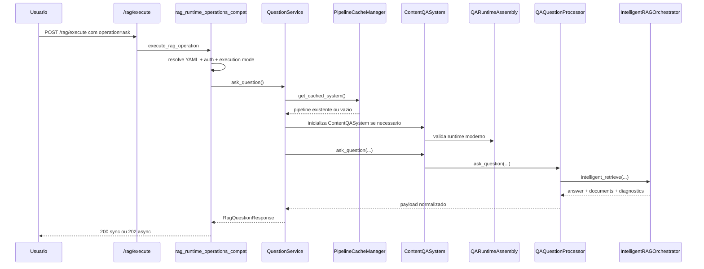
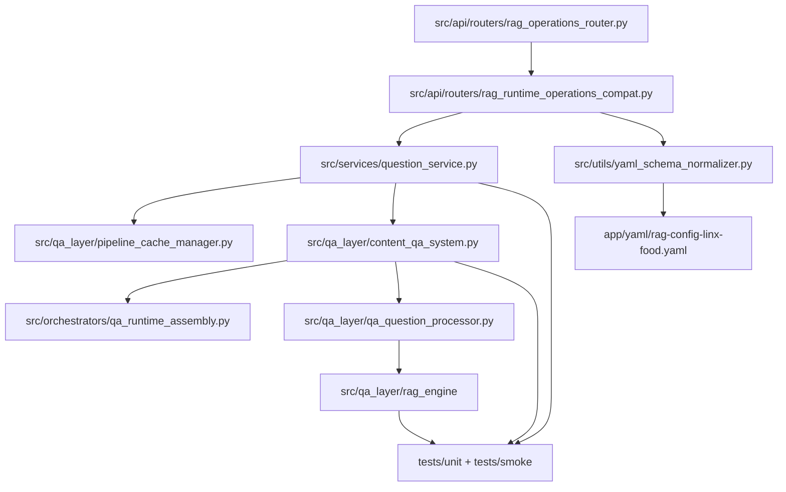
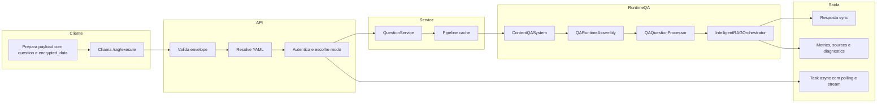

<!-- markdownlint-disable-file MD013 -->

# Tutorial 101: pipeline RAG

Se voce acabou de entrar no projeto e esta tentando responder a pergunta "qual e o caminho real de uma pergunta ate a resposta no RAG?", este tutorial foi feito para voce. A meta aqui nao e repetir teoria generica de retrieval ou de LLM. A meta e mostrar o que o repositorio faz hoje, com base no caminho executavel atual.

## 2) Para quem e este tutorial

- Desenvolvedor Junior que precisa mexer no fluxo de pergunta e resposta sem quebrar retrieval, filtros ou resposta final.
- Pessoa de operacao que precisa saber onde olhar quando o RAG responde errado, lento ou sem fontes.
- Pessoa de produto tecnico que quer entender como a pergunta vira contexto recuperado e depois resposta.
- Quem leu varios arquivos com nomes parecidos, como rag_router, QuestionService, ContentQASystem e QARuntimeAssembly, mas ainda nao entendeu quem manda em cada etapa.

Ao final, voce deve conseguir:

- identificar a borda publica real do RAG;
- explicar a cadeia router -> service -> QA system -> runtime -> retrieval -> generation;
- explicar em linguagem simples onde entram query rewrite, query analysis, roteamento, multi-query, hybrid search, fusion, rerank e generation;
- localizar as chaves YAML que de fato governam o runtime;
- diferenciar o caminho canonico do que e compatibilidade ou legado;
- validar o slice com os comandos oficiais do repositorio.

## 3) Dicionario rapido

- RAG: processo de recuperar contexto relevante e usar esse contexto para gerar uma resposta melhor.
- Dispatcher unificado: rota publica que recebe varias operacoes do dominio RAG usando um envelope unico.
- QuestionService: servico de alto nivel que prepara a consulta, inicializa o QA system e normaliza a resposta.
- ContentQASystem: fachada principal do runtime de perguntas e respostas.
- QARuntimeAssembly: componente que valida e prepara o runtime moderno obrigatorio.
- QAQuestionProcessor: executor interno que conduz o fluxo de pergunta ate o orchestrator inteligente.
- IntelligentRAGOrchestrator: orquestrador que decide retrieval e generation no pipeline moderno.
- metadata_filters: filtros estruturados aplicados ao retrieval.
- access_control: contexto de ACL que limita o que pode ou nao pode aparecer na resposta.
- image_base64: imagem opcional enviada junto da pergunta para cenarios com entrada visual.
- Pipeline cache: cache global que reaproveita pipelines QA prontos quando o YAML efetivo e o mesmo.

## 4) Conceito em linguagem simples

Pense no RAG como um analista que nao responde so com memoria propria. Primeiro ele recebe sua pergunta. Depois ele confere se esta autorizado a olhar certo acervo. Em seguida escolhe a melhor maneira de procurar contexto. So depois disso ele escreve a resposta final.

No projeto, essa historia vira uma esteira bem definida. A API recebe um envelope com `operation=ask`. O router resolve o YAML, autentica, escolhe modo sync ou async e chama o `QuestionService`. O `QuestionService` inicializa o `ContentQASystem`, que por sua vez obriga o uso do runtime moderno via `QARuntimeAssembly`. A pergunta entra no `QAQuestionProcessor`, que propaga filtros, ACL e imagem opcional para o `IntelligentRAGOrchestrator`. Esse orquestrador decide como recuperar contexto e depois produz a resposta com fontes, metricas e diagnosticos.

Em termos 101, a resposta final nao nasce no endpoint. O endpoint so organiza entrada, seguranca e modo de execucao. A parte inteligente de verdade nasce depois, no runtime de QA.

## 5) Mapa de navegacao do repo

- [../src/api/routers](../src/api/routers) -> rotas HTTP do dominio RAG -> mexa aqui quando o contrato externo mudar.
- [../src/api/routers/rag_operations_router.py](../src/api/routers/rag_operations_router.py) -> registra a rota publica principal `POST /rag/execute`.
- [../src/api/routers/rag_runtime_operations_compat.py](../src/api/routers/rag_runtime_operations_compat.py) -> dispatcher real das operacoes `ask`, `ingest`, `etl` e `delete`.
- [../src/services/question_service.py](../src/services/question_service.py) -> servico principal da pergunta -> mexa aqui quando a mudanca for de comportamento de consulta.
- [../src/qa_layer](../src/qa_layer) -> runtime de QA, retrieval, diagnosticos e montagem da resposta -> este e o coracao do slice.
- [../src/orchestrators/qa_runtime_assembly.py](../src/orchestrators/qa_runtime_assembly.py) -> montagem do runtime moderno -> nao espalhe essa decisao pelo codigo.
- [../src/qa_layer/rag_engine](../src/qa_layer/rag_engine) -> configuracoes e orquestracao do retrieval moderno -> mexa aqui quando a estrategia de busca mudar.
- [../src/utils/yaml_schema_normalizer.py](../src/utils/yaml_schema_normalizer.py) -> normalizacao do contrato YAML -> nao reintroduza layouts legados por fora.
- [../app/yaml](../app/yaml) -> exemplos reais de configuracao -> use para aprender a forma valida do YAML.
- [../tests/unit](../tests/unit) -> testes unitarios do slice RAG.
- [../tests/smoke](../tests/smoke) -> smoke tests do runtime de RAG.
- [../scripts/suite_de_testes_padrao.sh](../scripts/suite_de_testes_padrao.sh) -> runner oficial de validacao -> nao declare sucesso com comandos improvisados.

## 6) Mapa visual 1: fluxo macro



## 7) Mapa visual 2: quem chama quem



## 8) Mapa visual 3: camadas

```mermaid
flowchart TB
    subgraph EntryPoints
        E1[/rag/execute]
        E2[/health]
    end

    subgraph Contracts
        C1[ExecuteEnvelope]
        C2[RagQuestionRequest]
        C3[user_session, vector_store, rag_system, qa_system]
    end

    subgraph Orchestration
        O1[rag_runtime_operations_compat]
        O2[QuestionService]
        O3[PipelineCacheManager]
    end

    subgraph QA_Runtime
        Q1[ContentQASystem]
        Q2[QARuntimeAssembly]
        Q3[QAQuestionProcessor]
        Q4[IntelligentRAGOrchestrator]
    end

    subgraph Retrieval_And_Generation
        R1[rag_engine.config_utils]
        R2[retrieval]
        R3[generation]
    end

    subgraph Telemetry
        T1[analysis]
        T2[pipeline_diagnostics]
        T3[logs e token_usage]
    end

    E1 --> C1 --> O1 --> O2 --> O3 --> Q1 --> Q2 --> Q3 --> Q4 --> R1 --> R2 --> R3 --> T1
    Q3 --> T2
    O2 --> T3
```

## 9) Mapa visual 4: componentes



### 9.1) Mapa visual 5: swimlane funcional



## 10) Onde isso aparece neste projeto

- A rota publica principal de pergunta e `POST /rag/execute`, registrada em [../src/api/routers/rag_operations_router.py](../src/api/routers/rag_operations_router.py).
- O dispatcher real que trata `operation=ask` esta em [../src/api/routers/rag_runtime_operations_compat.py](../src/api/routers/rag_runtime_operations_compat.py).
- O contrato HTTP especializado da pergunta usa `RagQuestionRequest` e `RagQuestionResponse`, importados no router RAG agregador em [../src/api/routers/rag_router.py](../src/api/routers/rag_router.py).
- A funcao `ask_question` existe em [../src/api/routers/rag_router.py](../src/api/routers/rag_router.py), mas nao encontrei registro dela como rota publica dedicada.
- O servico principal do slice e `QuestionService` em [../src/services/question_service.py](../src/services/question_service.py).
- A fachada do runtime e `ContentQASystem` em [../src/qa_layer/content_qa_system.py](../src/qa_layer/content_qa_system.py).
- O runtime moderno obrigatorio e montado por `QARuntimeAssembly` em [../src/orchestrators/qa_runtime_assembly.py](../src/orchestrators/qa_runtime_assembly.py).
- O executor interno da pergunta e `QAQuestionProcessor` em [../src/qa_layer/qa_question_processor.py](../src/qa_layer/qa_question_processor.py).
- As configs modernas de retrieval sao lidas em [../src/qa_layer/rag_engine/config_utils.py](../src/qa_layer/rag_engine/config_utils.py).
- O exemplo YAML mais forte que encontrei para o slice esta em [../app/yaml/rag-config-linx-food.yaml](../app/yaml/rag-config-linx-food.yaml).

## 11) Caminho real no codigo

- [../src/api/routers/rag_operations_router.py](../src/api/routers/rag_operations_router.py) -> registra o dispatcher publico `POST /rag/execute`.
- [../src/api/routers/rag_runtime_operations_compat.py](../src/api/routers/rag_runtime_operations_compat.py) -> converte `operation=ask` no fluxo real da pergunta.
- [../src/api/routers/config_resolution.py](../src/api/routers/config_resolution.py) -> resolve o YAML e o payload criptografado na borda HTTP.
- [../src/config/config_cli/configuration_factory.py](../src/config/config_cli/configuration_factory.py) -> finaliza o YAML resolvido.
- [../src/utils/yaml_schema_normalizer.py](../src/utils/yaml_schema_normalizer.py) -> rejeita layouts legados e garante o contrato moderno.
- [../src/services/question_service.py](../src/services/question_service.py) -> inicializa `ContentQASystem`, aplica timeout e normaliza a resposta.
- [../src/qa_layer/pipeline_cache_manager.py](../src/qa_layer/pipeline_cache_manager.py) -> reaproveita pipelines QA em cache.
- [../src/qa_layer/content_qa_system.py](../src/qa_layer/content_qa_system.py) -> ativa a visao de runtime moderno, configura LLM, embeddings, vector store e pipeline inteligente.
- [../src/orchestrators/qa_runtime_assembly.py](../src/orchestrators/qa_runtime_assembly.py) -> escolhe `modern_basic`, `modern_streaming` ou `modern_parallel`.
- [../src/qa_layer/qa_question_processor.py](../src/qa_layer/qa_question_processor.py) -> propaga `access_control`, `metadata_filters` e `image_bytes` para o orchestrator.
- [../src/qa_layer/rag_engine/config_utils.py](../src/qa_layer/rag_engine/config_utils.py) -> consolida parametros como top_k, thresholds e fusion.
- [../app/yaml/rag-config-linx-food.yaml](../app/yaml/rag-config-linx-food.yaml) -> exemplo real do contrato YAML moderno do RAG.

## 12) Fluxo passo a passo: o que acontece de verdade

1. O cliente chama `POST /rag/execute` com um envelope que traz `operation=ask` e um `payload` compativel com `RagQuestionRequest`.
2. O dispatcher em [../src/api/routers/rag_runtime_operations_compat.py](../src/api/routers/rag_runtime_operations_compat.py) identifica `ask`, resolve `correlation_id`, carrega o YAML por `resolve_yaml_configuration()` e autentica com `authenticate_with_yaml_config()`.
3. O mesmo compat layer decide o modo de execucao. Se for sync, continua no mesmo request. Se for async, devolve `task_id`, `polling_url` e `stream_url`.
4. No caminho sync, ele chama `QuestionService.execute()` em [../src/services/question_service.py](../src/services/question_service.py).
5. O `QuestionService` pode decodificar `image_base64`, registra telemetria inicial, resolve timeout e inicializa ou reaproveita um `ContentQASystem` pelo `PipelineCacheManager`.
6. O `ContentQASystem` monta seu estado de runtime e obriga a visao moderna. Se o pipeline moderno nao puder ser ativado, ele falha fechado.
7. O `QARuntimeAssembly` valida se `user_session` existe, se `correlation_id` esta presente e se `rag_system` moderno esta habilitado. Depois escolhe a estrategia `modern_basic`, `modern_streaming` ou `modern_parallel`.
8. A pergunta entra no `QAQuestionProcessor.ask_question()` em [../src/qa_layer/qa_question_processor.py](../src/qa_layer/qa_question_processor.py).
9. O `QAQuestionProcessor` propaga `access_control`, `metadata_filters`, preferencia de fontes e `image_bytes` para o `IntelligentRAGOrchestrator`.
10. O orchestrator inteligente executa o retrieval moderno e devolve answer, documentos, diagnosticos e sinais adicionais.
11. O processor normaliza documentos, aplica preferencia de fontes, garante metadados minimos de ACL, anexa diagnosticos e salva interacao em memoria quando aplicavel.
12. O `QuestionService` analisa qualidade, enriquece fontes, monta `analysis`, `metrics`, `token_usage`, `pipeline_diagnostics` e devolve o payload final.
13. O compat layer converte esse resultado em `RagQuestionResponse` e responde 200 no modo sync ou 202 no modo async.

### 12.1) O pipeline moderno por dentro, etapa por etapa

Depois que a pergunta entra no runtime moderno, a esteira interna real fica assim:

1. Reescrita de query: `IntelligentRAGOrchestrator` chama `query_rewriter.rewrite()` antes do roteamento para corrigir, parafrasear ou expandir a mesma intencao sem trocar o assunto. Se essa etapa estiver desligada, falhar no LLM ou perder similaridade demais, a pergunta original segue viva como fallback seguro.
2. Analise semantica: `QueryAnalyzer` classifica tipo de pergunta, tipo de dado esperado, dominio, entidades e complexidade. Em linguagem simples, e aqui que o sistema tenta entender se o usuario quer conceito, procedimento, comparacao, JSON, dado operacional ou outra coisa.
3. Roteamento adaptativo: `AdaptiveQueryRouter` decide a estrategia base de retrieval, como `semantic`, `bm25`, `hybrid`, `selfquery` ou `hybrid_with_selfquery`. Esse e o ponto onde o runtime para de tratar toda pergunta como se fosse igual.
4. Selecao do processador: `RetrievalEngine` transforma a estrategia abstrata num processador concreto, como `JSON_TOOLKIT`, `HYBRID_SEARCH`, `SELF_QUERY`, `MULTI_QUERY` ou `TRADITIONAL_RAG`. Em termos 101, o roteador escolhe o plano; o processador escolhe a ferramenta concreta que vai executar esse plano.
5. Expansao de query por dominio: quando `should_expand_query` e verdadeiro, o runtime injeta vocabulario de dominio vindo do `domain_specific_rag` e do snapshot BM25. Essa etapa existe para cobrir perguntas curtas ou com vocabulário incompleto sem inventar novo escopo de busca.
6. Multi-query: quando o processador escolhido e `MULTI_QUERY`, `MultiQueryRetriever` gera variacoes da pergunta via LLM, executa essas variacoes em paralelo e deduplica os resultados. Em linguagem simples, em vez de procurar com uma pergunta so, o sistema tenta varias formas equivalentes de pedir a mesma coisa para aumentar cobertura.
7. Hybrid search: quando a decisao aponta para busca hibrida, `RetrievalEngine.execute_hybrid_processor()` combina sinais vetoriais e textuais. Se o backend suportar hybrid nativo, ele tenta esse caminho primeiro; se nao, cai para o hibrido manual. Tambem pode enriquecer o resultado com FTS quando essa parte estiver habilitada.
8. Fusao: quando `requires_fusion` e verdadeiro, `RetrievalEngine.apply_fusion_processing()` coleta resultados de `vector_search` e `bm25_search` ou `hybrid_search` e entrega isso ao `HybridFusion`. O motor pode usar `weighted_rrf`, `rrf`, `linear`, `interleaved` ou `score_normalized`, alem de deduplicar e normalizar scores.
9. Rerank: depois da recuperacao principal, o slice de retrievers pode aplicar `NeuralReranker` quando `rerank_results` estiver habilitado no YAML. Essa etapa reorganiza os documentos mais promissores para subir na frente antes da geracao. Se o modelo principal falhar, o código ainda tenta um fallback configurado.
10. Validacao de evidencia e diagnosticos: `QAQuestionProcessor` normaliza documentos, aplica preferencia de fontes, monta diagnosticos e prepara a base de evidencia que sera entregue para a geracao e para a resposta final.
11. Geracao: `GenerationEngine` monta o contexto, renderiza o prompt efetivo, chama o LLM com retry externo e devolve a resposta final. Em linguagem simples, so aqui o modelo escreve a resposta; todas as etapas anteriores servem para aumentar a chance de ele escrever com base em contexto melhor.

### 12.2) Tabela rapida das etapas internas

| Etapa interna | O que resolve na pratica | Onde aparece no codigo |
| --- | --- | --- |
| Query rewrite | limpa e reexpressa a pergunta sem trocar a intencao | [../src/qa_layer/rag_engine/query_rewriter.py](../src/qa_layer/rag_engine/query_rewriter.py), [../src/qa_layer/rag_engine/intelligent_orchestrator.py](../src/qa_layer/rag_engine/intelligent_orchestrator.py) |
| Query analysis | entende tipo, dominio e complexidade da pergunta | [../src/qa_layer/rag_engine/query_analyzer.py](../src/qa_layer/rag_engine/query_analyzer.py) |
| Adaptive routing | escolhe a estrategia base de retrieval | [../src/qa_layer/rag_engine/adaptive_router.py](../src/qa_layer/rag_engine/adaptive_router.py) |
| Processor selection | escolhe o executor concreto do retrieval | [../src/qa_layer/rag_engine/retrieval_engine.py](../src/qa_layer/rag_engine/retrieval_engine.py) |
| Domain query expansion | adiciona vocabulário útil de domínio | [../src/qa_layer/rag_engine/retrieval_engine.py](../src/qa_layer/rag_engine/retrieval_engine.py), [../src/qa_layer/rag_engine/domain_query_expansion_config_service.py](../src/qa_layer/rag_engine/domain_query_expansion_config_service.py) |
| Multi-query | gera e executa variações da mesma pergunta | [../src/qa_layer/rag_engine/multi_query_retriever.py](../src/qa_layer/rag_engine/multi_query_retriever.py), [../src/qa_layer/rag_engine/retrieval_engine.py](../src/qa_layer/rag_engine/retrieval_engine.py) |
| Hybrid search | mistura sinais vetoriais e textuais | [../src/qa_layer/rag_engine/retrieval_engine.py](../src/qa_layer/rag_engine/retrieval_engine.py), [../src/qa_layer/rag_engine/adaptive_router.py](../src/qa_layer/rag_engine/adaptive_router.py) |
| Fusion | combina listas de retrievers sem perder ranking | [../src/qa_layer/rag_engine/fusion_algorithms.py](../src/qa_layer/rag_engine/fusion_algorithms.py), [../src/qa_layer/rag_engine/retrieval_engine.py](../src/qa_layer/rag_engine/retrieval_engine.py) |
| Rerank | reordena os melhores documentos antes da resposta | [../src/qa_layer/rag_engine/reranker.py](../src/qa_layer/rag_engine/reranker.py), [../src/qa_layer/rag_engine/retrievers.py](../src/qa_layer/rag_engine/retrievers.py) |
| Generation | transforma contexto em resposta final | [../src/qa_layer/rag_engine/generation_engine.py](../src/qa_layer/rag_engine/generation_engine.py) |

### Com config ativa

- Se `intelligent_pipeline.enabled` estiver true, o runtime moderno usa o pipeline inteligente.
- Se `rag_system.enabled` estiver true, o assembly permite subir o runtime moderno.
- Se `rag_system.chain_builder.type` for `streaming`, a estrategia moderna muda para `modern_streaming`.
- Se `ingestion.processing.parallel_processing.enabled` estiver true, o assembly pode escolher `modern_parallel`.
- Se `image_base64` vier preenchido e o runtime suportar esse uso, a imagem entra no fluxo pelo `QuestionService` e segue como `image_bytes`.

### No estado atual do runtime observado

- A entrada publica principal de pergunta e `POST /rag/execute`, nao encontrei uma rota publica dedicada `POST /rag/ask` no wiring ativo.
- O schema ainda aceita `subprocess` como execution_mode em alguns contratos, mas o caminho observado o trata como obsoleto e o aproxima de `direct_async`.
- O runtime moderno e tratado como obrigatorio. O projeto prefere falhar cedo a cair silenciosamente em um fluxo legado.

## 13) Status: esta pronto? quanto esta pronto?

| Area | Evidencia | Status | Impacto pratico | Proximo passo minimo |
| --- | --- | --- | --- | --- |
| Dispatcher publico de pergunta | [../src/api/routers/rag_operations_router.py](../src/api/routers/rag_operations_router.py), [../src/api/routers/rag_runtime_operations_compat.py](../src/api/routers/rag_runtime_operations_compat.py) | pronto | Existe entrada publica canônica para `ask` | Manter contrato OpenAPI e testes do dispatcher |
| Rota publica dedicada `/rag/ask` | Nao encontrada no wiring ativo | ausente | Documentar como rota principal induz erro operacional | Se for requisito, criar rota explicitamente |
| QuestionService | [../src/services/question_service.py](../src/services/question_service.py) | pronto | A pergunta ja sai com analise, fontes e telemetria normalizadas | Ampliar testes finos quando novas features entrarem |
| Pipeline cache | [../src/qa_layer/pipeline_cache_manager.py](../src/qa_layer/pipeline_cache_manager.py) | pronto | Reduz custo de reconstruir QA pipeline | Continuar protegendo reaproveitamento por hash do YAML |
| ContentQASystem | [../src/qa_layer/content_qa_system.py](../src/qa_layer/content_qa_system.py) | pronto | O runtime moderno e centralizado numa fachada unica | Evitar reintroduzir preparo de runtime espalhado |
| QARuntimeAssembly | [../src/orchestrators/qa_runtime_assembly.py](../src/orchestrators/qa_runtime_assembly.py) | pronto | A selecao moderna esta concentrada e falha fechado | Proteger qualquer nova estrategia com testes |
| Propagacao de ACL e filtros | [../src/qa_layer/qa_question_processor.py](../src/qa_layer/qa_question_processor.py) | pronto | A pergunta ja respeita `access_control` e `metadata_filters` | Validar sempre que novas fontes entrarem |
| Suporte a imagem na pergunta | [../src/services/question_service.py](../src/services/question_service.py), [../src/qa_layer/qa_question_processor.py](../src/qa_layer/qa_question_processor.py) | parcial | A imagem entra no fluxo, mas o efeito final depende do runtime e da config ativa | Cobrir mais cenarios reais de pergunta com imagem |
| Contrato YAML moderno | [../src/utils/yaml_schema_normalizer.py](../src/utils/yaml_schema_normalizer.py), [../app/yaml/rag-config-linx-food.yaml](../app/yaml/rag-config-linx-food.yaml) | pronto | Ha caminho canonico para `user_session`, `vector_store`, `intelligent_pipeline`, `rag_system` e `qa_system` | Continuar rejeitando layouts legados |
| Documentacao 101 atual | [../docs/tutorial-101-rag.md](../docs/tutorial-101-rag.md) anterior | parcial | O tutorial antigo estava em drift factual | Esta reescrita corrige a entrada principal e o fluxo real |

## 14) Como colocar para funcionar: hands-on end-to-end

### Passo 0: leia o contrato oficial de testes

Antes de qualquer validacao, leia o cabecalho de [../scripts/suite_de_testes_padrao.sh](../scripts/suite_de_testes_padrao.sh). O repositório trata esse arquivo como contrato operacional da suite. Se aparecer `Permission denied` ou `Access denied`, a regra do projeto e executar `chmod +x ./scripts/suite_de_testes_padrao.sh` e repetir a chamada.

### Passo 1: confirme o ambiente minimo

- A validacao oficial deve sempre usar `.venv`.
- `FASTAPI_PORT` e obrigatorio, conforme [../src/config/config_api/system_config_manager.py](../src/config/config_api/system_config_manager.py).
- O healthcheck publico existe em [../src/api/service_api.py](../src/api/service_api.py).

### Passo 2: suba a API pelo caminho versionado

- Comando versionado: `source .venv/bin/activate && ./run.sh +a`
- Evidencia do launcher: [../run.sh](../run.sh)
- Caminho alternativo versionado na raiz: `source .venv/bin/activate && python main.py`
- Evidencia do entrypoint: [../main.py](../main.py)

### Passo 3: valide se a API realmente subiu

- Comando: `curl http://127.0.0.1:$FASTAPI_PORT/health`
- Evidencia do endpoint: [../src/api/service_api.py](../src/api/service_api.py)
- O que eu espero ver: status healthy, timestamp e versao.

Se a porta ficar presa depois de varias tentativas, o proprio contrato operacional do repositorio manda liberar a porta com `sudo fuser -k <porta>/tcp`, conferir com `sudo lsof -i :<porta>` e subir a API de novo.

### Passo 4: use um YAML moderno valido

- Exemplo forte do slice: [../app/yaml/rag-config-linx-food.yaml](../app/yaml/rag-config-linx-food.yaml)
- Minimo que o runtime moderno exige no codigo: `user_session`, `vector_store`, `rag_system` e o layout moderno validado por [../src/utils/yaml_schema_normalizer.py](../src/utils/yaml_schema_normalizer.py)

### Passo 5: valide o slice RAG no ciclo rapido

Use a suite oficial com `--focus-paths` em vez de `pytest` avulso como declaracao final de sucesso.

- Comando focado sugerido: `source .venv/bin/activate && ./scripts/suite_de_testes_padrao.sh --focus-paths tests/unit/test_rag_router_hybrid.py,tests/unit/test_rag_router_contract_validation.py,tests/unit/test_question_service.py,tests/unit/test_content_qa_system.py,tests/unit/test_modern_rag_config_propagation.py,tests/unit/test_rag_engine_config_utils.py,tests/smoke/test_rag_engine_smoke.py`

### Passo 6: use os gates certos no momento certo

- Leitura operacional compacta: `source .venv/bin/activate && ./scripts/suite_de_testes_padrao.sh --status-repo`
- Fechamento amplo oficial: `source .venv/bin/activate && ./scripts/suite_de_testes_padrao.sh --all-tests`
- Depois do fechamento amplo, rode novamente: `source .venv/bin/activate && ./scripts/suite_de_testes_padrao.sh --status-repo`

Depois de cada rodada, leia a telemetria e os logs persistidos da suite. O projeto explicitamente proibe declarar sucesso sem ler esses artefatos.

### Passo 7: o que enviar para a pergunta real

O caminho publico comprovado no codigo e:

1. montar o envelope de `POST /rag/execute`;
2. definir `operation=ask`;
3. enviar um `payload` compativel com `RagQuestionRequest`;
4. incluir `encrypted_data` com o YAML e as chaves;
5. incluir `metadata_filters`, `access_control` e `image_base64` apenas quando fizer sentido para o caso.

Nao encontrei, no wiring ativo analisado, uma rota publica dedicada `POST /rag/ask` como caminho principal do produto.

## 15) ELI5: onde coloco cada parte da feature neste projeto?

| Pergunta | Resposta | Camada | Onde no repo |
| --- | --- | --- | --- |
| Quero mudar o contrato HTTP da pergunta | Isso e borda do dispatcher | entrada | [../src/api/routers/rag_operations_router.py](../src/api/routers/rag_operations_router.py), [../src/api/routers/rag_runtime_operations_compat.py](../src/api/routers/rag_runtime_operations_compat.py) |
| Quero mudar timeout, analise ou formato final do payload | Isso e responsabilidade do servico de pergunta | servico | [../src/services/question_service.py](../src/services/question_service.py) |
| Quero mudar como o runtime QA e montado | Isso e responsabilidade do ContentQASystem e do assembly | runtime | [../src/qa_layer/content_qa_system.py](../src/qa_layer/content_qa_system.py), [../src/orchestrators/qa_runtime_assembly.py](../src/orchestrators/qa_runtime_assembly.py) |
| Quero mudar propagacao de ACL, filtros ou imagem | Isso e fluxo de pergunta, nao borda HTTP | runtime | [../src/qa_layer/qa_question_processor.py](../src/qa_layer/qa_question_processor.py) |
| Quero mudar top_k, threshold ou fusion | Isso nasce da configuracao moderna | contratos e retrieval | [../src/qa_layer/rag_engine/config_utils.py](../src/qa_layer/rag_engine/config_utils.py), [../app/yaml/rag-config-linx-food.yaml](../app/yaml/rag-config-linx-food.yaml) |
| Quero mudar o layout do YAML | Isso e contrato do produto | contratos | [../src/utils/yaml_schema_normalizer.py](../src/utils/yaml_schema_normalizer.py) |
| Quero proteger uma mudanca com teste | O slice ja tem testes bem distribuidos | testes | [../tests/unit](../tests/unit), [../tests/smoke](../tests/smoke) |

## 16) Template de mudanca

### 1) Entrada: qual endpoint dispara?

- Endpoint principal: `POST /rag/execute`
- Router de registro: [../src/api/routers/rag_operations_router.py](../src/api/routers/rag_operations_router.py)
- Despacho real: [../src/api/routers/rag_runtime_operations_compat.py](../src/api/routers/rag_runtime_operations_compat.py)

### 2) Config: qual YAML ou env controla?

- Chaves principais: `user_session`, `vector_store`, `intelligent_pipeline`, `rag_system`, `qa_system`
- Exemplo real: [../app/yaml/rag-config-linx-food.yaml](../app/yaml/rag-config-linx-food.yaml)
- Onde o layout e validado: [../src/utils/yaml_schema_normalizer.py](../src/utils/yaml_schema_normalizer.py)

### 3) Execucao: qual fluxo entra?

- Servico principal: [../src/services/question_service.py](../src/services/question_service.py)
- Fachada QA: [../src/qa_layer/content_qa_system.py](../src/qa_layer/content_qa_system.py)
- Executor da pergunta: [../src/qa_layer/qa_question_processor.py](../src/qa_layer/qa_question_processor.py)

### 4) Ferramentas e orchestrators: quem decide retrieval e generation?

- Runtime assembly: [../src/orchestrators/qa_runtime_assembly.py](../src/orchestrators/qa_runtime_assembly.py)
- Config retrieval moderna: [../src/qa_layer/rag_engine/config_utils.py](../src/qa_layer/rag_engine/config_utils.py)
- Orquestracao inteligente: camada em [../src/qa_layer/rag_engine](../src/qa_layer/rag_engine)

### 5) Dados: onde o runtime consulta?

- Vector store: configurado em `vector_store` no YAML.
- BM25, hybrid e FTS: configurados dentro de `rag_system.retriever`.
- Cache de pipeline: [../src/qa_layer/pipeline_cache_manager.py](../src/qa_layer/pipeline_cache_manager.py)

### 6) Observabilidade: onde loga?

- Compat layer da pergunta: [../src/api/routers/rag_runtime_operations_compat.py](../src/api/routers/rag_runtime_operations_compat.py)
- QuestionService: [../src/services/question_service.py](../src/services/question_service.py)
- QA runtime e processor: [../src/qa_layer/content_qa_system.py](../src/qa_layer/content_qa_system.py), [../src/qa_layer/qa_question_processor.py](../src/qa_layer/qa_question_processor.py)

### 7) Testes: onde validar?

- Dispatcher e contrato: [../tests/unit/test_rag_router_hybrid.py](../tests/unit/test_rag_router_hybrid.py), [../tests/unit/test_rag_router_contract_validation.py](../tests/unit/test_rag_router_contract_validation.py)
- Service e QA runtime: [../tests/unit/test_question_service.py](../tests/unit/test_question_service.py), [../tests/unit/test_content_qa_system.py](../tests/unit/test_content_qa_system.py)
- Config moderna: [../tests/unit/test_modern_rag_config_propagation.py](../tests/unit/test_modern_rag_config_propagation.py), [../tests/unit/test_rag_engine_config_utils.py](../tests/unit/test_rag_engine_config_utils.py)
- Smoke: [../tests/smoke/test_rag_engine_smoke.py](../tests/smoke/test_rag_engine_smoke.py)

## 17) CUIDADO: o que NAO fazer

- Nao documente `POST /rag/ask` como rota publica principal sem confirmar no wiring. No estado atual analisado, essa rota nao foi encontrada registrada.
- Nao espalhe leitura de `rag_system` e `qa_system` ignorando o normalizador do YAML. Isso recria contrato paralelo.
- Nao introduza fallback silencioso para pipeline legado quando o runtime moderno falhar. O desenho atual falha fechado de proposito.
- Nao trate `top_k` como se viesse de uma unica chave. O runtime faz consolidacao com prioridade real em [../src/qa_layer/rag_engine/config_utils.py](../src/qa_layer/rag_engine/config_utils.py).
- Nao declare o slice validado rodando so `pytest` solto. O runner oficial do projeto e a suite em [../scripts/suite_de_testes_padrao.sh](../scripts/suite_de_testes_padrao.sh).

## 18) Anti-exemplos

1. Erro comum: documentar `rag_router.ask_question` como se fosse endpoint publico principal.
Por que e ruim: a funcao existe, mas o wiring ativo registra o dispatcher `POST /rag/execute`.
Correcao: ancore a documentacao e os clientes em [../src/api/routers/rag_operations_router.py](../src/api/routers/rag_operations_router.py).

2. Erro comum: fazer o service decidir sozinho estrategia moderna ou antiga.
Por que e ruim: a selecao moderna foi centralizada no assembly para evitar drift e fallback escondido.
Correcao: mantenha a decisao em [../src/orchestrators/qa_runtime_assembly.py](../src/orchestrators/qa_runtime_assembly.py).

3. Erro comum: ler `qa_system` e `rag_system` direto do YAML sem passar pela normalizacao.
Por que e ruim: layouts legados podem parecer funcionar em um ponto e quebrar em outro.
Correcao: respeite [../src/utils/yaml_schema_normalizer.py](../src/utils/yaml_schema_normalizer.py) e a finalizacao da config.

4. Erro comum: assumir que `top_k=10` sempre vem da mesma chave.
Por que e ruim: quando o hibrido moderno esta ativo, a prioridade muda para `rag_system.retriever.hybrid.fusion.general.final_top_k`.
Correcao: consulte [../src/qa_layer/rag_engine/config_utils.py](../src/qa_layer/rag_engine/config_utils.py) antes de mexer em retrieval.

## 19) Exemplos guiados

### Exemplo 1: quero seguir a borda publica real da pergunta

- Comece em [../src/api/routers/rag_operations_router.py](../src/api/routers/rag_operations_router.py) para ver o registro de `POST /rag/execute`.
- Depois leia [../src/api/routers/rag_runtime_operations_compat.py](../src/api/routers/rag_runtime_operations_compat.py) para ver o ramo `if envelope.operation == "ask"`.
- Feche em [../src/services/question_service.py](../src/services/question_service.py) para ver onde a pergunta entra no runtime QA.

### Exemplo 2: quero entender como uma imagem opcional entra no fluxo

- Veja a decodificacao de `image_base64` em [../src/services/question_service.py](../src/services/question_service.py).
- Depois veja a propagacao de `image_bytes` em [../src/qa_layer/qa_question_processor.py](../src/qa_layer/qa_question_processor.py).
- Isso mostra que a imagem nao e tratada na borda como efeito colateral solto; ela entra no fluxo da pergunta.

### Exemplo 3: quero descobrir por que o runtime escolheu certo top_k

- Comece no YAML em [../app/yaml/rag-config-linx-food.yaml](../app/yaml/rag-config-linx-food.yaml).
- Depois leia `get_retrieval_top_k()` em [../src/qa_layer/rag_engine/config_utils.py](../src/qa_layer/rag_engine/config_utils.py).
- Esse fio mostra a prioridade real entre fusion do hibrido, vector_store e fallback do LLM.

## 20) Erros comuns e como reconhecer

1. Sintoma observavel: o cliente chama uma rota dedicada `ask` e recebe 404 ou nao encontra documentacao coerente.
Hipotese: a entrada principal real e o dispatcher `POST /rag/execute`.
Como confirmar: veja [../src/api/routers/rag_operations_router.py](../src/api/routers/rag_operations_router.py) e compare com o agregador em [../src/api/routers/rag_router.py](../src/api/routers/rag_router.py).
Correcao segura: alinhe cliente e documentacao ao dispatcher publico real.

2. Sintoma observavel: a pergunta falha cedo antes mesmo de buscar contexto.
Hipotese: o runtime moderno foi barrado por falta de `user_session`, `correlation_id` ou `rag_system.enabled`.
Como confirmar: leia [../src/orchestrators/qa_runtime_assembly.py](../src/orchestrators/qa_runtime_assembly.py) e verifique as validacoes do construtor e do `create_qa_system()`.
Correcao segura: corrija o YAML moderno; nao crie fallback legado escondido.

3. Sintoma observavel: filtros de metadados parecem ignorados.
Hipotese: `metadata_filters` nao chegou ao `QAQuestionProcessor` ou ao orchestrator.
Como confirmar: siga a cadeia em [../src/services/question_service.py](../src/services/question_service.py) e [../src/qa_layer/qa_question_processor.py](../src/qa_layer/qa_question_processor.py).
Correcao segura: preserve a propagacao do payload ate o orchestrator inteligente.

4. Sintoma observavel: a resposta vem sem fontes quando o time esperava fontes.
Hipotese: a preferencia `include_sources` foi resolvida como false em algum ponto do processor.
Como confirmar: leia [../src/qa_layer/qa_question_processor.py](../src/qa_layer/qa_question_processor.py) e a montagem final em [../src/services/question_service.py](../src/services/question_service.py).
Correcao segura: ajuste a preferencia de fontes no fluxo QA, nao no endpoint.

5. Sintoma observavel: mudar `vector_store.k` nao muda o volume final retornado.
Hipotese: o retrieval hibrido moderno esta ativo e `final_top_k` da fusion esta mandando.
Como confirmar: veja `get_retrieval_top_k()` em [../src/qa_layer/rag_engine/config_utils.py](../src/qa_layer/rag_engine/config_utils.py).
Correcao segura: ajuste a chave que realmente tem prioridade no runtime atual.

6. Sintoma observavel: os testes unitarios do slice passam, mas o status geral do repositorio ainda falha.
Hipotese: faltou rodar os gates oficiais do runner ou ler a telemetria final.
Como confirmar: execute [../scripts/suite_de_testes_padrao.sh](../scripts/suite_de_testes_padrao.sh) com `--status-repo` e consulte os artefatos persistidos.
Correcao segura: trate o runner oficial como fonte de verdade para declaracao de sucesso.

## 21) Exercicios guiados

### Exercicio 1

Objetivo: localizar a rota publica principal da pergunta.
Passos: abra [../src/api/routers/rag_operations_router.py](../src/api/routers/rag_operations_router.py) e procure o registro de `"/execute"`.
Como verificar no codigo: confirme que a descricao do endpoint fala em dispatcher unificado do sistema RAG.
Gabarito: a rota publica principal do `ask` e `POST /rag/execute` com `operation=ask`.

### Exercicio 2

Objetivo: descobrir onde o runtime moderno escolhe estrategia.
Passos: abra [../src/orchestrators/qa_runtime_assembly.py](../src/orchestrators/qa_runtime_assembly.py) e procure `_resolve_strategy()`.
Como verificar no codigo: confirme que ele pode escolher `modern_basic`, `modern_streaming` ou `modern_parallel`.
Gabarito: a estrategia e centralizada no assembly e nao espalhada pelo service.

### Exercicio 3

Objetivo: entender por que `top_k` final pode nao ser o mesmo de `vector_store.k`.
Passos: abra [../src/qa_layer/rag_engine/config_utils.py](../src/qa_layer/rag_engine/config_utils.py) e procure `get_retrieval_top_k()`.
Como verificar no codigo: leia a ordem de prioridade descrita na funcao.
Gabarito: com o hibrido moderno ativo, `rag_system.retriever.hybrid.fusion.general.final_top_k` vem antes de `rag_system.retriever.vector_store.k`.

## 22) Checklist final

- Confirmei que a borda publica principal do ask e `POST /rag/execute`.
- Confirmei que o dispatcher de `ask` esta no compat layer de operacoes RAG.
- Sei onde o YAML e resolvido e normalizado.
- Sei que o runtime moderno exige `user_session` e `correlation_id`.
- Sei onde o pipeline cache entra.
- Sei onde `access_control` e `metadata_filters` sao propagados.
- Sei onde `image_base64` vira `image_bytes`.
- Sei onde a estrategia moderna e escolhida.
- Sei diferenciar query rewrite, query analysis, multi-query, hybrid search, fusion e rerank no pipeline moderno.
- Sei onde `top_k` real e consolidado.
- Sei quais testes cobrem router, service, QA runtime e config moderna.
- Sei como subir a API e validar `/health`.
- Sei como rodar o ciclo rapido oficial do slice.
- Sei que devo fechar com `--all-tests` seguido de `--status-repo`.

## 23) Checklist de PR quando mexer nisso

- O contrato publico continuou ancorado em [../src/api/routers/rag_operations_router.py](../src/api/routers/rag_operations_router.py).
- Nao foi reintroduzida documentacao enganosa de `/rag/ask` como rota principal.
- Qualquer mudanca de timeout, analise ou payload final veio com protecao em [../tests/unit/test_question_service.py](../tests/unit/test_question_service.py).
- Mudancas de runtime QA vieram com protecao em [../tests/unit/test_content_qa_system.py](../tests/unit/test_content_qa_system.py).
- Mudancas de config moderna vieram com protecao em [../tests/unit/test_modern_rag_config_propagation.py](../tests/unit/test_modern_rag_config_propagation.py) ou [../tests/unit/test_rag_engine_config_utils.py](../tests/unit/test_rag_engine_config_utils.py).
- Se a mudanca tocou query rewrite, multi-query, fusion ou rerank, existe teste focado cobrindo a etapa alterada.
- O runner oficial foi usado com `--focus-paths` no ciclo rapido.
- O fechamento usou `--all-tests` seguido de `--status-repo` quando aplicavel.
- A telemetria da suite e os logs persistidos foram lidos antes de declarar sucesso.

## 24) Referencias

### Referencias internas

- [../src/api/routers/rag_operations_router.py](../src/api/routers/rag_operations_router.py)
- [../src/api/routers/rag_runtime_operations_compat.py](../src/api/routers/rag_runtime_operations_compat.py)
- [../src/api/routers/rag_router.py](../src/api/routers/rag_router.py)
- [../src/api/routers/config_resolution.py](../src/api/routers/config_resolution.py)
- [../src/config/config_cli/configuration_factory.py](../src/config/config_cli/configuration_factory.py)
- [../src/utils/yaml_schema_normalizer.py](../src/utils/yaml_schema_normalizer.py)
- [../src/services/question_service.py](../src/services/question_service.py)
- [../src/qa_layer/content_qa_system.py](../src/qa_layer/content_qa_system.py)
- [../src/orchestrators/qa_runtime_assembly.py](../src/orchestrators/qa_runtime_assembly.py)
- [../src/qa_layer/qa_question_processor.py](../src/qa_layer/qa_question_processor.py)
- [../src/qa_layer/rag_engine/config_utils.py](../src/qa_layer/rag_engine/config_utils.py)
- [../src/qa_layer/rag_engine/query_rewriter.py](../src/qa_layer/rag_engine/query_rewriter.py)
- [../src/qa_layer/rag_engine/query_analyzer.py](../src/qa_layer/rag_engine/query_analyzer.py)
- [../src/qa_layer/rag_engine/adaptive_router.py](../src/qa_layer/rag_engine/adaptive_router.py)
- [../src/qa_layer/rag_engine/multi_query_retriever.py](../src/qa_layer/rag_engine/multi_query_retriever.py)
- [../src/qa_layer/rag_engine/fusion_algorithms.py](../src/qa_layer/rag_engine/fusion_algorithms.py)
- [../src/qa_layer/rag_engine/reranker.py](../src/qa_layer/rag_engine/reranker.py)
- [../src/qa_layer/rag_engine/retrievers.py](../src/qa_layer/rag_engine/retrievers.py)
- [../src/qa_layer/pipeline_cache_manager.py](../src/qa_layer/pipeline_cache_manager.py)
- [../app/yaml/rag-config-linx-food.yaml](../app/yaml/rag-config-linx-food.yaml)
- [../scripts/suite_de_testes_padrao.sh](../scripts/suite_de_testes_padrao.sh)
- [../docs/README-RAG.md](../docs/README-RAG.md)
- [../tests/unit/test_rag_router_hybrid.py](../tests/unit/test_rag_router_hybrid.py)
- [../tests/unit/test_rag_router_contract_validation.py](../tests/unit/test_rag_router_contract_validation.py)
- [../tests/unit/test_question_service.py](../tests/unit/test_question_service.py)
- [../tests/unit/test_content_qa_system.py](../tests/unit/test_content_qa_system.py)
- [../tests/unit/test_modern_rag_config_propagation.py](../tests/unit/test_modern_rag_config_propagation.py)
- [../tests/unit/test_rag_engine_config_utils.py](../tests/unit/test_rag_engine_config_utils.py)
- [../tests/unit/test_intelligent_orchestrator_fusion_flow.py](../tests/unit/test_intelligent_orchestrator_fusion_flow.py)
- [../tests/unit/test_neural_reranker.py](../tests/unit/test_neural_reranker.py)
- [../tests/smoke/test_rag_engine_smoke.py](../tests/smoke/test_rag_engine_smoke.py)

### Referencias externas consultadas

- [FastAPI documentation - Custom Response and StreamingResponse](https://fastapi.tiangolo.com/advanced/custom-response/) -> referencia normativa para respostas HTTP e streaming assinado na borda.
