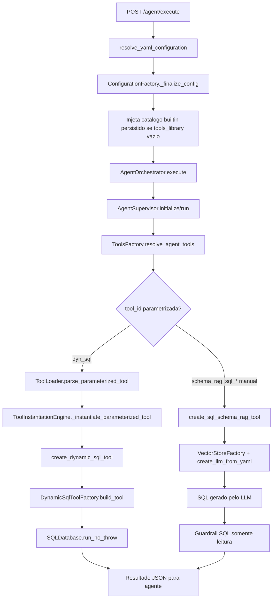
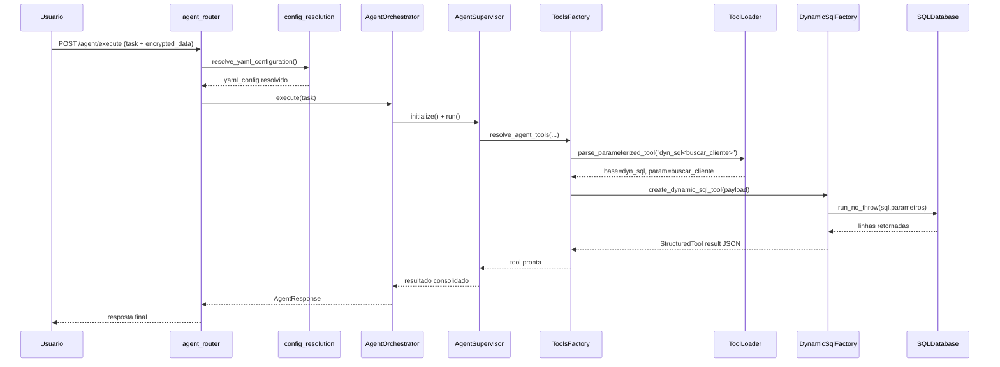
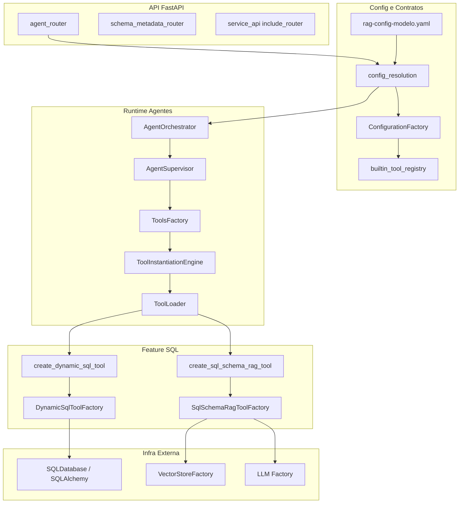

# Tutorial 101: NL2SQL

Bem-vindo(a)! Este guia foi feito para quem acabou de entrar no projeto e precisa entender, com exemplos reais do codigo, como o NL2SQL funciona hoje neste repositorio, qual caminho ja esta pronto para uso assistido e onde ainda existe dependencia operacional por tenant.

Leitura relacionada:

- `docs/README-SQL-SCHEMA-RAG-TOOL.md`
- `docs/README-DYNAMIC-SQL-TOOLS.md`
- `docs/README-INTEGRACOES-GOVERNADAS.md`

## 2) Para quem e este tutorial

- Iniciante em backend Python + FastAPI + agentes
- Dev de negocio que precisa avaliar prontidao tecnica
- Dev de infra que vai colocar a feature para rodar em ambiente real
- Pessoa que precisa decidir: usar ja ou completar lacunas primeiro

Ao final, voce vai conseguir:

- Diferenciar as duas abordagens SQL existentes no projeto
- Entender o fluxo real de execucao, tanto no endpoint dedicado quanto no runtime agentic
- Saber o que esta pronto, parcial e ausente
- Executar o caminho minimo para funcionar localmente
- Planejar uma mudanca sem quebrar a arquitetura YAML-first

## 3) Dicionario rapido (glossario obrigatorio)

- `NL2SQL`: converter pergunta em linguagem natural para SQL.
- `dyn_sql<query_id>`: tool parametrizada que executa SQL pre-definido no YAML.
- `proc_sql<procedure_id>`: tool parametrizada para stored procedures SQL.
- `schema_rag_sql_*`: tool de geracao SQL via LLM usando metadados de schema.
- `ToolsFactory`: fabrica que resolve e instancia tools para agentes/workflows.
- `ToolLoader`: parser e executor de factories (`dyn_sql<...>`, `dyn_api<...>` etc.).
- `integrations.builtin_tool_registry`: catalogo builtin persistido e auto-injetado quando `tools_library: []`.
- `local_tools_configuration`: configuracao local de tools por supervisor/agente/workflow.
- `schema_metadata`: modulo/API para ingerir metadados de banco e alimentar contexto.
- `sql_dialect`: dialeto SQL explicito do banco alvo. Hoje os valores aceitos no NL2SQL sao `postgresql`, `mysql` e `mssql`.
- `guardrail SQL`: validador de seguranca que bloqueia SQL mutavel antes de ela virar rascunho utilizavel.
- `correlation_id`: identificador de rastreio ponta a ponta nos logs.

## 4) Conceito em linguagem simples (regra da analogia)

Pense em duas formas de "pedir SQL" ao sistema:

- Forma A (ja ativa): voce pede em portugues para o agente, mas ele escolhe uma consulta que ja existe no YAML (`dyn_sql<buscar_cliente>`) e so troca os parametros (`@p1`, `@p2`).
- Forma B (mais avancada): o sistema procura metadados de tabelas/colunas em um vetor, monta contexto e pede para um LLM escrever a query SQL do zero (`schema_rag_sql_*`).

Analogia do mundo real:

- Forma A e como escolher item no cardapio e ajustar ingrediente.
- Forma B e como pedir ao chef para criar um prato novo com base no que tem na cozinha.

No estado atual, o "cardapio" esta bem conectado no runtime. O "chef" tambem ja esta publicado em um endpoint dedicado e em uma tela administrativa, mas a variante agentica generica continua dependendo de ativacao explicita por tenant.

## 5) Mapa de navegacao do repo

- `src/api/routers/agent_router.py` -> endpoint principal de execucao de agentes (`/agent/execute`) -> mexa aqui para entrada HTTP de tarefas.
- `src/api/routers/config_nl2sql_router.py` -> endpoint dedicado `POST /config/nl2sql/generate` -> mexa aqui para o contrato HTTP estavel de geracao assistida.
- `src/api/services/nl2sql_service.py` -> encapsula o uso backend de `schema_rag_sql` no modulo dedicado -> mexa aqui para resposta, diagnosticos e revisao humana.
- `src/api/routers/config_resolution.py` -> resolve YAML/payload criptografado + injecao de chaves -> mexa aqui para alterar como config e carregada.
- `src/config/config_cli/configuration_factory.py` -> finaliza YAML e injeta o catalogo builtin persistido quando vazio -> mexa aqui para bootstrap de ferramentas.
- `src/agentic_layer/supervisor/agent_supervisor.py` -> orquestrador supervisor em runtime -> mexa aqui para fluxo de execucao de agentes.
- `src/agentic_layer/supervisor/tools_factory.py` -> resolve tools com overrides por contexto -> mexa aqui para regras de resolucao de tool.
- `src/agentic_layer/supervisor/tool_loader.py` -> parse `dyn_sql<...>` e injecao de parametro (`query_id`) -> mexa aqui para sintaxe de tools parametrizadas.
- `src/agentic_layer/tools/domain_tools/dynamic_sql_tools/dynamic_sql_factory.py` -> execucao SQL dinamica com cache/retry -> mexa aqui para comportamento da feature ativa.
- `src/agentic_layer/tools/domain_tools/schema_rag_tools/sql_schema_rag_factory.py` -> geracao SQL via RAG+LLM -> mexa aqui para evoluir NL2SQL generativo.
- `integrations.builtin_tool_registry` -> catalogo central efetivo de tools no runtime -> NAO alterar por caminho paralelo ao fluxo oficial de sync e administracao.
- `src/agentic_layer/tools/tools_library_builder.py` -> gerador do catalogo e auto-registro de factories base (`dyn_sql`, `proc_sql`) -> mexa aqui se quiser registro automatico de novas families.
- `app/yaml/system/rag-config-modelo.yaml` -> exemplo real de ativacao de `dyn_sql<...>` e bloco `sql_dynamic` -> mexa aqui para habilitar queries de negocio.
- `app/ui/static/ui-admin-plataforma-sql-natural.html` -> workbench administrativo unificado de NL2SQL, queries e procedures -> mexa aqui para UX da tela final.
- `app/ui/static/js/admin-sql-natural.js` -> controlador da tela que chama o endpoint dedicado e reaproveita os cadastros governados -> mexa aqui para comportamento da UI administrativa.
- `src/api/routers/schema_metadata_router.py` -> API para ingestao de metadados de schema -> mexa aqui para alimentar a variante `schema_rag_sql_*`.

## 6) Mapa visual 1: fluxo macro (Flowchart)

## 7) Mapa visual 2: quem chama quem (Sequence)

## 8) Mapa visual 3: camadas (Layer Diagram)

```mermaid
flowchart LR
    subgraph L1[Entry Points]
        EP1[src/api/routers/agent_router.py]
        EP2[src/api/routers/schema_metadata_router.py]
    end

    subgraph L2[Orchestration]
        OR1[src/orchestrators/agent_orchestrator.py]
        OR2[src/agentic_layer/supervisor/agent_supervisor.py]
        OR3[src/agentic_layer/supervisor/tools_factory.py]
    end

    subgraph L3[Agents e Tools]
        AG1[src/agentic_layer/tools/domain_tools/dynamic_sql_tools/dynamic_sql_factory.py]
        AG2[src/agentic_layer/tools/domain_tools/schema_rag_tools/sql_schema_rag_factory.py]
        AG3[src/agentic_layer/supervisor/tool_loader.py]
    end

    subgraph L4[Dados e Infra]
        D1[DB SQL via SQLAlchemy/SQLDatabase]
        D2[VectorStoreFactory]
        D3[Resource Pool Cache]
    end

    subgraph L5[Contracts Config]
        C1[app/yaml/system/rag-config-modelo.yaml]
        C2[src/config/config_cli/configuration_factory.py]
        C3[integrations.builtin_tool_registry]
    end

    L1 --> L2 --> L3 --> L4
    C1 --> C2 --> L2
    C3 --> L2
```

## 9) Mapa visual 4: componentes (Component Diagram)

## 10) Onde isso aparece neste projeto (visao rapida)

- Endpoint de entrada de agente: `src/api/routers/agent_router.py` (`/agent/execute`).
- Endpoint dedicado de NL2SQL: `src/api/routers/config_nl2sql_router.py` (`/config/nl2sql/generate`).
- Service do boundary dedicado: `src/api/services/nl2sql_service.py`.
- Roteamento de YAML e segredo: `src/api/routers/config_resolution.py`.
- Auto-injecao do catalogo de tools: `src/config/config_cli/configuration_factory.py` (`_inject_tools_library`).
- Catalogo com `dyn_sql`/`proc_sql` ativos: `integrations.builtin_tool_registry`.
- Parse de tool parametrizada (`dyn_sql<...>`): `src/agentic_layer/supervisor/tool_loader.py`.
- Execucao SQL dinamica (query pre-definida): `src/agentic_layer/tools/domain_tools/dynamic_sql_tools/dynamic_sql_factory.py`.
- SQL Toolkit tradicional (`sql_db_query`, `sql_run` etc.): `src/agentic_layer/tools/domain_tools/data_tools/sql_database_toolkit.py`.
- NL2SQL generativo via schema+LLM: `src/agentic_layer/tools/domain_tools/schema_rag_tools/sql_schema_rag_factory.py`.
- Tela administrativa unificada: `app/ui/static/ui-admin-plataforma-sql-natural.html`.
- Controlador da UI administrativa: `app/ui/static/js/admin-sql-natural.js`.
- Exemplo YAML com agente SQL e `sql_dynamic`: `app/yaml/system/rag-config-modelo.yaml`.
- API para ingerir metadados de schema: `src/api/routers/schema_metadata_router.py`.
- Testes da parte dinamica SQL: `tests/unit/test_dynamic_sql_tools.py` e `tests/unit/test_parameterized_tools.py`.
- Testes da parte schema RAG SQL: `tests/unit/test_sql_schema_rag_tool.py`.
- Testes do endpoint dedicado: `tests/unit/test_admin_nl2sql_api.py` e `tests/integration/test_admin_nl2sql_api.py`.

## 11) Caminho real no codigo (onde olhar)

- `src/api/routers/agent_router.py` -> funcao `execute_agent` chama `invoke_agent` e dispara `AgentOrchestrator`.
- `src/orchestrators/agent_orchestrator.py` -> metodo `execute` inicializa `AgentSupervisor` e executa `run`.
- `src/agentic_layer/supervisor/agent_supervisor.py` -> resolve tools por agente (`_resolve_agent_tools`).
- `src/agentic_layer/supervisor/tools_factory.py` -> `resolve_agent_tools` aplica overrides globais/supervisor/agente.
- `src/agentic_layer/supervisor/tools_factory_engine.py` -> `_instantiate_parameterized_tool` injeta `query_id` e chama factory.
- `src/agentic_layer/supervisor/tool_loader.py` -> `parse_parameterized_tool` + `resolve_param_key` (`dyn_sql -> query_id`).
- `src/agentic_layer/tools/domain_tools/dynamic_sql_tools/dynamic_sql_factory.py` -> `create_dynamic_sql_tool` e `DynamicSqlToolFactory.build_tool`.
- `src/agentic_layer/tools/domain_tools/schema_rag_tools/sql_schema_rag_factory.py` -> `create_sql_schema_rag_tool` e pipeline RAG+LLM.
- `src/config/config_cli/configuration_factory.py` -> `_finalize_config` injeta catalogo quando `tools_library` esta vazio.
- `integrations.builtin_tool_registry` -> evidencia de registro ativo de `dyn_sql` e `proc_sql`.
- `app/yaml/system/rag-config-modelo.yaml` -> evidencia de uso real de `dyn_sql<buscar_cliente>` e bloco `sql_dynamic`.

## 12) Fluxo passo a passo (o que acontece de verdade)

1. Quando o caso de uso e geracao assistida de SQL para revisao humana, o cliente chama `POST /config/nl2sql/generate` (`src/api/routers/config_nl2sql_router.py`).
2. O backend resolve YAML e credenciais pelo mesmo resolvedor compartilhado (`src/api/routers/config_resolution.py`) ou aceita `yaml_config` inline quando a UI ja possui o contexto montado.
3. `Nl2SqlService` injeta `user_session`, exige `schema_metadata.vectorstore_id`, exige `dialect` explicito no payload HTTP e injeta `schema_metadata.sql_dialect` no contexto usado pelo motor (`src/api/services/nl2sql_service.py`).
4. A factory `schema_rag_sql` busca metadados indexados, valida se os documentos retornados sao `document_type=schema_metadata`, limita o contexto enviado ao LLM, usa retry central em vector store/LLM e gera a SQL proposta (`src/agentic_layer/tools/domain_tools/schema_rag_tools/sql_schema_rag_factory.py`).
5. Antes de expor a SQL como utilizavel, o serviço passa a proposta pelo guardrail central `SqlReadOnlyGuardrail`. Se houver `DELETE`, `UPDATE`, `DROP`, `TRUNCATE`, `SELECT INTO`, multiplas sentencas ou comando nao comprovado como leitura, a resposta vem com `success=false`, `sql=null` e diagnostico `NL2SQL_SQL_GUARDRAIL_BLOCKED`.
6. Quando o caso de uso e execucao agentica com SQL predefinida, o fluxo continua podendo entrar por `POST /agent/execute` com YAML habilitando `dyn_sql<...>` ou `schema_rag_sql` (`src/api/routers/agent_router.py`).
7. Nesse fluxo agentico, a configuracao e finalizada e, se `tools_library` estiver vazio, o catalogo central e auto-injetado (`src/config/config_cli/configuration_factory.py`).
8. O supervisor resolve tools do agente com contexto local (`src/agentic_layer/supervisor/tools_factory.py`).
9. Se o tool id vier no formato `dyn_sql<query_id>`, o parser extrai base e parametro (`src/agentic_layer/supervisor/tool_loader.py`) e a execucao segue para `DynamicSqlToolFactory`.

Com config ativa:

- `dyn_sql<...>` funciona por default porque `dyn_sql` esta no catalogo central e o YAML de modelo ja traz `local_tools_configuration.sql_dynamic` + lista de tools no agente SQL (`app/yaml/system/rag-config-modelo.yaml`).
- `schema_rag_sql` tambem ja existe no catalogo central e o YAML de modelo ja documenta um bloco minimo para habilitar essa capacidade quando o tenant realmente quiser ativar o caminho agentico.

No estado atual:

- O modulo dedicado de NL2SQL ja esta pronto para uso assistido com dialeto explicito, guardrail somente leitura, retry externo e diagnosticos de contexto.
- O que continua nao acontecendo automaticamente e a ativacao por tenant do caminho agentico generico, porque ele depende de schema metadata real e de YAML explicito.

## 13) Status: esta pronto? quanto esta pronto?

| area | evidencia | status | impacto pratico | proximo passo minimo |
| --- | --- | --- | --- | --- |
| Router de execucao de agente | `src/api/routers/agent_router.py`, `src/api/service_api.py` | pronto | Ja existe entrada HTTP para acionar tools SQL via agente | Nenhum |
| Resolucao YAML + injecao tools | `src/api/routers/config_resolution.py`, `src/config/config_cli/configuration_factory.py` | pronto | Boot de tools acontece automaticamente quando `tools_library: []` | Nenhum |
| Catalogo parametrizado dyn_sql/proc_sql | `integrations.builtin_tool_registry`, `src/agentic_layer/tools/tools_library_builder.py` | pronto | `dyn_sql<...>` e reconhecido sem registro manual em cada tenant | Nenhum |
| Execucao SQL dinamica (template SQL) | `src/agentic_layer/tools/domain_tools/dynamic_sql_tools/dynamic_sql_factory.py` | pronto | Fluxo SQL de negocio roda com cache, retry, parametros | Ajustar hardening de observabilidade por query (opcional) |
| Testes dyn_sql e parser parametrizado | `tests/unit/test_dynamic_sql_tools.py`, `tests/unit/test_parameterized_tools.py` | pronto | Boa cobertura de parser/cache/validacoes principais | Adicionar teste de ponta a ponta HTTP (opcional) |
| NL2SQL generativo (RAG de schema + LLM) | `src/agentic_layer/tools/domain_tools/schema_rag_tools/sql_schema_rag_factory.py`, `integrations.builtin_tool_registry`, `tests/unit/test_sql_schema_rag_tool.py` | pronto | A capacidade canonica existe no catalogo e ja pode ser usada tanto pelo endpoint dedicado quanto por YAML que habilite `schema_rag_sql` | Garantir metadados de schema indexados por tenant |
| Ingestao de metadados de schema | `src/api/routers/schema_metadata_router.py`, `app/yaml/system/rag-config-modelo.yaml` | parcial | A trilha de metadados existe, mas cada tenant ainda precisa indexar o proprio schema e preencher `schema_metadata.vectorstore_id` corretamente | Criar rotina operacional por tenant para ingestao e validacao dos metadados |
| Endpoint dedicado "gerar SQL" | `src/api/routers/config_nl2sql_router.py`, `src/api/services/nl2sql_service.py`, `tests/integration/test_admin_nl2sql_api.py` | pronto | O produto ja tem contrato HTTP estavel para receber linguagem natural e devolver SQL proposta com `correlation_id`, `diagnostics`, `review_required` e guardrail somente leitura | Garantir `yaml_config` valido com `schema_metadata.vectorstore_id` e enviar `dialect` explicito |
| Tela administrativa SQL/NL2SQL | `app/ui/static/ui-admin-plataforma-sql-natural.html`, `app/ui/static/js/admin-sql-natural.js` | pronto | O operador ja consegue gerar SQL, revisar, copiar para o cadastro governado e acionar testes seguros na mesma jornada | Manter a revisao humana antes de salvar ou executar |
| Streaming especifico para NL2SQL | Nao encontrado no escopo NL2SQL | ausente | Sem trilha especializada para acompanhar apenas geracao SQL | Reusar streaming geral ou criar endpoint/evento dedicado |
| Prontidao de producao (NL2SQL generativo) | `integrations.builtin_tool_registry`, `app/yaml/system/rag-config-modelo.yaml`, `tests/integration/test_admin_nl2sql_api.py` | parcial | O modulo dedicado ja esta pronto para uso assistido, mas a trilha agentica continua dependendo de configuracao explicita por tenant e de schema metadata real | Fechar checklist de ativacao por tenant e smoke test fim a fim |

## 14) Como colocar para funcionar (hands-on end-to-end)

Passo 0 - Confirmar o boundary certo

- Se o objetivo e gerar uma SQL para revisao humana, use o endpoint dedicado `POST /config/nl2sql/generate` em `src/api/routers/config_nl2sql_router.py`.
- Se o objetivo e executar SQL dentro de um agente, use `POST /agent/execute` com YAML habilitando `dyn_sql<...>` ou `schema_rag_sql`.
- Se o objetivo e operacao manual guiada por interface, a tela `app/ui/static/ui-admin-plataforma-sql-natural.html` ja usa o endpoint dedicado e reaproveita os cadastros governados.

Passo 1 - Validar o ambiente que o proprio repo espera

- O runner oficial `run.sh` exige um Python executavel em `.venv/bin/python`, conforme `run.sh`.
- O wrapper `main.py` tambem deixa explicito que o caminho correto de execucao e dentro da `.venv` ou usando `.venv/bin/python main.py`.
- Nao encontrei, no escopo analisado, um script versionado especifico para preparar a `.venv` do zero so para este modulo. Na pratica, o tutorial parte de um ambiente local do projeto ja preparado.

Passo 2 - Garantir contexto minimo de NL2SQL

- Para o endpoint dedicado, o minimo obrigatorio e `schema_metadata.vectorstore_id` no YAML resolvido ou no `yaml_config` enviado inline.
- O request HTTP tambem precisa enviar `dialect` explicito com `postgresql`, `mysql` ou `mssql`, conforme `src/api/schemas/nl2sql_models.py`.
- Sem isso, `Nl2SqlService` falha cedo com erro de contexto, em vez de inventar SQL sem base real.

Passo 3 - Subir a API local

- Caminho versionado recomendado no repo: `./run.sh +a`.
- Alternativa compatível com o wrapper do projeto: `source .venv/bin/activate && python main.py`.
- O que eu espero ver: a aplicacao FastAPI carregada com os routers montados em `src/api/service_api.py`, incluindo `config_nl2sql_router`.
- Validacao pratica: abrir a documentacao interativa da API na rota local `/docs`, recurso padrao do FastAPI.

Passo 4 - Testar o endpoint dedicado de NL2SQL

- Endpoint: `POST /config/nl2sql/generate`.
- Payload minimo: `prompt`, `user_email`, `dialect` e um YAML valido com `schema_metadata.vectorstore_id`.
- O que eu espero ver: resposta com `success`, `correlation_id`, `diagnostics`, `review_required=true` e, quando o guardrail aprovar, uma `sql` proposta somente leitura.

Passo 5 - Validar a jornada administrativa SQL/NL2SQL

- A tela `app/ui/static/ui-admin-plataforma-sql-natural.html` chama o endpoint dedicado, mostra a SQL proposta e permite transferir esse texto para o cadastro governado.
- A mesma jornada reaproveita os testes seguros das queries e procedures ja governadas.
- O comportamento correto continua sendo revisão humana antes de salvar, publicar ou executar.

Passo 6 - Preparar o caminho agentico completo, se ele for realmente necessario

- Ingerir metadados via `schema_metadata_router.py`, porque a variante generativa depende de schema metadata real por tenant.
- Habilitar `schema_rag_sql` no YAML do supervisor ou do agente usando os exemplos existentes em `app/yaml/system/rag-config-modelo.yaml` e `app/yaml/rag-config-pdv-nl2sql.yaml`.
- Para producao recorrente, manter `dyn_sql<...>` e `proc_sql<...>` como baseline operacional e tratar NL2SQL como etapa de autoria assistida e revisão.

Passo 7 - Validar com a suite oficial

- Antes de rodar a suite, leia o cabecalho de `scripts/suite_de_testes_padrao.sh`, que e o help oficial do runner.
- Ciclo focado sugerido para este tema: `source .venv/bin/activate && ./scripts/suite_de_testes_padrao.sh --focus-paths tests/unit/test_admin_nl2sql_api.py,tests/integration/test_admin_nl2sql_api.py,tests/unit/test_sql_schema_rag_tool.py`.
- Checagem operacional compacta: `source .venv/bin/activate && ./scripts/suite_de_testes_padrao.sh --status-repo`.
- Fechamento amplo oficial: `source .venv/bin/activate && ./scripts/suite_de_testes_padrao.sh --all-tests`, seguido imediatamente por `source .venv/bin/activate && ./scripts/suite_de_testes_padrao.sh --status-repo`.
- Depois de cada rodada, a leitura obrigatoria e `./.sandbox/tmp/full_suite_latest_telemetry.json`, e so depois disso faz sentido concluir sucesso ou propor correcoes.

Se algo nao existir:

- `.env.example` nao foi encontrado no escopo analisado, apesar de citado no `README.md`.
- Streaming dedicado so para NL2SQL nao foi encontrado no codigo; o modulo segue usando `correlation_id` e logs canonicos para rastreio.

## 15) ELI5: onde coloco cada parte da feature neste projeto?

- Entrada HTTP dedicada: em `src/api/routers/config_nl2sql_router.py`.
- Entrada HTTP agentica: em `src/api/routers/agent_router.py`.
- Regras de configuracao YAML e segredo: `src/api/routers/config_resolution.py` + `src/config/config_cli/configuration_factory.py`.
- Orquestracao de execucao: `src/orchestrators/agent_orchestrator.py`.
- Resolucao/instanciacao de tools: `src/agentic_layer/supervisor/tools_factory.py` e `src/agentic_layer/supervisor/tools_factory_engine.py`.
- Core SQL dinamico: `src/agentic_layer/tools/domain_tools/dynamic_sql_tools/dynamic_sql_factory.py`.
- Core SQL generativo (RAG): `src/agentic_layer/tools/domain_tools/schema_rag_tools/sql_schema_rag_factory.py`.
- Service do modulo dedicado: `src/api/services/nl2sql_service.py`.
- UI administrativa atual: `app/ui/static/ui-admin-plataforma-sql-natural.html` e `app/ui/static/js/admin-sql-natural.js`.

| Pergunta | Resposta | Camada | Onde no repo |
| --- | --- | --- | --- |
| Onde a request entra no modulo dedicado? | Em `/config/nl2sql/generate` | Entry point | `src/api/routers/config_nl2sql_router.py` |
| Onde a request entra no fluxo agentico? | Em `/agent/execute` | Entry point | `src/api/routers/agent_router.py` |
| Onde o YAML vira config final? | Em `resolve_yaml_configuration` + `ConfigurationFactory` | Contrato/config | `src/api/routers/config_resolution.py`, `src/config/config_cli/configuration_factory.py` |
| Onde a resposta dedicada ganha diagnosticos e revisao humana? | Em `Nl2SqlService` | Boundary/service | `src/api/services/nl2sql_service.py` |
| Onde tool `dyn_sql<...>` vira objeto executavel? | Parse + instanciacao parametrizada | Orquestracao/tools | `src/agentic_layer/supervisor/tool_loader.py`, `src/agentic_layer/supervisor/tools_factory_engine.py` |
| Onde SQL e executado de fato? | `SQLDatabase.run_no_throw` | Infra dados | `src/agentic_layer/tools/domain_tools/dynamic_sql_tools/dynamic_sql_factory.py` |
| Onde SQL e gerado por LLM? | Em `SqlSchemaRagToolFactory` | Agente/tool | `src/agentic_layer/tools/domain_tools/schema_rag_tools/sql_schema_rag_factory.py` |
| Onde configuro queries e conexoes? | No YAML de supervisor em `local_tools_configuration.sql_dynamic` ou nos cadastros governados da Area Plataforma | Contrato YAML / modulo administrativo | `app/yaml/system/rag-config-modelo.yaml`, `app/ui/static/ui-admin-plataforma-sql-natural.html` |

## 16) Template de mudanca (preenchido com padroes do repo)

1) entrada: qual endpoint/job dispara?

- endpoint: `POST /agent/execute`
- paths: `src/api/routers/agent_router.py`
- contrato de entrada: `AgentRequest`

1) config: qual YAML/env controla?

- keys: `tools_library`, `multi_agents[].agents[].tools`, `local_tools_configuration.sql_dynamic`
- onde e lido: `src/api/routers/config_resolution.py`, `src/config/config_cli/configuration_factory.py`, `src/agentic_layer/supervisor/config_resolver.py`

1) execucao: qual grafo ou no entra?

- builder/factory: `AgentOrchestrator` -> `AgentSupervisor`
- state: thread/session no supervisor (`agent_supervisor.py`)

1) ferramentas: quais tools sao usadas?

- registro: `integrations.builtin_tool_registry`
- chamadas: `ToolLoader` e `ToolInstantiationEngine`

1) dados: onde persiste/cache/indexa?

- MySQL/SQL: via URI em `security_keys` e `SQLDatabase` no `dynamic_sql_factory.py`
- Redis: cache/infra geral de runtime (nao especifico de NL2SQL)
- Qdrant/outros: via `VectorStoreFactory` para `schema_rag_sql_*`

1) observabilidade: onde loga/traca?

- logs: `create_logger_with_correlation` em routers/supervisor/tools
- correlation: propagado por `correlation_id` no request e user_session

1) testes: onde validar?

- unit: `tests/unit/test_dynamic_sql_tools.py`, `tests/unit/test_parameterized_tools.py`, `tests/unit/test_sql_schema_rag_tool.py`, `tests/unit/test_admin_nl2sql_api.py`
- integration: `tests/integration/test_admin_nl2sql_api.py`

## 17) CUIDADO: o que NAO fazer (guarda-corpos)

- Nao executar parsing de YAML dentro de endpoint de negocio.
- Nao hardcodar URI de banco no codigo da tool; usar `security_keys`/`secret_key`.
- Nao bypassar `ToolsFactory` instanciando tool SQL direto no router.
- Nao adicionar chave nova no YAML sem consumo real no codigo.
- Nao misturar contrato HTTP com tipos internos do supervisor.

## 18) Anti-exemplos (obrigatorio)

- Erro comum: parsing de YAML dentro de `execute_agent`.
- Por que e ruim: duplica regra de resolucao e quebra consistencia multi-tenant.
- Correcao: centralizar em `resolve_yaml_configuration` (`src/api/routers/config_resolution.py`).

- Erro comum: criar query SQL inline no handler sem `dyn_sql`.
- Por que e ruim: quebra modelo YAML-first e remove rastreabilidade por tool.
- Correcao: definir query em `local_tools_configuration.sql_dynamic` no YAML.

- Erro comum: acessar DB direto dentro de `ToolLoader`.
- Por que e ruim: `ToolLoader` e camada de carregamento, nao de dominio/infra.
- Correcao: manter DB no `DynamicSqlToolFactory`.

- Erro comum: assumir que `schema_rag_sql_*` esta ativo so porque existe codigo.
- Por que e ruim: sem schema metadata real e sem YAML explicito por tenant, o caminho agentico nao entra em producao de forma segura.
- Correcao: usar o endpoint dedicado para autoria assistida e ativar o caminho agentico so quando houver checklist completo por tenant.

## 19) Exemplos guiados (2 a 4)

Exemplo 1: SQL dinamico de cliente

- Fio do codigo: `app/yaml/system/rag-config-modelo.yaml` (tool `dyn_sql<buscar_cliente>`) -> `tool_loader.py` (parse) -> `dynamic_sql_factory.py` (execucao).
- O que acontece: agente recebe pergunta sobre cliente e executa query pre-definida com parametro.

Exemplo 2: Cache e thread-safety da tool SQL

- Fio do codigo: `dynamic_sql_factory.py` usa `resource_pool.get_dynamic_tool`.
- Validacao: `tests/unit/test_dynamic_sql_tools.py` tem cenarios de cache hit e concorrencia.

Exemplo 3: Rota de ativacao da feature

- Fio do codigo: `config_nl2sql_router.py` -> `nl2sql_service.py` -> `sql_schema_rag_factory.py`.
- Resultado pratico: o produto ja tem endpoint exclusivo de NL2SQL, com diagnosticos e revisao humana explicitos.

Exemplo 4: Caminho da variante generativa

- Fio do codigo: `sql_schema_rag_factory.py` + `schema_metadata_router.py` + `rag-config-modelo.yaml`.
- Estado: implementado no codigo, presente no catalogo e documentado no YAML de modelo, mas ainda dependente de ativacao operacional por tenant.

## 20) Erros comuns e como reconhecer (debugging)

- sintoma observavel: erro "Query 'X' nao encontrada".
- hipotese: `query_id` nao existe em `sql_dynamic.queries`.
- como confirmar: `dynamic_sql_factory.py` e YAML em `rag-config-modelo.yaml`.
- correcao segura: alinhar `dyn_sql<query_id>` com chave da query no YAML.

- sintoma observavel: erro de conexao SQL (secret ausente).
- hipotese: `secret_key` mapeada nao existe em `security_keys`.
- como confirmar: `_resolve_connection_uri` em `dynamic_sql_factory.py`.
- correcao segura: injetar segredo correto para o tenant.

- sintoma observavel: tool base nao encontrada para `dyn_sql<...>`.
- hipotese: catalogo sem `dyn_sql`.
- como confirmar: o catalogo builtin persistido contem id `dyn_sql`.
- correcao segura: regenerar catalogo com `tools_library_builder.py`.

- sintoma observavel: agente ignora SQL e responde genericamente.
- hipotese: descricao/prompts/roteamento nao selecionaram o agente SQL.
- como confirmar: `multi_agents[].agents[]` no YAML e logs de roteamento.
- correcao segura: reforcar descricao e ferramentas do agente SQL.

- sintoma observavel: `schema_rag_sql` nunca e chamada.
- hipotese: tool nao registrada/ativada.
- como confirmar: ausencia no catalogo builtin persistido e nos YAMLs.
- correcao segura: registrar e incluir em `agents[].tools`.

- sintoma observavel: retorno "-- Aviso: Nenhum metadado...".
- hipotese: vector store de metadados nao populado.
- como confirmar: `sql_schema_rag_factory.py` e ingestao em `schema_metadata_router.py`.
- correcao segura: executar ingestao de metadados antes do uso.

## 21) Exercicios guiados (obrigatorio)

Exercicio 1 (5-10 min)

- objetivo: comprovar que `dyn_sql` esta no catalogo ativo.
- passos: consultar o catalogo builtin persistido e localizar id `dyn_sql`.
- como verificar no codigo: procurar bloco com `factory_impl` para `create_dynamic_sql_tool`.
- gabarito: id existe e esta `status: active`.

Exercicio 2 (10-15 min)

- objetivo: seguir o parametro `query_id` da sintaxe `dyn_sql<buscar_cliente>` ate a execucao.
- passos: ler `tool_loader.py` (`parse_parameterized_tool`), depois `tools_factory_engine.py` (`_instantiate_parameterized_tool`), depois `dynamic_sql_factory.py`.
- como verificar no codigo: encontrar `resolve_param_key("dyn_sql") -> "query_id"`.
- gabarito: `query_id` entra no payload e seleciona a query em `sql_dynamic.queries`.

Exercicio 3 (10-15 min)

- objetivo: identificar o que ja esta pronto no modulo dedicado e o que ainda depende de tenant.
- passos: buscar `create_sql_schema_rag_tool` em `src/`, depois `schema_rag_sql` no catalogo builtin persistido, `app/yaml/system/rag-config-modelo.yaml` e por fim abrir `config_nl2sql_router.py`.
- como verificar no codigo: confirmar implementacao/testes presentes, endpoint dedicado publicado, dependencia operacional de `schema_metadata.vectorstore_id`, `dialect` explicito e guardrail central.
- gabarito: modulo dedicado pronto; ativacao agentica ainda depende de dados e YAML do tenant.

## 22) Checklist final

- [ ] Entendi a diferenca entre `dyn_sql` e `schema_rag_sql`.
- [ ] Sei onde a requisicao entra no endpoint dedicado (`/config/nl2sql/generate`).
- [ ] Sei onde a requisicao entra no fluxo agentico (`/agent/execute`).
- [ ] Sei onde o YAML e resolvido e normalizado.
- [ ] Sei que `tools_library: []` dispara auto-injecao.
- [ ] Validei que `dyn_sql` esta no catalogo central.
- [ ] Validei que `schema_rag_sql` esta no catalogo central.
- [ ] Validei no YAML um agente com `dyn_sql<...>`.
- [ ] Validei bloco `local_tools_configuration.sql_dynamic`.
- [ ] Validei `schema_metadata.vectorstore_id` e escolhi `dialect` explicitamente para o caso de NL2SQL assistido.
- [ ] Sei seguir parser parametrizado ate SQL executado.
- [ ] Sei onde ficam os testes principais de SQL dinamico.
- [ ] Sei que a variante agentica depende de ativacao operacional por tenant.
- [ ] Sei qual passo minimo para ativar `schema_rag_sql` de forma segura.

## 23) Checklist de PR quando mexer nisso (obrigatorio)

- [ ] Nao quebrou `resolve_yaml_configuration`.
- [ ] Nao removeu regra de auto-injecao de `tools_library`.
- [ ] Manteve parser de tool parametrizada compativel.
- [ ] Nao introduziu SQL hardcoded fora das tools.
- [ ] Atualizou YAML de exemplo se mudou contrato de `sql_dynamic`.
- [ ] Cobriu alteracao com teste unitario em `tests/unit/`.
- [ ] Validou logs com `correlation_id`.
- [ ] Verificou cache/thread-safety se mexeu em factory SQL.
- [ ] Se adicionou tool nova, confirmou registro no catalogo.
- [ ] Se ativou `schema_rag_sql`, incluiu caminho de ingestao de metadados e checklist operacional por tenant.

## 24) Referencias

Referencias internas (codigo do repo)

- `src/api/routers/agent_router.py`
- `src/api/routers/config_nl2sql_router.py`
- `src/api/services/nl2sql_service.py`
- `src/api/routers/config_resolution.py`
- `src/config/config_cli/configuration_factory.py`
- `src/orchestrators/agent_orchestrator.py`
- `src/agentic_layer/supervisor/agent_supervisor.py`
- `src/agentic_layer/supervisor/tools_factory.py`
- `src/agentic_layer/supervisor/tools_factory_engine.py`
- `src/agentic_layer/supervisor/tool_loader.py`
- `src/agentic_layer/tools/domain_tools/dynamic_sql_tools/dynamic_sql_factory.py`
- `src/agentic_layer/tools/domain_tools/schema_rag_tools/sql_schema_rag_factory.py`
- `integrations.builtin_tool_registry`
- `src/agentic_layer/tools/tools_library_builder.py`
- `src/api/routers/schema_metadata_router.py`
- `app/ui/static/ui-admin-plataforma-sql-natural.html`
- `app/ui/static/js/admin-sql-natural.js`
- `app/yaml/system/rag-config-modelo.yaml`
- `tests/unit/test_dynamic_sql_tools.py`
- `tests/unit/test_parameterized_tools.py`
- `tests/unit/test_sql_schema_rag_tool.py`
- `tests/unit/test_admin_nl2sql_api.py`
- `tests/integration/test_admin_nl2sql_api.py`
- `README.md`
- `pyproject.toml`
- `scripts/suite_de_testes_padrao.sh`

Referencias externas (normativas)

- FastAPI, documentacao oficial de visao geral e documentacao interativa OpenAPI/Swagger UI.
- LangChain, documentacao oficial de visao geral do runtime Python e uso de tools em aplicacoes com LLM.
