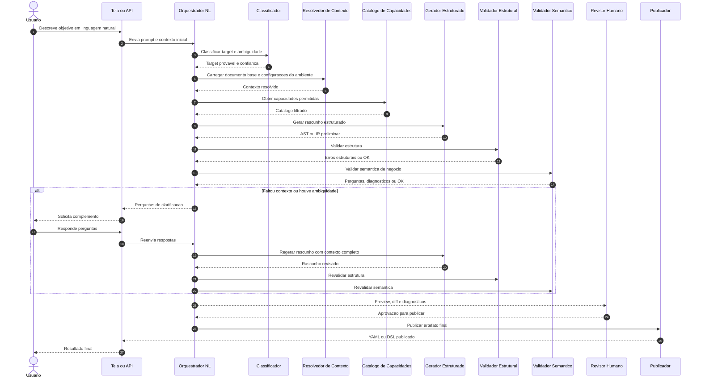

# Tutorial 101: Técnica de Geração de YAML e DSL por Linguagem Natural

## 1. Visão geral

Este documento explica a técnica de transformar linguagem natural em YAML ou em uma DSL proprietária sem perder controle técnico.
Aqui o foco não é um endpoint específico do produto, e sim o padrão arquitetural que torna essa transformação segura, auditável e reutilizável.
Essa técnica é útil quando a pessoa sabe descrever o que quer em palavras, mas não domina a sintaxe formal da configuração ou da linguagem de regras.
O objetivo correto não é "executar texto livre". O objetivo correto é usar a linguagem natural como entrada de intenção, passar essa intenção por um funil de estruturação e publicar apenas um artefato formal validado.

## 2. Por que essa técnica existe

Em muitos sistemas, a linguagem formal é poderosa, mas cara para quem opera o negócio.
YAMLs de agentes, DSLs de ERP, fórmulas de aprovação, expressões de roteamento e regras comerciais costumam exigir conhecimento técnico detalhado.
Isso cria gargalo: a área de negócio sabe o que precisa, mas depende de alguém que conheça a sintaxe exata.
A técnica NL -> YAML ou NL -> DSL existe para reduzir esse atrito sem abrir mão de contrato, validação, revisão e governança.

## 3. Explicação conceitual

O ponto central é tratar linguagem natural como matéria-prima de especificação, não como artefato final executável.
O texto do usuário entra em um pipeline que classifica a intenção, identifica o alvo correto, coleta contexto existente, escolhe capacidades permitidas, gera um rascunho estruturado e submete esse rascunho a validações.
Se faltar contexto, o sistema pergunta.
Se o rascunho violar o contrato, ele é rejeitado.
Se tudo estiver coerente, o sistema produz um preview e só então publica o YAML ou a DSL final.
Em outras palavras, a linguagem natural abre a porta, mas quem entra em produção é sempre uma estrutura formal governada.

## 4. Explicação for dummies

Imagine que o usuário fala: "quero uma regra para dar desconto progressivo quando o cliente for premium e o pedido passar de certo valor".
Se o sistema jogasse essa frase direto no runtime, ele correria o risco de interpretar errado, esquecer uma exceção fiscal ou criar uma regra impossível de auditar.
O fluxo certo é parecido com um atendente técnico muito disciplinado.
Ele escuta a frase, entende o tipo de problema, consulta as regras já existentes, monta um rascunho da regra, confere se a sintaxe e a lógica fazem sentido, pergunta o que faltou e só depois entrega a versão formal.
No fim, a pessoa continua escrevendo em linguagem humana, mas o sistema continua operando com contrato técnico.
Esse detalhe é o que separa uma solução robusta de uma automação frágil baseada em chute.

## 5. Os blocos da arquitetura

### 5.1 Linguagem alvo definida

Antes de pensar em modelo de linguagem, é obrigatório definir a linguagem final que será produzida.
Pode ser YAML, JSON, AST tipada ou uma DSL textual proprietária.
Sem isso, o sistema não sabe o que significa "certo" ou "errado".
Na prática, a técnica só funciona bem quando existe um contrato formal claro para onde a entrada natural será convertida.

### 5.2 Classificador de intenção e target

Nem toda frase pede o mesmo tipo de artefato.
Algumas frases pedem workflow, outras pedem supervisor, outras pedem fórmula, política comercial, consulta ou roteamento.
Por isso, o pipeline precisa de uma etapa que decida qual target deve ser montado.
Esse classificador pode ser heurístico, baseado em LLM, ou híbrido.
O importante é que ele saiba devolver confiança, ambiguidade e candidatos alternativos.

### 5.3 Contexto base

Quase nunca o artefato nasce do zero.
Normalmente já existe um documento base, um tenant, uma configuração anterior, um catálogo de funções ou uma convenção de domínio.
Esse contexto é essencial para que a geração seja compatível com o mundo real da aplicação.
Na prática, o sistema não deveria inventar memória, módulos, permissões, campos ou funções se isso já depende de contexto explícito do ambiente.

### 5.4 Catálogo de capacidades permitidas

Uma boa geração controlada trabalha com um catálogo finito do que pode ser usado.
No caso de agentes, isso pode ser catálogo de tools.
No caso de um ERP, pode ser catálogo de funções de cálculo, campos de nota fiscal, tipos de documento, eventos e operadores permitidos.
Isso reduz alucinação e impede que o gerador proponha coisas que o runtime não entende.

### 5.5 Gerador de rascunho estruturado

O rascunho pode ser produzido por heurística, por LLM com schema rígido ou por uma combinação dos dois.
O ponto importante é que a saída não deve ser texto livre sem forma.
Ela deve sair em um modelo intermediário estruturado, como AST, IR ou JSON schema validável.
Esse estágio é o coração da técnica porque separa "o que o usuário quis dizer" de "o que o runtime aceita executar".

### 5.6 Validação estrutural

Validação estrutural responde perguntas como: os campos obrigatórios existem, os tipos estão corretos, os blocos estão no lugar certo e a forma geral respeita o contrato?
Essa camada pega erros de montagem antes de discutir semântica de negócio.
Na prática, é a barreira que impede publicar um YAML quebrado ou uma DSL malformada.

### 5.7 Validação semântica

Validação semântica responde perguntas mais profundas.
Essa regra faz sentido para esse domínio?
Essa combinação de campos é permitida?
Essa memória é obrigatória?
Esse operador pode usar essa função?
Esse fluxo referencia um recurso que existe?
É aqui que a técnica sai do "parece válido" e passa para o "é válido no mundo real".

### 5.8 Loop de clarificação

Quando existir ambiguidade, o sistema deve perguntar, não adivinhar.
Essa é uma das partes mais importantes do desenho.
Sem clarificação, a automação passa a parecer inteligente enquanto toma decisões erradas em silêncio.
Na prática, perguntas boas preservam segurança e aumentam a taxa de acerto do artefato final.

### 5.9 Preview antes de publicar

Publicar direto costuma ser uma má ideia.
O ideal é sempre produzir preview, diff, diagnostics e, quando possível, uma explicação do que mudou.
Isso dá espaço para revisão humana e evita que a geração vire uma caixa-preta.
Na prática, preview é o que permite tratar NL -> YAML ou NL -> DSL como engenharia, não como mágica.

### 5.10 Publicação controlada

A etapa final deve ser explícita e auditável.
Quem publicou, quando publicou, qual contexto foi usado, quais perguntas foram respondidas e qual versão saiu precisam estar rastreáveis.
Sem isso, a técnica vira um mecanismo perigoso de mutação invisível da configuração.

## 6. Diagrama de sequência

## 7. Como o usuário recebe essa feature

Do ponto de vista de produto, a pessoa costuma receber essa capacidade por uma tela administrativa, por um endpoint ou por um assistente interno.
O importante é que a interface não seja só uma caixa de texto com botão de salvar.
Ela precisa expor, no mínimo, o objetivo, o target quando aplicável, o preview, os diagnósticos, as perguntas pendentes e a confirmação final de publicação.
Na prática, a experiência do usuário precisa deixar visível que existe um processo de montagem assistida, não uma tradução mágica opaca.

## 8. Como aplicar isso em uma DSL proprietária de ERP

### 8.1 Primeiro defina a DSL mínima

Se a empresa possui uma linguagem própria para fórmulas, regras fiscais, descontos, cálculo de comissão ou liberação de pedidos, o primeiro passo é congelar a gramática útil dessa linguagem.
Não tente começar pela linguagem natural antes de estabilizar o contrato formal.
Na prática, sem esse contrato o gerador não terá fronteira clara entre o que pode e o que não pode criar.

### 8.2 Modele uma representação canônica

Em vez de gerar a DSL final logo de cara, é melhor ter uma representação intermediária canônica.
Pode ser uma AST ou um JSON tipado com campos como condição, ação, operadores, fontes de dados e efeitos colaterais.
Isso facilita validação, revisão e compilação para a sintaxe proprietária final.
Na prática, a AST protege o sistema contra acoplamento excessivo com a forma textual da DSL.

### 8.3 Crie um catálogo de vocabulário do domínio

No ERP, o gerador precisa conhecer entidades e ações reais, como pedido, cliente, tabela de preço, centro de custo, natureza fiscal, margem, desconto, imposto e comissão.
Esse catálogo deve informar o que é permitido, quais campos existem e em quais módulos a regra pode atuar.
Sem isso, o modelo tende a inventar campos ou combinações que parecem plausíveis, mas não existem no sistema.

### 8.4 Force clarificação nas ambiguidades importantes

Existem ambiguidades que não podem ser resolvidas por adivinhação.
Por exemplo: desconto sobre valor bruto ou líquido, arredondamento bancário ou comercial, data de competência ou de emissão, regra por filial ou por empresa, prevalência sobre tabela promocional ou padrão.
Esses pontos precisam gerar perguntas obrigatórias.
Na prática, isso evita que uma frase aparentemente simples vire uma regra financeiramente errada.

### 8.5 Gere preview antes da publicação

Para DSL de ERP, preview é ainda mais importante porque o impacto costuma ser financeiro, fiscal ou operacional.
O ideal é mostrar a regra interpretada, os parâmetros escolhidos, o texto formal resultante e, quando possível, exemplos de casos de teste.
Na prática, isso permite que a área de negócio confirme a intenção antes de afetar documentos reais.

### 8.6 Valide com cenários de negócio

Além da validação sintática, uma DSL proprietária precisa de testes de cenário.
Exemplos: pedido de cliente premium com valor acima do limiar, pedido abaixo do limiar, cliente comum, filial sem permissão e produto bloqueado para desconto.
Na prática, a técnica só fica confiável quando o artefato gerado passa por exemplos concretos do domínio.

## 9. O que muda na vida do usuário

O ganho principal é velocidade com governança.
O usuário não precisa mais dominar cada detalhe da sintaxe formal para começar a montar uma configuração ou regra.
Ao mesmo tempo, a empresa não precisa aceitar uma automação irresponsável que publica artefatos sem contrato e sem revisão.
Na prática, o processo fica mais acessível para o negócio e continua controlado para a engenharia.

## 10. Limites e pegadinhas

1. Linguagem natural nunca elimina a necessidade de contrato formal.
2. LLM sem schema, catálogo e validação não resolve esse problema de forma segura.
3. Quanto mais crítica a DSL, maior deve ser o peso de clarificação, preview e aprovação humana.
4. Se a equipe pular a camada de validação semântica, vai gerar regras aparentemente válidas mas operacionalmente erradas.
5. Se o catálogo de domínio estiver incompleto, a qualidade da geração cai mesmo que o modelo seja bom.

## 11. Troubleshooting

### Sintoma: o sistema gera artefato muito genérico

Causa comum: o objetivo veio amplo demais ou o target não ficou claro.
O que fazer: melhorar o classificador, enriquecer o prompt com contexto e ampliar o catálogo do domínio.

### Sintoma: a sintaxe parece correta, mas a regra não faz sentido

Causa comum: faltou validação semântica ligada ao domínio.
O que fazer: introduzir validators de negócio, exemplos concretos e perguntas de clarificação nas ambiguidades críticas.

### Sintoma: o sistema inventa funções ou campos

Causa comum: catálogo de capacidades frouxo ou inexistente.
O que fazer: restringir o espaço de geração ao inventário real do runtime.

### Sintoma: o usuário não confia no resultado

Causa comum: faltam preview, diff, explicação do que foi entendido e etapa explícita de confirmação.
O que fazer: tornar a trilha visível e auditável.

## 12. Recomendação objetiva

A melhor arquitetura para NL -> YAML ou NL -> DSL não é a que tenta ser mais "mágica".
É a que trata linguagem natural como entrada assistida de especificação e obriga a passagem por target claro, contexto, catálogo, rascunho estruturado, validação estrutural, validação semântica, clarificação e publicação controlada.
Se você quiser reaplicar essa técnica em uma linguagem proprietária de ERP, comece pela AST canônica e pelos validators de domínio.
O modelo de linguagem deve ser só uma peça do pipeline, nunca o contrato principal do sistema.
