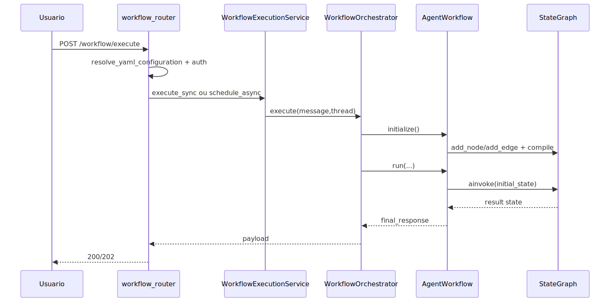

# Tutorial 101: Criação e Configuração de Workflows

Este guia explica como um workflow YAML vira um grafo LangGraph executável na Plataforma de Agentes de IA.

## 1) Para quem é este tutorial

- Iniciante em workflows do projeto.
- Consultor júnior que precisa configurar `workflows[]`.
- Dev que vai ajustar nodes/edges sem quebrar execução.

Ao final:

- Você vai localizar ponto de entrada e runtime.
- Vai entender `node-driven` vs `edge-first`.
- Vai saber onde está o estado `WorkflowState`.
- Vai conseguir validar execução sync/async.

## Leitura relacionada

- Aprofundamento técnico completo: [README-AGENTE-WORKFLOW.md](./README-AGENTE-WORKFLOW.md)
- Contrato comum do YAML agentic: [README-AGENTIC-CONTRATO-COMUM.md](./README-AGENTIC-CONTRATO-COMUM.md)

## 2) Dicionário rápido

- `WorkflowExecutionService`: serviço do router para workflow.
- `WorkflowOrchestrator`: camada de orquestração.
- `AgentWorkflow`: runtime que monta e executa o grafo.
- `StateGraph`: estrutura de grafo do LangGraph.
- `WorkflowState`: estado tipado (`messages`, `variables`, `metadata`, etc.).
- `edge-first`: transições dirigidas por `edges` declarativas.

## 3) Conceito em linguagem simples

Imagine uma linha de produção com etapas. Cada etapa é um node. As setas são as regras de qual etapa vem depois. Na Plataforma de Agentes de IA, essas etapas e setas são escritas em YAML. O runtime converte isso em um grafo executável e acompanha estado e erros no caminho.

## 4) Mapa de navegação do repo

- `src/api/routers/workflow_router.py`: endpoint `/workflow/execute`.
- `src/api/services/workflow_execution_service.py`: hidratação e execução sync/async.
- `src/orchestrators/workflow_orchestrator.py`: orquestra runtime.
- `src/agentic_layer/workflow/agent_workflow.py`: build/compile/run do grafo.
- `src/agentic_layer/workflow/workflow_state.py`: contrato do estado.
- `src/agentic_layer/workflow/edge_compiler.py`: compilação edge-first.
- `src/agentic_layer/workflow/integrity_analyzer.py`: validação de integridade.
- Guarda-corpo: não adicionar modo de node fora do `NodeFactory.registry` sem cobertura.

## 5) Mapa visual 1: fluxo macro

## 6) Mapa visual 2: sequência

## 7) Mapa visual 3: camadas

## 8) Mapa visual 4: componentes

## 9) Onde isso aparece no projeto

- Endpoint: `workflow_router.execute_workflow`.
- Serviço: `WorkflowExecutionService.hydrate_config/execute_sync/execute_async`.
- Orquestração: `WorkflowOrchestrator.execute`.
- Build de grafo: `AgentWorkflow._create_dynamic_workflow`.
- Estado: `WorkflowState` em `workflow_state.py`.

## 10) Caminho real no código

- `src/api/routers/workflow_router.py`
- `src/api/services/workflow_execution_service.py`
- `src/orchestrators/workflow_orchestrator.py`
- `src/agentic_layer/workflow/agent_workflow.py`
- `src/agentic_layer/workflow/edge_compiler.py`

## 11) Fluxo passo a passo

1. Router recebe requisição e cria `correlation_id`.
2. Resolve YAML cifrado e autentica permissão.
3. `WorkflowExecutionService` hidrata config com `user_session`.
4. Em sync: chama `WorkflowOrchestrator.execute`.
5. Orchestrator cria `AgentWorkflow`, inicializa e roda.
6. `AgentWorkflow` compila `StateGraph` com nodes/edges.
7. Runtime executa `compiled.ainvoke(initial_state)`.
8. Resultado é normalizado e devolvido.

Com config ativa:

- `edges` não vazias ativam edge-first.

No estado atual:

- modo `subprocess` do router é degradado para async em arquitetura híbrida.

## 12) Status: está pronto? quanto está pronto?

| Área | Evidência | Status | Impacto prático | Próximo passo mínimo |
| ---- | --------- | ------ | ---------------- | -------------------- |
| Endpoint workflow | `workflow_router.py` | pronto | execução HTTP operante | manter testes de contrato |
| Serviço sync/async | `workflow_execution_service.py` | pronto | robustez de execução | reforçar testes de cancelamento |
| Runtime LangGraph | `agent_workflow.py` | pronto | grafo dinâmico funcional | ampliar telemetria de edges |
| Estado tipado | `workflow_state.py` | pronto | consistência de dados | revisar migrations de estado se houver |
| Testes dedicados | Não encontrado no escopo analisado | parcial | risco de regressão | mapear suíte por modo de node |

## 13) Como colocar para funcionar

Passo 0:

- `python -m venv .venv && source .venv/bin/activate`

Passo 1:

- `pip install -r requirements.txt`

Passo 2:

- `source .venv/bin/activate && python app/main.py`

Passo 3:

- Chamar `POST /workflow/execute` pelo Swagger `/docs`.

Passo 4:

- Validar `thread_id`, `execution_steps` e `workflow_metadata`.

## 14) ELI5: onde colocar cada parte da feature

| Pergunta | Resposta | Camada | Onde |
| -------- | -------- | ------ | ---- |
| Quero novo tipo de node | Registrar no NodeFactory e criar handler | Graph | `agent_workflow.py` + `workflow/nodes` |
| Quero mudar seleção de workflow | Resolver de contexto ativo | Contracts | `workflow/config_resolver.py` |
| Quero mudar execução async | Serviço de execução | Orchestration | `workflow_execution_service.py` |
| Quero alterar resposta HTTP | Router | Entry | `workflow_router.py` |

## 15) Template de mudança

1) entrada

- path: `workflow_router.py`
- contrato: `WorkflowRequest`

1) config

- keys: `selected_workflow`, `workflows[]`, `nodes`, `edges`
- leitura: `WorkflowConfigResolver`

1) execução

- runtime: `AgentWorkflow`
- estado: `WorkflowState`

1) tools

- `tools` por node resolvidos via `ToolsFactory`

1) dados

- checkpointer via `MemoryFactory`

1) observabilidade

- logger por `correlation_id`

1) testes

- `tests/` (mapear suíte específica)

## 16) CUIDADO: o que NÃO fazer

- Não compilar grafo direto no router.
- Não escrever node mode sem registrar no `NodeFactory`.
- Não ignorar `WorkflowIntegrityAnalyzer`.
- Não quebrar estrutura de `WorkflowState`.

## 17) Anti-exemplos

- Erro: construir `StateGraph` dentro de endpoint.
- Ruim: acoplamento HTTP + runtime.
- Correção: manter `AgentWorkflow`.

- Erro: edge condicional sem fallback em edge-first.
- Ruim: falha de transição.
- Correção: usar `default: true` quando apropriado.

- Erro: node escrevendo em campos fora do estado.
- Ruim: inconsistência.
- Correção: usar `variables/metadata` conforme contrato.

- Erro: pular auth para debug.
- Ruim: quebra segurança.
- Correção: manter `authenticate_with_yaml_config`.

## 18) Exemplos guiados

- Exemplo 1: workflow linear node-driven.
- Exemplo 2: workflow edge-first com condição.
- Exemplo 3: execução async com `task_id`.

## 19) Erros comuns e como reconhecer

- Sintoma: "Workflow config não carregada".
- Hipótese: seleção de workflow inválida.
- Confirmar: `agent_workflow._load_workflow_config`.
- Correção: ajustar `selected_workflow` e `enabled`.

- Sintoma: "Modo de node não suportado".
- Hipótese: `mode` não registrado.
- Confirmar: `NodeFactory.registry`.
- Correção: registrar modo e handler.

- Sintoma: loop infinito/limite.
- Hipótese: edges de retorno sem controle.
- Confirmar: `_resolve_recursion_limit`.
- Correção: ajustar `max_iterations` e edges.

## 20) Exercícios guiados

Exercício 1: seguir `POST /workflow/execute` até `AgentWorkflow.run`.
Exercício 2: localizar onde `StateGraph` é compilado.
Exercício 3: identificar diferença entre edge-first e node-driven.

## 21) Checklist final

- Endpoint mapeado.
- Serviço sync/async entendido.
- Build de grafo entendido.
- Estado `WorkflowState` entendido.
- Comandos locais definidos.

## 22) Checklist de PR

- Não quebrou contrato `WorkflowRequest/Response`.
- Não quebrou `WorkflowState`.
- Preservou auth/permissão.
- Não criou node fora do registry.
- Incluiu teste de regressão do fluxo alterado.

## 23) Referências

Internas:

- `src/api/routers/workflow_router.py`
- `src/api/services/workflow_execution_service.py`
- `src/orchestrators/workflow_orchestrator.py`
- `src/agentic_layer/workflow/agent_workflow.py`
- `src/agentic_layer/workflow/workflow_state.py`

Externas:

- LangGraph docs (StateGraph e execução stateful).
- FastAPI docs (APIRouter e Background Tasks).

## 24) Como criar workflows por linguagem natural

### 24.1 Visão geral

No módulo agentic, criar workflow por linguagem natural não significa deixar o runtime interpretar texto livre em produção.
O objetivo real é transformar um pedido textual em uma configuração YAML governada, que depois passa por AST, validação semântica, preview e publicação.
O target `workflow` é a escolha certa quando o problema parece uma sequência de etapas, decisões, roteamento, aprovação, pipeline de tool ou execução com planejamento.
Na prática, esse caminho existe para transformar uma intenção de negócio em um grafo executável sem abrir mão de contrato técnico.

### 24.2 Como o sistema entende que você quer um workflow

Quando o usuário escolhe `target=auto`, o parser de intenção procura sinais no texto como `workflow`, `fluxo`, `etapa`, `router`, `rotear`, `triagem` e `aprovação`.
Esses sinais recebem pesos e são comparados com os sinais de supervisor clássico e deepagent.
Se o score de workflow ficar claramente acima dos demais, o assembly resolve o target como `workflow`.
Se a diferença ficar apertada, o sistema devolve pergunta de clarificação em vez de fingir certeza.

Leitura prática:

1. Se você quer reduzir ambiguidade, fale explicitamente em fluxo, etapas, decisão, roteamento ou aprovação.
2. Se o texto parece mais coordenação de especialistas do que processo, o target pode migrar para supervisor.

### 24.3 O que o assembly gera de verdade para workflow

Depois da classificação, o assembly monta um `WorkflowDraftIR` e tenta identificar um arquétipo de workflow coerente com o pedido.
No runtime atual, o factory de arquétipos consegue montar saídas concretas como `triage_router`, `approval_if`, `tool_pipeline`, `plan_execute`, `subworkflow_dispatch` e o fallback `linear_qa`.
Quando o texto sugere passos mais específicos, esses passos podem virar nodes dinâmicos com `mode`, `prompt`, `tools` e `params`.
Na prática, o sistema não gera um YAML aleatório. Ele encaixa o objetivo em estruturas de workflow que o runtime já sabe executar.

### 24.4 Explicação for dummies

Pense no workflow por linguagem natural como um assistente que ouve algo do tipo "quero um fluxo de triagem e resposta" e tenta montar o mapa desse processo.
Ele não entrega o texto para o motor executar cru.
Ele primeiro decide se você está mesmo pedindo um fluxo.
Depois escolhe um "molde" de workflow que combina com o problema.
Depois preenche esse molde com nomes, etapas e tools mais compatíveis com o contexto.
Se o pedido estiver muito vago, ele pergunta o que faltou.
Se o pedido estiver claro, ele entrega um preview estruturado que ainda pode ser validado e publicado.

### 24.5 Passo a passo prático

1. Prepare um YAML base com o contexto do tenant e um bloco `llm` válido.
2. Rode `preflight` para saber se o ambiente está pronto para geração estruturada.
3. Se ainda existir dúvida sobre quais tools entram no fluxo, use `recommend-tools`.
4. Gere a primeira versão por `objective-to-yaml` para o caminho direto ou por `draft` para o caminho guiado.
5. Revise `diagnostics`, `questions` e o preview mesclado.
6. Rode `validate` quando estiver trabalhando no caminho guiado.
7. Use `confirm` com `apply=false` para consolidar o preview final.
8. Publique com `confirm` e `apply=true` só depois de revisar o resultado final.

### 24.6 O que melhora a qualidade do prompt

Prompts melhores para workflow costumam declarar a sequência de negócio com mais nitidez.
Expressões como "faça triagem", "depois consulte", "se aprovado", "roteie para" e "no final responda" ajudam o assembly a identificar arquétipo e passos.
Também ajuda dizer se o fluxo precisa de tool, aprovação, subworkflow ou execução iterativa curta.
Na prática, um prompt bom diminui a chance de cair no fallback mínimo `linear_qa` quando o seu caso exigia algo mais estruturado.

### 24.7 Limites e pegadinhas

1. Se o objetivo estiver genérico demais, o resultado pode cair em um workflow mínimo em vez de um fluxo rico.
2. Se o target estiver em `auto` e o texto for ambíguo, você pode receber perguntas antes do YAML final.
3. Se as tools necessárias não estiverem bem descritas no catálogo efetivo, o fluxo pode ficar sem tool ou voltar com pendências.
4. O YAML final só deve ser tratado como pronto depois de `validate` e `confirm`.

### 24.8 Onde aprofundar

1. [tutorial-101-nl2yaml.md](tutorial-101-nl2yaml.md) para a jornada completa da feature NL no produto.
2. [tutorial-101-tecnica-nl-para-yaml-e-dsl.md](tutorial-101-tecnica-nl-para-yaml-e-dsl.md) para a técnica genérica de NL -> YAML e NL -> DSL.
